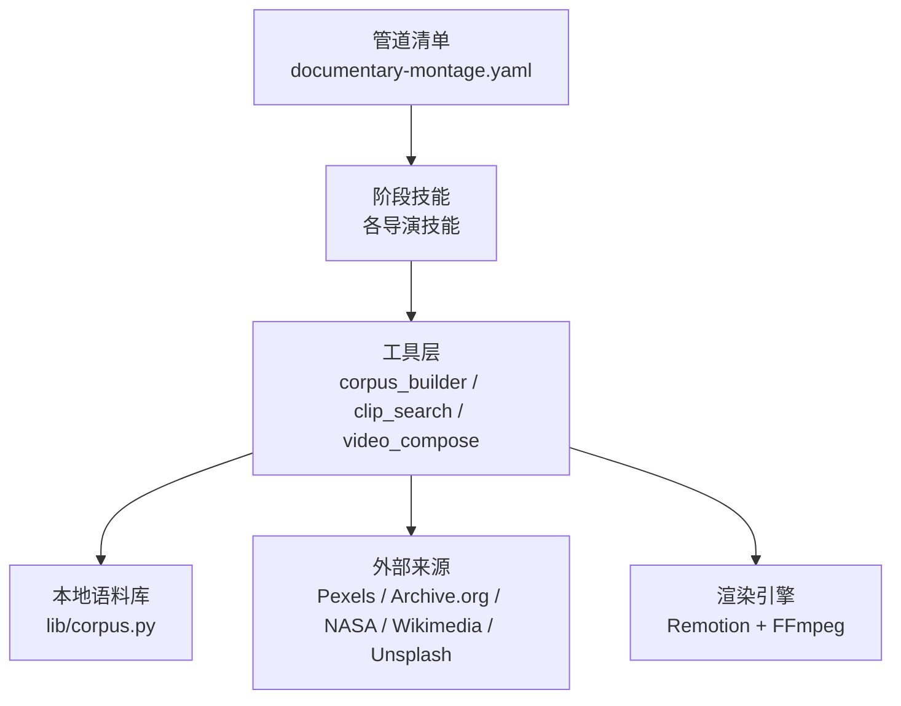
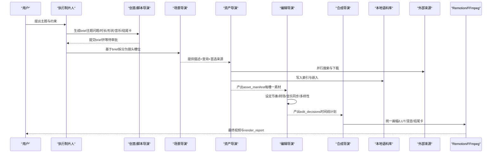
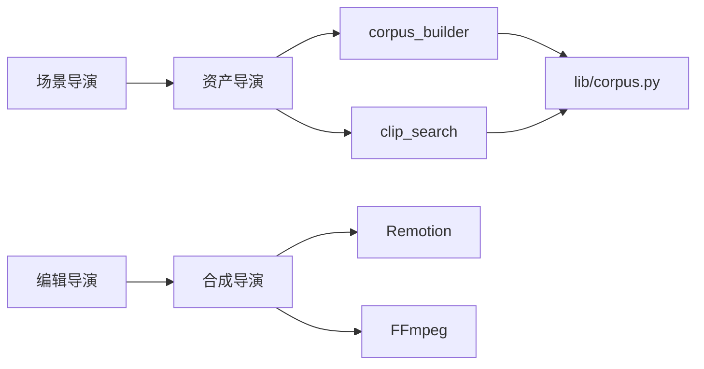

# 纪录片蒙太奇管道

<cite>
**本文引用的文件**
- [README.md](file://README.md)
- [documentary-montage.yaml](file://pipeline_defs/documentary-montage.yaml)
- [executive-producer.md](file://skills/pipelines/documentary-montage/executive-producer.md)
- [idea-director.md](file://skills/pipelines/documentary-montage/idea-director.md)
- [scene-director.md](file://skills/pipelines/documentary-montage/scene-director.md)
- [asset-director.md](file://skills/pipelines/documentary-montage/asset-director.md)
- [edit-director.md](file://skills/pipelines/documentary-montage/edit-director.md)
- [compose-director.md](file://skills/pipelines/documentary-montage/compose-director.md)
- [corpus.py](file://lib/corpus.py)
- [corpus_builder.py](file://tools/video/corpus_builder.py)
- [clip_search.py](file://tools/video/clip_search.py)
- [test_documentary_governance.py](file://tests/tools/test_documentary_governance.py)
</cite>

## 目录
1. [简介](#简介)
2. [项目结构](#项目结构)
3. [核心组件](#核心组件)
4. [架构总览](#架构总览)
5. [详细组件分析](#详细组件分析)
6. [依赖关系分析](#依赖关系分析)
7. [性能考量](#性能考量)
8. [故障排查指南](#故障排查指南)
9. [结论](#结论)
10. [附录](#附录)

## 简介
本技术文档围绕 OpenMontage 的“纪录片蒙太奇”管道，系统化阐述从真实素材收集、叙事结构构建、情感节奏控制、历史资料整合到纪实风格呈现的全流程。该管道以检索优先（retrieval-first）为核心：先构建可检索的本地素材语料库，再按主题与情绪组织镜头，最终通过统一调色与音频混音输出具有说服力的纪录片式蒙太奇作品。

在协作机制上，管道将制作角色映射为阶段导演：执行制片人负责总体编排与预算治理；脚本/创意导演负责主题问题、时长与音乐/结尾卡策略；场景导演将主题拆解为可检索的镜头槽位；资产导演负责跨多源采集与语义检索；编辑导演负责节奏、转场与音乐同步；合成导演负责统一画幅、LUT 调色与端到端渲染验证。

## 项目结构
OpenMontage 采用“清单 + 技能 + 工具”的分层组织：
- 管道清单定义阶段、产物、工具与质量门禁
- 技能文件指导 AI 代理在每个阶段如何工作
- 工具提供实际的检索、下载、嵌入、检索、剪辑与合成能力

图示来源
- [documentary-montage.yaml:1-179](file://pipeline_defs/documentary-montage.yaml#L1-L179)
- [corpus_builder.py:1-120](file://tools/video/corpus_builder.py#L1-L120)
- [clip_search.py:1-95](file://tools/video/clip_search.py#L1-L95)
- [corpus.py:1-40](file://lib/corpus.py#L1-L40)

章节来源
- [README.md:356-475](file://README.md#L356-L475)
- [documentary-montage.yaml:1-179](file://pipeline_defs/documentary-montage.yaml#L1-L179)

## 核心组件
- 管道清单（manifest）：定义阶段、产物、所需技能、工具与成功标准
- 阶段技能（director skills）：每个导演角色的操作规范、质量门禁与常见陷阱
- 语料库（Corpus）：项目级索引，包含视频/图片、缩略图、视觉与标签嵌入、元数据
- 语料构建器（CorpusBuilder）：跨多源搜索、下载、缩略图提取、CLIP 嵌入、索引持久化
- 检索接口（ClipSearch）：文本到片段排名、相似集合、多样性去重、统计与溯源查询
- 渲染与合成（video_compose）：Remotion 优先，FFmpeg 辅助，统一画幅、LUT、音频混音与结尾卡

章节来源
- [documentary-montage.yaml:45-179](file://pipeline_defs/documentary-montage.yaml#L45-L179)
- [corpus.py:44-88](file://lib/corpus.py#L44-L88)
- [corpus_builder.py:74-123](file://tools/video/corpus_builder.py#L74-L123)
- [clip_search.py:53-95](file://tools/video/clip_search.py#L53-L95)

## 架构总览
纪录片蒙太奇管道的端到端流程如下：

图示来源
- [documentary-montage.yaml:45-179](file://pipeline_defs/documentary-montage.yaml#L45-L179)
- [corpus_builder.py:239-461](file://tools/video/corpus_builder.py#L239-L461)
- [clip_search.py:186-229](file://tools/video/clip_search.py#L186-L229)
- [compose-director.md:87-107](file://skills/pipelines/documentary-montage/compose-director.md#L87-L107)

## 详细组件分析

### 执行制片人（Executive Producer）
- 职责：选择管道、设定预算上限、限制修订次数与运行时间；确保“检索优先”的哲学贯穿全流程
- 关键规则：强调并列蒙太奇（Kuleshov/Eisenstein），禁止把蒙太奇做成“动画幻灯片”；要求扩大搜索空间、让素材自己说话、用节奏传递信息

章节来源
- [executive-producer.md:1-39](file://skills/pipelines/documentary-montage/executive-producer.md#L1-L39)
- [documentary-montage.yaml:18-40](file://pipeline_defs/documentary-montage.yaml#L18-L40)

### 创意/脚本导演（Idea Director）
- 职责：提炼“主题问题”，固定情绪基调，确定时长与结构（单图扩展/前后对比/三幕/清单式）
- 强制项：音乐计划必须存在（除非用户明确放弃）；结尾卡必须存在（默认叠加模式）；运行时锁定 Remotion
- 产出：brief（含主题、基调、时长、形状、来源、音乐计划、结尾卡计划、时代混合偏好）

章节来源
- [idea-director.md:10-15](file://skills/pipelines/documentary-montage/idea-director.md#L10-L15)
- [idea-director.md:26-100](file://skills/pipelines/documentary-montage/idea-director.md#L26-L100)
- [idea-director.md:102-155](file://skills/pipelines/documentary-montage/idea-director.md#L102-L155)
- [idea-director.md:157-203](file://skills/pipelines/documentary-montage/idea-director.md#L157-L203)

### 场景导演（Scene Director）
- 职责：将主题问题分解为“可检索的镜头槽位”，每个槽位包含具体名词+形容词的描述、2-3条短查询、首选来源与英雄槽标记
- 时代感知：根据 era_mix 调整来源权重（现代/复古/任意）；儿童内容切换到 Pixabay 奇幻风格
- 产出：scene_plan（scenes[] 与 metadata.slots[]）

章节来源
- [scene-director.md:22-59](file://skills/pipelines/documentary-montage/scene-director.md#L22-L59)
- [scene-director.md:61-139](file://skills/pipelines/documentary-montage/scene-director.md#L61-L139)
- [scene-director.md:140-205](file://skills/pipelines/documentary-montage/scene-director.md#L140-L205)
- [scene-director.md:206-281](file://skills/pipelines/documentary-montage/scene-director.md#L206-L281)

### 资产导演（Asset Director）
- 双路径：
  - 标准路径：corpus_builder 批量构建语料 → clip_search.rank_for_slot 按槽检索 → 人工判断挑选
  - 快速路径：direct_clip_search 直接搜索并下载少量候选 → 缩略图浏览 → 映射到槽位
- 关键规则：先建库再挑选；语料只增不减；每槽唯一素材；避免重复使用；对弱匹配进行定向扩库；记录被拒选项原因
- 音乐处理：严格按 brief.music_plan 执行，不擅自替换

章节来源
- [asset-director.md:3-49](file://skills/pipelines/documentary-montage/asset-director.md#L3-L49)
- [asset-director.md:117-183](file://skills/pipelines/documentary-montage/asset-director.md#L117-L183)
- [asset-director.md:186-342](file://skills/pipelines/documentary-montage/asset-director.md#L186-L342)
- [asset-director.md:344-448](file://skills/pipelines/documentary-montage/asset-director.md#L344-L448)

### 编辑导演（Edit Director）
- 职责：决定入出点、转场、音乐同步、顺序与节奏；锁定 renderer_family = documentary-montage
- 节奏网格：依据 tone 表设置基础/最小/最大持留；英雄槽更长；总时长与 brief 一致
- 转场词汇：最多四种（cut/dissolve/fade_to_black/fade_in/out）；禁用花哨转场
- 一致性：统一画幅与 LUT 提示；相邻镜头避免主体/尺度/色彩/运动方向重复
- 结尾卡：叠加模式下计算 offset_seconds，使结尾卡淡出与片尾淡出对齐

章节来源
- [edit-director.md:23-40](file://skills/pipelines/documentary-montage/edit-director.md#L23-L40)
- [edit-director.md:59-96](file://skills/pipelines/documentary-montage/edit-director.md#L59-L96)
- [edit-director.md:98-152](file://skills/pipelines/documentary-montage/edit-director.md#L98-L152)
- [edit-director.md:153-227](file://skills/pipelines/documentary-montage/edit-director.md#L153-L227)
- [edit-director.md:228-316](file://skills/pipelines/documentary-montage/edit-director.md#L228-L316)

### 合成导演（Compose Director）
- 职责：将 edit_decisions 与 asset_manifest 渲染为最终视频；统一画幅、LUT 调色、音频混音与结尾卡
- 运行时约束：必须使用 Remotion；若不可用需上报而非静默降级
- 结尾卡：
  - 叠加模式：ProRes 4444 alpha 通道与 body 叠加
  - 拼接模式：黑底卡片追加至片尾
- 规格：H.264/yuv420p/CRF18/24fps/aac 192k；首尾帧校验；静音窗校验

章节来源
- [compose-director.md:12-19](file://skills/pipelines/documentary-montage/compose-director.md#L12-L19)
- [compose-director.md:69-107](file://skills/pipelines/documentary-montage/compose-director.md#L69-L107)
- [compose-director.md:111-151](file://skills/pipelines/documentary-montage/compose-director.md#L111-L151)
- [compose-director.md:153-257](file://skills/pipelines/documentary-montage/compose-director.md#L153-L257)
- [compose-director.md:258-341](file://skills/pipelines/documentary-montage/compose-director.md#L258-L341)

## 依赖关系分析
- 阶段依赖：idea → scene_plan → assets → edit → compose，每阶段产物作为下阶段输入
- 工具依赖：
  - corpus_builder 依赖 stock sources、CLIP、OpenCV/PIL、requests
  - clip_search 依赖 numpy、transformers、torch
  - compose 依赖 Remotion（主）与 FFmpeg（辅）
- 数据依赖：Corpus 维护 index.jsonl 与 embeddings.npy/tag_embeddings.npy 的一致性

图示来源
- [corpus_builder.py:239-461](file://tools/video/corpus_builder.py#L239-L461)
- [clip_search.py:186-229](file://tools/video/clip_search.py#L186-L229)
- [corpus.py:130-181](file://lib/corpus.py#L130-L181)
- [compose-director.md:87-107](file://skills/pipelines/documentary-montage/compose-director.md#L87-L107)

章节来源
- [documentary-montage.yaml:45-179](file://pipeline_defs/documentary-montage.yaml#L45-L179)
- [corpus.py:130-181](file://lib/corpus.py#L130-L181)

## 性能考量
- 语料规模：建议 8-12x 槽位数（例如 15 槽约 150 候选），避免过少导致检索无解或过多带来噪声
- 检索参数：tag_weight 0.3 平衡视觉与标签；motion_min 过滤静止片段；exclude_ids 防止重复
- 多样性：diversify 降低相邻镜头冗余；find_similar_set 用于“集合镜头”
- 缓存：共享 clip bytes 缓存减少重复下载；跳过已有 clip_id 提升重试效率
- 渲染：24fps 降采样均匀丢帧，避免插值伪影；CRF18 保证视觉无损

章节来源
- [asset-director.md:233-249](file://skills/pipelines/documentary-montage/asset-director.md#L233-L249)
- [asset-director.md:272-300](file://skills/pipelines/documentary-montage/asset-director.md#L272-L300)
- [asset-director.md:344-362](file://skills/pipelines/documentary-montage/asset-director.md#L344-L362)
- [corpus_builder.py:305-311](file://tools/video/corpus_builder.py#L305-L311)
- [compose-director.md:258-274](file://skills/pipelines/documentary-montage/compose-director.md#L258-L274)

## 故障排查指南
- 语料为空或过小：调用 stats 检查 rows/per_source/mean_motion_score；必要时扩库或重写查询
- 全部候选失败：corpus_builder 会返回错误与错误摘要；检查解码器与 CLIP 环境
- 检索弱匹配：score < 0.22 时重写查询并定向扩库；两次仍无效则上报
- 渲染失败：检查 asset_id→路径解析、容器编码（Archive.org 可能为 Matroska）、内存/超时（分段渲染后拼接）
- 运行时违规：compose 阶段若检测到 render_runtime 非 remotion，需上报并回提案阶段修正

章节来源
- [asset-director.md:250-271](file://skills/pipelines/documentary-montage/asset-director.md#L250-L271)
- [asset-director.md:327-342](file://skills/pipelines/documentary-montage/asset-director.md#L327-L342)
- [corpus_builder.py:395-461](file://tools/video/corpus_builder.py#L395-L461)
- [compose-director.md:12-19](file://skills/pipelines/documentary-montage/compose-director.md#L12-L19)
- [compose-director.md:368-384](file://skills/pipelines/documentary-montage/compose-director.md#L368-L384)
- [test_documentary_governance.py:222-243](file://tests/tools/test_documentary_governance.py#L222-L243)

## 结论
OpenMontage 的纪录片蒙太奇管道以“检索优先”和“阶段治理”为核心，将创作意图转化为可执行的素材采集、语义检索、节奏设计与统一合成流程。通过严格的质量门禁、审计轨迹与预算控制，系统在保证纪实风格的同时，最大化利用免费与开源资源，实现高质量、可复现的视频生产。

## 附录

### 纪录片制作的伦理准则、版权处理与事实核查
- 伦理准则
  - 尊重原始语境：避免断章取义或误导性的镜头组接
  - 透明标注：保留 provider、original_url、license 等溯源信息
  - 敏感内容审慎：涉及历史事件与社会议题时保持克制与客观
- 版权处理
  - 优先使用开放授权来源（如 Pexels、Pixabay、Archive.org、NASA、Wikimedia、Unsplash）
  - 记录每条素材的许可类型与归属，便于发布合规审查
- 事实核查
  - 在 idea 阶段进行网络研究，形成结构化 research brief
  - 在 edit 阶段对关键画面与旁白进行交叉验证，避免错误陈述
  - 对历史资料标注年代与来源，增强可信度

章节来源
- [README.md:382-404](file://README.md#L382-L404)
- [asset-director.md:433-448](file://skills/pipelines/documentary-montage/asset-director.md#L433-L448)

### 实际应用案例
- 新闻专题：聚焦当下社会热点，使用现代高清素材与快节奏剪辑，配合音乐与结尾卡强化观点
- 历史回顾：结合 Archive.org/NARA/Wikimedia 历史影像，采用复古色调与长持留营造庄重感
- 社会议题：通过并列蒙太奇呈现对比（如城市昼夜、消费与浪费），用节奏与转场表达立场

章节来源
- [README.md:111-117](file://README.md#L111-L117)
- [scene-director.md:140-169](file://skills/pipelines/documentary-montage/scene-director.md#L140-L169)
- [edit-director.md:153-176](file://skills/pipelines/documentary-montage/edit-director.md#L153-L176)