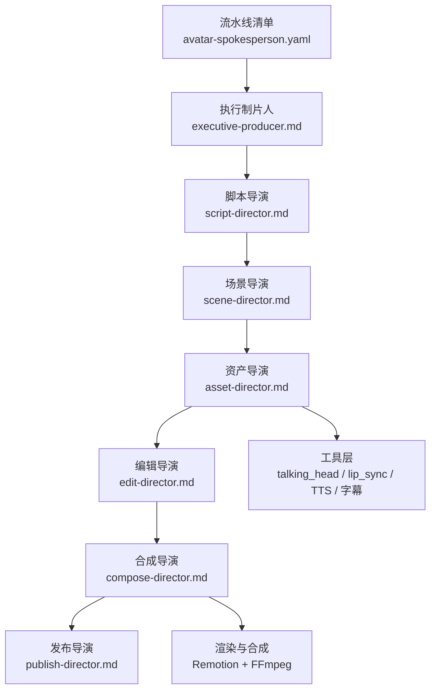
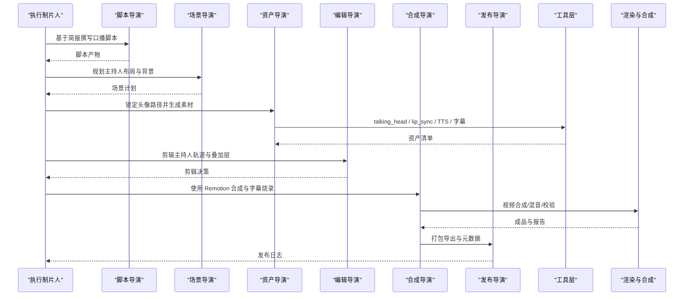
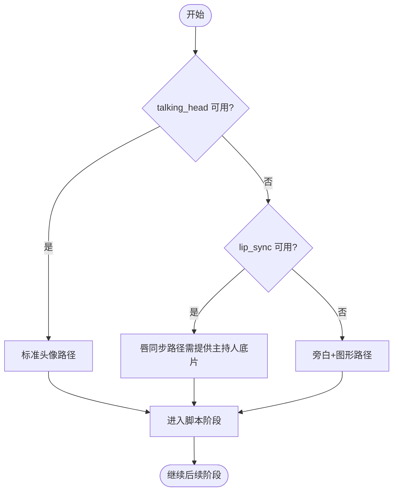
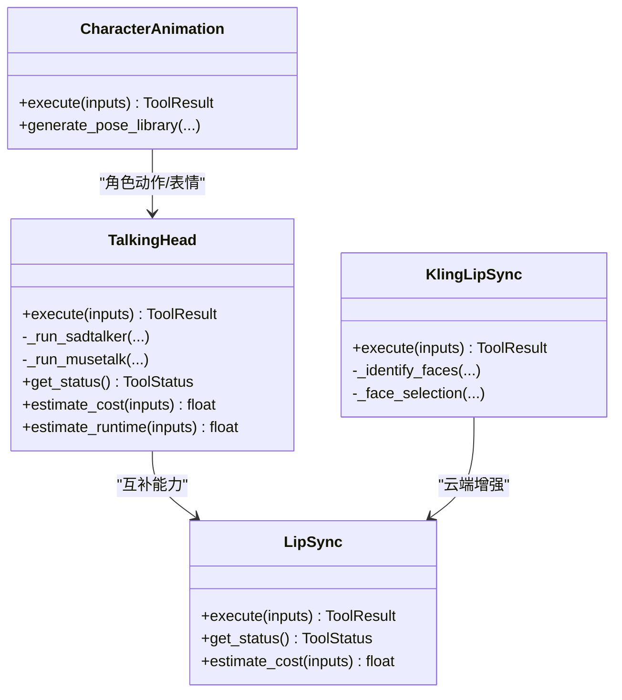
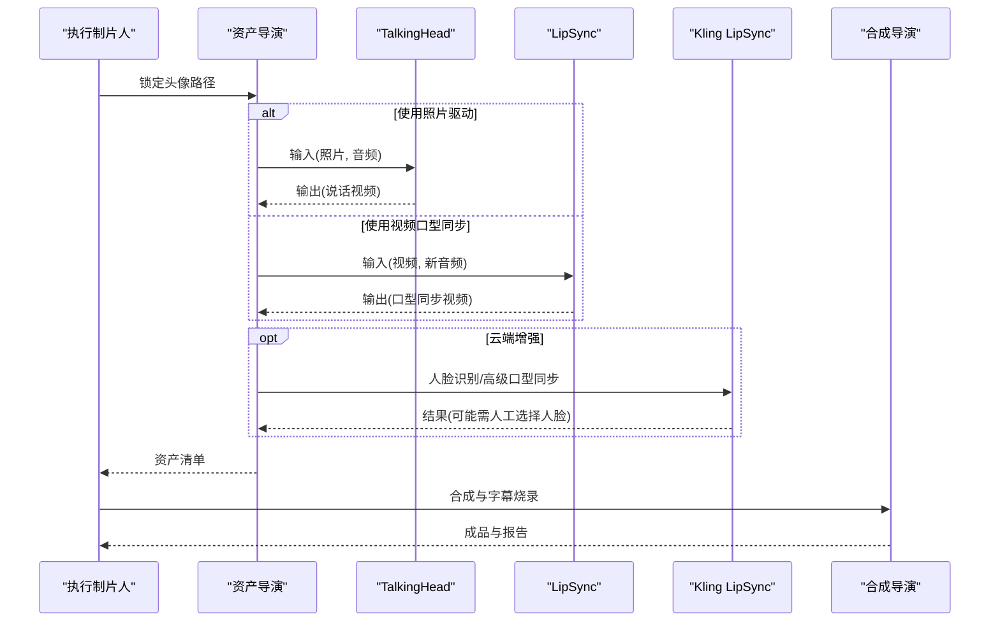
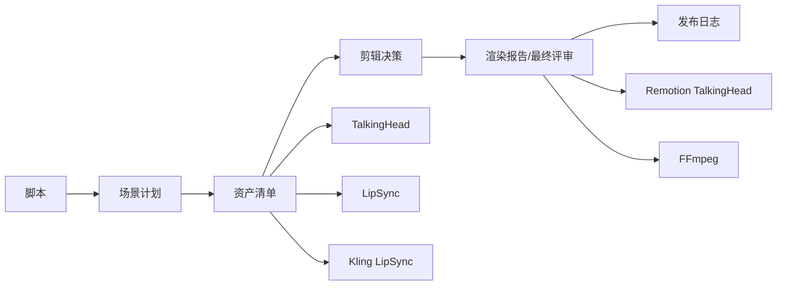

# 虚拟代言人管道

<cite>
**本文引用的文件**
- [README.md](file://README.md)
- [avatar-spokesperson.yaml](file://pipeline_defs/avatar-spokesperson.yaml)
- [executive-producer.md](file://skills/pipelines/avatar-spokesperson/executive-producer.md)
- [script-director.md](file://skills/pipelines/avatar-spokesperson/script-director.md)
- [scene-director.md](file://skills/pipelines/avatar-spokesperson/scene-director.md)
- [asset-director.md](file://skills/pipelines/avatar-spokesperson/asset-director.md)
- [edit-director.md](file://skills/pipelines/avatar-spokesperson/edit-director.md)
- [compose-director.md](file://skills/pipelines/avatar-spokesperson/compose-director.md)
- [publish-director.md](file://skills/pipelines/avatar-spokesperson/publish-director.md)
- [talking_head.py](file://tools/avatar/talking_head.py)
- [lip_sync.py](file://tools/avatar/lip_sync.py)
- [kling_lip_sync.py](file://tools/avatar/kling_lip_sync.py)
- [lip-sync-usage.md](file://skills/creative/lip-sync-usage.md)
- [character_animation.py](file://tools/character/character_animation.py)
</cite>

## 目录
1. [简介](#简介)
2. [项目结构](#项目结构)
3. [核心组件](#核心组件)
4. [架构总览](#架构总览)
5. [详细组件分析](#详细组件分析)
6. [依赖关系分析](#依赖关系分析)
7. [性能与质量](#性能与质量)
8. [故障排查指南](#故障排查指南)
9. [结论](#结论)
10. [附录](#附录)

## 简介
本技术文档聚焦 OpenMontage 的“虚拟代言人”（Avatar Spokesperson）管道，系统化说明从执行制片人到发布导演的七阶段协作机制，并深入解析虚拟数字人视频制作的核心技术：3D人物建模、面部表情驱动、口型同步、肢体动画、服装定制与环境渲染。同时给出质量标准、性能优化与部署方案，以及企业宣传、客户服务、教育培训等实际应用场景。

OpenMontage 采用“代理优先”的编排方式：以 YAML 清单定义流水线，以 Markdown 技能指导各阶段执行，通过工具注册表选择最佳供应商或本地模型，配合严格的质量门控与审计追踪，确保产出稳定可复现。

**章节来源**
- [README.md:356-475](file://README.md#L356-L475)

## 项目结构
虚拟代言人管道由以下关键部分组成：
- 流水线清单：定义阶段、产物、工具与审批门控
- 导演技能：每个阶段的执行规范与质量检查点
- 工具层：Talking Head、口型同步、TTS、字幕、合成与混音等
- 渲染与合成：Remotion TalkingHead 与字幕烧录、音频混合
- 质量治理：预合成校验、后渲染自检、预算与审计

**图表来源**
- [avatar-spokesperson.yaml:12-37](file://pipeline_defs/avatar-spokesperson.yaml#L12-L37)
- [executive-producer.md:18-45](file://skills/pipelines/avatar-spokesperson/executive-producer.md#L18-L45)

**章节来源**
- [avatar-spokesperson.yaml:1-207](file://pipeline_defs/avatar-spokesperson.yaml#L1-L207)
- [README.md:450-475](file://README.md#L450-L475)

## 核心组件
- 执行制片人（EP）：串行编排七阶段，维护累计状态、预算与问题日志；在 IDEA 阶段进行“无头像路径”的决策矩阵切换（talking_head → lip_sync → 旁白+图形）。
- 脚本导演：将简报转化为适合口播的短句、节拍与过渡，控制屏幕文字量，保证时长与语速匹配。
- 场景导演：锁定主持人布局、背景纪律与支持图层；当触发无头像路径时，转为全屏视觉+旁白的构图策略。
- 资产导演：锁定头像生成路径（talking_head 或 lip_sync），先出样本再批量生产；若无可用工具则走“旁白+图形”路径。
- 编辑导演：先切主持人轨道，再谨慎叠加支持图层，尊重口语节奏，明确 CTA 落点。
- 合成导演：强制使用 Remotion（TalkingHead + 字幕烧录），输出前验证口型、字幕位置与音频清晰度。
- 发布导演：清晰标注主版本与衍生版本，元数据面向受众与转化目标，保留风险备注。

**章节来源**
- [executive-producer.md:47-74](file://skills/pipelines/avatar-spokesperson/executive-producer.md#L47-L74)
- [script-director.md:13-60](file://skills/pipelines/avatar-spokesperson/script-director.md#L13-L60)
- [scene-director.md:14-56](file://skills/pipelines/avatar-spokesperson/scene-director.md#L14-L56)
- [asset-director.md:18-73](file://skills/pipelines/avatar-spokesperson/asset-director.md#L18-L73)
- [edit-director.md:9-41](file://skills/pipelines/avatar-spokesperson/edit-director.md#L9-L41)
- [compose-director.md:7-13](file://skills/pipelines/avatar-spokesperson/compose-director.md#L7-L13)
- [publish-director.md:9-38](file://skills/pipelines/avatar-spokesperson/publish-director.md#L9-L38)

## 架构总览
虚拟代言人管道的端到端流程如下：

**图表来源**
- [avatar-spokesperson.yaml:45-207](file://pipeline_defs/avatar-spokesperson.yaml#L45-L207)
- [compose-director.md:7-13](file://skills/pipelines/avatar-spokesperson/compose-director.md#L7-L13)

**章节来源**
- [avatar-spokesperson.yaml:45-207](file://pipeline_defs/avatar-spokesperson.yaml#L45-L207)

## 详细组件分析

### 执行制片人（EP）与七阶段协作
- 累计状态：记录流水线、风格、时长、预算、头像路径、旁白来源、CTA 类型与主持人构图。
- 决策矩阵：在 IDEA 阶段即判断 talking_head 是否可用；不可用则切换到 lip_sync（需已有主持人底片）或“旁白+图形”路径。
- 跨阶段检查：脚本自然度与时长、场景布局与字幕安全、资产质量与预算阈值、剪辑主次与 CTA、合成输出与口型漂移、发布元数据与封面。

**图表来源**
- [executive-producer.md:47-74](file://skills/pipelines/avatar-spokesperson/executive-producer.md#L47-L74)

**章节来源**
- [executive-producer.md:18-172](file://skills/pipelines/avatar-spokesperson/executive-producer.md#L18-L172)

### 脚本导演：为口播而写
- 短句、直接动词、每段一个观点、明确过渡。
- 将内容拆分为钩子、价值陈述、证明/特性、CTA 等节拍。
- 屏幕文字克制，仅用于产品名、短证据、CTA 与合规文本。
- 建议元数据：scene_copy_map、cta_language、pronunciation_notes 等。

**章节来源**
- [script-director.md:13-60](file://skills/pipelines/avatar-spokesperson/script-director.md#L13-L60)

### 场景导演：主持人布局与背景纪律
- 锁定主布局：居中全画幅、主持人+侧栏、下三分之一系统、品牌背景。
- 背景家族一致，变化标记真实段落转换。
- 支持图层：无、仅字幕、下三分、产品图、侧栏要点、CTA 卡片。
- 无头像回退：全屏视觉+旁白，每段需要强相关的主视觉。

**章节来源**
- [scene-director.md:14-76](file://skills/pipelines/avatar-spokesperson/scene-director.md#L14-L76)

### 资产导演：头像路径锁定与最小化支持套件
- 锁定头像路径：talking_head（照片+音频）、lip_sync（现有底片+新音频）、外部渲染。
- 先出样本再批量：TTS 样本与头像样本经确认后再批产，避免浪费。
- 解决旁白优先：若无可用的 TTS，标记阻塞而非假装成功。
- 最小支持套件：字幕、下三分、CTA 卡、背景/底片、可选支撑图。
- 无头像路径：跳过头像生成，产出旁白、主视觉、字幕、文本卡与背景。

**章节来源**
- [asset-director.md:18-95](file://skills/pipelines/avatar-spokesperson/asset-director.md#L18-L95)

### 编辑导演：主持人优先的剪辑
- 先切主持人轨道，再谨慎叠加支持图层。
- 尊重口语节奏，不为了“能量感”过度裁剪。
- 明确交付物与 CTA 落点，保持画面干净。

**章节来源**
- [edit-director.md:9-41](file://skills/pipelines/avatar-spokesperson/edit-director.md#L9-L41)

### 合成导演：Remotion TalkingHead 与字幕烧录
- 硬性约束：必须使用 Remotion（TalkingHead + remotion_caption_burn），不得静默切换到 HyperFrames。
- 输出前验证：口型/嘴部时序、字幕可读性、音频清晰度、帧内无遮挡。
- 记录验证发现至 render_report 的 verification_notes 与 warnings。

**章节来源**
- [compose-director.md:7-13](file://skills/pipelines/avatar-spokesperson/compose-director.md#L7-L13)
- [compose-director.md:24-62](file://skills/pipelines/avatar-spokesperson/compose-director.md#L24-L62)

### 发布导演：面向受众的包装与元数据
- 清晰区分主版本与衍生版本（竖屏、方形、语言变体、水印/审阅版）。
- 元数据围绕受众、CTA、报价名称、地区与缩略图概念。
- 保留风险备注（如可见的口型风险），便于下游团队处理。

**章节来源**
- [publish-director.md:9-38](file://skills/pipelines/avatar-spokesperson/publish-director.md#L9-L38)

### 核心技术：3D人物建模、表情驱动、口型同步、肢体动画、服装定制、环境渲染
- 3D人物建模与肢体动画：通过角色绑定与姿态库生成基础动作（idle、blink、look、surprise 等），结合动作循环（walk、breathe）实现连贯表演。
- 面部表情驱动与口型同步：
  - 照片驱动说话：talking_head（SadTalker/MuseTalk）根据音频驱动面部与头部运动。
  - 视频口型同步：lip_sync（Wav2Lip/Wav2Lip-GAN）将新音频与原有视频口型对齐，适用于配音与本地化。
  - 云端增强：Kling 官方接口支持人脸识别与高级口型同步，必要时引导人工选择人脸。
- 服装定制与环境渲染：通过背景家族与品牌元素统一视觉；在合成阶段叠加品牌背景、UI 截图或产品图，确保主持人与信息层级清晰。
- 多语言支持与实时交互：借助多 TTS 提供商与字幕生成，快速产出多语言版本；在交互场景中，可将 TalkingHead 作为实时讲解层叠加图表或演示画面。

**图表来源**
- [talking_head.py:29-105](file://tools/avatar/talking_head.py#L29-L105)
- [lip_sync.py:36-108](file://tools/avatar/lip_sync.py#L36-L108)
- [kling_lip_sync.py:199-223](file://tools/avatar/kling_lip_sync.py#L199-L223)
- [character_animation.py:137-367](file://tools/character/character_animation.py#L137-L367)

**章节来源**
- [talking_head.py:29-259](file://tools/avatar/talking_head.py#L29-L259)
- [lip_sync.py:36-232](file://tools/avatar/lip_sync.py#L36-L232)
- [kling_lip_sync.py:199-223](file://tools/avatar/kling_lip_sync.py#L199-L223)
- [lip-sync-usage.md:1-41](file://skills/creative/lip-sync-usage.md#L1-L41)
- [character_animation.py:137-367](file://tools/character/character_animation.py#L137-L367)

### 工作流序列：从脚本到成片的调用链

**图表来源**
- [asset-director.md:18-73](file://skills/pipelines/avatar-spokesperson/asset-director.md#L18-L73)
- [talking_head.py:142-173](file://tools/avatar/talking_head.py#L142-L173)
- [lip_sync.py:146-232](file://tools/avatar/lip_sync.py#L146-L232)
- [kling_lip_sync.py:199-223](file://tools/avatar/kling_lip_sync.py#L199-L223)
- [compose-director.md:24-62](file://skills/pipelines/avatar-spokesperson/compose-director.md#L24-L62)

## 依赖关系分析
- 阶段依赖：idea → script → scene_plan → assets → edit → compose → publish，前一阶段产物为下一阶段必需输入。
- 工具依赖：
  - 头像生成：talking_head（本地 GPU，SadTalker/MuseTalk）
  - 口型同步：lip_sync（Wav2Lip/Wav2Lip-GAN）
  - 云端增强：Kling 官方接口的人脸识别与高级口型同步
  - 合成：Remotion TalkingHead 与 remotion_caption_burn，FFmpeg 编码与混音
- 运行时约束：avatar-spokesperson 强制 Remotion，禁止静默切换至 HyperFrames。

**图表来源**
- [avatar-spokesperson.yaml:45-207](file://pipeline_defs/avatar-spokesperson.yaml#L45-L207)
- [compose-director.md:7-13](file://skills/pipelines/avatar-spokesperson/compose-director.md#L7-L13)

**章节来源**
- [avatar-spokesperson.yaml:45-207](file://pipeline_defs/avatar-spokesperson.yaml#L45-L207)

## 性能与质量
- 性能特征
  - 本地 GPU 推理：talking_head 与 lip_sync 依赖 CUDA 与 ffmpeg，典型耗时数十秒到数分钟（取决于音频长度与分辨率）。
  - 云端增强：Kling 接口支持人脸识别与高级口型同步，必要时引导人工选择人脸，提升一致性。
  - 渲染引擎：Remotion 负责 TalkingHead 与字幕烧录，FFmpeg 负责编码与混音。
- 质量标准
  - 预合成校验：防止“幻灯片式”输出，确保交付承诺与渲染器可用性。
  - 后渲染自检：ffprobe 验证、帧采样、音频电平分析、字幕存在性与口型漂移检查。
  - 预算治理：执行前估算、预留、结算；按动作设置审批阈值与总预算上限。
  - 决策审计：每次供应商选择、风格与降级均记录原因与备选。
- 优化建议
  - 草稿阶段降低分辨率或使用 resize_factor=2 加速。
  - 先出样本再批量，避免无效成本。
  - 严格控制屏幕文字量与叠加层，避免遮挡口部与下巴区域。
  - 长片段口型同步需抽样检查漂移与面颊伪影。

**章节来源**
- [talking_head.py:131-136](file://tools/avatar/talking_head.py#L131-L136)
- [lip_sync.py:126-127](file://tools/avatar/lip_sync.py#L126-L127)
- [lip-sync-usage.md:6-15](file://skills/creative/lip-sync-usage.md#L6-L15)
- [compose-director.md:40-62](file://skills/pipelines/avatar-spokesperson/compose-director.md#L40-L62)
- [README.md:652-686](file://README.md#L652-L686)

## 故障排查指南
- 常见错误与定位
  - 环境变量缺失：SADTALKER_PATH 或 WAV2LIP_PATH 未设置导致工具不可用。
  - 模型权重缺失：Wav2Lip checkpoints 不存在导致推理失败。
  - 输入文件缺失：图片/音频/视频路径不存在。
  - 超时：口型同步超过 600 秒限制。
  - 运行时约束：avatar-spokesperson 必须使用 Remotion，否则停止并提示。
- 处理步骤
  - 检查 get_status 返回与安装指引，补齐环境与依赖。
  - 核对输入路径与权限，确保文件存在且可读取。
  - 对长音频/高分辨率任务降低参数或分批处理。
  - 遇到云端人脸识别需人工选择人脸时，按返回字段引导用户完成选择。
  - 若触发“旁白+图形”路径，确保 TTS 可用并生成主视觉与字幕。

**章节来源**
- [talking_head.py:111-125](file://tools/avatar/talking_head.py#L111-L125)
- [lip_sync.py:110-124](file://tools/avatar/lip_sync.py#L110-L124)
- [lip_sync.py:177-208](file://tools/avatar/lip_sync.py#L177-L208)
- [kling_lip_sync.py:199-223](file://tools/avatar/kling_lip_sync.py#L199-L223)
- [compose-director.md:7-13](file://skills/pipelines/avatar-spokesperson/compose-director.md#L7-L13)

## 结论
OpenMontage 的虚拟代言人管道以严格的阶段划分、清晰的导演职责与强大的工具生态，实现了从脚本到成品的端到端自动化生产。通过“执行制片人”的集中编排与质量门控，系统在头像路径选择、口型同步、字幕与音频质量等方面提供了稳定的保障。结合 Remotion TalkingHead 与 FFmpeg 的合成能力，以及云端增强接口，该管道能够高效产出高质量的企业宣传、客户服务与教育培训视频。

## 附录
- 实际应用案例
  - 企业宣传：品牌宣传片、产品发布预告、高管致辞；强调主持人优先、品牌背景与 CTA 落地。
  - 客户服务：常见问题解答、操作指引、多语言客服视频；利用多 TTS 与字幕快速本地化。
  - 教育培训：课程讲解、知识科普、内部培训；结合图表与演示画面，TalkingHead 作为讲解层。
- 部署方案
  - 本地 GPU：安装 SadTalker/Wav2Lip，配置环境变量与依赖，启用本地推理。
  - 云端增强：配置 Kling API Key，启用人脸识别与高级口型同步。
  - 渲染与合成：Node.js + Remotion，FFmpeg 编码与混音；遵循 Remotion 硬性约束。
- 扩展方向
  - 3D 角色与表情：结合角色绑定与姿态库，丰富表情与肢体动作。
  - 实时交互：将 TalkingHead 作为实时讲解层，叠加 UI 演示与数据可视化。
  - 多模态融合：图像/视频/音频/字幕/音乐一体化编排，形成完整的内容工厂。