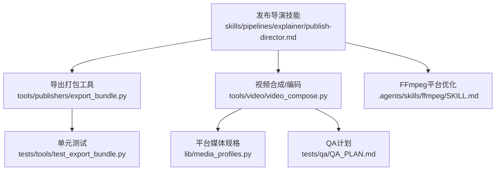
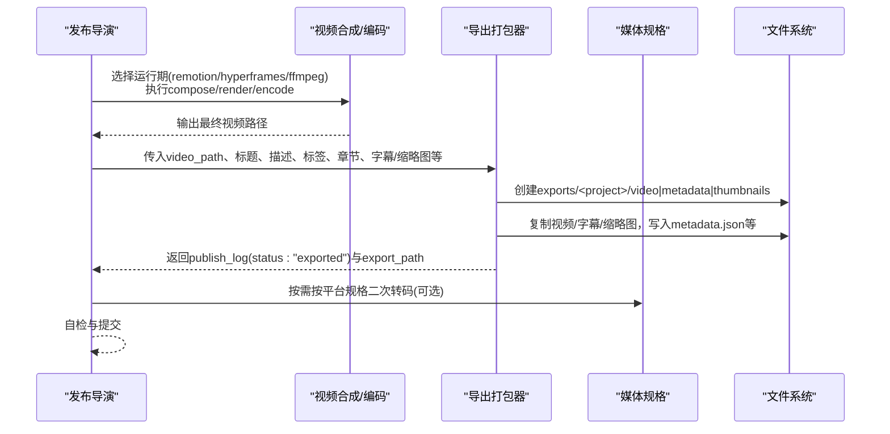
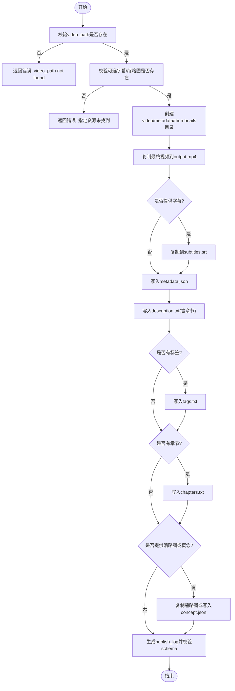
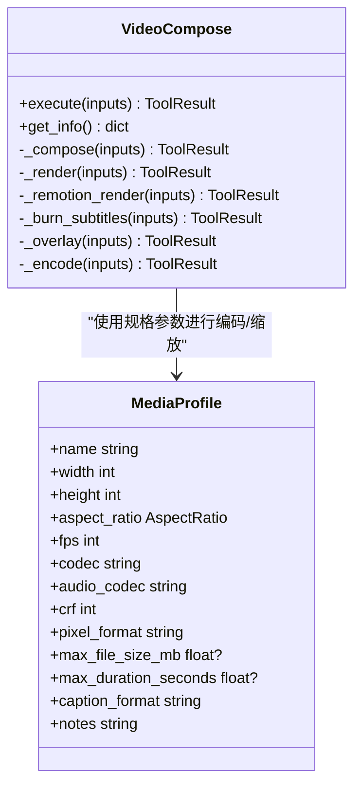
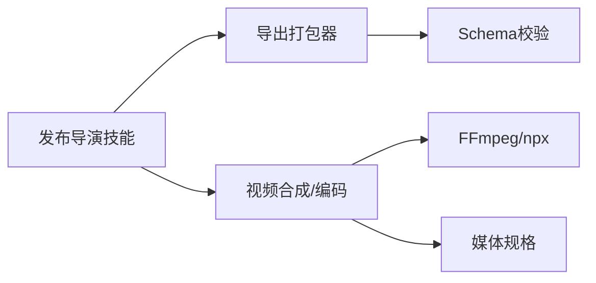

# 发布导演

<cite>
**本文引用的文件**
- [export_bundle.py](file://tools/publishers/export_bundle.py)
- [publish-director.md](file://skills/pipelines/explainer/publish-director.md)
- [video_compose.py](file://tools/video/video_compose.py)
- [media_profiles.py](file://lib/media_profiles.py)
- [test_export_bundle.py](file://tests/tools/test_export_bundle.py)
- [QA_PLAN.md](file://tests/qa/QA_PLAN.md)
- [SKILL.md (ffmpeg)](file://.agents/skills/ffmpeg/SKILL.md)
</cite>

## 目录
1. [简介](#简介)
2. [项目结构](#项目结构)
3. [核心组件](#核心组件)
4. [架构总览](#架构总览)
5. [详细组件分析](#详细组件分析)
6. [依赖关系分析](#依赖关系分析)
7. [性能与质量保障](#性能与质量保障)
8. [故障排查指南](#故障排查指南)
9. [结论](#结论)
10. [附录](#附录)

## 简介
本文件面向“发布导演”角色，聚焦其在OpenMontage角色动画管道中的最终职责：成品打包、格式转换、分发准备与质量验证。文档将说明不同发布目标（Web播放、移动设备、社交媒体与视频平台）的适配策略；阐述发布前的质量保证流程（完整性检查、兼容性测试、性能验证与安全扫描）；并给出多种输出格式的生成方法（MP4、WebM、GIF、短视频格式与交互式媒体），以及自动化脚本、批量处理与部署环境配置要点。

## 项目结构
围绕发布导演的关键代码与技能位于以下位置：
- 发布打包工具：tools/publishers/export_bundle.py
- 发布导演技能：skills/pipelines/explainer/publish-director.md
- 视频合成与编码：tools/video/video_compose.py
- 平台媒体规格：lib/media_profiles.py
- 单元测试与契约：tests/tools/test_export_bundle.py
- QA计划与验收：tests/qa/QA_PLAN.md
- FFmpeg平台优化参考：.agents/skills/ffmpeg/SKILL.md

图表来源
- [publish-director.md:86-114](file://skills/pipelines/explainer/publish-director.md#L86-L114)
- [export_bundle.py:39-69](file://tools/publishers/export_bundle.py#L39-L69)
- [video_compose.py:58-78](file://tools/video/video_compose.py#L58-L78)
- [media_profiles.py:40-128](file://lib/media_profiles.py#L40-L128)
- [test_export_bundle.py:27-36](file://tests/tools/test_export_bundle.py#L27-L36)
- [QA_PLAN.md:20-26](file://tests/qa/QA_PLAN.md#L20-L26)

章节来源
- [publish-director.md:1-174](file://skills/pipelines/explainer/publish-director.md#L1-L174)
- [export_bundle.py:1-308](file://tools/publishers/export_bundle.py#L1-L308)
- [video_compose.py:1-800](file://tools/video/video_compose.py#L1-L800)
- [media_profiles.py:1-166](file://lib/media_profiles.py#L1-L166)
- [test_export_bundle.py:1-155](file://tests/tools/test_export_bundle.py#L1-L155)
- [QA_PLAN.md:1-61](file://tests/qa/QA_PLAN.md#L1-L61)
- [SKILL.md (ffmpeg):301-349](file://.agents/skills/ffmpeg/SKILL.md#L301-L349)

## 核心组件
- 导出打包器（ExportBundle）
  - 能力：package_export、write_publish_log
  - 行为：本地离线打包，复制最终渲染视频与可选字幕/缩略图，写入metadata.json、chapters.txt、description.txt、tags.txt等，并产出schema校验通过的publish_log
  - 输入：video_path、title、可选subtitles_path/thumbnail_path或thumbnail_concept、platform、visibility、timestamp等
  - 输出：export_path、files_written、publish_log
- 发布导演技能（Publish Director）
  - 职责：收集上下文、生成SEO元数据、创建缩略图概念、制作章节标记、调用导出打包器、构建并发布日志、自我评估与提交
- 视频合成与编码（VideoCompose）
  - 能力：compose、render、remotion_render、burn_subtitles、overlay、encode
  - 路由：根据edit_decisions.render_runtime选择Remotion/HyperFrames/FFmpeg
  - 支持：按媒体规格进行分辨率、帧率、编码参数调整；可烧录字幕、叠加素材、混音替换
- 媒体规格（MediaProfiles）
  - 定义多平台规格：YouTube横屏/4K/Shorts、Instagram Reels/Feed、TikTok、LinkedIn、Cinematic、通用HD
  - 提供ffmpeg输出参数生成函数

章节来源
- [export_bundle.py:39-127](file://tools/publishers/export_bundle.py#L39-L127)
- [publish-director.md:17-114](file://skills/pipelines/explainer/publish-director.md#L17-L114)
- [video_compose.py:58-232](file://tools/video/video_compose.py#L58-L232)
- [media_profiles.py:22-166](file://lib/media_profiles.py#L22-L166)

## 架构总览
发布导演在管道末尾协调“内容就绪”到“可分发包”的交付过程。其核心流程如下：

图表来源
- [publish-director.md:86-114](file://skills/pipelines/explainer/publish-director.md#L86-L114)
- [export_bundle.py:158-285](file://tools/publishers/export_bundle.py#L158-L285)
- [video_compose.py:337-360](file://tools/video/video_compose.py#L337-L360)
- [media_profiles.py:155-166](file://lib/media_profiles.py#L155-L166)

## 详细组件分析

### 导出打包器（ExportBundle）
- 设计要点
  - 纯本地、确定性、无网络依赖，适合离线打包与审计
  - 严格校验输入（如提供的字幕/缩略图必须存在），失败即快速返回错误
  - 默认导出目录遵循项目约定：若渲染位于projects/<name>/renders，则导出至同级的exports
  - 输出包含：video/output.mp4、metadata/metadata.json、metadata/chapters.txt、metadata/description.txt、metadata/tags.txt、thumbnails/concept.json或实际缩略图
  - 生成的publish_log通过schema校验，确保后续阶段一致性
- 关键流程
  - 校验video_path与可选资源存在性
  - 创建目录结构并复制/写入文件
  - 格式化章节时间戳为“m:ss”或“h:mm:ss”
  - 生成metadata.json与可直接粘贴的描述文本
  - 生成publish_log并返回export_path与files_written

图表来源
- [export_bundle.py:158-285](file://tools/publishers/export_bundle.py#L158-L285)

章节来源
- [export_bundle.py:39-127](file://tools/publishers/export_bundle.py#L39-L127)
- [export_bundle.py:158-285](file://tools/publishers/export_bundle.py#L158-L285)
- [test_export_bundle.py:27-36](file://tests/tools/test_export_bundle.py#L27-L36)
- [test_export_bundle.py:47-149](file://tests/tools/test_export_bundle.py#L47-L149)

### 发布导演技能（Publish Director）
- 职责范围
  - 收集提案、渲染报告与脚本信息，生成SEO标题、描述、标签、话题标签
  - 基于风格手册生成缩略图概念
  - 从脚本段落生成章节标记
  - 调用导出打包器完成打包，并持久化publish_log
  - 自我评估（SEO质量、描述完整性、缩略图吸引力、导出包完备性、平台适配度）
- 注意事项
  - 导出打包器仅做本地打包，不上传；网络发布由其他publish能力提供者负责
  - publish_log字段受schema约束，不得随意扩展

章节来源
- [publish-director.md:17-114](file://skills/pipelines/explainer/publish-director.md#L17-L114)
- [publish-director.md:116-157](file://skills/pipelines/explainer/publish-director.md#L116-L157)

### 视频合成与编码（VideoCompose）
- 运行期路由
  - remotion：React场景渲染，适合图文卡片、图表、转场等复杂效果
  - hyperframes：HTML/CSS/GSAP渲染，适合动效排版、产品宣传、网站转视频
  - ffmpeg：纯视频剪辑、拼接、转码、字幕烧录、叠加
- 能力与操作
  - compose：低层拼接、音频混合、字幕烧录
  - render：高层编排，自动路由到Remotion或FFmpeg
  - encode：按媒体规格重编码
  - burn_subtitles/overlay：字幕烧录与素材叠加
- 媒体规格应用
  - 可通过profile名称（如youtube_landscape、tiktok、instagram_reels）统一控制分辨率、帧率、编码参数
  - 支持compose_target自定义宽高与fit模式（pad/cover）

图表来源
- [video_compose.py:58-232](file://tools/video/video_compose.py#L58-L232)
- [media_profiles.py:22-128](file://lib/media_profiles.py#L22-L128)

章节来源
- [video_compose.py:1-800](file://tools/video/video_compose.py#L1-L800)
- [media_profiles.py:1-166](file://lib/media_profiles.py#L1-L166)

### 平台适配与格式要求
- 视频平台
  - YouTube横屏/4K：16:9，H.264(AAC)，推荐CRF较低以保质量
  - YouTube Shorts：9:16竖屏，时长限制约60秒
  - Instagram Reels/Feed：竖屏或方形，时长与文件大小限制
  - TikTok：竖屏为主，时长可达10分钟，注意文件大小上限
  - LinkedIn：横屏优先，AAC音频，时长建议不超过10分钟
- Web与嵌入
  - 网页优化MP4：H.264 Baseline/Level 3.0，小尺寸、faststart
  - WebM替代：VP9+Opus，更优压缩比与浏览器兼容
- GIF预览/缩略
  - 高质GIF：调色板生成+降采样，短时长片段
- 移动端
  - 竖屏优先（9:16），封面可读性、字幕安全区避免裁切

章节来源
- [media_profiles.py:40-128](file://lib/media_profiles.py#L40-L128)
- [SKILL.md (ffmpeg):301-349](file://.agents/skills/ffmpeg/SKILL.md#L301-L349)

## 依赖关系分析
- ExportBundle依赖
  - 标准库文件操作（shutil、json、pathlib、datetime）
  - schema校验（schemas.artifacts.validate_artifact）
  - 无外部网络依赖，纯本地打包
- VideoCompose依赖
  - 外部命令：ffmpeg、npx（Remotion/HyperFrames）
  - 运行时检测：ffmpeg可用性、Remotion/HyperFrames可用性与node_modules安装状态
  - 媒体规格模块：lib.media_profiles
- 发布导演技能
  - 消费上述工具能力，组织工作流并产出publish_log

图表来源
- [export_bundle.py:26-36](file://tools/publishers/export_bundle.py#L26-L36)
- [video_compose.py:234-253](file://tools/video/video_compose.py#L234-L253)
- [media_profiles.py:155-166](file://lib/media_profiles.py#L155-L166)

章节来源
- [export_bundle.py:26-69](file://tools/publishers/export_bundle.py#L26-L69)
- [video_compose.py:234-335](file://tools/video/video_compose.py#L234-L335)
- [media_profiles.py:131-166](file://lib/media_profiles.py#L131-L166)

## 性能与质量保障
- 完整性检查
  - 导出前确认video_path与可选资源存在；缺失即失败，避免半成品发布
  - 导出后校验publish_log schema，确保字段合规
- 兼容性测试
  - 使用媒体规格对目标平台进行分辨率、帧率、编码参数适配
  - 针对移动端与社交平台，采用竖屏/方形比例与安全的字幕区域
- 性能验证
  - 使用ffprobe检查分辨率、fps、duration、codec等元信息
  - 对长视频与高分辨率输出，合理设置CRF与preset平衡质量与体积
- 安全扫描
  - 审查外部命令注入风险（ffmpeg/npx参数）
  - 对上传类能力进行权限与回调URL校验（如callback_url）
- 验收流程
  - 依据QA计划，分阶段运行工具与端到端测试，人工审阅音视频与视觉质量

章节来源
- [export_bundle.py:158-171](file://tools/publishers/export_bundle.py#L158-L171)
- [export_bundle.py:269-275](file://tools/publishers/export_bundle.py#L269-L275)
- [video_compose.py:364-393](file://tools/video/video_compose.py#L364-L393)
- [QA_PLAN.md:20-26](file://tests/qa/QA_PLAN.md#L20-L26)

## 故障排查指南
- 常见错误
  - video_path不存在：检查渲染输出路径与命名
  - 字幕/缩略图路径无效：确保路径存在且可访问
  - 运行期不可用：检查ffmpeg/npx与node_modules安装状态
  - 平台规格未知：确认profile名称在ALL_PROFILES中
- 定位步骤
  - 查看ToolResult.error与files_written，确认失败点
  - 使用ffprobe检查输出文件的容器、编码、时长、声道
  - 对照QA计划逐项验证音频、图像、视频与设计智能
- 修复建议
  - 修正路径与权限问题
  - 安装缺失依赖（ffmpeg、Node.js、npm包）
  - 调整媒体规格与编码参数以满足平台限制

章节来源
- [export_bundle.py:158-171](file://tools/publishers/export_bundle.py#L158-L171)
- [video_compose.py:234-253](file://tools/video/video_compose.py#L234-L253)
- [media_profiles.py:142-147](file://lib/media_profiles.py#L142-L147)
- [QA_PLAN.md:20-26](file://tests/qa/QA_PLAN.md#L20-L26)

## 结论
发布导演在OpenMontage管道中承担“成品打包、格式转换、分发准备与质量验证”的最终职责。通过ExportBundle实现本地离线打包与标准化publish_log，结合VideoCompose的多运行期路由与MediaProfiles的平台规格，能够高效适配Web、移动、社交与视频平台的多样化需求。配合QA计划与平台优化实践，可确保发布物的完整性、兼容性与性能表现。

## 附录
- 多格式输出建议
  - MP4：H.264+AAC，faststart，按平台CRF与分辨率设定
  - WebM：VP9+Opus，适合网页嵌入与跨浏览器兼容
  - GIF：短片段+调色板生成，用于预览与缩略
  - 短视频：竖屏9:16，时长与大小符合平台限制
  - 交互式媒体：Remotion/HyperFrames渲染，适合动态图文与动效排版
- 自动化与批量处理
  - 使用VideoCompose的encode操作批量转码至目标规格
  - 使用ExportBundle批量打包多个项目导出目录
  - 结合QA计划脚本进行回归测试与质量门禁
- 部署环境配置
  - 安装ffmpeg与Node.js（npx），确保Remotion/HyperFrames可用
  - 配置媒体规格与平台偏好，统一输出规范
  - 建立CI流水线：编译/渲染→转码→打包→QA→归档

章节来源
- [video_compose.py:58-232](file://tools/video/video_compose.py#L58-L232)
- [media_profiles.py:40-128](file://lib/media_profiles.py#L40-L128)
- [SKILL.md (ffmpeg):301-349](file://.agents/skills/ffmpeg/SKILL.md#L301-L349)
- [QA_PLAN.md:41-61](file://tests/qa/QA_PLAN.md#L41-L61)