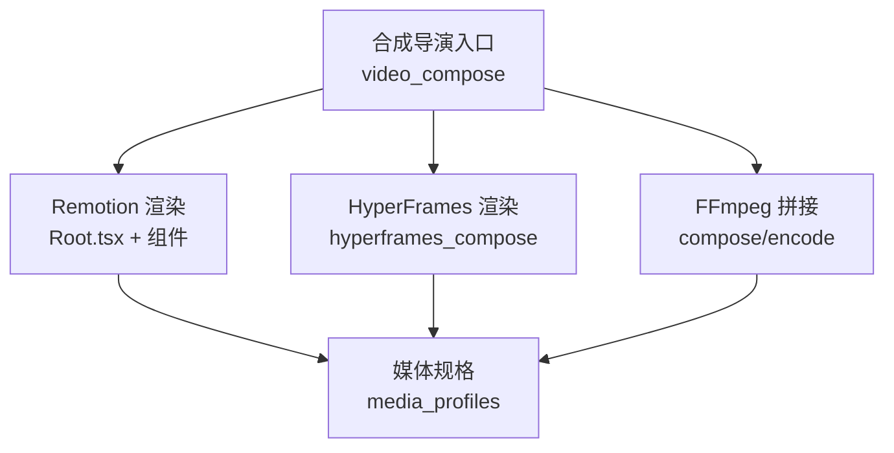
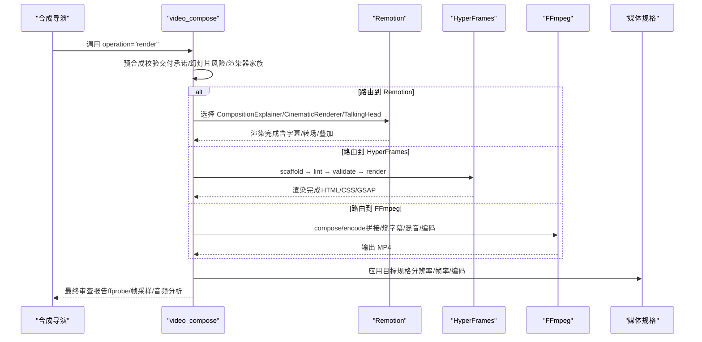
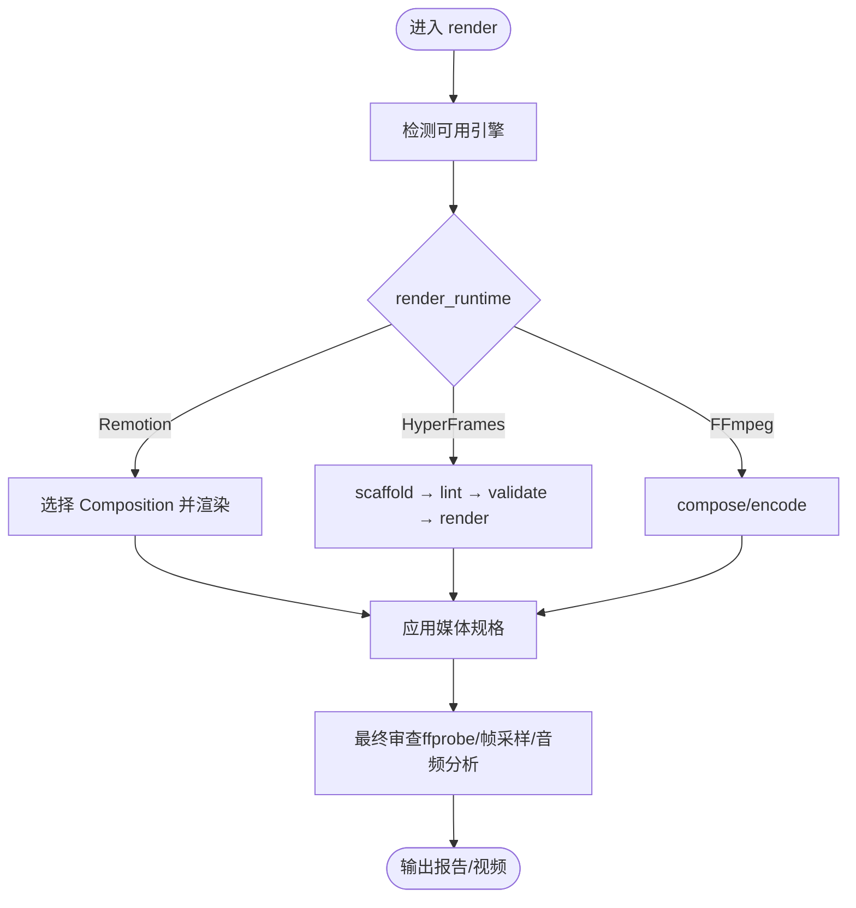
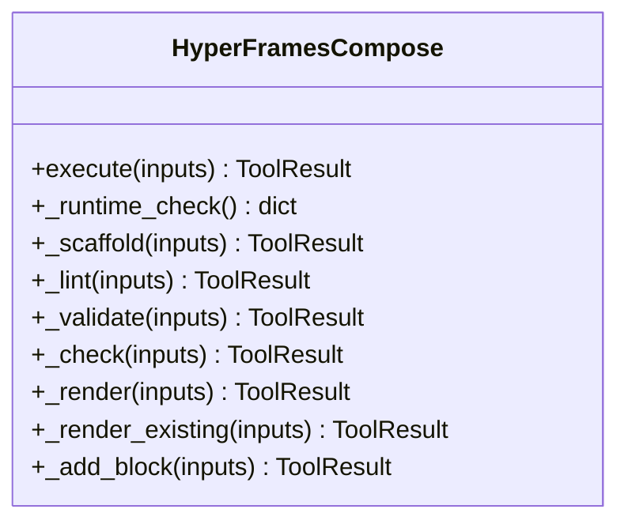
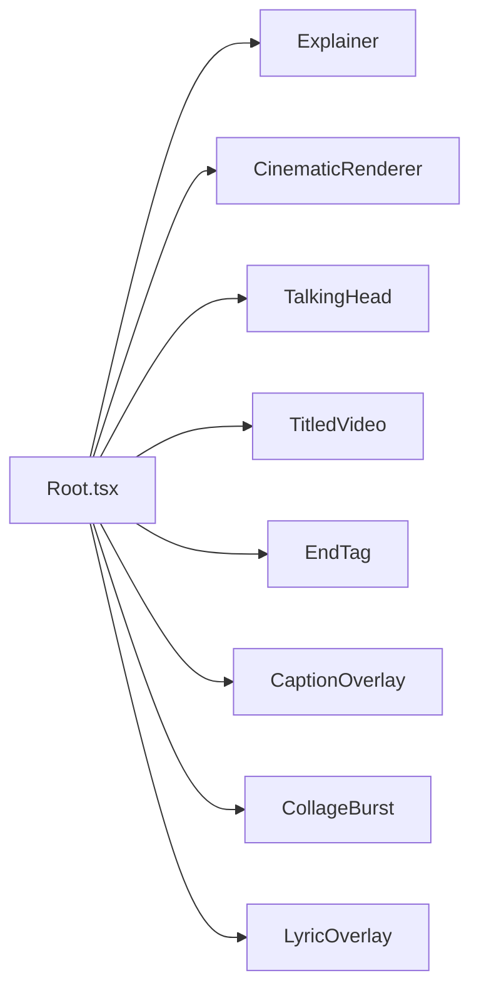
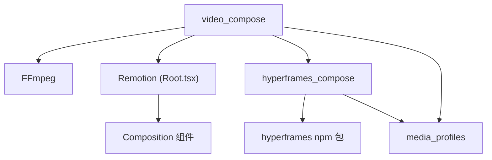

# 合成导演

<cite>
**本文引用的文件**
- [README.md](file://README.md)
- [PROJECT_CONTEXT.md](file://PROJECT_CONTEXT.md)
- [tools/video/video_compose.py](file://tools/video/video_compose.py)
- [tools/video/hyperframes_compose.py](file://tools/video/hyperframes_compose.py)
- [lib/media_profiles.py](file://lib/media_profiles.py)
- [remotion-composer/src/Root.tsx](file://remotion-composer/src/Root.tsx)
- [remotion-composer/src/CinematicRenderer.tsx](file://remotion-composer/src/CinematicRenderer.tsx)
- [remotion-composer/src/Explainer.tsx](file://remotion-composer/src/Explainer.tsx)
- [remotion-composer/src/CollageBurst.tsx](file://remotion-composer/src/CollageBurst.tsx)
- [skills/pipelines/cinematic/compose-director.md](file://skills/pipelines/cinematic/compose-director.md)
- [skills/pipelines/animation/compose-director.md](file://skills/pipelines/animation/compose-director.md)
- [.agents/skills/hyperframes-animation/adapters/gsap-transforms-and-perf.md](file://.agents/skills/hyperframes-animation/adapters/gsap-transforms-and-perf.md)
- [.agents/skills/hyperframes-animation/adapters/css-animations.md](file://.agents/skills/hyperframes-animation/adapters/css-animations.md)
- [.agents/skills/hyperframes-animation/adapters/animejs.md](file://.agents/skills/hyperframes-animation/adapters/animejs.md)
- [.agents/skills/hyperframes-animation/adapters/waapi.md](file://.agents/skills/hyperframes-animation/adapters/waapi.md)
- [.agents/skills/remotion-best-practices/rules/calculate-metadata.md](file://.agents/skills/remotion-best-practices/rules/calculate-metadata.md)
- [.agents/skills/remotion-to-hyperframes/references/api-map.md](file://.agents/skills/remotion-to-hyperframes/references/api-map.md)
- [.agents/skills/remotion-to-hyperframes/references/limitations.md](file://.agents/skills/remotion-to-hyperframes/references/limitations.md)
- [.agents/skills/remotion-to-hyperframes/references/sequencing.md](file://.agents/skills/remotion-to-hyperframes/references/sequencing.md)
- [.agents/skills/threejs-postprocessing/SKILL.md](file://.agents/skills/threejs-postprocessing/SKILL.md)
</cite>

## 目录
1. [简介](#简介)
2. [项目结构](#项目结构)
3. [核心组件](#核心组件)
4. [架构总览](#架构总览)
5. [详细组件分析](#详细组件分析)
6. [依赖关系分析](#依赖关系分析)
7. [性能考虑](#性能考虑)
8. [故障排查指南](#故障排查指南)
9. [结论](#结论)
10. [附录](#附录)

## 简介
本技术文档聚焦于 OpenMontage 角色动画管道中的“合成导演”能力，围绕渲染管线配置、实时渲染优化、离线渲染设置与质量控制展开。系统支持三种渲染路径：Remotion（React 驱动）、HyperFrames（HTML/CSS/GSAP 驱动）与 FFmpeg（纯视频拼接）。合成导演通过统一的编排入口将编辑决策、资产清单与音频资源路由到合适的渲染引擎，并在前后端执行质量门禁，确保最终输出满足交付承诺。

## 项目结构
OpenMontage 的合成导演位于工具层与前端渲染层的交汇处：
- 工具层提供运行时选择与编排：video_compose 负责 Remotion/FFmpeg/HyperFrames 的调度；hyperframes_compose 负责 HTML 工作区生成与渲染。
- 前端渲染层提供 Remotion 场景组件与主题体系，以及 CinematicRenderer、Explainer、TalkingHead 等组合。
- 媒体配置文件集中管理平台输出规格，保证分辨率、帧率、编码一致。
- 技能文档为合成导演提供操作规范与最佳实践。

图表来源
- [tools/video/video_compose.py:1-29](file://tools/video/video_compose.py#L1-L29)
- [tools/video/hyperframes_compose.py:1-14](file://tools/video/hyperframes_compose.py#L1-L14)
- [lib/media_profiles.py:1-38](file://lib/media_profiles.py#L1-L38)

章节来源
- [PROJECT_CONTEXT.md:43-86](file://PROJECT_CONTEXT.md#L43-L86)
- [README.md:607-617](file://README.md#L607-L617)

## 核心组件
- 视频合成工具（video_compose）：统一编排入口，根据 edit_decisions.render_runtime 路由到 Remotion、HyperFrames 或 FFmpeg；内置预合成校验、字幕烧录、音频混音、编码配置与最终审查。
- HyperFrames 合成工具（hyperframes_compose）：工作区脚手架、静态检查、浏览器验证、渲染与现有工作区渲染；提供环境探测、npm 包解析与 CLI 探测缓存。
- Remotion 根注册（Root.tsx）：注册多个 Composition（Explainer、CinematicRenderer、TalkingHead、TitledVideo、EndTag、CaptionOverlay、CollageBurst、LyricOverlay），并定义默认尺寸、帧率与元数据计算。
- 媒体规格（media_profiles.py）：平台化输出参数（分辨率、宽高比、帧率、编码、CRF、像素格式），并提供 FFmpeg 输出参数生成。
- 技能文档：指导合成导演在特定流水线（如 cinematic、animation）中如何准备素材、构建 JSON、执行预检与提交最终报告。

章节来源
- [tools/video/video_compose.py:58-78](file://tools/video/video_compose.py#L58-L78)
- [tools/video/hyperframes_compose.py:51-105](file://tools/video/hyperframes_compose.py#L51-L105)
- [remotion-composer/src/Root.tsx:135-333](file://remotion-composer/src/Root.tsx#L135-L333)
- [lib/media_profiles.py:22-128](file://lib/media_profiles.py#L22-L128)
- [skills/pipelines/cinematic/compose-director.md:23-55](file://skills/pipelines/cinematic/compose-director.md#L23-L55)
- [skills/pipelines/animation/compose-director.md:36-88](file://skills/pipelines/animation/compose-director.md#L36-L88)

## 架构总览
合成导演的控制流以“编辑决策 + 资产清单 + 音频”为输入，先进行预合成校验，再按 render_runtime 路由到具体引擎，最后执行后渲染自检与报告。

图表来源
- [tools/video/video_compose.py:1517-1529](file://tools/video/video_compose.py#L1517-L1529)
- [tools/video/hyperframes_compose.py:766-800](file://tools/video/hyperframes_compose.py#L766-L800)
- [lib/media_profiles.py:155-166](file://lib/media_profiles.py#L155-L166)
- [remotion-composer/src/Root.tsx:135-333](file://remotion-composer/src/Root.tsx#L135-L333)

## 详细组件分析

### 视频合成工具（video_compose）
- 能力与输入：支持 compose、render、remotion_render、burn_subtitles、overlay、encode；接收 edit_decisions、asset_manifest、subtitle_style、profile、codec、crf、preset、remotion_timeout_ms 等。
- 运行时检测：_remotion_available、_ffmpeg_available、_hyperframes_available；get_info 暴露可用引擎与治理说明。
- 路由策略：根据 render_runtime 锁定引擎；若不可用则结构化阻断，禁止静默切换。
- 片段处理：对视频片段进行精确裁剪、归一化容器与流布局、无音频时注入静音轨道、速度调整（atempo）。
- 字幕与音频：支持 ASS 样式、外部音频混入、短时长对齐与 faststart。
- 最终审查：运行 ffprobe、帧采样、音频分析、交付承诺核对、字幕存在性检查，失败则不呈现。

图表来源
- [tools/video/video_compose.py:234-335](file://tools/video/video_compose.py#L234-L335)
- [tools/video/video_compose.py:438-714](file://tools/video/video_compose.py#L438-L714)
- [tools/video/video_compose.py:2285-2559](file://tools/video/video_compose.py#L2285-L2559)

章节来源
- [tools/video/video_compose.py:80-232](file://tools/video/video_compose.py#L80-L232)
- [tools/video/video_compose.py:1517-1529](file://tools/video/video_compose.py#L1517-L1529)
- [skills/pipelines/cinematic/compose-director.md:34-55](file://skills/pipelines/cinematic/compose-director.md#L34-L55)

### HyperFrames 合成工具（hyperframes_compose）
- 能力与输入：支持 render、render_existing、lint、validate、inspect、check、doctor、scaffold_workspace、add_block；接收 workspace_path、edit_decisions、asset_manifest、playbook、profile、quality、fps、strict、skip_contrast、strict_check、snapshots。
- 环境探测：Node.js ≥ 22、FFmpeg、npx、npm 包解析与 CLI 探测；结果缓存避免重复开销。
- 工作区脚手架：复制资产、生成 hyperframes.json、DESIGN.md、index.html，计算总时长与 CSS 变量桥接。
- 质量门禁：lint/validate/check 提供静态与运行时检查；可跳过对比度审计用于迭代，但交付必须开启。
- 渲染流程：scaffold → lint → validate → render；失败时结构化报错并阻止静默降级。

图表来源
- [tools/video/hyperframes_compose.py:51-236](file://tools/video/hyperframes_compose.py#L51-L236)
- [tools/video/hyperframes_compose.py:365-440](file://tools/video/hyperframes_compose.py#L365-L440)
- [tools/video/hyperframes_compose.py:532-621](file://tools/video/hyperframes_compose.py#L532-L621)
- [tools/video/hyperframes_compose.py:623-718](file://tools/video/hyperframes_compose.py#L623-L718)
- [tools/video/hyperframes_compose.py:766-800](file://tools/video/hyperframes_compose.py#L766-L800)

章节来源
- [tools/video/hyperframes_compose.py:107-220](file://tools/video/hyperframes_compose.py#L107-L220)
- [tools/video/hyperframes_compose.py:252-324](file://tools/video/hyperframes_compose.py#L252-L324)
- [tools/video/hyperframes_compose.py:459-488](file://tools/video/hyperframes_compose.py#L459-L488)

### Remotion 根注册与场景组件
- Root.tsx 注册多个 Composition，定义默认宽高、帧率与元数据计算函数；支持 Explainer、CinematicRenderer、TalkingHead、TitledVideo、EndTag、CaptionOverlay、CollageBurst、LyricOverlay。
- CinematicRenderer 实现淡入淡出、缩放、裁剪与过渡；Explainer 提供背景图层与 Ken Burns 效果；CollageBurst 提供幕布式转场与面板位移。
- calculateMetadata 支持动态时长计算与默认输出名设置。

图表来源
- [remotion-composer/src/Root.tsx:135-333](file://remotion-composer/src/Root.tsx#L135-L333)
- [remotion-composer/src/CinematicRenderer.tsx:40-75](file://remotion-composer/src/CinematicRenderer.tsx#L40-L75)
- [remotion-composer/src/Explainer.tsx:483-531](file://remotion-composer/src/Explainer.tsx#L483-L531)
- [remotion-composer/src/CollageBurst.tsx:424-454](file://remotion-composer/src/CollageBurst.tsx#L424-L454)
- [.agents/skills/remotion-best-practices/rules/calculate-metadata.md:65-135](file://.agents/skills/remotion-best-practices/rules/calculate-metadata.md#L65-L135)

章节来源
- [remotion-composer/src/Root.tsx:1-336](file://remotion-composer/src/Root.tsx#L1-L336)
- [remotion-composer/src/CinematicRenderer.tsx:40-75](file://remotion-composer/src/CinematicRenderer.tsx#L40-L75)
- [remotion-composer/src/Explainer.tsx:483-531](file://remotion-composer/src/Explainer.tsx#L483-L531)
- [remotion-composer/src/CollageBurst.tsx:424-454](file://remotion-composer/src/CollageBurst.tsx#L424-L454)

### 媒体规格与输出配置
- MediaProfile 定义平台化输出参数（名称、宽高、宽高比、帧率、编码、音频编码、CRF、像素格式、最大文件大小/时长、字幕格式）。
- get_profile 与 ffmpeg_output_args 提供查询与 FFmpeg 参数生成，确保跨流水线一致的输出规格。

章节来源
- [lib/media_profiles.py:22-128](file://lib/media_profiles.py#L22-L128)
- [lib/media_profiles.py:142-166](file://lib/media_profiles.py#L142-L166)

### 混合渲染策略与性能调优
- 混合策略：Remotion 适合数据驱动的讲解、文本卡片、统计图、词级字幕；HyperFrames 适合动效密集、网站转视频、注册块驱动场景；FFmpeg 用于纯视频拼接与简单转码。
- 性能调优：
  - Remotion：使用 calculateMetadata 并行获取视频时长、设置默认输出名；避免状态驱动动画，优先使用 useCurrentFrame 派生。
  - HyperFrames：使用 GSAP 时间线、CSS 关键帧、Anime.js 与 WAAPI 适配器，遵循 seek-driven 模型；避免 wall-clock 回调与事件驱动状态。
  - FFmpeg：片段归一化、无音频注入静音、速度调整 atempo、faststart 优化。

章节来源
- [README.md:291-302](file://README.md#L291-L302)
- [.agents/skills/hyperframes-animation/adapters/gsap-transforms-and-perf.md:94-97](file://.agents/skills/hyperframes-animation/adapters/gsap-transforms-and-perf.md#L94-L97)
- [.agents/skills/hyperframes-animation/adapters/css-animations.md:1-60](file://.agents/skills/hyperframes-animation/adapters/css-animations.md#L1-L60)
- [.agents/skills/hyperframes-animation/adapters/animejs.md:1-66](file://.agents/skills/hyperframes-animation/adapters/animejs.md#L1-L66)
- [.agents/skills/hyperframes-animation/adapters/waapi.md:1-65](file://.agents/skills/hyperframes-animation/adapters/waapi.md#L1-L65)
- [.agents/skills/remotion-best-practices/rules/calculate-metadata.md:65-135](file://.agents/skills/remotion-best-practices/rules/calculate-metadata.md#L65-L135)

### 图层管理、特效叠加、光影效果与后处理滤镜
- 图层管理：Remotion 使用 Sequence/AbsoluteFill 组织图层；HyperFrames 使用 data-track-index 分层；FFmpeg 使用 filter 链叠加字幕与调色。
- 特效叠加：CinematicRenderer 实现淡入淡出与缩放；CollageBurst 提供幕布式转场；Explainer 背景图层叠加暗色遮罩提升可读性。
- 光影效果：Three.js 后处理（Bloom、选择性 Bloom）可用于 3D 场景发光与层次分离。
- 后处理滤镜：FFmpeg 支持 scale/pad/crop、setsar/fps、subtitles、apad、color grade 等。

章节来源
- [remotion-composer/src/CinematicRenderer.tsx:40-75](file://remotion-composer/src/CinematicRenderer.tsx#L40-L75)
- [remotion-composer/src/CollageBurst.tsx:424-454](file://remotion-composer/src/CollageBurst.tsx#L424-L454)
- [remotion-composer/src/Explainer.tsx:483-531](file://remotion-composer/src/Explainer.tsx#L483-L531)
- [.agents/skills/threejs-postprocessing/SKILL.md:70-136](file://.agents/skills/threejs-postprocessing/SKILL.md#L70-L136)
- [tools/video/video_compose.py:548-701](file://tools/video/video_compose.py#L548-L701)

## 依赖关系分析
- video_compose 依赖 FFmpeg、Remotion（Node/npx + remotion-composer + node_modules）、HyperFrames（Node ≥ 22 + npx + npm 包）。
- hyperframes_compose 依赖 Node、FFmpeg、npx 与 hyperframes npm 包；内部缓存 npm 解析与 CLI 探测结果。
- Root.tsx 依赖 Remotion 框架与组件库；各 Composition 定义默认属性与元数据计算。
- media_profiles 被 video_compose 与 hyperframes_compose 引用以统一输出规格。

图表来源
- [tools/video/video_compose.py:234-335](file://tools/video/video_compose.py#L234-L335)
- [tools/video/hyperframes_compose.py:252-324](file://tools/video/hyperframes_compose.py#L252-L324)
- [remotion-composer/src/Root.tsx:135-333](file://remotion-composer/src/Root.tsx#L135-L333)
- [lib/media_profiles.py:142-166](file://lib/media_profiles.py#L142-L166)

章节来源
- [tools/tool_registry.py:453-492](file://tools/tool_registry.py#L453-L492)
- [PROJECT_CONTEXT.md:43-86](file://PROJECT_CONTEXT.md#L43-L86)

## 性能考虑
- 缓存策略：
  - HyperFrames 进程级缓存 npm 包解析与 CLI 探测结果，避免重复网络与启动开销。
  - Remotion calculateMetadata 并行获取多视频时长，减少元数据计算延迟。
- 并行处理：
  - Remotion 组件内使用并行请求（Promise.all）加载元数据；FFmpeg 片段归一化与 concat 流水线并行化。
- 内存管理：
  - 避免在 HyperFrames 中使用 wall-clock 回调与事件驱动状态，改用 seek-driven 时间线；清理 off-screen 动画。
  - Remotion 避免 useState/useEffect 驱动动画，使用 useCurrentFrame 派生。
- GPU 加速：
  - Three.js 后处理（Bloom）利用 GPU 着色器提升发光效果；注意选择性 Bloom 以减少无关对象渲染。
- 编码优化：
  - FFmpeg 使用 faststart、yuv420p、固定 fps、精确裁剪与速度调整；无音频时注入静音轨道保证 concat 安全。

章节来源
- [tools/video/hyperframes_compose.py:242-324](file://tools/video/hyperframes_compose.py#L242-L324)
- [.agents/skills/hyperframes-animation/adapters/gsap-transforms-and-perf.md:94-97](file://.agents/skills/hyperframes-animation/adapters/gsap-transforms-and-perf.md#L94-L97)
- [.agents/skills/remotion-best-practices/rules/calculate-metadata.md:65-135](file://.agents/skills/remotion-best-practices/rules/calculate-metadata.md#L65-L135)
- [.agents/skills/threejs-postprocessing/SKILL.md:70-136](file://.agents/skills/threejs-postprocessing/SKILL.md#L70-L136)
- [tools/video/video_compose.py:548-701](file://tools/video/video_compose.py#L548-L701)

## 故障排查指南
- 预合成校验失败：检查交付承诺是否被违反（如 motion-led 视频包含大量静态图片）、幻灯片风险评分是否临界、渲染器家族是否缺失。
- 运行时不可用：确认 Node.js ≥ 22、FFmpeg、npx 与 hyperframes npm 包可解析；查看 get_info 返回的 runtime_governance 提示。
- Remotion 渲染失败：检查 remotion-composer/node_modules 是否安装；确认 Composition ID 与 renderer_family 映射正确。
- HyperFrames 渲染失败：运行 doctor/lint/validate/check 定位问题；必要时 skip_contrast 用于迭代，但最终交付需开启。
- 最终审查失败：查看 ffprobe 结果、帧采样黑帧/覆盖层错误、音频静音/削峰、字幕缺失；根据 final_review 建议修复并重渲染。

章节来源
- [tools/video/video_compose.py:1500-1515](file://tools/video/video_compose.py#L1500-L1515)
- [tools/video/video_compose.py:2285-2559](file://tools/video/video_compose.py#L2285-L2559)
- [tools/video/hyperframes_compose.py:494-530](file://tools/video/hyperframes_compose.py#L494-L530)
- [skills/pipelines/cinematic/compose-director.md:34-55](file://skills/pipelines/cinematic/compose-director.md#L34-L55)

## 结论
合成导演通过统一的编排入口与严格的质量门禁，实现了 Remotion、HyperFrames 与 FFmpeg 的多引擎协同。其核心价值在于：
- 明确的运行时治理：render_runtime 在提案阶段锁定，禁止静默切换。
- 强大的预/后审查：预合成校验防止无效渲染，最终审查确保输出质量。
- 灵活的混合策略：根据内容类型选择最合适的渲染引擎，兼顾性能与表现力。
- 标准化的输出规格：媒体配置文件确保跨平台一致性。

## 附录
- 推荐实践：
  - 在提案阶段评估 render_runtime 可用性，提前准备环境与依赖。
  - 使用 HyperFrames 的 check/lint/validate 进行迭代开发，最终交付关闭 skip_contrast。
  - 使用 Remotion 的 calculateMetadata 优化元数据计算与输出命名。
  - 使用 FFmpeg 的 faststart、yuv420p、精确裁剪与速度调整提升兼容性与性能。
- 参考技能：
  - Remotion 最佳实践与 HyperFrames 适配器文档提供动画模式与性能优化指南。
  - Three.js 后处理技能提供发光与选择性 Bloom 的实现示例。

章节来源
- [README.md:656-662](file://README.md#L656-L662)
- [.agents/skills/hyperframes-animation/adapters/gsap-transforms-and-perf.md:94-97](file://.agents/skills/hyperframes-animation/adapters/gsap-transforms-and-perf.md#L94-L97)
- [.agents/skills/remotion-best-practices/rules/calculate-metadata.md:65-135](file://.agents/skills/remotion-best-practices/rules/calculate-metadata.md#L65-L135)
- [.agents/skills/threejs-postprocessing/SKILL.md:70-136](file://.agents/skills/threejs-postprocessing/SKILL.md#L70-L136)