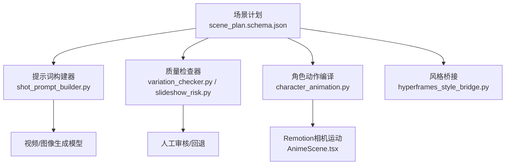
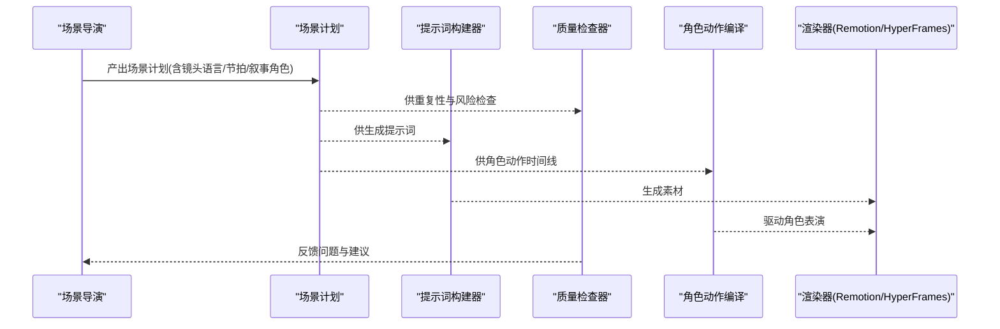
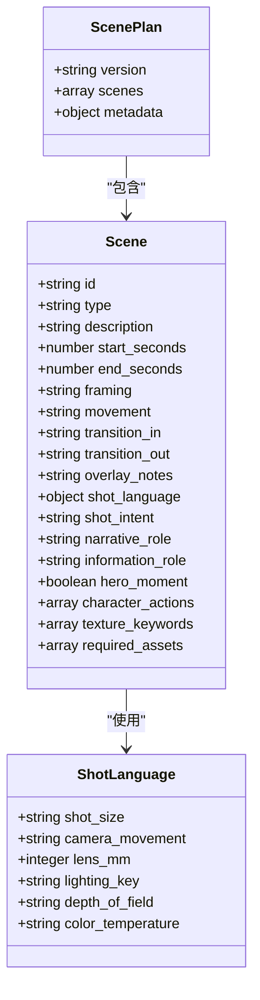
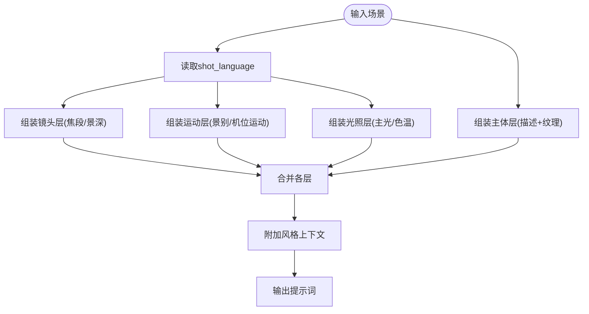
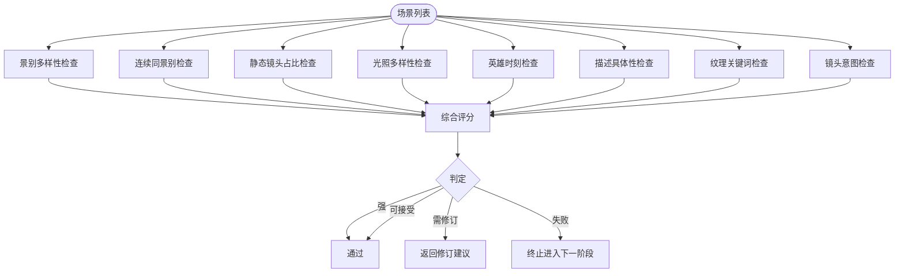
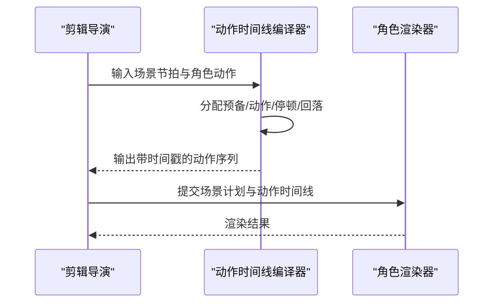
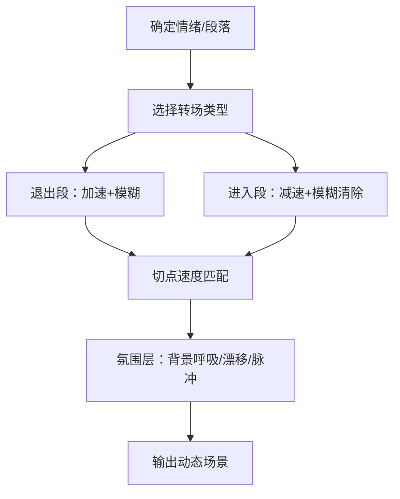
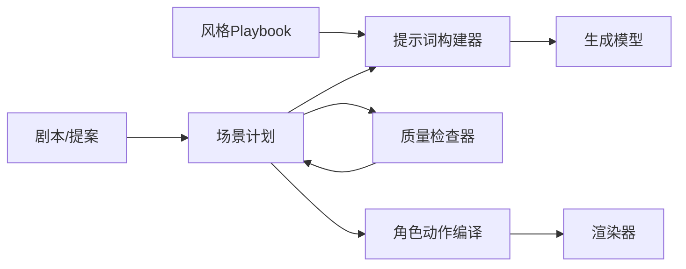

# 场景导演

<cite>
**本文引用的文件**
- [scene_plan.schema.json](file://schemas/artifacts/scene_plan.schema.json)
- [cinematic_scene_director.md](file://skills/pipelines/cinematic/scene-director.md)
- [character_animation_scene_director.md](file://skills/pipelines/character-animation/scene-director.md)
- [video_gen_prompting.md](file://skills/creative/video-gen-prompting.md)
- [shot_prompt_builder.py](file://lib/shot_prompt_builder.py)
- [variation_checker.py](file://lib/variation_checker.py)
- [slideshow_risk.py](file://lib/slideshow_risk.py)
- [character_animation.py](file://tools/character/character_animation.py)
- [test_character_animation_pipeline.py](file://tests/contracts/test_character_animation_pipeline.py)
- [AnimeScene.tsx](file://remotion-composer/src/components/AnimeScene.tsx)
- [hyperframes_style_bridge.py](file://lib/hyperframes_style_bridge.py)
- [motion_principles.md](file://.agents/skills/hyperframes-creative/references/motion-principles.md)
- [transitions_overview.md](file://.agents/skills/hyperframes-animation/transitions/overview.md)
</cite>

## 目录
1. [引言](#引言)
2. [项目结构](#项目结构)
3. [核心组件](#核心组件)
4. [架构总览](#架构总览)
5. [详细组件分析](#详细组件分析)
6. [依赖关系分析](#依赖关系分析)
7. [性能考量](#性能考量)
8. [故障排查指南](#故障排查指南)
9. [结论](#结论)
10. [附录](#附录)

## 引言
本技术文档面向OpenMontage角色动画管道中的“场景导演”岗位，聚焦其在分镜设计、镜头调度、空间布局与叙事节奏控制方面的职责与技术实现。文档基于仓库中已实现的场景计划Schema、提示词构建器、质量检查器、角色动作编译器等组件，系统阐述：
- 镜头角度选择、景别变化、运动轨迹设计与构图优化；
- 场景与角色的协调（位置关系、交互元素、背景与前景配合）；
- 动态场景设计（摄像机运动、转场效果、环境特效与氛围营造）；
- 不同类型场景的创作模板、镜头语言规范与视觉叙事技巧。

## 项目结构
围绕“场景导演”的核心工件是场景计划（scene_plan），它通过严格的JSON Schema约束了每个镜头的元数据与镜头语言，确保下游生成与渲染的一致性。同时，项目提供了从结构化镜头语言到生成提示词的转换工具、以及用于评估重复性与“幻灯片感”的质量检查器。

图表来源
- [scene_plan.schema.json:1-118](file://schemas/artifacts/scene_plan.schema.json#L1-L118)
- [shot_prompt_builder.py:1-167](file://lib/shot_prompt_builder.py#L1-L167)
- [variation_checker.py:1-177](file://lib/variation_checker.py#L1-L177)
- [slideshow_risk.py:1-256](file://lib/slideshow_risk.py#L1-L256)
- [character_animation.py:395-660](file://tools/character/character_animation.py#L395-L660)
- [AnimeScene.tsx:61-85](file://remotion-composer/src/components/AnimeScene.tsx#L61-L85)
- [hyperframes_style_bridge.py:180-194](file://lib/hyperframes_style_bridge.py#L180-L194)

章节来源
- [scene_plan.schema.json:1-118](file://schemas/artifacts/scene_plan.schema.json#L1-L118)
- [cinematic_scene_director.md:1-88](file://skills/pipelines/cinematic/scene-director.md#L1-L88)
- [character_animation_scene_director.md:1-47](file://skills/pipelines/character-animation/scene-director.md#L1-L47)

## 核心组件
- 场景计划Schema：定义镜头类型、时间轴、镜头语言（景别、机位运动、焦段、光效、景深、色温）、叙事角色、英雄时刻、纹理关键词等，保证跨阶段一致性。
- 提示词构建器：将结构化镜头语言转换为多图层自然语言提示词，适配不同生成模型。
- 质量检查器：检测重复性、静态镜头滥用、缺乏意图描述、缺少纹理关键词等问题，给出改进建议。
- 幻灯片风险评分：从重复、装饰化、弱运动、弱意图、文字主导、虚假电影化声明六个维度评估方案风险。
- 角色动作编译：将场景节拍转化为带时间的角色动作序列，并驱动渲染。
- Remotion相机运动：在合成阶段提供缩放、平移等相机运动计算。
- 风格桥接：统一样式变量注入，确保色彩与排版一致。

章节来源
- [scene_plan.schema.json:1-118](file://schemas/artifacts/scene_plan.schema.json#L1-L118)
- [shot_prompt_builder.py:1-167](file://lib/shot_prompt_builder.py#L1-L167)
- [variation_checker.py:1-177](file://lib/variation_checker.py#L1-L177)
- [slideshow_risk.py:1-256](file://lib/slideshow_risk.py#L1-L256)
- [character_animation.py:395-660](file://tools/character/character_animation.py#L395-L660)
- [AnimeScene.tsx:61-85](file://remotion-composer/src/components/AnimeScene.tsx#L61-L85)
- [hyperframes_style_bridge.py:180-194](file://lib/hyperframes_style_bridge.py#L180-L194)

## 架构总览
场景导演的输出是“场景计划”，它作为单一事实源被多个子系统消费：
- 生成侧：提示词构建器读取镜头语言，产出高质量提示词；
- 质量侧：检查器与风险评分器在资产生成前拦截低质方案；
- 动画侧：角色动作编译器将节拍转为可执行时间线；
- 合成侧：Remotion/HyperFrames根据计划进行相机运动、转场与风格化合成。

图表来源
- [scene_plan.schema.json:1-118](file://schemas/artifacts/scene_plan.schema.json#L1-L118)
- [shot_prompt_builder.py:1-167](file://lib/shot_prompt_builder.py#L1-L167)
- [variation_checker.py:1-177](file://lib/variation_checker.py#L1-L177)
- [slideshow_risk.py:1-256](file://lib/slideshow_risk.py#L1-L256)
- [character_animation.py:395-660](file://tools/character/character_animation.py#L395-L660)

## 详细组件分析

### 场景计划Schema与五维镜头语言
- 字段覆盖：id、type、时间戳、framing/movement、过渡、overlay_notes、shot_language（景别、机位运动、焦段、主光、景深、色温）、shot_intent、narrative_role、information_role、hero_moment、texture_keywords、required_assets等。
- 五维镜头语言：主体、主体运动、场景（含叠加层、视角、时空、动态）、空间构图（景别、画内位置、前后景深度、相对高度及变化）、摄影机（速度、畸变、高度、角度、焦点/景深、稳定度、运动）。
- 叠加层独立：标题、字幕、HUD等不混入前景/中景/背景深度轴，需单独记录。

图表来源
- [scene_plan.schema.json:1-118](file://schemas/artifacts/scene_plan.schema.json#L1-L118)

章节来源
- [scene_plan.schema.json:1-118](file://schemas/artifacts/scene_plan.schema.json#L1-L118)
- [cinematic_scene_director.md:1-88](file://skills/pipelines/cinematic/scene-director.md#L1-L88)
- [video_gen_prompting.md:1-326](file://skills/creative/video-gen-prompting.md#L1-L326)

### 提示词构建器：从结构化镜头语言到生成提示
- 分层策略：镜头（焦段/景深）→ 运动（景别/机位运动）→ 主体（描述+纹理）→ 光照（主光/色温）→ 风格（来自playbook）。
- 枚举映射：将schema中的景别、运动、光照、景深、色温等枚举值映射为自然语言短语，提升生成稳定性。
- 批量构建：跳过纯过渡场景，为每个视觉场景生成提示词并标注是否英雄时刻。

图表来源
- [shot_prompt_builder.py:1-167](file://lib/shot_prompt_builder.py#L1-L167)
- [scene_plan.schema.json:1-118](file://schemas/artifacts/scene_plan.schema.json#L1-L118)

章节来源
- [shot_prompt_builder.py:1-167](file://lib/shot_prompt_builder.py#L1-L167)
- [video_gen_prompting.md:1-326](file://skills/creative/video-gen-prompting.md#L1-L326)

### 质量检查器与幻灯片风险评分
- 重复性检测：景别分布、连续相同景别、静态镜头比例、光照多样性、文本主导等。
- 意图完整性：要求每镜头说明“为何存在”，避免无目的运动或空泛描述。
- 电影化声明校验：若宣称电影化，则需具备英雄时刻、足够运动与光照定义。
- 输出：评分、判定等级、具体问题与建议，便于回退修改。

图表来源
- [variation_checker.py:1-177](file://lib/variation_checker.py#L1-L177)
- [slideshow_risk.py:1-256](file://lib/slideshow_risk.py#L1-L256)

章节来源
- [variation_checker.py:1-177](file://lib/variation_checker.py#L1-L177)
- [slideshow_risk.py:1-256](file://lib/slideshow_risk.py#L1-L256)

### 角色与场景的协调：动作时序与空间关系
- 角色动作时序：以“预备—动作—停顿/反应—回落”的节奏组织，避免全程连续动画，强调“停顿”的表演价值。
- 空间关系：通过景别、前后景深度、机位高度与角度明确角色与场景元素的相对位置；叠加层不参与深度轴。
- 资产与复杂度预算：优先少量强镜头（建立—动作—反应—解决），避免过多独特视角或复杂接触。

图表来源
- [character_animation_scene_director.md:1-47](file://skills/pipelines/character-animation/scene-director.md#L1-L47)
- [character_animation.py:395-660](file://tools/character/character_animation.py#L395-L660)
- [test_character_animation_pipeline.py:239-267](file://tests/contracts/test_character_animation_pipeline.py#L239-L267)

章节来源
- [character_animation_scene_director.md:1-47](file://skills/pipelines/character-animation/scene-director.md#L1-L47)
- [character_animation.py:395-660](file://tools/character/character_animation.py#L395-L660)
- [test_character_animation_pipeline.py:239-267](file://tests/contracts/test_character_animation_pipeline.py#L239-L267)

### 动态场景：摄像机运动、转场与氛围
- 摄像机运动：区分平移、旋转、镜头变焦与混合运动；严格定义“静态”含义，避免误用。
- 转场语义：按情绪与段落选择转场类型（硬切、淡出、慢溶解、克制推近等），保持词汇表收敛。
- 氛围营造：背景层不应为空，使用呼吸/漂移/脉冲等环境动效；叠加层与深度轴分离。
- 速度匹配：退出加速+模糊，进入减速+模糊清除，使切点感知为连续运动。

图表来源
- [transitions_overview.md:50-109](file://.agents/skills/hyperframes-animation/transitions/overview.md#L50-L109)
- [motion_principles.md:34-87](file://.agents/skills/hyperframes-creative/references/motion-principles.md#L34-L87)
- [video_gen_prompting.md:92-131](file://skills/creative/video-gen-prompting.md#L92-L131)

章节来源
- [transitions_overview.md:50-109](file://.agents/skills/hyperframes-animation/transitions/overview.md#L50-L109)
- [motion_principles.md:34-87](file://.agents/skills/hyperframes-creative/references/motion-principles.md#L34-L87)
- [video_gen_prompting.md:92-131](file://skills/creative/video-gen-prompting.md#L92-L131)

### 镜头语言规范与创作模板
- 通用五要素模板：主体、主体运动、场景（含叠加层/视角/时空/动态）、空间构图（景别/位置/深度/高度及变化）、摄影机（速度/畸变/高度/角度/焦点/景深/稳定/运动）。
- 景别与角度：远/全/中/中近/特/极特、过肩、POV、俯仰、荷兰角等；高度与角度决定权力感与亲密感。
- 运动原语：推拉摇移升降、轨道跟随、手持、斯坦尼康、环绕、甩摇、变焦、焦点切换等；严格区分平移/旋转/镜头变化。
- 光影与质感：主光类型、色温、体积光、轮廓光、逆光等；纹理关键词增强生成细节。
- 模板示例：英雄开场、揭示、结尾、标题卡英雄时刻；插入镜头仅用于过渡/强调/补位。

章节来源
- [video_gen_prompting.md:1-326](file://skills/creative/video-gen-prompting.md#L1-L326)
- [cinematic_scene_director.md:1-88](file://skills/pipelines/cinematic/scene-director.md#L1-L88)

### 渲染与风格桥接
- Remotion相机运动：基于帧进度插值计算缩放与平移，实现推近/拉远/平移等效果。
- HyperFrames风格桥接：通过根变量注入字体、颜色与强调色，确保跨场景一致性。
- 背景层与装饰：为每场景提供持久装饰层，避免空白背景带来的“未加载”感。

章节来源
- [AnimeScene.tsx:61-85](file://remotion-composer/src/components/AnimeScene.tsx#L61-L85)
- [hyperframes_style_bridge.py:180-194](file://lib/hyperframes_style_bridge.py#L180-L194)
- [motion_principles.md:67-87](file://.agents/skills/hyperframes-creative/references/motion-principles.md#L67-L87)

## 依赖关系分析
- 上游依赖：剧本与提案包提供节拍地图与事实来源；风格Playbook提供色彩与排版一致性。
- 横向依赖：提示词构建器依赖Schema定义的枚举；质量检查器依赖Shot Language与意图字段。
- 下游依赖：渲染器依赖动作时间线与相机运动参数；转场与氛围依赖HyperFrames/Remotion能力。

图表来源
- [cinematic_scene_director.md:1-88](file://skills/pipelines/cinematic/scene-director.md#L1-L88)
- [shot_prompt_builder.py:1-167](file://lib/shot_prompt_builder.py#L1-L167)
- [variation_checker.py:1-177](file://lib/variation_checker.py#L1-L177)
- [character_animation.py:395-660](file://tools/character/character_animation.py#L395-L660)

章节来源
- [cinematic_scene_director.md:1-88](file://skills/pipelines/cinematic/scene-director.md#L1-L88)
- [shot_prompt_builder.py:1-167](file://lib/shot_prompt_builder.py#L1-L167)
- [variation_checker.py:1-177](file://lib/variation_checker.py#L1-L177)
- [character_animation.py:395-660](file://tools/character/character_animation.py#L395-L660)

## 性能考量
- 提示词长度与模型适配：不同模型对提示词长度敏感，需在控制信息密度的同时保留关键镜头语言。
- 运动复杂度：避免在同一镜头堆叠过多运动原语，优先单一清晰动机。
- 资源复用：英雄时刻与关键景别集中投入，其余镜头采用轻量运动与简洁构图。
- 批处理效率：批量提示词构建时跳过纯过渡场景，减少无效生成。

[本节为通用指导，无需特定文件引用]

## 故障排查指南
- 重复与单调：若出现连续相同景别、静态镜头过多、光照单一，参考检查器建议调整景别与运动组合。
- 意图缺失：为每个镜头补充shot_intent与narrative_role，避免“装饰性”镜头。
- 电影化声明不符：若宣称电影化但缺乏英雄时刻、运动与光照定义，需补齐结构。
- 文本主导：降低text_card/stat_card比例，增加视觉场景比重。
- 角色表演僵硬：检查动作时序是否遵循“预备—动作—停顿/反应—回落”，避免全程连续动画。

章节来源
- [variation_checker.py:1-177](file://lib/variation_checker.py#L1-L177)
- [slideshow_risk.py:1-256](file://lib/slideshow_risk.py#L1-L256)
- [character_animation_scene_director.md:1-47](file://skills/pipelines/character-animation/scene-director.md#L1-L47)

## 结论
场景导演在OpenMontage管道中承担“将情绪转化为可视计划”的关键职责。通过严格的场景计划Schema、标准化的镜头语言、严谨的质量检查与风险评分，以及角色动作与渲染器的协同，能够实现稳定的分镜设计、镜头调度、空间布局与叙事节奏控制。建议在创作中坚持五维镜头语言、收敛转场词汇、强化英雄时刻与意图表达，以获得更具电影感的作品。

[本节为总结，无需特定文件引用]

## 附录
- 常用镜头语言速查：景别、角度、运动、光影、景深、色温、纹理关键词。
- 场景模板库：英雄开场、揭示、结尾、标题卡、插入镜头、对比/证据/情感节拍/收尾。
- 转场语义表：按情绪与段落选择合适转场，保持速度与模糊匹配。
- 质量门禁清单：英雄时刻、意图完整、景别多样、运动有目的、光照有层次、叠加层独立。

[本节为参考资料汇总，无需特定文件引用]