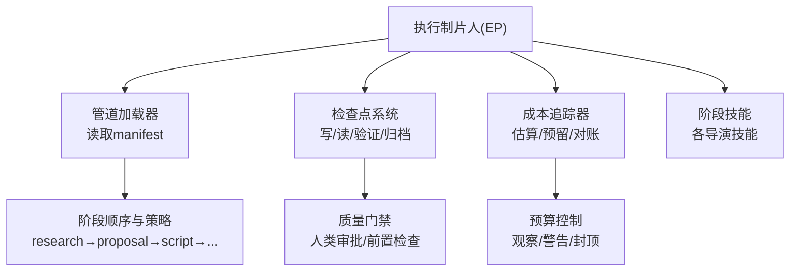
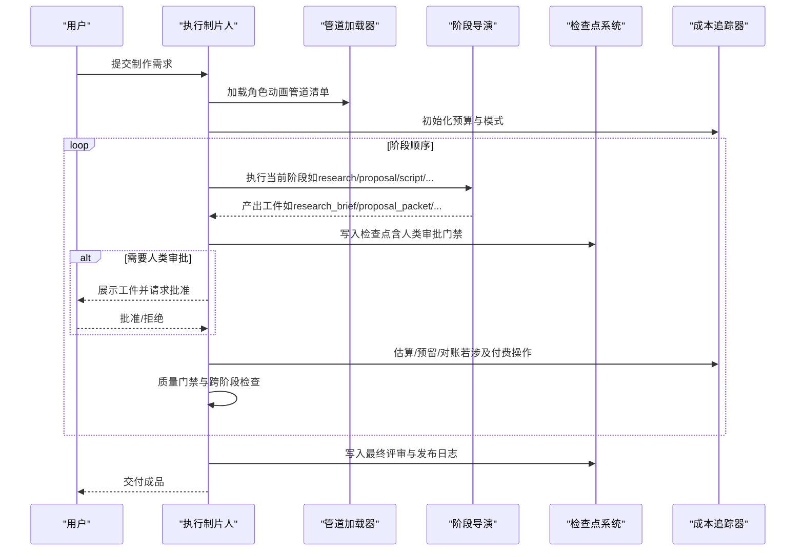
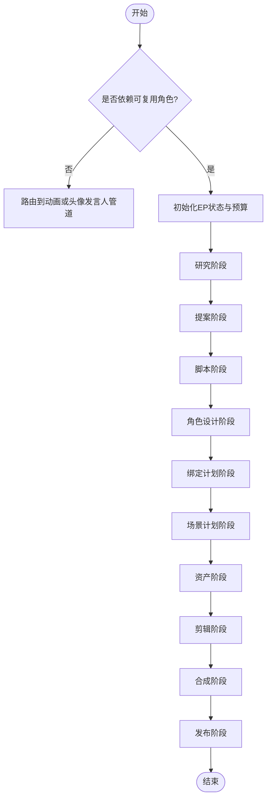
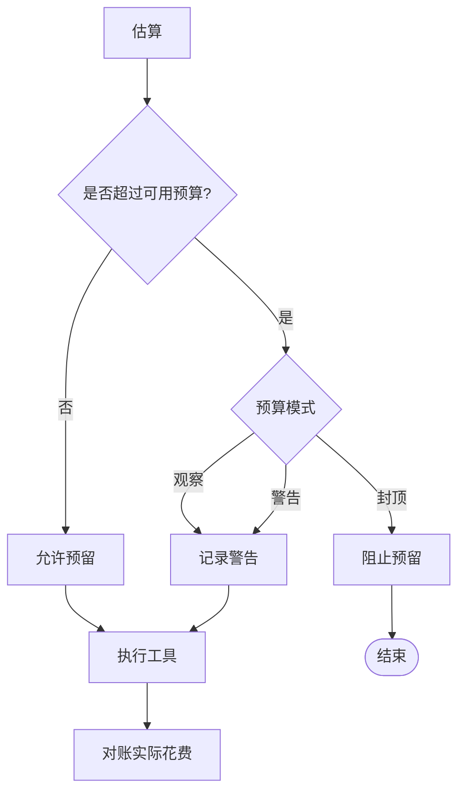
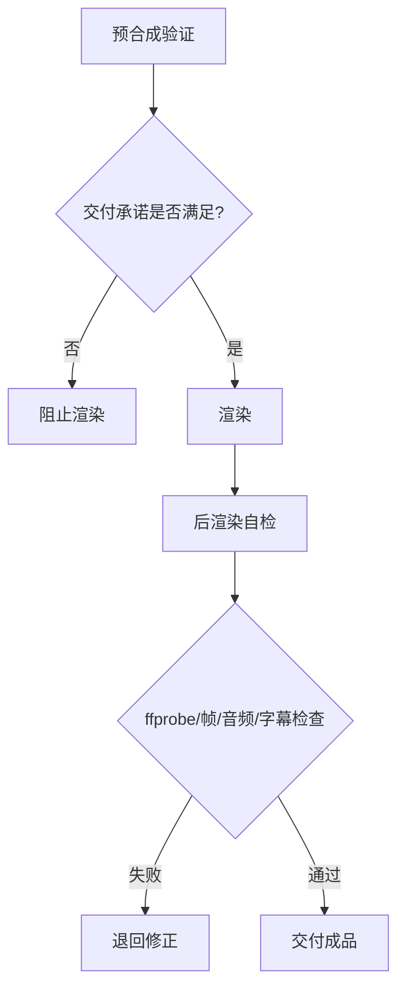
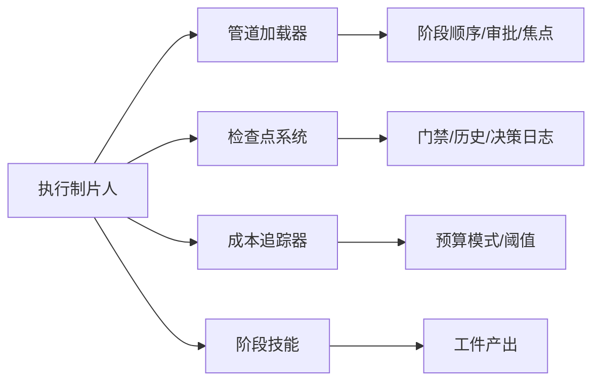

# 执行制片人

<cite>
**本文引用的文件**
- [README.md](file://README.md)
- [PROJECT_CONTEXT.md](file://PROJECT_CONTEXT.md)
- [AGENTS.md](file://AGENTS.md)
- [skills/pipelines/character-animation/executive-producer.md](file://skills/pipelines/character-animation/executive-producer.md)
- [pipeline_defs/character-animation.yaml](file://pipeline_defs/character-animation.yaml)
- [tools/cost_tracker.py](file://tools/cost_tracker.py)
- [lib/checkpoint.py](file://lib/checkpoint.py)
- [lib/pipeline_loader.py](file://lib/pipeline_loader.py)
- [skills/pipelines/animation/executive-producer.md](file://skills/pipelines/animation/executive-producer.md)
- [tests/tools/test_cost_tracker_governance.py](file://tests/tools/test_cost_tracker_governance.py)
</cite>

## 目录
1. [简介](#简介)
2. [项目结构](#项目结构)
3. [核心组件](#核心组件)
4. [架构总览](#架构总览)
5. [详细组件分析](#详细组件分析)
6. [依赖关系分析](#依赖关系分析)
7. [性能与治理考量](#性能与治理考量)
8. [故障排查指南](#故障排查指南)
9. [结论](#结论)
10. [附录](#附录)

## 简介
本技术文档聚焦于OpenMontage角色动画管道中的“执行制片人”（Executive Producer，简称EP）职责。EP是贯穿项目启动、可行性评估、资源规划、质量控制与风险管理的核心决策者，负责协调研究导演、提案导演、脚本导演、角色设计导演、绑定计划导演、场景导演、资产导演、剪辑导演、合成导演与发布导演等阶段，确保项目在预算、质量与进度约束下按时交付。

在OpenMontage中，EP并非一段硬编码的编排器，而是由AI代理按“指令驱动”的方式串行执行各阶段，并在每个阶段的质量门禁处做出通过、修订或退回的决策。系统通过管道清单、技能文件、工件Schema、成本追踪与检查点机制，将治理规则、质量门禁、预算控制与进度监控固化为可审计、可恢复的生产流程。

**章节来源**
- [README.md:356-446](file://README.md#L356-L446)
- [PROJECT_CONTEXT.md:9-19](file://PROJECT_CONTEXT.md#L9-L19)

## 项目结构
OpenMontage采用“三层知识架构”：工具与管道定义（能力层）、技能与规范（使用层）、外部技术知识（实现层）。角色动画管道的执行制片人依托以下关键结构与文件：
- 管道清单：定义阶段顺序、所需技能、工具、审查焦点与成功标准
- 执行制片人技能：定义角色动画管道的适用场景、阶段顺序、治理规则与退回触发条件
- 成本追踪：提供估算、预留、对账与预算模式控制
- 检查点系统：强制前置阶段完成与人类审批门禁，维护历史与决策日志
- 管道加载器：读取并校验管道清单，暴露阶段顺序、人类审批默认值、审查焦点等

**图表来源**
- [pipeline_defs/character-animation.yaml:45-51](file://pipeline_defs/character-animation.yaml#L45-L51)
- [lib/pipeline_loader.py:125-182](file://lib/pipeline_loader.py#L125-L182)
- [lib/checkpoint.py:251-346](file://lib/checkpoint.py#L251-L346)
- [tools/cost_tracker.py:40-179](file://tools/cost_tracker.py#L40-L179)

**章节来源**
- [PROJECT_CONTEXT.md:33-57](file://PROJECT_CONTEXT.md#L33-L57)
- [pipeline_defs/character-animation.yaml:29-51](file://pipeline_defs/character-animation.yaml#L29-L51)

## 核心组件
- 执行制片人技能（角色动画）：明确何时使用该管道、阶段顺序、治理规则与退回触发条件
- 管道清单（角色动画）：声明必需技能、阶段顺序、人类审批默认值、审查焦点与成功标准
- 成本追踪器：实现估算、预留、对账、退款与预算模式（观察/警告/封顶），支持单动作阈值审批与新增付费工具审批
- 检查点系统：强制前置阶段完成、人类审批门禁、工件Schema校验、历史归档与决策日志合并
- 管道加载器：缓存加载manifest，提供阶段顺序、人类审批默认值、审查焦点、扩展权限等查询接口

**章节来源**
- [skills/pipelines/character-animation/executive-producer.md:1-49](file://skills/pipelines/character-animation/executive-producer.md#L1-L49)
- [pipeline_defs/character-animation.yaml:61-303](file://pipeline_defs/character-animation.yaml#L61-L303)
- [tools/cost_tracker.py:1-179](file://tools/cost_tracker.py#L1-L179)
- [lib/checkpoint.py:194-564](file://lib/checkpoint.py#L194-L564)
- [lib/pipeline_loader.py:39-182](file://lib/pipeline_loader.py#L39-L182)

## 架构总览
执行制片人在角色动画管道中的总体工作流如下：
- 初始化：加载管道清单、风格剧本、预算与状态
- 串行执行：按阶段顺序依次运行各导演技能
- 质量门禁：在每个阶段结束时进行Schema校验、审查焦点检查、成功标准核对与跨阶段一致性检查
- 预算控制：在执行前估算成本，预留预算，执行后对账；根据模式采取观察、警告或封顶
- 人类审批：在需要人类审批的阶段暂停，等待批准后再继续
- 最终评审：输出前进行综合质量检查，必要时退回上游阶段修正

**图表来源**
- [pipeline_defs/character-animation.yaml:61-303](file://pipeline_defs/character-animation.yaml#L61-L303)
- [lib/checkpoint.py:422-564](file://lib/checkpoint.py#L422-L564)
- [tools/cost_tracker.py:101-179](file://tools/cost_tracker.py#L101-L179)

**章节来源**
- [README.md:374-446](file://README.md#L374-L446)
- [skills/pipelines/animation/executive-producer.md:89-156](file://skills/pipelines/animation/executive-producer.md#L89-L156)

## 详细组件分析

### 执行制片人（角色动画）职责与决策流程
- 适用场景：当交付物依赖可复用动画角色（卡通短片、吉祥物解说、音乐驱动的角色场景、简单角色对话或参考驱动的本地动画）时使用该管道；非表演性一次性动效应路由到动画管道；头像发言人对口型应路由到头像发言人管道
- 合同约束：生产本地、确定性的角色动画，不静默替换为静态图像运动；若可用绑定、资产或运行时无法构建角色运动，需暴露阻塞项
- 阶段顺序：研究→提案→脚本→角色设计→绑定计划→场景计划→资产→剪辑→合成→发布
- 治理规则：提案前预检注册表；若Remotion与HyperFrames均可用，需在锁定渲染运行时前同时呈现两者；先产出10-15秒样片再全量生产；角色差异应在绑定数据而非一次性代码路径；所有生成或运行时作者资产必须列出已读的Layer 3技能；使用角色动画评审器与最终评审
- 退回触发：角色设计缺少必要动作或情感范围；绑定计划缺少活动部件的枢轴；姿态库无可读表演姿态；动作时间线包含绑定无法渲染的动作；合成使用了未批准的运行时

**图表来源**
- [skills/pipelines/character-animation/executive-producer.md:3-49](file://skills/pipelines/character-animation/executive-producer.md#L3-L49)
- [pipeline_defs/character-animation.yaml:61-303](file://pipeline_defs/character-animation.yaml#L61-L303)

**章节来源**
- [skills/pipelines/character-animation/executive-producer.md:1-49](file://skills/pipelines/character-animation/executive-producer.md#L1-L49)

### 项目启动与可行性评估
- 项目启动：EP加载管道清单、风格剧本、预算与状态；初始化项目工作区与标记文件；准备阶段顺序与人类审批默认值
- 可行性评估：研究阶段识别参考视频使用的技术（本地绑定动画、逐帧传统动画、视频生成、静态图像运动、混合技术），分离可在本地复现的部分与需要手动绘制或更大资产库的部分；记录可复用动画原语（走循环、眨眼、转头、伸手、翅膀扇动、挤压拉伸、摄像机平移/视差、粒子/天气）；明确角色动画适配度、参考运动类型、所需角色动作、绑定复杂度、手动资产风险与本地运行时候选
- 提案阶段：提出差异化概念、运行时选项、成本、音乐计划与样片计划；若Remotion与HyperFrames均可用，需同时呈现；保留运动要求，不为角色表演静默降级为仅FFmpeg

**章节来源**
- [pipeline_defs/character-animation.yaml:61-112](file://pipeline_defs/character-animation.yaml#L61-L112)
- [skills/pipelines/character-animation/research-director.md:1-46](file://skills/pipelines/character-animation/research-director.md#L1-L46)

### 资源规划与预算控制
- 预算控制三阶段：估算（执行前）、预留（锁定资金）、对账（记录实际花费）
- 模式配置：观察（仅跟踪）、警告（记录超支）、封顶（硬性限制）
- 单动作审批阈值：超过阈值的动作需用户确认；首次使用付费工具需审批
- 参考驱动估算：基于参考视频分析与目标时长，估算场景数、叙事词数、运动比例、视频片段覆盖、重试缓冲、图像数量、TTS、音乐等分项成本，并提供低/高区间与置信度

**图表来源**
- [tools/cost_tracker.py:101-179](file://tools/cost_tracker.py#L101-L179)
- [tools/cost_tracker.py:183-398](file://tools/cost_tracker.py#L183-L398)

**章节来源**
- [tools/cost_tracker.py:1-179](file://tools/cost_tracker.py#L1-L179)
- [tools/cost_tracker.py:183-398](file://tools/cost_tracker.py#L183-L398)
- [tests/tools/test_cost_tracker_governance.py:15-33](file://tests/tools/test_cost_tracker_governance.py#L15-L33)

### 质量控制与质量门禁
- 人类审批门禁：提案、脚本、场景计划、资产、发布等阶段默认需要人类审批；检查点系统在写入时强制前置阶段完成与人类审批标志
- 预合成验证：若交付承诺被违反（例如“以运动为主”的视频却大量静态图像）、幻灯片风险评分临界或缺少渲染器族，则阻止渲染
- 后渲染自检：每次渲染后进行ffprobe验证、帧采样、音频分析、交付承诺核验与字幕检查；失败则不呈现
- 幻灯片风险评分：六维度分析防止“动画PPT”输出
- 源媒体检查：对用户提供的素材进行探测（分辨率、编解码器、音频通道、时长），形成规划影响

**图表来源**
- [README.md:656-688](file://README.md#L656-L688)
- [lib/checkpoint.py:422-564](file://lib/checkpoint.py#L422-L564)

**章节来源**
- [README.md:656-688](file://README.md#L656-L688)
- [lib/checkpoint.py:251-346](file://lib/checkpoint.py#L251-L346)

### 风险管理
- 退回触发：角色设计、绑定计划、姿态库、动作时间线与合成运行时选择的关键问题会触发退回
- 反循环保护：每阶段最大修订次数、每阶段对最大退回次数、总预算上限与总墙钟时间上限，避免无限循环
- 决策审计：所有重大创意与技术选择（提供商选择、风格/剧本选择、音乐轨道、语音选择、渲染器族、任何降级）均记录替代方案、置信度与理由，累积决策日志持久化

**章节来源**
- [skills/pipelines/character-animation/executive-producer.md:32-49](file://skills/pipelines/character-animation/executive-producer.md#L32-L49)
- [pipeline_defs/character-animation.yaml:45-51](file://pipeline_defs/character-animation.yaml#L45-L51)
- [lib/checkpoint.py:388-420](file://lib/checkpoint.py#L388-L420)

### 协调各阶段导演的工作
- 研究导演：理解参考、技术与可行性，产出研究简报
- 提案导演：提出概念、运行时选项、成本、音乐计划与样片计划，获得用户批准
- 脚本导演：将批准的提案转化为动画就绪节拍，集成研究结果并尊重所选动画模式
- 角色设计导演：定义角色、剪影、情感范围与动作列表，确保角色数量适合本地绑定
- 绑定计划导演：定义部件、枢轴、层级、约束、视图与所需姿态，避免针对角色的代码路径
- 场景导演：将故事节拍映射到角色场景，确保场景复杂度符合批准的样片与预算
- 资产导演：生成或获取角色部件、背景、道具、音频与效果，链接到场景并记录来源与提示
- 剪辑导演：编译带时间戳的动作时间线，保持表演节拍与情感可读性
- 合成导演：通过批准的运行时渲染并通过QA，确保没有静默降级为静态图像运动
- 发布导演：打包最终输出，诚实描述角色动画风格，突出主要角色与情感钩子

**章节来源**
- [pipeline_defs/character-animation.yaml:61-303](file://pipeline_defs/character-animation.yaml#L61-L303)

## 依赖关系分析
执行制片人依赖的核心组件与关系如下：
- 管道加载器：提供阶段顺序、人类审批默认值、审查焦点与扩展权限
- 检查点系统：强制前置阶段完成与人类审批，维护历史与决策日志
- 成本追踪器：估算、预留、对账与预算模式控制
- 各阶段技能：指导具体执行与产出工件
- 风格剧本：约束视觉语言与质量规则

**图表来源**
- [lib/pipeline_loader.py:125-182](file://lib/pipeline_loader.py#L125-L182)
- [lib/checkpoint.py:251-564](file://lib/checkpoint.py#L251-L564)
- [tools/cost_tracker.py:40-179](file://tools/cost_tracker.py#L40-L179)

**章节来源**
- [lib/pipeline_loader.py:39-182](file://lib/pipeline_loader.py#L39-L182)
- [lib/checkpoint.py:194-564](file://lib/checkpoint.py#L194-L564)
- [tools/cost_tracker.py:1-179](file://tools/cost_tracker.py#L1-L179)

## 性能与治理考量
- 性能：管道清单与检查点系统采用缓存与原子写入，减少重复解析与并发冲突；检查点历史归档保证可回放与审计
- 治理：人类审批门禁、前置阶段检查、工件Schema校验、决策日志合并与预算模式控制共同构成强治理框架
- 可扩展性：管道清单支持自定义脚本、风格剧本、技能与工具扩展（受管道清单权限控制）

**章节来源**
- [lib/pipeline_loader.py:27-46](file://lib/pipeline_loader.py#L27-L46)
- [lib/checkpoint.py:349-386](file://lib/checkpoint.py#L349-L386)
- [pipeline_defs/character-animation.yaml:23-27](file://pipeline_defs/character-animation.yaml#L23-L27)

## 故障排查指南
- 人类审批门禁违规：若阶段需要人类审批但写入“completed”且未设置“human_approved=True”，检查点系统将抛出门禁违规错误；应改为“awaiting_human”，展示工件并等待批准后再写入“completed”
- 前置阶段未完成：尝试推进到下一阶段时，若前置阶段未完成或未获批准，检查点系统将抛出前置违规错误；需补齐前置阶段并完成审批
- 预算超限：在封顶模式下，预留预算时会抛出预算超限错误；在警告模式下会记录警告但仍允许继续；建议调整预算或降低动作成本
- 新付费工具首次使用：若启用“新付费工具需审批”，首次使用将抛出需审批错误；需先批准工具再执行

**章节来源**
- [lib/checkpoint.py:467-494](file://lib/checkpoint.py#L467-L494)
- [lib/checkpoint.py:284-346](file://lib/checkpoint.py#L284-L346)
- [tools/cost_tracker.py:117-179](file://tools/cost_tracker.py#L117-L179)
- [tests/tools/test_cost_tracker_governance.py:15-33](file://tests/tools/test_cost_tracker_governance.py#L15-L33)

## 结论
在OpenMontage角色动画管道中，执行制片人通过指令驱动与强治理机制，实现了从项目启动到最终交付的全流程管控。其核心价值在于：
- 明确何时使用角色动画管道，何时拒绝或路由到其他管道
- 在提案阶段锁定渲染运行时与预算，避免后期降级与超支
- 通过质量门禁与人类审批确保创意与技术决策的可控性与可审计性
- 借助成本追踪与检查点系统实现预算控制与进度监控
- 在复杂项目中，通过退回触发与反循环保护，及时纠正偏差并保障交付质量

**章节来源**
- [skills/pipelines/character-animation/executive-producer.md:1-49](file://skills/pipelines/character-animation/executive-producer.md#L1-L49)
- [pipeline_defs/character-animation.yaml:45-51](file://pipeline_defs/character-animation.yaml#L45-L51)
- [tools/cost_tracker.py:1-179](file://tools/cost_tracker.py#L1-L179)
- [lib/checkpoint.py:422-564](file://lib/checkpoint.py#L422-L564)

## 附录
- 实际案例说明（基于仓库内容提炼）：
  - 在角色动画管道中，若角色设计缺少必要动作或情感范围，执行制片人将退回至角色设计阶段修正；若绑定计划缺少活动部件的枢轴，同样退回；若合成使用了未批准的运行时，也会触发退回
  - 在提案阶段，若Remotion与HyperFrames均可用，执行制片人需同时呈现两者，并在批准后锁定渲染运行时，避免后续静默切换
  - 在预算控制方面，执行制片人会在执行前估算成本、预留预算，并在执行后对账；若超出可用预算，在封顶模式下阻止预留，在警告模式下记录警告

**章节来源**
- [skills/pipelines/character-animation/executive-producer.md:32-49](file://skills/pipelines/character-animation/executive-producer.md#L32-L49)
- [pipeline_defs/character-animation.yaml:77-112](file://pipeline_defs/character-animation.yaml#L77-L112)
- [tools/cost_tracker.py:101-179](file://tools/cost_tracker.py#L101-L179)