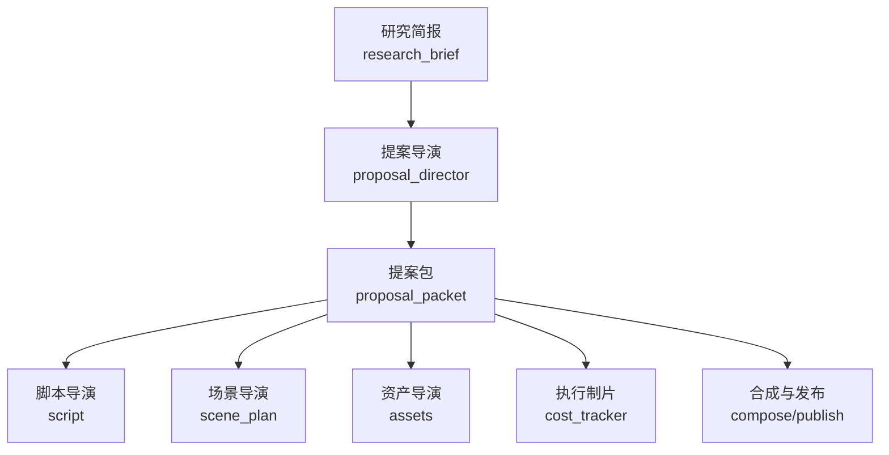
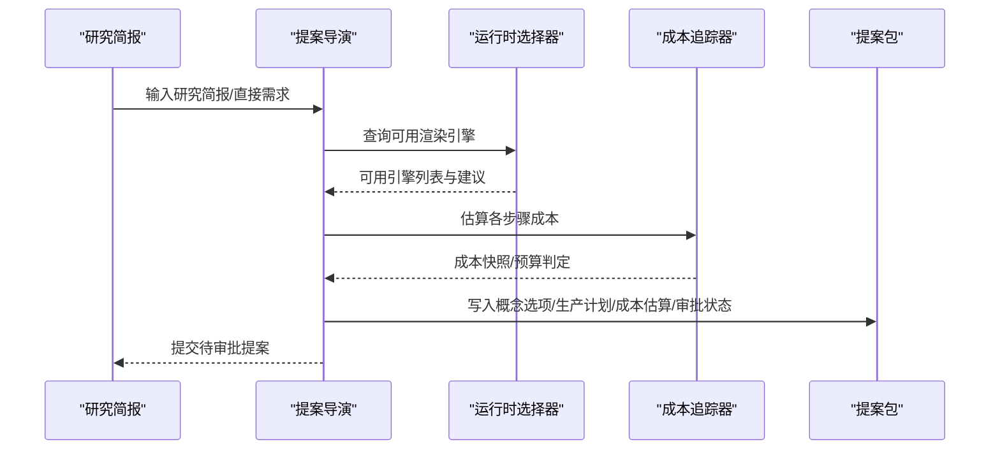
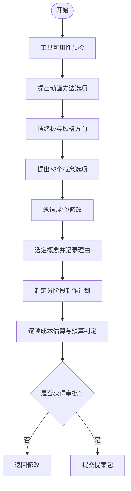
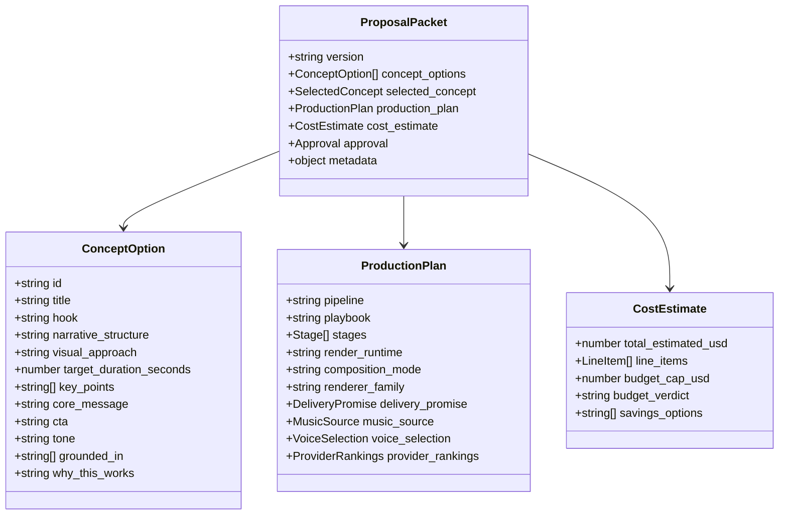
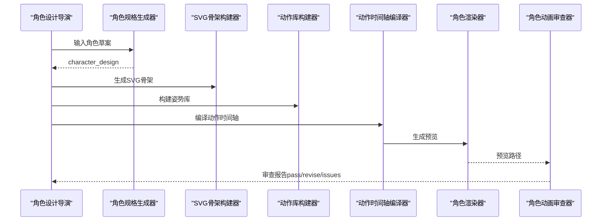
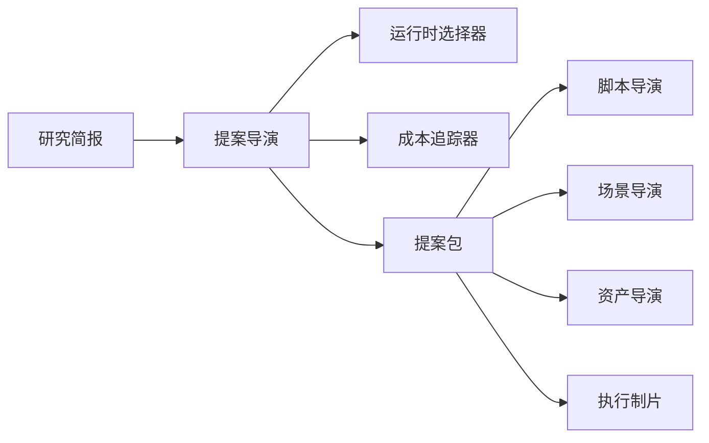

# 提案导演

<cite>
**本文引用的文件**
- [skills/pipelines/animation/proposal-director.md](file://skills/pipelines/animation/proposal-director.md)
- [skills/pipelines/character-animation/proposal-director.md](file://skills/pipelines/character-animation/proposal-director.md)
- [schemas/artifacts/proposal_packet.schema.json](file://schemas/artifacts/proposal_packet.schema.json)
- [schemas/artifacts/character_design.schema.json](file://schemas/artifacts/character_design.schema.json)
- [skills/meta/animation-runtime-selector.md](file://skills/meta/animation-runtime-selector.md)
- [skills/core/hyperframes.md](file://skills/core/hyperframes.md)
- [tools/cost_tracker.py](file://tools/cost_tracker.py)
- [tools/character/character_animation.py](file://tools/character/character_animation.py)
- [tests/contracts/test_character_animation_pipeline.py](file://tests/contracts/test_character_animation_pipeline.py)
- [docs/ARCHITECTURE.md](file://docs/ARCHITECTURE.md)
</cite>

## 目录
1. [简介](#简介)
2. [项目结构](#项目结构)
3. [核心组件](#核心组件)
4. [架构总览](#架构总览)
5. [详细组件分析](#详细组件分析)
6. [依赖关系分析](#依赖关系分析)
7. [性能与成本考量](#性能与成本考量)
8. [故障排查指南](#故障排查指南)
9. [结论](#结论)
10. [附录：模板与示例](#附录模板与示例)

## 简介
本技术文档面向OpenMontage角色动画管道中的“提案导演”角色，说明其如何将研究结果转化为可审批的制作方案。提案导演的职责包括：
- 将研究简报转化为多个差异化的概念选项（标题、钩子、叙事结构、视觉策略）。
- 明确技术方案选择：渲染引擎（Remotion vs HyperFrames vs FFmpeg）、动画制作方法、资产生成策略。
- 输出结构化成本估算、时间规划与质量保证计划。
- 在人类审批通过前不产生任何付费或不可逆操作。

该角色是“批准闸门”，下游所有阶段（脚本、场景、资产、编辑、合成、发布）都依赖提案产物继续推进。

**章节来源**
- [skills/pipelines/animation/proposal-director.md:1-10](file://skills/pipelines/animation/proposal-director.md#L1-L10)
- [skills/pipelines/character-animation/proposal-director.md:1-22](file://skills/pipelines/character-animation/proposal-director.md#L1-L22)

## 项目结构
围绕提案导演的相关代码与规范主要分布在以下位置：
- 技能与流程定义：动画与角色动画管道的提案导演技能文件。
- 契约与数据模型：提案包、角色设计等JSON Schema。
- 运行时选择：元技能与核心能力说明，指导Remotion/HyperFrames/FFmpeg的选择。
- 成本追踪：预算估算、预留、核销的跟踪器。
- 角色动画工具链：角色规格生成、SVG骨架构建、动作时间轴编译与预览、QA审查。
- 架构文档：制品类型与预算治理说明。

**图表来源**
- [docs/ARCHITECTURE.md:272-287](file://docs/ARCHITECTURE.md#L272-L287)
- [skills/pipelines/animation/proposal-director.md:433-441](file://skills/pipelines/animation/proposal-director.md#L433-L441)

**章节来源**
- [docs/ARCHITECTURE.md:272-287](file://docs/ARCHITECTURE.md#L272-L287)

## 核心组件
- 提案导演（动画与角色动画两条线）：负责概念设计、技术选型、成本估算、制作计划与审批闸门。
- 提案包Schema：约束提案产物的结构与字段，确保下游各阶段一致消费。
- 运行时选择器：提供Remotion/HyperFrames/FFmpeg的选择矩阵与硬性规则。
- 成本追踪器：记录估算、预留与实际花费，支持预算模式（观察/警告/封顶）。
- 角色设计与动画工具链：角色规格生成、SVG骨架、动作时间轴、预览与QA。

**章节来源**
- [schemas/artifacts/proposal_packet.schema.json:1-379](file://schemas/artifacts/proposal_packet.schema.json#L1-L379)
- [skills/meta/animation-runtime-selector.md:1-156](file://skills/meta/animation-runtime-selector.md#L1-L156)
- [tools/cost_tracker.py:40-115](file://tools/cost_tracker.py#L40-L115)
- [tools/character/character_animation.py:137-181](file://tools/character/character_animation.py#L137-L181)

## 架构总览
提案导演处于研究到制作的桥梁位置，产出提案包并锁定关键决策（渲染运行时、风格、复用策略、成本上限），下游据此执行。

**图表来源**
- [skills/pipelines/animation/proposal-director.md:11-24](file://skills/pipelines/animation/proposal-director.md#L11-L24)
- [skills/meta/animation-runtime-selector.md:26-55](file://skills/meta/animation-runtime-selector.md#L26-L55)
- [tools/cost_tracker.py:66-115](file://tools/cost_tracker.py#L66-L115)
- [schemas/artifacts/proposal_packet.schema.json:67-167](file://schemas/artifacts/proposal_packet.schema.json#L67-L167)

## 详细组件分析

### 提案导演（动画管道）
- 目标：基于研究简报提出至少3个差异化概念，包含标题、钩子、叙事结构、视觉策略、时长与平台适配、复用策略、成本估算与审批。
- 运行时选择：必须同时呈现Remotion与HyperFrames（若均可用），给出匹配brief的一行描述与一行权衡，推荐并等待用户确认；记录决策日志。
- 预检：扫描工具可用性（图像/视频生成、TTS、组合运行时等），禁止提议无法实现的动画模式。
- 概念设计：提供情绪板、渐进式展示、混合概念邀请，最终选定并记录修改。
- 制作计划：按阶段列出工具、成本与注意事项，强调文本/图表在最终分辨率保持清晰。
- 成本估算：逐项列出TTS、图像/视频生成、音乐、本地免费工具等，给出预算判定与节省建议。
- 审批闸门：未获明确批准不得进入下一阶段。

**图表来源**
- [skills/pipelines/animation/proposal-director.md:95-121](file://skills/pipelines/animation/proposal-director.md#L95-L121)
- [skills/pipelines/animation/proposal-director.md:232-338](file://skills/pipelines/animation/proposal-director.md#L232-L338)
- [skills/pipelines/animation/proposal-director.md:340-431](file://skills/pipelines/animation/proposal-director.md#L340-L431)

**章节来源**
- [skills/pipelines/animation/proposal-director.md:1-482](file://skills/pipelines/animation/proposal-director.md#L1-L482)

### 提案导演（角色动画管道）
- 目标：呈现诚实的本地绑定角色动画方案，涵盖角色与角色、视觉风格、动作复杂度、绑定复用策略、样本计划、音频架构、音乐计划、渲染运行时选项、成本估算与限制说明。
- 运行时选择：读取运行时选择器，若Remotion与HyperFrames均可用，需同时呈现并等待用户批准后再锁定render_runtime。
- 样本优先：全量资产生成前，先产出10-15秒样本（含一个主角色、一次表情变化、一次身体动作、一次背景/镜头处理、必要时加入音频/音乐提示）。

**章节来源**
- [skills/pipelines/character-animation/proposal-director.md:1-71](file://skills/pipelines/character-animation/proposal-director.md#L1-L71)

### 运行时选择（Remotion vs HyperFrames vs FFmpeg）
- 硬性规则：当两者均可用时，必须同时呈现，不能静默默认；记录决策日志；仅在用户批准后写入提案包的render_runtime。
- 选择矩阵要点：
  - Remotion：适合已有React场景栈、逐词字幕燃烧、头像/口型同步、需要确定性React渲染视频的场景。
  - HyperFrames：适合动态排版、HTML/GSAP原生动效、网站转视频、UI驱动合成、需要Registry块、Three.js世界等。
  - FFmpeg：仅用于简单拼接/裁剪，不作为角色表演的主运行时。

**章节来源**
- [skills/meta/animation-runtime-selector.md:26-75](file://skills/meta/animation-runtime-selector.md#L26-L75)
- [skills/core/hyperframes.md:42-55](file://skills/core/hyperframes.md#L42-L55)

### 提案包数据结构
提案包是跨阶段契约，包含：
- 概念选项（id/title/hook/narrative_structure/visual_approach/target_duration_seconds/key_points/core_message/cta/tone/grounded_in/why_this_works等）
- 选定概念（concept_id/rationale/modifications）
- 制作计划（pipeline/playbook/stages/render_runtime/composition_mode/renderer_family/delivery_promise/music_source/voice_selection/decision_log_ref/provider_rankings等）
- 成本估算（total_estimated_usd/line_items/budget_cap_usd/budget_verdict/savings_options）
- 审批（status/user_notes/approved_budget_usd）

**图表来源**
- [schemas/artifacts/proposal_packet.schema.json:1-379](file://schemas/artifacts/proposal_packet.schema.json#L1-L379)

**章节来源**
- [schemas/artifacts/proposal_packet.schema.json:1-379](file://schemas/artifacts/proposal_packet.schema.json#L1-L379)

### 角色设计与质量保障
- 角色设计：定义角色清单（id/role/body_type/style）、最小情感范围、最小动作清单、必要视角（正面/侧面/背面等）、道具与约束。
- 质量门槛：只有当动画师或工具能推断出部件、表情与动作时，角色设计才算就绪。
- QA与测试：角色动画工具链包含规格生成、SVG骨架构建、动作时间轴编译、预览渲染与审查；测试覆盖制品校验、预览存在性、审查报告状态等。

**图表来源**
- [skills/pipelines/character-animation/character-design-director.md:1-44](file://skills/pipelines/character-animation/character-design-director.md#L1-L44)
- [tools/character/character_animation.py:137-181](file://tools/character/character_animation.py#L137-L181)
- [tests/contracts/test_character_animation_pipeline.py:27-50](file://tests/contracts/test_character_animation_pipeline.py#L27-L50)

**章节来源**
- [schemas/artifacts/character_design.schema.json:1-45](file://schemas/artifacts/character_design.schema.json#L1-L45)
- [tools/character/character_animation.py:137-181](file://tools/character/character_animation.py#L137-L181)
- [tests/contracts/test_character_animation_pipeline.py:159-236](file://tests/contracts/test_character_animation_pipeline.py#L159-L236)

## 依赖关系分析
- 提案导演依赖：
  - 研究简报（research_brief）作为输入。
  - 运行时选择器（Remotion/HyperFrames/FFmpeg）进行技术选型。
  - 成本追踪器（CostTracker）进行预算估算与管控。
  - 工具注册表（registry）进行能力扫描与提供者菜单汇总。
- 下游依赖：
  - 脚本导演消费selected_concept与研究数据。
  - 场景导演消费animation_mode、reuse_strategy与playbook。
  - 资产导演依据production_plan.stages[assets].tools选择具体提供者。
  - 执行制片初始化预算追踪，使用approval.approved_budget_usd作为硬支出上限。

**图表来源**
- [skills/pipelines/animation/proposal-director.md:433-441](file://skills/pipelines/animation/proposal-director.md#L433-L441)
- [tools/cost_tracker.py:40-115](file://tools/cost_tracker.py#L40-L115)

**章节来源**
- [skills/pipelines/animation/proposal-director.md:433-441](file://skills/pipelines/animation/proposal-director.md#L433-L441)
- [tools/cost_tracker.py:40-115](file://tools/cost_tracker.py#L40-L115)

## 性能与成本考量
- 运行时选择对性能的影响：
  - Remotion：适合已有React场景栈与逐词字幕燃烧，确定性渲染利于质量控制。
  - HyperFrames：适合HTML/GSAP原生动效与复杂排版，便于利用Registry块与Web生态。
  - FFmpeg：仅做简单剪辑拼接，避免不必要的重渲染。
- 成本估算模型：
  - 逐项记录TTS、图像/视频生成、音乐、本地免费工具（Manim/Remotion数据可视化/图表生成）等。
  - 使用CostTracker进行估算、预留与核销，支持observe/warn/cap三种预算模式。
  - 提案阶段必须给出预算判定（within_budget/near_limit/over_budget/no_budget_set）与节省选项。
- 时间规划建议：
  - 样本优先：角色动画与高复杂度项目先产出10-15秒样片验证风格与运行时。
  - 复用策略：通过recurring motifs、layout system、transition family降低唯一场景数量，提高模板复用率。
  - 分阶段推进：脚本→场景→资产→编辑→合成→发布，每阶段明确工具与成本。

**章节来源**
- [skills/meta/animation-runtime-selector.md:26-75](file://skills/meta/animation-runtime-selector.md#L26-L75)
- [tools/cost_tracker.py:66-115](file://tools/cost_tracker.py#L66-L115)
- [skills/pipelines/animation/proposal-director.md:340-408](file://skills/pipelines/animation/proposal-director.md#L340-L408)

## 故障排查指南
- 常见陷阱：
  - 未展示工具可用性扫描，导致概念脱离实际能力。
  - 忽略动画方法的可行性，提议了无密钥或不可用的工具。
  - 三个概念只是同名不同包装，缺乏结构性差异。
  - 未充分利用免费工具（Manim/Remotion数据可视化/图表生成）。
  - 过度承诺视觉复杂度，忽视复用策略。
  - 跳过审批闸门，在未获批准的情况下继续。
  - 数学准确性被忽视，导致“美丽但错误”的动画。
  - 混淆image_animation与clip_video两种根本不同的方法。
  - 静默降级：最佳方法不可用时未明确告知用户。
- 运行时问题：
  - 当Remotion与HyperFrames均可用时未同时呈现，属于严重评审发现。
  - 选择后未在决策日志中记录options_considered与reason。
- 角色动画QA：
  - 预览路径缺失或不存在会触发QA失败。
  - rig_plan缺少关节/pose_library缺少可读姿势/action_timeline动作不可渲染都会导致revise。

**章节来源**
- [skills/pipelines/animation/proposal-director.md:443-454](file://skills/pipelines/animation/proposal-director.md#L443-L454)
- [skills/meta/animation-runtime-selector.md:33-55](file://skills/meta/animation-runtime-selector.md#L33-L55)
- [tools/character/character_animation.py:816-845](file://tools/character/character_animation.py#L816-L845)

## 结论
提案导演是角色动画管道的关键控制点，负责将研究转化为可审批的方案，锁定创意语法与技术引擎，明确成本与时间规划，并通过严格的审批闸门保障质量与预算。通过运行时选择器、成本追踪器与角色动画工具链的配合，系统能够在保证质量的前提下高效推进制作。

## 附录：模板与示例
以下为不同复杂度项目的提案模板要点与示例路径，供快速套用与参考：

- 低复杂度（数据可视化/知识科普）
  - 概念选项：以Remotion数据可视化为主，搭配少量图像素材。
  - 运行时：Remotion（已有图表组件与字幕燃烧）。
  - 成本：TTS+少量图像生成；其余本地免费。
  - 示例路径：[提案包Schema:1-379](file://schemas/artifacts/proposal_packet.schema.json#L1-L379)、[运行时选择器:26-75](file://skills/meta/animation-runtime-selector.md#L26-L75)

- 中复杂度（品牌宣传/产品发布）
  - 概念选项：HyperFrames主导的动态排版与GSAP动效，结合Registry块。
  - 运行时：HyperFrames（HTML/CSS/GSAP原生优势）。
  - 成本：TTS+音乐+少量图像/视频；模板复用率高。
  - 示例路径：[运行时选择器:57-75](file://skills/meta/animation-runtime-selector.md#L57-L75)、[成本追踪器:66-115](file://tools/cost_tracker.py#L66-L115)

- 高复杂度（角色动画/多角色互动）
  - 概念选项：本地绑定角色动画，先产出10-15秒样片验证风格与运行时。
  - 运行时：根据场景选择Remotion或HyperFrames；严格记录决策日志。
  - 成本：角色资产生成+TTS+音乐；注意作者复杂度风险。
  - 示例路径：[角色动画提案导演:1-71](file://skills/pipelines/character-animation/proposal-director.md#L1-L71)、[角色设计Schema:1-45](file://schemas/artifacts/character_design.schema.json#L1-L45)、[角色动画工具链:137-181](file://tools/character/character_animation.py#L137-L181)

- 混合模式（英雄镜头+数据段落）
  - 概念选项：英雄镜头采用AI视频片段，数据段落采用Remotion图表。
  - 运行时：混合（Remotion为主，必要时引入HyperFrames或FFmpeg）。
  - 成本：分段估算，明确每项提供者与单价；提供节省选项。
  - 示例路径：[动画提案导演:161-231](file://skills/pipelines/animation/proposal-director.md#L161-L231)、[成本估算模板:389-408](file://skills/pipelines/animation/proposal-director.md#L389-L408)