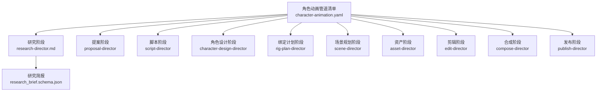
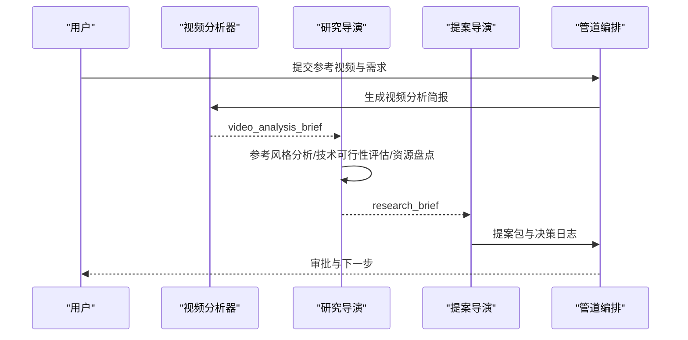
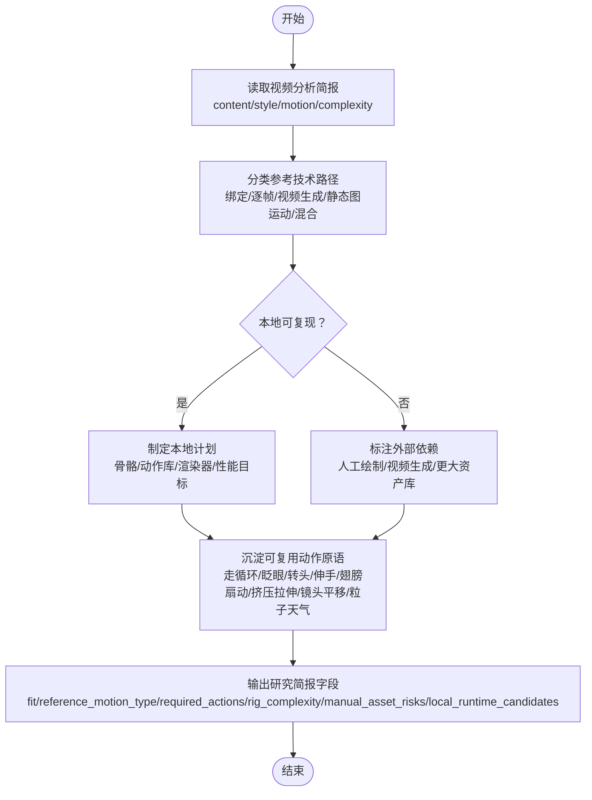
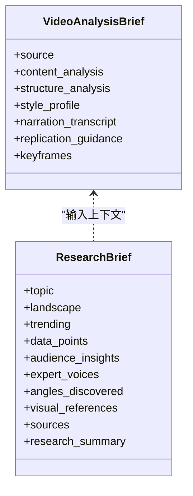

# 研究导演

<cite>
**本文引用的文件**
- [character-animation.yaml](file://pipeline_defs/character-animation.yaml)
- [research-director.md（角色动画）](file://skills/pipelines/character-animation/research-director.md)
- [executive-producer.md（角色动画）](file://skills/pipelines/character-animation/executive-producer.md)
- [video_analysis_brief.schema.json](file://schemas/artifacts/video_analysis_brief.schema.json)
- [research_brief.schema.json](file://schemas/artifacts/research_brief.schema.json)
- [test_character_animation_pipeline.py](file://tests/contracts/test_character_animation_pipeline.py)
- [character_animation.py](file://tools/character/character_animation.py)
- [cost_tracker.py](file://tools/cost_tracker.py)
- [slideshow_risk.py](file://lib/slideshow_risk.py)
- [threejs_world.py](file://tools/graphics/threejs_world.py)
</cite>

## 目录
1. [简介](#简介)
2. [项目结构](#项目结构)
3. [核心组件](#核心组件)
4. [架构总览](#架构总览)
5. [详细组件分析](#详细组件分析)
6. [依赖关系分析](#依赖关系分析)
7. [性能考量](#性能考量)
8. [故障排查指南](#故障排查指南)
9. [结论](#结论)
10. [附录](#附录)

## 简介
本技术文档聚焦OpenMontage角色动画管道中的“研究导演”阶段。研究导演在项目初期承担参考分析、技术调研、可行性评估与资源盘点四大职责，确保后续创意、脚本、资产与渲染方案建立在真实参考与可执行的技术基础上。其关键产出是结构化“研究简报”，并明确区分本地可复现的绑定动画与传统逐帧手绘等手工流程，避免在提案中给出无法自动实现的承诺。

## 项目结构
角色动画管道的编排由清单定义，研究阶段位于首步，负责产出研究简报；随后进入提案、脚本、角色设计、绑定计划、场景规划、资产、剪辑、合成与发布。研究阶段不直接调用工具，但会消费上游视频分析简报作为输入上下文。

图表来源
- [character-animation.yaml:61-76](file://pipeline_defs/character-animation.yaml#L61-L76)

章节来源
- [character-animation.yaml:1-303](file://pipeline_defs/character-animation.yaml#L1-L303)

## 核心组件
- 研究导演技能：面向角色动画的研究方法、参考识别、动作原语沉淀与可行性判断。
- 视频分析简报：对参考视频的结构性拆解，为研究提供内容、节奏、运动类型与复杂度信息。
- 研究简报：结构化输出，包含主题、领域现状、数据点、受众洞察、角度候选、视觉参考与来源。
- 管道编排与阶段契约：规定研究阶段的输入、产出、审查重点与成功标准。
- 成本追踪：用于预算估算、预留与实际花费记录，支撑成本估算与时间规划。
- 风险与质量门禁：如幻灯片风险评分、渲染质量门控，辅助可行性与性能评估。

章节来源
- [research-director.md（角色动画）:1-46](file://skills/pipelines/character-animation/research-director.md#L1-L46)
- [video_analysis_brief.schema.json:1-224](file://schemas/artifacts/video_analysis_brief.schema.json#L1-L224)
- [research_brief.schema.json:1-246](file://schemas/artifacts/research_brief.schema.json#L1-L246)
- [character-animation.yaml:61-76](file://pipeline_defs/character-animation.yaml#L61-L76)
- [cost_tracker.py:40-118](file://tools/cost_tracker.py#L40-L118)
- [slideshow_risk.py:34-68](file://lib/slideshow_risk.py#L34-L68)
- [threejs_world.py:159-181](file://tools/graphics/threejs_world.py#L159-L181)

## 架构总览
研究导演处于角色动画管道的起始位置，承接参考视频的结构化分析结果，进行风格与技术可行性评估，形成研究简报，供提案阶段选择概念、运行时与复用策略。

图表来源
- [character-animation.yaml:61-76](file://pipeline_defs/character-animation.yaml#L61-L76)
- [video_analysis_brief.schema.json:1-224](file://schemas/artifacts/video_analysis_brief.schema.json#L1-L224)
- [research_brief.schema.json:1-246](file://schemas/artifacts/research_brief.schema.json#L1-L246)

## 详细组件分析

### 参考分析与技术可行性评估流程
研究导演基于视频分析简报，识别参考实际使用的技术路径（绑定动画、传统逐帧、视频生成、静态图运动或混合），并据此评估本地可复现范围与外部依赖。

图表来源
- [research-director.md（角色动画）:9-39](file://skills/pipelines/character-animation/research-director.md#L9-L39)
- [video_analysis_brief.schema.json:34-121](file://schemas/artifacts/video_analysis_brief.schema.json#L34-L121)

章节来源
- [research-director.md（角色动画）:1-46](file://skills/pipelines/character-animation/research-director.md#L1-L46)
- [video_analysis_brief.schema.json:1-224](file://schemas/artifacts/video_analysis_brief.schema.json#L1-L224)

### 参考风格分析
研究导演需从视频分析简报中提取风格要素（色彩、转场、音乐、旁白、字幕、制作质量、最接近的样式模板），并结合领域现状与趋势，提出差异化方向。

图表来源
- [video_analysis_brief.schema.json:1-224](file://schemas/artifacts/video_analysis_brief.schema.json#L1-L224)
- [research_brief.schema.json:1-246](file://schemas/artifacts/research_brief.schema.json#L1-L246)

章节来源
- [video_analysis_brief.schema.json:122-208](file://schemas/artifacts/video_analysis_brief.schema.json#L122-L208)
- [research_brief.schema.json:19-241](file://schemas/artifacts/research_brief.schema.json#L19-L241)

### 目标平台与渲染环境评估
研究阶段应结合可用运行时与渲染能力，评估不同平台的约束与优势，并在后续阶段保持运行时一致性。

- 运行时选择：Remotion与HyperFrames在提案阶段呈现，研究需考虑两者差异与可用性。
- 渲染质量门控：三维世界渲染支持质量分级与保真度门禁，影响性能与产出稳定性。
- 幻灯片风险：当场景重复度高、运动弱或过度依赖排版时，需提示风险并调整方案。

章节来源
- [character-animation.yaml:77-112](file://pipeline_defs/character-animation.yaml#L77-L112)
- [threejs_world.py:159-181](file://tools/graphics/threejs_world.py#L159-L181)
- [slideshow_risk.py:34-68](file://lib/slideshow_risk.py#L34-L68)

### 成本估算与时间规划
研究导演需在早期建立成本基线，记录估算、预留与实际花费，配合管道预算上限与单次操作审批阈值，控制风险。

- 预算模型：总预算、预留比例、剩余可用预算、已花费与已预留。
- 估算与预留：为每个工具操作登记估算值，必要时预留资金，跟踪实际花费。
- 时间与修订：管道设置每阶段最大修订次数与最长运行时间，研究阶段需在此约束内完成。

章节来源
- [cost_tracker.py:40-118](file://tools/cost_tracker.py#L40-L118)
- [character-animation.yaml:45-51](file://pipeline_defs/character-animation.yaml#L45-L51)

### 不同类型角色动画项目的研究方法
- 卡通短片/吉祥物解说/音乐驱动角色片段/简单角色对话：优先使用本地可复用的绑定动画与动作库，强调动作原语沉淀与复用。
- 强表演/复杂交互：评估绑定复杂度与所需姿态库规模，提前标记高风险动作。
- 参考为逐帧手绘：明确不可由自动绑定完全复刻，建议采用受启发的本地绑定风格，并在研究简报中声明限制。

章节来源
- [executive-producer.md（角色动画）:1-30](file://skills/pipelines/character-animation/executive-producer.md#L1-L30)
- [research-director.md（角色动画）:11-28](file://skills/pipelines/character-animation/research-director.md#L11-L28)

### 最佳实践清单
- 以视频分析简报为锚点，先做技术路径分类再做可行性判断。
- 明确区分本地可复现与需要外部依赖的部分，避免在提案中暗示不可能达到的质量。
- 沉淀可复用动作原语，减少重复劳动并提升一致性。
- 将运行时选择与渲染质量门控纳入可行性评估，保证后续阶段的一致性。
- 用成本追踪记录估算与预留，配合管道预算与修订限制，控制风险。
- 对高风险场景（幻灯片倾向、弱运动、过度排版）提前预警并调整方案。

章节来源
- [research-director.md（角色动画）:9-46](file://skills/pipelines/character-animation/research-director.md#L9-L46)
- [character-animation.yaml:61-76](file://pipeline_defs/character-animation.yaml#L61-L76)
- [cost_tracker.py:40-118](file://tools/cost_tracker.py#L40-L118)
- [slideshow_risk.py:34-68](file://lib/slideshow_risk.py#L34-L68)

## 依赖关系分析
研究阶段依赖视频分析简报作为输入，产出研究简报；提案阶段依赖研究简报进行概念选择与运行时决策；后续各阶段按清单顺序推进，形成稳定的数据流与契约。

```mermaid
graph LR
VAB["视频分析简报<br/>video_analysis_brief.schema.json"] --> RB["研究简报<br/>research_brief.schema.json"]
RB --> PP["提案包<br/>proposal_packet"]
PP --> SD["脚本<br/>script"]
SD --> CD["角色设计<br/>character_design"]
CD --> RP["绑定计划<br/>rig_plan"]
RP --> SP["场景规划<br/>scene_plan"]
SP --> AM["资产清单<br/>asset_manifest"]
AM --> ED["剪辑决策<br/>edit_decisions"]
ED --> AT["动作时间线<br/>action_timeline"]
AT --> CR["渲染报告<br/>render_report"]
CR --> FR["最终评审<br/>final_review"]
```

图表来源
- [video_analysis_brief.schema.json:1-224](file://schemas/artifacts/video_analysis_brief.schema.json#L1-L224)
- [research_brief.schema.json:1-246](file://schemas/artifacts/research_brief.schema.json#L1-L246)
- [character-animation.yaml:61-303](file://pipeline_defs/character-animation.yaml#L61-L303)

章节来源
- [character-animation.yaml:61-303](file://pipeline_defs/character-animation.yaml#L61-L303)

## 性能考量
- 渲染质量与性能：三维世界渲染支持质量分级与保真度门禁，应在研究阶段预估质量层级对性能的影响。
- 幻灯片风险：当场景重复度高、运动弱或过度依赖排版时，评分系统会提示风险，需调整分镜与动作设计。
- 运行时一致性：提案选择的运行时必须在合成阶段保持一致，避免降级到仅静态图像的运动。

章节来源
- [threejs_world.py:159-181](file://tools/graphics/threejs_world.py#L159-L181)
- [slideshow_risk.py:34-68](file://lib/slideshow_risk.py#L34-L68)
- [character-animation.yaml:251-281](file://pipeline_defs/character-animation.yaml#L251-L281)

## 故障排查指南
- 研究简报未通过校验：检查schema必填字段是否齐全，尤其是领域现状、数据点、受众洞察、角度候选与来源。
- 运行时不一致：确认提案选择的运行时在合成阶段未被替换或降级。
- 成本超支：核对成本追踪条目状态（估算/预留/实际），检查预算剩余与预留占用。
- 幻灯片风险高：审视场景重复度、运动强度与排版依赖，调整分镜与动作设计。

章节来源
- [research_brief.schema.json:1-246](file://schemas/artifacts/research_brief.schema.json#L1-L246)
- [cost_tracker.py:40-118](file://tools/cost_tracker.py#L40-L118)
- [slideshow_risk.py:34-68](file://lib/slideshow_risk.py#L34-L68)
- [character-animation.yaml:251-281](file://pipeline_defs/character-animation.yaml#L251-L281)

## 结论
研究导演是角色动画管道的基石，通过对参考视频的结构化分析、技术路径分类、可行性评估与资源盘点，为后续提案、脚本、资产与渲染提供可靠依据。坚持本地可复现优先、沉淀动作原语、严格运行时一致性与成本管控，能够显著提升项目成功率与交付质量。

## 附录
- 管道阶段顺序与契约：研究→提案→脚本→角色设计→绑定计划→场景规划→资产→剪辑→合成→发布。
- 测试覆盖：角色动画管道契约测试验证阶段顺序与必需工具集合，确保实现与清单一致。

章节来源
- [character-animation.yaml:61-303](file://pipeline_defs/character-animation.yaml#L61-L303)
- [test_character_animation_pipeline.py:27-50](file://tests/contracts/test_character_animation_pipeline.py#L27-L50)
- [test_character_animation_pipeline.py:77-116](file://tests/contracts/test_character_animation_pipeline.py#L77-L116)