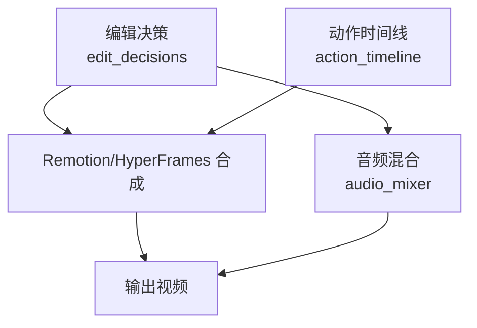
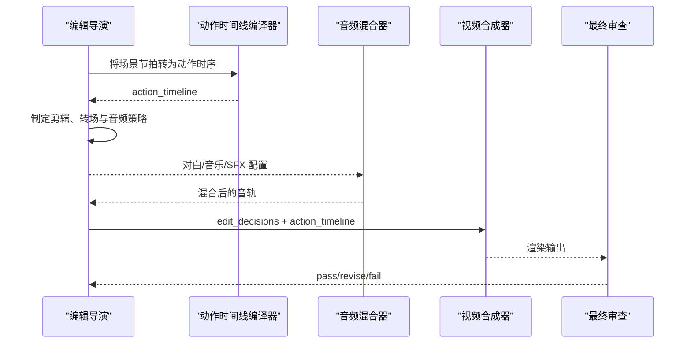
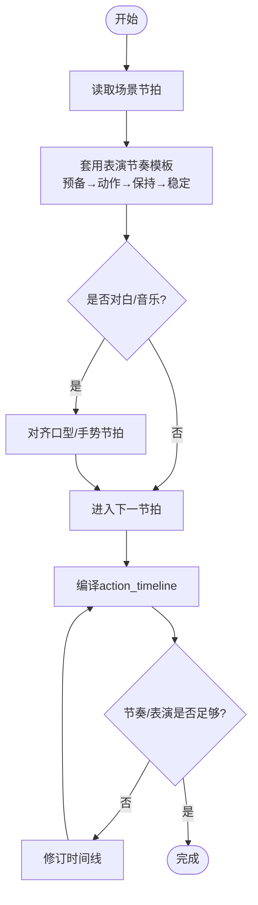
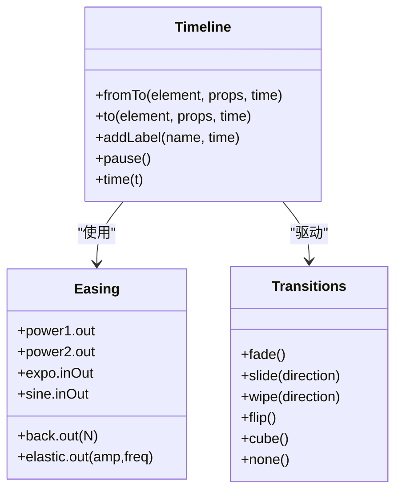
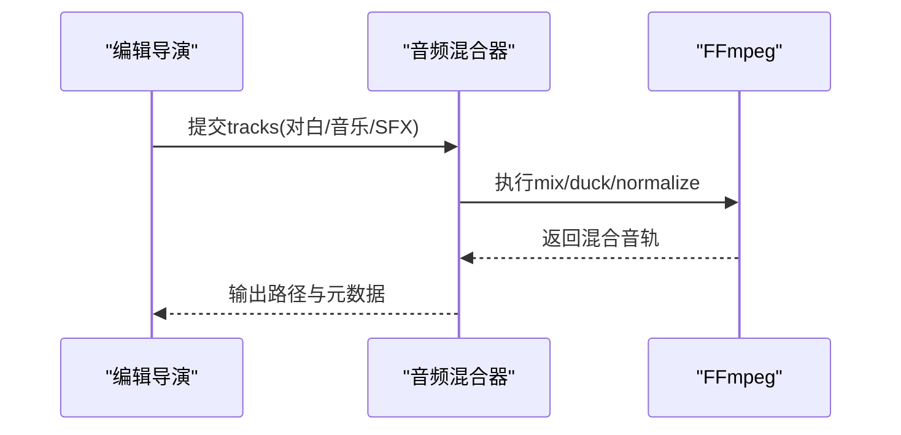
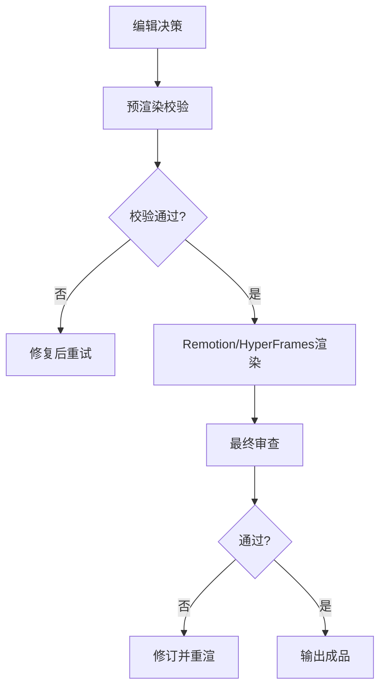
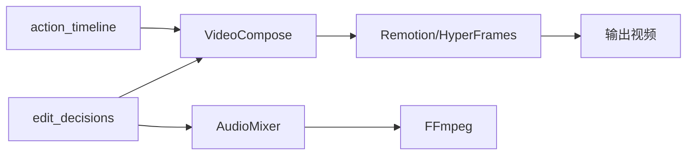

# 编辑导演

<cite>
**本文引用的文件**
- [edit-director.md](file://skills/pipelines/character-animation/edit-director.md)
- [edit-director.md](file://skills/pipelines/documentary-montage/edit-director.md)
- [edit-director.md](file://skills/pipelines/cinematic/edit-director.md)
- [action_timeline.schema.json](file://schemas/artifacts/action_timeline.schema.json)
- [edit_decisions.schema.json](file://schemas/artifacts/edit_decisions.schema.json)
- [final_review.schema.json](file://schemas/artifacts/final_review.schema.json)
- [character_animation.py](file://tools/character/character_animation.py)
- [audio_mixer.py](file://tools/audio/audio_mixer.py)
- [video_compose.py](file://tools/video/video_compose.py)
- [gsap-easing-and-stagger.md](file://.agents/skills/hyperframes-animation/adapters/gsap-easing-and-stagger.md)
- [gsap-timeline-and-labels.md](file://.agents/skills/hyperframes-animation/adapters/gsap-timeline-and-labels.md)
- [transitions.md](file://.agents/skills/remotion-to-hyperframes/references/transitions.md)
- [SKILL.md](file://.agents/skills/remotion-to-hyperframes/SKILL.md)
- [test_04_audio_mix.py](file://tests/qa/test_04_audio_mix.py)
- [test_audio_mixer_segmented_music.py](file://tests/tools/test_audio_mixer_segmented_music.py)
- [compose-director.md](file://skills/pipelines/animation/compose-director.md)
</cite>

## 目录
1. [简介](#简介)
2. [项目结构](#项目结构)
3. [核心组件](#核心组件)
4. [架构总览](#架构总览)
5. [详细组件分析](#详细组件分析)
6. [依赖关系分析](#依赖关系分析)
7. [性能考量](#性能考量)
8. [故障排查指南](#故障排查指南)
9. [结论](#结论)
10. [附录](#附录)

## 简介
本技术文档面向OpenMontage角色动画管道中的“编辑导演”角色，聚焦以下职责与实现：
- 时间线编排、节奏控制、剪辑点与转场设计
- 角色动画的时间轴管理：动作时序、对白同步、音乐配合与音效定位
- 编辑决策的技术实现：关键帧调整、缓动曲线设置、循环动画处理与过渡效果应用
- 音频处理的集成：语音合成、背景音乐混音、音效添加与音量平衡
- 质量标准、审查流程与最终输出的技术规范

## 项目结构
围绕编辑导演的数据契约与工具链，主要涉及三类资产与工具：
- 编辑产物与时间线：edit_decisions（剪辑、覆盖层、音频配置、转场）、action_timeline（角色动作时序）
- 渲染与合成：Remotion/HyperFrames 时间线与转场映射、视频合成器
- 音频混合：AudioMixer（混音、闪避、淡入淡出、分段音乐）

图表来源
- [edit_decisions.schema.json:1-238](file://schemas/artifacts/edit_decisions.schema.json#L1-L238)
- [action_timeline.schema.json:1-51](file://schemas/artifacts/action_timeline.schema.json#L1-L51)
- [video_compose.py:1944-1970](file://tools/video/video_compose.py#L1944-L1970)
- [audio_mixer.py:1-200](file://tools/audio/audio_mixer.py#L1-L200)

章节来源
- [edit_decisions.schema.json:1-238](file://schemas/artifacts/edit_decisions.schema.json#L1-L238)
- [action_timeline.schema.json:1-51](file://schemas/artifacts/action_timeline.schema.json#L1-L51)
- [video_compose.py:1944-1970](file://tools/video/video_compose.py#L1944-L1970)
- [audio_mixer.py:1-200](file://tools/audio/audio_mixer.py#L1-L200)

## 核心组件
- 编辑决策（edit_decisions）：定义剪辑序列、覆盖层、音频配置（旁白/音乐/SFX）、全局转场、渲染运行时与组合模式等。
- 动作时间线（action_timeline）：按场景组织角色动作、姿态、情绪、目标、缓动与时长，供渲染器驱动角色动画。
- 动作时间线编译器（ActionTimelineCompiler）：将场景节拍转换为可渲染的动作时序，并生成预览。
- 音频混合器（AudioMixer）：提供混音、闪避、淡入淡出、标准化、分段音乐等功能，支撑对白、音乐与音效的平衡。
- 视频合成器（VideoCompose）：通过Remotion或HyperFrames执行基于编辑决策的最终合成与导出。

章节来源
- [edit_decisions.schema.json:1-238](file://schemas/artifacts/edit_decisions.schema.json#L1-L238)
- [action_timeline.schema.json:1-51](file://schemas/artifacts/action_timeline.schema.json#L1-L51)
- [character_animation.py:370-586](file://tools/character/character_animation.py#L370-L586)
- [audio_mixer.py:1-200](file://tools/audio/audio_mixer.py#L1-L200)
- [video_compose.py:1944-1970](file://tools/video/video_compose.py#L1944-L1970)

## 架构总览
编辑导演在角色动画管道中的工作流如下：
- 输入：提案阶段的render_runtime、场景计划、脚本与资产清单
- 产出：edit_decisions（剪辑、覆盖层、音频配置、转场）与action_timeline（角色动作时序）
- 合成：根据render_runtime选择Remotion或HyperFrames进行画面合成；使用AudioMixer完成对白、音乐、音效的混音与平衡
- 质量：最终审查artifact（final_review）确保技术、视觉与音频达标

图表来源
- [character_animation.py:370-586](file://tools/character/character_animation.py#L370-L586)
- [audio_mixer.py:1-200](file://tools/audio/audio_mixer.py#L1-L200)
- [video_compose.py:1944-1970](file://tools/video/video_compose.py#L1944-L1970)
- [final_review.schema.json:1-35](file://schemas/artifacts/final_review.schema.json#L1-L35)

## 详细组件分析

### 时间线编排与节奏控制
- 节奏网格：依据风格基调与目标时长计算每个镜头的保持时间，保证总时长在允许误差内。
- 叙事优先：按叙事节拍排列镜头，仅在音乐强拍或视觉单调时微调顺序，并记录重排原因。
- 裁剪到节拍：为每个素材选取最佳子窗口，提前于动作自然结束处切出，两端留余量以便转场与淡入淡出。
- 音乐同步：对位强拍、在情感中心保留一次短暂静音、片尾渐弱以让最终画面呼吸。
- 转场词汇：限制转场类型（硬切、溶解、黑场淡入淡出），避免花哨效果破坏纪实感。

章节来源
- [edit-director.md:41-172](file://skills/pipelines/documentary-montage/edit-director.md#L41-L172)
- [edit-director.md:1-57](file://skills/pipelines/cinematic/edit-director.md#L1-L57)

### 角色动画时间轴管理
- 动作时序：将场景节拍转化为角色的“预备—动作—保持/反应—稳定”四段式表演节奏。
- 对白同步：对齐口型与手势节拍至对白或音乐节拍，确保视听一致。
- 工具支持：使用动作时间线编译器生成初版时间线，再人工修订以强化表演与节奏。
- 质量要求：每个场景必须有带时间的动作，且能映射到渲染器可理解的姿态、动作循环或程序化效果。

图表来源
- [edit-director.md:1-34](file://skills/pipelines/character-animation/edit-director.md#L1-L34)
- [character_animation.py:370-586](file://tools/character/character_animation.py#L370-L586)

章节来源
- [edit-director.md:1-34](file://skills/pipelines/character-animation/edit-director.md#L1-L34)
- [character_animation.py:370-586](file://tools/character/character_animation.py#L370-L586)

### 关键帧调整、缓动曲线与循环动画
- 关键帧与缓动：在HyperFrames/GSAP中通过from/to/fromTo设置关键帧，使用power系列、back、elastic、expo、sine等缓动表达不同性格与力度。
- 循环动画：对于需要重复的运动（如粒子、环境漂移），采用有限repeat与seek驱动的timeline，避免无限循环导致渲染不一致。
- 转场映射：Remotion presentation到HF的转场映射（淡入淡出、滑动、擦除、翻转、立方体等），并按帧数换算秒级时长。

图表来源
- [gsap-easing-and-stagger.md:1-36](file://.agents/skills/hyperframes-animation/adapters/gsap-easing-and-stagger.md#L1-L36)
- [gsap-timeline-and-labels.md:46-94](file://.agents/skills/hyperframes-animation/adapters/gsap-timeline-and-labels.md#L46-L94)
- [transitions.md:39-60](file://.agents/skills/remotion-to-hyperframes/references/transitions.md#L39-L60)

章节来源
- [gsap-easing-and-stagger.md:1-36](file://.agents/skills/hyperframes-animation/adapters/gsap-easing-and-stagger.md#L1-L36)
- [gsap-timeline-and-labels.md:46-94](file://.agents/skills/hyperframes-animation/adapters/gsap-timeline-and-labels.md#L46-L94)
- [transitions.md:39-60](file://.agents/skills/remotion-to-hyperframes/references/transitions.md#L39-L60)

### 音频处理集成
- 对白与音乐混音：支持多轨道混音、淡入淡出、延迟启动、标准化与目标响度（LUFS）。
- 闪避（Ducking）：在对白期间降低背景音乐音量，参数包括阈值、衰减、攻击与释放时间。
- 分段音乐：仅在规定时间段内播放背景音乐，边界平滑淡入淡出，其余时段静音。
- 测试验证：基础混音、淡入淡出、闪避、延迟音乐等用例均提供测试保障。

图表来源
- [audio_mixer.py:1-200](file://tools/audio/audio_mixer.py#L1-L200)
- [test_04_audio_mix.py:41-112](file://tests/qa/test_04_audio_mix.py#L41-L112)
- [test_audio_mixer_segmented_music.py:78-119](file://tests/tools/test_audio_mixer_segmented_music.py#L78-L119)

章节来源
- [audio_mixer.py:1-200](file://tools/audio/audio_mixer.py#L1-L200)
- [test_04_audio_mix.py:41-112](file://tests/qa/test_04_audio_mix.py#L41-L112)
- [test_audio_mixer_segmented_music.py:78-119](file://tests/tools/test_audio_mixer_segmented_music.py#L78-L119)

### 最终输出与质量控制
- 渲染运行时：锁定remotion/hyperframes/ffmpeg之一，编辑阶段不得随意更改。
- 组合模式：templated或atelier，后者需本地Remotion入口与艺术方向承诺。
- 最终审查：必须生成final_review，包含技术探测、视觉抽查、音频抽查、承诺保持与字幕检查，状态为pass/revise/fail。
- 预渲染校验：在Remotion渲染前运行composition_validator，防止缺失资源、无效时序与音画长度不匹配。

图表来源
- [compose-director.md:36-199](file://skills/pipelines/animation/compose-director.md#L36-L199)
- [final_review.schema.json:1-35](file://schemas/artifacts/final_review.schema.json#L1-L35)
- [edit_decisions.schema.json:196-225](file://schemas/artifacts/edit_decisions.schema.json#L196-L225)

章节来源
- [compose-director.md:36-199](file://skills/pipelines/animation/compose-director.md#L36-L199)
- [final_review.schema.json:1-35](file://schemas/artifacts/final_review.schema.json#L1-L35)
- [edit_decisions.schema.json:196-225](file://schemas/artifacts/edit_decisions.schema.json#L196-L225)

## 依赖关系分析
- 编辑决策与动作时间线是渲染器的输入契约，决定画面与角色行为。
- 音频混合器依赖FFmpeg与可选pydub，提供混音、闪避、标准化能力。
- 视频合成器依赖Node.js与npx以调用Remotion，或通过HyperFrames执行GSAP时间线。
- 转场与缓动由HyperFrames/GSAP技能规范约束，确保跨平台一致性。

图表来源
- [video_compose.py:1944-1970](file://tools/video/video_compose.py#L1944-L1970)
- [audio_mixer.py:1-200](file://tools/audio/audio_mixer.py#L1-L200)
- [SKILL.md:66-93](file://.agents/skills/remotion-to-hyperframes/SKILL.md#L66-L93)

章节来源
- [video_compose.py:1944-1970](file://tools/video/video_compose.py#L1944-L1970)
- [audio_mixer.py:1-200](file://tools/audio/audio_mixer.py#L1-L200)
- [SKILL.md:66-93](file://.agents/skills/remotion-to-hyperframes/SKILL.md#L66-L93)

## 性能考量
- 时间线长度与复杂度：减少不必要的逐帧DOM操作，仅在内容切换时更新文本与样式。
- 缓动选择：避免过度复杂的弹性曲线导致CPU峰值；合理选择power/ease家族提升流畅度。
- 音频处理：合理使用闪避与标准化，避免过大的动态范围造成重编码开销。
- 渲染并发：根据机器资源配置Remotion并发与CRF，平衡质量与速度。

[本节为通用指导，无需特定文件引用]

## 故障排查指南
- 缺失资源导致黑帧：确保Remotion public目录包含所有图像与音乐；预渲染校验失败立即修复。
- 时间线错位：核对data-start/data-duration与GSAP timeline注册键，避免异步构建或嵌套导致的时序错乱。
- 音频不对齐：检查对白与音乐的start_seconds、fade_in/out与ducking参数；使用分段音乐功能限定音乐区间。
- 审查未通过：根据final_review的checks逐项修复，直至status为pass。

章节来源
- [compose-director.md:36-199](file://skills/pipelines/animation/compose-director.md#L36-L199)
- [gsap-timeline-and-labels.md:46-94](file://.agents/skills/hyperframes-animation/adapters/gsap-timeline-and-labels.md#L46-L94)
- [audio_mixer.py:1-200](file://tools/audio/audio_mixer.py#L1-L200)
- [final_review.schema.json:1-35](file://schemas/artifacts/final_review.schema.json#L1-L35)

## 结论
编辑导演在OpenMontage角色动画管道中承担时间线编排、节奏控制、剪辑与转场设计的核心职责，并通过action_timeline与edit_decisions将创意意图转化为可执行的渲染契约。借助AudioMixer与VideoCompose，实现对白、音乐、音效的精确混音与高质量合成。严格的质量标准与审查流程确保最终输出达到技术与艺术的双重要求。

[本节为总结性内容，无需特定文件引用]

## 附录
- 术语
  - 编辑决策（edit_decisions）：描述剪辑、覆盖层、音频配置与转场的结构化数据。
  - 动作时间线（action_timeline）：描述角色动作、姿态与情绪的时序化数据。
  - 闪避（Ducking）：在对白期间自动降低背景音乐音量。
  - 分段音乐：仅在指定时间段播放背景音乐，边界平滑过渡。
- 参考路径
  - 编辑导演流程：[edit-director.md](file://skills/pipelines/character-animation/edit-director.md)
  - 动作时间线编译器：[character_animation.py](file://tools/character/character_animation.py)
  - 音频混合器：[audio_mixer.py](file://tools/audio/audio_mixer.py)
  - Remotion/HyperFrames合成：[video_compose.py](file://tools/video/video_compose.py)
  - 转场与缓动：[transitions.md](file://.agents/skills/remotion-to-hyperframes/references/transitions.md)、[gsap-easing-and-stagger.md](file://.agents/skills/hyperframes-animation/adapters/gsap-easing-and-stagger.md)

[本节为附录信息，无需特定文件引用]