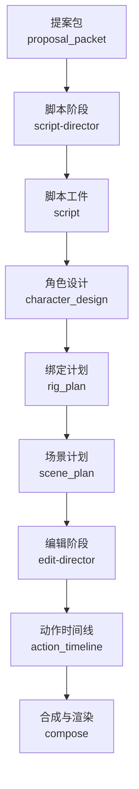
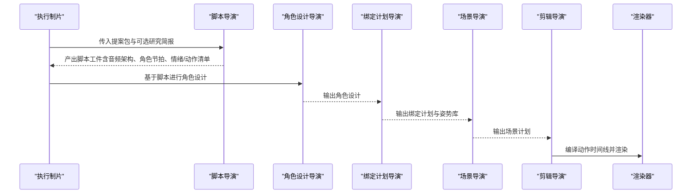
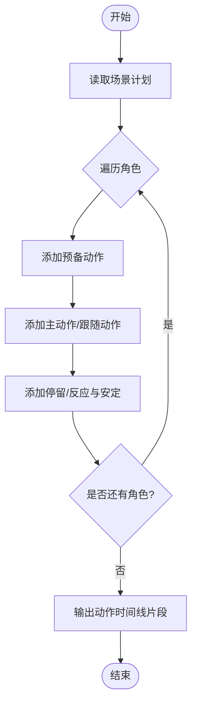

# 脚本导演

<cite>
**本文引用的文件**
- [skills/pipelines/character-animation/script-director.md](file://skills/pipelines/character-animation/script-director.md)
- [skills/pipelines/animation/script-director.md](file://skills/pipelines/animation/script-director.md)
- [skills/pipelines/character-animation/edit-director.md](file://skills/pipelines/character-animation/edit-director.md)
- [skills/meta/voice-performance-director.md](file://skills/meta/voice-performance-director.md)
- [pipeline_defs/character-animation.yaml](file://pipeline_defs/character-animation.yaml)
- [schemas/artifacts/script.schema.json](file://schemas/artifacts/script.schema.json)
- [schemas/artifacts/action_timeline.schema.json](file://schemas/artifacts/action_timeline.schema.json)
- [schemas/artifacts/character_design.schema.json](file://schemas/artifacts/character_design.schema.json)
- [tools/character/character_animation.py](file://tools/character/character_animation.py)
- [skills/creative/sound-design.md](file://skills/creative/sound-design.md)
- [styles/anime-ghibli.yaml](file://styles/anime-ghibli.yaml)
- [.agents/skills/pose-library-design/SKILL.md](file://.agents/skills/pose-library-design/SKILL.md)
</cite>

## 目录
1. [简介](#简介)
2. [项目结构](#项目结构)
3. [核心组件](#核心组件)
4. [架构总览](#架构总览)
5. [详细组件分析](#详细组件分析)
6. [依赖关系分析](#依赖关系分析)
7. [性能与节奏考量](#性能与节奏考量)
8. [故障排查指南](#故障排查指南)
9. [结论](#结论)
10. [附录：模板与技巧](#附录模板与技巧)

## 简介
本技术文档面向OpenMontage角色动画管道中的“脚本导演”岗位，聚焦如何将创意概念转化为可执行的动画脚本。内容覆盖故事板编写、对白创作、动作设计与节奏控制；角色表演设计（表情、肢体语言、情感表达、互动关系）；动作友好型剧本原则；对话场景、独白处理、背景音乐与音效设计的完整流程；以及不同类型角色的脚本模板与创作技巧。

## 项目结构
OpenMontage通过“技能+管线定义+工件Schema+工具实现”的方式组织脚本导演工作流：
- 技能层：明确脚本导演的目标、流程、写作规则与门禁要求。
- 管线层：将“脚本”阶段嵌入角色动画管线的固定顺序中，并规定输入输出工件。
- 工件层：用JSON Schema严格约束脚本、动作时间线等数据结构。
- 工具层：提供动作时间线编译器等工具，将场景计划转换为可渲染的时序动作。

**图表来源**
- [pipeline_defs/character-animation.yaml:113-249](file://pipeline_defs/character-animation.yaml#L113-L249)
- [tools/character/character_animation.py:370-450](file://tools/character/character_animation.py#L370-L450)

**章节来源**
- [pipeline_defs/character-animation.yaml:113-249](file://pipeline_defs/character-animation.yaml#L113-L249)

## 核心组件
- 脚本导演技能：定义目标、流程、写作规则与门禁，强调“可表演的节拍”，而非纯旁白。
- 声音表现导演元技能：为TTS生成提供结构化语音表现契约，贯穿脚本到资产生成。
- 动作时间线编译器：将场景计划转为带时间戳的角色动作序列，供渲染器消费。
- 工件Schema：脚本、动作时间线、角色设计等数据结构的强类型约束，确保跨阶段一致性。

**章节来源**
- [skills/pipelines/character-animation/script-director.md:1-47](file://skills/pipelines/character-animation/script-director.md#L1-L47)
- [skills/meta/voice-performance-director.md:1-94](file://skills/meta/voice-performance-director.md#L1-L94)
- [tools/character/character_animation.py:370-450](file://tools/character/character_animation.py#L370-L450)
- [schemas/artifacts/script.schema.json:1-105](file://schemas/artifacts/script.schema.json#L1-L105)
- [schemas/artifacts/action_timeline.schema.json:1-51](file://schemas/artifacts/action_timeline.schema.json#L1-L51)
- [schemas/artifacts/character_design.schema.json:1-46](file://schemas/artifacts/character_design.schema.json#L1-L46)

## 架构总览
脚本导演在角色动画管线中处于“提案→脚本→角色设计→绑定→场景→编辑→合成”的关键位置。其产出“脚本”工件被后续阶段消费，驱动角色设计、绑定计划、场景计划与动作时间线。

**图表来源**
- [pipeline_defs/character-animation.yaml:113-249](file://pipeline_defs/character-animation.yaml#L113-L249)
- [tools/character/character_animation.py:370-450](file://tools/character/character_animation.py#L370-L450)

## 详细组件分析

### 脚本导演（角色动画管线）
- 目标：写出“可表演的动画节拍”，而非仅旁白。
- 流程：
  - 锁定音频架构：纯音乐、旁白、角色对白、旁白+角色声音/对白。
  - 将故事拆分为可用姿势表演的节拍。
  - 每个节拍明确视觉变化：情绪、视线、身体姿态、道具交互、镜头、环境。
- 写作规则：
  - 偏好短小可视节拍与可读停顿。
  - 避免需要大量手绘独特姿势的动作，除非已获批准。
  - 对白长度需适配口型近似。
  - 无声/音乐主导场景需强化肢体表演说明。
- 输出元信息：包含音频架构、角色节拍、所需情绪、所需动作。
- 门禁：人类审批通过后进入下一环节。

**章节来源**
- [skills/pipelines/character-animation/script-director.md:1-47](file://skills/pipelines/character-animation/script-director.md#L1-L47)

### 脚本导演（通用动画管线）
- 目标：将已批准的提案转化为可动画化的节拍，保留运动、调度与停顿空间，并尊重所选动画模式与研究结论。
- 前置资源：提案包（概念、动画模式、时长、复用策略）、可选研究简报（数据点、受众误区、准确性约束）。
- 关键要点：
  - 标题与钩子需在开场兑现承诺。
  - 根据动画模式限制写作方式（如manim/remotion/ai_video/diagram_stills/mixed）。
  - 遵循叙事结构（渐进构建、破除迷思、旅程等）。
  - 按目标时长估算词预算（约每秒2.5词）。
  - 复用策略决定脚本结构的重复性。

**章节来源**
- [skills/pipelines/animation/script-director.md:1-33](file://skills/pipelines/animation/script-director.md#L1-L33)

### 声音表现导演（TTS与旁白）
- 契约：脚本顶部包含voice_performance对象，段落级包含delivery_cues。
- 写作规则：口语化短句、轻缩略语、清晰标点；用静默做结构；谨慎使用停顿标签；每段一个表达意图。
- 供应商映射：OpenAI TTS指令、Google TTS SSML、ElevenLabs稳定性/风格/速度等参数。
- 样本门禁：先对最敏感段落生成样本，验证后再批量生产。

**章节来源**
- [skills/meta/voice-performance-director.md:1-94](file://skills/meta/voice-performance-director.md#L1-L94)

### 动作时间线编译器（从场景到时序动作）
- 输入：场景计划、角色ID列表、帧率等。
- 行为：为每个场景生成“预备→动作→停留/反应→安定”的时序动作，对齐镜头、背景、特效。
- 输出：动作时间线工件，供渲染器消费。

**图表来源**
- [tools/character/character_animation.py:395-450](file://tools/character/character_animation.py#L395-L450)

**章节来源**
- [tools/character/character_animation.py:370-450](file://tools/character/character_animation.py#L370-L450)

### 剪辑导演（节拍转动作时间线）
- 目标：产出编辑决策与动作时间线。
- 流程：携带渲染运行时；将场景节拍转为带时长的角色动作；加入预备、停留、动作与余韵；对齐口型/手势与对白或音乐；保持动作密度可读。
- 质量门槛：每个场景都有定时动作；每个动作映射到姿势、动作循环或程序效果。

**章节来源**
- [skills/pipelines/character-animation/edit-director.md:1-34](file://skills/pipelines/character-animation/edit-director.md#L1-L34)

### 角色设计与姿势库（表情、肢体、动作）
- 角色设计：明确角色ID、角色、体型、风格、剪影备注、必需情绪、必需动作、视角与道具。
- 姿势库：分类包括中性、注意力、情绪、动作、口型；采用“预备→动作→停留→安定”的时序模式；只命名变化的部位，默认来自绑定。

**章节来源**
- [schemas/artifacts/character_design.schema.json:1-46](file://schemas/artifacts/character_design.schema.json#L1-L46)
- [.agents/skills/pose-library-design/SKILL.md:1-59](file://.agents/skills/pose-library-design/SKILL.md#L1-L59)

### 音频与音效设计（对话、独白、BGM、SFX）
- 音量与响度：对白峰值-12dB，集成响度-16~-14 LUFS；音乐低于对白18~20dB；SFX介于对白与音乐之间；最终混音不超过0dB。
- 动态避让：对白激活时音乐避让6~12dB，复杂教育主题可达22dB；切频让位给语音清晰度。
- 音乐选择：按内容类型匹配BPM与情绪；有旁白时使用纯音乐。
- SFX放置：转场、出现、点击、上升、冲击等类别与时长、电平规范。

**章节来源**
- [skills/creative/sound-design.md:1-70](file://skills/creative/sound-design.md#L1-L70)
- [styles/anime-ghibli.yaml:43-60](file://styles/anime-ghibli.yaml#L43-L60)

## 依赖关系分析
- 脚本阶段依赖提案包与研究简报，产出脚本工件。
- 角色设计依赖脚本与提案包，产出角色设计。
- 绑定计划依赖角色设计，产出绑定计划与姿势库。
- 场景计划依赖脚本、角色设计、绑定计划与姿势库，产出场景计划。
- 剪辑阶段依赖场景计划、资产清单与姿势库，产出编辑决策与动作时间线。
- 合成阶段依赖编辑决策、动作时间线与资产清单，产出渲染报告与最终审查。

**图表来源**
- [pipeline_defs/character-animation.yaml:113-249](file://pipeline_defs/character-animation.yaml#L113-L249)

**章节来源**
- [pipeline_defs/character-animation.yaml:113-249](file://pipeline_defs/character-animation.yaml#L113-L249)

## 性能与节奏考量
- 节拍密度：避免连续动画一切；停顿是表演的一部分。
- 动作可读性：保持动作密度适中，便于观众理解。
- 节奏曲线：开场钩子、中段推进、结尾收束；避免单调的相同镜头时长。
- 文本阅读节奏：依据字符数与语言特性调整显示时长与停顿。
- 音频节奏：对白、音乐、音效分层管理，避免掩蔽与冲突。

[本节为通用指导，不直接分析具体文件]

## 故障排查指南
- 脚本无音频架构或未拆分角色节拍：回退至脚本导演重写，补充audio_architecture与character_beats。
- 对白过长导致口型近似困难：缩短句子，拆分段落，增加停顿提示。
- 动作时间线缺少定时动作：检查场景计划是否包含动作描述，重新运行动作时间线编译器。
- TTS表现平淡：调整voice_performance与delivery_cues，先对敏感段落生成样本验证。
- 音乐掩盖对白：降低音乐音量或做避让处理，必要时切频提升语音清晰度。

**章节来源**
- [skills/meta/voice-performance-director.md:72-94](file://skills/meta/voice-performance-director.md#L72-L94)
- [tools/character/character_animation.py:395-450](file://tools/character/character_animation.py#L395-L450)
- [skills/creative/sound-design.md:20-34](file://skills/creative/sound-design.md#L20-L34)

## 结论
脚本导演在OpenMontage角色动画管道中承担“创意→可执行节拍”的关键转化职责。通过严格的工件Schema、明确的写作规则与声音表现契约，配合动作时间线编译器与剪辑导演，确保角色表演、节奏与音频层次一致且可渲染。遵循动作友好型原则与节奏最佳实践，可显著提升制作效率与最终观感。

[本节为总结，不直接分析具体文件]

## 附录：模板与技巧

### 动作友好型剧本编写原则
- 优先短小可视节拍与可读停顿。
- 避免需要大量手绘独特姿势的动作，除非已获批准。
- 对白长度适配口型近似。
- 无声/音乐主导场景强化肢体表演说明。

**章节来源**
- [skills/pipelines/character-animation/script-director.md:23-28](file://skills/pipelines/character-animation/script-director.md#L23-L28)

### 对话场景设计
- 明确音频架构：旁白+角色对白、纯音乐、纯对白等。
- 对白分段：每段一个表达意图，配合停顿与强调。
- 口型与手势：对齐节拍，保持动作密度可读。

**章节来源**
- [skills/meta/voice-performance-director.md:14-42](file://skills/meta/voice-performance-director.md#L14-L42)
- [skills/pipelines/character-animation/edit-director.md:9-13](file://skills/pipelines/character-animation/edit-director.md#L9-L13)

### 独白处理
- 使用voice_performance设定整体语气、节奏曲线与停顿策略。
- 段落级delivery_cues指定pace、energy、emphasis_words与pause。
- 先对敏感段落生成TTS样本，确认后再批量生产。

**章节来源**
- [skills/meta/voice-performance-director.md:14-42](file://skills/meta/voice-performance-director.md#L14-L42)
- [skills/meta/voice-performance-director.md:72-94](file://skills/meta/voice-performance-director.md#L72-L94)

### 背景音乐配合与音效设计
- 音乐选择按内容类型匹配BPM与情绪，旁白时优先纯音乐。
- 对白激活时对音乐做避让，必要时切频提升清晰度。
- SFX用于转场、出现、点击、上升、冲击等，控制时长与电平。

**章节来源**
- [skills/creative/sound-design.md:36-70](file://skills/creative/sound-design.md#L36-L70)
- [styles/anime-ghibli.yaml:55-60](file://styles/anime-ghibli.yaml#L55-L60)

### 角色表演设计（表情、肢体、情感、互动）
- 角色设计明确必需情绪与动作，支撑故事所需的表演范围。
- 姿势库按分类组织，采用“预备→动作→停留→安定”时序。
- 多角色互动通过时间偏移与主次动作区分（主角色perform，配角follow/react）。

**章节来源**
- [schemas/artifacts/character_design.schema.json:20-37](file://schemas/artifacts/character_design.schema.json#L20-L37)
- [.agents/skills/pose-library-design/SKILL.md:11-27](file://.agents/skills/pose-library-design/SKILL.md#L11-L27)
- [tools/character/character_animation.py:404-439](file://tools/character/character_animation.py#L404-L439)

### 节奏控制与节拍结构
- 大多数表演节拍遵循“预备→动作→停留/反应→安定”。
- 避免连续动画一切；停顿是表演的一部分。
- 文本与画面节奏匹配，避免过快或过慢。

**章节来源**
- [skills/pipelines/character-animation/edit-director.md:15-23](file://skills/pipelines/character-animation/edit-director.md#L15-L23)

### 不同类型角色的脚本模板与技巧
- 单角色独白：以voice_performance为主线，段落级delivery_cues细化节奏与强调。
- 双角色对话：明确主次角色动作与反应，利用时间偏移与easing增强层次感。
- 群像/多角色：控制角色数量与复杂度，避免超出预算与时长承载。
- 动物/非人角色：需物种特定部件与动作循环，注意视角与道具。

**章节来源**
- [skills/pipelines/character-animation/character-design-director.md:10-23](file://skills/pipelines/character-animation/character-design-director.md#L10-L23)
- [tools/character/character_animation.py:404-439](file://tools/character/character_animation.py#L404-L439)