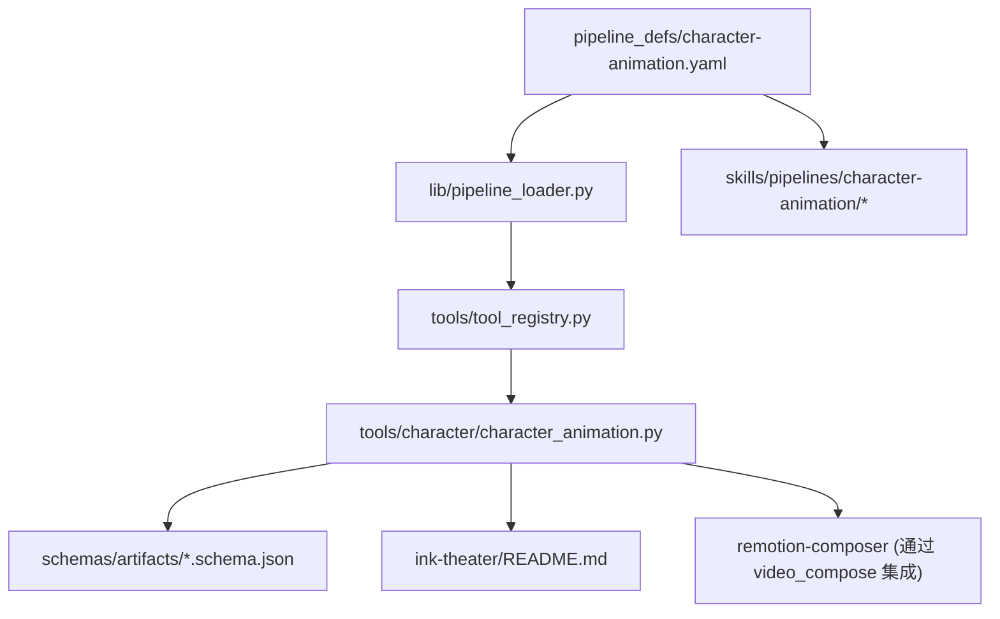
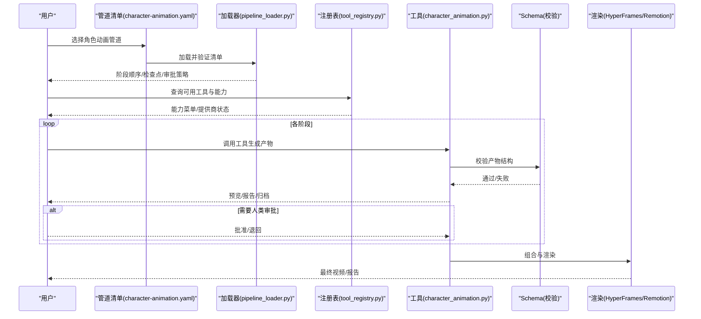
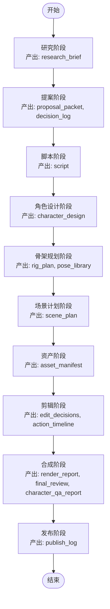
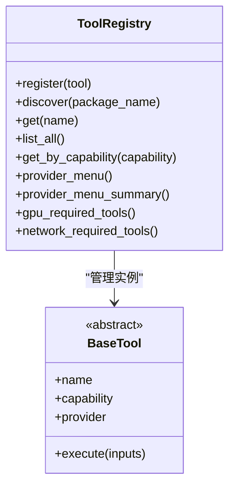
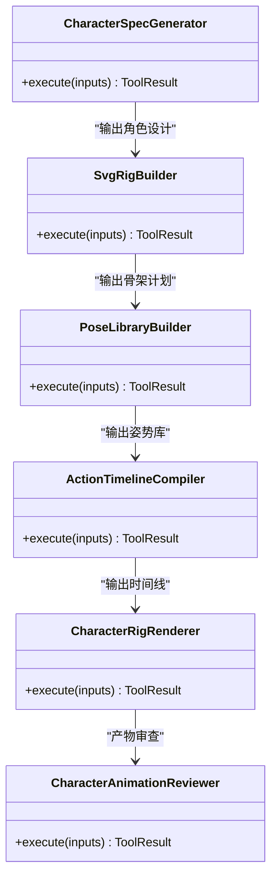
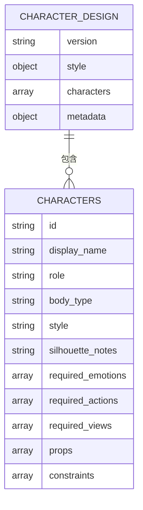
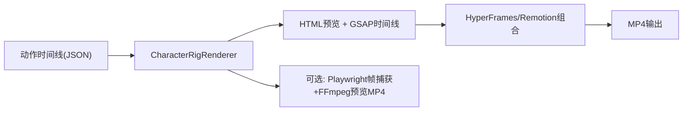
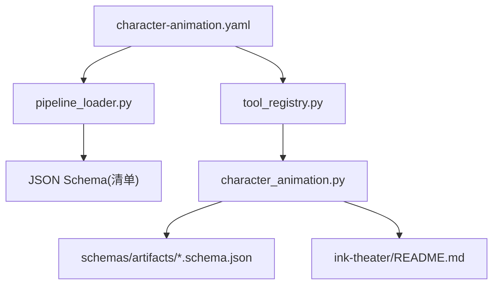

# 角色动画管道

<cite>
**本文引用的文件**
- [README.md](file://README.md)
- [character-animation.yaml](file://pipeline_defs/character-animation.yaml)
- [character_animation.py](file://tools/character/character_animation.py)
- [tool_registry.py](file://tools/tool_registry.py)
- [pipeline_loader.py](file://lib/pipeline_loader.py)
- [character_design.schema.json](file://schemas/artifacts/character_design.schema.json)
- [ink-theater README.md](file://ink-theater/README.md)
</cite>

## 目录
1. [简介](#简介)
2. [项目结构](#项目结构)
3. [核心组件](#核心组件)
4. [架构总览](#架构总览)
5. [详细组件分析](#详细组件分析)
6. [依赖关系分析](#依赖关系分析)
7. [性能与渲染实践](#性能与渲染实践)
8. [故障排查指南](#故障排查指南)
9. [结论](#结论)
10. [附录](#附录)

## 简介
本技术文档围绕 OpenMontage 的“角色动画管道”展开，系统化阐述从研究、提案、脚本、角色设计、骨架规划、场景编排、资产整合、剪辑、合成到发布的完整工作链。该管道面向本地可复用的卡通角色动画，强调确定性、可审查、可回滚的生产流程，并通过浏览器端 SVG/GSAP 与 HyperFrames/Remotion 等渲染引擎完成最终输出。同时提供针对游戏过场、影视特效和教育动画的应用建议与最佳实践。

## 项目结构
OpenMontage 采用“清单 + 技能 + 工具”的分层组织：
- 清单（pipeline_defs）：以 YAML 声明式定义每个管道的阶段、产物、检查点、人类审批策略与可用工具。
- 技能（skills）：以 Markdown 形式指导 AI Agent 如何执行各阶段任务。
- 工具（tools）：Python 实现的可注册工具，负责生成结构化产物、预览与轻量渲染。
- 模式（schemas）：JSON Schema 校验各阶段产物的结构与字段约束。
- 渲染与示例（remotion-composer、ink-theater）：提供浏览器端动画与手绘风格演示。

图表来源
- [character-animation.yaml:1-303](file://pipeline_defs/character-animation.yaml#L1-L303)
- [pipeline_loader.py:1-241](file://lib/pipeline_loader.py#L1-L241)
- [tool_registry.py:1-493](file://tools/tool_registry.py#L1-L493)
- [character_animation.py:1-897](file://tools/character/character_animation.py#L1-L897)
- [character_design.schema.json:1-46](file://schemas/artifacts/character_design.schema.json#L1-L46)
- [ink-theater README.md:1-87](file://ink-theater/README.md#L1-L87)

章节来源
- [README.md:356-475](file://README.md#L356-L475)
- [character-animation.yaml:1-303](file://pipeline_defs/character-animation.yaml#L1-L303)

## 核心组件
- 管道清单与加载器：YAML 清单描述阶段顺序、产物、检查点、人类审批、子阶段条件；加载器负责解析、缓存与校验。
- 工具注册表：自动发现并注册所有工具，提供按能力、提供商、稳定性、状态查询，以及能力菜单汇总。
- 角色动画工具集：包括角色规格生成、SVG 骨架构建、姿势库生成、动作时间线编译、角色渲染与预览、质量审查。
- 数据契约：JSON Schema 对关键产物（如角色设计）进行强类型校验，确保跨阶段一致性。
- 渲染与示例：HyperFrames/Remotion 作为组合引擎；ink-theater 提供手绘风格与动作捕捉驱动的演示。

章节来源
- [pipeline_loader.py:1-241](file://lib/pipeline_loader.py#L1-L241)
- [tool_registry.py:1-493](file://tools/tool_registry.py#L1-L493)
- [character_animation.py:1-897](file://tools/character/character_animation.py#L1-L897)
- [character_design.schema.json:1-46](file://schemas/artifacts/character_design.schema.json#L1-L46)

## 架构总览
角色动画管道遵循“研究→提案→脚本→角色设计→骨架规划→场景计划→资产→剪辑→合成→发布”的线性流程，并在关键节点设置检查点与人类审批。Agent 读取清单与技能后，调用工具生成结构化产物，经质量校验与预览确认后进入下一阶段。

图表来源
- [character-animation.yaml:61-303](file://pipeline_defs/character-animation.yaml#L61-L303)
- [pipeline_loader.py:39-70](file://lib/pipeline_loader.py#L39-L70)
- [tool_registry.py:118-134](file://tools/tool_registry.py#L118-L134)
- [character_animation.py:109-800](file://tools/character/character_animation.py#L109-L800)

## 详细组件分析

### 管道清单与阶段编排
- 名称与元信息：角色动画管道为“animation”类别，稳定性 beta，默认检查点策略 guided。
- 参考输入：支持参考视频分析（转录、场景检测、帧采样等）。
- 必需技能：包含执行制片人、研究导演、提案导演、脚本导演、角色设计导演、骨架规划导演、场景导演、资产导演、剪辑导演、合成导演、发布导演，以及评审与检查点协议、运行时选择技能。
- 编排参数：预算、最大修订次数、最大退回次数、最大运行时间。
- 阶段定义：每阶段明确输入产物、输出产物、可用工具、检查点、人类审批默认值、评审重点与成功标准。

图表来源
- [character-animation.yaml:61-303](file://pipeline_defs/character-animation.yaml#L61-L303)

章节来源
- [character-animation.yaml:1-303](file://pipeline_defs/character-animation.yaml#L1-L303)

### 工具注册与能力发现
- 自动发现：扫描 tools 包下模块，注册所有继承自 BaseTool 的类。
- 能力查询：按能力、提供商、状态、稳定性筛选工具；生成能力菜单与供应商摘要。
- 环境加载：启动时加载 .env，注入 API Key 等环境变量。
- 资源与网络：识别 GPU 需求与网络依赖的工具列表。

图表来源
- [tool_registry.py:55-134](file://tools/tool_registry.py#L55-L134)
- [tool_registry.py:141-196](file://tools/tool_registry.py#L141-L196)
- [tool_registry.py:198-493](file://tools/tool_registry.py#L198-L493)

章节来源
- [tool_registry.py:1-493](file://tools/tool_registry.py#L1-L493)

### 角色动画工具集
- 角色规格生成（CharacterSpecGenerator）：将概念转化为结构化角色设计，规范化风格、情感、动作、视角与约束。
- SVG 骨架构建（SvgRigBuilder）：基于角色设计生成部件、关节、层级、视图与风险说明。
- 姿势库生成（PoseLibraryBuilder）：为每个角色生成基础姿势、口型形状与动作循环草案。
- 动作时间线编译（ActionTimelineCompiler）：根据场景计划生成带时序的动作序列，包含预期、执行、收尾等节拍。
- 角色渲染（CharacterRigRenderer）：输出浏览器预览 HTML、HyperFrames 工作区与可选 MP4 预览；生成资产清单与编辑决策。
- 质量审查（CharacterAnimationReviewer）：对角色相关产物进行 QA 评估，生成报告。

图表来源
- [character_animation.py:109-183](file://tools/character/character_animation.py#L109-L183)
- [character_animation.py:185-281](file://tools/character/character_animation.py#L185-L281)
- [character_animation.py:283-368](file://tools/character/character_animation.py#L283-L368)
- [character_animation.py:370-464](file://tools/character/character_animation.py#L370-L464)
- [character_animation.py:466-785](file://tools/character/character_animation.py#L466-L785)
- [character_animation.py:788-800](file://tools/character/character_animation.py#L788-L800)

章节来源
- [character_animation.py:1-897](file://tools/character/character_animation.py#L1-L897)

### 数据契约与校验
- 角色设计 Schema：强制 version、characters 数组，并对每个角色的 id、role、body_type、style、required_emotions、required_actions 等进行约束，支持可选的 required_views、props、constraints。
- 作用：确保跨阶段产物一致，避免下游工具因缺失字段或错误类型而失败。

图表来源
- [character_design.schema.json:1-46](file://schemas/artifacts/character_design.schema.json#L1-L46)

章节来源
- [character_design.schema.json:1-46](file://schemas/artifacts/character_design.schema.json#L1-L46)

### 渲染与示例
- HyperFrames/Remotion：作为组合引擎，消费 HTML/SVG/CSS 与 GSAP 时间线，输出 MP4。
- ink-theater：提供手绘风格与动作捕捉驱动的角色表演示例，强调确定性、可寻址、可重放。

图表来源
- [character_animation.py:466-785](file://tools/character/character_animation.py#L466-L785)
- [ink-theater README.md:1-87](file://ink-theater/README.md#L1-L87)

章节来源
- [ink-theater README.md:1-87](file://ink-theater/README.md#L1-L87)

## 依赖关系分析
- 清单依赖：角色动画管道依赖一系列技能与工具，清单中显式列出所需技能与阶段产物。
- 加载器依赖：清单加载器依赖 JSON Schema 校验清单结构，并提供阶段顺序、子阶段过滤、扩展权限检查等能力。
- 工具依赖：角色动画工具依赖注册表发现、Schema 校验、Playwright/FFmpeg（预览）、GSAP/HyperFrames/Remotion（渲染）。
- 外部依赖：ink-theater 依赖 GSAP 与字体嵌入，确保确定性与可重放。

图表来源
- [character-animation.yaml:1-303](file://pipeline_defs/character-animation.yaml#L1-L303)
- [pipeline_loader.py:1-241](file://lib/pipeline_loader.py#L1-L241)
- [tool_registry.py:1-493](file://tools/tool_registry.py#L1-L493)
- [character_animation.py:1-897](file://tools/character/character_animation.py#L1-L897)
- [character_design.schema.json:1-46](file://schemas/artifacts/character_design.schema.json#L1-L46)
- [ink-theater README.md:1-87](file://ink-theater/README.md#L1-L87)

章节来源
- [pipeline_loader.py:1-241](file://lib/pipeline_loader.py#L1-L241)
- [tool_registry.py:1-493](file://tools/tool_registry.py#L1-L493)

## 性能与渲染实践
- 本地确定性动画优先：角色动画管道强调本地 SVG/GSAP 的确定性运动，避免远程视频生成的不确定性。
- 预览与快速迭代：CharacterRigRenderer 输出 HTML 预览，必要时使用 Playwright 抓取帧并通过 FFmpeg 生成预览 MP4，加速反馈循环。
- 渲染引擎选择：在提案阶段锁定 render_runtime（HyperFrames 或 Remotion），合成阶段不得静默降级；这有助于稳定性能与质量。
- 资源与网络：通过注册表识别 GPU 与网络依赖工具，合理分配计算资源与访问策略。
- 最佳实践建议：
  - 控制角色数量与复杂度，避免过多部件导致浏览器卡顿。
  - 使用有限重复与确定性时间线，避免无限 repeat 导致的不可控时长。
  - 预先生成姿势库与动作循环，减少运行时计算。
  - 离线字体与资源内联，保证渲染可重放与跨平台一致。

[本节为通用指导，不直接分析具体文件]

## 故障排查指南
- 预览失败：若缺少 ffmpeg 或 Playwright，预览 MP4 渲染会失败。需安装对应依赖并确保路径正确。
- 渲染引擎不可用：HyperFrames/Remotion 未安装或 npm 解析失败会导致组合失败。可通过注册表的 provider_menu_summary 查看运行时警告。
- 产物校验失败：若角色设计或其他产物不符合 Schema，工具会拒绝继续。请检查必填字段与类型。
- 人类审批卡住：某些阶段默认需要人类审批，若未记录批准，检查点不会标记完成。需在 Backlot 或通过对话完成审批。
- 性能问题：浏览器预览卡顿通常由复杂 SVG 或过多 GSAP 动画引起。简化部件、减少动画数量或使用更轻量的姿势。

章节来源
- [character_animation.py:70-107](file://tools/character/character_animation.py#L70-L107)
- [tool_registry.py:316-471](file://tools/tool_registry.py#L316-L471)
- [character_design.schema.json:1-46](file://schemas/artifacts/character_design.schema.json#L1-L46)

## 结论
OpenMontage 的角色动画管道以清单驱动、技能指导、工具实现的三层架构，提供了从创意到成品的完整生产链路。其核心优势在于：
- 结构化产物与强类型校验，保障跨阶段一致性。
- 本地确定性动画与浏览器预览，提升迭代效率与可控性。
- 严格的检查点与人类审批，确保质量与预算治理。
- 灵活的渲染引擎选择与丰富的工具生态，适配多种应用场景。

对于游戏过场、影视特效与教育动画，建议优先采用本地 SVG/GSAP 与 HyperFrames/Remotion 的组合，结合姿势库与动作时间线，实现高效、可维护、可审计的动画生产。

[本节为总结，不直接分析具体文件]

## 附录
- 应用案例建议：
  - 游戏过场动画：使用角色设计→骨架规划→姿势库→动作时间线→HyperFrames 组合，输出高质量过场片段。
  - 影视特效：结合真实素材与生成素材，利用视频拼接与增强工具，保持风格统一。
  - 教育动画：采用简洁视觉风格与清晰叙事，配合字幕与配音，提高学习效果。
- 参考资源：
  - 清单与技能：pipeline_defs、skills/pipelines/character-animation
  - 工具与示例：tools/character、ink-theater

[本节为补充信息，不直接分析具体文件]