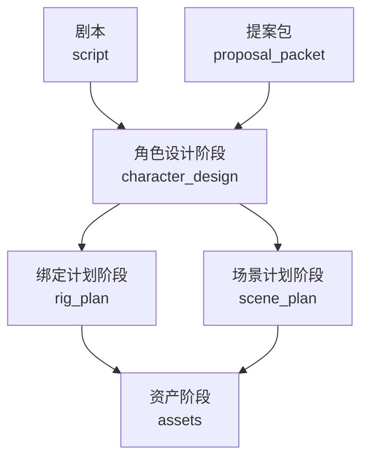
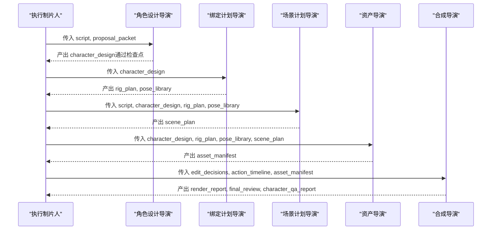
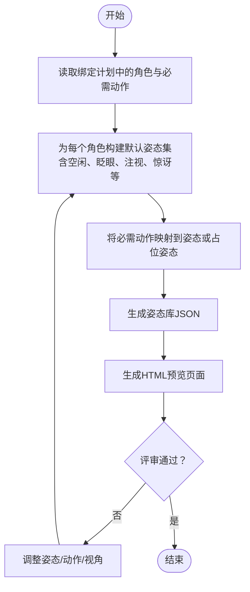
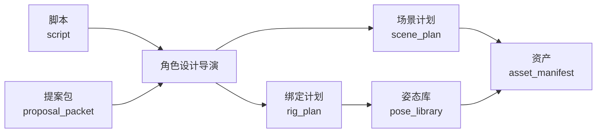

# 角色设计导演

<cite>
**本文引用的文件**
- [skills/pipelines/character-animation/character-design-director.md](file://skills/pipelines/character-animation/character-design-director.md)
- [pipeline_defs/character-animation.yaml](file://pipeline_defs/character-animation.yaml)
- [schemas/artifacts/character_design.schema.json](file://schemas/artifacts/character_design.schema.json)
- [skills/pipelines/character-animation/rig-plan-director.md](file://skills/pipelines/character-animation/rig-plan-director.md)
- [.agents/skills/pose-library-design/SKILL.md](file://.agents/skills/pose-library-design/SKILL.md)
- [tools/character/character_animation.py](file://tools/character/character_animation.py)
- [tests/contracts/test_character_animation_pipeline.py](file://tests/contracts/test_character_animation_pipeline.py)
</cite>

## 目录
1. [简介](#简介)
2. [项目结构](#项目结构)
3. [核心组件](#核心组件)
4. [架构总览](#架构总览)
5. [详细组件分析](#详细组件分析)
6. [依赖关系分析](#依赖关系分析)
7. [性能考量](#性能考量)
8. [故障排查指南](#故障排查指南)
9. [结论](#结论)
10. [附录](#附录)

## 简介
本技术文档面向OpenMontage角色动画管道中的“角色设计导演”岗位，聚焦其在角色视觉设计、剪影定义、情感表达与动作能力规划方面的职责与技术要求。文档基于仓库中角色动画管道的阶段定义、数据契约与工具实现，系统化说明从角色概念到可动画化资产的设计边界、质量标准与迭代流程，帮助非技术读者也能理解并执行角色设计工作。

## 项目结构
角色设计导演位于“角色动画”管道中，承接脚本与提案阶段的输入，产出“角色设计”工件，并为后续的绑定计划、场景编排、资产生产与合成提供明确约束。该阶段在管道中被标记为关键检查点，需要人类审批，并通过明确的审查焦点与成功标准进行质量把关。

图表来源
- [pipeline_defs/character-animation.yaml:134-153](file://pipeline_defs/character-animation.yaml#L134-L153)
- [pipeline_defs/character-animation.yaml:154-174](file://pipeline_defs/character-animation.yaml#L154-L174)
- [pipeline_defs/character-animation.yaml:175-196](file://pipeline_defs/character-animation.yaml#L175-L196)
- [pipeline_defs/character-animation.yaml:197-225](file://pipeline_defs/character-animation.yaml#L197-L225)

章节来源
- [pipeline_defs/character-animation.yaml:134-153](file://pipeline_defs/character-animation.yaml#L134-L153)
- [pipeline_defs/character-animation.yaml:154-174](file://pipeline_defs/character-animation.yaml#L154-L174)
- [pipeline_defs/character-animation.yaml:175-196](file://pipeline_defs/character-animation.yaml#L175-L196)
- [pipeline_defs/character-animation.yaml:197-225](file://pipeline_defs/character-animation.yaml#L197-L225)

## 核心组件
- 角色设计导演技能：负责列出每个角色的身份、角色定位、体型与风格；识别故事所需的最小情绪范围与最小动作清单；决定必要视角（正面、三分之四侧、侧面、背面），并记录角色附属道具。
- 角色设计工件契约：以JSON Schema定义角色设计的结构与字段，包括版本、风格、调色板、线条风格、纹理描述，以及每个角色的ID、角色、体型、风格、剪影备注、必需情绪、必需动作、必需视角与道具等。
- 绑定计划导演：将角色拆解为可绑定的部件（身体、头部、眼睛/瞳孔、眉毛、口型、四肢/翅膀、尾巴/配件、道具），为每个活动部件定义枢轴、层级顺序与约束，并为已批准场景定义命名姿态与动作循环策略。
- 姿态库设计技能：提供可复用的2D角色姿态库、动作循环与表情状态设计方法，强调“预备—动作—保持—回落”的时序模式与只声明变化部分的姿态数据模式。
- 角色动画工具链：包含默认姿态生成、预览渲染与角色动画评审工具，用于快速验证角色可读性、姿态完整性与时间线可行性。

章节来源
- [skills/pipelines/character-animation/character-design-director.md:1-37](file://skills/pipelines/character-animation/character-design-director.md#L1-L37)
- [schemas/artifacts/character_design.schema.json:1-46](file://schemas/artifacts/character_design.schema.json#L1-L46)
- [skills/pipelines/character-animation/rig-plan-director.md:1-41](file://skills/pipelines/character-animation/rig-plan-director.md#L1-L41)
- [.agents/skills/pose-library-design/SKILL.md:1-59](file://.agents/skills/pose-library-design/SKILL.md#L1-L59)
- [tools/character/character_animation.py:303-366](file://tools/character/character_animation.py#L303-L366)

## 架构总览
角色设计导演处于角色动画管道的上游，承担“把故事需求翻译为可动画化的角色规格”的职责。其输出被后续绑定、场景、资产与合成阶段消费，形成稳定的数据驱动管线。

图表来源
- [pipeline_defs/character-animation.yaml:134-153](file://pipeline_defs/character-animation.yaml#L134-L153)
- [pipeline_defs/character-animation.yaml:154-174](file://pipeline_defs/character-animation.yaml#L154-L174)
- [pipeline_defs/character-animation.yaml:175-196](file://pipeline_defs/character-animation.yaml#L175-L196)
- [pipeline_defs/character-animation.yaml:197-225](file://pipeline_defs/character-animation.yaml#L197-L225)
- [pipeline_defs/character-animation.yaml:226-281](file://pipeline_defs/character-animation.yaml#L226-L281)

## 详细组件分析

### 角色设计导演的职责与工作流
- 目标：产出“角色设计”，即一个小型演员表，具备清晰的剪影、角色定位、情绪范围、动作能力与风格锚点。
- 流程要点：
  - 列出每个角色的id、角色、体型与风格。
  - 识别故事所需的最小情绪范围与最小动作清单。
  - 决定必要视角（正面、三分之四侧、侧面、背面），MVP建议一到两个视角。
  - 记录角色附属道具（围巾、羽毛、包、眼镜等）。
- 约束：
  - MVP推荐一或两个角色。
  - 动物角色需考虑物种特定部位与动作循环。
  - 多视角会成倍增加资产与姿态需求。
  - 不要发明超出已批准时长能使用的姿态数量。
- 工具使用：
  - 使用结构化草稿生成器（如角色规格生成器）。
  - 仅在视觉风格与角色表需求明确后，再使用图像选择器。
  - 使用图像生成前，需阅读注册表中对应Layer 3技能。

章节来源
- [skills/pipelines/character-animation/character-design-director.md:1-37](file://skills/pipelines/character-animation/character-design-director.md#L1-L37)

### 角色设计的数据契约与字段语义
- 版本与风格：
  - version固定为“1.0”。
  - style包含visual_style、palette、line_style、texture等字段，用于统一视觉语言。
- 角色条目：
  - id、display_name、role、body_type、style为必填基础信息。
  - silhouette_notes用于描述剪影特征，确保远距离可读性与辨识度。
  - required_emotions与required_actions分别定义角色必须支持的情绪与动作集合。
  - required_views定义必要视角（front、3/4、side、back等）。
  - props记录角色携带的道具。
  - constraints记录设计限制（如不可旋转角度、材质限制等）。
- 元数据：
  - metadata可用于记录来源、版本变更、风格参考等。

章节来源
- [schemas/artifacts/character_design.schema.json:1-46](file://schemas/artifacts/character_design.schema.json#L1-L46)

### 绑定计划与姿态库对角色设计的反哺
- 绑定计划导演将角色拆分为可绑定的部件，并为每个活动部件定义枢轴、层级顺序与约束，避免不可能的位置。
- 命名姿态与动作循环策略：
  - 为已批准场景定义命名姿态。
  - 仅当动作至少复用两次或为核心叙事时才定义动作循环。
- 运行时模式：
  - 角色差异应作为数据而非一次性代码路径处理，使同一套插值与时间线编译器适用于不同角色（如鸟有wing_left，鼠有tail）。
- 质量检查：
  - 每个活动部件必须有枢轴。
  - 每个必需动作必须有姿态或程序化策略。
  - 每个姿态需声明变化的部件。
  - 高风险动作需显式标注，不得隐藏。

章节来源
- [skills/pipelines/character-animation/rig-plan-director.md:1-41](file://skills/pipelines/character-animation/rig-plan-director.md#L1-L41)

### 姿态库设计与情绪库建立
- 姿态类别：
  - 中性：idle、breathe、listening。
  - 注意力：look_up、look_down、look_left、look_right。
  - 情绪：happy、sad、surprised、worried、determined。
  - 动作：reach、point、hold、jump、flap、walk_contact、walk_passing。
  - 口型：closed、small_o、wide_open、smile、frown、音素近似形状。
- 表演模式：
  - 采用“预备—动作—保持—回落”的时序模式，避免持续动画所有部件，保持可读性。
- 姿态数据模式：
  - 仅声明变化的部件，默认来自绑定；包含描述、parts、expression、hold_frames与transition。
- 质量清单：
  - 必需情绪必须有姿态。
  - 必需动作必须有姿态或循环。
  - 复用循环需包含接触与过渡姿态。
  - 姿态仅命名变化部件。

章节来源
- [.agents/skills/pose-library-design/SKILL.md:1-59](file://.agents/skills/pose-library-design/SKILL.md#L1-L59)

### 角色间差异化处理方法
- 数据驱动差异：
  - 角色差异（如鸟类翅膀、啮齿类尾巴）通过数据字段注入，不引入分支代码。
  - 绑定计划与姿态库共享同一套运行时逻辑，降低维护成本。
- 视角与道具：
  - 通过required_views与props字段管理角色外观差异，避免重复资产。
- 约束与风险：
  - 在角色设计中记录constraints，并在绑定计划中转化为关节约束与姿态限制。

章节来源
- [skills/pipelines/character-animation/rig-plan-director.md:24-29](file://skills/pipelines/character-animation/rig-plan-director.md#L24-L29)
- [schemas/artifacts/character_design.schema.json:20-41](file://schemas/artifacts/character_design.schema.json#L20-L41)

### 2D到3D转换考虑、材质纹理设计与动画兼容性
- 2D到3D转换：
  - 角色设计需考虑未来可能的3D化：轮廓清晰、比例合理、部件可分层、关节位置明确。
  - 若项目使用Ink Puppet系统，则遵循其比例无关的木偶绑定方式，通过命名动作片段驱动。
- 材质与纹理：
  - 在角色设计中记录texture字段，便于后续材质与贴图策略对齐。
  - 对于3D渲染，注意压缩格式与加载性能（如DRACO几何、KTX2/Basis纹理），但角色动画管道当前以本地SVG/Canvas/Remotion/HyperFrames为主。
- 动画兼容性检查：
  - 角色设计阶段需评估动作范围与表情系统是否可在绑定与运行时实现。
  - 绑定计划阶段进一步确认枢轴、层级与约束是否满足动作需求。
  - 姿态库阶段确保情绪与动作有足够姿态支撑。

章节来源
- [pipeline_defs/character-animation.yaml:3-8](file://pipeline_defs/character-animation.yaml#L3-L8)
- [skills/pipelines/character-animation/character-design-director.md:1-37](file://skills/pipelines/character-animation/character-design-director.md#L1-L37)
- [skills/pipelines/character-animation/rig-plan-director.md:1-41](file://skills/pipelines/character-animation/rig-plan-director.md#L1-L41)

### 外形比例、色彩搭配、服装道具、表情系统与动作范围
- 外形比例：
  - 通过body_type与silhouette_notes控制整体比例与剪影辨识度。
- 色彩搭配：
  - 通过palette与visual_style统一风格，确保在不同场景中保持一致。
- 服装道具：
  - 通过props记录角色携带物，并在绑定计划中作为独立部件或子层处理。
- 表情系统：
  - 通过required_emotions与mouth_shapes映射到姿态与口型，支持基本表情与语音同步。
- 动作范围：
  - 通过required_actions与action_cycles定义动作能力，确保在时间线中可调度。

章节来源
- [schemas/artifacts/character_design.schema.json:10-41](file://schemas/artifacts/character_design.schema.json#L10-L41)
- [tools/character/character_animation.py:303-366](file://tools/character/character_animation.py#L303-L366)

### 角色设计的质量标准、审查流程与迭代优化
- 质量标准：
  - 角色设计必须让动画师或工具能够推断出必须存在的部件、表情与动作。
  - 每个主要角色必须具备必需的情绪、动作与视角。
- 审查流程：
  - 角色设计阶段为检查点，默认需要人类审批。
  - 审查焦点：角色独特性、剪影清晰度、情绪范围、动作列表、风格锚点复用性。
  - 失败触发条件：缺少必需动作或情绪范围、绑定缺失枢轴、姿态无可读表演、时间线动作无法渲染、合成使用了未批准的运行时。
- 迭代优化：
  - 先制作10-15秒样片，再进入全量资产生产。
  - 通过角色动画评审工具进行静态、浏览器与最终级别检查，逐步收敛问题。

章节来源
- [skills/pipelines/character-animation/character-design-director.md:31-37](file://skills/pipelines/character-animation/character-design-director.md#L31-L37)
- [pipeline_defs/character-animation.yaml:134-153](file://pipeline_defs/character-animation.yaml#L134-L153)
- [skills/pipelines/character-animation/executive-producer.md:32-49](file://skills/pipelines/character-animation/executive-producer.md#L32-L49)

### 角色设计到姿态生成的自动化流程

图表来源
- [tools/character/character_animation.py:303-366](file://tools/character/character_animation.py#L303-L366)
- [tools/character/character_animation.py:545-660](file://tools/character/character_animation.py#L545-L660)

章节来源
- [tools/character/character_animation.py:303-366](file://tools/character/character_animation.py#L303-L366)
- [tools/character/character_animation.py:545-660](file://tools/character/character_animation.py#L545-L660)

### 角色动画评审与质量保证
- 评审工具：
  - CharacterAnimationReviewer支持静态、浏览器与最终级别的评审，检查预览路径、绑定枢轴、姿态定义与时间线动作。
- 测试用例：
  - 通过渲染预览与评审工具验证多角色场景，确保角色标识符存在且评审报告有效。
- 输出产物：
  - 生成character_qa_report，包含状态、检查项与问题列表。

章节来源
- [tools/character/character_animation.py:788-845](file://tools/character/character_animation.py#L788-L845)
- [tests/contracts/test_character_animation_pipeline.py:159-192](file://tests/contracts/test_character_animation_pipeline.py#L159-L192)

## 依赖关系分析
角色设计导演依赖上游的脚本与提案，输出被绑定计划、场景计划与资产阶段消费。同时，角色设计受限于管道治理规则（如样本优先、运行时选择、角色差异数据化等）。

图表来源
- [pipeline_defs/character-animation.yaml:134-153](file://pipeline_defs/character-animation.yaml#L134-L153)
- [pipeline_defs/character-animation.yaml:154-174](file://pipeline_defs/character-animation.yaml#L154-L174)
- [pipeline_defs/character-animation.yaml:175-196](file://pipeline_defs/character-animation.yaml#L175-L196)
- [pipeline_defs/character-animation.yaml:197-225](file://pipeline_defs/character-animation.yaml#L197-L225)

章节来源
- [pipeline_defs/character-animation.yaml:134-153](file://pipeline_defs/character-animation.yaml#L134-L153)
- [pipeline_defs/character-animation.yaml:154-174](file://pipeline_defs/character-animation.yaml#L154-L174)
- [pipeline_defs/character-animation.yaml:175-196](file://pipeline_defs/character-animation.yaml#L175-L196)
- [pipeline_defs/character-animation.yaml:197-225](file://pipeline_defs/character-animation.yaml#L197-L225)

## 性能考量
- 角色数量与视角：
  - MVP建议一或两个角色，避免过多视角导致资产与姿态膨胀。
- 姿态与循环：
  - 仅对复用次数高或核心叙事的动作定义循环，减少不必要的复杂度。
- 运行时选择：
  - 若同时可用Remotion与HyperFrames，应在提案阶段呈现两者并选择合适运行时，避免后期降级。
- 资源与预算：
  - 管道设置最大修订次数、最大退回次数与总耗时上限，防止无限迭代。

章节来源
- [skills/pipelines/character-animation/character-design-director.md:18-24](file://skills/pipelines/character-animation/character-design-director.md#L18-L24)
- [pipeline_defs/character-animation.yaml:45-51](file://pipeline_defs/character-animation.yaml#L45-L51)
- [skills/pipelines/character-animation/executive-producer.md:32-49](file://skills/pipelines/character-animation/executive-producer.md#L32-L49)

## 故障排查指南
- 常见问题与触发条件：
  - 角色设计缺少必需动作或情绪范围：退回至角色设计阶段补充。
  - 绑定计划缺少活动部件枢轴：退回至绑定计划阶段修复。
  - 姿态库无可读表演姿态：退回至姿态库阶段完善。
  - 时间线动作无法由绑定渲染：退回至绑定或时间线阶段调整。
  - 合成使用了未批准的运行时：退回至提案或合成阶段修正。
- 评审工具使用：
  - 使用CharacterAnimationReviewer进行静态、浏览器与最终级别检查，依据报告逐项修复。
- 测试验证：
  - 通过端到端测试验证多角色渲染与评审报告有效性。

章节来源
- [skills/pipelines/character-animation/executive-producer.md:32-49](file://skills/pipelines/character-animation/executive-producer.md#L32-L49)
- [tools/character/character_animation.py:788-845](file://tools/character/character_animation.py#L788-L845)
- [tests/contracts/test_character_animation_pipeline.py:159-192](file://tests/contracts/test_character_animation_pipeline.py#L159-L192)

## 结论
角色设计导演在OpenMontage角色动画管道中扮演“从故事到可动画化角色规格”的关键角色。通过明确的角色视觉设计、剪影定义、情绪与动作规划，以及与绑定计划、姿态库、场景与资产的紧密协作，确保角色在2D/3D转换、材质纹理、动画兼容性与性能方面达到高质量标准。结合严格的审查流程与迭代优化机制，角色设计能够在可控成本下稳定产出可复用、可扩展的动画资产。

## 附录
- 相关技能与工具：
  - 角色设计导演技能、绑定计划导演技能、姿态库设计技能。
  - 角色动画工具链（默认姿态生成、预览渲染、评审工具）。
- 数据契约：
  - 角色设计Schema、姿态库Schema。
- 管道配置：
  - 角色动画管道阶段定义、检查点与治理规则。