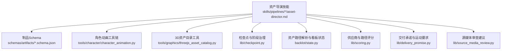
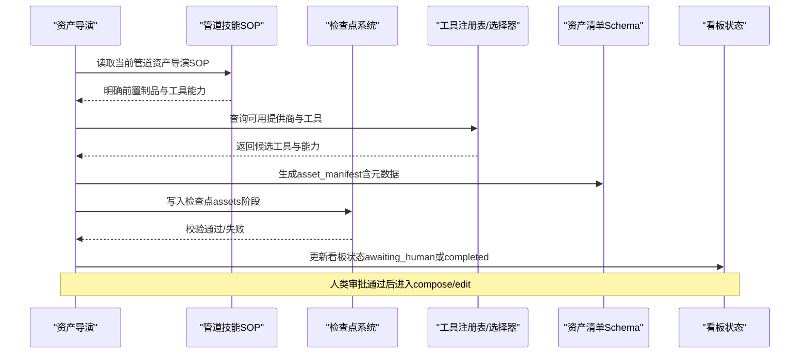
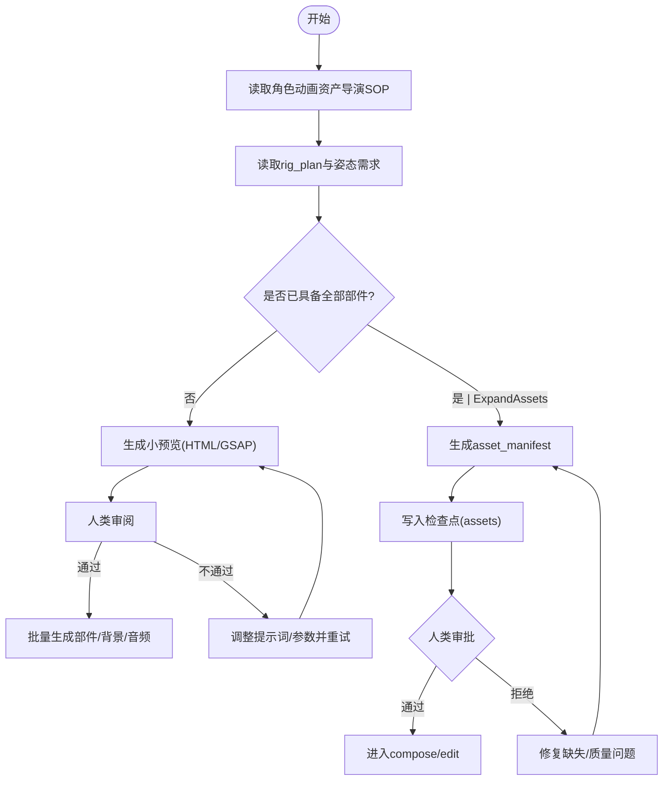
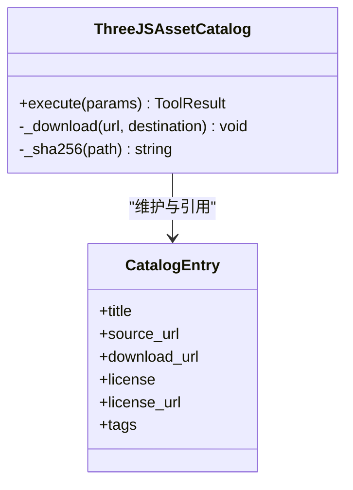
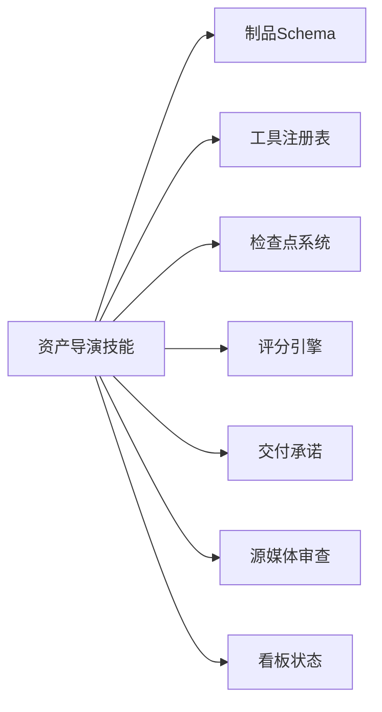

# 资产导演

<cite>
**本文引用的文件**
- [skills/pipelines/character-animation/asset-director.md](file://skills/pipelines/character-animation/asset-director.md)
- [schemas/artifacts/asset_manifest.schema.json](file://schemas/artifacts/asset_manifest.schema.json)
- [tools/character/character_animation.py](file://tools/character/character_animation.py)
- [tools/graphics/threejs_asset_catalog.py](file://tools/graphics/threejs_asset_catalog.py)
- [lib/checkpoint.py](file://lib/checkpoint.py)
- [backlot/state.py](file://backlot/state.py)
- [scripts/scaffold_atelier_project.py](file://scripts/scaffold_atelier_project.py)
- [skills/pipelines/cinematic/asset-director.md](file://skills/pipelines/cinematic/asset-director.md)
- [skills/pipelines/explainer/asset-director.md](file://skills/pipelines/explainer/asset-director.md)
- [skills/pipelines/talking-head/asset-director.md](file://skills/pipelines/talking-head/asset-director.md)
- [lib/scoring.py](file://lib/scoring.py)
- [lib/delivery_promise.py](file://lib/delivery_promise.py)
- [lib/source_media_review.py](file://lib/source_media_review.py)
</cite>

## 目录
1. [简介](#简介)
2. [项目结构](#项目结构)
3. [核心组件](#核心组件)
4. [架构总览](#架构总览)
5. [详细组件分析](#详细组件分析)
6. [依赖关系分析](#依赖关系分析)
7. [性能考量](#性能考量)
8. [故障排查指南](#故障排查指南)
9. [结论](#结论)
10. [附录](#附录)

## 简介
本技术文档面向OpenMontage角色动画管道中的“资产导演”岗位，聚焦以下目标：
- 素材管理：按场景与角色组织模型、贴图、动画片段、音效音乐与背景素材。
- 资源生成：基于工具注册表与选择器，完成图像、视频、音频、图表等资产的批量生成与采样确认。
- 质量控制：通过Schema校验、质量门控、评分引擎与人类审批节点保障产出质量。
- 版本控制：以检查点（checkpoint）与制品清单（artifact manifest）实现可追溯的版本化流程。

同时覆盖AI生成资产的质量控制（提示词优化、结果筛选、后期处理与格式转换），并提供资产管理工具使用指南、批量处理脚本与自动化工作流搭建方法。

## 项目结构
围绕“资产导演”的关键目录与职责如下：
- skills/pipelines/*: 各管道的资产导演SOP（含角色动画、电影感、讲解类、口播等）。
- schemas/artifacts/*: 制品Schema（如asset_manifest、character_design等）。
- tools/character/*: 角色动画本地工具链（规格生成、绑定计划、动作时间线、渲染预览等）。
- tools/graphics/*: 3D资产目录与Three.js世界生成相关工具。
- lib/*: 检查点、评分、交付承诺、源媒体审查等通用库。
- backlot/*: 看板状态管理与资产路径解析。
- scripts/*: 脚手架与批处理脚本（如Remotion工程脚手架）。

图示来源
- [skills/pipelines/character-animation/asset-director.md:1-67](file://skills/pipelines/character-animation/asset-director.md#L1-L67)
- [schemas/artifacts/asset_manifest.schema.json:1-63](file://schemas/artifacts/asset_manifest.schema.json#L1-L63)
- [tools/character/character_animation.py:109-800](file://tools/character/character_animation.py#L109-L800)
- [tools/graphics/threejs_asset_catalog.py:1-172](file://tools/graphics/threejs_asset_catalog.py#L1-L172)
- [lib/checkpoint.py:1-200](file://lib/checkpoint.py#L1-L200)
- [backlot/state.py:276-302](file://backlot/state.py#L276-L302)
- [lib/scoring.py:1-200](file://lib/scoring.py#L1-L200)
- [lib/delivery_promise.py:55-79](file://lib/delivery_promise.py#L55-L79)
- [lib/source_media_review.py:297-324](file://lib/source_media_review.py#L297-L324)

章节来源
- [skills/pipelines/character-animation/asset-director.md:1-67](file://skills/pipelines/character-animation/asset-director.md#L1-L67)
- [schemas/artifacts/asset_manifest.schema.json:1-63](file://schemas/artifacts/asset_manifest.schema.json#L1-L63)

## 核心组件
- 资产清单Schema（asset_manifest）：统一记录每个资产的路径、类型、来源工具、场景ID、提示词、种子、模型、成本、时长、分辨率、格式、质量分、子类型、生成摘要、提供商、许可、原始URL以及旁白配音契约等元数据。
- 角色动画工具链：
  - 角色规格生成：将概念转化为结构化角色定义。
  - SVG绑定计划：为角色部件定义层级、枢轴、关节范围与所需姿态。
  - 姿态库构建：为常见动作与表情提供默认姿态与过渡。
  - 动作时间线编译：将场景计划转换为带时间戳的动作序列。
  - 角色绑定渲染：输出HTML预览、HyperFrames工作区与可选MP4预览，并生成资产清单与剪辑决策。
- 3D资产目录：安装、检查与清点CC0授权的GLTF/GLB模型与纹理，生成清单与哈希，确保版权安全与可追溯性。
- 检查点与阶段治理：在关键阶段写入检查点，强制制品Schema校验，支持恢复与人类审批门控。
- 资产路径解析：兼容相对路径、仓库相对路径与绝对路径，确保资产可被看板正确发现。
- 供应商与路径评分：对可用提供商进行多维度打分，指导最佳生产路径选择。
- 交付承诺：根据管道类型约束是否允许静态回退、是否需要视频生成与最低运动比例。
- 源媒体审查：从用户提供的音视频图片中推导制作策略与限制。

章节来源
- [schemas/artifacts/asset_manifest.schema.json:1-63](file://schemas/artifacts/asset_manifest.schema.json#L1-L63)
- [tools/character/character_animation.py:109-800](file://tools/character/character_animation.py#L109-L800)
- [tools/graphics/threejs_asset_catalog.py:1-172](file://tools/graphics/threejs_asset_catalog.py#L1-L172)
- [lib/checkpoint.py:1-200](file://lib/checkpoint.py#L1-L200)
- [backlot/state.py:276-302](file://backlot/state.py#L276-L302)
- [lib/scoring.py:1-200](file://lib/scoring.py#L1-L200)
- [lib/delivery_promise.py:55-79](file://lib/delivery_promise.py#L55-L79)
- [lib/source_media_review.py:297-324](file://lib/source_media_review.py#L297-L324)

## 架构总览
资产导演的端到端流程由“技能SOP + 工具链 + 制品Schema + 检查点治理”构成。角色动画管道强调先产出rig_plan与pose_library，再按需生成部件与背景；其他管道则强调先做英雄镜头样本，再批量生成。

图示来源
- [skills/pipelines/character-animation/asset-director.md:1-67](file://skills/pipelines/character-animation/asset-director.md#L1-L67)
- [lib/checkpoint.py:124-191](file://lib/checkpoint.py#L124-L191)
- [schemas/artifacts/asset_manifest.schema.json:1-63](file://schemas/artifacts/asset_manifest.schema.json#L1-L63)
- [backlot/state.py:276-302](file://backlot/state.py#L276-L302)

## 详细组件分析

### 角色动画资产导演流程
- 目标：产出包含角色部件、背景、道具、音频、音乐与预览的asset_manifest。
- 前置阅读：角色绑定、SVG角色动画、姿态库设计、GSAP/Remotion/HyperFrames等技能。
- 资产组织：角色资产位于projects/<project>/assets/characters/<id>，子目录parts/poses/previews；背景位于backgrounds/。
- 流程要点：仅按rig_plan产出必要部件；保持部件独立与透明背景；记录提示词、种子、提供商与模型；先构建小预览再扩展。
- 质量门槛：compose前rig_plan引用的所有部件必须存在，否则阻塞。
- 门控：该阶段默认需要人类审批，通过后呈现总结并结束本轮。

图示来源
- [skills/pipelines/character-animation/asset-director.md:1-67](file://skills/pipelines/character-animation/asset-director.md#L1-L67)
- [tools/character/character_animation.py:466-785](file://tools/character/character_animation.py#L466-L785)
- [lib/checkpoint.py:124-191](file://lib/checkpoint.py#L124-L191)

章节来源
- [skills/pipelines/character-animation/asset-director.md:1-67](file://skills/pipelines/character-animation/asset-director.md#L1-L67)
- [tools/character/character_animation.py:109-800](file://tools/character/character_animation.py#L109-L800)

### 资产清单Schema与元数据规范
- 字段说明：
  - id/type/path/source_tool/scene_id：必填，标识资产身份、类型、路径、来源工具与所属场景。
  - prompt/seed/model：AI生成的溯源信息。
  - cost_usd/duration_seconds/resolution/format：成本、时长、分辨率与格式。
  - quality_score/subtype/generation_summary/provider/license/original_url：质量、子分类、生成摘要、提供商、许可与原始来源。
  - voice_performance：旁白配音契约（来源段落、是否应用交付提示、是否使用提供商设置、样本批准与路径、评审备注）。
- 用途：贯穿资产获取、生成、审核与发布的全链路，作为下游compose/edit阶段的输入契约。

章节来源
- [schemas/artifacts/asset_manifest.schema.json:1-63](file://schemas/artifacts/asset_manifest.schema.json#L1-L63)

### 3D资产目录与版权合规
- 功能：列出、安装与检查CC0授权3D资产目录，下载并解压归档，扫描GLTF/GLB模型与纹理，生成清单与SHA256哈希。
- 合规：内置Kenney系列目录，标注许可证与来源URL，避免版权风险。
- 集成：配合Three.js世界生成工具，用于高质量3D场景构建。

图示来源
- [tools/graphics/threejs_asset_catalog.py:1-172](file://tools/graphics/threejs_asset_catalog.py#L1-L172)

章节来源
- [tools/graphics/threejs_asset_catalog.py:1-172](file://tools/graphics/threejs_asset_catalog.py#L1-L172)

### 检查点与版本控制
- 阶段映射：research/proposal/idea/script/scene_plan/assets/edit/compose/publish对应不同制品。
- 校验：检查点写入时校验stage/status/artifacts，并对已知制品执行Schema验证。
- 恢复：检查点用于流水线恢复与人类审批节点展示。
- 项目根：检查点、制品与项目标记位于PROJECTS_DIR下，便于Backlot看板监控。

章节来源
- [lib/checkpoint.py:1-200](file://lib/checkpoint.py#L1-L200)

### 资产路径解析与看板状态
- 路径解析：支持项目相对、仓库相对与绝对路径，自动定位资产文件。
- 看板集成：将manifest中的资产条目标准化为看板可见条目，便于可视化审查。

章节来源
- [backlot/state.py:276-302](file://backlot/state.py#L276-L302)

### 供应商与路径评分
- 维度：任务契合度、输出质量、可控性、可靠性、成本效率、延迟、连续性。
- 权重：加权计算总分，解释选择理由。
- 上下文：结合任务上下文（如motion_required、asset_type）进行惩罚或奖励。

章节来源
- [lib/scoring.py:1-200](file://lib/scoring.py#L1-L200)
- [lib/scoring.py:447-479](file://lib/scoring.py#L447-L479)

### 交付承诺与运动要求
- 管道类型约束：例如avatar_presenter不允许静态回退且需要视频生成；hybrid允许混合内容但需满足最低运动比例。
- 作用：指导资产导演在生成与选择时遵循交付承诺，避免方向性错误。

章节来源
- [lib/delivery_promise.py:55-79](file://lib/delivery_promise.py#L55-L79)

### 源媒体审查与制作策略
- 从用户提供的音视频图片中提取质量风险与制作启示。
- 若仅有音频或图片，需补充视觉或运动资产；若有视频，优先考虑源主导或混合制作。

章节来源
- [lib/source_media_review.py:297-324](file://lib/source_media_review.py#L297-L324)

### 多管道资产导演差异
- 电影感管道：优先源素材与标题背景；如需运动，必须使用视频生成而非静态图；生成前需单一样本确认；准备音乐、环境音与字幕资产；使用metadata记录权利与意图。
- 讲解/口播管道：强调英雄镜头样本先行；字幕、提取音频、叠加图形与可选背景音乐；按Playbook风格生成。

章节来源
- [skills/pipelines/cinematic/asset-director.md:47-116](file://skills/pipelines/cinematic/asset-director.md#L47-L116)
- [skills/pipelines/explainer/asset-director.md:27-56](file://skills/pipelines/explainer/asset-director.md#L27-L56)
- [skills/pipelines/talking-head/asset-director.md:1-43](file://skills/pipelines/talking-head/asset-director.md#L1-L43)

## 依赖关系分析
- 资产导演技能依赖：
  - 制品Schema：确保产出一致性。
  - 工具注册表：自动发现可用提供商与能力。
  - 检查点系统：阶段治理与人类审批。
  - 评分引擎：选择最优生产路径。
  - 交付承诺：约束生成策略。
  - 源媒体审查：指导制作方向。
  - 看板状态：可视化与路径解析。

图示来源
- [skills/pipelines/character-animation/asset-director.md:1-67](file://skills/pipelines/character-animation/asset-director.md#L1-L67)
- [lib/checkpoint.py:124-191](file://lib/checkpoint.py#L124-L191)
- [lib/scoring.py:1-200](file://lib/scoring.py#L1-L200)
- [lib/delivery_promise.py:55-79](file://lib/delivery_promise.py#L55-L79)
- [lib/source_media_review.py:297-324](file://lib/source_media_review.py#L297-L324)
- [backlot/state.py:276-302](file://backlot/state.py#L276-L302)

章节来源
- [skills/pipelines/character-animation/asset-director.md:1-67](file://skills/pipelines/character-animation/asset-director.md#L1-L67)
- [lib/checkpoint.py:124-191](file://lib/checkpoint.py#L124-L191)
- [lib/scoring.py:1-200](file://lib/scoring.py#L1-L200)
- [lib/delivery_promise.py:55-79](file://lib/delivery_promise.py#L55-L79)
- [lib/source_media_review.py:297-324](file://lib/source_media_review.py#L297-L324)
- [backlot/state.py:276-302](file://backlot/state.py#L276-L302)

## 性能考量
- 预览优先：角色动画工具链先生成轻量HTML预览，必要时再渲染MP4，降低迭代成本。
- 批量控制：多管道均强调“先样本后批量”，避免大规模无效生成。
- 资源占用：工具声明CPU/RAM/VRAM/Disk需求，便于调度与限流。
- 网络与缓存：3D资产目录下载归档并缓存，减少重复开销。
- 评分与选择：通过多维评分快速收敛到稳定、低成本路径。

[本节为通用指导，无需特定文件引用]

## 故障排查指南
- 检查点校验失败：
  - 现象：阶段状态与必需制品不匹配或Schema校验失败。
  - 处理：核对stage/status/artifacts，修正制品结构后再写入。
- 资产路径不可见：
  - 现象：看板无法定位资产文件。
  - 处理：确认路径为项目相对、仓库相对或绝对路径之一，并确保文件存在。
- 预览渲染失败：
  - 现象：MP4预览渲染报错。
  - 处理：检查ffmpeg与Playwright依赖是否安装，重试渲染。
- 3D资产目录安装失败：
  - 现象：catalog-manifest.json不存在或下载失败。
  - 处理：确认catalog_id有效、网络可达，重新install并inspect清单。
- 供应商选择异常：
  - 现象：生成质量不稳定或不符合任务需求。
  - 处理：查看评分解释，调整任务上下文（如motion_required、asset_type）或锁定提供商。

章节来源
- [lib/checkpoint.py:124-191](file://lib/checkpoint.py#L124-L191)
- [backlot/state.py:276-302](file://backlot/state.py#L276-L302)
- [tools/character/character_animation.py:70-107](file://tools/character/character_animation.py#L70-L107)
- [tools/graphics/threejs_asset_catalog.py:112-172](file://tools/graphics/threejs_asset_catalog.py#L112-L172)
- [lib/scoring.py:1-200](file://lib/scoring.py#L1-L200)

## 结论
资产导演在OpenMontage角色动画管道中承担“素材管理、资源生成、质量控制与版本控制”的核心职责。通过统一的资产清单Schema、严格的检查点治理、多维度的供应商评分与明确的管道SOP，可实现高效、可追溯、高质量的资产生产。结合英雄镜头样本、预览优先与批量控制策略，能有效降低返工成本并提升整体生产力。

[本节为总结，无需特定文件引用]

## 附录

### 资产标准化流程
- 文件格式规范：依据asset_manifest.type与format字段记录，确保下游compose/edit正确解析。
- 命名约定：角色资产按projects/<project>/assets/characters/<id>组织，子目录parts/poses/previews；背景位于backgrounds/。
- 元数据管理：prompt/seed/model/provider/license/original_url/voice_performance等字段完整记录，保证可审计。
- 依赖关系追踪：通过scene_id关联资产与场景，通过source_tool与provider追踪来源，便于问题定位。

章节来源
- [skills/pipelines/character-animation/asset-director.md:24-57](file://skills/pipelines/character-animation/asset-director.md#L24-L57)
- [schemas/artifacts/asset_manifest.schema.json:1-63](file://schemas/artifacts/asset_manifest.schema.json#L1-L63)

### AI生成资产质量控制
- 提示词优化：多管道强调“先样本后批量”，并在元数据中记录pre/critique/post三元组，便于审计。
- 结果筛选：依据quality_score与任务上下文（如motion_required）进行筛选与惩罚。
- 后期处理：必要时进行格式转换、时长裁剪、音量归一化与字幕同步。
- 格式转换：通过工具链（如FFmpeg、Playwright帧捕获）将HTML预览转为MP4，满足下游需求。

章节来源
- [skills/pipelines/explainer/asset-director.md:202-207](file://skills/pipelines/explainer/asset-director.md#L202-L207)
- [tools/character/character_animation.py:70-107](file://tools/character/character_animation.py#L70-L107)
- [lib/scoring.py:447-479](file://lib/scoring.py#L447-L479)

### 资产管理工具使用指南
- 角色动画工具：
  - character_spec_generator：规范化角色定义。
  - svg_rig_builder：生成绑定计划与部件层级。
  - pose_library_builder：构建姿态库与动作循环。
  - action_timeline_compiler：编译场景动作时间线。
  - character_rig_renderer：输出预览、工作区与资产清单。
- 3D资产目录：
  - threejs_asset_catalog：list/install/inspect，生成清单与哈希。
- 脚手架：
  - scaffold_atelier_project.py：创建Remotion工程骨架，便于定制创作。

章节来源
- [tools/character/character_animation.py:109-800](file://tools/character/character_animation.py#L109-L800)
- [tools/graphics/threejs_asset_catalog.py:1-172](file://tools/graphics/threejs_asset_catalog.py#L1-L172)
- [scripts/scaffold_atelier_project.py:1-238](file://scripts/scaffold_atelier_project.py#L1-L238)

### 批量处理脚本与自动化工作流
- 批量控制：遵循“先样本后批量”原则，确保方向正确后再扩大规模。
- 自动化：通过检查点与制品Schema实现阶段门禁；结合评分引擎自动选择最佳路径。
- 工作流：资产导演SOP → 工具调用 → 生成asset_manifest → 写入检查点 → 人类审批 → 进入compose/edit。

章节来源
- [skills/pipelines/cinematic/asset-director.md:47-116](file://skills/pipelines/cinematic/asset-director.md#L47-L116)
- [lib/checkpoint.py:124-191](file://lib/checkpoint.py#L124-L191)
- [lib/scoring.py:1-200](file://lib/scoring.py#L1-L200)