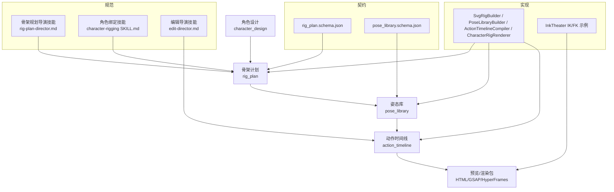
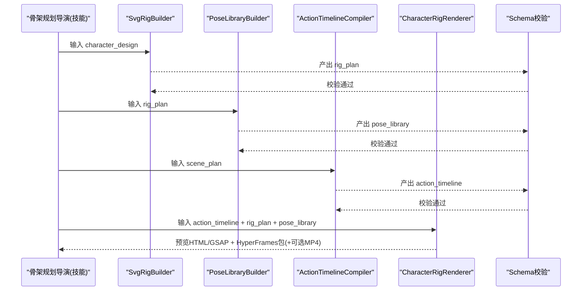
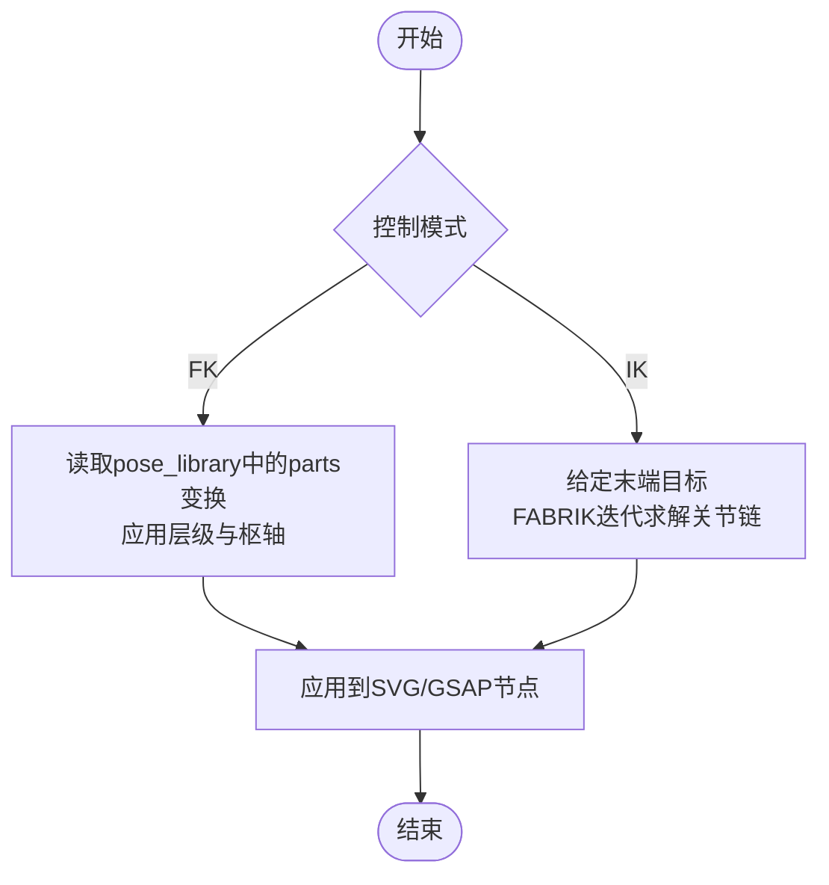
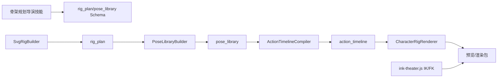

# 骨架规划导演

<cite>
**本文引用的文件**
- [rig-plan-director.md](file://skills/pipelines/character-animation/rig-plan-director.md)
- [SKILL.md（角色绑定技能）](file://.agents/skills/character-rigging/SKILL.md)
- [rig_plan.schema.json](file://schemas/artifacts/rig_plan.schema.json)
- [pose_library.schema.json](file://schemas/artifacts/pose_library.schema.json)
- [character_animation.py](file://tools/character/character_animation.py)
- [ink-theater.js](file://ink-theater/ink-theater.js)
- [bvh2clip.mjs](file://ink-theater/mocap/bvh2clip.mjs)
- [edit-director.md](file://skills/pipelines/character-animation/edit-director.md)
</cite>

## 目录
1. [简介](#简介)
2. [项目结构](#项目结构)
3. [核心组件](#核心组件)
4. [架构总览](#架构总览)
5. [详细组件分析](#详细组件分析)
6. [依赖关系分析](#依赖关系分析)
7. [性能考量](#性能考量)
8. [故障排查指南](#故障排查指南)
9. [结论](#结论)
10. [附录](#附录)

## 简介
本技术文档面向OpenMontage角色动画管道中的“骨架规划导演”，聚焦于如何从角色设计产出可复用的骨架计划与姿态库，并驱动后续渲染与时间线编排。内容涵盖：
- 骨骼结构设计、关节约束设置、层级关系规划
- 动画控制器开发思路（数据驱动的姿势插值与时间线编译）
- 角色骨架构建原则：解剖学准确性、动画灵活性、性能优化、复用性设计
- 关键组件：关节点定义、变换约束、IK/FK切换、表情控制系统、物理模拟设置
- 复杂角色处理方法：多角色互动、变形动画、布料模拟与毛发效果
- 最佳实践、性能优化技巧与调试工具使用方法

## 项目结构
围绕骨架规划导演的核心由“技能规范 + 数据契约 + 工具实现”三部分构成：
- 技能规范：规定骨架规划的流程、质量检查与运行时模式
- 数据契约：rig_plan与pose_library的JSON Schema，确保产物一致性与可验证性
- 工具实现：生成骨架计划、姿态库、动作时间线与预览渲染

图表来源
- [rig-plan-director.md:1-41](file://skills/pipelines/character-animation/rig-plan-director.md#L1-L41)
- [SKILL.md（角色绑定技能）:1-54](file://.agents/skills/character-rigging/SKILL.md#L1-L54)
- [rig_plan.schema.json:1-60](file://schemas/artifacts/rig_plan.schema.json#L1-L60)
- [pose_library.schema.json:1-42](file://schemas/artifacts/pose_library.schema.json#L1-L42)
- [character_animation.py:185-785](file://tools/character/character_animation.py#L185-L785)
- [ink-theater.js:163-261](file://ink-theater/ink-theater.js#L163-L261)

章节来源
- [rig-plan-director.md:1-41](file://skills/pipelines/character-animation/rig-plan-director.md#L1-L41)
- [SKILL.md（角色绑定技能）:1-54](file://.agents/skills/character-rigging/SKILL.md#L1-L54)
- [rig_plan.schema.json:1-60](file://schemas/artifacts/rig_plan.schema.json#L1-L60)
- [pose_library.schema.json:1-42](file://schemas/artifacts/pose_library.schema.json#L1-L42)
- [character_animation.py:185-785](file://tools/character/character_animation.py#L185-L785)
- [ink-theater.js:163-261](file://ink-theater/ink-theater.js#L163-L261)

## 核心组件
- 骨架规划导演（技能）：将角色设计拆解为部件、枢轴、层级、约束、视图与必需姿态；强调“差异即数据”的运行时模式，使渲染器无需为不同角色写一次性代码。
- 骨架计划（rig_plan）：以JSON Schema严格定义的骨架描述，包含部件、关节、层级、视角、必需姿态与风险标注。
- 姿态库（pose_library）：命名化的可复用姿态、表情与过渡提示，支持口型形状与动作循环。
- 工具链：
  - SvgRigBuilder：根据角色设计生成骨架计划
  - PoseLibraryBuilder：生成初始姿态库与动作循环
  - ActionTimelineCompiler：将场景节拍转换为带时间的角色动作
  - CharacterRigRenderer：输出浏览器预览HTML/GSAP与HyperFrames工作区，可选渲染MP4

章节来源
- [rig-plan-director.md:1-41](file://skills/pipelines/character-animation/rig-plan-director.md#L1-L41)
- [character_animation.py:185-785](file://tools/character/character_animation.py#L185-L785)

## 架构总览
骨架规划导演在管道中处于“设计到执行”的关键桥接位置：上游接收角色设计，下游输出可被渲染器消费的数据包与时间线。

图表来源
- [character_animation.py:185-785](file://tools/character/character_animation.py#L185-L785)
- [rig_plan.schema.json:1-60](file://schemas/artifacts/rig_plan.schema.json#L1-L60)
- [pose_library.schema.json:1-42](file://schemas/artifacts/pose_library.schema.json#L1-L42)

## 详细组件分析

### 骨架计划（rig_plan）数据模型
- 角色标识与类型：character_id、rig_type（svg_rig等）
- 部件parts：id、kind、layer、asset_path、parent（层级关系）
- 关节joints：pivot（枢轴坐标）、rotation（旋转范围）、scale（缩放范围）
- 层级layers：按层序排列的部件ID列表
- 视角views：front/side等
- 必需姿态required_poses与必需动作required_actions
- 风险risks：对潜在问题的显式标注

该模型确保每个移动部件都有枢轴、子部件有父级、层序明确，且约束防止非法旋转。

章节来源
- [rig_plan.schema.json:1-60](file://schemas/artifacts/rig_plan.schema.json#L1-L60)
- [SKILL.md（角色绑定技能）:12-45](file://.agents/skills/character-rigging/SKILL.md#L12-L45)

### 姿态库（pose_library）数据模型
- 命名姿态poses：description、parts（局部变换）、expression（表情标签）、hold_frames（保持帧数）、transition（过渡曲线）
- 口型mouth_shapes：用于口型同步或表情表达
- 动作循环action_cycles：如walk、breathe等可复用序列

章节来源
- [pose_library.schema.json:1-42](file://schemas/artifacts/pose_library.schema.json#L1-L42)

### 骨架规划导演流程与质量控制
- 流程要点：
  - 将角色拆分为body/head/eyes/pupils/brows/mouth/limbs/wings/tail/accessories/props
  - 为每个活动部件定义枢轴与层级
  - 设定关节约束避免不可能旋转
  - 为已批准场景定义命名姿态
  - 仅在重复使用≥2次或故事核心时定义动作循环
- 运行时模式：差异即数据，渲染器通用处理不同角色
- 质量检查：每活动部件有枢轴；每必需动作有姿态或程序化策略；每姿态标明变化部件；高风险动作显式标注

章节来源
- [rig-plan-director.md:1-41](file://skills/pipelines/character-animation/rig-plan-director.md#L1-L41)

### 工具实现：骨架计划与姿态库生成
- SvgRigBuilder：
  - 基于角色设计生成基础部件（身体、头、眼、瞳孔、嘴、四肢、尾/翼等）
  - 自动推断关节枢轴与旋转范围，生成层级与必需姿态集合
- PoseLibraryBuilder：
  - 生成默认姿态（idle、blink、look_left/right、surprised）
  - 为必需动作生成占位姿态，提供口型形状与动作循环模板

章节来源
- [character_animation.py:185-367](file://tools/character/character_animation.py#L185-L367)

### 工具实现：动作时间线编译
- ActionTimelineCompiler：
  - 将scene_plan转换为带时间戳的动作序列
  - 为每个角色添加anticipate/perform/settle三段式节奏
  - 支持多角色错开起始偏移，保证可读性

章节来源
- [character_animation.py:370-463](file://tools/character/character_animation.py#L370-L463)
- [edit-director.md:1-34](file://skills/pipelines/character-animation/edit-director.md#L1-L34)

### 工具实现：预览与渲染包
- CharacterRigRenderer：
  - 输出轻量HTML预览，内嵌GSAP驱动的角色动画
  - 生成HyperFrames工作区与composition，便于集成到更大工程
  - 可选通过Playwright+ffmpeg渲染预览MP4
  - 输出资产清单与剪辑决策，便于后续视频合成

章节来源
- [character_animation.py:466-785](file://tools/character/character_animation.py#L466-L785)

### 关节约束与IK/FK切换
- 关节约束：
  - 在rig_plan的joints中声明rotation范围，限制头部/尾部与肢体的旋转区间，避免反关节
  - 通过layers与parent建立层级，确保父子变换正确传播
- IK/FK切换：
  - 前端示例ink-theater.js实现了2D FABRIK逆运动学，用于手臂等链式肢体定位目标点
  - bvh2clip.mjs展示了从BVH到2D投影的FK正运动学流程，可用于动作捕捉数据的适配
  - 在数据驱动管线中，可通过pose_library的parts变换控制FK，或通过IK求解器计算末端目标后的关节角度

图表来源
- [ink-theater.js:163-261](file://ink-theater/ink-theater.js#L163-L261)
- [bvh2clip.mjs:81-145](file://ink-theater/mocap/bvh2clip.mjs#L81-L145)

### 表情控制系统
- 通过pose_library的expression字段标记表情状态（如surprised）
- mouth_shapes提供口型形状，配合对话或音乐进行口型同步
- 眼睛与瞳孔分离，支持视线方向与眨眼等微表情

章节来源
- [character_animation.py:303-367](file://tools/character/character_animation.py#L303-L367)
- [pose_library.schema.json:1-42](file://schemas/artifacts/pose_library.schema.json#L1-L42)

### 物理模拟设置（概念）
- 当前骨架规划阶段以数据驱动为主，物理模拟可在渲染阶段通过程序化动画或外部引擎扩展
- 建议将“软体/布料/毛发”作为独立系统，通过附加部件与约束与主骨架联动

[本节为概念性说明，不直接分析具体文件]

### 复杂角色处理方法
- 多角色互动：
  - 通过action_timeline为多个角色编排交错动作，使用offset错开起始，避免视觉拥挤
- 变形动画：
  - 利用pose_library的parts局部变换与expression组合，实现面部与肢体形变
- 布料模拟与毛发效果：
  - 可作为附加部件挂载到主骨架，使用独立的程序化动画或物理插件驱动，与主骨架层级解耦

章节来源
- [character_animation.py:395-463](file://tools/character/character_animation.py#L395-L463)

## 依赖关系分析
- 技能与契约耦合：
  - 骨架规划导演技能指导rig_plan与pose_library的结构与质量要求
  - JSON Schema确保产物一致性，工具链输出需通过校验
- 工具链内部依赖：
  - SvgRigBuilder → rig_plan
  - PoseLibraryBuilder → pose_library
  - ActionTimelineCompiler → action_timeline
  - CharacterRigRenderer → HTML/GSAP预览 + HyperFrames包 + 可选MP4
- 前端示例依赖：
  - ink-theater.js提供IK/FK参考实现，可与数据驱动管线结合

图表来源
- [character_animation.py:185-785](file://tools/character/character_animation.py#L185-L785)
- [rig_plan.schema.json:1-60](file://schemas/artifacts/rig_plan.schema.json#L1-L60)
- [pose_library.schema.json:1-42](file://schemas/artifacts/pose_library.schema.json#L1-L42)
- [ink-theater.js:163-261](file://ink-theater/ink-theater.js#L163-L261)

章节来源
- [character_animation.py:185-785](file://tools/character/character_animation.py#L185-L785)
- [rig_plan.schema.json:1-60](file://schemas/artifacts/rig_plan.schema.json#L1-L60)
- [pose_library.schema.json:1-42](file://schemas/artifacts/pose_library.schema.json#L1-L42)
- [ink-theater.js:163-261](file://ink-theater/ink-theater.js#L163-L261)

## 性能考量
- 数据驱动减少分支逻辑：角色差异以数据表达，渲染器通用处理，降低维护成本
- 层级与枢轴合理设置：减少不必要的重绘与矩阵计算
- 姿态与动作复用：通过pose_library与action_cycles提升复用率
- 预览渲染优化：
  - GSAP时间线有限重复次数，避免无限循环导致的资源占用
  - 可选仅生成HTML预览，按需再渲染MP4
- 约束与IK迭代次数：在IK求解中控制迭代次数与容差，平衡精度与性能

[本节提供一般性指导，不直接分析具体文件]

## 故障排查指南
- 预览无法播放或无动作：
  - 检查action_timeline是否包含有效场景与动作
  - 确认CharacterRigRenderer输出的HTML与GSAP资源加载正常
- 角色不可见或错位：
  - 核对rig_plan中parts的层级与parent关系
  - 检查joints的pivot是否与美术坐标系一致
- 动作异常或穿模：
  - 调整joints的rotation范围，避免非法旋转
  - 对IK目标点进行可达性检查（超出臂长时直线拉伸）
- MP4渲染失败：
  - 确认系统安装ffmpeg与Playwright依赖
  - 检查帧率与时长参数是否合理

章节来源
- [character_animation.py:70-107](file://tools/character/character_animation.py#L70-L107)
- [character_animation.py:519-785](file://tools/character/character_animation.py#L519-L785)
- [ink-theater.js:163-190](file://ink-theater/ink-theater.js#L163-L190)

## 结论
骨架规划导演通过“技能规范 + 数据契约 + 工具链”形成闭环：从角色设计出发，产出结构化、可校验的rig_plan与pose_library，并驱动时间线编译与预览渲染。其核心优势在于数据驱动、可复用与可扩展，既能满足简单角色的快速搭建，也能支撑复杂角色与多角色互动的生产需求。结合IK/FK、表情系统与程序化动画，可在保持性能的同时实现丰富的表现力。

[本节为总结性内容，不直接分析具体文件]

## 附录
- 最佳实践
  - 每个活动部件必须有枢轴与层级
  - 子部件在有层级意义时必须指定父级
  - 口型、眼睛与瞳孔分离以便精细控制
  - 道具与配件单独拆分，便于交互与遮挡
  - 风险显式标注，避免隐藏问题
- 调试工具
  - 使用HTML预览快速验证枢轴与层级
  - 通过pose_library的description与expression辅助定位问题
  - 借助action_timeline的时间戳与easing检查节奏
- 扩展方向
  - 引入更复杂的IK链与约束
  - 接入物理模拟系统处理布料与毛发
  - 与3D管线对接，使用骨骼与形态目标（Morph Targets）增强表现

[本节为补充性内容，不直接分析具体文件]