# 解释性视频管道

<cite>
**本文引用的文件**
- [README.md](file://README.md)
- [animated-explainer.yaml](file://pipeline_defs/animated-explainer.yaml)
- [executive-producer.md](file://skills/pipelines/explainer/executive-producer.md)
- [research-director.md](file://skills/pipelines/explainer/research-director.md)
- [proposal-director.md](file://skills/pipelines/explainer/proposal-director.md)
- [script-director.md](file://skills/pipelines/explainer/script-director.md)
- [scene-director.md](file://skills/pipelines/explainer/scene-director.md)
- [asset-director.md](file://skills/pipelines/explainer/asset-director.md)
- [edit-director.md](file://skills/pipelines/explainer/edit-director.md)
- [compose-director.md](file://skills/pipelines/explainer/compose-director.md)
- [publish-director.md](file://skills/pipelines/explainer/publish-director.md)
</cite>

## 目录
1. [简介](#简介)
2. [项目结构](#项目结构)
3. [核心组件](#核心组件)
4. [架构总览](#架构总览)
5. [详细组件分析](#详细组件分析)
6. [依赖关系分析](#依赖关系分析)
7. [性能与质量保障](#性能与质量保障)
8. [故障排查指南](#故障排查指南)
9. [结论](#结论)
10. [附录：行业最佳实践与应用案例](#附录行业最佳实践与应用案例)

## 简介
本技术文档面向“OpenMontage 解释性视频管道”，系统化阐述从研究到发布的完整工作链，覆盖研究导演、提案导演、执行制片人、脚本导演、场景导演、资产导演、合成导演、编辑导演和发布导演的职责与协作方式。解释性视频的核心在于将复杂概念简化为直观易懂的视觉内容，通过数据可视化、信息图表生成、动画演示与知识传递，实现高效的知识传播。

本管道以“先研究、后提案、再制作”的结构化流程为核心，强调预算治理、质量门禁、可审计决策与多运行时（Remotion/HyperFrames/FFmpeg）编排能力，确保最终产出既专业又可控。

## 项目结构
OpenMontage 的解释性视频管道由 YAML 管线清单与各阶段技能（Markdown）共同驱动，配合工具注册表、风格剧本、渲染引擎与校验器，形成“指令即编排”的可扩展体系。

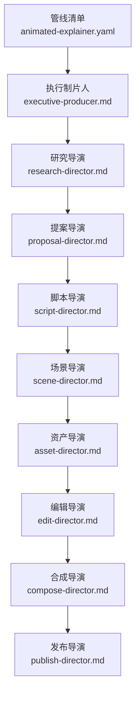

图示来源
- [animated-explainer.yaml:61-270](file://pipeline_defs/animated-explainer.yaml#L61-L270)
- [executive-producer.md:1-28](file://skills/pipelines/explainer/executive-producer.md#L1-L28)

章节来源
- [README.md:356-475](file://README.md#L356-L475)
- [animated-explainer.yaml:61-270](file://pipeline_defs/animated-explainer.yaml#L61-L270)

## 核心组件
- 执行制片人：串行编排各阶段，维护累计状态，跨阶段检查与退回修订，确保质量门控与预算控制。
- 研究导演：基于网络检索构建研究简报，定位受众问题、趋势与数据点，输出至少三个差异化角度。
- 提案导演：在研究基础上设计多个概念选项，明确叙事结构、视觉身份、时长平台、音乐方案与成本估算；锁定渲染运行时并呈现双运行时对比。
- 脚本导演：依据提案与研究撰写旁白脚本，规划节奏、增强提示、发音指南与TTS表达参数。
- 场景导演：将脚本转化为分镜计划，选择可视技法（图表、动画、卡片等），制定转场与画面调度。
- 资产导演：批量生成旁白音频、图像/图表、代码片段与背景音乐，进行样本预览与预算校验。
- 编辑导演：组装时间线、字幕、音轨与混音策略，确保无黑帧、无缝衔接与可读字幕。
- 合成导演：按锁定的渲染运行时（Remotion/HyperFrames/FFmpeg）完成渲染、字幕烧录、音频混合与自检。
- 发布导演：生成SEO元数据、章节标记、缩略图概念与导出包，记录发布日志。

章节来源
- [executive-producer.md:1-28](file://skills/pipelines/explainer/executive-producer.md#L1-L28)
- [research-director.md:1-344](file://skills/pipelines/explainer/research-director.md#L1-L344)
- [proposal-director.md:1-558](file://skills/pipelines/explainer/proposal-director.md#L1-L558)
- [script-director.md:1-269](file://skills/pipelines/explainer/script-director.md#L1-L269)
- [scene-director.md:1-264](file://skills/pipelines/explainer/scene-director.md#L1-L264)
- [asset-director.md:1-291](file://skills/pipelines/explainer/asset-director.md#L1-L291)
- [edit-director.md:1-171](file://skills/pipelines/explainer/edit-director.md#L1-L171)
- [compose-director.md:1-446](file://skills/pipelines/explainer/compose-director.md#L1-L446)
- [publish-director.md:1-174](file://skills/pipelines/explainer/publish-director.md#L1-L174)

## 架构总览
解释性视频管道的端到端流程如下：

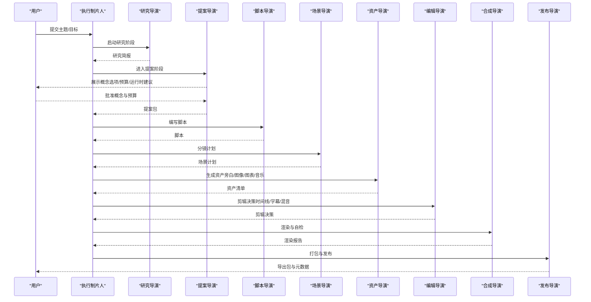

图示来源
- [animated-explainer.yaml:61-270](file://pipeline_defs/animated-explainer.yaml#L61-L270)
- [executive-producer.md:1-28](file://skills/pipelines/explainer/executive-producer.md#L1-L28)

章节来源
- [README.md:408-447](file://README.md#L408-L447)
- [animated-explainer.yaml:61-270](file://pipeline_defs/animated-explainer.yaml#L61-L270)

## 详细组件分析

### 执行制片人（串联编排与质量门）
- 角色定位：状态化大脑，负责串行调用各阶段导演，审查输出并通过或退回修订。
- 关键职责：跨阶段一致性检查、预算跟踪、失败重试、审批门控、决策审计。
- 典型交互：向各阶段下发反馈模板，要求具体原因、影响范围、约束条件与期望结果。

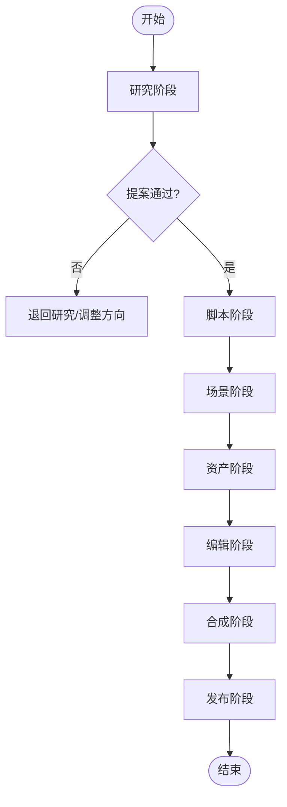

图示来源
- [executive-producer.md:1-28](file://skills/pipelines/explainer/executive-producer.md#L1-L28)
- [animated-explainer.yaml:61-270](file://pipeline_defs/animated-explainer.yaml#L61-L270)

章节来源
- [executive-producer.md:1-28](file://skills/pipelines/explainer/executive-producer.md#L1-L28)
- [animated-explainer.yaml:61-270](file://pipeline_defs/animated-explainer.yaml#L61-L270)

### 研究导演（数据与趋势洞察）
- 目标：建立研究简报，包含现有内容扫描、趋势脉搏、数据证据、受众挖掘、专家声音与视觉参考。
- 方法：并行搜索批次（景观、趋势、数据、受众、专家），提炼至少3个差异化角度，附来源与可信度评级。
- 质量门槛：最低数据点数、引用源数量、搜索次数与角度多样性。

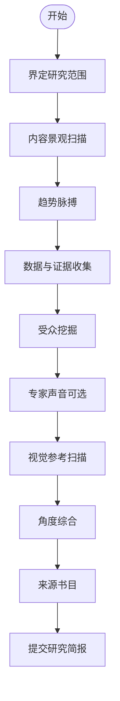

图示来源
- [research-director.md:1-344](file://skills/pipelines/explainer/research-director.md#L1-L344)

章节来源
- [research-director.md:1-344](file://skills/pipelines/explainer/research-director.md#L1-L344)

### 提案导演（概念设计与运行时选择）
- 目标：将研究转化为可审批的概念选项，包含标题钩子、叙事结构、视觉身份、时长平台、音乐方案、成本估算与运行时选择。
- 运行时选择：必须同时评估 Remotion 与 HyperFrames，给出匹配理由与权衡；若仅一个可用则记录不可用原因。
- 审批门：未获明确批准不得进入下一阶段。

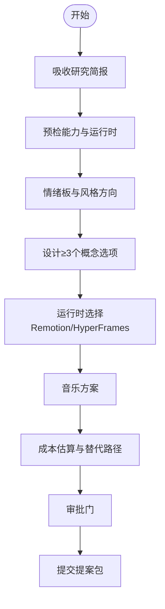

图示来源
- [proposal-director.md:1-558](file://skills/pipelines/explainer/proposal-director.md#L1-L558)

章节来源
- [proposal-director.md:1-558](file://skills/pipelines/explainer/proposal-director.md#L1-L558)

### 脚本导演（旁白与增强提示）
- 目标：依据提案与研究撰写旁白脚本，规划节奏、增强提示、发音指南与TTS表达参数。
- 要点：严格字数预算（按目标时长与语速）、每8-10秒至少一个增强提示、避免空洞开场与信息堆砌。
- 质量自测：钩子力度、词数准确性、叙事流、增强密度、配音表现、术语管理、高潮回报与CTA相关性。

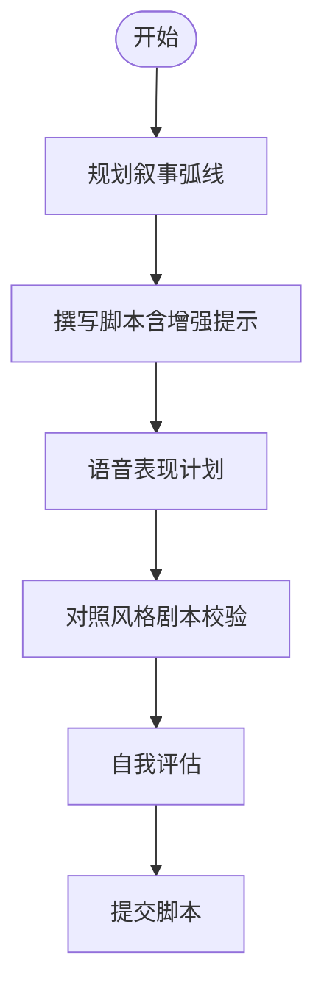

图示来源
- [script-director.md:1-269](file://skills/pipelines/explainer/script-director.md#L1-L269)

章节来源
- [script-director.md:1-269](file://skills/pipelines/explainer/script-director.md#L1-L269)

### 场景导演（分镜与可视技法）
- 目标：将脚本转化为分镜计划，指定每个镜头的主题、运动、场景、空间构图与相机设置，并映射所需资产。
- 可视技法库：图表揭示、类比可视化、数据仪表序列、前后对比、时间线推进、缩放聚焦、代码走读等。
- 可行性校验：确保所有必需资产可由当前工具集生成，避免过度承诺。

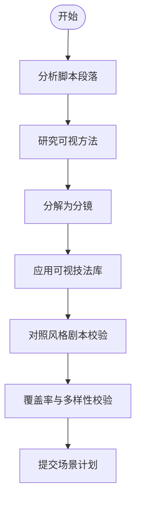

图示来源
- [scene-director.md:1-264](file://skills/pipelines/explainer/scene-director.md#L1-L264)

章节来源
- [scene-director.md:1-264](file://skills/pipelines/explainer/scene-director.md#L1-L264)

### 资产导演（素材生成与预算治理）
- 目标：生成旁白、图像/图表、代码片段与背景音乐，完成样本预览与预算校验，产出资产清单。
- 关键流程：任务盘点→预算检查→样本预览→批量生成→存在性与质量校验→清单提交。
- 注意事项：严格遵循风格一致性与文本准确性（精确文字使用文本卡片而非AI图像）。

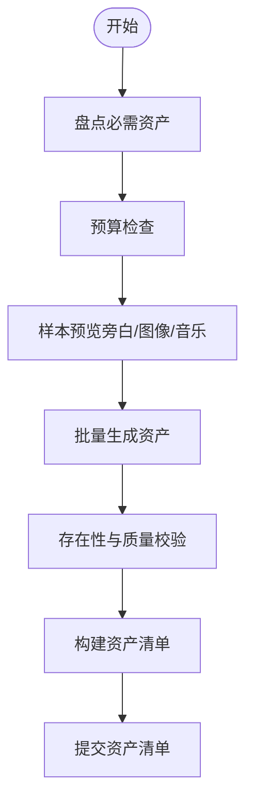

图示来源
- [asset-director.md:1-291](file://skills/pipelines/explainer/asset-director.md#L1-L291)

章节来源
- [asset-director.md:1-291](file://skills/pipelines/explainer/asset-director.md#L1-L291)

### 编辑导演（时间线与音画同步）
- 目标：将资产映射到时间线，定义切段、图层、转场、字幕与音频层（旁白/音乐/音效），配置音乐避让。
- 规则：无黑帧、无重叠主切段、字幕启用且风格符合剧本、旁白与画面对齐。
- 自测：连续性、节奏、音画同步、字幕质量、转场连贯性。

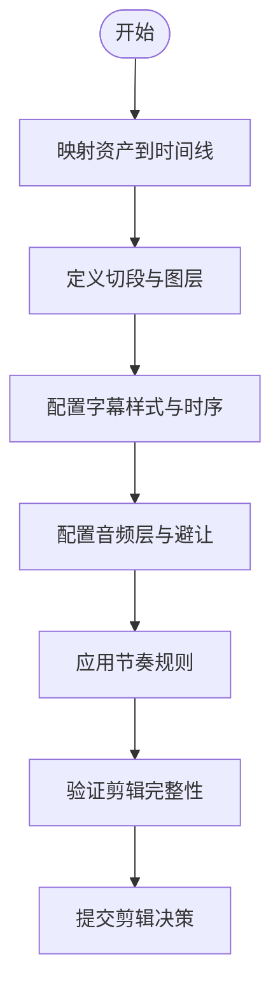

图示来源
- [edit-director.md:1-171](file://skills/pipelines/explainer/edit-director.md#L1-L171)

章节来源
- [edit-director.md:1-171](file://skills/pipelines/explainer/edit-director.md#L1-L171)

### 合成导演（渲染与自检）
- 目标：按锁定的渲染运行时完成最终渲染、字幕烧录、音频混合与自检，产出渲染报告。
- 运行时路由：优先 Remotion（数据驱动解释视频默认），其次 HyperFrames，最后 FFmpeg；运行时变更需经审批。
- 自检流程：探针文件→抽取帧→转录音频→视觉检查→音频检查→汇总报告。

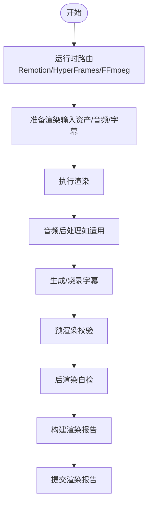

图示来源
- [compose-director.md:1-446](file://skills/pipelines/explainer/compose-director.md#L1-L446)

章节来源
- [compose-director.md:1-446](file://skills/pipelines/explainer/compose-director.md#L1-L446)

### 发布导演（分发准备与导出）
- 目标：生成SEO元数据、章节标记、缩略图概念与导出包，记录发布日志。
- 流程：上下文收集→标题/描述/标签/话题→缩略图概念→章节标记→打包导出→日志提交。
- 注意：标题与描述需兼顾可读性与搜索友好；章节提升观看体验；导出包应包含视频、元数据与缩略图概念。

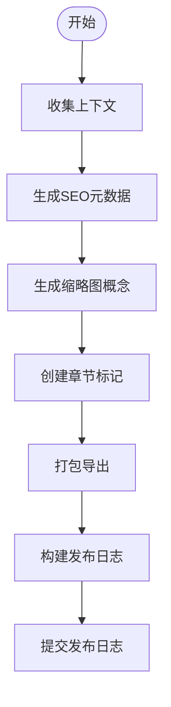

图示来源
- [publish-director.md:1-174](file://skills/pipelines/explainer/publish-director.md#L1-L174)

章节来源
- [publish-director.md:1-174](file://skills/pipelines/explainer/publish-director.md#L1-L174)

## 依赖关系分析
- 阶段依赖：研究→提案→脚本→场景→资产→编辑→合成→发布，前一阶段产物作为后一阶段输入。
- 运行时依赖：提案阶段锁定渲染运行时，合成阶段严格按运行时执行，禁止静默切换。
- 工具依赖：各阶段通过工具注册表发现可用能力（TTS、图像/视频生成、图表、音乐、字幕、混音等）。
- 风格依赖：风格剧本约束色彩、字体、动效与转场，贯穿场景与资产生成。

图示来源
- [animated-explainer.yaml:61-270](file://pipeline_defs/animated-explainer.yaml#L61-L270)

章节来源
- [animated-explainer.yaml:61-270](file://pipeline_defs/animated-explainer.yaml#L61-L270)

## 性能与质量保障
- 质量门禁：人类审批门（提案、脚本、场景、资产、发布）、预合成校验（交付承诺、幻灯片风险、渲染器治理）、后渲染自检（ffprobe、帧采样、音频分析、承诺验证、字幕检查）。
- 提供商评分：任务契合度、输出质量、控制特性、可靠性、成本效率、延迟、连续性七维评分，自动选择最优提供商并记录决策轨迹。
- 预算治理：执行前估算、执行中预留、执行后对账；支持观察/警告/硬性上限模式与单动作阈值审批。
- 运行时治理：提案阶段同时评估 Remotion 与 HyperFrames，合成阶段严禁静默切换；若不可用需显式升级并记录决策。

章节来源
- [README.md:652-686](file://README.md#L652-L686)
- [compose-director.md:9-19](file://skills/pipelines/explainer/compose-director.md#L9-L19)
- [proposal-director.md:11-31](file://skills/pipelines/explainer/proposal-director.md#L11-L31)

## 故障排查指南
- 常见合成问题：
  - 音频缺失：后自检步骤会检测音频流是否存在；若无，立即修复并重渲染。
  - 时长不匹配：旁白超过视频时长会导致结尾被截断；需缩短脚本或延长尾段。
  - 字幕缺失：必须通过 Remotion 词级字幕或 FFmpeg SRT 烧录；两者均不可缺。
- 常见资产问题：
  - 风格不一致：使用一致的视觉锚点与风格前缀，避免重复短语导致机器感。
  - 文本错误：精确文字（CTA、品牌名、联系方式）必须使用文本卡片而非AI图像。
- 常见编辑问题：
  - 黑帧与重叠：确保切段连续无间隙，主切段不重叠。
  - 音乐避让：旁白期间音乐需自动降低音量，避免喧宾夺主。

章节来源
- [compose-director.md:304-371](file://skills/pipelines/explainer/compose-director.md#L304-L371)
- [asset-director.md:254-263](file://skills/pipelines/explainer/asset-director.md#L254-L263)
- [edit-director.md:164-171](file://skills/pipelines/explainer/edit-director.md#L164-L171)

## 结论
OpenMontage 解释性视频管道通过结构化流程、严格的质量门禁与可审计的决策轨迹，将抽象概念转化为直观易懂的视觉内容。其核心价值在于：
- 研究驱动：以真实数据与趋势为基础，避免空泛陈述。
- 提案透明：多概念选项、成本估算与运行时选择让用户掌控方向。
- 制作严谨：分镜与资产生成遵循风格与可行性，编辑与合成确保音画同步与可播放性。
- 发布就绪：SEO元数据、章节与导出包让内容易于分发与被发现。

该管道适用于科技、金融、医疗、教育等多行业，能够支撑产品说明、教程视频与企业培训等多种应用场景。

## 附录：行业最佳实践与应用案例

### 科技行业
- 最佳实践：
  - 使用数据驱动的叙事结构，突出性能对比与架构演进。
  - 采用图表与动画演示复杂系统（如向量数据库、分布式协议）。
  - 通过Remotion组件（统计卡、柱状图、折线图）呈现动态数据。
- 应用案例：
  - 产品说明：以“前后对比”与“KPI网格”展示功能改进。
  - 教程视频：代码片段与终端演示结合，逐步讲解API使用。
  - 企业培训：流程图与架构图解构业务流程，辅以旁白与字幕。

### 金融行业
- 最佳实践：
  - 强调合规与风险控制，使用清晰的指标与时间线展示市场变化。
  - 通过仪表盘与进度条呈现交易流程与收益曲线。
  - 谨慎使用AI生成图像，精确数字与条款使用文本卡片。
- 应用案例：
  - 产品说明：用对比卡片展示不同理财产品的风险收益特征。
  - 教程视频：演示投研工具的使用步骤，配以逐字字幕。
  - 企业培训：合规流程与风控节点的分步动画演示。

### 医疗行业
- 最佳实践：
  - 使用医学插图与解剖图，确保科学准确性与术语正确发音。
  - 通过时间线展示疾病发展或治疗过程，避免误导。
  - 旁白语气专业且温和，字幕清晰易读。
- 应用案例：
  - 产品说明：医疗器械工作原理的动画演示。
  - 教程视频：患者教育视频，分步讲解用药与康复训练。
  - 企业培训：临床操作规范与感染控制流程的视频化培训。

### 教育行业
- 最佳实践：
  - 将复杂概念拆解为小步骤，使用类比可视化与渐进式揭示。
  - 强化互动感与记忆点，利用统计卡与图表增强理解。
  - 提供多语言字幕与本地化版本，扩大受众范围。
- 应用案例：
  - 产品说明：在线学习平台的功能介绍与使用指南。
  - 教程视频：编程入门课程，结合代码片段与运行效果。
  - 企业培训：新员工入职培训，涵盖公司制度与安全规范。

章节来源
- [README.md:356-373](file://README.md#L356-L373)
- [animated-explainer.yaml:61-270](file://pipeline_defs/animated-explainer.yaml#L61-L270)
- [compose-director.md:181-187](file://skills/pipelines/explainer/compose-director.md#L181-L187)
- [publish-director.md:26-84](file://skills/pipelines/explainer/publish-director.md#L26-L84)