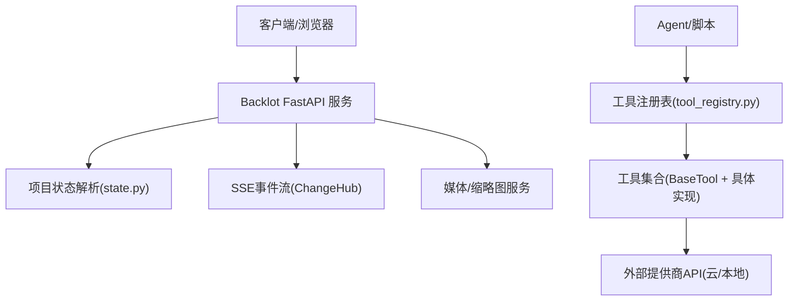
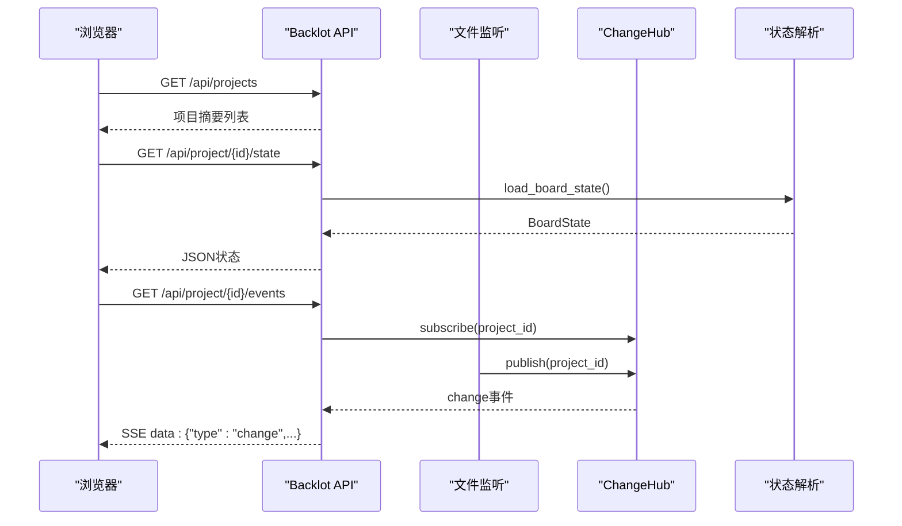
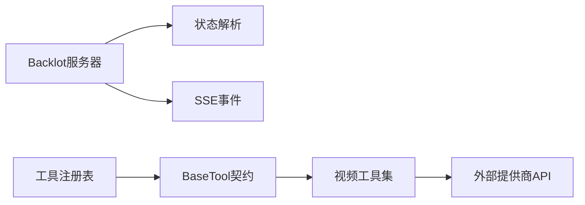

# API参考

<cite>
**本文引用的文件**
- [README.md](file://README.md)
- [server.py](file://backlot/server.py)
- [state.py](file://backlot/state.py)
- [tool_registry.py](file://tools/tool_registry.py)
- [base_tool.py](file://tools/base_tool.py)
- [video_selector.py](file://tools/video/video_selector.py)
- [seedance_ark.py](file://tools/video/seedance_ark.py)
- [_kling/client.py](file://tools/_kling/client.py)
</cite>

## 目录
1. [简介](#简介)
2. [项目结构](#项目结构)
3. [核心组件](#核心组件)
4. [架构总览](#架构总览)
5. [详细组件分析](#详细组件分析)
6. [依赖关系分析](#依赖关系分析)
7. [性能与可用性](#性能与可用性)
8. [故障排查指南](#故障排查指南)
9. [结论](#结论)
10. [附录：API端点清单与调用示例](#附录api端点清单与调用示例)

## 简介
本参考文档面向希望集成OpenMontage的开发者，聚焦以下目标：
- 完整记录Backlot提供的REST API端点（HTTP方法、URL模式、请求/响应、认证与安全）
- 说明工具注册表的发现、能力查询、状态报告等接口
- 统一提供商适配器的接口规范（认证方式、参数格式、错误处理）
- 提供Python/JavaScript SDK使用指南（安装、配置、调用示例）
- 给出错误码与异常处理策略、版本管理与向后兼容性建议
- 提供实际调用示例与最佳实践

OpenMontage是一个以“代理驱动”的视频生产系统，通过工具注册表自动发现并编排100+工具，结合Backlot服务暴露本地REST API与SSE事件流，用于可视化看板与媒体访问。

## 项目结构
- Backlot服务：基于FastAPI的本地Web服务，提供项目状态、事件流、媒体与缩略图访问，以及UI页面
- 工具注册表：集中管理所有工具的元数据、能力、状态与菜单汇总
- 工具基类与实现：统一的工具契约，包含执行、成本估算、依赖检查、重试策略等
- 视频生成与选择器：对多种视频提供商进行评分与路由，支持rank模式与fallback机制
- 第三方客户端封装：如Kling官方API的错误格式化与业务错误处理

图表来源
- [server.py:165-307](file://backlot/server.py#L165-L307)
- [state.py:588-658](file://backlot/state.py#L588-L658)
- [tool_registry.py:55-134](file://tools/tool_registry.py#L55-L134)
- [base_tool.py:227-397](file://tools/base_tool.py#L227-L397)

章节来源
- [README.md:450-475](file://README.md#L450-L475)
- [server.py:165-307](file://backlot/server.py#L165-L307)

## 核心组件
- Backlot REST API：健康检查、项目列表、项目状态、SSE事件流、媒体与缩略图、UI页面
- 工具注册表：发现、枚举、分组、菜单汇总、GPU/网络需求统计
- 工具基类：统一契约（execute、dry_run、estimate_cost、check_dependencies、get_info）
- 视频选择器：按任务上下文评分候选提供商，支持rank模式与输入键适配
- 提供商适配器：统一错误处理、业务错误分类、敏感信息脱敏

章节来源
- [server.py:165-307](file://backlot/server.py#L165-L307)
- [tool_registry.py:55-493](file://tools/tool_registry.py#L55-L493)
- [base_tool.py:227-481](file://tools/base_tool.py#L227-L481)
- [video_selector.py:311-339](file://tools/video/video_selector.py#L311-L339)
- [_kling/client.py:164-216](file://tools/_kling/client.py#L164-L216)

## 架构总览
OpenMontage采用“代理驱动+工具注册表”的架构：
- 代理读取流水线清单与技能文件，决定使用哪些工具
- 工具注册表自动发现并报告可用能力
- Backlot服务提供REST API与SSE事件流，供前端看板实时展示
- 工具执行时通过BaseTool注入事件追踪，便于回放与诊断

图表来源
- [server.py:170-240](file://backlot/server.py#L170-L240)
- [state.py:588-658](file://backlot/state.py#L588-L658)

## 详细组件分析

### Backlot REST API
- 健康检查
  - GET /api/health
  - 返回：{"ok": true, "app": "backlot"}
- 项目列表
  - GET /api/projects
  - 返回：项目摘要数组（标题、流水线类型、是否活跃、最后活动时间等）
- 项目状态
  - GET /api/project/{project_id}/state
  - 返回：BoardState（阶段轨道、制品、故事板、媒体、事件、成本快照等）
- 项目事件流
  - GET /api/project/{project_id}/events
  - 返回：SSE流，包含hello、heartbeat、change事件
- 库级事件流
  - GET /api/library/events
  - 返回：SSE流，广播所有项目变更
- 缩略图
  - GET /thumb/{project_id}/{file_path}?w=...
  - 返回：JPEG缩略图或原图（非可缩略图片）
- 媒体
  - GET /media/{project_id}/{file_path}
  - 返回：原始媒体文件（支持Range请求）
- UI页面
  - GET /p/{project_id}
  - GET /p/{project_path}
  - GET /
  - 返回：HTML页面（带缓存控制no-cache）

安全与校验
- project_id白名单校验，拒绝路径穿越字符
- 媒体与缩略图路径限制在项目目录内，越界返回403
- 缺失媒体返回404

章节来源
- [server.py:165-307](file://backlot/server.py#L165-L307)
- [server.py:310-318](file://backlot/server.py#L310-L318)

### 工具注册表API
- 发现与加载
  - discover(package_name="tools")：导入工具包并注册所有BaseTool子类
  - ensure_discovered(package_name)：确保已发现
- 查询能力
  - support_envelope()：全部工具的合同信息与状态
  - capability_catalog()：按能力分组
  - provider_catalog()：按提供商分组
  - tier_summary()：按层级统计可用/不可用/降级数量
  - provider_menu()：用户友好的能力菜单（含安装提示、运行时警告）
  - provider_menu_summary()：紧凑版能力概览（composition_runtimes、capabilities、setup_offers、runtime_warnings）
- 工具检索
  - get(name)、list_all()
  - get_by_tier(tier)、get_by_capability(capability)、get_by_provider(provider)
  - get_by_status(status)、get_available()、get_unavailable()
  - find_by_capability(capability)
  - find_fallback(tool_name)：查找可用的回退工具
- 资源需求
  - gpu_required_tools()：需要GPU的工具列表
  - network_required_tools()：需要网络的工具列表

章节来源
- [tool_registry.py:55-493](file://tools/tool_registry.py#L55-L493)

### 工具基类与执行契约
- 身份与元数据
  - name、version、tier、stability、execution_mode、determinism、runtime
- 依赖与安装
  - dependencies（env:、cmd:、binary:、python:）、install_instructions
- 能力与约束
  - capability、provider、capabilities、input_schema、output_schema、artifact_schema
  - supports、best_for、not_good_for、provider_matrix
- 资源与重试
  - resource_profile（cpu_cores、ram_mb、vram_mb、disk_mb、network_required）
  - retry_policy（max_retries、backoff_seconds、retryable_errors）
- 恢复与幂等
  - resume_support、idempotency_key_fields
- 副作用与回退
  - side_effects、fallback、fallback_tools
- 验证与遥测
  - user_visible_verification、quality_score、historical_success_rate、latency_p50_seconds
- 生命周期
  - check_dependencies()、get_status()、get_info()、estimate_cost()、estimate_runtime()
  - execute(inputs) -> ToolResult、dry_run(inputs)
  - run_command(cmd, timeout, cwd)：跨平台子进程执行与UTF-8解码

章节来源
- [base_tool.py:63-108](file://tools/base_tool.py#L63-L108)
- [base_tool.py:110-139](file://tools/base_tool.py#L110-L139)
- [base_tool.py:227-397](file://tools/base_tool.py#L227-L397)
- [base_tool.py:411-481](file://tools/base_tool.py#L411-L481)

### 视频选择器与提供商适配器
- 视频选择器
  - rank模式：返回候选提供商评分与解释
  - 正常模式：根据任务上下文选择最佳提供商，适配输入键（prompt/query）
- 提供商适配器（以Kling为例）
  - HTTP错误分类与业务错误分类
  - 错误格式化（code、message、request_id、http_status、response）
  - 并发/资源包限制提示增强
- 敏感信息脱敏
  - URL查询参数与Authorization头在日志中脱敏

章节来源
- [video_selector.py:311-339](file://tools/video/video_selector.py#L311-L339)
- [_kling/client.py:164-216](file://tools/_kling/client.py#L164-L216)
- [seedance_ark.py:1438-1473](file://tools/video/seedance_ark.py#L1438-L1473)

## 依赖关系分析
- Backlot服务依赖state模块解析项目状态，并通过watchfiles监听项目目录变更，触发SSE事件
- 工具注册表依赖BaseTool及其子类，自动发现并聚合能力
- 视频选择器依赖各视频提供商工具，按任务上下文评分并路由
- 提供商适配器统一错误处理，提升可观测性与安全性

图表来源
- [server.py:165-307](file://backlot/server.py#L165-L307)
- [tool_registry.py:55-134](file://tools/tool_registry.py#L55-L134)
- [base_tool.py:227-397](file://tools/base_tool.py#L227-L397)

章节来源
- [server.py:165-307](file://backlot/server.py#L165-L307)
- [tool_registry.py:55-134](file://tools/tool_registry.py#L55-L134)

## 性能与可用性
- 文件监听与事件合并：批量变更去抖，避免队列拥塞
- 缩略图缓存：按内容哈希与宽度缓存JPEG，减少重复计算
- 状态解析防御性：损坏JSON或丢失工件不会导致崩溃，仅降级显示
- 工具执行可观测：instrument_execute包装start/finish/error事件，支持回放与诊断
- 提供商选择评分：多维度打分（任务契合度、质量、控制、可靠性、成本、延迟、连续性）

章节来源
- [server.py:43-74](file://backlot/server.py#L43-L74)
- [server.py:325-365](file://backlot/server.py#L325-L365)
- [state.py:1-6](file://backlot/state.py#L1-L6)
- [base_tool.py:148-224](file://tools/base_tool.py#L148-L224)

## 故障排查指南
- 项目ID非法或不存在
  - 现象：400/404
  - 原因：project_id包含路径穿越字符或目录不存在
  - 处理：校验project_id，确认项目目录存在
- 媒体或缩略图不存在
  - 现象：404
  - 原因：文件不在项目目录或无法提取海报帧
  - 处理：确认文件路径正确，必要时直接返回原图
- 工具不可用
  - 现象：get_status()返回unavailable/degraded
  - 原因：缺少环境变量、命令或Python模块
  - 处理：根据install_instructions补充依赖
- 提供商错误
  - 现象：HTTP错误或业务错误
  - 原因：鉴权失败、配额不足、限流、内部错误
  - 处理：依据错误码分类重试或终止，查看request_id定位问题
- 事件流断开
  - 现象：SSE连接中断
  - 原因：客户端断开或超时
  - 处理：重连并处理心跳，合并突发事件

章节来源
- [server.py:310-318](file://backlot/server.py#L310-L318)
- [server.py:244-276](file://backlot/server.py#L244-L276)
- [base_tool.py:304-328](file://tools/base_tool.py#L304-L328)
- [_kling/client.py:164-216](file://tools/_kling/client.py#L164-L216)

## 结论
OpenMontage通过Backlot REST API与工具注册表提供了完整的本地集成能力。开发者可通过标准REST端点获取项目状态与媒体，利用SSE事件流实现实时看板；通过工具注册表发现与调用100+工具，借助统一契约与错误处理策略实现稳定可靠的集成。建议在集成时遵循供应商密钥管理、错误分类与重试策略、以及资源与预算治理的最佳实践。

## 附录：API端点清单与调用示例

### Backlot REST API
- 健康检查
  - 方法：GET
  - URL：/api/health
  - 响应：{"ok": true, "app": "backlot"}
- 项目列表
  - 方法：GET
  - URL：/api/projects
  - 响应：项目摘要数组
- 项目状态
  - 方法：GET
  - URL：/api/project/{project_id}/state
  - 响应：BoardState对象
- 项目事件流
  - 方法：GET
  - URL：/api/project/{project_id}/events
  - 响应：SSE流（hello/heartbeat/change）
- 库级事件流
  - 方法：GET
  - URL：/api/library/events
  - 响应：SSE流（广播所有项目变更）
- 缩略图
  - 方法：GET
  - URL：/thumb/{project_id}/{file_path}?w=640
  - 响应：JPEG缩略图或原图
- 媒体
  - 方法：GET
  - URL：/media/{project_id}/{file_path}
  - 响应：原始媒体文件
- UI页面
  - 方法：GET
  - URL：/p/{project_id}、/p/{project_path}、/
  - 响应：HTML页面

调用示例（概念性）
- 获取项目状态
  - 请求：GET /api/project/my-project/state
  - 响应：包含stages、artifacts、storyboard、media、events、cost等字段
- 订阅项目事件
  - 请求：GET /api/project/my-project/events
  - 响应：SSE流，收到change事件后刷新状态

章节来源
- [server.py:170-240](file://backlot/server.py#L170-L240)
- [server.py:244-276](file://backlot/server.py#L244-L276)
- [server.py:280-307](file://backlot/server.py#L280-L307)

### 工具注册表API（Python调用）
- 发现与菜单
  - 调用：registry.discover(); registry.provider_menu(); registry.provider_menu_summary()
  - 用途：列出可用/不可用工具、安装提示、运行时警告
- 能力查询
  - 调用：registry.support_envelope(); registry.capability_catalog(); registry.provider_catalog()
  - 用途：按能力/提供商分组查看工具合同与状态
- 工具检索
  - 调用：registry.get(name); registry.find_by_capability(capability); registry.find_fallback(tool_name)
  - 用途：获取具体工具或回退工具
- 资源需求
  - 调用：registry.gpu_required_tools(); registry.network_required_tools()
  - 用途：识别需要GPU或网络的工具

调用示例（概念性）
- 打印能力菜单
  - 代码路径：[tool_registry.py:249-314](file://tools/tool_registry.py#L249-L314)
- 打印紧凑概览
  - 代码路径：[tool_registry.py:316-471](file://tools/tool_registry.py#L316-L471)

章节来源
- [tool_registry.py:55-493](file://tools/tool_registry.py#L55-L493)

### 提供商适配器统一接口规范
- 认证方式
  - 通过环境变量注入（env:前缀），由BaseTool.check_dependencies校验
  - 工具元数据中的dependencies声明所需环境变量
- 参数格式
  - 输入输出遵循input_schema/output_schema/artifact_schema
  - 视频选择器会适配不同提供商的参数键（如prompt/query）
- 错误处理
  - HTTP错误与业务错误分类，统一格式化为code/message/request_id/http_status/response
  - 敏感信息（URL、Authorization）在日志中脱敏
- 重试策略
  - 通过retry_policy定义最大重试次数、退避时间与可重试错误
  - 视频选择器支持rank模式评估候选提供商

章节来源
- [base_tool.py:304-328](file://tools/base_tool.py#L304-L328)
- [_kling/client.py:164-216](file://tools/_kling/client.py#L164-L216)
- [seedance_ark.py:1438-1473](file://tools/video/seedance_ark.py#L1438-L1473)
- [video_selector.py:311-339](file://tools/video/video_selector.py#L311-L339)

### SDK使用指南

#### Python SDK（内置）
- 安装与运行
  - 克隆仓库并安装依赖
  - 设置.env文件（可选，按需添加API密钥）
- 配置
  - 通过环境变量注入提供商密钥（如FAL_KEY、KLING_API_KEY等）
  - 工具注册表自动加载.env并校验依赖
- 调用示例
  - 发现工具并打印能力菜单
    - 代码路径：[tool_registry.py:118-134](file://tools/tool_registry.py#L118-L134)
    - 代码路径：[tool_registry.py:249-314](file://tools/tool_registry.py#L249-L314)
  - 查询工具状态与信息
    - 代码路径：[tool_registry.py:141-175](file://tools/tool_registry.py#L141-L175)
    - 代码路径：[base_tool.py:329-372](file://tools/base_tool.py#L329-L372)
  - 执行工具
    - 调用BaseTool.execute(inputs)，返回ToolResult（success/data/artifacts/cost_usd/duration_seconds）
    - 代码路径：[base_tool.py:394-407](file://tools/base_tool.py#L394-L407)

章节来源
- [README.md:189-216](file://README.md#L189-L216)
- [tool_registry.py:118-134](file://tools/tool_registry.py#L118-L134)
- [base_tool.py:394-407](file://tools/base_tool.py#L394-L407)

#### JavaScript SDK（浏览器/Node.js）
- 安装与运行
  - 通过npm安装相关包（如Remotion/HyperFrames）
  - 使用Fetch或EventSource与Backlot API交互
- 配置
  - 设置后端地址（默认localhost）
  - 处理CORS与缓存控制（UI资源no-cache）
- 调用示例
  - 获取项目列表与状态
    - 请求：GET /api/projects、/api/project/{id}/state
    - 响应：JSON对象
  - 订阅事件流
    - 使用EventSource连接/api/project/{id}/events
    - 处理hello/heartbeat/change事件
  - 下载媒体与缩略图
    - 请求：GET /media/{id}/{path}、/thumb/{id}/{path}?w=640
    - 响应：二进制文件或JPEG

章节来源
- [server.py:280-307](file://backlot/server.py#L280-L307)
- [server.py:183-240](file://backlot/server.py#L183-L240)

### 错误码与异常处理策略
- HTTP错误
  - 400：无效project_id
  - 403：路径越界
  - 404：未知项目或媒体不存在
- 工具错误
  - DependencyError：依赖未满足（环境变量/命令/模块缺失）
  - ToolCommandError：子进程执行失败（附带stderr/stdout）
- 提供商错误
  - 分类为HTTP错误与业务错误，统一格式化为code/message/request_id
  - 针对并发/资源包限制等场景提供增强提示
- 重试策略
  - 根据retry_policy与错误类型决定是否重试
  - 指数退避与随机抖动

章节来源
- [server.py:310-318](file://backlot/server.py#L310-L318)
- [base_tool.py:456-481](file://tools/base_tool.py#L456-L481)
- [_kling/client.py:164-216](file://tools/_kling/client.py#L164-L216)

### 版本管理与向后兼容性
- 工具版本
  - BaseTool.version字段声明工具版本
  - 通过support_envelope/provider_catalog暴露版本信息
- 向后兼容
  - 状态解析对历史checkpoint与制品路径兼容（多路径尝试）
  - 选择器对输入键差异进行适配（prompt/query）
  - 提供商适配器对错误格式进行统一，屏蔽上游差异
- 建议
  - 升级工具时保持input_schema/output_schema稳定
  - 在provider_menu_summary中提供setup_offers与runtime_warnings，便于迁移

章节来源
- [base_tool.py:329-372](file://tools/base_tool.py#L329-L372)
- [state.py:273-298](file://backlot/state.py#L273-L298)
- [video_selector.py:334-339](file://tools/video/video_selector.py#L334-L339)

### 实际调用示例与最佳实践
- 快速开始
  - 安装依赖与环境变量
  - 启动Backlot服务，访问UI或调用REST API
- 集成步骤
  - 使用工具注册表发现能力，选择合适工具
  - 通过BaseTool.execute执行，捕获ToolResult并处理错误
  - 使用Backlot API获取项目状态与媒体，构建前端看板
- 最佳实践
  - 严格校验project_id与文件路径，防止越界访问
  - 合理设置重试策略与超时，避免长时间阻塞
  - 记录request_id与错误上下文，便于问题定位
  - 使用provider_menu_summary呈现用户友好的能力菜单与安装提示

章节来源
- [README.md:189-216](file://README.md#L189-L216)
- [tool_registry.py:316-471](file://tools/tool_registry.py#L316-L471)
- [server.py:170-240](file://backlot/server.py#L170-L240)