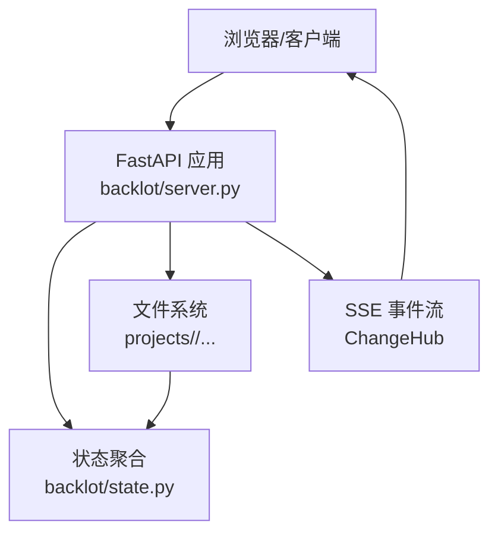
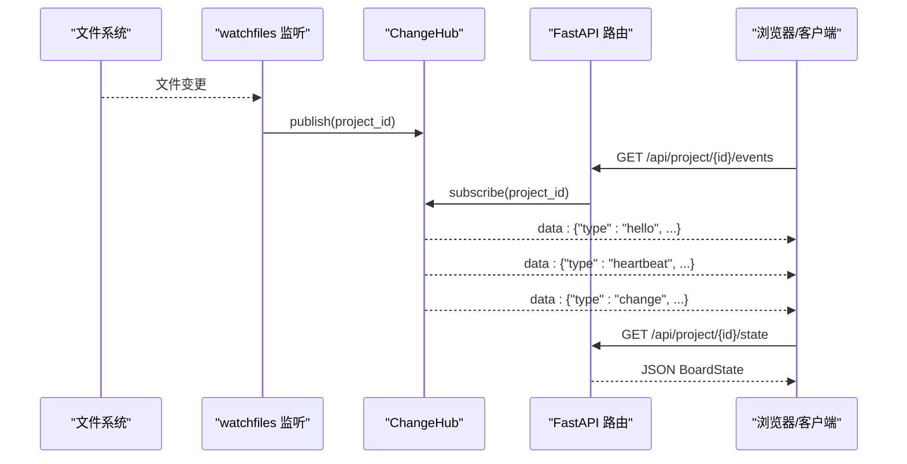
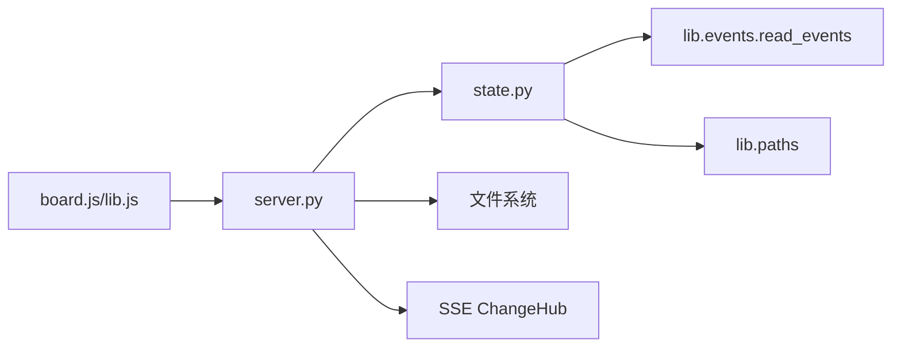

# REST API

<cite>
**本文引用的文件**
- [server.py](file://backlot/server.py)
- [state.py](file://backlot/state.py)
- [__main__.py](file://backlot/__main__.py)
- [README.md](file://backlot/README.md)
- [board.js](file://backlot/ui/board.js)
- [lib.js](file://backlot/ui/lib.js)
- [test_server.py](file://tests/backlot/test_server.py)
</cite>

## 目录
1. [简介](#简介)
2. [项目结构](#项目结构)
3. [核心组件](#核心组件)
4. [架构总览](#架构总览)
5. [详细端点说明](#详细端点说明)
6. [依赖关系分析](#依赖关系分析)
7. [性能与可用性](#性能与可用性)
8. [故障排查指南](#故障排查指南)
9. [结论](#结论)
10. [附录：客户端集成示例](#附录客户端集成示例)

## 简介
Backlot 是一个只读的本地“活看板”服务，用于可视化视频制作流水线在磁盘上的实时进展。它通过文件系统监听（watchfiles）将变更以 Server-Sent Events（SSE）推送给前端；前端据此轮询状态并刷新界面。后端基于 FastAPI 提供 REST 接口，涵盖健康检查、项目列表、项目状态、媒体与缩略图访问等能力。

该文档面向开发者，完整记录所有 HTTP 端点、请求参数、响应格式、错误处理、SSE 事件流、认证与安全注意事项、版本兼容策略，以及 curl 和 JavaScript 调用示例，帮助快速集成 Backlot 功能。

## 项目结构
- 服务入口与路由定义位于 backlot/server.py，使用 FastAPI 创建应用并挂载路由。
- 状态读取与聚合逻辑位于 backlot/state.py，负责从项目目录中读取 checkpoint、artifacts、events 等数据，生成 BoardState。
- CLI 启动器位于 backlot/__main__.py，支持后台启动服务与打开浏览器。
- 前端 UI 位于 backlot/ui，包含 board.html、board.js、library.js 等，通过 SSE 订阅变更并渲染看板。
- 测试覆盖位于 tests/backlot/test_server.py，验证路径安全、范围请求、缩略图生成等。

图表来源
- [server.py:165-307](file://backlot/server.py#L165-L307)
- [state.py:588-658](file://backlot/state.py#L588-L658)

章节来源
- [server.py:1-369](file://backlot/server.py#L1-L369)
- [state.py:1-716](file://backlot/state.py#L1-L716)
- [__main__.py:1-110](file://backlot/__main__.py#L1-L110)
- [README.md:1-43](file://backlot/README.md#L1-L43)

## 核心组件
- ChangeHub：按项目过滤的 SSE 通知中心，避免无关项目变更风暴影响订阅者。
- 状态聚合：从 project.json、checkpoint_*.json、history、artifacts、events.jsonl 等源构建 BoardState，包括阶段轨道、故事板、媒体清单、成本快照等。
- 媒体与缩略图：提供 /media 与 /thumb 两个端点，支持 Range 请求与缓存缩略图。
- 生命周期：通过 lifespan 启动 watchfiles 监听 projects/ 目录，变更时发布到 ChangeHub。

章节来源
- [server.py:43-74](file://backlot/server.py#L43-L74)
- [server.py:132-163](file://backlot/server.py#L132-L163)
- [state.py:118-224](file://backlot/state.py#L118-L224)
- [state.py:246-267](file://backlot/state.py#L246-L267)
- [state.py:502-535](file://backlot/state.py#L502-L535)
- [state.py:588-658](file://backlot/state.py#L588-L658)

## 架构总览
Backlot 采用“文件系统即状态源 + SSE 推送”的架构：
- 后端不直接写入项目目录，仅读取并聚合状态。
- watchfiles 监听 projects/ 下变更，去重后通过 ChangeHub 广播。
- 前端通过 SSE 订阅变更，收到 change 消息后拉取最新状态或增量更新 UI。

图表来源
- [server.py:132-163](file://backlot/server.py#L132-L163)
- [server.py:183-212](file://backlot/server.py#L183-L212)
- [server.py:214-240](file://backlot/server.py#L214-L240)

## 详细端点说明

### 健康检查
- URL: GET /api/health
- 描述：服务健康探针，返回简单 JSON。
- 响应体：{"ok": true, "app": "backlot"}
- 错误：无特定错误码；若服务不可用则连接失败。
- curl 示例：
  - curl http://127.0.0.1:4750/api/health
- JS 示例：
  - fetch("/api/health").then(r => r.json()).then(console.log)

章节来源
- [server.py:170-173](file://backlot/server.py#L170-L173)
- [test_server.py:89-92](file://tests/backlot/test_server.py#L89-L92)

### 项目列表（库视图）
- URL: GET /api/projects
- 描述：返回所有项目的摘要信息，按 live 优先与最近活动排序。
- 查询参数：无
- 响应体：数组，每项包含 project_id、title、pipeline_type、has_pipeline_state、poster、live、last_activity、active_stage、awaiting_human、stage_states、completed_count、render_count、scene_count、error（可选）。
- 错误：无；若项目目录不存在返回空数组。
- curl 示例：
  - curl http://127.0.0.1:4750/api/projects
- JS 示例：
  - fetch("/api/projects").then(r => r.json()).then(console.log)

章节来源
- [server.py:174-177](file://backlot/server.py#L174-L177)
- [state.py:686-716](file://backlot/state.py#L686-L716)
- [test_server.py:94-103](file://tests/backlot/test_server.py#L94-L103)

### 项目状态
- URL: GET /api/project/{project_id}/state
- 描述：获取指定项目的完整 BoardState。
- 路径参数：
  - project_id: 字符串，禁止包含 / \ : 及 . ..，否则返回 400；不存在返回 404。
- 响应体：对象，包含 project_id、title、pipeline、style_playbook、created_at、has_marker、has_pipeline_state、stages、artifacts、storyboard、media、events、cost、last_activity、live、poster。
- 错误：
  - 400 invalid project id
  - 404 unknown project
- curl 示例：
  - curl http://127.0.0.1:4750/api/project/film/state
- JS 示例：
  - fetch("/api/project/film/state").then(r => r.json()).then(console.log)

章节来源
- [server.py:178-182](file://backlot/server.py#L178-L182)
- [server.py:310-318](file://backlot/server.py#L310-L318)
- [state.py:588-658](file://backlot/state.py#L588-L658)
- [test_server.py:105-110](file://tests/backlot/test_server.py#L105-L110)
- [test_server.py:112-122](file://tests/backlot/test_server.py#L112-L122)

### 项目事件流（SSE）
- URL: GET /api/project/{project_id}/events
- 描述：订阅指定项目的变更事件流。
- 路径参数：project_id（同项目状态端点的校验规则）。
- 事件类型：
  - hello: 连接建立，携带 project_id
  - heartbeat: 心跳，携带 ts（时间戳），每约 15 秒发送一次
  - change: 变更通知，携带 project_id
- 响应头：
  - Content-Type: text/event-stream
  - Cache-Control: no-cache
  - X-Accel-Buffering: no
- 错误：未知项目会提前返回 404。
- curl 示例：
  - curl -N http://127.0.0.1:4750/api/project/film/events
- JS 示例：
  - const es = new EventSource("/api/project/film/events"); es.onmessage = e => console.log(JSON.parse(e.data));

章节来源
- [server.py:183-212](file://backlot/server.py#L183-L212)
- [server.py:321-323](file://backlot/server.py#L321-L323)

### 库级事件流（SSE）
- URL: GET /api/library/events
- 描述：订阅所有项目的变更事件流（不限制项目）。
- 事件类型：
  - hello: 连接建立
  - heartbeat: 心跳，携带 ts
  - change: 变更通知，携带 project_id
- 响应头：同上。
- curl 示例：
  - curl -N http://127.0.0.1:4750/api/library/events
- JS 示例：
  - const es = new EventSource("/api/library/events"); es.onmessage = e => console.log(JSON.parse(e.data));

章节来源
- [server.py:214-240](file://backlot/server.py#L214-L240)

### 缩略图
- URL: GET /thumb/{project_id}/{file_path}
- 描述：为图片生成缩放后的 JPEG 缩略图；对视频尝试提取海报帧；非媒体文件透传。
- 路径参数：
  - project_id: 同项目状态端点校验
  - file_path: 相对项目目录的路径，防止路径穿越
- 查询参数：
  - w: 目标宽度（整数），默认 640；内部会映射到预定义宽度集合中最接近的值
- 行为：
  - 图片：生成缓存 JPEG，content-type image/jpeg
  - 视频：尝试 ffmpeg 提取海报帧；失败返回 404（绝不回退为原始视频字节）
  - 其他文件：直接透传
- 错误：
  - 403 path escapes project（路径穿越）
  - 404 media not found 或 no poster frame available
- curl 示例：
  - curl -o thumb.jpg "http://127.0.0.1:4750/thumb/film/assets/images/sc1.png?w=320"
- JS 示例：
  - const url = `/thumb/${encodeURIComponent(projectId)}/${encodeURIComponent(relPath)}?w=640`;

章节来源
- [server.py:244-263](file://backlot/server.py#L244-L263)
- [server.py:325-365](file://backlot/server.py#L325-L365)
- [test_server.py:140-153](file://tests/backlot/test_server.py#L140-L153)
- [test_server.py:198-206](file://tests/backlot/test_server.py#L198-L206)

### 媒体文件
- URL: GET /media/{project_id}/{file_path}
- 描述：提供项目内媒体文件的下载/流式播放，支持 Range 请求。
- 路径参数：project_id、file_path（同缩略图的安全校验）
- 响应：文件内容，支持 Range 分段传输（206 Partial Content）
- 错误：
  - 403 path escapes project
  - 404 media not found
- curl 示例：
  - curl -r 2-5 "http://127.0.0.1:4750/media/film/renders/final.mp4"
- JS 示例：
  - const url = `/media/${encodeURIComponent(projectId)}/${encodeURIComponent(relPath)}`;

章节来源
- [server.py:266-276](file://backlot/server.py#L266-L276)
- [test_server.py:129-139](file://tests/backlot/test_server.py#L129-L139)

### 页面路由（UI）
- URL:
  - GET /p/{project_id}
  - GET /p/{project_path:path}
  - GET /
- 描述：返回看板 HTML 页面与静态资源；对 /、/ui、/p/* 强制 no-cache 以便开发调试。
- 错误：无特定错误；资源缺失由静态文件服务器处理。
- curl 示例：
  - curl http://127.0.0.1:4750/p/film

章节来源
- [server.py:280-305](file://backlot/server.py#L280-L305)

## 依赖关系分析
- server.py 依赖 state.py 进行状态聚合；依赖 watchfiles 进行文件系统监听；依赖 uvicorn 运行 FastAPI。
- state.py 依赖 lib.events 读取 events.jsonl；依赖 lib.paths 获取 PROJECTS_DIR、REPO_ROOT。
- 前端 board.js 与 lib.js 通过 SSE 与 REST 与后端交互。

图表来源
- [server.py:165-307](file://backlot/server.py#L165-L307)
- [state.py:16-17](file://backlot/state.py#L16-L17)
- [board.js:1-10](file://backlot/ui/board.js#L1-L10)
- [lib.js:65-81](file://backlot/ui/lib.js#L65-L81)

章节来源
- [server.py:1-369](file://backlot/server.py#L1-L369)
- [state.py:1-716](file://backlot/state.py#L1-L716)
- [board.js:1-1143](file://backlot/ui/board.js#L1-L1143)
- [lib.js:1-104](file://backlot/ui/lib.js#L1-L104)

## 性能与可用性
- 项目列表与状态端点有明确的性能预算约束：冷启动 < 2s，热启动 < 0.15s；状态读取 < 0.4s。
- 缩略图生成有超时保护（ffmpeg 30s），并发命中同一资源时使用临时文件避免竞争。
- SSE 心跳间隔 15 秒，队列最大容量 64，满队时丢弃多余通知以避免阻塞。
- 媒体服务支持 Range 请求，适合大文件流式播放。

章节来源
- [server.py:30-31](file://backlot/server.py#L30-L31)
- [server.py:54-72](file://backlot/server.py#L54-L72)
- [server.py:347-355](file://backlot/server.py#L347-L355)
- [test_server.py:156-193](file://tests/backlot/test_server.py#L156-L193)

## 故障排查指南
- 路径穿越防护：任何涉及 project_id 与 file_path 的端点都会拒绝包含 / \ : 或 . .. 的非法 ID，并校验目标路径在项目目录内。
- 未知项目：返回 404，便于前端提示或重试。
- 缩略图失败：视频无法提取海报帧时返回 404，不会回退为原始视频字节，避免 F-03 问题。
- SSE 断连：EventSource 自动重连；服务端会在心跳超时后继续发送心跳，保持连接活性。
- 性能退化：若 /api/projects 或 /api/project/{id}/state 超过预算，检查项目数量、artifacts 大小、ffmpeg 可用性与缓存命中率。

章节来源
- [server.py:310-318](file://backlot/server.py#L310-L318)
- [server.py:244-263](file://backlot/server.py#L244-L263)
- [server.py:183-212](file://backlot/server.py#L183-L212)
- [test_server.py:112-153](file://tests/backlot/test_server.py#L112-L153)

## 结论
Backlot 提供了简洁而健壮的 REST API 与 SSE 事件流，专注于“只读可视化”与“实时变更通知”。其设计强调安全性（路径校验）、可用性（心跳与自动重连）、性能（缓存与预算）与可维护性（清晰的分层与职责分离）。开发者可通过标准 HTTP 与 SSE 轻松集成项目状态监控与媒体浏览功能。

## 附录：客户端集成示例

### curl 示例
- 健康检查：
  - curl http://127.0.0.1:4750/api/health
- 项目列表：
  - curl http://127.0.0.1:4750/api/projects
- 项目状态：
  - curl http://127.0.0.1:4750/api/project/film/state
- 媒体范围请求：
  - curl -r 2-5 http://127.0.0.1:4750/media/film/renders/final.mp4
- 缩略图：
  - curl -o thumb.jpg "http://127.0.0.1:4750/thumb/film/assets/images/sc1.png?w=320"
- SSE 事件流：
  - curl -N http://127.0.0.1:4750/api/project/film/events

### JavaScript 示例
- 获取 JSON：
  - fetch("/api/projects").then(r => r.json()).then(console.log)
- 订阅项目事件流：
  - const es = new EventSource("/api/project/film/events"); es.onmessage = e => console.log(JSON.parse(e.data));
- 构造媒体与缩略图 URL：
  - const mediaURL = (pid, rel) => `/media/${encodeURIComponent(pid)}/${encodeURIComponent(rel)}`;
  - const thumbURL = (pid, rel, w = 640) => `/thumb/${encodeURIComponent(pid)}/${encodeURIComponent(rel)}?w=${w}`;

章节来源
- [lib.js:3-7](file://backlot/ui/lib.js#L3-L7)
- [lib.js:56-63](file://backlot/ui/lib.js#L56-L63)
- [lib.js:65-81](file://backlot/ui/lib.js#L65-L81)
- [board.js:1-10](file://backlot/ui/board.js#L1-L10)

## 认证机制与安全考虑
- 当前实现未内置认证或授权中间件；服务默认绑定 127.0.0.1，适合本地开发或受信任网络环境。
- 生产部署建议：
  - 通过反向代理（如 Nginx）启用基本认证或 JWT 校验。
  - 限制来源 IP 白名单。
  - 启用 HTTPS 与严格传输安全（HSTS）。
- 输入校验：
  - project_id 与 file_path 均经过严格校验，防止路径穿越与越权访问。
- 资源暴露：
  - /media 与 /thumb 仅允许访问项目目录内的文件，且对视频缩略图有额外保护（不返回原始视频字节）。

章节来源
- [__main__.py:82-86](file://backlot/__main__.py#L82-L86)
- [server.py:310-318](file://backlot/server.py#L310-L318)
- [server.py:244-276](file://backlot/server.py#L244-L276)

## API 版本兼容性与向后兼容策略
- 当前未显式暴露版本号；端点路径与响应结构保持稳定。
- 向后兼容原则：
  - 新增字段应可选，旧客户端忽略未知字段。
  - 删除字段需保留占位或迁移期兼容。
  - 错误码与语义保持一致，避免破坏现有客户端。
- 建议：
  - 在响应头或元数据中加入版本标识（例如 X-API-Version）。
  - 重大变更通过 /v2 前缀或独立路由组发布，逐步迁移。

[本节为通用指导，不直接分析具体文件]