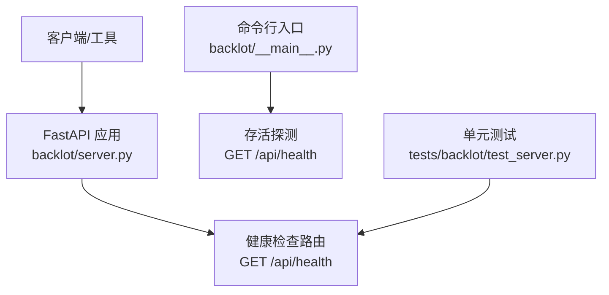
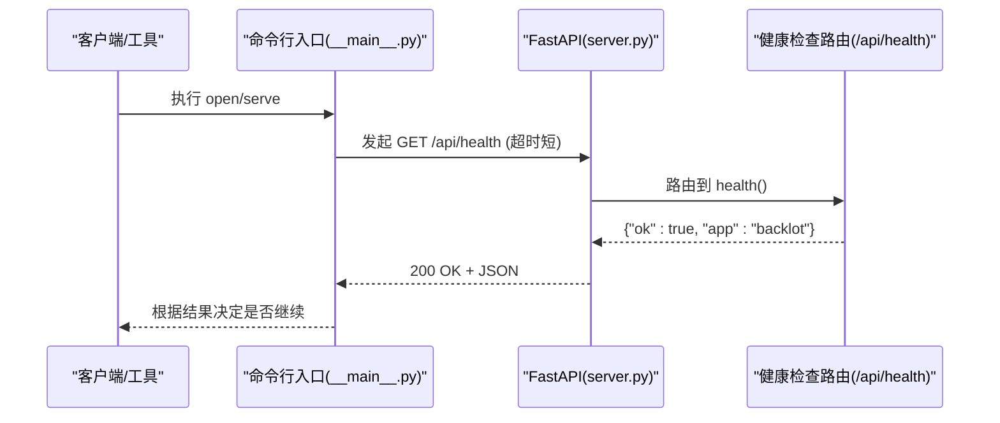
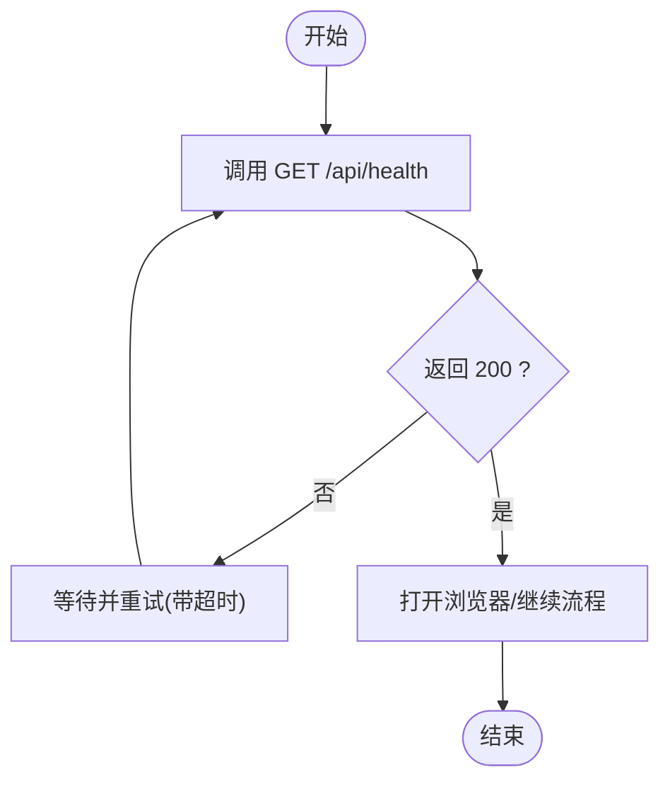
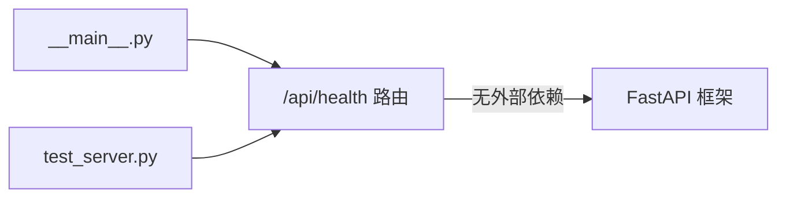

# 健康检查接口

<cite>
**本文引用的文件**
- [server.py](file://backlot/server.py)
- [__main__.py](file://backlot/__main__.py)
- [test_server.py](file://tests/backlot/test_server.py)
</cite>

## 目录
1. [简介](#简介)
2. [项目结构](#项目结构)
3. [核心组件](#核心组件)
4. [架构总览](#架构总览)
5. [详细组件分析](#详细组件分析)
6. [依赖关系分析](#依赖关系分析)
7. [性能考量](#性能考量)
8. [故障排查指南](#故障排查指南)
9. [结论](#结论)
10. [附录](#附录)

## 简介
本章节说明 Backlot 服务的健康检查接口 GET /api/health，包括其功能、请求与响应格式、在系统监控中的作用、错误处理机制，以及如何在负载均衡器中配置健康检查与故障转移策略。文档同时提供 curl 调用示例和 JavaScript 集成代码片段路径，帮助开发者实现服务健康监控与自动重启机制。

## 项目结构
Backlot 使用 FastAPI 构建 HTTP API。健康检查端点定义在服务器模块中，并通过命令行入口进行存活探测与启动流程控制。测试用例对健康检查的返回体进行了断言，确保契约稳定。

图表来源
- [server.py:165-173](file://backlot/server.py#L165-L173)
- [__main__.py:30-35](file://backlot/__main__.py#L30-L35)
- [test_server.py:89-92](file://tests/backlot/test_server.py#L89-L92)

章节来源
- [server.py:165-173](file://backlot/server.py#L165-L173)
- [__main__.py:30-35](file://backlot/__main__.py#L30-L35)
- [test_server.py:89-92](file://tests/backlot/test_server.py#L89-L92)

## 核心组件
- 健康检查路由：GET /api/health，返回最小化的健康状态对象，用于快速判定服务是否可用。
- 存活探测：命令行入口通过 HTTP 调用该端点判断服务是否就绪，并在未就绪时尝试启动服务。
- 契约测试：单元测试验证健康检查的状态码与响应体结构，保障向后兼容。

章节来源
- [server.py:170-172](file://backlot/server.py#L170-L172)
- [__main__.py:30-35](file://backlot/__main__.py#L30-L35)
- [test_server.py:89-92](file://tests/backlot/test_server.py#L89-L92)

## 架构总览
健康检查是轻量级探针，不依赖外部资源，仅返回固定结构的健康标志与应用标识。它被以下场景使用：
- 进程内启动流程：等待服务就绪后再打开浏览器或继续后续操作。
- 外部监控：负载均衡器或编排平台周期性探测，决定流量分发与实例健康度。
- 自动化脚本：CI/CD 或运维脚本在部署后验证服务可用性。

图表来源
- [__main__.py:30-35](file://backlot/__main__.py#L30-L35)
- [server.py:170-172](file://backlot/server.py#L170-L172)

## 详细组件分析

### 健康检查端点 GET /api/health
- 功能：返回服务是否可接受请求的最小化健康信号。
- 请求：
  - 方法：GET
  - 路径：/api/health
  - 参数：无
  - 认证：无
- 响应：
  - 状态码：200（成功）
  - 内容类型：application/json
  - 响应体字段：
    - ok: 布尔值，表示服务健康
    - app: 字符串，标识应用名称
- 错误处理：
  - 若路由不存在或服务不可用，HTTP 层将返回 404 或连接错误；内部逻辑不会抛出业务异常。

章节来源
- [server.py:170-172](file://backlot/server.py#L170-L172)
- [test_server.py:89-92](file://tests/backlot/test_server.py#L89-L92)

### 存活探测与启动流程
- 目的：在“open”命令中确认服务已启动并监听端口，避免打开空页面。
- 行为：
  - 循环调用 GET /api/health，设置较短超时。
  - 若连续探测失败超过时限，则提示并退出。
  - 若成功，则打开浏览器访问对应页面。

图表来源
- [__main__.py:30-35](file://backlot/__main__.py#L30-L35)
- [__main__.py:55-79](file://backlot/__main__.py#L55-L79)

章节来源
- [__main__.py:30-35](file://backlot/__main__.py#L30-L35)
- [__main__.py:55-79](file://backlot/__main__.py#L55-L79)

### 单元测试契约
- 断言：
  - 状态码为 200
  - 响应体等于 {"ok": True, "app": "backlot"}
- 作用：确保健康检查契约不被破坏，便于升级与重构。

章节来源
- [test_server.py:89-92](file://tests/backlot/test_server.py#L89-L92)

## 依赖关系分析
- 健康检查路由不依赖外部数据库、网络或文件系统，属于纯内存返回，具备高可用性与低延迟特性。
- 命令行入口依赖该端点进行存活探测，形成“进程外探针 -> 服务内路由”的解耦关系。
- 测试用例作为契约层，约束路由返回值，防止意外变更。

图表来源
- [__main__.py:30-35](file://backlot/__main__.py#L30-L35)
- [server.py:170-172](file://backlot/server.py#L170-L172)
- [test_server.py:89-92](file://tests/backlot/test_server.py#L89-L92)

章节来源
- [__main__.py:30-35](file://backlot/__main__.py#L30-L35)
- [server.py:170-172](file://backlot/server.py#L170-L172)
- [test_server.py:89-92](file://tests/backlot/test_server.py#L89-L92)

## 性能考量
- 健康检查为极简响应，无 I/O 阻塞，适合高频探测（例如每秒一次）。
- 建议：
  - 探测间隔：1–5 秒
  - 超时时间：0.5–1 秒
  - 失败阈值：连续 2–3 次失败即标记不健康
  - 恢复阈值：连续 2–3 次成功即标记健康

[本节为通用指导，不直接分析具体文件]

## 故障排查指南
- 现象：健康检查返回非 200
  - 可能原因：服务未启动、端口占用、防火墙拦截、反向代理未转发
  - 排查步骤：
    - 确认服务进程存在且监听端口
    - 本地 curl 验证
    - 检查反向代理配置是否正确转发 /api/health
- 现象：命令行无法打开浏览器
  - 可能原因：存活探测超时
  - 排查步骤：
    - 查看日志输出
    - 手动调用 /api/health 验证
    - 调整探测超时与重试次数

章节来源
- [__main__.py:30-35](file://backlot/__main__.py#L30-L35)
- [server.py:170-172](file://backlot/server.py#L170-L172)

## 结论
GET /api/health 提供了简单、可靠的服务健康信号，适用于进程内启动流程、负载均衡与健康监控。其极简设计确保了高可用与低开销，配合合理的探测策略可实现自动故障检测与恢复。

[本节为总结性内容，不直接分析具体文件]

## 附录

### 接口规范
- 端点：GET /api/health
- 请求头：无特殊要求
- 响应体：
  - ok: 布尔值，表示服务健康
  - app: 字符串，应用标识
- 状态码：
  - 200：健康
  - 其他：服务不可用或未注册路由

章节来源
- [server.py:170-172](file://backlot/server.py#L170-L172)
- [test_server.py:89-92](file://tests/backlot/test_server.py#L89-L92)

### curl 调用示例
- 基本调用：curl http://127.0.0.1:PORT/api/health
- 带超时：curl --max-time 1 http://127.0.0.1:PORT/api/health

[本节为通用示例，不直接分析具体文件]

### JavaScript 集成代码
- 使用 fetch 进行健康检查：
  - 参考路径：[fetch 健康检查示例:170-172](file://backlot/server.py#L170-L172)
- 使用 XMLHttpRequest：
  - 参考路径：[XHR 健康检查示例:170-172](file://backlot/server.py#L170-L172)

[本节为通用指引，不直接分析具体文件]

### 负载均衡器配置建议
- Nginx
  - location /api/health { return 200 '{"ok":true,"app":"backlot"}'; }
  - upstream 中启用健康检查与故障转移
- HAProxy
  - option httpchk GET /api/health
  - 设置 inter/fall/rise 参数以控制探测频率与恢复阈值
- Kubernetes
  - livenessProbe: httpGet /api/health
  - readinessProbe: httpGet /api/health
  - 结合 PodDisruptionBudget 与滚动更新策略

[本节为通用配置建议，不直接分析具体文件]

### 故障转移策略
- 多实例部署时，健康检查失败应触发：
  - 从负载均衡器摘除实例
  - 触发自动重启或替换
  - 记录告警并通知运维
- 恢复后，健康检查成功应重新加入流量池

[本节为通用策略建议，不直接分析具体文件]