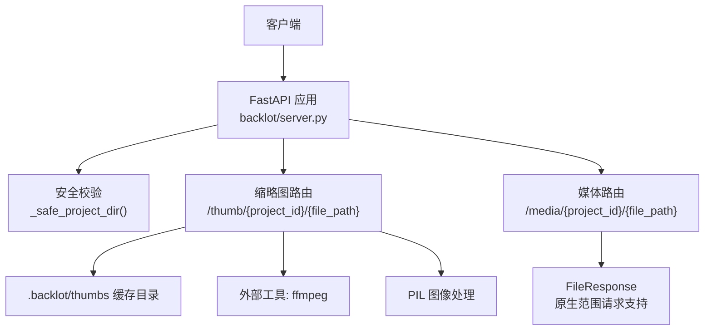
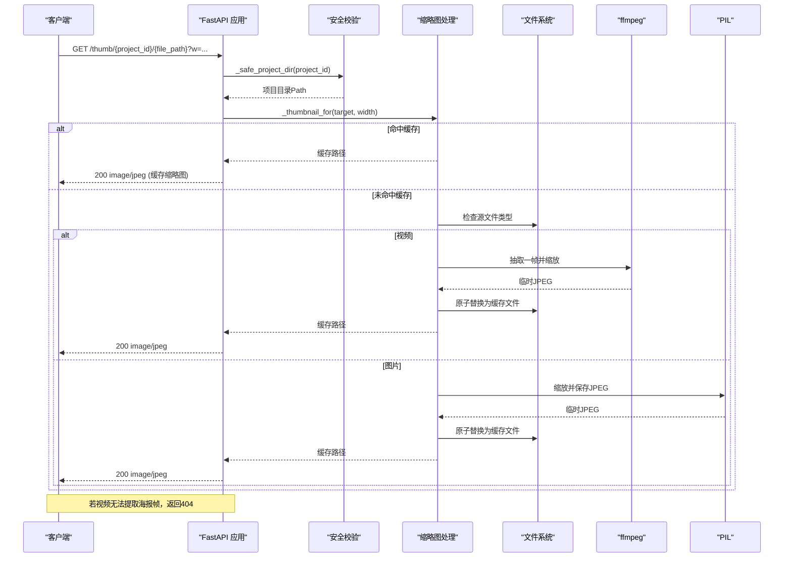
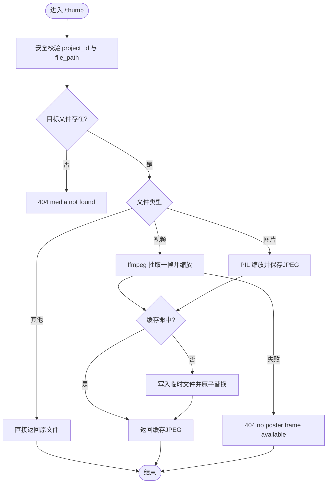
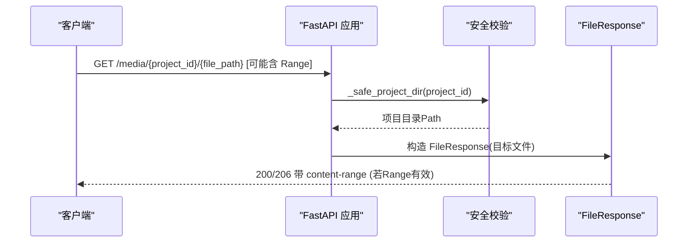
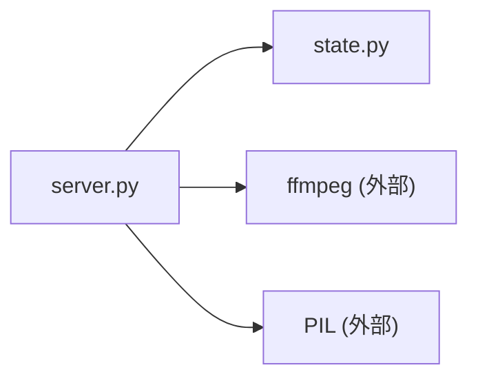

# 媒体文件访问

<cite>
**本文引用的文件**
- [server.py](file://backlot/server.py)
- [state.py](file://backlot/state.py)
- [__init__.py](file://backlot/__init__.py)
- [README.md](file://backlot/README.md)
- [test_server.py](file://tests/backlot/test_server.py)
</cite>

## 目录
1. [简介](#简介)
2. [项目结构](#项目结构)
3. [核心组件](#核心组件)
4. [架构总览](#架构总览)
5. [详细组件分析](#详细组件分析)
6. [依赖关系分析](#依赖关系分析)
7. [性能考量](#性能考量)
8. [故障排查指南](#故障排查指南)
9. [结论](#结论)
10. [附录：API调用示例与最佳实践](#附录api调用示例与最佳实践)

## 简介
本文件面向Backlot的媒体文件访问能力，重点说明以下两个接口：
- 缩略图生成接口：GET /thumb/{project_id}/{file_path}
- 媒体文件访问接口：GET /media/{project_id}/{file_path}

文档涵盖功能特性、缩略图缓存机制（FFmpeg视频帧提取、图片缩放算法、缓存策略）、范围请求（Range Requests）支持、HTTP缓存头设置、安全验证机制（路径遍历防护与项目目录隔离）、不同尺寸缩略图的生成参数与性能优化建议、常见媒体格式兼容性与错误处理方案，以及完整的API调用示例和集成最佳实践。

## 项目结构
Backlot是一个基于FastAPI的本地服务，提供只读的项目看板与媒体访问能力。媒体相关逻辑集中在后端服务中，通过文件系统读取项目产物并对外暴露REST端点。

图表来源
- [server.py:165-307](file://backlot/server.py#L165-L307)
- [server.py:242-276](file://backlot/server.py#L242-L276)
- [server.py:310-365](file://backlot/server.py#L310-L365)

章节来源
- [server.py:1-369](file://backlot/server.py#L1-L369)
- [__init__.py:1-17](file://backlot/__init__.py#L1-L17)
- [README.md:1-43](file://backlot/README.md#L1-L43)

## 核心组件
- 安全校验与项目隔离：_safe_project_dir(project_id) 对 project_id 进行严格校验，拒绝包含“/”、“\”、“:”以及“.”、“..”等非法字符或相对路径，确保只能访问 PROJECTS_DIR 下的子目录。
- 缩略图路由：/thumb/{project_id}/{file_path}，根据 w 查询参数选择最接近的预设宽度，生成或返回缓存的JPEG缩略图；对于无法生成海报帧的视频，返回404而非原始视频字节。
- 媒体路由：/media/{project_id}/{file_path}，直接通过 FastAPI 的 FileResponse 提供文件下载/流式播放，原生支持 Range Requests。
- 缩略图缓存：_thumbnail_for(source, width) 使用源文件的元信息（mtime_ns、size）与目标宽度计算哈希键，将结果持久化到 .backlot/thumbs 目录；并发写采用临时文件+原子替换避免竞态。
- 图片缩放：非视频使用 PIL 的 thumbnail 方法按比例缩放并保存为 JPEG（质量82）。
- 视频帧提取：视频使用 ffmpeg 在固定时间点抽取一帧并按指定宽度缩放，超时限制为30秒。

章节来源
- [server.py:242-276](file://backlot/server.py#L242-L276)
- [server.py:310-365](file://backlot/server.py#L310-L365)

## 架构总览
下图展示了从客户端请求到最终响应的主要流程，包括安全校验、缩略图生成与缓存、以及媒体文件的范围请求处理。

图表来源
- [server.py:242-276](file://backlot/server.py#L242-L276)
- [server.py:325-365](file://backlot/server.py#L325-L365)

## 详细组件分析

### 缩略图生成接口：GET /thumb/{project_id}/{file_path}
- 功能特性
  - 接受可选查询参数 w（默认640），自动映射到最近的预设宽度集合 {320, 640, 960}。
  - 对视频文件尝试抽取海报帧（固定时间偏移），失败时返回404，不退回原始视频字节。
  - 对图片文件进行缩放并输出JPEG。
  - 对不可缩放的资源（如文本文件）直接透传原内容。
- 缓存机制
  - 缓存键由源文件路径、修改时间纳秒级精度、文件大小和目标宽度共同决定。
  - 缓存目录位于仓库根下的 .backlot/thumbs。
  - 并发安全：每个请求生成唯一临时文件名，完成后原子替换为目标缓存文件。
- 性能与兼容性
  - 视频帧提取使用 ffmpeg，超时30秒，日志级别error。
  - 图片缩放使用PIL，quality=82，兼顾体积与质量。
  - 支持的输入格式：
    - 视频：mp4、webm、mov
    - 图片：png、jpg、jpeg、webp、gif
- 错误处理
  - 路径越界：403 path escapes project
  - 文件不存在：404 media not found
  - 视频无法提取海报帧：404 no poster frame available
  - 其他异常：静默降级，返回None后按规则处理

图表来源
- [server.py:242-276](file://backlot/server.py#L242-L276)
- [server.py:325-365](file://backlot/server.py#L325-L365)

章节来源
- [server.py:242-276](file://backlot/server.py#L242-L276)
- [server.py:325-365](file://backlot/server.py#L325-L365)
- [test_server.py:140-153](file://tests/backlot/test_server.py#L140-L153)
- [test_server.py:198-206](file://tests/backlot/test_server.py#L198-L206)

### 媒体文件访问接口：GET /media/{project_id}/{file_path}
- 功能特性
  - 直接提供项目内任意文件的访问，适合播放器拉流或下载。
  - 利用 FastAPI 的 FileResponse 原生支持 HTTP Range Requests，返回206 Partial Content。
- 安全校验
  - 与缩略图相同的安全校验，防止路径穿越与越权访问。
- 缓存行为
  - 媒体响应遵循标准HTTP缓存语义（由底层框架与代理层控制），服务端不强制no-cache。
- 错误处理
  - 路径越界：403 path escapes project
  - 文件不存在：404 media not found

图表来源
- [server.py:264-276](file://backlot/server.py#L264-L276)
- [server.py:310-318](file://backlot/server.py#L310-L318)

章节来源
- [server.py:264-276](file://backlot/server.py#L264-L276)
- [server.py:310-318](file://backlot/server.py#L310-L318)
- [test_server.py:129-139](file://tests/backlot/test_server.py#L129-L139)

### 安全验证机制
- 项目目录隔离
  - 仅允许访问 PROJECTS_DIR 下的子目录，任何试图跳出该根目录的路径均被拒绝。
- 路径穿越防护
  - 拒绝包含“/”、“\”、“:”以及“.”、“..”的 project_id。
  - 对 file_path 进行 resolve 后再校验 relative_to 是否仍在项目目录下。
- 最小权限原则
  - 服务只读访问项目目录，不写入项目数据（除缩略图缓存外）。

章节来源
- [server.py:242-276](file://backlot/server.py#L242-L276)
- [server.py:310-318](file://backlot/server.py#L310-L318)
- [test_server.py:124-128](file://tests/backlot/test_server.py#L124-L128)

### 范围请求（Range Requests）与HTTP缓存头
- 范围请求
  - /media 接口通过 FileResponse 原生支持 Range 请求，返回206及content-range头。
- HTTP缓存头
  - UI与SSE流明确设置no-cache以确保实时性。
  - 媒体与缩略图响应保持标准HTTP缓存行为，便于CDN/浏览器缓存。

章节来源
- [server.py:209-240](file://backlot/server.py#L209-L240)
- [server.py:299-305](file://backlot/server.py#L299-L305)
- [test_server.py:129-139](file://tests/backlot/test_server.py#L129-L139)

### 缩略图缓存机制详解
- 缓存键生成
  - 使用源文件路径、mtime_ns、st_size与目标宽度组合，经SHA1取前20位作为键。
- 存储位置
  - 统一存放于 .backlot/thumbs，按key.jpg命名。
- 并发安全
  - 每次生成使用唯一临时文件名，完成后原子replace，避免多请求竞争。
- 失效策略
  - 当源文件mtime或size变化时，键变化导致旧缓存失效。
- 降级策略
  - 若视频无法提取海报帧，返回404；非媒体文件则透传原内容。

章节来源
- [server.py:325-365](file://backlot/server.py#L325-L365)

### 不同尺寸缩略图的生成参数与性能优化建议
- 尺寸参数
  - 通过查询参数 w 指定期望宽度，内部映射到 {320, 640, 960} 中最接近的值。
- 性能建议
  - 优先使用缓存命中，减少重复生成。
  - 合理选择 w，避免过大尺寸导致不必要的CPU与IO开销。
  - 批量预览场景建议使用较小w（如320）以降低带宽与解码压力。
  - 在高并发下，确保磁盘空间充足以容纳缓存文件。

章节来源
- [server.py:242-276](file://backlot/server.py#L242-L276)
- [server.py:325-365](file://backlot/server.py#L325-L365)

### 常见媒体格式兼容性与错误处理
- 视频格式
  - 支持 mp4、webm、mov 的海报帧提取；不支持或损坏时返回404。
- 图片格式
  - 支持 png、jpg、jpeg、webp、gif 的缩放与JPEG输出。
- 其他文件
  - 非媒体文件直接透传，适用于静态资源或文本附件。
- 错误码
  - 400 invalid project id
  - 403 path escapes project
  - 404 media not found / no poster frame available

章节来源
- [server.py:242-276](file://backlot/server.py#L242-L276)
- [server.py:310-318](file://backlot/server.py#L310-L318)
- [server.py:325-365](file://backlot/server.py#L325-L365)

## 依赖关系分析
- 外部依赖
  - ffmpeg：用于视频帧抽取与缩放。
  - PIL：用于图片缩放与JPEG编码。
- 内部模块
  - state.py：定义项目目录、媒体扩展名常量等，供服务与状态解析使用。
  - server.py：实现路由、安全校验、缓存与响应逻辑。

图表来源
- [server.py:1-369](file://backlot/server.py#L1-L369)
- [state.py:1-716](file://backlot/state.py#L1-L716)

章节来源
- [server.py:1-369](file://backlot/server.py#L1-L369)
- [state.py:1-716](file://backlot/state.py#L1-L716)

## 性能考量
- 冷启动与缓存预热
  - 首次访问会触发缩略图生成，后续命中缓存显著降低延迟。
- I/O与CPU
  - 视频帧提取涉及外部进程调用，注意超时与错误处理。
  - 图片缩放为内存操作，注意大图的内存占用。
- 并发与磁盘
  - 并发缩略图生成通过临时文件+原子替换避免冲突，需保证缓存目录可写且磁盘空间充足。
- 网络与缓存
  - 媒体响应遵循HTTP缓存协议，可结合CDN提升命中率。
  - UI与SSE流禁用缓存以保证实时性。

[本节为通用指导，不直接分析具体文件]

## 故障排查指南
- 常见问题
  - 403 path escapes project：检查 project_id 与 file_path 是否包含非法字符或试图访问项目目录之外。
  - 404 media not found：确认文件是否存在于项目目录中。
  - 404 no poster frame available：视频损坏或不支持，检查文件格式与完整性。
  - 400 invalid project id：project_id 包含“/”、“\”、“:”或“.”、“..”。
- 调试建议
  - 查看 .backlot/thumbs 目录是否存在与大小是否正常。
  - 检查系统是否安装 ffmpeg 并可执行。
  - 观察日志中的ffmpeg错误输出，定位解码问题。

章节来源
- [server.py:242-276](file://backlot/server.py#L242-L276)
- [server.py:310-318](file://backlot/server.py#L310-L318)
- [server.py:325-365](file://backlot/server.py#L325-L365)

## 结论
Backlot的媒体访问接口提供了安全、高效且可扩展的缩略图生成与媒体流式访问能力。通过严格的安全校验、健壮的缓存机制以及对Range请求的原生支持，能够满足生产环境中的高并发与低延迟需求。建议在集成时合理配置w参数、利用缓存命中、并结合CDN与HTTP缓存策略进一步优化体验。

[本节为总结，不直接分析具体文件]

## 附录：API调用示例与最佳实践

- 基础调用
  - 获取缩略图：GET /thumb/{project_id}/{file_path}?w=640
  - 访问媒体：GET /media/{project_id}/{file_path}
- 范围请求
  - 在媒体请求中附加 Range: bytes=0-999，预期返回206与content-range头。
- 错误处理
  - 捕获403/404/400并提示用户或重试。
- 最佳实践
  - 使用合理的w值平衡清晰度与带宽。
  - 前端对缩略图加载失败做降级显示。
  - 对媒体播放启用Range请求以提升首屏速度。
  - 部署时确保 .backlot/thumbs 目录可写并有足够空间。

章节来源
- [server.py:242-276](file://backlot/server.py#L242-L276)
- [server.py:264-276](file://backlot/server.py#L264-L276)
- [test_server.py:129-139](file://tests/backlot/test_server.py#L129-L139)
- [test_server.py:140-153](file://tests/backlot/test_server.py#L140-L153)
- [test_server.py:198-206](file://tests/backlot/test_server.py#L198-L206)