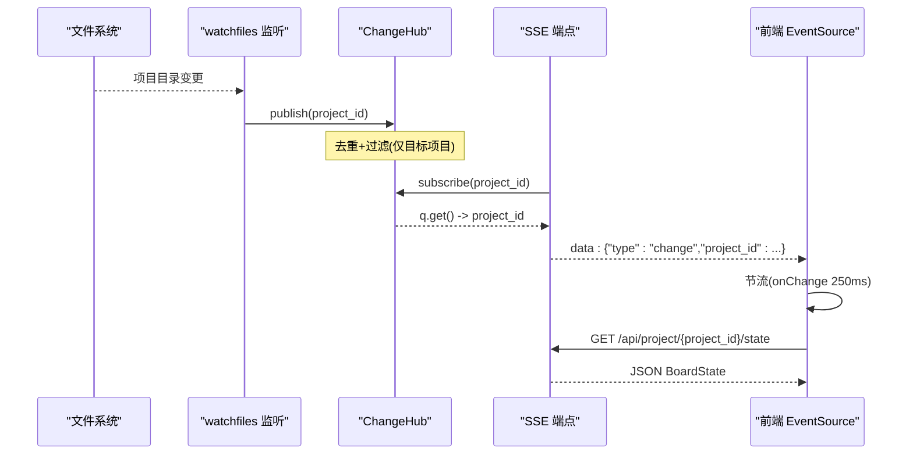
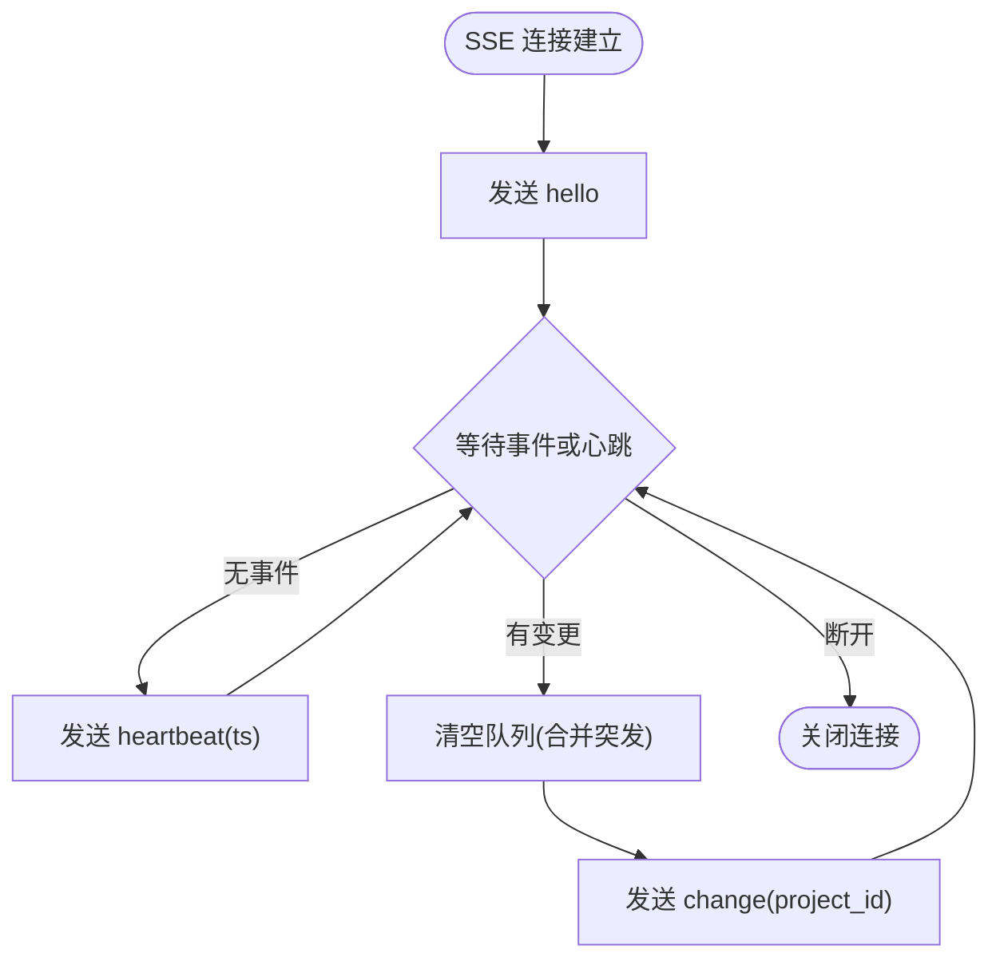
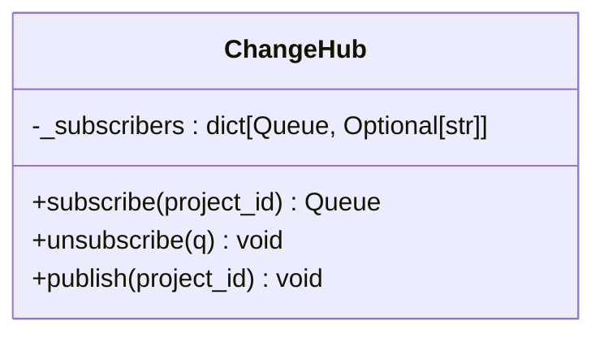
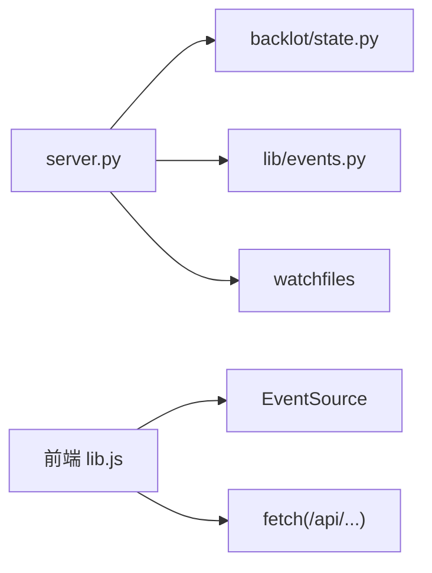

# 实时事件流

<cite>
**本文引用的文件**
- [server.py](file://backlot/server.py)
- [state.py](file://backlot/state.py)
- [events.py](file://lib/events.py)
- [board.js](file://backlot/ui/board.js)
- [library.js](file://backlot/ui/library.js)
- [lib.js](file://backlot/ui/lib.js)
</cite>

## 目录
1. [简介](#简介)
2. [项目结构](#项目结构)
3. [核心组件](#核心组件)
4. [架构总览](#架构总览)
5. [详细组件分析](#详细组件分析)
6. [依赖关系分析](#依赖关系分析)
7. [性能考量](#性能考量)
8. [故障排查指南](#故障排查指南)
9. [结论](#结论)
10. [附录：客户端实现示例](#附录客户端实现示例)

## 简介
本技术文档围绕 Backlot 的实时事件流能力，系统性说明基于 SSE（Server-Sent Events）的项目级与库级事件推送机制。重点包括：
- SSE 连接建立、事件类型 hello/heartbeat/change 的数据结构与触发时机
- 心跳机制与超时处理策略
- 事件过滤与订阅模型（按项目维度广播）
- 并发连接下的队列合并与背压控制
- 客户端连接管理、重连与错误恢复
- WebSocket 替代方案的兼容性考虑
- JavaScript 与 Python 客户端参考实现要点

## 项目结构
Backlot 的事件流由后端 FastAPI 服务提供 SSE 端点，配合文件系统监听器将项目变更推送到订阅者；前端通过 EventSource 订阅并刷新 UI。

```mermaid
graph TB
Client["浏览器/客户端"] --> |GET /api/project/{project_id}/events| Server["FastAPI 服务"]
Client --> |GET /api/library/events| Server
Server --> Hub["ChangeHub 广播中心"]
Watcher["watchfiles 监听器"] --> Hub
Hub --> |按项目过滤| Server
Server --> |SSE text/event-stream| Client
State["状态聚合(state.py)"] --> Server
Events["事件日志(events.jsonl)"] --> State
```

图表来源
- [server.py:165-240](file://backlot/server.py#L165-L240)
- [server.py:132-149](file://backlot/server.py#L132-L149)
- [state.py:588-658](file://backlot/state.py#L588-L658)
- [events.py:77-118](file://lib/events.py#L77-L118)

章节来源
- [server.py:165-240](file://backlot/server.py#L165-L240)
- [state.py:588-658](file://backlot/state.py#L588-L658)
- [events.py:77-118](file://lib/events.py#L77-L118)

## 核心组件
- ChangeHub：内存中的发布/订阅中心，维护每个订阅者的 asyncio.Queue，支持按 project_id 过滤广播。
- SSE 端点：
  - 项目级：GET /api/project/{project_id}/events
  - 库级：GET /api/library/events
- 文件系统监听：后台任务使用 watchfiles 监控 projects 目录，去重后向 ChangeHub 发布变更。
- 状态聚合：读取 checkpoint/artifacts/events 等构建 BoardState，供列表页和详情页展示。
- 事件日志：append-only 的 events.jsonl，被状态聚合用于“生成中”等实时态推断。

章节来源
- [server.py:43-74](file://backlot/server.py#L43-L74)
- [server.py:132-149](file://backlot/server.py#L132-L149)
- [server.py:183-240](file://backlot/server.py#L183-L240)
- [state.py:588-658](file://backlot/state.py#L588-L658)
- [events.py:77-118](file://lib/events.py#L77-L118)

## 架构总览
SSE 是单向长连接，适合服务端主动推送变更。Backlot 采用“文件系统驱动 + 内存广播”的模式：
- 写入侧：工具执行产生 events.jsonl；watchfiles 感知磁盘变化，归并为项目级变更事件。
- 分发侧：ChangeHub 为每个订阅者分配独立队列，避免无关项目风暴影响特定订阅者。
- 消费侧：前端通过 EventSource 订阅，收到 change 事件后拉取最新状态并刷新 UI。



图表来源
- [server.py:132-149](file://backlot/server.py#L132-L149)
- [server.py:183-212](file://backlot/server.py#L183-L212)
- [lib.js:66-81](file://backlot/ui/lib.js#L66-L81)

## 详细组件分析

### SSE 端点与事件协议
- 项目级事件流：GET /api/project/{project_id}/events
  - 首次发送 hello，携带 project_id
  - 空闲时周期性发送 heartbeat，携带 ts
  - 有变更时发送 change，携带 project_id
- 库级事件流：GET /api/library/events
  - 首次发送 hello
  - 空闲时周期性发送 heartbeat，携带 ts
  - 任意项目变更时发送 change，携带 project_id



图表来源
- [server.py:183-212](file://backlot/server.py#L183-L212)
- [server.py:214-240](file://backlot/server.py#L214-L240)

章节来源
- [server.py:183-240](file://backlot/server.py#L183-L240)

### ChangeHub 广播与过滤
- 订阅：subscribe(project_id=None) 返回固定容量队列（maxsize=64），用于承载该订阅者关心的变更。
- 发布：publish(project_id) 遍历所有订阅者，若订阅者指定了 project_id 且与当前不一致则跳过；否则尝试入队，满队直接丢弃（已保证至少一次唤醒）。
- 取消：unsubscribe(q) 在 finally 块中确保资源释放。



图表来源
- [server.py:43-74](file://backlot/server.py#L43-L74)

章节来源
- [server.py:43-74](file://backlot/server.py#L43-L74)

### 文件系统监听与去重
- 后台任务 _watch_projects：使用 awatch 递归监听 PROJECTS_DIR，对每次变更批次进行项目级去重，再调用 hub.publish(pid)。
- 忽略噪声路径：node_modules/.git/__pycache__/.cache 等。
- 摘要缓存：_summary_cache 针对 library 卡片做 per-project 缓存，变更时失效。

章节来源
- [server.py:111-149](file://backlot/server.py#L111-L149)
- [server.py:76-108](file://backlot/server.py#L76-L108)

### 状态聚合与“生成中”推断
- load_board_state：读取 checkpoint、artifacts、events，构建 stages、storyboard、media、cost、live 等字段。
- “生成中”推断：根据 events.jsonl 中 start/finish/error 事件，结合 depth 过滤，判断场景是否正在生成。
- 停滞检测：若 in_progress 阶段长时间无活动（超过 STALL_WINDOW_SECONDS），标记 stalled 与 stalled_minutes。

章节来源
- [state.py:588-658](file://backlot/state.py#L588-L658)
- [state.py:403-495](file://backlot/state.py#L403-L495)

### 事件日志读写
- emit_event：追加一行 JSON 到 events.jsonl，带 UTC 时间戳；线程锁保护单进程内顺序写；跨进程不保证原子性但容忍损坏行。
- read_events：逐行读取，忽略解析失败行，可选 limit 取最近 N 条。

章节来源
- [events.py:77-118](file://lib/events.py#L77-L118)

### 前端 SSE 订阅与刷新
- lib.js.subscribe：创建 EventSource，onmessage 解析 JSON，仅当 type=change 时触发 onChange，并通过 250ms 定时器合并突发。
- board.js：项目看板页面，收到 change 后重新拉取 state 并渲染。
- library.js：库页面，收到 change 后重新拉取 /api/projects 列表。

章节来源
- [lib.js:66-81](file://backlot/ui/lib.js#L66-L81)
- [board.js:1-120](file://backlot/ui/board.js#L1-L120)
- [library.js:76-92](file://backlot/ui/library.js#L76-L92)

## 依赖关系分析
- server.py 依赖：
  - backlot.state：加载项目状态与摘要
  - lib.events：读取事件日志
  - watchfiles：文件系统监听（可选，缺失时降级）
- 前端依赖：
  - EventSource（原生 SSE 客户端）
  - fetch 获取 JSON 状态



图表来源
- [server.py:165-240](file://backlot/server.py#L165-L240)
- [lib.js:66-81](file://backlot/ui/lib.js#L66-L81)

章节来源
- [server.py:165-240](file://backlot/server.py#L165-L240)
- [lib.js:66-81](file://backlot/ui/lib.js#L66-L81)

## 性能考量
- 队列合并：SSE 端点在收到变更后 drain 队列，避免重复刷新导致的状态抖动与网络浪费。
- 背压控制：队列 maxsize=64，满时丢弃多余项，但已保证至少一次唤醒，兼顾吞吐与稳定性。
- 心跳间隔：默认 15 秒，可调节以平衡连接保活与带宽开销。
- 摘要缓存：library 卡片汇总结果缓存，变更时失效，降低频繁全量扫描成本。
- 媒体缩略图：按需生成并缓存 JPEG，减少大文件传输。

章节来源
- [server.py:54-71](file://backlot/server.py#L54-L71)
- [server.py:183-212](file://backlot/server.py#L183-L212)
- [server.py:242-262](file://backlot/server.py#L242-L262)

## 故障排查指南
- 连接未收到事件
  - 检查项目是否存在且路径安全校验通过（_safe_project_dir）
  - 确认 watchfiles 可用且监听到变更
  - 查看 ChangeHub 订阅是否正确注册与取消
- 心跳丢失或连接假死
  - 调整 SSE_HEARTBEAT_SECONDS
  - 检查代理/CDN 是否缓冲 SSE（需设置 Cache-Control: no-cache 与 X-Accel-Buffering: no）
- 前端未刷新
  - 确认 onmessage 仅处理 type=change，其他事件应忽略
  - 检查 onChange 的节流逻辑是否过长
- 状态异常
  - 检查 events.jsonl 是否可读、是否有损坏行
  - 检查 checkpoint/artifacts 是否完整

章节来源
- [server.py:183-240](file://backlot/server.py#L183-L240)
- [events.py:98-118](file://lib/events.py#L98-L118)
- [lib.js:66-81](file://backlot/ui/lib.js#L66-L81)

## 结论
Backlot 的实时事件流以轻量、可靠为核心目标：通过文件系统驱动变更、内存广播分发、SSE 推送至前端，实现了低耦合、高扩展的项目级与库级实时更新。其设计在并发、背压、心跳与错误恢复方面均有稳健实现，适合生产环境使用。

## 附录：客户端实现示例

### JavaScript 客户端（基于 EventSource）
- 连接建立：new EventSource(url)，url 为 /api/project/{project_id}/events 或 /api/library/events
- 消息处理：onmessage 解析 JSON，仅处理 type=change，使用 setTimeout 合并突发（约 250ms）
- 重连：EventSource 自动重连；可在 onerror 中记录日志
- 刷新策略：收到 change 后调用 getJSON 拉取最新状态并更新 UI

参考路径
- [lib.js:66-81](file://backlot/ui/lib.js#L66-L81)
- [library.js:76-92](file://backlot/ui/library.js#L76-L92)

### Python 客户端（基于 requests）
- 连接建立：requests.get(url, stream=True)，设置 headers 禁用缓存
- 消息处理：逐行读取 data: ...，解析 JSON，仅处理 type=change
- 心跳处理：遇到 heartbeat 保持连接活跃
- 重连：捕获异常后指数退避重试，直到成功接收 hello 或达到最大重试次数

参考路径
- [server.py:183-240](file://backlot/server.py#L183-L240)

### WebSocket 替代方案（兼容性考虑）
- 动机：双向通信、更细粒度控制
- 兼容策略：
  - 保留现有 SSE 接口不变，新增 /ws 路由
  - 客户端优先尝试 SSE，失败回退到 WebSocket
  - 事件语义保持一致（hello/heartbeat/change），便于统一处理
- 注意：
  - 鉴权与会话绑定（如 project_id）
  - 断线重连与消息去重
  - 反向代理配置（WebSocket Upgrade）

（本节为概念性建议，不直接映射具体源码）