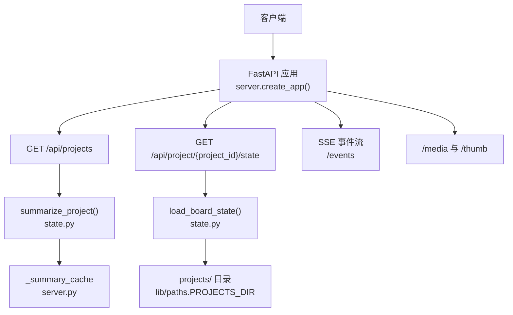
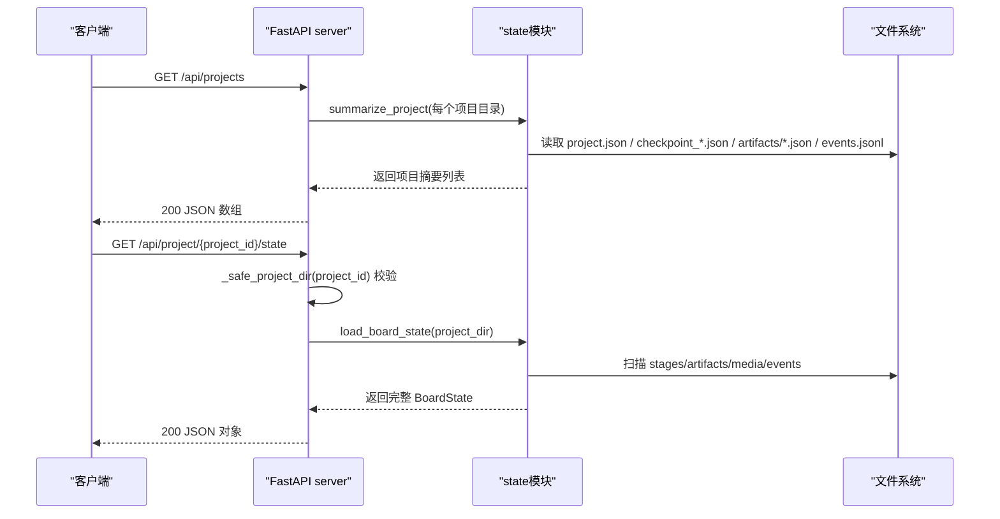
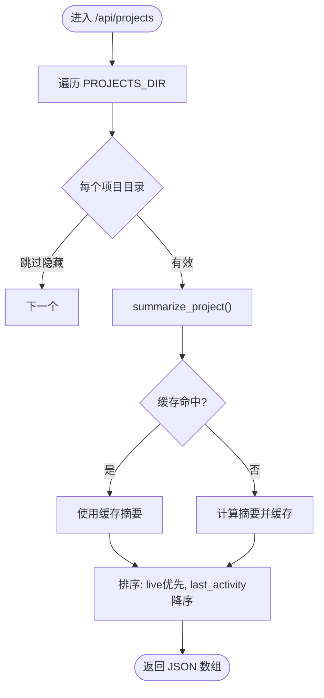
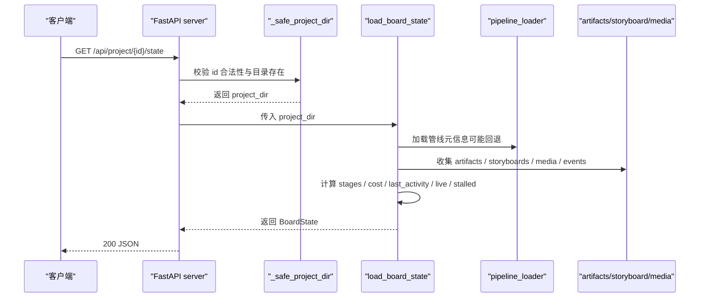
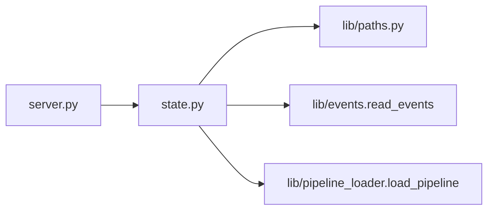

# 项目管理接口

<cite>
**本文引用的文件**
- [server.py](file://backlot/server.py)
- [state.py](file://backlot/state.py)
- [paths.py](file://lib/paths.py)
- [test_server.py](file://tests/backlot/test_server.py)
- [test_state.py](file://tests/backlot/test_state.py)
</cite>

## 目录
1. [简介](#简介)
2. [项目结构](#项目结构)
3. [核心组件](#核心组件)
4. [架构总览](#架构总览)
5. [详细组件分析](#详细组件分析)
6. [依赖关系分析](#依赖关系分析)
7. [性能考量](#性能考量)
8. [故障排查指南](#故障排查指南)
9. [结论](#结论)
10. [附录](#附录)

## 简介
本文件面向Backlot的项目管理API，聚焦两个核心端点：
- GET /api/projects：返回项目摘要列表（用于“库”视图）
- GET /api/project/{project_id}/state：返回单个项目的完整状态（用于看板详情）

文档涵盖请求参数、响应数据结构与字段含义、业务逻辑说明（包括pipeline_type、live、last_activity等关键字段的计算方式）、安全验证机制（路径遍历防护）、批量操作最佳实践与性能优化建议。所有实现细节均基于代码仓库中的实际源码与测试用例。

## 项目结构
Backlot以FastAPI提供HTTP服务，核心由两部分组成：
- server.py：路由定义、SSE事件流、缩略图与媒体服务、项目变更监听与缓存失效
- state.py：从磁盘读取并推导BoardState（项目状态），包含阶段轨道、制品、故事板、媒体发现、成本与活动统计等

图表来源
- [server.py:165-307](file://backlot/server.py#L165-L307)
- [state.py:588-683](file://backlot/state.py#L588-L683)
- [paths.py:13-17](file://lib/paths.py#L13-L17)

章节来源
- [server.py:1-369](file://backlot/server.py#L1-L369)
- [state.py:1-716](file://backlot/state.py#L1-L716)
- [paths.py:1-18](file://lib/paths.py#L1-L18)

## 核心组件
- 项目列表端点 /api/projects
  - 功能：返回所有项目的轻量摘要，按“是否活跃”和“最近活动时间”排序
  - 关键逻辑：遍历PROJECTS_DIR下的项目目录，调用summarize_project生成摘要；使用内存缓存_summary_cache减少重复解析
- 项目状态端点 /api/project/{project_id}/state
  - 功能：返回指定项目的完整BoardState，包括阶段轨道、制品、故事板、媒体、事件、成本、最后活动时间与live标志
  - 关键逻辑：校验project_id安全性后，调用load_board_state进行全量解析

章节来源
- [server.py:174-181](file://backlot/server.py#L174-L181)
- [state.py:661-683](file://backlot/state.py#L661-L683)
- [state.py:588-658](file://backlot/state.py#L588-L658)

## 架构总览
下图展示了两个核心端点的调用链路与数据流向：

图表来源
- [server.py:174-181](file://backlot/server.py#L174-L181)
- [state.py:588-683](file://backlot/state.py#L588-L683)

## 详细组件分析

### 端点一：GET /api/projects
- 请求
  - 方法：GET
  - 路径：/api/projects
  - 查询参数：无
  - 认证：无（本地服务）
- 响应
  - 类型：JSON 数组
  - 元素为项目摘要，关键字段如下：
    - project_id：项目目录名
    - title：标题（来自project.json或meta.json，否则派生）
    - pipeline_type：管线类型（优先来自project.json，其次从checkpoint推断；未知时回退为unknown）
    - has_pipeline_state：是否存在checkpoint等管线状态
    - poster：封面图相对路径（优先场景图片，其次快照，再次renders中最新视频帧）
    - live：是否处于活跃窗口（默认5分钟）
    - last_activity：最近一次写入时间戳（checkpoint/artifacts/events）
    - active_stage：当前活跃阶段名称（in_progress或awaiting_human）
    - awaiting_human：是否等待人工审批
    - stage_states：各阶段{name,status}列表（排除未声明阶段）
    - completed_count：已完成阶段数
    - render_count：渲染产物数量
    - scene_count：故事板场景数
- 业务逻辑要点
  - 摘要通过summarize_project生成，内部调用load_board_state但仅提取必要字段
  - 列表排序规则：先按live降序，再按last_activity降序
  - 忽略隐藏目录（以下划线或点开头）
  - 异常降级：若某项目不可读，仍返回占位摘要并标记error="unreadable"

图表来源
- [server.py:85-108](file://backlot/server.py#L85-L108)
- [state.py:661-683](file://backlot/state.py#L661-L683)

章节来源
- [server.py:174-176](file://backlot/server.py#L174-L176)
- [server.py:85-108](file://backlot/server.py#L85-L108)
- [state.py:661-683](file://backlot/state.py#L661-L683)
- [test_server.py:94-103](file://tests/backlot/test_server.py#L94-L103)
- [test_state.py:159-194](file://tests/backlot/test_state.py#L159-L194)

### 端点二：GET /api/project/{project_id}/state
- 请求
  - 方法：GET
  - 路径：/api/project/{project_id}/state
  - 路径参数：
    - project_id：字符串，禁止包含“/ \ :”，且不能为“.”或“..”
  - 认证：无（本地服务）
- 响应
  - 类型：JSON 对象（BoardState）
  - 关键字段：
    - project_id/title/pipeline/style_playbook/created_at/has_marker/has_pipeline_state
    - stages：阶段轨道数组（含name,gated,produces,status,timestamp,review,cost_snapshot,error,human_approved,partial_progress,versions,history_entries,以及可能的gate_skipped/stalled/stalled_minutes）
    - artifacts：制品集合（如scene_plan/script/asset_manifest等）
    - storyboard：故事板（scenes数组，含视觉选择、音频、生成中状态等）
    - media：媒体清单（renders/snapshots/music）
    - events：近期事件（最多250条）
    - cost：成本快照（优先checkpoint的cost_snapshot，否则回退到asset_manifest.total_cost_usd）
    - last_activity/live：活动窗口与活跃标志
    - poster：封面图路径
- 业务逻辑要点
  - 安全校验：_safe_project_dir拒绝非法project_id并检查目录存在性
  - 管线元信息：_load_pipeline_meta加载manifest或回退到FALLBACK_STAGES
  - 阶段轨道：_build_stage_rail根据checkpoint与history构建，支持未声明阶段的插入
  - 制品收集：_collect_artifacts合并artifacts目录与checkpoint内嵌制品，严格限制引用必须在项目目录内（防越权）
  - 故事板：_build_storyboard关联scene_plan、script、asset_manifest，并结合events判断生成中状态
  - 媒体发现：_scan_media扫描renders/snapshots/music等
  - 活跃与停滞：_last_activity统计最近修改时间；若in_progress超过10分钟无活动则标记stalled

图表来源
- [server.py:178-181](file://backlot/server.py#L178-L181)
- [server.py:310-318](file://backlot/server.py#L310-L318)
- [state.py:63-94](file://backlot/state.py#L63-L94)
- [state.py:246-266](file://backlot/state.py#L246-L266)
- [state.py:403-495](file://backlot/state.py#L403-L495)
- [state.py:502-581](file://backlot/state.py#L502-L581)
- [state.py:588-658](file://backlot/state.py#L588-L658)

章节来源
- [server.py:178-181](file://backlot/server.py#L178-L181)
- [server.py:310-318](file://backlot/server.py#L310-L318)
- [state.py:588-658](file://backlot/state.py#L588-L658)
- [test_server.py:112-127](file://tests/backlot/test_server.py#L112-L127)

### 关键字段计算说明
- pipeline_type
  - 优先取自project.json的pipeline_type
  - 若缺失，则从checkpoint中查找非unknown的pipeline_type
  - 若仍无法确定，回退为unknown，并使用FALLBACK_STAGES作为阶段轨道
- live
  - 基于last_activity与当前时间的差值，小于5分钟视为live
- last_activity
  - 取checkpoint_*.json、events.jsonl、artifacts下所有json文件的最近mtime最大值
- 其他
  - active_stage：stages中status为in_progress或awaiting_human的第一个
  - awaiting_human：active_stage是否为awaiting_human
  - stage_states：过滤掉undeclared的阶段，仅保留已声明阶段的状态

章节来源
- [state.py:599-606](file://backlot/state.py#L599-L606)
- [state.py:626-656](file://backlot/state.py#L626-L656)
- [state.py:661-683](file://backlot/state.py#L661-L683)

### 安全验证与路径遍历防护
- project_id校验
  - 禁止字符：/ \ :，以及“.”、“..”
  - 不存在的项目目录返回404
- 媒体与缩略图访问
  - /media/{project_id}/{file_path:path}与/thumb/{project_id}/{file_path:path}在拼接目标路径后，强制要求目标必须位于项目目录之下，否则返回403
  - 缩略图对视频尝试提取海报帧，失败时不直接返回原始视频字节（避免F-03问题）
- 制品引用安全
  - checkpoint中的artifacts路径引用必须落在项目目录内，否则被忽略（防止越权读取外部文件）

章节来源
- [server.py:310-318](file://backlot/server.py#L310-L318)
- [server.py:244-276](file://backlot/server.py#L244-L276)
- [state.py:97-115](file://backlot/state.py#L97-L115)
- [test_server.py:112-127](file://tests/backlot/test_server.py#L112-L127)
- [test_server.py:198-206](file://tests/backlot/test_server.py#L198-L206)
- [test_state.py:199-223](file://tests/backlot/test_state.py#L199-L223)

### 错误处理方案
- 400：非法project_id（包含非法字符或为“.”、“..”）
- 403：媒体/缩略图路径逃逸出项目目录
- 404：项目不存在、媒体/缩略图文件不存在、视频无法提取海报帧
- 降级策略：
  - 项目不可读时，列表项返回error="unreadable"占位摘要
  - 管线未知时使用FALLBACK_STAGES
  - 制品/故事板/媒体解析异常不影响整体可用性

章节来源
- [server.py:178-181](file://backlot/server.py#L178-L181)
- [server.py:244-276](file://backlot/server.py#L244-L276)
- [server.py:85-108](file://backlot/server.py#L85-L108)
- [state.py:41-48](file://backlot/state.py#L41-L48)
- [state.py:686-715](file://backlot/state.py#L686-L715)

## 依赖关系分析
- server.py依赖state.py提供的list_projects、load_board_state、summarize_project
- state.py依赖lib.paths获取PROJECTS_DIR与REPO_ROOT，并读取events（lib.events.read_events）
- 管线元信息通过lib.pipeline_loader.load_pipeline加载，失败时回退到默认阶段

图表来源
- [server.py:21-22](file://backlot/server.py#L21-L22)
- [state.py:16-17](file://backlot/state.py#L16-L17)
- [state.py:63-94](file://backlot/state.py#L63-L94)

章节来源
- [server.py:21-22](file://backlot/server.py#L21-L22)
- [state.py:16-17](file://backlot/state.py#L16-L17)
- [state.py:63-94](file://backlot/state.py#L63-L94)

## 性能考量
- 列表端点缓存
  - _summary_cache按项目ID缓存摘要，变更时通过watchfiles触发失效
  - 冷启动与热启动性能差异显著（测试覆盖预算）
- 事件流与心跳
  - SSE每15秒发送心跳，避免连接空闲超时
  - 变更消息去抖：队列满时丢弃多余通知，保证订阅者只收到必要唤醒
- 媒体缩略图
  - 缩略图按宽度匹配缓存键（文件名含源文件mtime/size/宽度哈希），避免重复生成
  - 视频无法提取海报帧时返回404而非原始视频字节
- 批量操作建议
  - 列表端点适合分页或增量刷新（结合SSE事件）
  - 避免频繁轮询高开销的/state端点；优先使用SSE监听变化后再拉取
  - 批量拉取多个项目时，可并行发起请求，但注意服务端CPU与IO压力

章节来源
- [server.py:43-74](file://backlot/server.py#L43-L74)
- [server.py:132-148](file://backlot/server.py#L132-L148)
- [server.py:183-212](file://backlot/server.py#L183-L212)
- [server.py:325-365](file://backlot/server.py#L325-L365)
- [test_server.py:156-193](file://tests/backlot/test_server.py#L156-L193)

## 故障排查指南
- 常见问题
  - 400：project_id非法（包含“/ \ :”或为“.”、“..”）
  - 403：媒体/缩略图路径逃逸（例如%2E%2E）
  - 404：项目不存在、媒体不存在、视频无法提取海报帧
- 定位步骤
  - 确认OPENMONTAGE_PROJECTS_DIR指向正确的projects根目录
  - 检查项目目录下是否存在project.json与checkpoint_*.json
  - 查看artifacts与snapshots是否存在预期文件
  - 观察SSE事件流是否正常推送change/heartbeat
- 日志与调试
  - 可通过单元测试复现问题（参考tests/backlot/test_server.py与test_state.py）
  - 关注缩略图缓存目录.thumbs与临时文件清理

章节来源
- [server.py:310-318](file://backlot/server.py#L310-L318)
- [server.py:244-276](file://backlot/server.py#L244-L276)
- [test_server.py:112-127](file://tests/backlot/test_server.py#L112-L127)
- [test_server.py:198-206](file://tests/backlot/test_server.py#L198-L206)

## 结论
Backlot的项目管理API以“只读、健壮、可观测”为原则，将项目状态完全从磁盘文件推导而来。/api/projects提供高效的项目摘要列表，/api/project/{project_id}/state提供完整的看板状态。系统内置了完善的安全校验与降级策略，并通过缓存与SSE提升实时性与性能。建议在集成时充分利用SSE事件与缓存机制，避免高频轮询，确保稳定高效的体验。

## 附录

### API示例（基于测试与实现）
- GET /api/projects
  - 成功：200，返回JSON数组，每项包含project_id、title、pipeline_type、live、last_activity、stage_states等
  - 失败：无特定错误（列表会跳过不可读项目并以error标注）
- GET /api/project/{project_id}/state
  - 成功：200，返回JSON对象，包含stages、artifacts、storyboard、media、events、cost、poster等
  - 失败：
    - 400：非法project_id
    - 404：未知项目或媒体不存在
    - 403：路径逃逸

章节来源
- [test_server.py:94-103](file://tests/backlot/test_server.py#L94-L103)
- [test_server.py:112-127](file://tests/backlot/test_server.py#L112-L127)
- [test_server.py:156-193](file://tests/backlot/test_server.py#L156-L193)
- [test_state.py:159-194](file://tests/backlot/test_state.py#L159-L194)