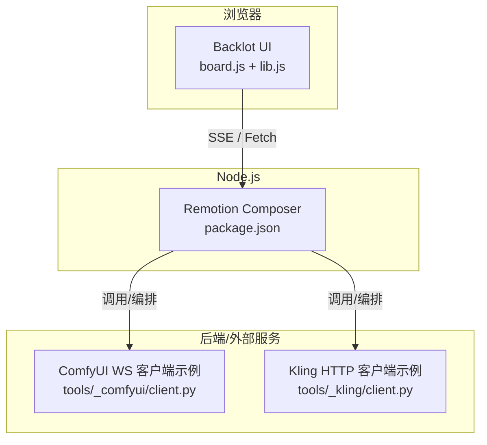
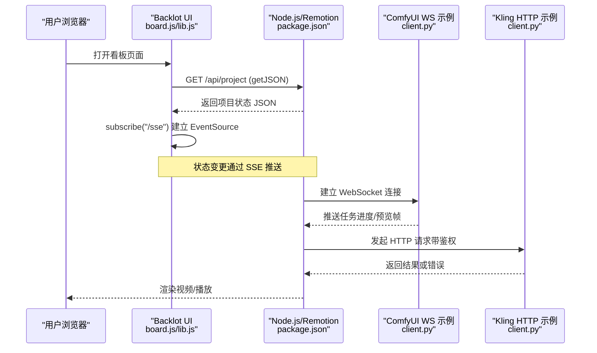
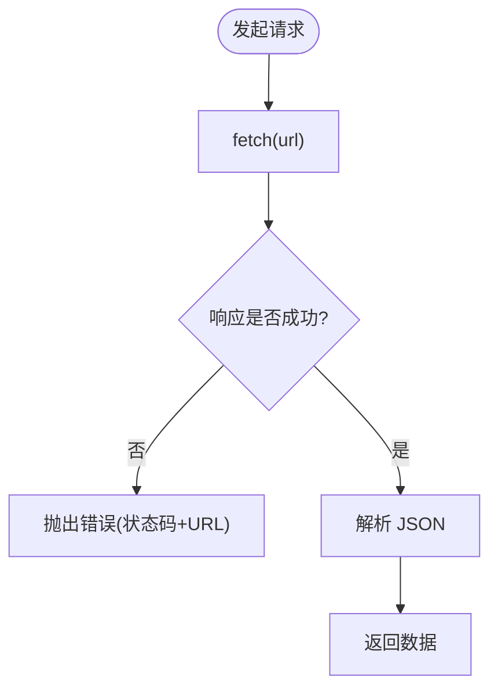
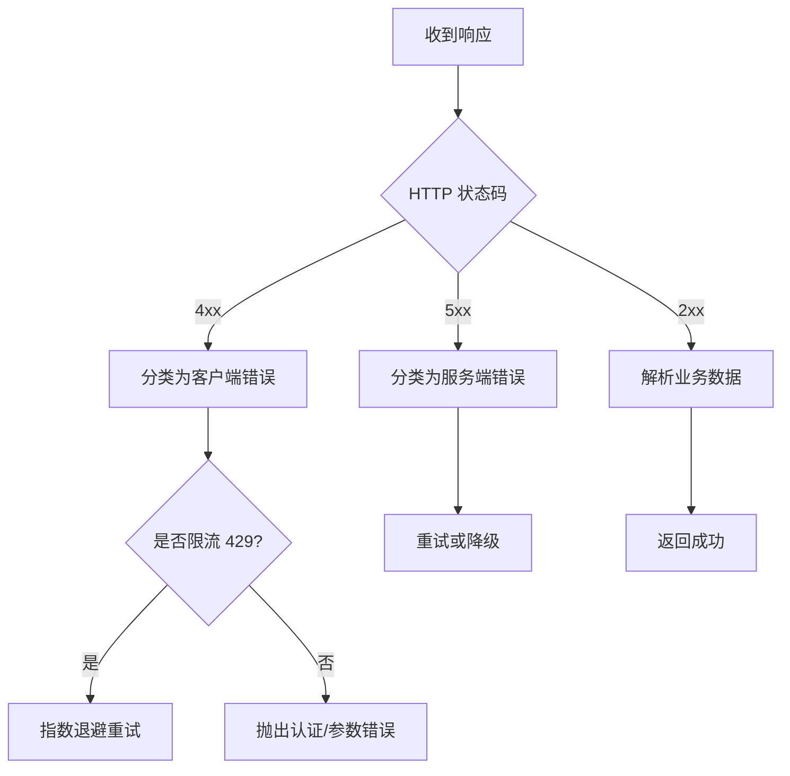
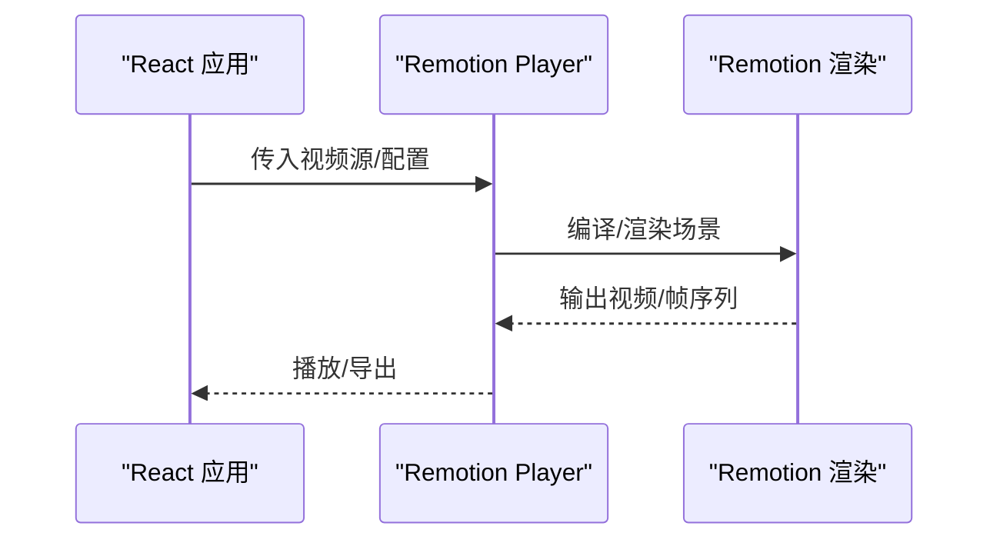
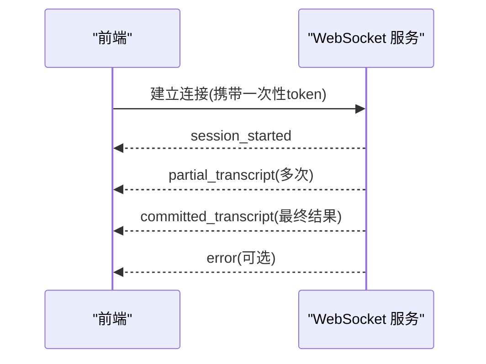
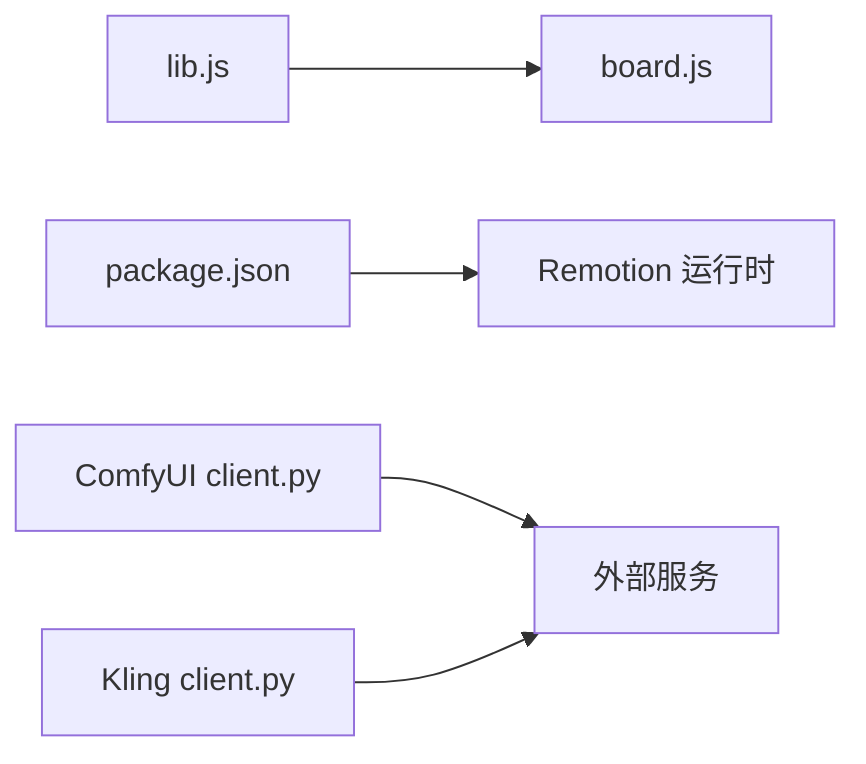

# JavaScript SDK

<cite>
**本文引用的文件**
- [README.md](file://README.md)
- [remotion-composer/package.json](file://remotion-composer/package.json)
- [backlot/ui/lib.js](file://backlot/ui/lib.js)
- [backlot/ui/board.js](file://backlot/ui/board.js)
- [tools/_comfyui/client.py](file://tools/_comfyui/client.py)
- [tools/_kling/client.py](file://tools/_kling/client.py)
- [.agents/skills/speech-to-text/references/realtime-events.md](file://.agents/skills/speech-to-text/references/realtime-events.md)
- [.claude/skills/speech-to-text/references/realtime-client-side.md](file://.claude/skills/speech-to-text/references/realtime-client-side.md)
- [.agents/skills/bfl-api/references/error-handling.md](file://.agents/skills/bfl-api/references/error-handling.md)
- [.agents/skills/bfl-api/references/rate-limiting.md](file://.agents/skills/bfl-api/references/rate-limiting.md)
</cite>

## 目录
1. [简介](#简介)
2. [项目结构](#项目结构)
3. [核心组件](#核心组件)
4. [架构总览](#架构总览)
5. [详细组件分析](#详细组件分析)
6. [依赖关系分析](#依赖关系分析)
7. [性能与内存优化](#性能与内存优化)
8. [故障排查指南](#故障排查指南)
9. [结论](#结论)
10. [附录：安装与环境](#附录安装与环境)

## 简介
本指南面向希望在 Node.js 与浏览器环境中集成 OpenMontage 的开发者，覆盖从环境准备、npm 包安装到 REST API 客户端封装、认证、错误处理，以及 Remotion 视频渲染组件在 React 中的集成方式。同时提供 WebSocket 实时状态监控的实现思路与最佳实践，并给出前端性能优化、内存管理与移动端适配建议，帮助你完成从基础使用到高级集成的完整开发流程。

## 项目结构
OpenMontage 并非以单一“JavaScript SDK”的形式发布，而是通过以下关键部分为前端与 Node.js 集成提供能力：
- Backlot UI（浏览器端）：基于原生 JS 的本地看板，使用 Fetch 获取 JSON、EventSource 订阅 SSE 实现实时状态更新。
- Remotion Composer（Node.js/React）：Remotion 工程，用于将数据驱动的视频内容渲染为最终视频或播放器。
- Python 工具链：提供多种第三方服务（如 ComfyUI、Kling）的 HTTP/WS 客户端示例，可作为构建 JavaScript SDK 的参考。

图表来源
- [backlot/ui/lib.js:1-104](file://backlot/ui/lib.js#L1-L104)
- [backlot/ui/board.js:1-800](file://backlot/ui/board.js#L1-L800)
- [remotion-composer/package.json:1-36](file://remotion-composer/package.json#L1-L36)
- [tools/_comfyui/client.py:279-309](file://tools/_comfyui/client.py#L279-L309)
- [tools/_kling/client.py:164-216](file://tools/_kling/client.py#L164-L216)

章节来源
- [README.md:180-216](file://README.md#L180-L216)
- [backlot/README.md:1-43](file://backlot/README.md#L1-L43)

## 核心组件
- Backlot UI 客户端库（lib.js）
  - 提供 getJSON、subscribe（SSE）、媒体 URL 生成、时间/金额格式化等通用能力。
- Backlot 看板（board.js）
  - 组合 lib.js 的能力，展示流水线阶段、脚本、素材、决策日志、活动流等，并通过 SSE 保持实时刷新。
- Remotion Composer（package.json）
  - 定义 Remotion 相关依赖与脚本，作为视频渲染与播放的核心。
- Python 客户端示例（tools/_comfyui/client.py, tools/_kling/client.py）
  - 演示了 HTTP 请求封装、错误分类、WebSocket 连接与事件轮询等模式，可作为构建 JavaScript SDK 的参考。

章节来源
- [backlot/ui/lib.js:1-104](file://backlot/ui/lib.js#L1-L104)
- [backlot/ui/board.js:1-800](file://backlot/ui/board.js#L1-L800)
- [remotion-composer/package.json:1-36](file://remotion-composer/package.json#L1-L36)
- [tools/_comfyui/client.py:279-309](file://tools/_comfyui/client.py#L279-L309)
- [tools/_kling/client.py:164-216](file://tools/_kling/client.py#L164-L216)

## 架构总览
下图展示了浏览器端与 Node.js 端的交互路径，以及与外部服务的通信方式。

图表来源
- [backlot/ui/lib.js:3-81](file://backlot/ui/lib.js#L3-L81)
- [backlot/ui/board.js:1-800](file://backlot/ui/board.js#L1-L800)
- [tools/_comfyui/client.py:279-309](file://tools/_comfyui/client.py#L279-L309)
- [tools/_kling/client.py:164-216](file://tools/_kling/client.py#L164-L216)

## 详细组件分析

### REST API 客户端封装（基于 Backlot lib.js）
- 统一请求封装
  - 使用 fetch 进行 JSON 请求，失败时抛出包含状态码与 URL 的错误信息。
- 资源访问
  - 提供媒体与缩略图 URL 构造方法，便于在 UI 中安全加载资源。
- 实时订阅
  - 使用 EventSource 订阅服务端 SSE 通道，按事件类型过滤并节流回调，避免频繁重绘。

图表来源
- [backlot/ui/lib.js:3-7](file://backlot/ui/lib.js#L3-L7)

章节来源
- [backlot/ui/lib.js:1-104](file://backlot/ui/lib.js#L1-L104)

### 认证机制（HTTP 与 WebSocket）
- HTTP 认证
  - 建议在请求头中携带令牌（例如 Authorization: Bearer <token>），并在服务端校验。可参考 Python 客户端的错误分类与业务错误处理逻辑，将其映射到前端异常类型。
- WebSocket 认证
  - 在连接 URL 中附加一次性 token 或会话标识，服务端据此建立会话。可参考 ComfyUI 客户端示例中 ws_url 的拼接与超时设置。

章节来源
- [tools/_comfyui/client.py:279-309](file://tools/_comfyui/client.py#L279-L309)
- [tools/_kling/client.py:164-216](file://tools/_kling/client.py#L164-L216)

### 错误处理策略
- 网络层错误
  - 捕获非 2xx 响应，记录状态码与请求 URL，向上抛出结构化错误。
- 业务层错误
  - 根据响应体中的 code/message/request_id 进行分类，区分可重试与不可重试错误。
- 限流与重试
  - 对 429 等限流错误采用指数退避重试；对 400/401/403 等客户端错误直接提示。

图表来源
- [tools/_kling/client.py:164-216](file://tools/_kling/client.py#L164-L216)
- [.agents/skills/bfl-api/references/error-handling.md:148-264](file://.agents/skills/bfl-api/references/error-handling.md#L148-L264)
- [.agents/skills/bfl-api/references/rate-limiting.md:67-88](file://.agents/skills/bfl-api/references/rate-limiting.md#L67-L88)

章节来源
- [tools/_kling/client.py:164-216](file://tools/_kling/client.py#L164-L216)
- [.agents/skills/bfl-api/references/error-handling.md:148-264](file://.agents/skills/bfl-api/references/error-handling.md#L148-L264)
- [.agents/skills/bfl-api/references/rate-limiting.md:67-88](file://.agents/skills/bfl-api/references/rate-limiting.md#L67-L88)

### Remotion 组件集成（React 应用）
- 安装与初始化
  - 在 remotion-composer 目录下执行 npm install 安装依赖，使用 npx remotion studio 启动开发服务器，npx remotion render 渲染输出。
- 在 React 应用中嵌入
  - 可将 Remotion 的 Player 组件引入你的 React 项目，传入视频源与配置项进行播放。
  - 若需自定义场景，可在 Remotion 工程中扩展 Root 与场景组件，并通过 props 注入数据。

图表来源
- [remotion-composer/package.json:1-36](file://remotion-composer/package.json#L1-L36)

章节来源
- [README.md:180-216](file://README.md#L180-L216)
- [remotion-composer/package.json:1-36](file://remotion-composer/package.json#L1-L36)

### WebSocket 连接与实时状态监控
- 事件模型
  - 使用与 message_type 匹配的事件名监听连接事件，如 session_started、partial_transcript、committed_transcript、error 等。
- 前端实现要点
  - 建立连接后注册事件处理器；对 partial 与 committed 两类事件分别处理；在 error 事件中做降级与提示。
- 安全建议
  - 不在客户端暴露密钥；服务端生成一次性 token；对 token 接口增加鉴权中间件。

图表来源
- [.agents/skills/speech-to-text/references/realtime-events.md:183-210](file://.agents/skills/speech-to-text/references/realtime-events.md#L183-L210)
- [.claude/skills/speech-to-text/references/realtime-client-side.md:180-193](file://.claude/skills/speech-to-text/references/realtime-client-side.md#L180-L193)

章节来源
- [.agents/skills/speech-to-text/references/realtime-events.md:183-210](file://.agents/skills/speech-to-text/references/realtime-events.md#L183-L210)
- [.claude/skills/speech-to-text/references/realtime-client-side.md:180-193](file://.claude/skills/speech-to-text/references/realtime-client-side.md#L180-L193)

### 前端最佳实践（组件复用、性能优化、内存管理）
- 组件复用
  - 将静态 JSX 提升到组件外，减少重复创建；对大 SVG 节点尤其重要。
- 性能优化
  - 避免布局抖动：批量写入样式后再读取布局属性；合理使用 requestAnimationFrame；避免在热路径中进行昂贵计算。
  - 图片与媒体：懒加载、按需加载、使用缩略图；对长列表使用虚拟滚动。
- 内存管理
  - 及时释放事件监听器与定时器；断开 WebSocket 时清理资源；避免闭包持有大对象引用。
- 移动端适配
  - 使用响应式布局与视口单位；限制并发媒体数量；优先使用硬件加速的 CSS 动画；注意触摸交互与手势冲突。

章节来源
- [.agents/skills/vercel-react-best-practices/AGENTS.md:2158-2648](file://.agents/skills/vercel-react-best-practices/AGENTS.md#L2158-L2648)

## 依赖关系分析
- Backlot UI 依赖
  - 浏览器原生能力：fetch、EventSource、DOM API。
  - 内部模块：lib.js 提供的工具函数。
- Remotion Composer 依赖
  - Remotion 生态：@remotion/cli、@remotion/player、@remotion/transitions 等。
- Python 客户端示例
  - websocket、json、http 等标准库或第三方库，用于演示与外部服务交互。

图表来源
- [backlot/ui/lib.js:1-104](file://backlot/ui/lib.js#L1-L104)
- [backlot/ui/board.js:1-800](file://backlot/ui/board.js#L1-L800)
- [remotion-composer/package.json:1-36](file://remotion-composer/package.json#L1-L36)
- [tools/_comfyui/client.py:279-309](file://tools/_comfyui/client.py#L279-L309)
- [tools/_kling/client.py:164-216](file://tools/_kling/client.py#L164-L216)

章节来源
- [backlot/ui/lib.js:1-104](file://backlot/ui/lib.js#L1-L104)
- [backlot/ui/board.js:1-800](file://backlot/ui/board.js#L1-L800)
- [remotion-composer/package.json:1-36](file://remotion-composer/package.json#L1-L36)
- [tools/_comfyui/client.py:279-309](file://tools/_comfyui/client.py#L279-L309)
- [tools/_kling/client.py:164-216](file://tools/_kling/client.py#L164-L216)

## 性能与内存优化
- 网络层
  - 对 SSE 订阅进行节流与去抖，避免高频重绘。
  - 对 HTTP 请求实施缓存策略（ETag/Last-Modified）与幂等性设计。
- 渲染层
  - 使用 Remotion 的按需渲染与分片导出；在播放器中启用预缓冲与低延迟模式。
- 内存层
  - 及时释放媒体资源；避免在事件回调中累积大对象；对长生命周期组件使用弱引用或清理函数。
- 移动端
  - 降低分辨率与帧率；合并动画批次；避免同时播放多个视频。

[本节为通用指导，不直接分析具体文件]

## 故障排查指南
- 常见问题定位
  - 无法获取项目状态：检查 getJSON 抛出的状态码与 URL，确认后端路由与权限。
  - SSE 断连：观察 EventSource onerror，必要时实现重连与退避。
  - WebSocket 连接失败：检查 token 有效性与服务端地址协议（ws/wss）。
- 错误分类与重试
  - 依据 Python 客户端的错误分类逻辑，在前端实现相似的分层错误处理与重试策略。
- 日志与诊断
  - 记录请求 ID、错误码与堆栈；在服务端关联追踪；在前端提供“复制错误信息”功能以便反馈。

章节来源
- [backlot/ui/lib.js:3-81](file://backlot/ui/lib.js#L3-L81)
- [tools/_kling/client.py:164-216](file://tools/_kling/client.py#L164-L216)
- [.agents/skills/bfl-api/references/error-handling.md:148-264](file://.agents/skills/bfl-api/references/error-handling.md#L148-L264)

## 结论
OpenMontage 的前端与 Node.js 集成围绕 Backlot UI 与 Remotion Composer 展开：前者提供轻量级、实时的项目管理界面，后者提供强大的视频渲染与播放能力。通过统一的 HTTP/SSE/WS 通信模式与完善的错误处理策略，你可以在浏览器与 Node.js 环境中高效地接入 OpenMontage 的生产力管线。结合前文的最佳实践，你将获得稳定、高性能且易于维护的集成方案。

## 附录：安装与环境
- Node.js 版本要求
  - 根据 README 的“快速开始”，需要 Node.js 18+。
- 安装步骤
  - 克隆仓库后进入项目根目录，执行 make setup；或在没有 make 的情况下手动创建虚拟环境、安装依赖、进入 remotion-composer 执行 npm install。
- 运行与调试
  - 在 remotion-composer 目录使用 npx remotion studio 启动开发服务器；使用 npx remotion render 渲染输出。
  - Backlot 可通过 python -m backlot open 启动本地看板，查看生产流水线状态。

章节来源
- [README.md:180-216](file://README.md#L180-L216)
- [backlot/README.md:1-43](file://backlot/README.md#L1-L43)