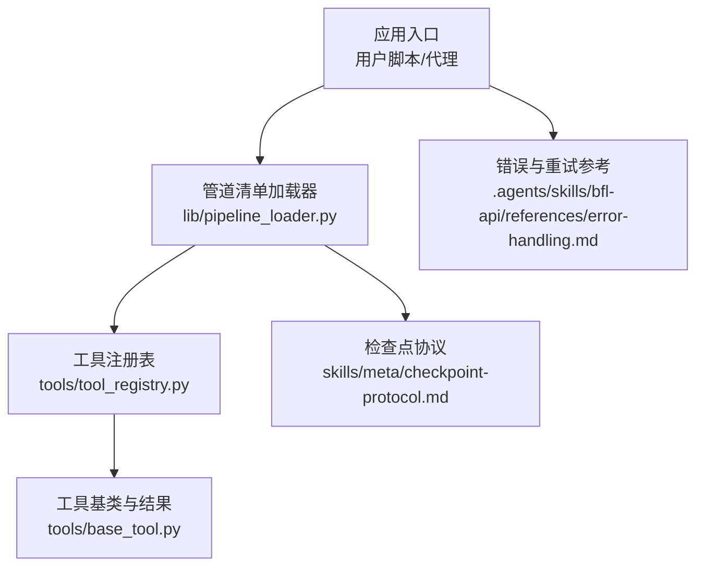
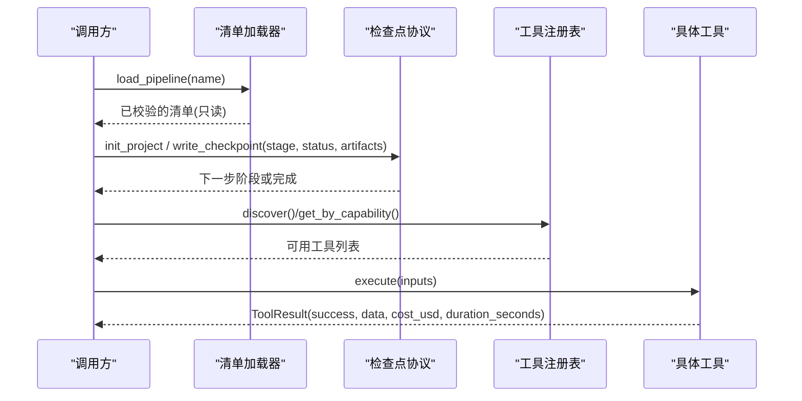
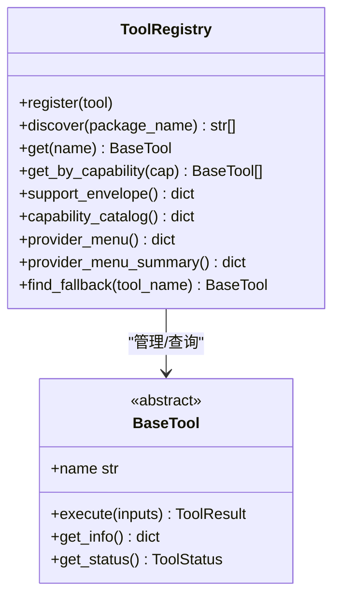
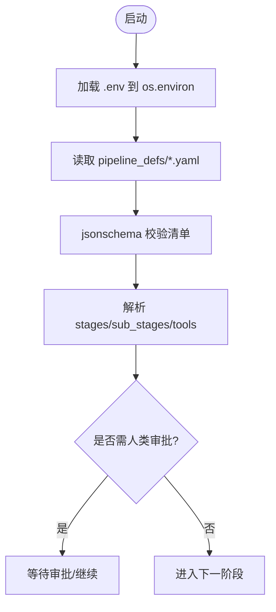
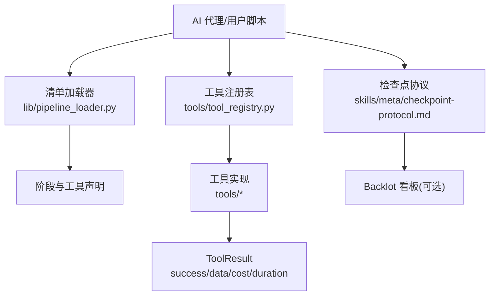
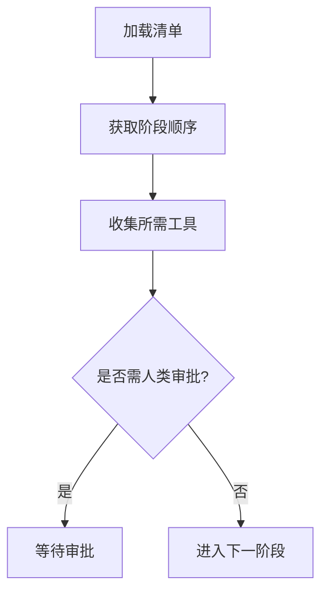
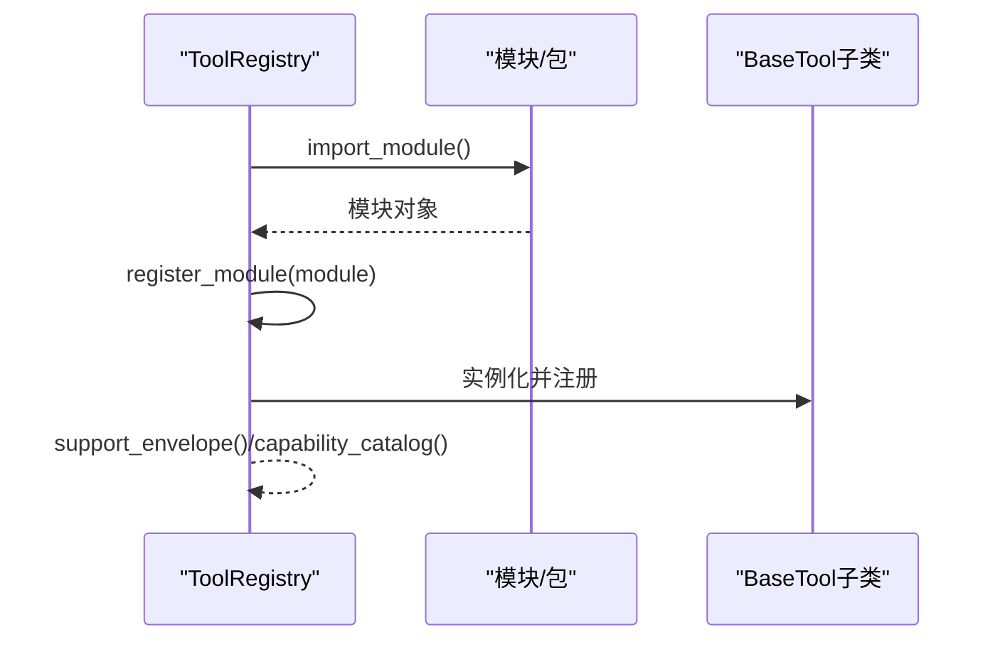
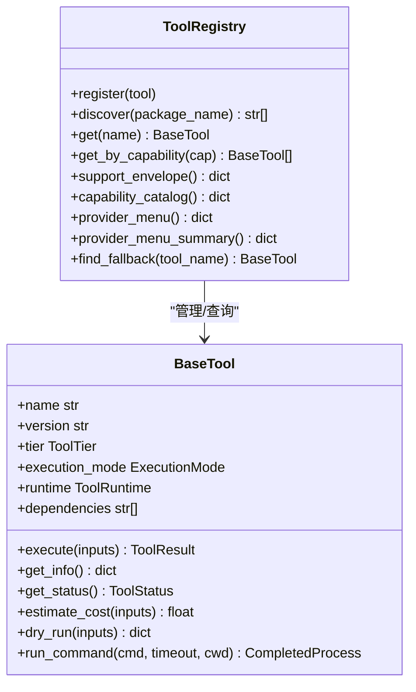
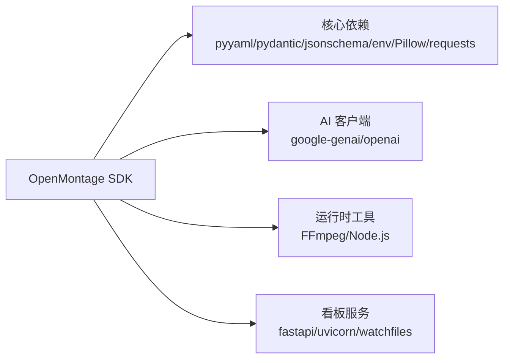
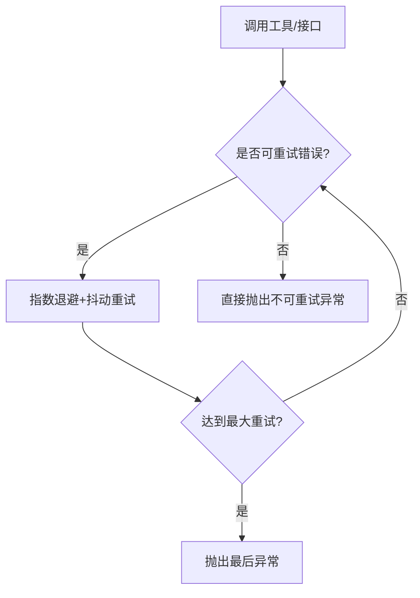

# Python SDK

<cite>
**本文引用的文件**
- [README.md](file://README.md)
- [setup.py](file://setup.py)
- [requirements.txt](file://requirements.txt)
- [tools/base_tool.py](file://tools/base_tool.py)
- [tools/tool_registry.py](file://tools/tool_registry.py)
- [lib/pipeline_loader.py](file://lib/pipeline_loader.py)
- [pipeline_defs/animated-explainer.yaml](file://pipeline_defs/animated-explainer.yaml)
- [skills/meta/checkpoint-protocol.md](file://skills/meta/checkpoint-protocol.md)
- [.agents/skills/bfl-api/references/error-handling.md](file://.agents/skills/bfl-api/references/error-handling.md)
- [tests/contracts/test_phase0_contracts.py](file://tests/contracts/test_phase0_contracts.py)
</cite>

## 目录
1. [简介](#简介)
2. [项目结构](#项目结构)
3. [核心组件](#核心组件)
4. [架构总览](#架构总览)
5. [详细组件分析](#详细组件分析)
6. [依赖关系分析](#依赖关系分析)
7. [性能与并发建议](#性能与并发建议)
8. [故障排查指南](#故障排查指南)
9. [版本升级与迁移指南](#版本升级与迁移指南)
10. [结论](#结论)

## 简介
本指南面向使用 OpenMontage Python SDK 的开发者，聚焦于：
- 安装与环境要求（pip 与源码方式）
- 环境配置与依赖管理
- 三大核心模块的使用：管道执行器、工具注册表、配置管理器
- 典型用法示例：基本管道执行、自定义工具调用、批量处理
- 异步调用模式与并发最佳实践
- 错误处理、重试机制与日志记录
- 版本升级与迁移注意事项

OpenMontage 是一个以“代理驱动”的视频生产系统，Python 层提供工具、注册表、管道清单加载与校验等基础设施。通过 YAML 管道清单与 Markdown 技能文件，编排研究、提案、脚本、场景、资产、剪辑、合成与发布等阶段，并在关键节点进行质量门禁与人类审批。

**章节来源**
- [README.md:180-216](file://README.md#L180-L216)

## 项目结构
仓库采用“能力分层 + 清单驱动”的组织方式：
- tools：工具实现与注册（视频、音频、图像、增强、分析、字幕等）
- lib：核心基础设施（管道清单加载、检查点、事件等）
- pipeline_defs：YAML 管道清单（定义阶段、工具、审查要点、成功标准）
- skills：技能与规则（指导代理如何正确执行各阶段）
- schemas：JSON Schema（用于契约校验）
- backlot：本地看板服务（观察运行状态）

**图示来源**
- [lib/pipeline_loader.py:49-70](file://lib/pipeline_loader.py#L49-L70)
- [tools/tool_registry.py:55-134](file://tools/tool_registry.py#L55-L134)
- [tools/base_tool.py:227-397](file://tools/base_tool.py#L227-L397)
- [skills/meta/checkpoint-protocol.md:50-200](file://skills/meta/checkpoint-protocol.md#L50-L200)
- [.agents/skills/bfl-api/references/error-handling.md:148-197](file://.agents/skills/bfl-api/references/error-handling.md#L148-L197)

**章节来源**
- [README.md:450-475](file://README.md#L450-L475)

## 核心组件
本节围绕 SDK 的三大核心展开：管道执行器、工具注册表、配置管理器。

### 管道执行器（基于清单与检查点）
- 清单加载与校验：从 pipeline_defs 读取 YAML 清单并依据 schema 校验，返回只读清单对象供上层编排。
- 阶段顺序与子阶段：支持获取主阶段顺序与可选子阶段（如 sample），并可按上下文过滤活跃子阶段。
- 所需工具收集：汇总 stages 与 sub_stages 中声明的工具集合，便于预检与资源规划。
- 人类审批门：清单中可声明 human_approval_default，配合检查点协议在关键阶段暂停等待人工确认。
- 恢复与续跑：检查点协议支持 in_progress 中间态与历史归档，断点续跑时优先读取 partial_progress。

**图示来源**
- [lib/pipeline_loader.py:49-162](file://lib/pipeline_loader.py#L49-L162)
- [skills/meta/checkpoint-protocol.md:50-200](file://skills/meta/checkpoint-protocol.md#L50-L200)
- [tools/tool_registry.py:118-182](file://tools/tool_registry.py#L118-L182)
- [tools/base_tool.py:128-139](file://tools/base_tool.py#L128-L139)

**章节来源**
- [lib/pipeline_loader.py:49-241](file://lib/pipeline_loader.py#L49-L241)
- [skills/meta/checkpoint-protocol.md:50-200](file://skills/meta/checkpoint-protocol.md#L50-L200)

### 工具注册表（发现、查询与能力报告）
- 自动发现：discover(package_name) 会遍历包内模块，注册所有继承自 BaseTool 的具体类。
- 能力查询：按 tier、capability、provider、status、stability 等维度检索工具。
- 支持信封：support_envelope() 输出每个工具的完整合同信息；capability_catalog() 按能力分组；provider_menu() 生成用户友好的菜单摘要。
- 回退策略：find_fallback(tool_name) 根据工具声明的回退链查找可用替代。
- 运行时提示：provider_menu_summary() 聚合 composition_runtimes、capabilities、setup_offers、runtime_warnings，便于前置检查。

**图示来源**
- [tools/tool_registry.py:55-182](file://tools/tool_registry.py#L55-L182)
- [tools/base_tool.py:227-397](file://tools/base_tool.py#L227-L397)

**章节来源**
- [tools/tool_registry.py:55-493](file://tools/tool_registry.py#L55-L493)
- [tests/contracts/test_phase0_contracts.py:423-473](file://tests/contracts/test_phase0_contracts.py#L423-L473)

### 配置管理器（环境变量与清单配置）
- .env 自动加载：BaseTool 与 ToolRegistry 在导入/发现时尝试加载根目录 .env，将键值注入进程环境，避免硬编码密钥。
- 清单配置：pipeline loader 负责加载 YAML 清单并做 schema 校验；清单中声明 stage、required_tools、human_approval_default、extensions 等。
- 扩展控制：check_extension_permitted() 强制流水线对 custom_scripts/custom_playbooks/custom_skills/custom_tools 的启用开关。

**图示来源**
- [tools/base_tool.py:25-60](file://tools/base_tool.py#L25-L60)
- [tools/tool_registry.py:86-117](file://tools/tool_registry.py#L86-L117)
- [lib/pipeline_loader.py:49-70](file://lib/pipeline_loader.py#L49-L70)
- [lib/pipeline_loader.py:197-241](file://lib/pipeline_loader.py#L197-L241)

**章节来源**
- [tools/base_tool.py:25-60](file://tools/base_tool.py#L25-L60)
- [tools/tool_registry.py:86-117](file://tools/tool_registry.py#L86-L117)
- [lib/pipeline_loader.py:49-241](file://lib/pipeline_loader.py#L49-L241)

## 架构总览
下图展示 SDK 在“代理驱动”的生产流程中的位置：代理读取清单与技能，调用工具注册表选择工具，执行后写入检查点，最终产出视频。

**图示来源**
- [lib/pipeline_loader.py:49-162](file://lib/pipeline_loader.py#L49-L162)
- [tools/tool_registry.py:55-182](file://tools/tool_registry.py#L55-L182)
- [tools/base_tool.py:128-139](file://tools/base_tool.py#L128-L139)
- [skills/meta/checkpoint-protocol.md:50-200](file://skills/meta/checkpoint-protocol.md#L50-L200)

## 详细组件分析

### 管道执行器：清单驱动的阶段编排
- 清单加载：load_pipeline(name) 读取 YAML 并校验 schema，返回只读清单。
- 阶段顺序：get_stage_order(manifest, include_sub_stages=True) 可暴露 sample 等子阶段。
- 工具需求：get_required_tools(manifest) 汇总 stages 与 sub_stages 的 preferred/fallback/available 工具。
- 人类审批：get_stage_human_approval_default(manifest, stage_name) 决定默认是否需要审批。
- 扩展限制：check_extension_permitted() 强制 extensions 白名单。

**图示来源**
- [lib/pipeline_loader.py:49-182](file://lib/pipeline_loader.py#L49-L182)
- [lib/pipeline_loader.py:197-241](file://lib/pipeline_loader.py#L197-L241)

**章节来源**
- [lib/pipeline_loader.py:49-241](file://lib/pipeline_loader.py#L49-L241)
- [pipeline_defs/animated-explainer.yaml:61-270](file://pipeline_defs/animated-explainer.yaml#L61-L270)

### 工具注册表：发现、查询与能力报告
- 自动发现：discover("tools") 扫描包树，注册所有 BaseTool 子类。
- 能力分组：capability_catalog() 按 capability 分组；provider_menu() 生成用户友好菜单。
- 支持信封：support_envelope() 输出每个工具的完整合同信息，供编排器决策。
- 回退工具：find_fallback(tool_name) 根据 fallback/fallback_tools 查找可用替代。

**图示来源**
- [tools/tool_registry.py:118-134](file://tools/tool_registry.py#L118-L134)
- [tools/tool_registry.py:198-230](file://tools/tool_registry.py#L198-L230)
- [tools/base_tool.py:227-397](file://tools/base_tool.py#L227-L397)

**章节来源**
- [tools/tool_registry.py:55-493](file://tools/tool_registry.py#L55-L493)
- [tests/contracts/test_phase0_contracts.py:423-473](file://tests/contracts/test_phase0_contracts.py#L423-L473)

### 配置管理器：.env 与清单配置
- .env 加载：BaseTool 与 ToolRegistry 在导入/发现时加载 .env，确保 API Key 可用。
- 清单配置：YAML 清单声明阶段、工具、人类审批、扩展开关等。
- 扩展控制：check_extension_permitted() 防止未授权的自定义扩展。

**章节来源**
- [tools/base_tool.py:25-60](file://tools/base_tool.py#L25-L60)
- [tools/tool_registry.py:86-117](file://tools/tool_registry.py#L86-L117)
- [lib/pipeline_loader.py:197-241](file://lib/pipeline_loader.py#L197-L241)

### 代码级类图（工具基类与注册表）

**图示来源**
- [tools/base_tool.py:227-481](file://tools/base_tool.py#L227-L481)
- [tools/tool_registry.py:55-493](file://tools/tool_registry.py#L55-L493)

## 依赖关系分析
- 运行时依赖：Python >= 3.10；PyYAML、Pydantic、jsonschema、python-dotenv、Pillow、requests、google-genai、openai 等。
- 开发/服务依赖：fastapi、uvicorn、watchfiles（用于 Backlot 看板）。
- 外部工具：FFmpeg、Node.js（Remotion/HyperFrames 渲染）。

**图示来源**
- [setup.py:3-19](file://setup.py#L3-L19)
- [requirements.txt:1-17](file://requirements.txt#L1-L17)
- [README.md:180-216](file://README.md#L180-L216)

**章节来源**
- [setup.py:1-20](file://setup.py#L1-L20)
- [requirements.txt:1-17](file://requirements.txt#L1-L17)
- [README.md:180-216](file://README.md#L180-L216)

## 性能与并发建议
- 并行化原则：无相互依赖的任务应并发执行，减少瀑布式等待；有依赖的任务应在各自任务内部链式发起，避免整体阻塞。
- 工具执行：BaseTool.execute 已被装饰为可观测（Backlot 事件），可在不侵入业务逻辑的前提下统计耗时与成本。
- 批处理建议：对独立素材/片段生成，先创建全部 Promise/任务，再统一 await，最大化吞吐；对长尾任务，采用分片与超时保护。
- 资源约束：通过 ResourceProfile 与 provider_menu_summary 识别 GPU/网络需求，合理调度。

[本节为通用性能建议，不直接分析具体文件]

## 故障排查指南
- 常见错误分类：
  - 可重试错误：429/5xx、generation_timeout、internal_error 等，建议使用指数退避+抖动重试。
  - 不可重试错误：4xx（鉴权/参数）、content_policy_violation、invalid_image 等，直接失败并记录上下文。
- 重试策略：封装 make_request_with_retry，设置最大重试次数与退避时间；对非可重试异常直接抛出。
- 日志记录：统一日志格式，记录请求、负载、错误与上下文；对生成失败记录 prompt 片段以便复现。
- 工具命令错误：BaseTool.run_command 捕获 CalledProcessError 并包装为 ToolCommandError，附带 stderr/stdout/detail。

**图示来源**
- [.agents/skills/bfl-api/references/error-handling.md:148-197](file://.agents/skills/bfl-api/references/error-handling.md#L148-L197)
- [tools/base_tool.py:411-454](file://tools/base_tool.py#L411-L454)

**章节来源**
- [.agents/skills/bfl-api/references/error-handling.md:148-197](file://.agents/skills/bfl-api/references/error-handling.md#L148-L197)
- [tools/base_tool.py:411-481](file://tools/base_tool.py#L411-L481)

## 版本升级与迁移指南
- 环境要求：
  - Python >= 3.10（setup.py 指定）
  - FFmpeg、Node.js 18+（README 快速开始）
- 安装方式：
  - pip 安装：使用 setup.py 或 requirements.txt 安装依赖
  - 源码安装：克隆仓库后执行 make setup（或手动创建虚拟环境并安装依赖）
- 依赖变更：
  - 关注 requirements.txt 与 setup.py 的版本约束，必要时升级 google-genai、openai 等库以适配新特性
- 清单与技能：
  - 若升级涉及阶段/工具变更，请对照 pipeline_defs 与 skills 更新清单与技能引用
- 检查点协议：
  - 保持 checkpoint 写入规范（in_progress、归档历史、人类审批门），确保向后兼容
- 回退与兼容性：
  - 利用 ToolRegistry.find_fallback 与 provider_menu_summary 的 runtime_warnings 提前发现兼容性问题

**章节来源**
- [setup.py:1-20](file://setup.py#L1-L20)
- [README.md:180-216](file://README.md#L180-L216)
- [skills/meta/checkpoint-protocol.md:50-200](file://skills/meta/checkpoint-protocol.md#L50-L200)

## 结论
OpenMontage Python SDK 通过“清单驱动 + 工具注册表 + 检查点协议”的组合，提供了稳定、可审计、可扩展的视频生产编排能力。开发者可以：
- 使用清单描述生产流程，借助检查点进行质量控制与人类审批
- 通过注册表发现与选择工具，获得能力报告与回退策略
- 结合 .env 与清单配置管理环境与行为
- 遵循错误处理与重试最佳实践，保障鲁棒性
- 在升级过程中关注依赖、清单与技能的兼容性