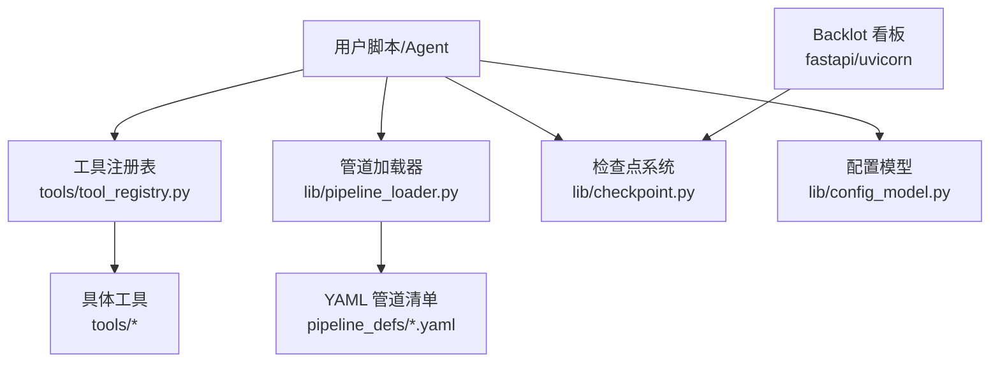
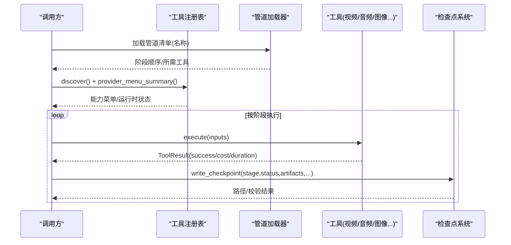
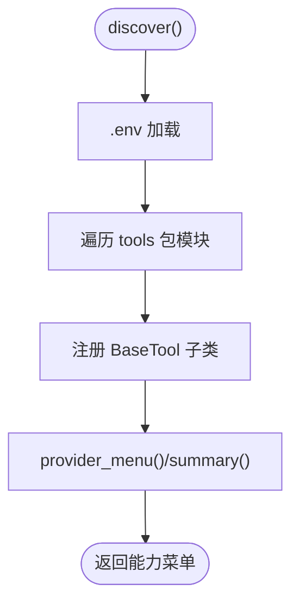
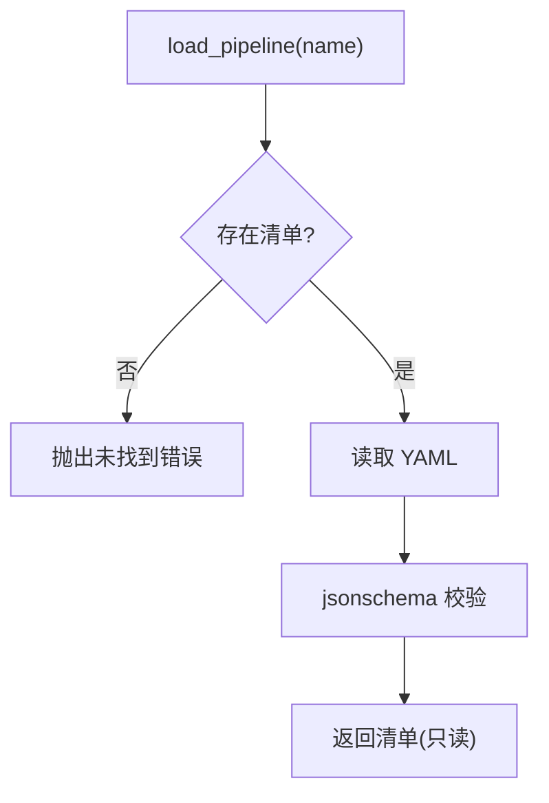
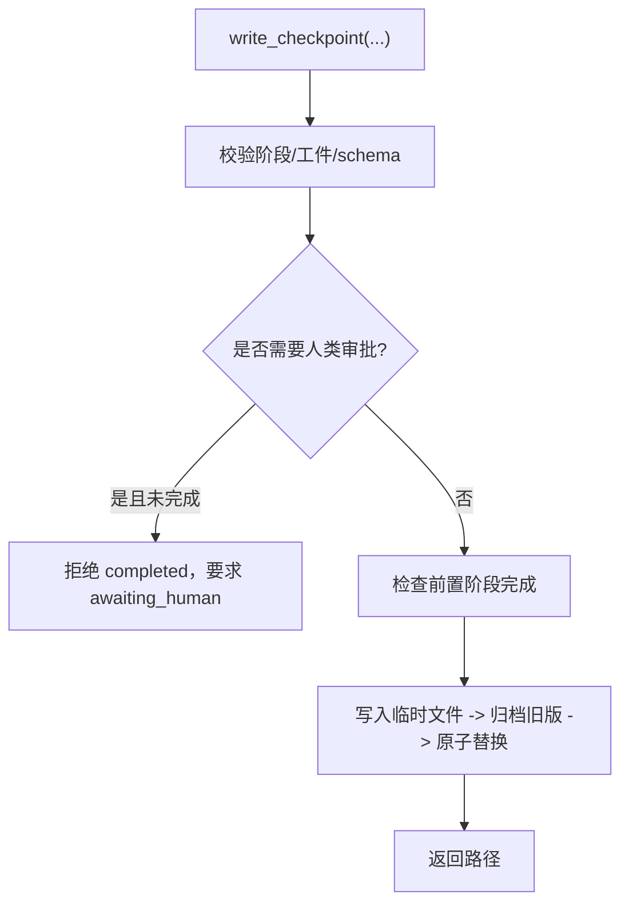
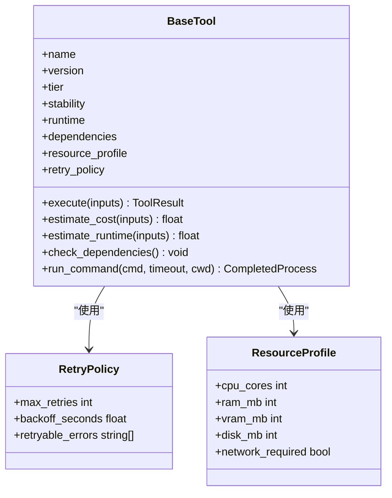
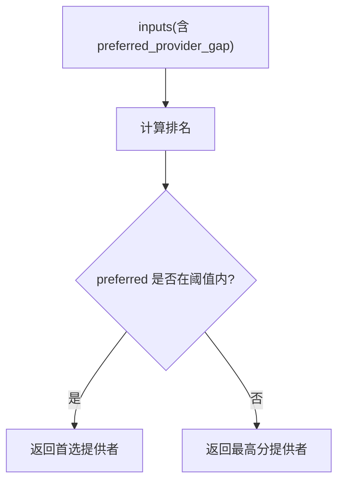
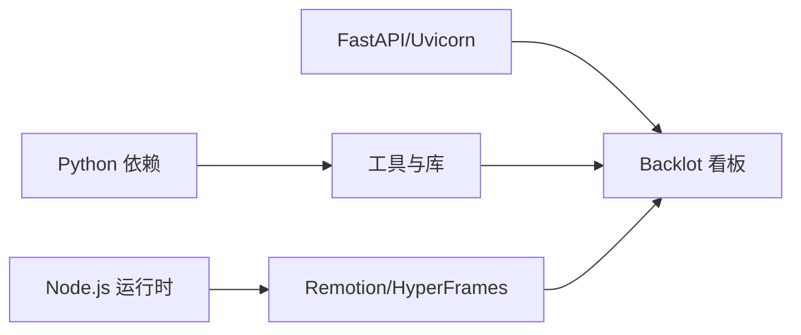
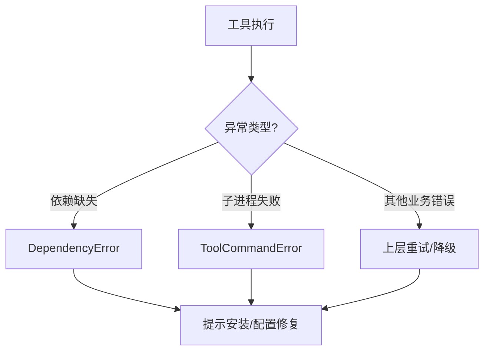

# SDK使用指南

<cite>
**本文引用的文件**
- [README.md](file://README.md)
- [setup.py](file://setup.py)
- [requirements.txt](file://requirements.txt)
- [tools/tool_registry.py](file://tools/tool_registry.py)
- [lib/pipeline_loader.py](file://lib/pipeline_loader.py)
- [lib/config_model.py](file://lib/config_model.py)
- [lib/checkpoint.py](file://lib/checkpoint.py)
- [tools/base_tool.py](file://tools/base_tool.py)
- [tools/video/video_selector.py](file://tools/video/video_selector.py)
- [tests/tools/test_hyperframes_compose.py](file://tests/tools/test_hyperframes_compose.py)
</cite>

## 目录
1. [简介](#简介)
2. [项目结构](#项目结构)
3. [核心组件](#核心组件)
4. [架构总览](#架构总览)
5. [详细组件分析](#详细组件分析)
6. [依赖关系分析](#依赖关系分析)
7. [性能与并发](#性能与并发)
8. [错误处理与重试](#错误处理与重试)
9. [安装、配置与调用示例](#安装配置与调用示例)
10. [版本升级与迁移指南](#版本升级与迁移指南)
11. [故障排查](#故障排查)
12. [结论](#结论)

## 简介
本指南面向希望集成 OpenMontage 的开发者，提供 Python 与 JavaScript（Node.js）侧的安装、配置与调用要点，并围绕“管道执行、工具调用、状态监控”三大能力给出最佳实践。OpenMontage 以“管道驱动 + 工具注册表 + 检查点治理”为核心：通过 YAML 管道清单定义阶段流程，通过工具注册表自动发现可用能力，通过检查点机制实现可恢复、可审计的生产流水线。

## 项目结构
- tools：生产工具集合（视频、音频、图像、增强、分析、字幕等），每个工具继承统一基类，声明能力、依赖、运行时、成本估算与重试策略。
- lib：基础设施（配置模型、管道清单加载、检查点写入/读取、路径解析等）。
- pipeline_defs：YAML 管道清单，描述阶段顺序、所需工具、人类审批门控等。
- schemas：JSON Schema，用于校验管道清单、工件与检查点。
- backlot：本地看板服务（FastAPI + Uvicorn），用于可视化运行状态与事件流。
- remotion-composer / styles / skills：渲染引擎与风格、技能知识包。

图表来源
- [tools/tool_registry.py:55-134](file://tools/tool_registry.py#L55-L134)
- [lib/pipeline_loader.py:49-76](file://lib/pipeline_loader.py#L49-L76)
- [lib/checkpoint.py:422-564](file://lib/checkpoint.py#L422-L564)
- [lib/config_model.py:65-93](file://lib/config_model.py#L65-L93)

章节来源
- [README.md:180-216](file://README.md#L180-L216)
- [requirements.txt:13-17](file://requirements.txt#L13-L17)

## 核心组件
- 工具注册表：自动发现 tools 下的所有工具，聚合能力菜单、可用性、运行时信息，供编排层选择与展示。
- 管道加载器：加载并校验 YAML 管道清单，提取阶段顺序、子阶段、所需工具、人类审批默认值等。
- 检查点系统：按阶段持久化状态，强制前置阶段完成与人类审批门控，归档历史版本，维护决策日志。
- 配置模型：集中管理 LLM、预算、输出、路径等运行时配置，支持从 YAML 加载与环境覆盖。
- 工具基类：统一抽象 execute、依赖检查、成本/时长估算、重试策略、命令执行封装等。

章节来源
- [tools/tool_registry.py:55-134](file://tools/tool_registry.py#L55-L134)
- [lib/pipeline_loader.py:49-190](file://lib/pipeline_loader.py#L49-L190)
- [lib/checkpoint.py:160-191](file://lib/checkpoint.py#L160-L191)
- [lib/config_model.py:16-93](file://lib/config_model.py#L16-L93)
- [tools/base_tool.py:227-481](file://tools/base_tool.py#L227-L481)

## 架构总览
OpenMontage 采用“编排即指令”的架构：AI 助手或上层应用读取 YAML 管道清单与阶段技能，调用工具注册表获取可用能力，按阶段执行工具并写入检查点；Backlot 实时监听事件与检查点变化，呈现进度与质量门禁结果。

图表来源
- [tools/tool_registry.py:118-134](file://tools/tool_registry.py#L118-L134)
- [tools/tool_registry.py:316-471](file://tools/tool_registry.py#L316-L471)
- [lib/pipeline_loader.py:49-76](file://lib/pipeline_loader.py#L49-L76)
- [lib/checkpoint.py:422-564](file://lib/checkpoint.py#L422-L564)

## 详细组件分析

### 工具注册表（能力发现与菜单）
- 自动发现：扫描 tools 包下模块，注册所有 BaseTool 子类实例。
- 能力菜单：按能力分组统计可用/不可用提供者，生成精简摘要，便于前端或 Agent 展示。
- 运行时检测：识别 ffmpeg/remotion/hyperframes 等渲染引擎是否就绪，收集警告信息。

图表来源
- [tools/tool_registry.py:118-134](file://tools/tool_registry.py#L118-L134)
- [tools/tool_registry.py:249-314](file://tools/tool_registry.py#L249-L314)
- [tools/tool_registry.py:316-471](file://tools/tool_registry.py#L316-L471)

章节来源
- [tools/tool_registry.py:55-134](file://tools/tool_registry.py#L55-L134)
- [tests/tools/test_hyperframes_compose.py:312-348](file://tests/tools/test_hyperframes_compose.py#L312-L348)

### 管道加载器（YAML 清单与阶段顺序）
- 加载与校验：读取 pipeline_defs/*.yaml，依据 schema 校验后返回只读清单。
- 阶段顺序：支持主阶段与子阶段展开，可按上下文过滤激活的子阶段。
- 扩展权限：限制 custom_scripts/playbooks/skills/tools 的使用，防止越权。

图表来源
- [lib/pipeline_loader.py:49-76](file://lib/pipeline_loader.py#L49-L76)
- [lib/pipeline_loader.py:125-162](file://lib/pipeline_loader.py#L125-L162)
- [lib/pipeline_loader.py:201-241](file://lib/pipeline_loader.py#L201-L241)

章节来源
- [lib/pipeline_loader.py:49-190](file://lib/pipeline_loader.py#L49-L190)

### 检查点系统（状态与门控）
- 写入与校验：写前验证阶段合法性、工件 schema、前置阶段完成与人类审批门控。
- 归档与审计：覆盖前归档历史版本，合并决策日志，记录风格与成本快照。
- 进度查询：读取最新检查点、已完成阶段、下一步阶段。

图表来源
- [lib/checkpoint.py:422-564](file://lib/checkpoint.py#L422-L564)
- [lib/checkpoint.py:284-346](file://lib/checkpoint.py#L284-L346)
- [lib/checkpoint.py:567-634](file://lib/checkpoint.py#L567-L634)

章节来源
- [lib/checkpoint.py:160-191](file://lib/checkpoint.py#L160-L191)
- [lib/checkpoint.py:422-564](file://lib/checkpoint.py#L422-L564)

### 工具基类（执行、依赖、重试、命令封装）
- 依赖检查：环境变量、命令行工具、Python 模块是否存在。
- 成本/时长估算：为预算治理提供预估。
- 命令执行：跨平台封装 subprocess，UTF-8 解码与错误包装。
- 重试策略：RetryPolicy 字段声明最大重试次数、退避时间、可重试错误类型。

图表来源
- [tools/base_tool.py:120-139](file://tools/base_tool.py#L120-L139)
- [tools/base_tool.py:227-481](file://tools/base_tool.py#L227-L481)

章节来源
- [tools/base_tool.py:227-481](file://tools/base_tool.py#L227-L481)

### 视频选择器（评分与首选提供者）
- 评分选择：根据输入与上下文对候选提供者打分，支持“首选提供者”在分差阈值内优先。
- 回退机制：当首选不满足条件时，回退到最高分可用提供者。

图表来源
- [tools/video/video_selector.py:413-440](file://tools/video/video_selector.py#L413-L440)

章节来源
- [tools/video/video_selector.py:413-440](file://tools/video/video_selector.py#L413-L440)

## 依赖关系分析
- Python 依赖：PyYAML、Pydantic、jsonschema、python-dotenv、Pillow、requests、google-genai、openai 等。
- Backlot 依赖：fastapi、uvicorn、watchfiles 用于本地看板与事件监听。
- 运行时依赖：ffmpeg、Remotion/HyperFrames（Node.js）作为渲染后端。

图表来源
- [requirements.txt:1-17](file://requirements.txt#L1-17)
- [setup.py:9-18](file://setup.py#L9-L18)

章节来源
- [requirements.txt:1-17](file://requirements.txt#L1-17)
- [setup.py:9-18](file://setup.py#L9-L18)

## 性能与并发
- 并行化建议：对无相互依赖的工具调用可使用并发策略（如线程池/进程池或异步任务）提升吞吐；注意资源上限（CPU/GPU/内存）与网络限流。
- 选择器优化：合理设置 preferred_provider_gap，避免过宽导致次优选择、过窄导致频繁回退。
- 渲染后端：根据内容类型选择 Remotion 或 HyperFrames，减少不必要的重渲染。

[本节为通用指导，无需特定文件引用]

## 错误处理与重试
- 工具级重试：通过 RetryPolicy 声明 max_retries、backoff_seconds、retryable_errors，由上层或工具内部实现指数退避与抖动。
- 依赖缺失：check_dependencies 会抛出 DependencyError，提示缺失的环境变量、二进制或 Python 模块。
- 命令执行错误：run_command 捕获 CalledProcessError 并包装为 ToolCommandError，附带 stderr/stdout 细节。
- 管道门控错误：检查点写入时若违反人类审批或前置阶段约束，将抛出 CheckpointValidationError。

图表来源
- [tools/base_tool.py:304-328](file://tools/base_tool.py#L304-L328)
- [tools/base_tool.py:411-454](file://tools/base_tool.py#L411-L454)
- [lib/checkpoint.py:467-494](file://lib/checkpoint.py#L467-L494)

章节来源
- [tools/base_tool.py:304-328](file://tools/base_tool.py#L304-L328)
- [tools/base_tool.py:411-454](file://tools/base_tool.py#L411-L454)
- [lib/checkpoint.py:467-494](file://lib/checkpoint.py#L467-L494)

## 安装、配置与调用示例

### Python SDK 安装与配置
- 环境准备：Python 3.10+、FFmpeg、Node.js 18+。
- 安装依赖：使用 requirements.txt 或 setup.py 安装核心依赖；如需 GPU 加速，参考 README 中的 GPU 安装说明。
- 环境变量：在 .env 中配置各提供商 API Key（可选），工具注册表会在导入时自动加载。

章节来源
- [README.md:180-216](file://README.md#L180-L216)
- [tools/tool_registry.py:86-117](file://tools/tool_registry.py#L86-L117)

### JavaScript（Node.js）SDK 与渲染后端
- 渲染后端：Remotion 与 HyperFrames 均为 Node.js 工程，需在 remotion-composer 目录下执行 npm install。
- 本地看板：Backlot 基于 FastAPI + Uvicorn，启动后可查看项目与运行事件。

章节来源
- [README.md:180-216](file://README.md#L180-L216)
- [requirements.txt:13-17](file://requirements.txt#L13-L17)

### 调用示例（Python）
- 能力探测：通过工具注册表 discover 与 provider_menu_summary 获取当前可用的能力与运行时状态。
- 管道执行：加载 YAML 管道清单，按阶段顺序调用工具，并在每阶段写入检查点。
- 状态监控：读取检查点与事件，结合 Backlot 看板观察进度。

章节来源
- [tools/tool_registry.py:118-134](file://tools/tool_registry.py#L118-L134)
- [tools/tool_registry.py:316-471](file://tools/tool_registry.py#L316-L471)
- [lib/pipeline_loader.py:49-76](file://lib/pipeline_loader.py#L49-L76)
- [lib/checkpoint.py:567-634](file://lib/checkpoint.py#L567-L634)

### 调用示例（JavaScript/Node.js）
- 渲染：通过 Remotion/HyperFrames 进行节目合成与导出。
- 看板：访问 Backlot 提供的本地 Web 界面，查看项目与事件。

章节来源
- [README.md:180-216](file://README.md#L180-L216)
- [requirements.txt:13-17](file://requirements.txt#L13-L17)

## 版本升级与迁移指南
- 依赖升级：关注 requirements.txt 与 setup.py 中的版本约束，必要时更新 PyYAML、Pydantic、jsonschema、google-genai、openai 等。
- 管道清单：遵循 schema 变更，确保 stages、orchestration、extensions 字段兼容。
- 检查点：保持向后兼容，历史检查点可继续读取；新特性需显式启用（如 extensions.*）。
- 渲染后端：Node.js 版本与 npm 包需匹配，避免破坏兼容性。

章节来源
- [setup.py:9-18](file://setup.py#L9-L18)
- [requirements.txt:1-17](file://requirements.txt#L1-17)
- [lib/pipeline_loader.py:201-241](file://lib/pipeline_loader.py#L201-L241)

## 故障排查
- 能力不可用：使用 provider_menu_summary 查看 capabilities 与 runtime_warnings，按提示补齐环境变量或安装依赖。
- 渲染失败：确认 ffmpeg/Remotion/HyperFrames 已正确安装并可被工具调用；检查 run_command 的错误详情。
- 门控阻止：若检查点写入报错，确认前置阶段已完成并通过人类审批；必要时调整 checkpoint_policy。
- 网络/配额：针对第三方 API，检查密钥与配额；必要时启用重试与降级策略。

章节来源
- [tools/tool_registry.py:316-471](file://tools/tool_registry.py#L316-L471)
- [tools/base_tool.py:411-454](file://tools/base_tool.py#L411-L454)
- [lib/checkpoint.py:467-494](file://lib/checkpoint.py#L467-L494)

## 结论
OpenMontage 通过“管道清单 + 工具注册表 + 检查点治理”的组合，提供了可恢复、可审计、可扩展的视频生产 SDK。开发者可基于 Python 与 Node.js 生态快速集成，借助能力菜单与看板进行可视化监控，并通过重试与降级策略保障稳定性。建议在生产环境中严格遵循人类审批门控与质量门禁，以获得稳定可靠的产出。