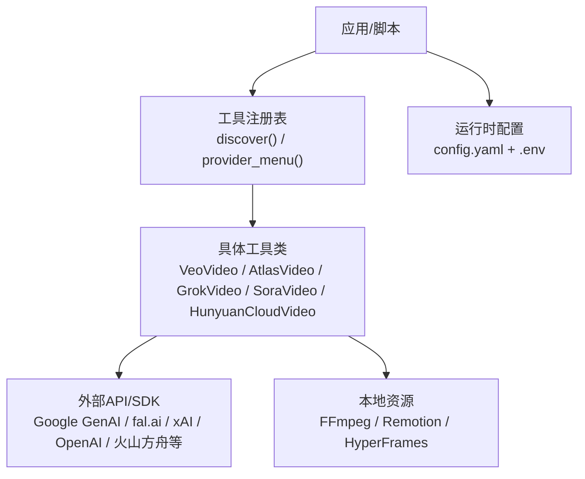
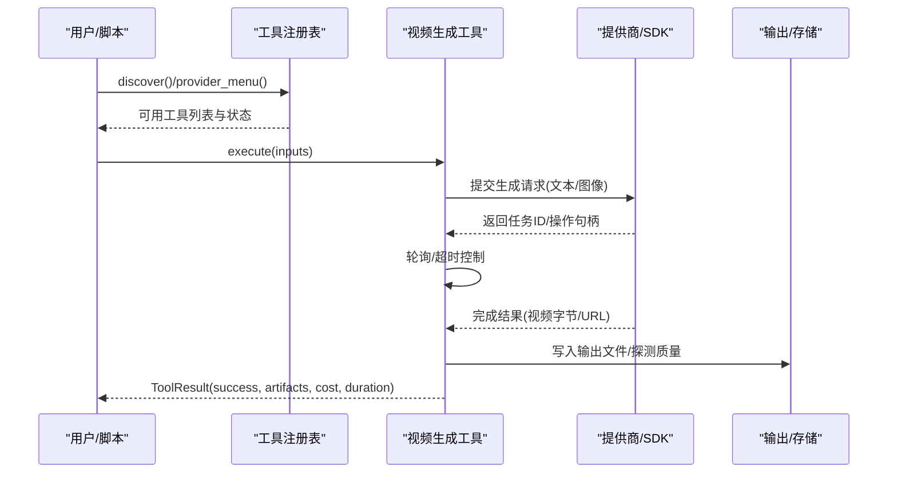
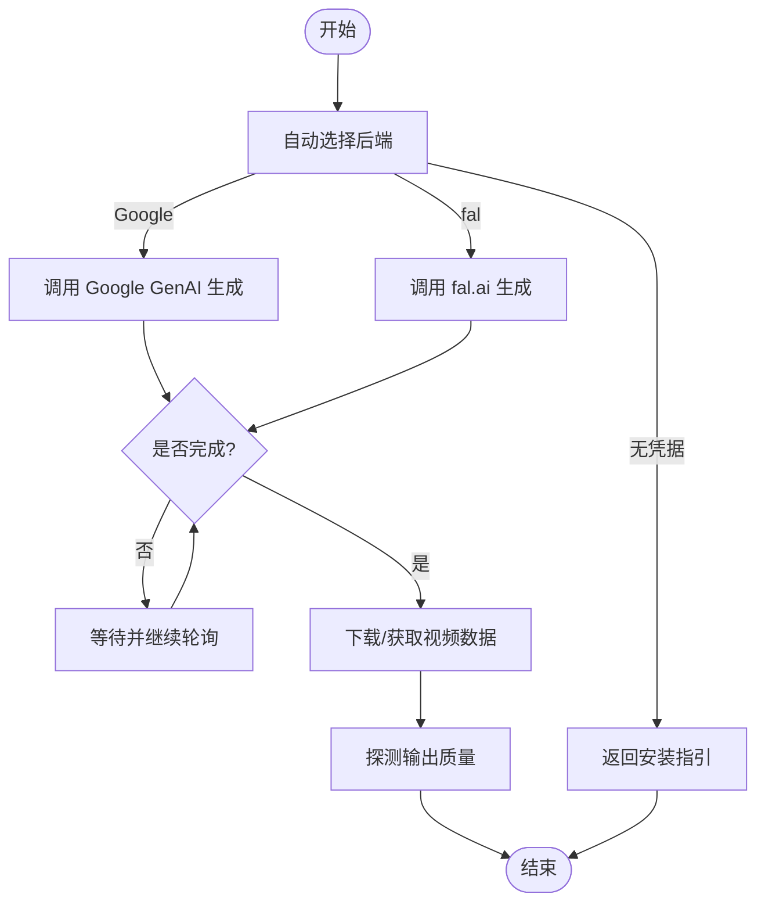
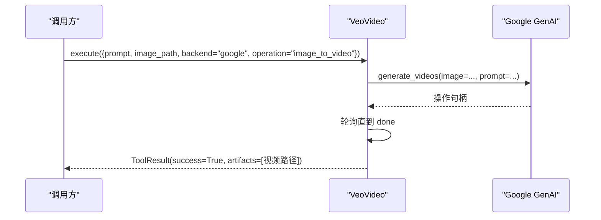
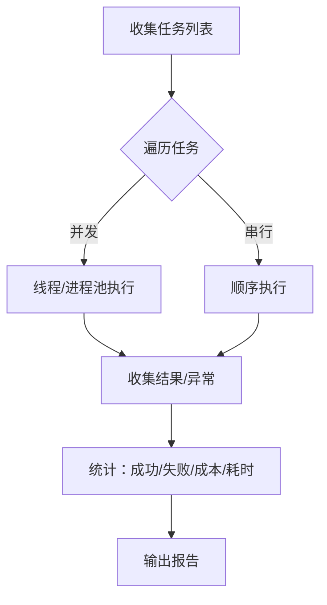
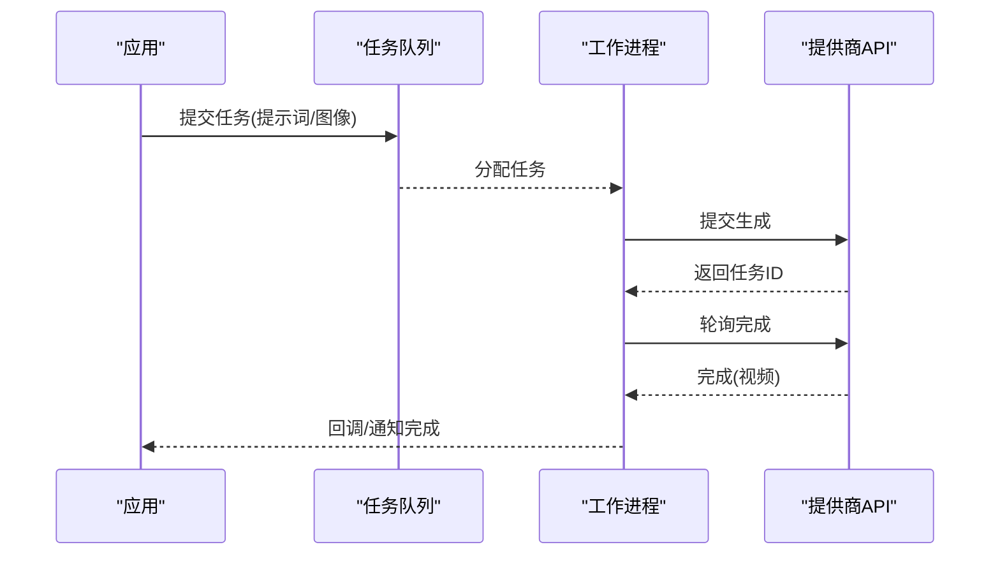
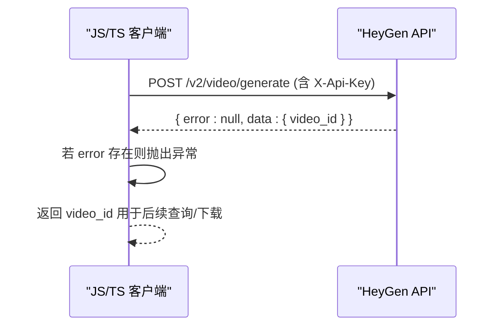
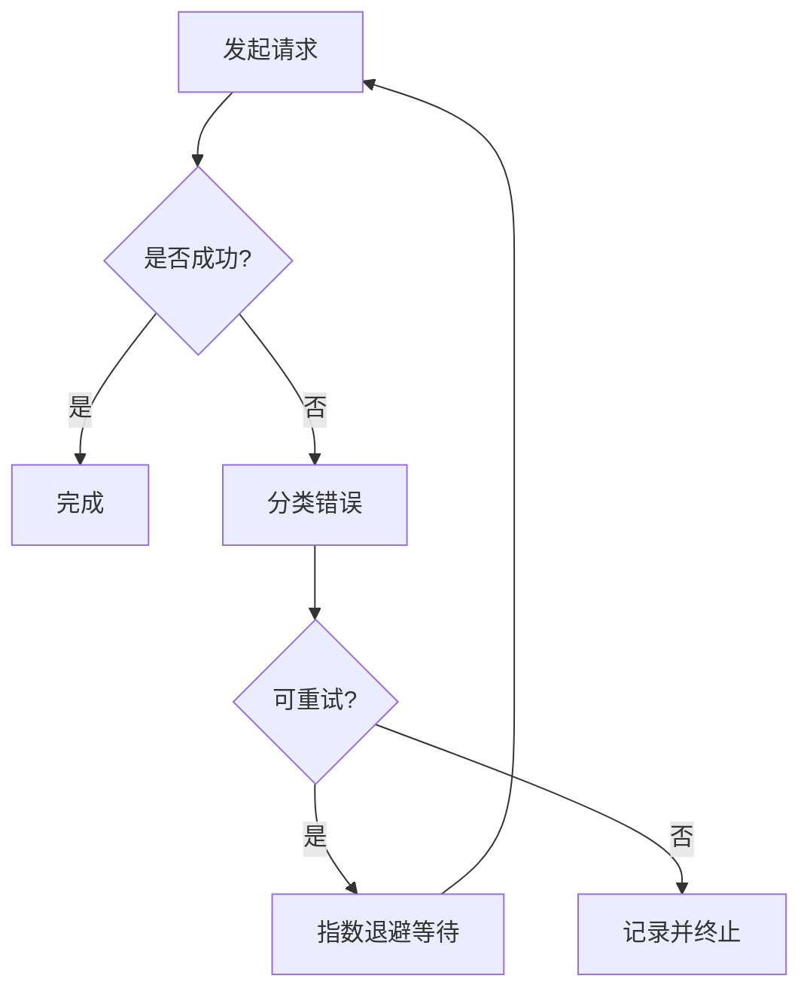
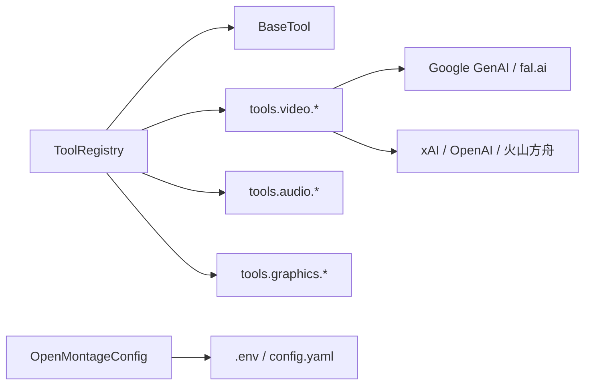

# SDK使用示例

<cite>
**本文引用的文件**   
- [README.md](file://README.md)
- [README_zh-CN.md](file://README_zh-CN.md)
- [tool_registry.py](file://tools/tool_registry.py)
- [config_model.py](file://lib/config_model.py)
- [veo_video.py](file://tools/video/veo_video.py)
- [hunyuan_cloud_video.py](file://tools/video/hunyuan_cloud_video.py)
- [grok_video.py](file://tools/video/grok_video.py)
- [atlas_video.py](file://tools/video/atlas_video.py)
- [sora_video.py](file://tools/video/sora_video.py)
- [test_phase3_contracts.py](file://tests/contracts/test_phase3_contracts.py)
- [video-generation.md（HeyGen 参考）](file://.agents\skills\heygen\references\video-generation.md)
- [error-handling.md（BFL API 参考）](file://.agents\skills\bfl-api\references\error-handling.md)
</cite>

## 目录
1. [简介](#简介)
2. [项目结构](#项目结构)
3. [核心组件](#核心组件)
4. [架构总览](#架构总览)
5. [详细组件分析](#详细组件分析)
6. [依赖关系分析](#依赖关系分析)
7. [性能注意事项](#性能注意事项)
8. [故障排查指南](#故障排查指南)
9. [结论](#结论)
10. [附录：Python与JavaScript对比示例](#附录python与javascript对比示例)

## 简介
本文件提供 OpenMontage SDK 的完整使用示例集合，覆盖 Python 与 JavaScript/TypeScript 两种语言在相同视频生成任务上的实现方式。内容包含文本转视频、图像转视频、批量处理、异步任务、错误处理与异常恢复、性能优化最佳实践（连接池、缓存策略、并发控制），以及测试用例示例，帮助开发者验证集成正确性并确保可运行。

OpenMontage 是一个以“智能体优先”的视频生产系统，通过工具注册表自动发现能力，按流水线编排完成从研究、脚本、资产生成到合成与渲染的全流程。其 Python 工具层封装了多种云端与本地视频生成后端；同时仓库内也提供了面向 JavaScript/TypeScript 的第三方服务调用示例（如 HeyGen），便于在 Web/Node 环境中集成。

## 项目结构
- tools/：100+ 已注册的生产工具（视频生成、音频、图像、增强、分析、字幕等）
- lib/：核心基础设施（配置、检查点、流水线加载器）
- pipeline_defs/：YAML 流水线清单（编排蓝图）
- skills/：Markdown 技能文件（阶段导演、创意技巧、核心工具知识）
- schemas/：JSON Schema（契约校验）
- styles/：视觉风格剧本（YAML）
- remotion-composer/：React/Remotion 视频合成引擎
- tests/：契约测试、QA 集成测试、评估工具包

图表来源
- [tool_registry.py:118-134](file://tools/tool_registry.py#L118-L134)
- [veo_video.py:263-281](file://tools/video/veo_video.py#L263-L281)
- [config_model.py:65-85](file://lib/config_model.py#L65-L85)

章节来源
- [README.md:450-475](file://README.md#L450-L475)
- [README_zh-CN.md:377-402](file://README_zh-CN.md#L377-L402)

## 核心组件
- 工具注册表（ToolRegistry）：自动发现并汇总所有工具的能力、状态、提供商菜单，供智能体或上层调度查询。
- 运行时配置（OpenMontageConfig）：集中管理 LLM、预算、检查点、输出参数与路径解析。
- 视频生成工具族：统一封装多后端（Google Veo、Atlas Cloud、xAI Grok、OpenAI Sora、腾讯混元云等），提供文本/图像转视频、轮询、超时、下载与产物探测。

章节来源
- [tool_registry.py:55-167](file://tools/tool_registry.py#L55-L167)
- [config_model.py:16-72](file://lib/config_model.py#L16-L72)
- [veo_video.py:263-281](file://tools/video/veo_video.py#L263-L281)

## 架构总览
OpenMontage 采用“智能体优先”的编排模式：智能体读取 YAML 流水线清单与 Markdown 技能文件，调用 Python 工具执行具体任务，并通过注册表进行能力发现与提供商选择。渲染阶段根据需求选择 Remotion 或 FFmpeg/HyperFrames。

图表来源
- [tool_registry.py:118-134](file://tools/tool_registry.py#L118-L134)
- [veo_video.py:263-281](file://tools/video/veo_video.py#L263-L281)
- [atlas_video.py:359-382](file://tools/video/atlas_video.py#L359-L382)
- [grok_video.py:228-250](file://tools/video/grok_video.py#L228-L250)

## 详细组件分析

### 文本转视频（Python）
- 目标：输入提示词，选择后端（auto/google/fal），提交生成，轮询直至完成，下载并保存视频。
- 关键点：
  - 自动后端选择：优先 Google GenAI，其次 fal.ai，否则返回安装指引。
  - 轮询与超时：基于操作句柄 done 标志与全局超时限制。
  - 错误处理：操作失败时返回结构化错误信息。

图表来源
- [veo_video.py:263-281](file://tools/video/veo_video.py#L263-L281)
- [veo_video.py:459-481](file://tools/video/veo_video.py#L459-L481)

章节来源
- [veo_video.py:263-281](file://tools/video/veo_video.py#L263-L281)
- [veo_video.py:459-481](file://tools/video/veo_video.py#L459-L481)

### 图像转视频（Python）
- 目标：输入图片路径与提示词，将静态图转为动态视频。
- 关键点：
  - 支持 Google GenAI 的 image_to_video 操作。
  - 测试中验证传入 image_path 后，SDK 会携带 image 参数。

图表来源
- [test_phase3_contracts.py:530-587](file://tests/contracts/test_phase3_contracts.py#L530-L587)

章节来源
- [test_phase3_contracts.py:530-587](file://tests/contracts/test_phase3_contracts.py#L530-L587)

### 批量处理（Python）
- 目标：对多个提示词或素材并行/串行生成视频，统计成本与耗时。
- 建议模式：
  - 使用线程池或进程池控制并发度，避免触发提供商限流。
  - 每个任务独立捕获异常，记录失败原因，继续处理其余任务。
  - 聚合结果：成功数、失败数、总成本、平均耗时。

[此图为概念流程图，不直接映射具体源码]

### 异步任务（Python）
- 目标：非阻塞地发起生成任务，并在后台轮询完成。
- 建议模式：
  - 使用 asyncio 或线程池提交任务，主流程立即返回任务ID。
  - 通过回调或事件通知完成，或提供查询接口按任务ID拉取结果。
  - 设置合理的超时与重试策略，防止长时间挂起。

[此图为概念流程图，不直接映射具体源码]

### JavaScript/TypeScript 示例（HeyGen 视频生成）
- 目标：在 Node.js/浏览器环境中调用 HeyGen 视频生成 API。
- 关键点：
  - 构造请求体（角色、声音、背景等）。
  - 发送 POST 请求，处理响应中的 video_id。
  - 错误处理：配额不足、无效头像/声音、脚本过长等。

图表来源
- [video-generation.md（HeyGen 参考）:115-180](file://.agents\skills\heygen\references\video-generation.md#L115-L180)

章节来源
- [video-generation.md（HeyGen 参考）:115-180](file://.agents\skills\heygen\references\video-generation.md#L115-L180)

### 错误处理与异常恢复（Python）
- 目标：对网络错误、超时、配额不足等进行分类与重试。
- 建议模式：
  - 区分可重试与不可重试错误（如 429/5xx 可重试，400/401 不可重试）。
  - 指数退避 + 随机抖动，限制最大重试次数。
  - 记录错误上下文（任务ID、提示词、提供商、耗时）。

图表来源
- [error-handling.md（BFL API 参考）:148-197](file://.agents\skills\bfl-api\references\error-handling.md#L148-L197)

章节来源
- [error-handling.md（BFL API 参考）:148-197](file://.agents\skills\bfl-api\references\error-handling.md#L148-L197)

## 依赖关系分析
- 工具注册表依赖 BaseTool 与工具模块，自动扫描并注册所有继承自 BaseTool 的具体类。
- 视频生成工具依赖各自的后端 SDK（Google GenAI、fal.ai、xAI、OpenAI、火山方舟等）。
- 运行时配置依赖 config.yaml 与 .env 环境变量，提供类型化访问。

图表来源
- [tool_registry.py:118-134](file://tools/tool_registry.py#L118-L134)
- [config_model.py:65-85](file://lib/config_model.py#L65-L85)

章节来源
- [tool_registry.py:118-134](file://tools/tool_registry.py#L118-L134)
- [config_model.py:65-85](file://lib/config_model.py#L65-L85)

## 性能注意事项
- 连接池与复用：
  - 为 HTTP 客户端（如 requests）启用连接池，减少握手开销。
  - 对 SDK 客户端（如 Google GenAI、OpenAI）保持单例实例，避免重复初始化。
- 缓存策略：
  - 对相同提示词/图像的生成结果进行缓存（键包含模型、尺寸、时长等），避免重复计算。
  - 使用 LRU 缓存限制内存占用，设置合理 TTL。
- 并发控制：
  - 根据提供商速率限制调整并发度，避免触发限流。
  - 使用信号量或令牌桶控制并发，保证稳定性。
- 超时与重试：
  - 为轮询设置合理超时，避免长时间阻塞。
  - 对瞬时错误实施指数退避重试，限制最大重试次数。

[本节为通用性能指导，不直接引用具体源码]

## 故障排查指南
- 常见错误：
  - 未配置凭据：返回安装指引，需添加对应 API Key。
  - 配额不足：降低并发或更换提供商。
  - 超时：增加超时时间或优化提示词/分辨率。
  - 内容策略违规：修改提示词或素材。
- 排查步骤：
  - 检查 .env 与 config.yaml 配置是否正确。
  - 查看工具注册表的 provider_menu() 输出，确认提供商可用性。
  - 捕获并记录错误上下文（任务ID、提示词、提供商、耗时）。
  - 使用测试用例验证集成正确性。

章节来源
- [veo_video.py:263-281](file://tools/video/veo_video.py#L263-L281)
- [tool_registry.py:249-314](file://tools/tool_registry.py#L249-L314)

## 结论
OpenMontage SDK 通过工具注册表与统一的视频生成工具族，实现了跨提供商、跨语言的灵活集成。Python 侧提供强大的后端封装与流水线编排能力；JavaScript/TypeScript 侧可通过标准 HTTP 调用第三方服务（如 HeyGen）。结合缓存、连接池、并发控制与重试机制，可在保证稳定性的同时提升性能。测试用例确保集成正确性，便于持续维护与扩展。

## 附录：Python与JavaScript对比示例

### 文本转视频
- Python（VeoVideo）：
  - 自动选择后端（Google/fal），提交文本提示词，轮询完成，下载视频。
  - 参考路径：[veo_video.py:263-281](file://tools/video/veo_video.py#L263-L281)、[veo_video.py:459-481](file://tools/video/veo_video.py#L459-L481)
- JavaScript/TypeScript（HeyGen）：
  - 构造请求体，POST 到 /v2/video/generate，处理 video_id。
  - 参考路径：[video-generation.md（HeyGen 参考）:115-180](file://.agents\skills\heygen\references\video-generation.md#L115-L180)

### 图像转视频
- Python（VeoVideo）：
  - 传入 image_path 与提示词，调用 image_to_video 操作。
  - 参考路径：[test_phase3_contracts.py:530-587](file://tests/contracts/test_phase3_contracts.py#L530-L587)
- JavaScript/TypeScript（HeyGen）：
  - 通过 background.image.url 或类似字段传入图像，配合声音与角色配置。
  - 参考路径：[video-generation.md（HeyGen 参考）:115-180](file://.agents\skills\heygen\references\video-generation.md#L115-L180)

### 批量处理
- Python：
  - 使用线程池/进程池并发执行多个生成任务，聚合结果与异常。
  - 建议结合缓存与连接池，控制并发度以避免限流。
- JavaScript/TypeScript：
  - 使用 Promise.allSettled 或队列库（如 bullmq）管理批量任务，监控进度与失败。

### 异步任务
- Python：
  - 使用 asyncio 或线程池提交任务，主流程返回任务ID，回调通知完成。
- JavaScript/TypeScript：
  - 使用 async/await 与事件总线，或消息队列（如 RabbitMQ/Kafka）解耦任务。

### 错误处理
- Python：
  - 分类错误（可重试/不可重试），指数退避重试，记录上下文。
  - 参考路径：[error-handling.md（BFL API 参考）:148-197](file://.agents\skills\bfl-api\references\error-handling.md#L148-L197)
- JavaScript/TypeScript：
  - 捕获网络错误与业务错误，重试策略与降级方案。
  - 参考路径：[video-generation.md（HeyGen 参考）:432-454](file://.agents\skills\heygen\references\video-generation.md#L432-L454)

### 性能优化最佳实践
- 连接池：HTTP 客户端复用连接，SDK 客户端单例化。
- 缓存：LRU 缓存相同输入的输出，设置 TTL。
- 并发：根据提供商限流调整并发度，使用信号量控制。
- 超时与重试：合理设置超时，指数退避重试。

### 测试用例示例
- Python：
  - 契约测试验证工具身份、成本估算、能力声明。
  - 参考路径：[test_phase3_contracts.py:84-122](file://tests/contracts/test_phase3_contracts.py#L84-L122)、[test_phase3_contracts.py:164-180](file://tests/contracts/test_phase3_contracts.py#L164-L180)
- JavaScript/TypeScript：
  - 单元测试模拟 HTTP 响应，验证请求体与错误处理。
  - 参考路径：[video-generation.md（HeyGen 参考）:432-454](file://.agents\skills\heygen\references\video-generation.md#L432-L454)