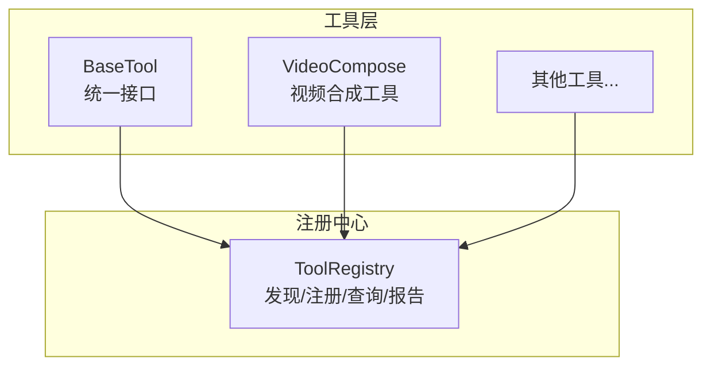
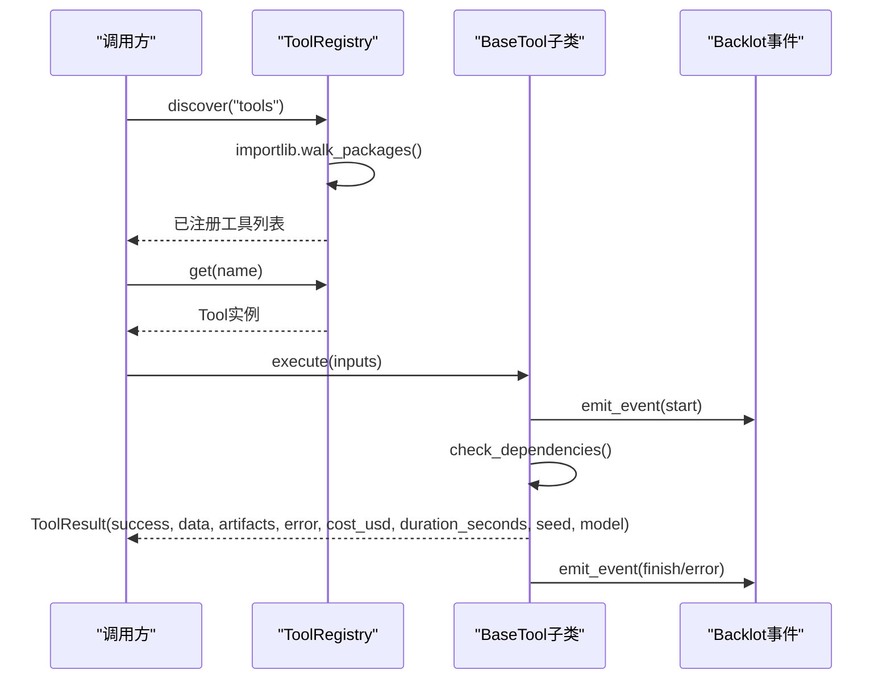
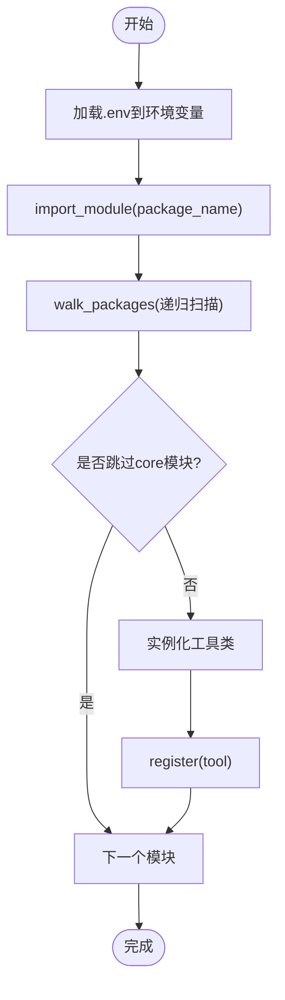
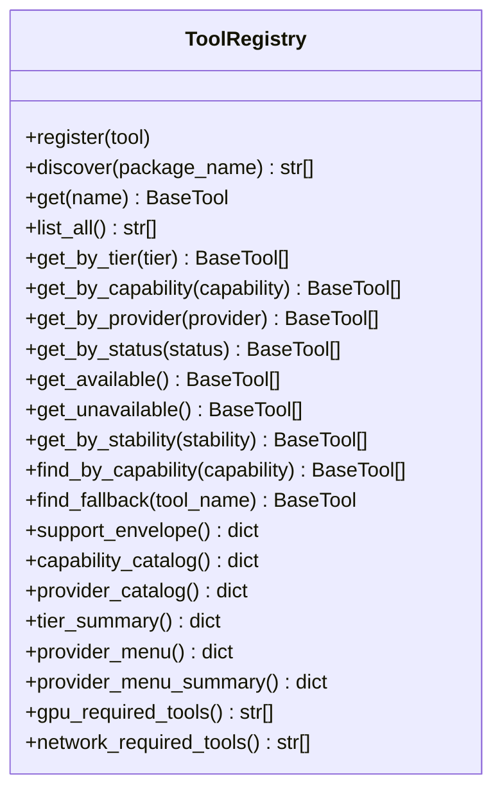
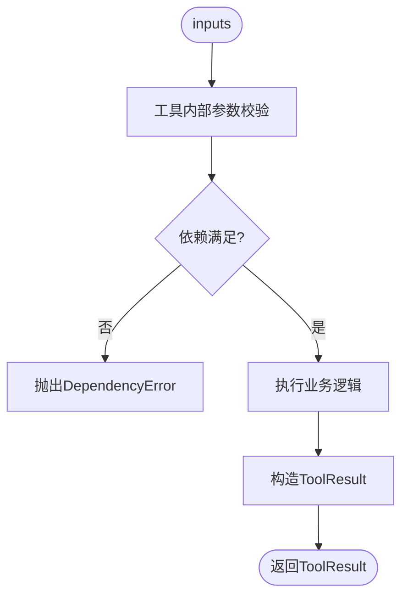
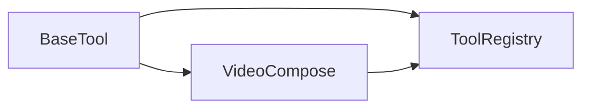

# 工具注册表API

<cite>
**本文引用的文件**
- [tools/tool_registry.py](file://tools/tool_registry.py)
- [tools/base_tool.py](file://tools/base_tool.py)
- [tools/video/video_compose.py](file://tools/video/video_compose.py)
- [tests/contracts/test_phase0_contracts.py](file://tests/contracts/test_phase0_contracts.py)
- [tests/tools/test_hyperframes_compose.py](file://tests/tools/test_hyperframes_compose.py)
</cite>

## 目录
1. [简介](#简介)
2. [项目结构](#项目结构)
3. [核心组件](#核心组件)
4. [架构总览](#架构总览)
5. [详细组件分析](#详细组件分析)
6. [依赖关系分析](#依赖关系分析)
7. [性能考虑](#性能考虑)
8. [故障排查指南](#故障排查指南)
9. [结论](#结论)
10. [附录](#附录)

## 简介
本文件面向OpenMontage的“工具注册表API”，提供统一的工具发现、注册、调用与元数据查询接口规范。文档覆盖：
- 工具发现与动态加载机制
- 工具注册与生命周期管理
- 统一调用协议（参数传递、结果返回、错误处理）
- 元数据获取、依赖关系查询、执行状态监控
- 工具开发指南与最佳实践
- Python与JavaScript SDK使用示例（基于仓库现有能力）
- 稳定性与可扩展性保障

## 项目结构
OpenMontage将工具以Python模块组织在tools目录下，通过工具注册表自动发现并统一管理。核心入口包括：
- BaseTool：所有工具的抽象基类，定义统一接口与契约
- ToolRegistry：工具注册中心，负责发现、注册、查询、汇总报告
- 具体工具实现：如video_compose等，继承BaseTool并提供execute实现

图表来源
- [tools/base_tool.py:227-397](file://tools/base_tool.py#L227-L397)
- [tools/tool_registry.py:55-134](file://tools/tool_registry.py#L55-L134)
- [tools/video/video_compose.py:58-78](file://tools/video/video_compose.py#L58-L78)

章节来源
- [tools/base_tool.py:227-397](file://tools/base_tool.py#L227-L397)
- [tools/tool_registry.py:55-134](file://tools/tool_registry.py#L55-L134)
- [tools/video/video_compose.py:58-78](file://tools/video/video_compose.py#L58-L78)

## 核心组件
- BaseTool：定义工具的统一契约，包括身份、依赖、能力、资源画像、重试策略、执行模式、确定性、恢复支持、副作用、回退工具、Agent技能引用、质量指标等；提供依赖检查、状态上报、成本/时长估算、幂等键计算、标准执行入口execute、干跑dry_run、子进程命令封装等。
- ToolResult：工具执行的标准返回结构，包含成功标志、数据、产物路径、错误信息、成本、耗时、随机种子、模型标识等。
- ToolRegistry：集中式工具注册中心，支持模块扫描发现、按层级/能力/提供商/状态/稳定性筛选、生成支持信封、能力目录、提供商菜单、能力摘要、GPU/网络需求清单等。

章节来源
- [tools/base_tool.py:63-139](file://tools/base_tool.py#L63-L139)
- [tools/base_tool.py:227-397](file://tools/base_tool.py#L227-L397)
- [tools/tool_registry.py:55-247](file://tools/tool_registry.py#L55-L247)

## 架构总览
工具注册表采用“约定优于配置”的动态发现模式：
- 启动时或按需discover包路径，导入所有工具模块，自动实例化并注册
- 每个工具声明其依赖、能力、运行时、资源需求等元数据
- 注册中心聚合元数据，提供多维查询与报表
- 调用方通过统一execute接口执行工具，返回标准化ToolResult
- Backlot事件系统对execute进行非侵入式埋点，记录start/finish/error，便于监控与审计

图表来源
- [tools/tool_registry.py:118-134](file://tools/tool_registry.py#L118-L134)
- [tools/base_tool.py:148-224](file://tools/base_tool.py#L148-L224)
- [tools/base_tool.py:296-397](file://tools/base_tool.py#L296-L397)

## 详细组件分析

### 工具发现与动态加载
- 自动发现：ToolRegistry.discover(package_name)会遍历指定包的子模块，跳过base_tool与tool_registry自身，实例化所有非抽象的BaseTool子类并注册
- .env加载：在导入阶段加载根目录.env到环境变量，确保工具可访问API密钥
- 去重与缓存：ensure_discovered保证同一包仅发现一次

图表来源
- [tools/tool_registry.py:86-134](file://tools/tool_registry.py#L86-L134)

章节来源
- [tools/tool_registry.py:86-134](file://tools/tool_registry.py#L86-L134)

### 工具注册与查询
- 注册：register(tool)要求name非空，存入内部字典
- 查询：get/list_all/get_by_tier/get_by_capability/get_by_provider/get_by_status/get_available/get_unavailable/get_by_stability/find_by_capability/find_fallback
- 报告：support_envelope/capability_catalog/provider_catalog/tier_summary/provider_menu/provider_menu_summary/gpu_required_tools/network_required_tools

图表来源
- [tools/tool_registry.py:55-247](file://tools/tool_registry.py#L55-L247)

章节来源
- [tools/tool_registry.py:55-247](file://tools/tool_registry.py#L55-L247)

### 统一调用协议（参数、结果、错误）
- 输入：execute(inputs: dict[str, Any])，由工具自行校验与解析
- 输出：ToolResult，包含success/data/artifacts/error/cost_usd/duration_seconds/seed/model
- 错误：异常会被instrument_execute捕获并写入事件；依赖缺失抛出DependencyError；子进程失败抛出ToolCommandError
- 干跑：dry_run用于预检成本/时长/可用性

图表来源
- [tools/base_tool.py:296-397](file://tools/base_tool.py#L296-L397)
- [tools/base_tool.py:456-481](file://tools/base_tool.py#L456-L481)

章节来源
- [tools/base_tool.py:296-397](file://tools/base_tool.py#L296-L397)
- [tools/base_tool.py:456-481](file://tools/base_tool.py#L456-L481)

### 元数据获取与能力目录
- get_info：返回工具完整契约信息，包括名称、版本、层级、能力、提供商、稳定性、状态、执行模式、确定性、运行时、模块路径、依赖、安装说明、能力列表、输入/输出/产物Schema、支持特性、最佳/不适用场景、提供商矩阵、资源画像、恢复支持、副作用、回退工具、Agent技能、用户可见验证项、质量评分、历史成功率、延迟中位数等
- capability_catalog/provider_catalog：按能力/提供商分组汇总
- provider_menu_summary：面向Agent的前置能力菜单摘要，包含组合运行时、能力配置情况、设置建议、运行时警告

章节来源
- [tools/base_tool.py:329-372](file://tools/base_tool.py#L329-L372)
- [tools/tool_registry.py:198-247](file://tools/tool_registry.py#L198-L247)
- [tools/tool_registry.py:316-471](file://tools/tool_registry.py#L316-L471)

### 依赖关系查询与健康状态
- dependencies：声明外部命令、二进制、环境变量、Python模块依赖
- check_dependencies：逐项校验，缺失则抛DependencyError
- get_status：根据check_dependencies结果返回AVAILABLE/UNAVAILABLE/DEGRADED
- gpu_required_tools/network_required_tools：快速识别需要GPU或网络的工具

章节来源
- [tools/base_tool.py:304-327](file://tools/base_tool.py#L304-L327)
- [tools/base_tool.py:296-303](file://tools/base_tool.py#L296-L303)
- [tools/tool_registry.py:476-488](file://tools/tool_registry.py#L476-L488)

### 执行状态监控与可观测性
- instrument_execute：对execute进行装饰，自动发射start/finish/error事件，记录工具名、场景ID、深度、输出路径、成功与否、成本、耗时等
- 事件写入失败不影响工具执行（非致命）

章节来源
- [tools/base_tool.py:148-224](file://tools/base_tool.py#L148-L224)

### 工具示例：VideoCompose
- 能力：compose/render/remotion_render/burn_subtitles/overlay/encode
- 输入Schema：operation为必填枚举，附带input_path/output_path/edit_decisions/asset_manifest/proposal_packet等
- 运行时：依赖ffmpeg，支持Remotion/HyperFrames/FFmpeg多种后端路由
- 资源与重试：定义了ResourceProfile与RetryPolicy字段（由基类提供）

章节来源
- [tools/video/video_compose.py:58-78](file://tools/video/video_compose.py#L58-L78)
- [tools/video/video_compose.py:80-200](file://tools/video/video_compose.py#L80-L200)

## 依赖关系分析
- BaseTool是所有工具的基类，提供统一接口与行为
- ToolRegistry依赖BaseTool的类型与枚举，负责发现与聚合
- VideoCompose等具体工具继承BaseTool，并通过ToolRegistry暴露给上层编排器
- 测试用例验证了注册、发现、状态、执行与事件的正确性

图表来源
- [tools/base_tool.py:227-397](file://tools/base_tool.py#L227-L397)
- [tools/tool_registry.py:55-134](file://tools/tool_registry.py#L55-L134)
- [tools/video/video_compose.py:58-78](file://tools/video/video_compose.py#L58-L78)

章节来源
- [tests/contracts/test_phase0_contracts.py:407-475](file://tests/contracts/test_phase0_contracts.py#L407-L475)
- [tests/tools/test_hyperframes_compose.py:312-348](file://tests/tools/test_hyperframes_compose.py#L312-L348)

## 性能考虑
- 动态发现仅在首次或显式调用时执行，避免重复导入开销
- instrument_execute为轻量包装，事件写入失败不阻塞主流程
- 工具应合理声明resource_profile与retry_policy，避免过度资源占用
- 长耗时工具可通过estimate_runtime提供预估，便于前端展示与调度

[本节为通用指导，无需特定文件引用]

## 故障排查指南
- 依赖缺失：check_dependencies抛出DependencyError，get_status返回UNAVAILABLE；检查dependencies声明与环境变量/命令是否存在
- 子进程错误：run_command捕获CalledProcessError并转换为ToolCommandError，包含returncode/cmd/stderr/stdout/detail
- 事件埋点异常：instrument_execute内部try/except包裹，异常被吞掉，不影响工具执行
- 能力菜单异常：provider_menu_summary需包含composition_runtimes/capabilities/setup_offers/runtime_warnings四个字段，测试用例验证其形状稳定

章节来源
- [tools/base_tool.py:304-327](file://tools/base_tool.py#L304-L327)
- [tools/base_tool.py:456-481](file://tools/base_tool.py#L456-L481)
- [tools/base_tool.py:148-224](file://tools/base_tool.py#L148-L224)
- [tests/tools/test_hyperframes_compose.py:312-348](file://tests/tools/test_hyperframes_compose.py#L312-L348)

## 结论
OpenMontage的工具注册表API通过BaseTool与ToolRegistry实现了统一的工具契约、动态发现、元数据聚合与可观测性。调用方可以安全地查询能力、执行工具并获取标准化结果与监控事件。该设计具备良好的扩展性与稳定性，适合持续演进的工具生态。

[本节为总结性内容，无需特定文件引用]

## 附录

### 统一API参考（工具注册表）
- 发现与注册
  - discover(package_name="tools"): 扫描并注册工具，返回已注册工具名列表
  - register(tool): 手动注册工具实例
  - ensure_discovered(package_name="tools"): 确保已发现
- 查询
  - get(name): 按名称获取工具
  - list_all(): 列出所有工具名
  - get_by_tier(tier): 按层级筛选
  - get_by_capability(capability): 按能力家族筛选
  - get_by_provider(provider): 按提供商筛选
  - get_by_status(status): 按状态筛选
  - get_available()/get_unavailable(): 可用/不可用工具
  - get_by_stability(stability): 按稳定性筛选
  - find_by_capability(capability): 查找声明某能力的工具
  - find_fallback(tool_name): 查找可用的回退工具
- 报告
  - support_envelope(): 全量工具契约+状态
  - capability_catalog(): 按能力分组
  - provider_catalog(): 按提供商分组
  - tier_summary(): 层级统计
  - provider_menu(): 能力维度的提供商菜单
  - provider_menu_summary(): 前置能力菜单摘要
  - gpu_required_tools()/network_required_tools(): 资源需求清单

章节来源
- [tools/tool_registry.py:55-247](file://tools/tool_registry.py#L55-L247)
- [tools/tool_registry.py:316-471](file://tools/tool_registry.py#L316-L471)
- [tools/tool_registry.py:476-488](file://tools/tool_registry.py#L476-L488)

### 统一API参考（工具基类）
- 身份与元数据
  - name/version/tier/stability/execution_mode/determinism/runtime
  - dependencies/install_instructions/capabilities/input_schema/output_schema/artifact_schema/supports/best_for/not_good_for/provider_matrix
  - resource_profile/retry_policy/resume_support/idempotency_key_fields/side_effects/fallback/fallback_tools/agent_skills/user_visible_verification/quality_score/historical_success_rate/latency_p50_seconds
- 健康与依赖
  - get_status()/check_dependencies()
- 执行
  - execute(inputs): 必须实现
  - dry_run(inputs): 预检
  - run_command(cmd, timeout=None, cwd=None): 子进程封装
- 成本与幂等
  - estimate_cost(inputs)/estimate_runtime(inputs)
  - idempotency_key(inputs)

章节来源
- [tools/base_tool.py:63-139](file://tools/base_tool.py#L63-L139)
- [tools/base_tool.py:227-397](file://tools/base_tool.py#L227-L397)
- [tools/base_tool.py:411-454](file://tools/base_tool.py#L411-L454)

### 工具开发指南与最佳实践
- 继承BaseTool，实现execute并返回ToolResult
- 明确声明dependencies（cmd:/binary:/env:/python:），并在install_instructions提供安装指引
- 定义capabilities与input_schema/output_schema，便于上游编排与校验
- 合理设置resource_profile与retry_policy，避免资源争用与失败风暴
- 如需外部API，优先通过环境变量注入密钥，避免硬编码
- 利用dry_run提供成本/时长预估，提升用户体验
- 遵循幂等键字段设计，减少重复执行
- 关注get_status与check_dependencies，确保工具可用性可被检测
- 在execute中尽量保持无副作用或明确side_effects，便于编排器决策

章节来源
- [tools/base_tool.py:227-397](file://tools/base_tool.py#L227-L397)
- [tools/base_tool.py:304-327](file://tools/base_tool.py#L304-L327)

### Python SDK使用示例
- 发现与注册
  - 从tools包自动发现并注册所有工具
  - 通过registry.get(name)获取工具实例
- 执行工具
  - 调用tool.execute(inputs)，获取ToolResult
  - 检查result.success与result.error，读取result.data与result.artifacts
- 查询能力
  - 使用registry.support_envelope()或registry.provider_menu_summary()了解当前环境可用能力
- 监控
  - 若存在Backlot事件，execute会自动记录start/finish/error

章节来源
- [tools/tool_registry.py:118-134](file://tools/tool_registry.py#L118-L134)
- [tools/base_tool.py:148-224](file://tools/base_tool.py#L148-L224)
- [tests/contracts/test_phase0_contracts.py:407-475](file://tests/contracts/test_phase0_contracts.py#L407-L475)

### JavaScript SDK使用示例
- 工具注册表为Python侧能力，JS端可通过HTTP/Webhook方式间接调用
- 服务端实现Webhook接收请求，解析parameters，调用Python工具或业务服务，返回结构化结果
- 客户端可在浏览器执行JS更新UI或触发交互

章节来源
- [.agents/skills/agents/references/client-tools.md:183-216](file://.agents/skills/agents/references/client-tools.md#L183-L216)
- [.agents/skills/agents/references/client-tools.md:439-476](file://.agents/skills/agents/references/client-tools.md#L439-L476)