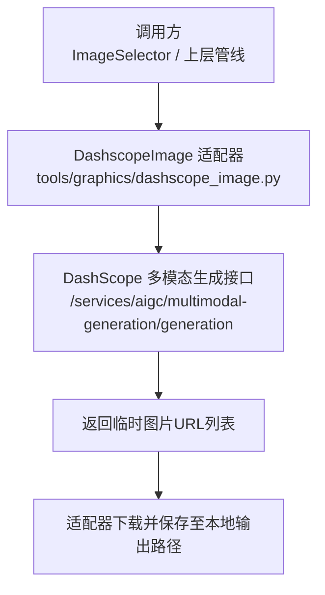
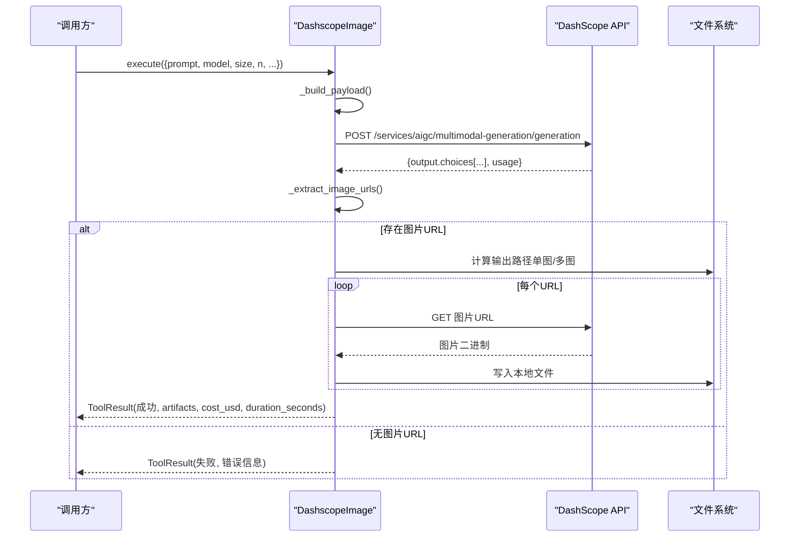
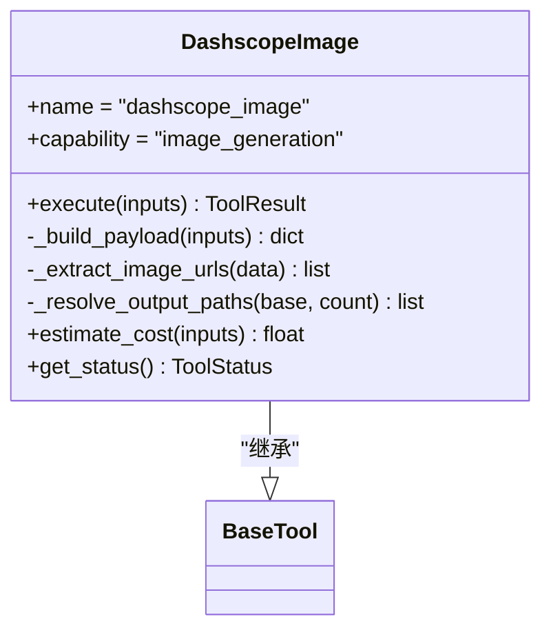

# DashScope图像生成适配器

<cite>
**本文引用的文件**
- [tools/graphics/dashscope_image.py](file://tools/graphics/dashscope_image.py)
- [.agents/skills/dashscope/SKILL.md](file://.agents/skills/dashscope/SKILL.md)
- [tests/contracts/test_dashscope_tools.py](file://tests/contracts/test_dashscope_tools.py)
- [docs/PROVIDERS.md](file://docs/PROVIDERS.md)
</cite>

## 目录
1. [简介](#简介)
2. [项目结构](#项目结构)
3. [核心组件](#核心组件)
4. [架构总览](#架构总览)
5. [详细组件分析](#详细组件分析)
6. [依赖关系分析](#依赖关系分析)
7. [性能与限流](#性能与限流)
8. [故障排查指南](#故障排查指南)
9. [结论](#结论)
10. [附录：API调用示例与最佳实践](#附录api调用示例与最佳实践)

## 简介
本文件为OpenMontage中DashScope（阿里云百炼）图像生成适配器的完整技术文档。内容涵盖：
- 支持的图像模型、分辨率选项与风格控制参数
- 文本转图像、批量处理流程与结果下载
- 认证配置、请求重试机制与错误处理
- 成本控制策略、质量评估与优化建议
- 与阿里云生态的集成方式与数据安全注意事项

该适配器通过DashScope原生多模态生成接口实现高质量图像生成，并内置幂等键、重试策略与成本估算，便于在视频制作流水线中稳定使用。

## 项目结构
- 适配器实现位于 tools/graphics/dashscope_image.py，封装了DashScope图像生成的输入构造、网络请求、结果解析与本地落盘。
- 技能说明位于 .agents/skills/dashscope/SKILL.md，提供统一的使用指引、端点与参数说明。
- 契约测试位于 tests/contracts/test_dashscope_tools.py，覆盖默认模型、尺寸格式、负载结构、幂等键字段、多图下载等关键行为。
- 提供者概览与定价参考位于 docs/PROVIDERS.md，给出DashScope工具解锁、环境变量与计费参考。

图表来源
- [tools/graphics/dashscope_image.py:127-211](file://tools/graphics/dashscope_image.py#L127-L211)
- [.agents/skills/dashscope/SKILL.md:16-26](file://.agents/skills/dashscope/SKILL.md#L16-L26)

章节来源
- [tools/graphics/dashscope_image.py:29-125](file://tools/graphics/dashscope_image.py#L29-L125)
- [.agents/skills/dashscope/SKILL.md:1-26](file://.agents/skills/dashscope/SKILL.md#L1-L26)

## 核心组件
- 类名：DashscopeImage
- 能力：image_generation、generate_image、text_to_image
- 运行时：API（同步执行）
- 稳定性：实验性
- 支持特性：多图输出、宽高比、分辨率、负向提示、种子、幂等键
- 回退策略：grok_image、openai_image、flux_image、recraft_image

关键要点
- 默认模型：qwen-image-2.0-pro；可选 qwen-image-max、wan2.7-image、z-image-turbo
- 尺寸格式：W*H（星号分隔），如 "1024*1024"、"2048*2048"、"2688*1536"
- 批量数量：n 范围 1-6
- 负向提示：negative_prompt（最大长度限制由平台约束）
- 提示扩展：prompt_extend（默认开启，自动改写以提升效果）
- 水印：watermark（默认关闭）
- 种子：seed（用于可重复性）
- 输出路径：output_path（单图保持原路径；多图追加索引后缀）

章节来源
- [tools/graphics/dashscope_image.py:29-125](file://tools/graphics/dashscope_image.py#L29-L125)
- [tests/contracts/test_dashscope_tools.py:197-241](file://tests/contracts/test_dashscope_tools.py#L197-L241)

## 架构总览
适配器采用“构建负载—发送请求—解析响应—下载资源—落盘”的标准流程，并通过幂等键与重试策略提升鲁棒性。

图表来源
- [tools/graphics/dashscope_image.py:143-211](file://tools/graphics/dashscope_image.py#L143-L211)
- [tools/graphics/dashscope_image.py:213-267](file://tools/graphics/dashscope_image.py#L213-L267)

章节来源
- [tools/graphics/dashscope_image.py:127-211](file://tools/graphics/dashscope_image.py#L127-L211)

## 详细组件分析

### 输入与负载构建
- 输入schema定义：包含 prompt、model、size、n、negative_prompt、prompt_extend、watermark、seed、output_path
- 负载结构：{model, input: {messages: [{role: "user", content: [{text: prompt}]}]}, parameters: {size, n, prompt_extend, watermark, negative_prompt?, seed?}}
- 尺寸必须使用星号分隔的 W*H 格式

章节来源
- [tools/graphics/dashscope_image.py:64-101](file://tools/graphics/dashscope_image.py#L64-L101)
- [tools/graphics/dashscope_image.py:244-267](file://tools/graphics/dashscope_image.py#L244-L267)
- [tests/contracts/test_dashscope_tools.py:218-241](file://tests/contracts/test_dashscope_tools.py#L218-L241)

### 响应解析与多图下载
- 从 output.choices 中收集 finish_reason == "stop" 的条目，提取 message.content 中的 image URL
- 对每个URL发起GET下载，并保存到本地路径；单图保持原路径，多图追加 _1、_2 等索引
- 若未返回任何图片URL，视为失败

章节来源
- [tools/graphics/dashscope_image.py:213-242](file://tools/graphics/dashscope_image.py#L213-L242)
- [tests/contracts/test_dashscope_tools.py:261-339](file://tests/contracts/test_dashscope_tools.py#L261-L339)

### 幂等键与重试策略
- 幂等键字段：prompt、model、size、n、negative_prompt、seed、prompt_extend、watermark
- 重试策略：最多重试2次，可重试错误包括 rate_limit、timeout
- 安全脱敏：错误消息中会替换掉DASHSCOPE_API_KEY，避免泄露

章节来源
- [tools/graphics/dashscope_image.py:106-122](file://tools/graphics/dashscope_image.py#L106-L122)
- [tools/graphics/dashscope_image.py:269-273](file://tools/graphics/dashscope_image.py#L269-L273)
- [tests/contracts/test_dashscope_tools.py:436-476](file://tests/contracts/test_dashscope_tools.py#L436-L476)

### 成本估算与资源画像
- 成本估算：按图片数量线性估算（保守估计约$0.02/张，具体以控制台为准）
- 资源画像：CPU 1核、内存512MB、显存0MB、磁盘100MB、需要网络

章节来源
- [tools/graphics/dashscope_image.py:103-141](file://tools/graphics/dashscope_image.py#L103-L141)
- [docs/PROVIDERS.md:283-290](file://docs/PROVIDERS.md#L283-L290)

### 状态检测与可用性
- 当环境变量 DASHSCOPE_API_KEY 存在时，工具状态为可用；否则不可用

章节来源
- [tools/graphics/dashscope_image.py:132-135](file://tools/graphics/dashscope_image.py#L132-L135)
- [tests/contracts/test_dashscope_tools.py:117-125](file://tests/contracts/test_dashscope_tools.py#L117-L125)

## 依赖关系分析
- 外部依赖：requests（在网络请求阶段按需导入，避免模块加载时的冷启动开销）
- 内部依赖：BaseTool、ToolResult、ResourceProfile、RetryPolicy 等基础工具类型
- 注册发现：通过 provider="dashscope" 与 capability="image_generation" 被图像选择器自动发现

图表来源
- [tools/graphics/dashscope_image.py:15-39](file://tools/graphics/dashscope_image.py#L15-L39)
- [tools/graphics/dashscope_image.py:29-125](file://tools/graphics/dashscope_image.py#L29-L125)

章节来源
- [tools/graphics/dashscope_image.py:15-39](file://tools/graphics/dashscope_image.py#L15-L39)
- [tests/contracts/test_dashscope_tools.py:683-709](file://tests/contracts/test_dashscope_tools.py#L683-L709)

## 性能与限流
- 超时设置：请求超时180秒，下载超时120秒
- 重试策略：针对 rate_limit、timeout 进行最多2次重试
- 并发与限流：适配器层未内置并发控制；建议在调用侧根据DashScope配额与速率限制进行节流（例如队列或限速器）
- 批量策略：n=1~6，建议分批次提交以避免单次过大负载

章节来源
- [tools/graphics/dashscope_image.py:106-108](file://tools/graphics/dashscope_image.py#L106-L108)
- [tools/graphics/dashscope_image.py:156-184](file://tools/graphics/dashscope_image.py#L156-L184)

## 故障排查指南
常见问题与定位方法
- 未设置API密钥：检查环境变量 DASHSCOPE_API_KEY；工具状态将显示不可用
- 尺寸格式错误：确保使用 W*H（星号分隔），如 "1024*1024"
- 无图片URL返回：检查响应 choices 的 finish_reason 是否为 "stop"；过滤非停止项
- 下载失败：确认临时URL仍有效（通常有效期约24小时），并检查网络连通性
- 错误日志含密钥：适配器已对错误消息进行脱敏，若仍出现请检查上游日志

章节来源
- [tools/graphics/dashscope_image.py:143-193](file://tools/graphics/dashscope_image.py#L143-L193)
- [tools/graphics/dashscope_image.py:213-229](file://tools/graphics/dashscope_image.py#L213-L229)
- [.agents/skills/dashscope/SKILL.md:125-133](file://.agents/skills/dashscope/SKILL.md#L125-L133)

## 结论
DashScope图像生成适配器提供了稳定、可扩展的文本转图像能力，支持多种Qwen-Image模型、灵活的分辨率与风格控制参数，并通过幂等键与重试策略保障生产环境的可靠性。结合成本估算与资源画像，可在视频制作流水线中高效集成，同时遵循数据安全与合规要求。

## 附录：API调用示例与最佳实践

### 认证与环境配置
- 环境变量：DASHSCOPE_API_KEY
- 获取方式：在阿里云DashScope控制台创建并复制API Key
- 认证头：Authorization: Bearer $DASHSCOPE_API_KEY

章节来源
- [.agents/skills/dashscope/SKILL.md:8-14](file://.agents/skills/dashscope/SKILL.md#L8-L14)
- [docs/PROVIDERS.md:260-268](file://docs/PROVIDERS.md#L260-L268)

### 文本转图像（单图）
- 输入：prompt、model（默认 qwen-image-2.0-pro）、size（默认 "1024*1024"）、output_path
- 行为：调用多模态生成接口，解析并下载图片到指定路径

章节来源
- [tools/graphics/dashscope_image.py:64-101](file://tools/graphics/dashscope_image.py#L64-L101)
- [tools/graphics/dashscope_image.py:143-211](file://tools/graphics/dashscope_image.py#L143-L211)

### 批量处理（多图）
- 输入：n（1-6）
- 行为：为每个返回的URL生成独立输出文件，文件名追加索引（如 shot_1.png、shot_2.png）

章节来源
- [tools/graphics/dashscope_image.py:175-184](file://tools/graphics/dashscope_image.py#L175-L184)
- [tools/graphics/dashscope_image.py:231-242](file://tools/graphics/dashscope_image.py#L231-L242)
- [tests/contracts/test_dashscope_tools.py:340-387](file://tests/contracts/test_dashscope_tools.py#L340-L387)

### 图像编辑
- 当前适配器不支持图像编辑；如需编辑请使用回退工具 grok_image（edit模式）

章节来源
- [tools/graphics/dashscope_image.py:45-47](file://tools/graphics/dashscope_image.py#L45-L47)
- [tools/graphics/dashscope_image.py:62](file://tools/graphics/dashscope_image.py#L62)

### 成本控制与优化建议
- 成本估算：按图片数量线性估算（约$0.02/张），实际以控制台为准
- 优化建议：
  - 先小批量试跑，确认模型与尺寸满足需求后再扩大批量
  - 合理使用 prompt_extend（默认开启）以获得更好效果；如需严格遵循原始提示可关闭
  - 使用 seed 提高可重复性，但注意提示变化可能影响一致性
  - 合理设置 n，避免单次过多导致超时或限流
  - 监控usage字段并结合控制台账单进行成本核对

章节来源
- [tools/graphics/dashscope_image.py:137-141](file://tools/graphics/dashscope_image.py#L137-L141)
- [docs/PROVIDERS.md:283-290](file://docs/PROVIDERS.md#L283-L290)

### 质量评估与提示工程
- 提示建议：
  - 明确场景、主体、环境与光影细节
  - 避免在提示中直接要求文字（AI图像模型对文字渲染不稳定）
  - 使用负向提示排除不需要的元素（如模糊、多余背景）
- 质量评估：
  - 首先生成少量样图，评估构图、风格与分辨率
  - 基于样图迭代调整提示词与参数，再批量生成

章节来源
- [skills/creative/image-gen-usage.md:150-169](file://skills/creative/image-gen-usage.md#L150-L169)

### 数据安全与合规
- 密钥保护：不要将API密钥打印到日志或写入工件；错误消息已做脱敏处理
- 数据流转：图片URL为临时链接（约24小时），需及时下载到本地存储
- 合规建议：遵循阿里云DashScope服务条款与数据隐私政策

章节来源
- [.agents/skills/dashscope/SKILL.md:134-137](file://.agents/skills/dashscope/SKILL.md#L134-L137)
- [tools/graphics/dashscope_image.py:269-273](file://tools/graphics/dashscope_image.py#L269-L273)