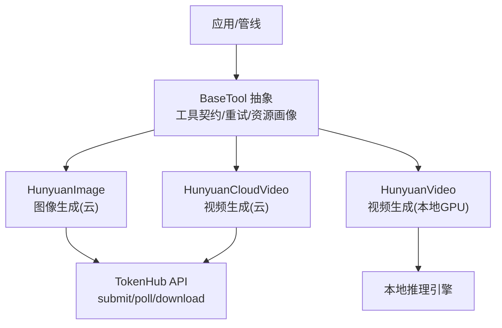
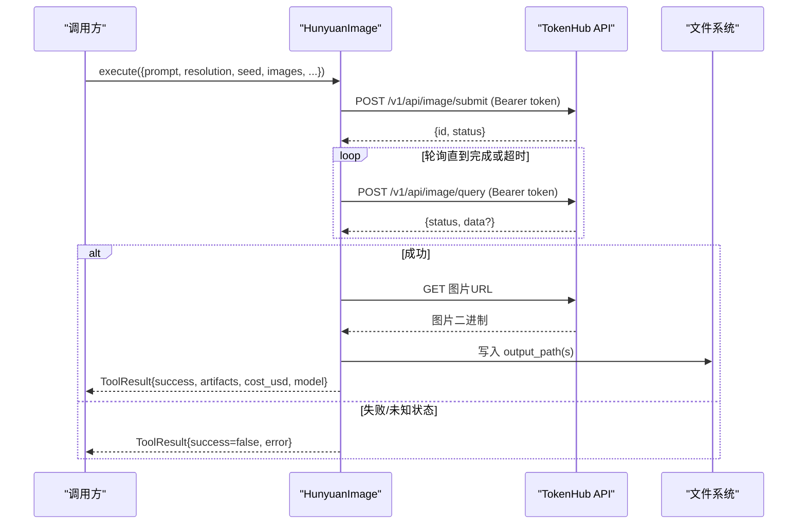
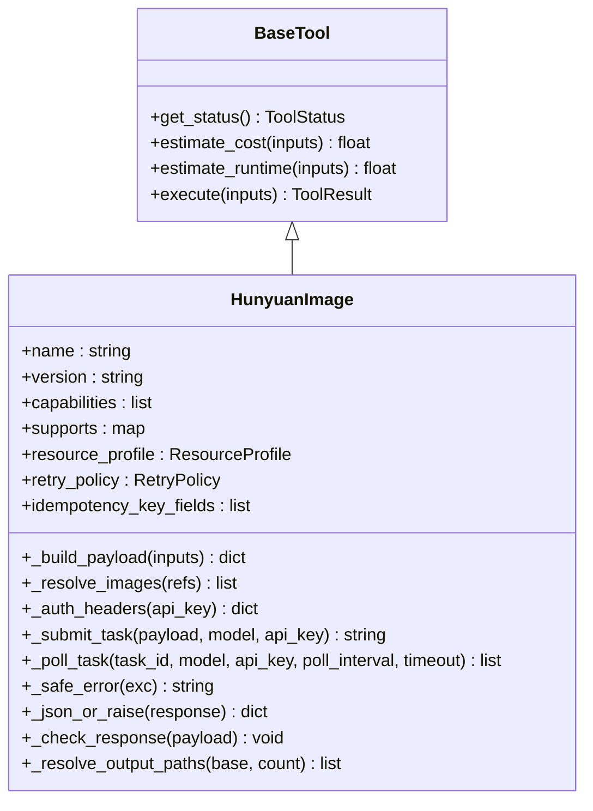
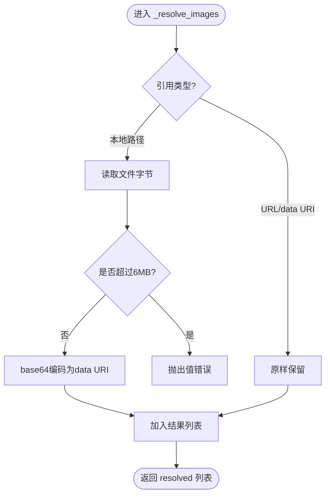
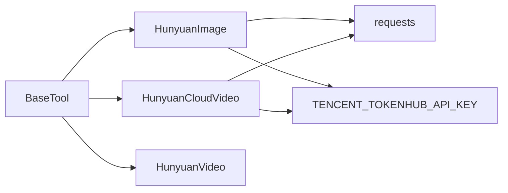

# Hunyuan图像生成适配器

<cite>
**本文引用的文件**
- [tools/graphics/hunyuan_image.py](file://tools/graphics/hunyuan_image.py)
- [tests/tools/test_hunyuan_image.py](file://tests/tools/test_hunyuan_image.py)
- [tools/video/hunyuan_cloud_video.py](file://tools/video/hunyuan_cloud_video.py)
- [tools/video/hunyuan_video.py](file://tools/video/hunyuan_video.py)
- [tools/base_tool.py](file://tools/base_tool.py)
- [docs/PROVIDERS.md](file://docs/PROVIDERS.md)
</cite>

## 目录
1. [简介](#简介)
2. [项目结构](#项目结构)
3. [核心组件](#核心组件)
4. [架构总览](#架构总览)
5. [详细组件分析](#详细组件分析)
6. [依赖关系分析](#依赖关系分析)
7. [性能与成本优化](#性能与成本优化)
8. [故障排查指南](#故障排查指南)
9. [结论](#结论)
10. [附录：API调用示例与最佳实践](#附录api调用示例与最佳实践)

## 简介
本文件面向“腾讯混元（Hunyuan）图像生成适配器”的集成与使用，聚焦于通过腾讯云 TokenHub API 接入混元生图模型的能力。文档涵盖：
- 能力概览与技术优势：中文提示词理解、Bearer 令牌鉴权、直接消耗腾讯云配额、异步提交-轮询-下载流程。
- 支持的图像模型与参数：分辨率、种子、参考图、提示词改写、水印控制等。
- SDK 集成要点：环境变量配置、状态检查、重试策略、幂等键。
- 并发与资源管理：网络请求、超时与轮询间隔、输出路径与多图命名。
- 成本控制：按积分计费估算与预算规划。
- 与企业级部署结合：统一工具契约、可观测性事件、回退工具链。

## 项目结构
围绕 Hunyuan 图像生成的关键代码位于图形工具模块，配套测试覆盖元数据、载荷构造、错误处理与端到端流程；视频适配器提供同构的 TokenHub 接入模式，便于横向对比与复用。

图表来源
- [tools/graphics/hunyuan_image.py:42-80](file://tools/graphics/hunyuan_image.py#L42-L80)
- [tools/video/hunyuan_cloud_video.py:43-80](file://tools/video/hunyuan_cloud_video.py#L43-L80)
- [tools/video/hunyuan_video.py:22-50](file://tools/video/hunyuan_video.py#L22-L50)
- [tools/base_tool.py:63-139](file://tools/base_tool.py#L63-L139)

章节来源
- [tools/graphics/hunyuan_image.py:1-80](file://tools/graphics/hunyuan_image.py#L1-L80)
- [tools/video/hunyuan_cloud_video.py:1-80](file://tools/video/hunyuan_cloud_video.py#L1-L80)
- [tools/video/hunyuan_video.py:1-50](file://tools/video/hunyuan_video.py#L1-L50)
- [tools/base_tool.py:1-139](file://tools/base_tool.py#L1-L139)

## 核心组件
- HunyuanImage（图像生成）
  - 提供者：hunyuan_cloud
  - 能力：文本生成图像、支持参考图、自定义分辨率、种子、提示词改写、水印控制
  - 运行方式：API（异步），需网络
  - 认证：环境变量 TENCENT_TOKENHUB_API_KEY
  - 重试：最多2次，指数退避，针对限流/超时
  - 幂等键字段：prompt、resolution、images、seed、revise、logo_add、logo_param
  - 资源画像：CPU 1核、内存 512MB、显存 0、磁盘 100MB、需要网络
- HunyuanCloudVideo（视频生成，云）
  - 提供者：hunyuan_cloud
  - 能力：文本转视频、图像转视频
  - 运行方式：API（异步），需网络
  - 认证：同上
  - 重试：同上
  - 幂等键字段：prompt、operation、model、image_url、image_path、resolution、logo_add
- HunyuanVideo（视频生成，本地GPU）
  - 运行方式：本地 GPU，离线可用
  - 能力：文本转视频、图像转视频
  - 资源需求较高（CPU/RAM/VRAM/Disk）

章节来源
- [tools/graphics/hunyuan_image.py:42-80](file://tools/graphics/hunyuan_image.py#L42-L80)
- [tools/video/hunyuan_cloud_video.py:43-80](file://tools/video/hunyuan_cloud_video.py#L43-L80)
- [tools/video/hunyuan_video.py:22-50](file://tools/video/hunyuan_video.py#L22-L50)

## 架构总览
Hunyuan 图像生成采用“提交任务 → 轮询状态 → 下载结果”的异步模式，所有网络请求均通过 Bearer 令牌鉴权，无需复杂签名。

图表来源
- [tools/graphics/hunyuan_image.py:278-330](file://tools/graphics/hunyuan_image.py#L278-L330)
- [tools/graphics/hunyuan_image.py:432-523](file://tools/graphics/hunyuan_image.py#L432-L523)

## 详细组件分析

### HunyuanImage 类分析
- 职责：封装混元生图 3.0 的 TokenHub 调用，负责载荷构建、鉴权、提交、轮询、下载与落盘。
- 输入参数要点：
  - prompt：必填，最大长度限制，支持中英文
  - images：参考图数组，最多3张，支持 URL、data URI、本地路径（自动 base64 编码为 data URI）
  - resolution：W:H 格式，范围与乘积约束
  - seed：随机种子
  - revise：提示词改写开关（默认开启，增加约20秒处理）
  - logo_add/logo_param：水印开关与自定义水印设置
  - output_path：必填输出路径（防止误写项目根目录）
  - poll_interval_seconds/timeout_seconds：轮询间隔与超时
- 输出：包含 provider、route、model、task_id、output(s)、cost_usd、duration_seconds 等
- 错误处理：
  - 缺失 API Key 时返回不可用
  - 非 JSON 响应抛出异常
  - 任务状态异常（failed/未知状态）抛出异常
  - 安全脱敏：异常消息中隐藏 API Key

图表来源
- [tools/base_tool.py:63-139](file://tools/base_tool.py#L63-L139)
- [tools/graphics/hunyuan_image.py:42-208](file://tools/graphics/hunyuan_image.py#L42-L208)
- [tools/graphics/hunyuan_image.py:336-581](file://tools/graphics/hunyuan_image.py#L336-L581)

章节来源
- [tools/graphics/hunyuan_image.py:42-208](file://tools/graphics/hunyuan_image.py#L42-L208)
- [tools/graphics/hunyuan_image.py:278-330](file://tools/graphics/hunyuan_image.py#L278-L330)
- [tools/graphics/hunyuan_image.py:336-581](file://tools/graphics/hunyuan_image.py#L336-L581)

### 载荷构建与参考图解析
- 载荷字段映射遵循 TokenHub 的 snake_case 风格（如 Resolution→resolution）。
- 参考图解析规则：
  - HTTP(S) URL 原样透传
  - data URI 原样透传
  - 本地文件路径读取并 base64 编码为 data URI，限制原始大小不超过约6MB，MIME 类型根据扩展名推断
- 输出路径解析：单图保持原名，多图插入索引（如 img_1.png、img_2.png）

图表来源
- [tools/graphics/hunyuan_image.py:374-418](file://tools/graphics/hunyuan_image.py#L374-L418)

章节来源
- [tools/graphics/hunyuan_image.py:336-418](file://tools/graphics/hunyuan_image.py#L336-L418)

### 视频适配器对比（云/本地）
- 云视频（HunyuanCloudVideo）：
  - 支持文本转视频与图像转视频
  - 模型选择：hy-video-1.5（T2V）、yt-video-2.0（I2V）
  - 分辨率：720p/1080p
  - 水印：logo_add
  - 费用估算：按模型与分辨率不同积分计价
- 本地视频（HunyuanVideo）：
  - 本地 GPU 推理，无网络
  - 资源需求高（CPU/RAM/VRAM/Disk）
  - 适合团队统一基线场景

章节来源
- [tools/video/hunyuan_cloud_video.py:82-159](file://tools/video/hunyuan_cloud_video.py#L82-L159)
- [tools/video/hunyuan_video.py:52-75](file://tools/video/hunyuan_video.py#L52-L75)

## 依赖关系分析
- 外部依赖：
  - requests：HTTP 客户端，用于 submit/poll/download
  - 环境变量：TENCENT_TOKENHUB_API_KEY
- 内部依赖：
  - BaseTool：统一工具契约、重试策略、资源画像、执行模式、确定性、运行时类型
  - ToolRegistry/ToolResult：工具注册与标准返回结构
- 耦合与内聚：
  - 图像与视频适配器共享 TokenHub 交互模式，但各自维护独立载荷与模型标识
  - 错误处理与安全脱敏方法集中且可复用

图表来源
- [tools/base_tool.py:63-139](file://tools/base_tool.py#L63-L139)
- [tools/graphics/hunyuan_image.py:21-32](file://tools/graphics/hunyuan_image.py#L21-L32)
- [tools/video/hunyuan_cloud_video.py:21-32](file://tools/video/hunyuan_cloud_video.py#L21-L32)

章节来源
- [tools/base_tool.py:63-139](file://tools/base_tool.py#L63-L139)
- [tools/graphics/hunyuan_image.py:21-32](file://tools/graphics/hunyuan_image.py#L21-L32)
- [tools/video/hunyuan_cloud_video.py:21-32](file://tools/video/hunyuan_cloud_video.py#L21-L32)

## 性能与成本优化
- 性能调优
  - 轮询间隔与超时：合理设置 poll_interval_seconds 与 timeout_seconds，避免频繁轮询导致限流
  - 参考图大小：本地图控制在约6MB以内，减少传输与编码开销
  - 提示词改写：revise=1 会增加约20秒处理时间，按需关闭以提升吞吐
  - 并发控制：基于 BaseTool 的重试策略与执行模式，建议在上层队列中控制并发度，避免触发 TokenHub 限流
- 资源管理
  - 资源画像：图像生成仅需少量 CPU/内存，不占用显存；视频本地模式需较大 VRAM
  - 输出路径：强制指定 output_path，避免误写项目根目录
- 成本控制
  - 图像：约0.5 credits/图，换算美元约$0.08
  - 视频：按模型与分辨率不同积分计价，例如 hy-video-1.5 约1.5 credits，yt-video-2.0 480p/720p/1080p 不同积分
  - 建议在流水线中记录 cost_usd 与 duration_seconds，进行预算监控与归因

章节来源
- [tools/graphics/hunyuan_image.py:230-248](file://tools/graphics/hunyuan_image.py#L230-L248)
- [tools/video/hunyuan_cloud_video.py:207-241](file://tools/video/hunyuan_cloud_video.py#L207-L241)
- [docs/PROVIDERS.md:584-630](file://docs/PROVIDERS.md#L584-L630)

## 故障排查指南
- 常见错误与定位
  - 未设置 API Key：get_status 返回不可用，execute 返回错误提示
  - 非 JSON 响应：抛出“Non-JSON response from TokenHub API”
  - 任务失败：轮询返回 failed，提取 error.message 定位原因
  - 未知状态：抛出“unknown status”，检查上游状态枚举
  - 参考图过大：抛出“too large”，压缩或降低分辨率
  - 缺少 output_path：直接拒绝执行，防止误写
- 安全与日志
  - 异常消息会脱敏 API Key，避免泄露
  - 建议记录 task_id、model、resolution、revise、logo_add 等上下文以便复现

章节来源
- [tools/graphics/hunyuan_image.py:225-269](file://tools/graphics/hunyuan_image.py#L225-L269)
- [tools/graphics/hunyuan_image.py:529-561](file://tools/graphics/hunyuan_image.py#L529-L561)
- [tests/tools/test_hunyuan_image.py:68-95](file://tests/tools/test_hunyuan_image.py#L68-L95)
- [tests/tools/test_hunyuan_image.py:286-330](file://tests/tools/test_hunyuan_image.py#L286-L330)

## 结论
Hunyuan 图像生成适配器以简洁的 Bearer 令牌鉴权与异步提交-轮询-下载模式，提供了稳定、可控、可观测的图像生成能力。其参数丰富（分辨率、种子、参考图、提示词改写、水印），并与 OpenMontage 的工具契约深度集成，便于在复杂管线中进行编排、重试、成本追踪与回退切换。配合合理的并发与资源管理策略，可在企业级环境中实现高效、低成本的高质量图像生成。

## 附录：API调用示例与最佳实践
以下为典型调用流程与参数说明（不展示具体代码内容，仅给出步骤与字段指引）：

- 高质量图像生成
  - 设置环境变量 TENCENT_TOKENHUB_API_KEY
  - 调用 execute，传入 prompt、resolution（如 1024:1024）、seed（可选）、output_path（必填）
  - 如需提升质量，可启用 revise=1（会增加处理时间）
  - 参考：[tools/graphics/hunyuan_image.py:278-330](file://tools/graphics/hunyuan_image.py#L278-L330)

- 多语言支持与创意增强
  - 使用中文或英文 prompt，模型对中文理解良好
  - 通过 images 传入参考图（URL/data URI/本地路径），实现风格迁移或内容增强
  - 参考：[tools/graphics/hunyuan_image.py:336-418](file://tools/graphics/hunyuan_image.py#L336-L418)

- 水印与品牌定制
  - logo_add=0 可关闭默认水印；logo_param 可设置自定义水印（注意引擎可能不支持）
  - 参考：[tools/graphics/hunyuan_image.py:136-164](file://tools/graphics/hunyuan_image.py#L136-L164)

- 并发与重试
  - 利用 BaseTool 的 retry_policy 与 ExecutionMode.ASYNC，在上层队列控制并发度
  - 调整 poll_interval_seconds 与 timeout_seconds 平衡延迟与稳定性
  - 参考：[tools/base_tool.py:120-126](file://tools/base_tool.py#L120-L126)

- 成本与预算
  - 使用 estimate_cost 预估单次成本，结合 cost_usd 统计累计花费
  - 参考：[tools/graphics/hunyuan_image.py:230-240](file://tools/graphics/hunyuan_image.py#L230-L240)

- 端到端验证
  - 单元测试覆盖了完整流程（mock API 提交、轮询、下载、落盘）
  - 参考：[tests/tools/test_hunyuan_image.py:425-514](file://tests/tools/test_hunyuan_image.py#L425-L514)