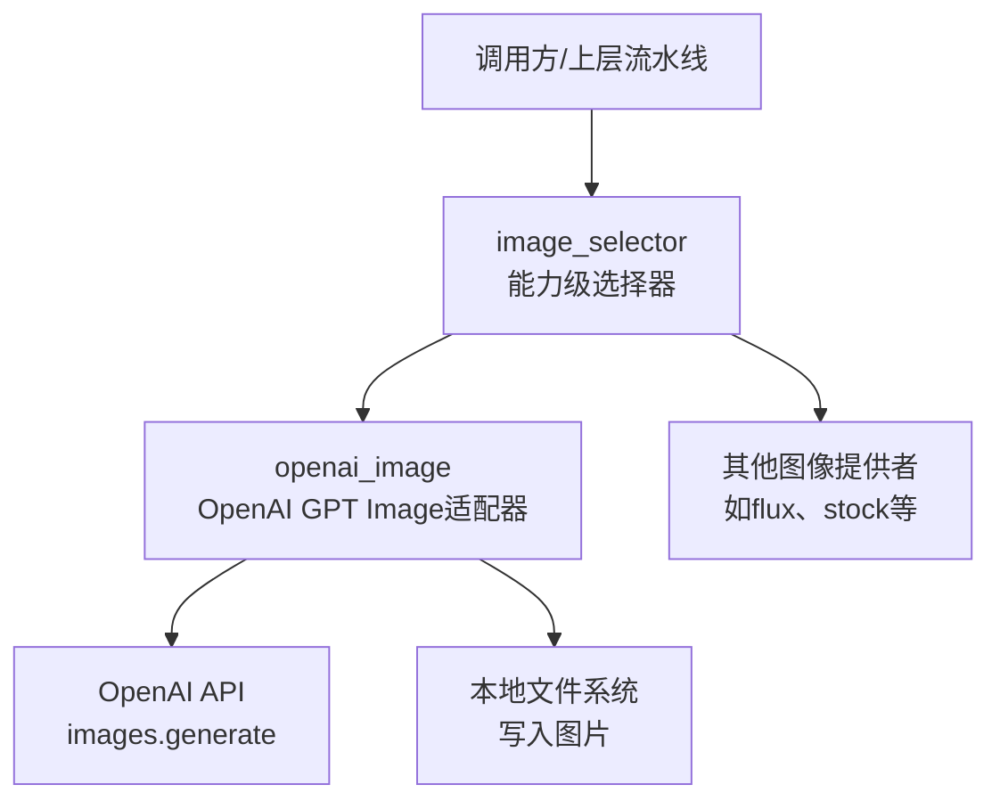
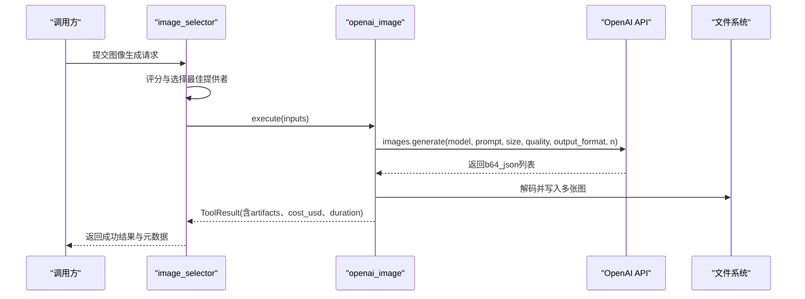
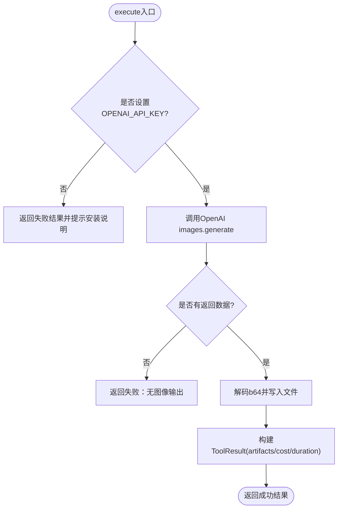
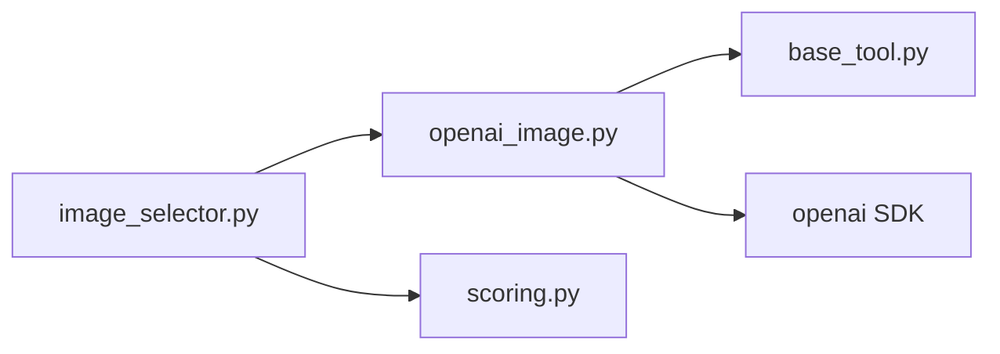

# OpenAI图像生成适配器

<cite>
**本文引用的文件**
- [tools/graphics/openai_image.py](file://tools/graphics/openai_image.py)
- [tests/tools/test_openai_image_multi_output.py](file://tests/tools/test_openai_image_multi_output.py)
- [tools/base_tool.py](file://tools/base_tool.py)
- [tools/graphics/image_selector.py](file://tools/graphics/image_selector.py)
- [lib/scoring.py](file://lib/scoring.py)
</cite>

## 目录
1. [简介](#简介)
2. [项目结构](#项目结构)
3. [核心组件](#核心组件)
4. [架构总览](#架构总览)
5. [详细组件分析](#详细组件分析)
6. [依赖关系分析](#依赖关系分析)
7. [性能与成本](#性能与成本)
8. [故障排查指南](#故障排查指南)
9. [结论](#结论)
10. [附录：API调用示例与最佳实践](#附录api调用示例与最佳实践)

## 简介
本文件面向OpenMontage中的OpenAI图像生成适配器，聚焦于GPT Image模型（gpt-image-2）的接入配置、参数能力、调用流程、成本估算、重试策略、资源需求以及与系统其他组件的集成方式。文档同时提供多输出处理、批量生成、错误处理与最佳实践建议，帮助开发者快速、稳定地使用该适配器完成文本到图像的生成任务。

## 项目结构
OpenAI图像生成适配器的核心实现位于工具层，遵循统一的BaseTool契约，并通过选择器进行路由与编排。关键文件如下：
- 适配器实现：tools/graphics/openai_image.py
- 统一工具基类与结果对象：tools/base_tool.py
- 图像能力选择器（自动发现并路由到具体提供者）：tools/graphics/image_selector.py
- 评分与选择逻辑：lib/scoring.py
- 回归测试（验证多输出与计费一致性）：tests/tools/test_openai_image_multi_output.py

图表来源
- [tools/graphics/image_selector.py:185-332](file://tools/graphics/image_selector.py#L185-L332)
- [tools/graphics/openai_image.py:126-183](file://tools/graphics/openai_image.py#L126-L183)

章节来源
- [tools/graphics/openai_image.py:1-184](file://tools/graphics/openai_image.py#L1-L184)
- [tools/graphics/image_selector.py:1-467](file://tools/graphics/image_selector.py#L1-L467)
- [tools/base_tool.py:1-200](file://tools/base_tool.py#L1-L200)

## 核心组件
- OpenAIImage适配器
  - 名称与能力：name="openai_image"，capability="image_generation"
  - 稳定性与执行模式：ToolStability.BETA，ExecutionMode.SYNC
  - 支持特性：复杂指令、图像内文字、多输出
  - 输入参数：prompt、model（固定为gpt-image-2）、size（1024x1024、1536x1024、1024x1536、auto）、quality（low、medium、high、auto）、output_format（png、jpeg、webp）、n（1-4）、output_path
  - 资源需求：CPU=1核，RAM≈512MB，VRAM=0，磁盘≈100MB，需要网络
  - 重试策略：最多重试2次，可重试错误包括rate_limit、timeout
  - 幂等键字段：prompt、size、quality、model
  - 副作用：写入图片文件至output_path；调用OpenAI API
  - 成本估算：按quality单价×n计算（low/medium/high/auto对应不同单价）
  - 状态检测：检查OPENAI_API_KEY环境变量是否存在

- BaseTool契约与结果对象
  - ToolResult包含success、data、artifacts、error、cost_usd、duration_seconds、seed、model等字段
  - RetryPolicy定义最大重试次数、退避时间、可重试错误类型
  - ResourceProfile描述工具运行所需硬件与网络要求

- image_selector选择器
  - 自动发现所有capability="image_generation"的工具
  - 根据任务上下文与评分机制选择最优提供者
  - 将通用输入键适配到具体工具的input_schema
  - 支持“rank”模式返回候选提供者评分，不实际生成

章节来源
- [tools/graphics/openai_image.py:25-93](file://tools/graphics/openai_image.py#L25-L93)
- [tools/base_tool.py:110-139](file://tools/base_tool.py#L110-L139)
- [tools/graphics/image_selector.py:15-183](file://tools/graphics/image_selector.py#L15-L183)

## 架构总览
OpenMontage采用“选择器+提供者”的解耦架构。image_selector负责能力级路由与评分，openai_image作为具体提供者实现OpenAI GPT Image的调用与落盘。该设计使得新增图像提供者无需修改选择器逻辑，只需注册并提供符合BaseTool契约的实现。

图表来源
- [tools/graphics/image_selector.py:218-332](file://tools/graphics/image_selector.py#L218-L332)
- [tools/graphics/openai_image.py:126-183](file://tools/graphics/openai_image.py#L126-L183)

## 详细组件分析

### OpenAIImage适配器
- 参数校验与可用性检查
  - 若未设置OPENAI_API_KEY，直接返回失败结果并提示安装说明
  - get_status()基于环境变量判断可用性
- 执行流程
  - 构造OpenAI客户端，读取model、prompt、size、n等参数
  - 调用images.generate，传入quality与output_format
  - 遍历响应data列表，将b64_json解码为字节并写入文件
  - 多输出时通过_output_paths生成唯一路径（单图保持原路径，多图追加_1/_2后缀）
- 成本估算
  - estimate_cost依据quality映射单价乘以n
- 错误处理
  - 捕获异常并返回ToolResult(success=False, error=...)
  - 重试策略由RetryPolicy声明（max_retries=2，retryable_errors=["rate_limit","timeout"]），由上层或框架在合适时机触发

图表来源
- [tools/graphics/openai_image.py:126-183](file://tools/graphics/openai_image.py#L126-L183)

章节来源
- [tools/graphics/openai_image.py:94-183](file://tools/graphics/openai_image.py#L94-L183)

### 多输出与批量生成
- 多输出处理
  - _output_paths确保单图使用原始路径，多图生成唯一命名（_1、_2...）避免覆盖
  - 测试结果验证：当n=4时，会生成4个独立文件，且内容与数量一致
- 批量生成
  - 通过n参数控制一次请求生成的图像数量（1-4）
  - 成本随n线性增长，artifacts数量与计费数量保持一致

章节来源
- [tools/graphics/openai_image.py:95-111](file://tools/graphics/openai_image.py#L95-L111)
- [tests/tools/test_openai_image_multi_output.py:53-92](file://tests/tools/test_openai_image_multi_output.py#L53-L92)

### 选择器与评分机制
- image_selector自动发现所有具备image_generation能力的工具
- 根据任务上下文、提供者能力与评分权重选择最优提供者
- 支持“rank”模式返回候选提供者评分，便于调试与审计
- 将通用输入键（如prompt、width、height、n等）适配到具体工具的input_schema

章节来源
- [tools/graphics/image_selector.py:185-332](file://tools/graphics/image_selector.py#L185-L332)
- [lib/scoring.py:21-70](file://lib/scoring.py#L21-L70)

## 依赖关系分析
- 运行时依赖
  - openai SDK：用于调用OpenAI图像生成接口
  - 环境变量OPENAI_API_KEY：鉴权必需
- 内部依赖
  - BaseTool契约：统一工具接口、结果对象、重试策略、资源描述
  - image_selector：能力级路由与评分
  - scoring：提供者评分与选择逻辑
- 外部依赖
  - OpenAI API：images.generate端点，返回b64_json格式图像数据

图表来源
- [tools/graphics/openai_image.py:11-22](file://tools/graphics/openai_image.py#L11-L22)
- [tools/graphics/image_selector.py:185-190](file://tools/graphics/image_selector.py#L185-L190)
- [lib/scoring.py:21-70](file://lib/scoring.py#L21-L70)

章节来源
- [tools/graphics/openai_image.py:11-22](file://tools/graphics/openai_image.py#L11-L22)
- [tools/graphics/image_selector.py:185-190](file://tools/graphics/image_selector.py#L185-L190)
- [lib/scoring.py:21-70](file://lib/scoring.py#L21-L70)

## 性能与成本
- 资源需求
  - CPU=1核，RAM≈512MB，VRAM=0，磁盘≈100MB，需网络
  - 适合轻量级部署，无需GPU
- 成本估算
  - 单价映射：low=0.006，medium=0.053，high=0.211，auto=0.053（美元/张）
  - 总成本=单价×n（n为请求数量）
  - 非正方形尺寸（1536x1024、1024x1536）略便宜，但适配器仍按quality单价统一估算
- 延迟与吞吐
  - 同步执行，单次请求等待API响应
  - 多输出在同一请求中并行获取，减少往返次数
- 优化建议
  - 合理选择quality以平衡质量与成本
  - 使用auto或medium进行默认生成，必要时切换high
  - 批量生成时使用n>1以减少API调用次数

章节来源
- [tools/graphics/openai_image.py:86-90](file://tools/graphics/openai_image.py#L86-L90)
- [tools/graphics/openai_image.py:118-124](file://tools/graphics/openai_image.py#L118-L124)

## 故障排查指南
- 常见问题
  - OPENAI_API_KEY未设置：get_status返回不可用，execute返回失败并提示安装说明
  - 无图像输出：response.data为空，返回失败并提示“OpenAI returned no image outputs”
  - 网络或限流：触发rate_limit或timeout，按RetryPolicy重试（最多2次）
- 调试步骤
  - 检查环境变量OPENAI_API_KEY是否正确设置
  - 查看ToolResult.error字段获取详细错误信息
  - 使用image_selector的“rank”模式评估可用提供者与评分
  - 验证output_path目录权限与磁盘空间
- 日志与事件
  - BaseTool对execute调用进行包装，记录start/error事件（可选，取决于事件层可用性）

章节来源
- [tools/graphics/openai_image.py:113-131](file://tools/graphics/openai_image.py#L113-L131)
- [tools/graphics/openai_image.py:154-167](file://tools/graphics/openai_image.py#L154-L167)
- [tools/base_tool.py:148-200](file://tools/base_tool.py#L148-L200)

## 结论
OpenAI图像生成适配器在OpenMontage中提供了稳定、可扩展的文本转图像能力。通过统一的BaseTool契约、智能的选择器与评分机制，以及明确的重试策略与成本估算，开发者可以高效集成OpenAI GPT Image模型。建议在复杂构图与带文字图像场景中，结合高质量提示词与合适的quality设置，以获得更佳效果。

## 附录：API调用示例与最佳实践

### 支持的图像尺寸与质量
- 尺寸选项：1024x1024、1536x1024、1024x1536、auto
- 质量设置：low、medium、high、auto
- 输出格式：png、jpeg、webp

章节来源
- [tools/graphics/openai_image.py:56-84](file://tools/graphics/openai_image.py#L56-L84)

### 文本转图像
- 输入关键字段：prompt、model（gpt-image-2）、size、quality、output_format、n、output_path
- 行为：调用OpenAI images.generate，返回b64_json并写入文件
- 结果：ToolResult包含artifacts（文件路径列表）、cost_usd、duration_seconds

章节来源
- [tools/graphics/openai_image.py:126-183](file://tools/graphics/openai_image.py#L126-L183)

### 批量生成与多输出处理
- 通过n参数一次请求多张图像（1-4）
- 多输出时自动生成唯一文件名，避免覆盖
- 测试结果保证artifacts数量与计费数量一致

章节来源
- [tools/graphics/openai_image.py:95-111](file://tools/graphics/openai_image.py#L95-L111)
- [tests/tools/test_openai_image_multi_output.py:53-92](file://tests/tools/test_openai_image_multi_output.py#L53-L92)

### 成本估算机制
- 单价映射：low=0.006，medium=0.053，high=0.211，auto=0.053
- 总成本=单价×n
- 非正方形尺寸略便宜，但适配器按quality统一估算

章节来源
- [tools/graphics/openai_image.py:118-124](file://tools/graphics/openai_image.py#L118-L124)

### 重试策略与资源需求
- 重试策略：最多重试2次，针对rate_limit与timeout
- 资源需求：CPU=1核，RAM≈512MB，VRAM=0，磁盘≈100MB，需网络

章节来源
- [tools/graphics/openai_image.py:86-90](file://tools/graphics/openai_image.py#L86-L90)

### 最佳实践指南
- 复杂多元素构图
  - 使用清晰、具体的prompt描述主体、背景、布局与风格
  - 优先尝试high质量以获得更精细细节
- 带文字图像生成
  - 明确指定文字内容、字体风格与位置
  - 使用text_in_image支持的特性，确保文字可读性
- 尺寸与格式选择
  - 方形场景使用1024x1024，横版使用1536x1024，竖版使用1024x1536
  - 根据用途选择输出格式（png透明背景、jpeg压缩、webp现代格式）
- 成本控制
  - 默认使用medium或auto，仅在必要时切换到high
  - 合理使用n进行批量生成，减少API调用次数

[本节为概念性指导，不直接分析具体文件]