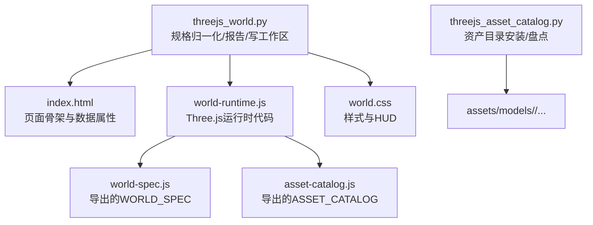
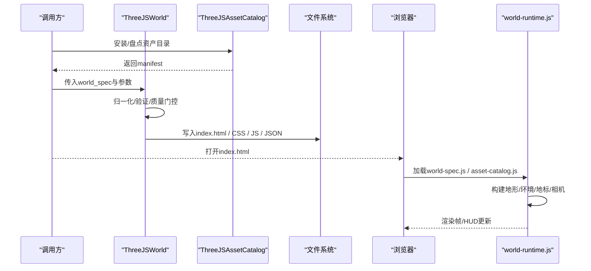
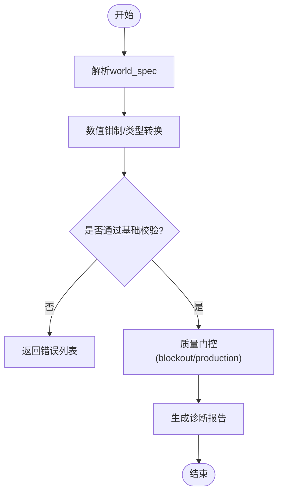
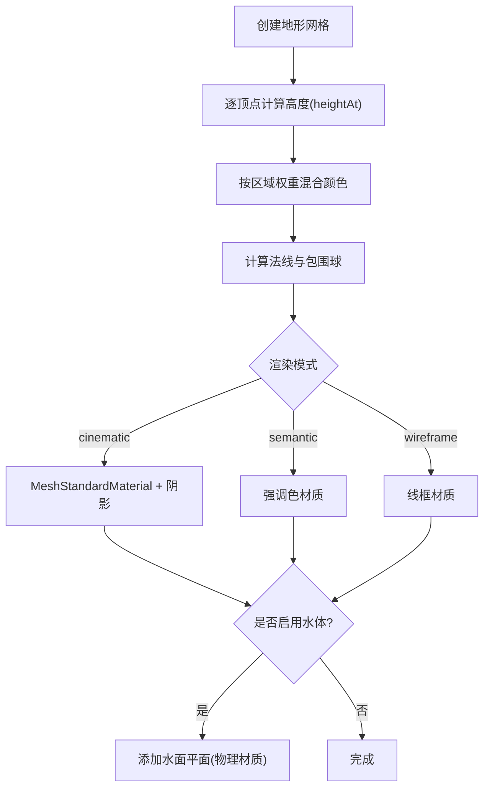
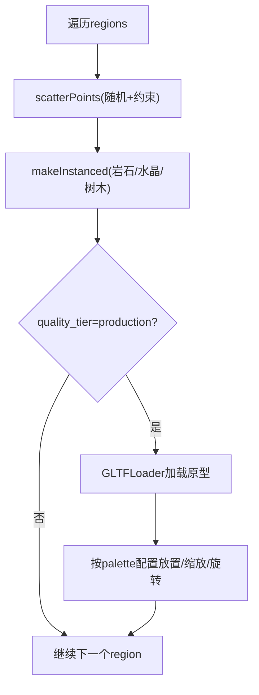
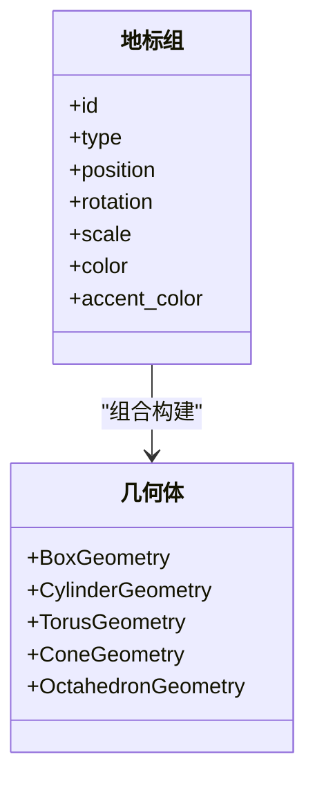
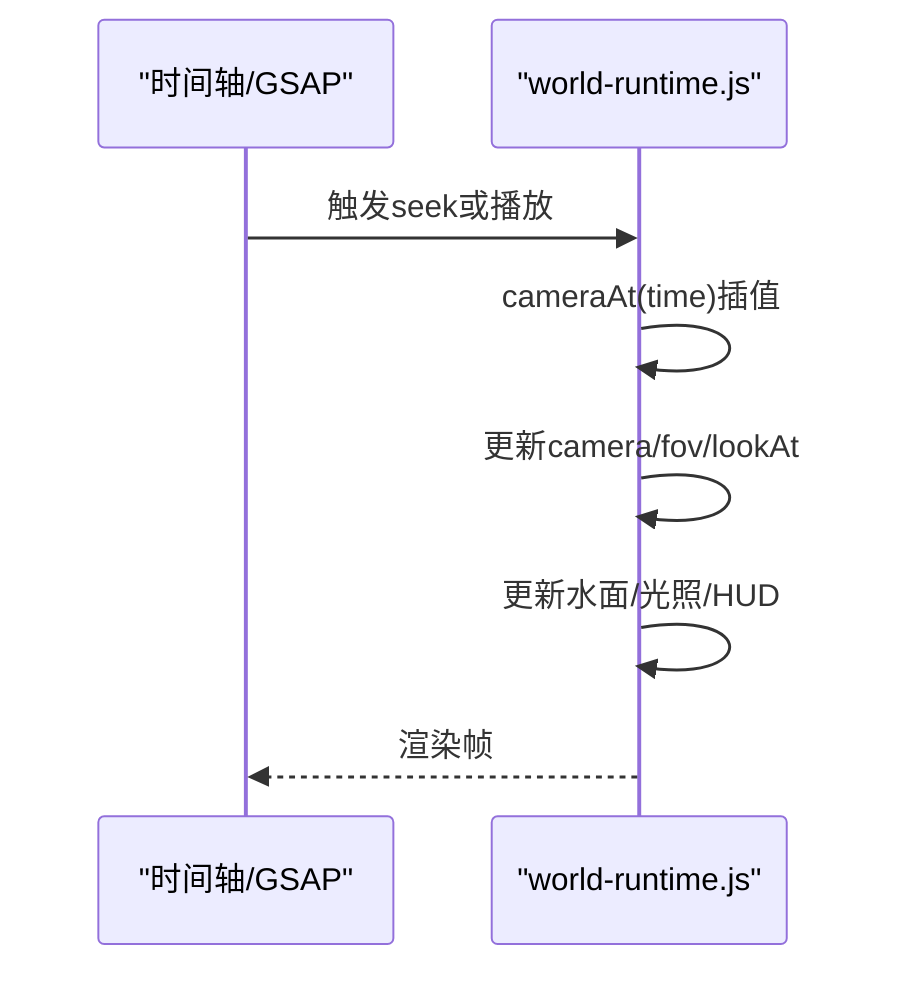
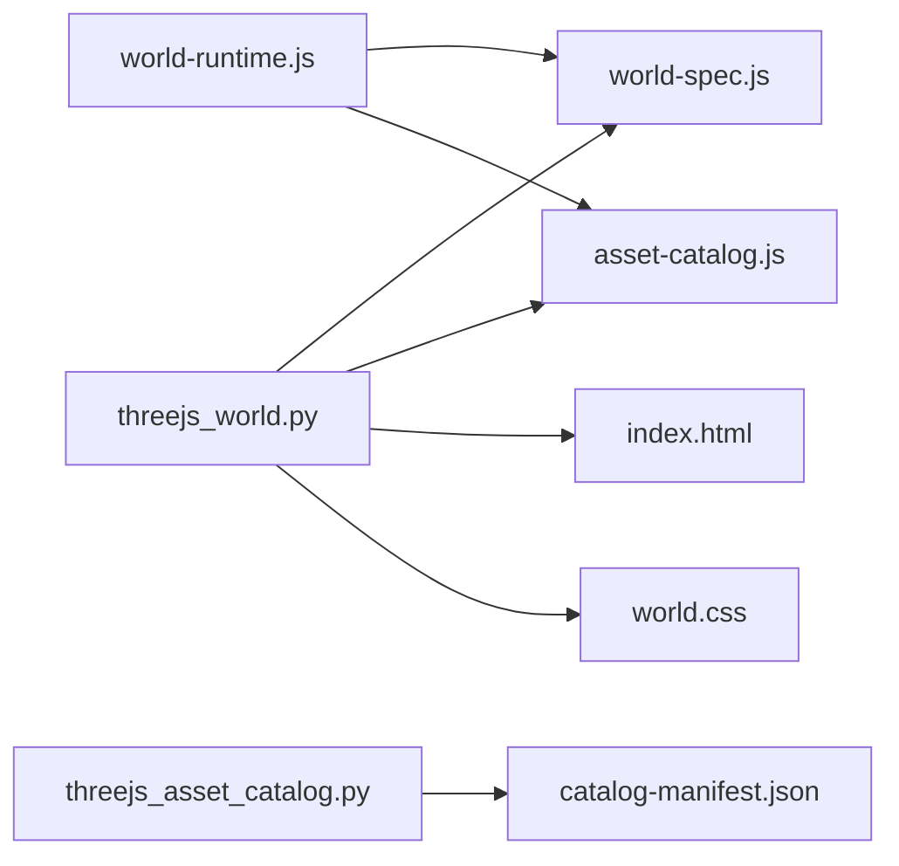

# Three.js世界生成适配器

<cite>
**本文引用的文件**
- [tools/graphics/threejs_world.py](file://tools/graphics/threejs_world.py)
- [tools/graphics/threejs_asset_catalog.py](file://tools/graphics/threejs_asset_catalog.py)
- [schemas/tools/threejs_world.schema.json](file://schemas/tools/threejs_world.schema.json)
- [schemas/tools/threejs_asset_catalog.schema.json](file://schemas/tools/threejs_asset_catalog.schema.json)
- [tools/graphics/templates/threejs_world/index.html](file://tools/graphics/templates/threejs_world/index.html)
- [tools/graphics/templates/threejs_world/world-runtime.js](file://tools/graphics/templates/threejs_world/world-runtime.js)
- [tools/graphics/templates/threejs_world/world.css](file://tools/graphics/templates/threejs_world/world.css)
- [.agents/skills/threejs-world-generation/SKILL.md](file://.agents/skills/threejs-world-generation/SKILL.md)
- [skills/creative/3d-world-generation.md](file://skills/creative/3d-world-generation.md)
</cite>

## 目录
1. [简介](#简介)
2. [项目结构](#项目结构)
3. [核心组件](#核心组件)
4. [架构总览](#架构总览)
5. [详细组件分析](#详细组件分析)
6. [依赖关系分析](#依赖关系分析)
7. [性能考量](#性能考量)
8. [故障排查指南](#故障排查指南)
9. [结论](#结论)
10. [附录](#附录)

## 简介
本文件面向“基于Three.js的3D世界构建与渲染框架”的使用者与集成者，系统化说明如何通过参数化配置生成可编辑、可诊断、可回放的三维世界。内容覆盖：
- 世界生成的参数规范、几何体创建与材质应用
- 场景搭建、相机设置、光照配置与动画制作
- 与HTML/CSS的集成方式、响应式设计与移动端适配
- 性能优化技巧（对象池管理、纹理压缩、渲染批次优化）
- 交互功能与用户体验设计建议

该适配器由Python工具负责“世界规格校验与模板工程”，前端模板负责“运行时渲染与交互”。

## 项目结构
- Python侧提供两个工具：
  - threejs_world：规范化world_spec、执行质量门控、输出可编辑的HyperFrames/Three.js工作区
  - threejs_asset_catalog：安装并盘点CC0授权的GLTF/PBR资产目录
- 前端模板位于templates/threejs_world：
  - index.html：页面骨架、标题卡、HUD、时间线占位
  - world-runtime.js：Three.js场景、地形、实例化环境、地标、相机路径与渲染循环
  - world.css：暗色主题、HUD样式、视口与画布布局
- Schema定义输入/输出的严格约束，保证跨阶段一致性

图表来源
- [tools/graphics/threejs_world.py:628-733](file://tools/graphics/threejs_world.py#L628-L733)
- [tools/graphics/templates/threejs_world/index.html:1-67](file://tools/graphics/templates/threejs_world/index.html#L1-L67)
- [tools/graphics/templates/threejs_world/world-runtime.js:1-16](file://tools/graphics/templates/threejs_world/world-runtime.js#L1-L16)
- [tools/graphics/threejs_asset_catalog.py:112-172](file://tools/graphics/threejs_asset_catalog.py#L112-L172)

章节来源
- [tools/graphics/threejs_world.py:75-157](file://tools/graphics/threejs_world.py#L75-L157)
- [tools/graphics/threejs_asset_catalog.py:71-109](file://tools/graphics/threejs_asset_catalog.py#L71-L109)
- [tools/graphics/templates/threejs_world/index.html:1-67](file://tools/graphics/templates/threejs_world/index.html#L1-L67)
- [tools/graphics/templates/threejs_world/world-runtime.js:1-16](file://tools/graphics/templates/threejs_world/world-runtime.js#L1-L16)
- [tools/graphics/templates/threejs_world/world.css:1-80](file://tools/graphics/templates/threejs_world/world.css#L1-L80)

## 核心组件
- ThreeJSWorld（Python）
  - 职责：解析并归一化world_spec；执行质量门控（blockout/production）；生成诊断报告；写入可编辑工作区（HTML/CSS/JS/JSON）
  - 关键能力：语义区域规划、程序化高度场、区域感知散布、显式地标放置、确定性相机飞行路径、多模式诊断（cinematic/semantic/wireframe）、生产级PBR材质契约
- ThreeJSAssetCatalog（Python）
  - 职责：列出、安装、检查本地授权资产目录；生成manifest（含模型清单、纹理数量、归档哈希）
- 前端运行时（JavaScript）
  - 职责：加载WORLD_SPEC与ASSET_CATALOG；构建地形、水体、实例化环境、地标；按相机路径驱动相机；更新HUD；支持外部seek事件

章节来源
- [tools/graphics/threejs_world.py:75-157](file://tools/graphics/threejs_world.py#L75-L157)
- [tools/graphics/threejs_asset_catalog.py:71-109](file://tools/graphics/threejs_asset_catalog.py#L71-L109)
- [tools/graphics/templates/threejs_world/world-runtime.js:94-116](file://tools/graphics/templates/threejs_world/world-runtime.js#L94-L116)

## 架构总览
整体流程分为“离线规格处理”和“在线渲染”两阶段：
- 离线阶段：调用Python工具，校验并生成工作区文件
- 在线阶段：浏览器加载HTML/CSS/JS，读取world-spec.js与asset-catalog.js，构建Three.js场景并按时间轴播放

图表来源
- [tools/graphics/threejs_asset_catalog.py:112-172](file://tools/graphics/threejs_asset_catalog.py#L112-L172)
- [tools/graphics/threejs_world.py:159-238](file://tools/graphics/threejs_world.py#L159-L238)
- [tools/graphics/templates/threejs_world/world-runtime.js:244-287](file://tools/graphics/templates/threejs_world/world-runtime.js#L244-L287)
- [tools/graphics/templates/threejs_world/world-runtime.js:414-460](file://tools/graphics/templates/threejs_world/world-runtime.js#L414-L460)

## 详细组件分析

### 世界规格与参数配置
- 输入Schema约束了operation、world_spec及渲染参数（duration_seconds、width、height、render_mode、quality_tier、asset_catalog_paths）
- world_spec包含：
  - world：size、resolution、elevation_scale、water_level
  - atmosphere：sky_color、fog_color、fog_density、sun_color、sun_intensity、sun_position、ground_color
  - regions：最多12个，带center、radius、landform、scatter、slope_limit等
  - landmarks：最多80个，带type、position、rotation、scale、color等
  - camera_path：至少2个关键帧，time从0到duration，位置与目标点插值
- 归一化过程对数值进行钳制、颜色校验、向量长度校验，并对未知枚举降级为默认值

图表来源
- [tools/graphics/threejs_world.py:289-453](file://tools/graphics/threejs_world.py#L289-L453)
- [tools/graphics/threejs_world.py:455-552](file://tools/graphics/threejs_world.py#L455-L552)

章节来源
- [schemas/tools/threejs_world.schema.json:1-38](file://schemas/tools/threejs_world.schema.json#L1-L38)
- [tools/graphics/threejs_world.py:116-147](file://tools/graphics/threejs_world.py#L116-L147)
- [tools/graphics/threejs_world.py:289-453](file://tools/graphics/threejs_world.py#L289-L453)
- [tools/graphics/threejs_world.py:455-552](file://tools/graphics/threejs_world.py#L455-L552)

### 地形生成与材质应用
- 地形使用PlaneGeometry按resolution细分，逐顶点计算高度（基于区域权重+噪声+地貌算子），并写入颜色缓冲
- 材质策略：
  - cinematic：标准材质+阴影接收/投射
  - semantic：以区域强调色显示
  - wireframe：线框模式便于审查拓扑
- 水体：在非wireframe模式下添加半透明物理材质平面，随时间微动

图表来源
- [tools/graphics/templates/threejs_world/world-runtime.js:140-197](file://tools/graphics/templates/threejs_world/world-runtime.js#L140-L197)
- [tools/graphics/templates/threejs_world/world-runtime.js:62-84](file://tools/graphics/templates/threejs_world/world-runtime.js#L62-L84)

章节来源
- [tools/graphics/templates/threejs_world/world-runtime.js:140-197](file://tools/graphics/templates/threejs_world/world-runtime.js#L140-L197)

### 环境散布与实例化
- 散布算法：在每个region内按半径随机采样，结合主导区域权重与坡度限制筛选落点
- 使用InstancedMesh批量绘制岩石、水晶、树木（树干+树冠），显著降低draw call
- 生产模式下，从GLTF目录加载原型模型，按asset_palette配置进行实例化或克隆放置

图表来源
- [tools/graphics/templates/threejs_world/world-runtime.js:206-242](file://tools/graphics/templates/threejs_world/world-runtime.js#L206-L242)
- [tools/graphics/templates/threejs_world/world-runtime.js:244-287](file://tools/graphics/templates/threejs_world/world-runtime.js#L244-L287)
- [tools/graphics/templates/threejs_world/world-runtime.js:289-333](file://tools/graphics/templates/threejs_world/world-runtime.js#L289-L333)

章节来源
- [tools/graphics/templates/threejs_world/world-runtime.js:206-333](file://tools/graphics/templates/threejs_world/world-runtime.js#L206-L333)

### 地标系统
- 支持多种地标类型（monolith/arch/tower/ruin/crystal/settlement/ring），每种由多个基本几何体组合而成
- 根据seed与hashString确保可重复性；自动贴合地形高度并应用旋转/缩放

图表来源
- [tools/graphics/templates/threejs_world/world-runtime.js:335-403](file://tools/graphics/templates/threejs_world/world-runtime.js#L335-L403)

章节来源
- [tools/graphics/templates/threejs_world/world-runtime.js:335-403](file://tools/graphics/templates/threejs_world/world-runtime.js#L335-L403)

### 相机路径与动画
- 相机关键帧按time排序，采用smoothstep平滑插值位置、目标点与FOV
- 每帧根据当前时间更新相机、水面透明度、太阳光强，并刷新HUD（区域名、时间码、海拔）
- 支持外部事件hf-seek实现跳转播放

图表来源
- [tools/graphics/templates/threejs_world/world-runtime.js:414-460](file://tools/graphics/templates/threejs_world/world-runtime.js#L414-L460)
- [tools/graphics/templates/threejs_world/world-runtime.js:462-471](file://tools/graphics/templates/threejs_world/world-runtime.js#L462-L471)

章节来源
- [tools/graphics/templates/threejs_world/world-runtime.js:414-471](file://tools/graphics/templates/threejs_world/world-runtime.js#L414-L471)

### HTML/CSS集成与响应式
- index.html通过data-*属性注入尺寸、时长、渲染模式与质量等级，供运行时读取
- world.css提供暗色主题、HUD布局、标题卡与噪点/晕影效果，并在不同渲染模式下隐藏装饰层
- 响应式：CSS使用clamp/vw/vh自适应；运行时可通过窗口resize调整相机aspect与renderer尺寸（参考通用技能）

章节来源
- [tools/graphics/templates/threejs_world/index.html:1-67](file://tools/graphics/templates/threejs_world/index.html#L1-L67)
- [tools/graphics/templates/threejs_world/world.css:1-80](file://tools/graphics/templates/threejs_world/world.css#L1-L80)

### 移动端适配与交互
- 建议在运行时监听resize事件，动态更新camera.aspect与renderer.setSize，并限制devicePixelRatio上限
- 对于触屏设备，可叠加轻量控制（如OrbitControls）用于自由浏览；注意节流射线检测与减少阴影开销
- 在低性能设备上可将render_mode切换为semantic或wireframe，关闭雾效与阴影

章节来源
- [.agents/skills/threejs-fundamentals/SKILL.md:417-469](file://.agents/skills/threejs-fundamentals/SKILL.md#L417-L469)
- [.agents/skills/threejs-interaction/SKILL.md:126-188](file://.agents/skills/threejs-interaction/SKILL.md#L126-L188)

## 依赖关系分析
- Python工具之间无直接耦合，但共同依赖BaseTool框架与资源/稳定性声明
- 前端运行时依赖Three.js与GLTFLoader（通过CDN引入），并读取本地导出的world-spec.js与asset-catalog.js
- 资产目录通过catalog-manifest.json记录来源、许可证、模型清单与哈希，保障合规与可追溯

图表来源
- [tools/graphics/threejs_world.py:628-733](file://tools/graphics/threejs_world.py#L628-L733)
- [tools/graphics/threejs_asset_catalog.py:146-172](file://tools/graphics/threejs_asset_catalog.py#L146-L172)
- [tools/graphics/templates/threejs_world/world-runtime.js:1-5](file://tools/graphics/templates/threejs_world/world-runtime.js#L1-L5)

章节来源
- [tools/graphics/threejs_world.py:628-733](file://tools/graphics/threejs_world.py#L628-L733)
- [tools/graphics/threejs_asset_catalog.py:146-172](file://tools/graphics/threejs_asset_catalog.py#L146-L172)

## 性能考量
- 渲染批次优化
  - 大量环境物体使用InstancedMesh减少draw call
  - 地形单网格+顶点颜色，避免过多材质切换
- 阴影与雾
  - cinematic模式开启PCFSoft阴影与指数雾；其他模式关闭以提升性能
- 纹理与材质
  - 生产模式优先使用PBR贴图；建议后续接入纹理压缩（如WebP/KTX2）与图集
- 对象池与复用
  - 推荐复用几何体与材质；对频繁创建的临时对象进行池化管理
- LOD与裁剪
  - 远距离对象使用LOD；确保包围盒正确以启用视锥剔除
- 交互节流
  - 鼠标移动/悬停时节流射线检测，降低每帧开销
- 像素比与分辨率
  - 移动端限制devicePixelRatio；按需降低分辨率或关闭抗锯齿

章节来源
- [tools/graphics/templates/threejs_world/world-runtime.js:94-101](file://tools/graphics/templates/threejs_world/world-runtime.js#L94-L101)
- [tools/graphics/templates/threejs_world/world-runtime.js:228-242](file://tools/graphics/templates/threejs_world/world-runtime.js#L228-L242)
- [.agents/skills/threejs-fundamentals/SKILL.md:417-469](file://.agents/skills/threejs-fundamentals/SKILL.md#L417-L469)
- [.agents/skills/threejs-interaction/SKILL.md:126-188](file://.agents/skills/threejs-interaction/SKILL.md#L126-L188)

## 故障排查指南
- 常见错误
  - render_mode或quality_tier非法：工具会直接返回错误
  - 缺少output_path：build操作必须提供输出路径
  - 生产模式缺少资产目录或资产条目不完整：质量门控将报错
  - 相机路径不合法：首尾时间、单调递增、至少两帧等校验失败
  - 地标越界或引用未知region：报告警告或错误
- 诊断视图
  - 使用semantic/wireframe模式快速定位布局与拓扑问题
  - 关注报告中的最小相机离地间隙，避免穿模
- 前端加载失败
  - 检查world-spec.js与asset-catalog.js是否正确导出
  - GLTF加载失败时，状态栏会提示“WORLD ASSET LOAD FAILED”

章节来源
- [tools/graphics/threejs_world.py:159-238](file://tools/graphics/threejs_world.py#L159-L238)
- [tools/graphics/threejs_world.py:240-287](file://tools/graphics/threejs_world.py#L240-L287)
- [tools/graphics/threejs_world.py:455-552](file://tools/graphics/threejs_world.py#L455-L552)
- [tools/graphics/templates/threejs_world/world-runtime.js:462-478](file://tools/graphics/templates/threejs_world/world-runtime.js#L462-L478)

## 结论
该适配器将“世界规格—资产目录—前端渲染”解耦为清晰的两段式流水线：Python负责确定性的规格处理与质量门禁，前端负责高性能的Three.js渲染与交互。通过schema约束、多模式诊断与可编辑工作区，既能满足快速迭代，也能支撑生产级交付。配合性能优化与交互最佳实践，可在桌面与移动端提供一致且流畅的3D世界体验。

## 附录
- 工作流建议
  - 先以blockout模式快速验证语义布局与相机路径
  - 再切换到production模式，导入授权资产目录，完善PBR材质与细节
  - 使用semantic/wireframe模式做专项审查，最后输出cinematic成品
- 参考技能
  - 3D世界生成技能与资产获取技能指导完整流程与产物映射
  - Three.js基础技能提供动画、响应式、加载器与性能优化示例

章节来源
- [.agents/skills/threejs-world-generation/SKILL.md:51-85](file://.agents/skills/threejs-world-generation/SKILL.md#L51-L85)
- [skills/creative/3d-world-generation.md:1-49](file://skills/creative/3d-world-generation.md#L1-L49)