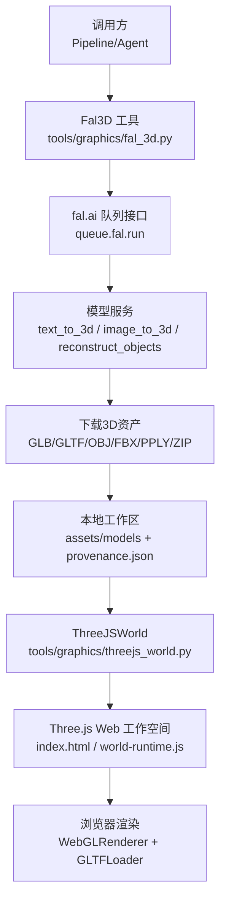
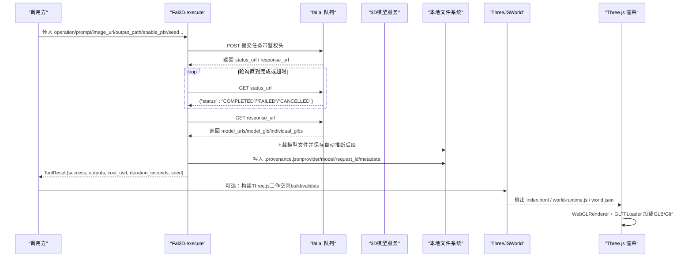
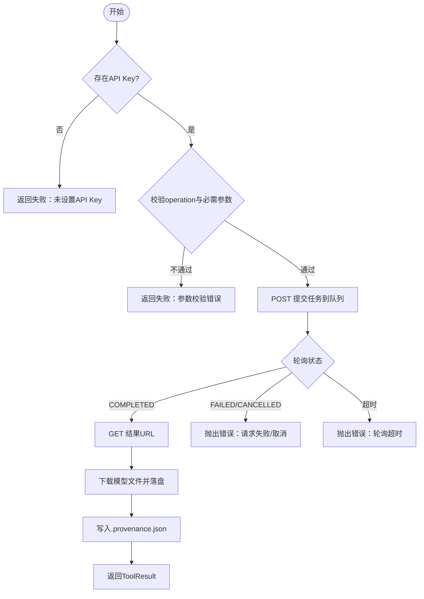
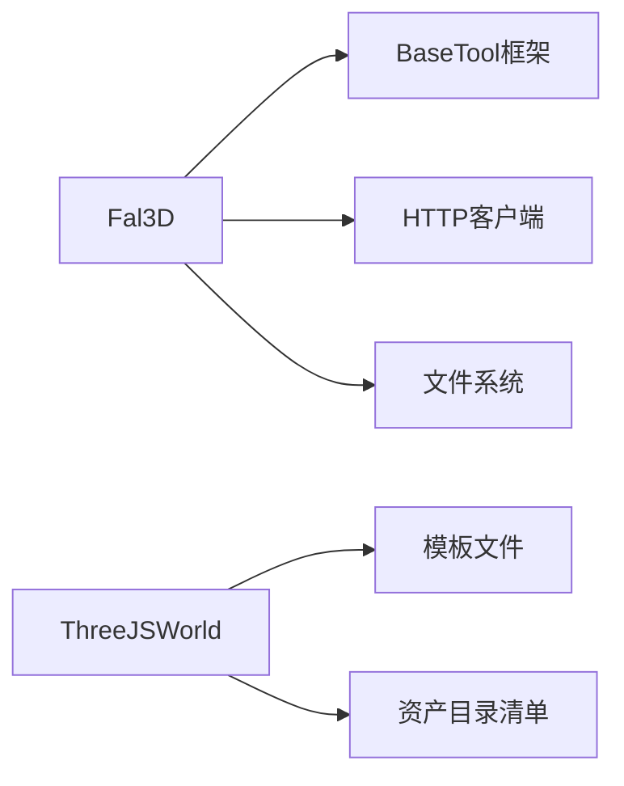

# fal.ai 3D场景适配器

<cite>
**本文引用的文件**
- [fal_3d.py](file://tools/graphics/fal_3d.py)
- [fal_3d.schema.json](file://schemas/tools/fal_3d.schema.json)
- [threejs_asset_catalog.py](file://tools/graphics/threejs_asset_catalog.py)
- [threejs_world.py](file://tools/graphics/threejs_world.py)
- [test_3d_asset_generation.py](file://tests/tools/test_3d_asset_generation.py)
- [SKILL.md（3D资产生成）](file://.agents/skills/3d-asset-generation/SKILL.md)
- [SKILL.md（Three.js基础）](file://.agents/skills/threejs-fundamentals/SKILL.md)
- [SKILL.md（Three.js加载器与缓存）](file://.agents/skills/threejs-loaders/SKILL.md)
</cite>

## 目录
1. [简介](#简介)
2. [项目结构](#项目结构)
3. [核心组件](#核心组件)
4. [架构总览](#架构总览)
5. [详细组件分析](#详细组件分析)
6. [依赖关系分析](#依赖关系分析)
7. [性能与优化](#性能与优化)
8. [故障排查指南](#故障排查指南)
9. [结论](#结论)
10. [附录：API调用示例与最佳实践](#附录api调用示例与最佳实践)

## 简介
本文件面向在Web环境中使用fal.ai进行3D场景与资产生成的工程集成，聚焦以下目标：
- 说明fal.ai平台的3D生成能力与技术特点（文本到3D、图像到3D、多对象重建、PBR材质输出）。
- 描述3D场景的参数配置、渲染选项与质量控制流程。
- 提供完整的API调用示例（含材质与光照相关参数），并给出错误处理与重试策略。
- 说明与Three.js的集成方式、WebGL渲染优化与性能调优建议。
- 给出3D资产管理策略、缓存机制与导出格式支持（GLB/GLTF/OBJ/FBX/PPLY/ZIP等）。
- 确保3D场景在Web环境中的兼容性与交互性实现路径。

## 项目结构
本项目将fal.ai 3D生成封装为工具类，并通过Schema约束输入参数；同时配套Three.js世界构建与资产目录管理工具，形成“云端生成—本地装配—Web渲染”的完整链路。

图表来源
- [fal_3d.py:28-32](file://tools/graphics/fal_3d.py#L28-L32)
- [fal_3d.py:146-188](file://tools/graphics/fal_3d.py#L146-L188)
- [threejs_world.py:629-733](file://tools/graphics/threejs_world.py#L629-L733)

章节来源
- [fal_3d.py:1-214](file://tools/graphics/fal_3d.py#L1-L214)
- [threejs_world.py:1-733](file://tools/graphics/threejs_world.py#L1-L733)

## 核心组件
- Fal3D：封装对fal.ai的异步队列调用、参数校验、结果轮询、资产下载与溯源文件写入。
- ThreeJSAssetCatalog：安装可审计的CC0授权3D资产目录，生成清单与模型索引。
- ThreeJSWorld：基于语义化world_spec构建可编辑的Three.js工作空间，输出HTML/CSS/JS与诊断报告。
- Schema约束：fal_3d.schema.json定义输入字段、枚举与取值范围，保障调用一致性。

章节来源
- [fal_3d.py:52-103](file://tools/graphics/fal_3d.py#L52-L103)
- [fal_3d.schema.json:1-21](file://schemas/tools/fal_3d.schema.json#L1-L21)
- [threejs_asset_catalog.py:71-172](file://tools/graphics/threejs_asset_catalog.py#L71-L172)
- [threejs_world.py:75-157](file://tools/graphics/threejs_world.py#L75-L157)

## 架构总览
fal.ai 3D场景适配器的数据流与控制流如下：

图表来源
- [fal_3d.py:113-213](file://tools/graphics/fal_3d.py#L113-L213)
- [threejs_world.py:159-238](file://tools/graphics/threejs_world.py#L159-L238)
- [threejs_world.py:629-733](file://tools/graphics/threejs_world.py#L629-L733)

## 详细组件分析

### Fal3D 工具
- 能力与定位
  - 支持 text_to_3d、image_to_3d、reconstruct_objects 三种操作。
  - 支持 PBR 材质输出、种子控制、纹理GLB导出、多对象重建。
  - 资源需求：CPU 1核、内存512MB、磁盘约2GB、需要网络。
  - 稳定性：Beta；确定性：可设seed；执行模式：异步。
- 关键参数
  - operation：必填，枚举值来自内部模型映射。
  - prompt：text_to_3d时必填。
  - image_url / image_path：非text_to_3d时至少提供其一。
  - enable_pbr：是否启用PBR材质（影响成本估算）。
  - seed：随机种子，用于可重复生成。
  - export_textured_glb：多对象重建时是否导出带纹理GLB。
  - detection_threshold：多对象重建时的检测阈值（0.1~1.0）。
  - poll_timeout_seconds：轮询超时时间（30~1800秒）。
- 执行流程要点
  - 鉴权：从环境变量读取FAL_KEY或FAL_AI_API_KEY。
  - 构造payload：按operation分支填充参数。
  - 提交任务：POST到https://queue.fal.run/{model}，设置Authorization与Content-Type。
  - 轮询状态：GET status_url直至COMPLETED/FAILED/CANCELLED或超时。
  - 获取结果：GET response_url，解析model_urls/model_glb/individual_glbs。
  - 下载与落盘：根据URL后缀或content_type推断扩展名，下载二进制内容。
  - 溯源文件：写入.provenance.json，包含provider、model、request_id、operation、prompt、metadata、source_url、outputs。
  - 返回值：ToolResult包含success、data、artifacts、cost_usd、duration_seconds、seed、model。
- 成本估算
  - reconstruct_objects：固定成本。
  - 其他操作：基础成本+enable_pbr附加成本。
- 错误处理
  - 缺少API Key、未知operation、缺失必要参数均返回失败。
  - 网络异常、请求失败、无可用mesh下载时会抛出异常并返回失败。
  - 重试策略：针对rate_limit与timeout最多重试一次。

图表来源
- [fal_3d.py:113-213](file://tools/graphics/fal_3d.py#L113-L213)

章节来源
- [fal_3d.py:28-103](file://tools/graphics/fal_3d.py#L28-L103)
- [fal_3d.py:113-213](file://tools/graphics/fal_3d.py#L113-L213)
- [fal_3d.schema.json:1-21](file://schemas/tools/fal_3d.schema.json#L1-L21)
- [test_3d_asset_generation.py:56-65](file://tests/tools/test_3d_asset_generation.py#L56-L65)
- [test_3d_asset_generation.py:131-159](file://tests/tools/test_3d_asset_generation.py#L131-L159)

### ThreeJSAssetCatalog 资产目录管理
- 功能
  - 列出可用的CC0授权资产目录。
  - 安装目录：下载zip并解压至source目录。
  - 检查清单：扫描.gltf/.glb与纹理文件，生成catalog-manifest.json。
- 质量与合规
  - 仅支持CC0-1.0授权目录，避免版权风险。
  - 记录archive_sha256、model_count、texture_count与模型路径。
- 与Three.js集成
  - 输出的manifest供后续世界构建引用，确保运行时路径正确。

章节来源
- [threejs_asset_catalog.py:29-54](file://tools/graphics/threejs_asset_catalog.py#L29-L54)
- [threejs_asset_catalog.py:112-172](file://tools/graphics/threejs_asset_catalog.py#L112-L172)
- [test_threejs_asset_catalog.py:1-33](file://tests/tools/test_threejs_asset_catalog.py#L1-L33)

### ThreeJSWorld 世界构建
- 功能
  - 接收world_spec，规范化区域、地标、相机路径、大气与地形材质。
  - 构建可编辑的Three.js工作空间：index.html、world.css、world-runtime.js、world.json、world-spec.js、report、asset-catalog-index.json、hyperframes.json。
  - 生产级质量门禁：要求至少一个已安装的资产目录、至少8个资产条目、至少3层地形材质，且每个材质需base_color/normal/roughness。
- 渲染模式
  - cinematic/semantic/wireframe三种模式，分别对应最终审片、布局审查与线框审查。
- 资源与限制
  - 推荐分辨率与时长范围，相机路径必须严格递增时间键，首尾时间匹配duration。
  - 输出workspace与entry路径，便于后续HyperFrames渲染。

章节来源
- [threejs_world.py:75-157](file://tools/graphics/threejs_world.py#L75-L157)
- [threejs_world.py:159-238](file://tools/graphics/threejs_world.py#L159-L238)
- [threejs_world.py:240-287](file://tools/graphics/threejs_world.py#L240-L287)
- [threejs_world.py:629-733](file://tools/graphics/threejs_world.py#L629-L733)

## 依赖关系分析
- 外部依赖
  - fal.ai API：需要FAL_KEY或FAL_AI_API_KEY环境变量。
  - 网络访问：提交任务、轮询状态、下载模型。
- 内部依赖
  - BaseTool框架：统一工具元信息、资源画像、重试策略、幂等键字段。
  - 测试用例：验证成本矩阵、输入校验、成功下载与溯源文件。

图表来源
- [fal_3d.py:14-25](file://tools/graphics/fal_3d.py#L14-L25)
- [threejs_world.py:629-733](file://tools/graphics/threejs_world.py#L629-L733)

章节来源
- [fal_3d.py:14-25](file://tools/graphics/fal_3d.py#L14-L25)
- [test_3d_asset_generation.py:32-40](file://tests/tools/test_3d_asset_generation.py#L32-L40)

## 性能与优化
- 生成阶段
  - 合理设置poll_timeout_seconds以避免长时间阻塞。
  - 使用seed提升可重复性，减少重复生成成本。
  - 关闭enable_pbr可降低部分操作的额外成本。
- 下载与存储
  - 根据URL后缀或content_type自动选择合适扩展名，避免多余转换。
  - 多对象重建时，individual_glbs会按序号命名，便于批量管理。
- Three.js渲染
  - 使用WebGLRenderer的抗锯齿、像素比限制、色调映射与颜色空间设置，平衡画质与性能。
  - 使用GLTFLoader加载GLB/Gltf，结合THREE.Cache进行资源缓存。
  - 合理使用阴影贴图类型与开启策略，降低GPU压力。
  - 对复杂场景采用分块加载与按需实例化，减少首屏开销。

章节来源
- [fal_3d.py:39-49](file://tools/graphics/fal_3d.py#L39-L49)
- [fal_3d.py:146-188](file://tools/graphics/fal_3d.py#L146-L188)
- [SKILL.md（Three.js基础）:140-170](file://.agents/skills/threejs-fundamentals/SKILL.md#L140-L170)
- [SKILL.md（Three.js加载器与缓存）:394-452](file://.agents/skills/threejs-loaders/SKILL.md#L394-L452)

## 故障排查指南
- 常见错误
  - 未设置API Key：检查FAL_KEY或FAL_AI_API_KEY环境变量。
  - 未知operation或参数缺失：确认operation与prompt/image_url/image_path是否符合要求。
  - 轮询超时：增大poll_timeout_seconds或检查网络状况。
  - 无可用mesh：确认服务端返回的model_urls/model_glb/individual_glbs是否存在。
- 调试建议
  - 查看.provenance.json中的request_id与metadata，便于追踪问题。
  - 使用测试用例中的mock方式模拟响应，快速定位逻辑问题。
  - 在Three.js侧检查GLTFLoader加载错误与资源路径是否正确。

章节来源
- [fal_3d.py:113-123](file://tools/graphics/fal_3d.py#L113-L123)
- [fal_3d.py:156-167](file://tools/graphics/fal_3d.py#L156-L167)
- [fal_3d.py:182-184](file://tools/graphics/fal_3d.py#L182-L184)
- [test_3d_asset_generation.py:56-65](file://tests/tools/test_3d_asset_generation.py#L56-L65)
- [test_3d_asset_generation.py:131-159](file://tests/tools/test_3d_asset_generation.py#L131-L159)

## 结论
fal.ai 3D场景适配器在本项目中提供了稳定、可追溯的云端3D资产生成能力，并与Three.js工作空间构建工具无缝衔接。通过严格的参数校验、成本估算、重试策略与溯源文件，保障了生成过程的可控性与可审计性。配合Three.js的渲染优化与缓存机制，可在Web环境中高效展示与交互3D场景。

## 附录：API调用示例与最佳实践

### 基本调用流程
- 准备参数：operation、output_path，以及prompt或image_url/image_path。
- 可选参数：enable_pbr、seed、export_textured_glb、detection_threshold、poll_timeout_seconds。
- 执行调用：Fal3D().execute(inputs)。
- 检查结果：ToolResult.success为True时，artifacts包含下载的模型路径与.provenance.json路径。

章节来源
- [fal_3d.py:80-95](file://tools/graphics/fal_3d.py#L80-L95)
- [fal_3d.py:113-213](file://tools/graphics/fal_3d.py#L113-L213)
- [fal_3d.schema.json:1-21](file://schemas/tools/fal_3d.schema.json#L1-L21)

### 材质与光照配置
- PBR材质：通过enable_pbr控制是否生成PBR材质，影响成本与渲染效果。
- 光源与环境：在Three.js中配置WebGLRenderer的色调映射、颜色空间与阴影贴图类型，以匹配PBR材质的光照响应。
- 纹理与法线：确保导入的GLB/Gltf包含正确的base_color、normal、roughness贴图，并在Three.js中正确映射。

章节来源
- [fal_3d.py:125-144](file://tools/graphics/fal_3d.py#L125-L144)
- [SKILL.md（Three.js基础）:140-170](file://.agents/skills/threejs-fundamentals/SKILL.md#L140-L170)

### 与Three.js集成
- 加载模型：使用GLTFLoader加载GLB/Gltf，支持并行加载多个资源。
- 缓存机制：启用THREE.Cache，减少重复加载开销。
- 渲染优化：设置合适的像素比、抗锯齿、色调映射与颜色空间，控制阴影贴图类型与开启策略。

章节来源
- [SKILL.md（Three.js加载器与缓存）:394-452](file://.agents/skills/threejs-loaders/SKILL.md#L394-L452)
- [SKILL.md（Three.js基础）:140-170](file://.agents/skills/threejs-fundamentals/SKILL.md#L140-L170)

### 资产管理策略
- 资产来源：优先使用CC0授权的ThreeJSAssetCatalog目录，确保合规。
- 清单与索引：安装目录后生成catalog-manifest.json，记录模型数量、纹理数量与路径。
- 版本与溯源：fal.ai生成资产附带.provenance.json，记录provider、model、request_id、prompt、metadata等。

章节来源
- [threejs_asset_catalog.py:112-172](file://tools/graphics/threejs_asset_catalog.py#L112-L172)
- [fal_3d.py:189-201](file://tools/graphics/fal_3d.py#L189-L201)

### 质量控制与最佳实践
- 提示词规范：明确对象名称、轮廓、材质、磨损、艺术风格、色彩约束、尺度与朝向，排除地面、背景、额外对象与灯光架。
- 网格质检：导入Blender检查前后视图、拓扑空洞、接地接触、UV接缝、材质槽、三角面数与相机距离合理性。
- 装配归一化：通过target_height测量导入模型的包围盒高度并归一化，确保真实尺度与接地接触一致。

章节来源
- [SKILL.md（3D资产生成）:39-74](file://.agents/skills/3d-asset-generation/SKILL.md#L39-L74)