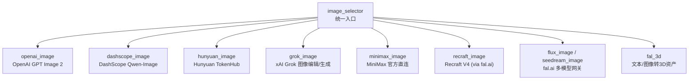
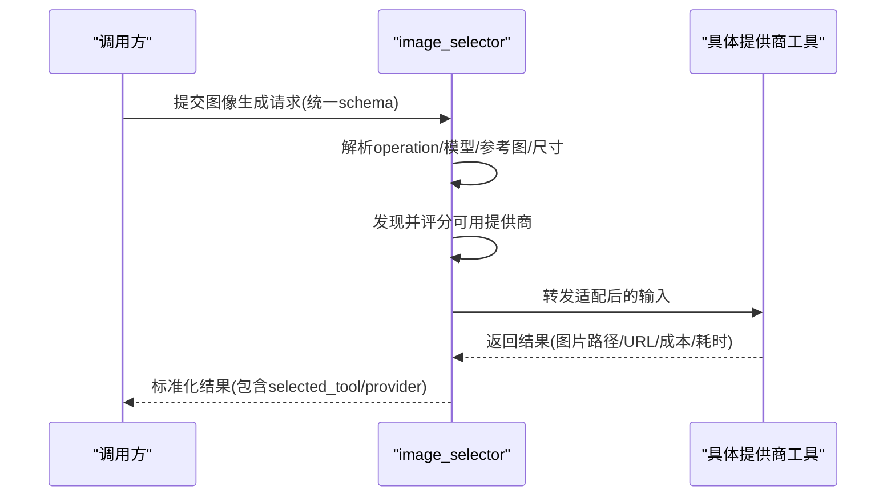
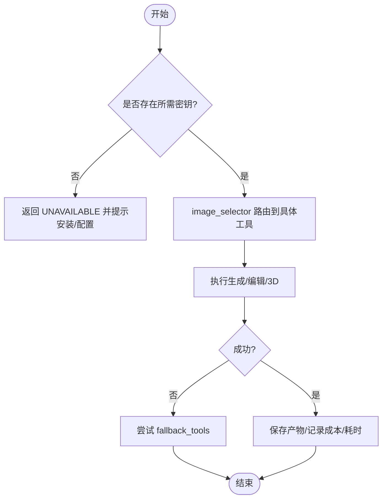

# 图像生成适配器

<cite>
**本文引用的文件**
- [tools/graphics/image_selector.py](file://tools/graphics/image_selector.py)
- [tools/graphics/openai_image.py](file://tools/graphics/openai_image.py)
- [tools/graphics/dashscope_image.py](file://tools/graphics/dashscope_image.py)
- [tools/graphics/hunyuan_image.py](file://tools/graphics/hunyuan_image.py)
- [tools/graphics/grok_image.py](file://tools/graphics/grok_image.py)
- [tools/graphics/minimax_image.py](file://tools/graphics/minimax_image.py)
- [tools/graphics/recraft_image.py](file://tools/graphics/recraft_image.py)
- [tools/graphics/fal_3d.py](file://tools/graphics/fal_3d.py)
- [docs/PROVIDERS.md](file://docs/PROVIDERS.md)
</cite>

## 目录
1. [简介](#简介)
2. [项目结构](#项目结构)
3. [核心组件](#核心组件)
4. [架构总览](#架构总览)
5. [详细组件分析](#详细组件分析)
6. [依赖关系分析](#依赖关系分析)
7. [性能与成本优化](#性能与成本优化)
8. [故障排查指南](#故障排查指南)
9. [结论](#结论)
10. [附录：API调用示例与最佳实践](#附录api调用示例与最佳实践)

## 简介
本文件面向“图像生成适配器”的统一接入与使用，覆盖 OpenAI、fal.ai（含 Recraft）、DashScope（阿里百炼）、Hunyuan（腾讯混元）等提供商的接入方式、配置方法、能力边界、分辨率选项、风格控制、参数设置与调用流程。文档同时说明批量生成、种子控制、质量优化技巧，以及各提供商的价格对比、使用限制与最佳实践，确保在 OpenMontage 中通过统一的 image_selector 路由到具体提供商时，接口行为一致、可观测、可回退。

## 项目结构
OpenMontage 将图像生成能力以“工具（BaseTool）”形式实现，并通过 image_selector 自动发现并选择最合适的提供商。新增提供商只需在 tools/graphics 下提供工具类，无需修改 selector。

图表来源
- [tools/graphics/image_selector.py:15-183](file://tools/graphics/image_selector.py#L15-L183)
- [tools/graphics/openai_image.py:25-84](file://tools/graphics/openai_image.py#L25-L84)
- [tools/graphics/dashscope_image.py:29-101](file://tools/graphics/dashscope_image.py#L29-L101)
- [tools/graphics/hunyuan_image.py:42-182](file://tools/graphics/hunyuan_image.py#L42-L182)
- [tools/graphics/grok_image.py:46-128](file://tools/graphics/grok_image.py#L46-L128)
- [tools/graphics/minimax_image.py:37-112](file://tools/graphics/minimax_image.py#L37-L112)
- [tools/graphics/recraft_image.py:27-99](file://tools/graphics/recraft_image.py#L27-L99)
- [tools/graphics/fal_3d.py:52-96](file://tools/graphics/fal_3d.py#L52-L96)

章节来源
- [tools/graphics/image_selector.py:1-467](file://tools/graphics/image_selector.py#L1-L467)
- [docs/PROVIDERS.md:29-81](file://docs/PROVIDERS.md#L29-L81)

## 核心组件
- image_selector：统一入口，自动发现所有 capability="image_generation" 的工具，按任务上下文评分选择最优提供商；支持 rank 模式返回候选排序；支持 edit/generate 模式分流；支持自定义 ComfyUI 工作流路由。
- openai_image：OpenAI GPT Image 2 文本转图像，支持多输出、尺寸、质量、格式。
- dashscope_image：DashScope Qwen-Image 系列，支持中文提示词理解、负向提示、种子、尺寸、水印、批量。
- hunyuan_image：腾讯混元 TokenHub 异步提交+轮询，支持参考图、分辨率、种子、水印、提示词改写。
- grok_image：xAI Grok 图像生成与编辑，支持多图合成、比例、分辨率、批量。
- minimax_image：MiniMax 官方直连，支持种子、比例、自定义尺寸、主体参考、URL/Base64 响应。
- recraft_image：Recraft V4（via fal.ai），适合 Logo/矢量/文字渲染，支持颜色主题与尺寸预设。
- fal_3d：fal.ai 文本/图像转 3D 资产，支持 PBR、GLB/OBJ/FBX/PPLY/ZIP 下载与溯源。

章节来源
- [tools/graphics/image_selector.py:15-183](file://tools/graphics/image_selector.py#L15-L183)
- [tools/graphics/openai_image.py:25-84](file://tools/graphics/openai_image.py#L25-L84)
- [tools/graphics/dashscope_image.py:29-101](file://tools/graphics/dashscope_image.py#L29-L101)
- [tools/graphics/hunyuan_image.py:42-182](file://tools/graphics/hunyuan_image.py#L42-L182)
- [tools/graphics/grok_image.py:46-128](file://tools/graphics/grok_image.py#L46-L128)
- [tools/graphics/minimax_image.py:37-112](file://tools/graphics/minimax_image.py#L37-L112)
- [tools/graphics/recraft_image.py:27-99](file://tools/graphics/recraft_image.py#L27-L99)
- [tools/graphics/fal_3d.py:52-96](file://tools/graphics/fal_3d.py#L52-L96)

## 架构总览
image_selector 作为能力层抽象，屏蔽底层提供商差异。调用方仅传入统一输入（prompt、seed、n、resolution/size、reference images 等），selector 会：
- 根据 operation=generate/edit 过滤支持编辑或生成的工具
- 根据 model/model_name 精确匹配
- 根据 task_context（提示词长度、是否需多图编辑、是否需要 SVG 等）评分
- 优先 preferred_provider，否则按评分最高可用工具执行
- 失败时按 fallback_tools 自动重试

图表来源
- [tools/graphics/image_selector.py:218-332](file://tools/graphics/image_selector.py#L218-L332)

章节来源
- [tools/graphics/image_selector.py:185-467](file://tools/graphics/image_selector.py#L185-L467)

## 详细组件分析

### OpenAI（GPT Image 2）
- 能力：文本转图像、多输出、多种尺寸与质量、PNG/JPEG/WebP
- 关键参数：model=gpt-image-2，size（1024x1024/1536x1024/1024x1536/auto），quality（low/medium/high/auto），n（1-4），output_format
- 价格估算：按 quality 与 n 计算（例如 high 约 $0.211/张）
- 限制：离线不可用；高质量成本高
- 典型用法：复杂构图、带文字的图示、遵循指令能力强

章节来源
- [tools/graphics/openai_image.py:25-84](file://tools/graphics/openai_image.py#L25-L84)
- [tools/graphics/openai_image.py:118-183](file://tools/graphics/openai_image.py#L118-L183)
- [docs/PROVIDERS.md:17-19](file://docs/PROVIDERS.md#L17-L19)

### DashScope（阿里百炼 Qwen-Image）
- 能力：文本转图像、负向提示、种子、尺寸、批量、水印开关、提示词扩展
- 关键参数：model（qwen-image-2.0-pro/qwen-image-max/wan2.7-image/z-image-turbo），size（W*H，如 1024*1024），n（1-6），negative_prompt，prompt_extend，watermark，seed
- 价格估算：按 n 估算（约 $0.02/张，实际以控制台为准）
- 限制：离线不可用；非 OpenAI 兼容端点，使用 DashScope 原生 multimodal-generation
- 典型用法：中文提示词理解强、性价比好

章节来源
- [tools/graphics/dashscope_image.py:29-101](file://tools/graphics/dashscope_image.py#L29-L101)
- [tools/graphics/dashscope_image.py:143-211](file://tools/graphics/dashscope_image.py#L143-L211)
- [docs/PROVIDERS.md:256-291](file://docs/PROVIDERS.md#L256-L291)

### Hunyuan（腾讯混元 TokenHub）
- 能力：文本转图像、参考图（最多3张）、分辨率、种子、提示词改写、水印控制
- 关键参数：prompt，images（URL或本地路径转 data URI），resolution（W:H，如 1024:1024），seed，revise（0/1），logo_add（0/1），logo_param（可选 logo_url/logo_image），poll_interval_seconds，timeout_seconds
- 价格估算：约 $0.08/张（基于 TokenHub 积分换算）
- 限制：必须显式 output_path；需要 Tencent Cloud TokenHub 账户与实名
- 典型用法：中文友好、直接走腾讯云配额、支持参考图风格/主体一致性

章节来源
- [tools/graphics/hunyuan_image.py:42-182](file://tools/graphics/hunyuan_image.py#L42-L182)
- [tools/graphics/hunyuan_image.py:254-330](file://tools/graphics/hunyuan_image.py#L254-L330)
- [docs/PROVIDERS.md:293-309](file://docs/PROVIDERS.md#L293-L309)

### Grok（xAI 图像生成与编辑）
- 能力：文本转图像、图像编辑、多图合成、比例、分辨率、批量
- 关键参数：generation_mode（generate/edit），model=grok-imagine-image，aspect_ratio（如 16:9），resolution（1k/2k），n（1-10），image_url/image_path/image_urls/image_paths
- 价格估算：$0.02/生成图 + $0.002/输入图（编辑或多图合成）
- 限制：离线不可用；严格种子复现不保证
- 典型用法：单图编辑、风格迁移、多图合成到一帧

章节来源
- [tools/graphics/grok_image.py:46-128](file://tools/graphics/grok_image.py#L46-L128)
- [tools/graphics/grok_image.py:152-200](file://tools/graphics/grok_image.py#L152-L200)
- [docs/PROVIDERS.md:109-141](file://docs/PROVIDERS.md#L109-L141)

### MiniMax（官方直连）
- 能力：文本转图像、种子、比例、自定义尺寸、主体参考、URL/Base64 响应
- 关键参数：model（image-01/image-01-live），subject_reference（角色参考），aspect_ratio（如 16:9），width/height（512-2048，8的倍数），response_format（url/base64），seed，n（1-9），prompt_optimizer
- 价格估算：约 $0.0035/张（官方全球按量）
- 限制：离线不可用；需 MINIMAX_API_KEY，可选 MINIMAX_REGION（global/cn）
- 典型用法：首方 API、支持中国大陆节点、种子可控

章节来源
- [tools/graphics/minimax_image.py:37-112](file://tools/graphics/minimax_image.py#L37-L112)
- [tools/graphics/minimax_image.py:172-200](file://tools/graphics/minimax_image.py#L172-L200)
- [docs/PROVIDERS.md:360-404](file://docs/PROVIDERS.md#L360-L404)

### Recraft（via fal.ai）
- 能力：Logo/品牌素材、SVG 矢量、准确文字渲染、颜色主题、尺寸预设
- 关键参数：model（v4/v4-pro），image_size（square/square_hd/landscape/portrait 等），style（any/realistic_image/digital_illustration/vector_illustration/icon），colors（十六进制色板）
- 价格估算：v4 约 $0.04/张，v4-pro 约 $0.25/张
- 限制：离线不可用；style 参数在某些端点可能不被接受（建议写入 prompt）
- 典型用法：品牌视觉、图标、矢量图形

章节来源
- [tools/graphics/recraft_image.py:27-99](file://tools/graphics/recraft_image.py#L27-L99)
- [tools/graphics/recraft_image.py:117-196](file://tools/graphics/recraft_image.py#L117-L196)
- [docs/PROVIDERS.md:311-358](file://docs/PROVIDERS.md#L311-L358)

### fal.ai 3D 资产（文本/图像转3D）
- 能力：text_to_3d、image_to_3d、reconstruct_objects（多对象重建），PBR/GLB/OBJ/FBX/PPLY/ZIP 导出
- 关键参数：operation，prompt/image_url/image_path，enable_pbr，export_textured_glb，detection_threshold，seed，poll_timeout_seconds
- 价格估算：text/image to 3D 约 $0.225 + PBR 附加；reconstruct_objects 约 $0.02
- 限制：离线不可用；需 FAL_KEY；异步队列提交+轮询
- 典型用法：概念图转 3D 道具、区域概念图提取多个 GLB 并放置

章节来源
- [tools/graphics/fal_3d.py:52-96](file://tools/graphics/fal_3d.py#L52-L96)
- [tools/graphics/fal_3d.py:113-213](file://tools/graphics/fal_3d.py#L113-L213)

## 依赖关系分析
- 环境变量与密钥
  - OPENAI_API_KEY：OpenAI 图像
  - DASHSCOPE_API_KEY：DashScope 图像
  - TENCENT_TOKENHUB_API_KEY：Hunyuan 图像
  - XAI_API_KEY：Grok 图像
  - MINIMAX_API_KEY（可选 MINIMAX_REGION/MINIMAX_BASE_URL）：MiniMax 图像
  - FAL_KEY（或 FAL_AI_API_KEY）：Recraft、FLUX、3D 资产等
- 运行时状态检测
  - 各工具 get_status() 检查对应环境变量，selector 聚合可用性
- 回退策略
  - 每个 provider 声明 fallback_tools，selector 在失败时自动切换

图表来源
- [tools/graphics/image_selector.py:206-236](file://tools/graphics/image_selector.py#L206-L236)
- [tools/graphics/openai_image.py:113-131](file://tools/graphics/openai_image.py#L113-L131)
- [tools/graphics/dashscope_image.py:132-149](file://tools/graphics/dashscope_image.py#L132-L149)
- [tools/graphics/hunyuan_image.py:225-260](file://tools/graphics/hunyuan_image.py#L225-L260)
- [tools/graphics/grok_image.py:138-141](file://tools/graphics/grok_image.py#L138-L141)
- [tools/graphics/minimax_image.py:141-149](file://tools/graphics/minimax_image.py#L141-L149)
- [tools/graphics/recraft_image.py:112-129](file://tools/graphics/recraft_image.py#L112-L129)
- [tools/graphics/fal_3d.py:105-116](file://tools/graphics/fal_3d.py#L105-L116)

章节来源
- [docs/PROVIDERS.md:29-81](file://docs/PROVIDERS.md#L29-L81)
- [tools/graphics/image_selector.py:185-236](file://tools/graphics/image_selector.py#L185-L236)

## 性能与成本优化
- 批量生成
  - OpenAI：n（1-4），注意 cost 线性增长
  - DashScope：n（1-6），URL 有效期短，及时下载
  - Hunyuan：参考图最多3张，合理控制 resolution 与 revise
  - Grok：n（1-10），多图合成会增加输入图费用
  - MiniMax：n（1-9），支持 URL/Base64 响应，避免重复下载
  - Recraft：一次一张，但可通过多次调用并行化
- 种子控制
  - DashScope/Hunyuan/MiniMax 支持 seed，便于复现实验
  - OpenAI/Grok 为随机性更强，不适合严格复现
- 质量与成本权衡
  - OpenAI quality：low/medium/high/auto，高画质显著增加成本
  - Recraft v4 vs v4-pro：后者更贵但质量更高
  - Hunyuan revise=1 提升语义理解但增加耗时
- 网络与超时
  - 异步提供商（Hunyuan、fal_3d）需合理设置 poll_interval/timeout
  - DashScope 临时 URL 需尽快下载
- 缓存与幂等
  - 各工具定义 idempotency_key_fields，可用于去重与缓存

章节来源
- [tools/graphics/openai_image.py:118-183](file://tools/graphics/openai_image.py#L118-L183)
- [tools/graphics/dashscope_image.py:137-211](file://tools/graphics/dashscope_image.py#L137-L211)
- [tools/graphics/hunyuan_image.py:230-330](file://tools/graphics/hunyuan_image.py#L230-L330)
- [tools/graphics/grok_image.py:152-200](file://tools/graphics/grok_image.py#L152-L200)
- [tools/graphics/minimax_image.py:172-200](file://tools/graphics/minimax_image.py#L172-L200)
- [tools/graphics/recraft_image.py:117-196](file://tools/graphics/recraft_image.py#L117-L196)
- [tools/graphics/fal_3d.py:108-213](file://tools/graphics/fal_3d.py#L108-L213)

## 故障排查指南
- 常见错误
  - 缺少密钥：各工具 get_status()/execute() 会返回 UNAVAILABLE 并给出安装指引
  - 参数校验失败：如 DashScope size 格式、Hunyuan 必填 output_path、MiniMax width/height 成对且为8的倍数
  - 网络超时/限流：RetryPolicy 已内置 rate_limit/timeout 重试，必要时增大 timeout/poll_interval
  - 临时链接过期：DashScope 与 Hunyuan 返回的 URL 有效期有限，应尽快下载
- 诊断步骤
  - 检查环境变量是否正确设置
  - 使用 image_selector operation=rank 查看候选提供商评分与原因
  - 逐步缩小范围：固定 model/size/seed，观察是否仍失败
  - 查看 ToolResult 中的 error、duration_seconds、cost_usd 定位瓶颈

章节来源
- [tools/graphics/image_selector.py:227-236](file://tools/graphics/image_selector.py#L227-L236)
- [tools/graphics/dashscope_image.py:143-193](file://tools/graphics/dashscope_image.py#L143-L193)
- [tools/graphics/hunyuan_image.py:254-330](file://tools/graphics/hunyuan_image.py#L254-L330)
- [tools/graphics/minimax_image.py:172-200](file://tools/graphics/minimax_image.py#L172-L200)
- [tools/graphics/recraft_image.py:123-182](file://tools/graphics/recraft_image.py#L123-L182)
- [tools/graphics/fal_3d.py:113-203](file://tools/graphics/fal_3d.py#L113-L203)

## 结论
通过 image_selector 统一入口，OpenMontage 实现了跨提供商的图像生成能力标准化：一致的输入/输出契约、自动路由与回退、可观测的成本与耗时、以及可扩展的新提供商接入。针对文本转图像、图像编辑与3D场景生成，各提供商提供了差异化优势（如中文理解、矢量输出、3D PBR 等）。在生产环境中，建议结合批量生成、种子控制、质量与成本权衡策略，并配合完善的错误处理与监控。

## 附录：API调用示例与最佳实践

### 统一入口调用（image_selector）
- 文本转图像
  - 输入：prompt、n、size/resolution、seed（可选）
  - 行为：selector 自动选择可用提供商，返回 selected_tool/provider 与 artifacts
- 图像编辑
  - 输入：generation_mode="edit"，image_url/image_path 或 image_urls/image_paths，prompt
  - 行为：筛选支持 image_edit 的工具（如 grok_image）
- 3D 场景生成
  - 输入：fal_3d.operation=text_to_3d 或 image_to_3d，prompt 或 image_url，enable_pbr，seed
  - 行为：异步提交+轮询，下载 GLB/OBJ/FBX/PPLY/ZIP，并生成 .provenance.json

章节来源
- [tools/graphics/image_selector.py:218-332](file://tools/graphics/image_selector.py#L218-L332)
- [tools/graphics/fal_3d.py:113-213](file://tools/graphics/fal_3d.py#L113-L213)

### 各提供商关键参数速查
- OpenAI：model=gpt-image-2，size，quality，n，output_format
- DashScope：model，size（W*H），n，negative_prompt，prompt_extend，watermark，seed
- Hunyuan：prompt，images（URL或data URI），resolution（W:H），seed，revise，logo_add，logo_param
- Grok：generation_mode，model，aspect_ratio，resolution，n，image_url/path(s)
- MiniMax：model，subject_reference，aspect_ratio，width/height，response_format，seed，n，prompt_optimizer
- Recraft：model（v4/v4-pro），image_size，style，colors

章节来源
- [tools/graphics/openai_image.py:56-84](file://tools/graphics/openai_image.py#L56-L84)
- [tools/graphics/dashscope_image.py:64-101](file://tools/graphics/dashscope_image.py#L64-L101)
- [tools/graphics/hunyuan_image.py:82-182](file://tools/graphics/hunyuan_image.py#L82-L182)
- [tools/graphics/grok_image.py:86-128](file://tools/graphics/grok_image.py#L86-L128)
- [tools/graphics/minimax_image.py:74-112](file://tools/graphics/minimax_image.py#L74-L112)
- [tools/graphics/recraft_image.py:65-99](file://tools/graphics/recraft_image.py#L65-L99)

### 价格对比与使用限制（摘要）
- OpenAI：~$0.006-$0.211/张（取决于 quality），高质量成本高
- DashScope：~$0.02/张，中文理解强
- Hunyuan：~$0.08/张，TokenHub 积分计费，需实名
- Grok：$0.02/张 + $0.002/输入图（编辑/合成）
- MiniMax：~$0.0035/张，支持 global/cn 节点
- Recraft：v4 ~$0.04/张，v4-pro ~$0.25/张
- fal.ai 3D：text/image to 3D ~$0.225+$0.15（PBR），reconstruct_objects ~$0.02

章节来源
- [docs/PROVIDERS.md:17-19](file://docs/PROVIDERS.md#L17-L19)
- [docs/PROVIDERS.md:109-141](file://docs/PROVIDERS.md#L109-L141)
- [docs/PROVIDERS.md:256-291](file://docs/PROVIDERS.md#L256-L291)
- [docs/PROVIDERS.md:293-309](file://docs/PROVIDERS.md#L293-L309)
- [docs/PROVIDERS.md:311-358](file://docs/PROVIDERS.md#L311-L358)
- [docs/PROVIDERS.md:360-404](file://docs/PROVIDERS.md#L360-L404)

### 最佳实践
- 优先使用 image_selector 进行路由，减少硬编码
- 明确指定 output_path，避免默认路径污染工作目录
- 批量生成时控制 n，并结合 seed 做实验对比
- 对中文场景优先考虑 DashScope/Hunyuan
- 对品牌/矢量需求优先考虑 Recraft
- 对 3D 资产需求使用 fal_3d，并开启 PBR 以获得更好材质表现
- 关注各提供商 URL 有效期，及时下载并归档

章节来源
- [tools/graphics/image_selector.py:218-332](file://tools/graphics/image_selector.py#L218-L332)
- [tools/graphics/hunyuan_image.py:283-310](file://tools/graphics/hunyuan_image.py#L283-L310)
- [tools/graphics/dashscope_image.py:175-184](file://tools/graphics/dashscope_image.py#L175-L184)
- [tools/graphics/fal_3d.py:167-201](file://tools/graphics/fal_3d.py#L167-L201)