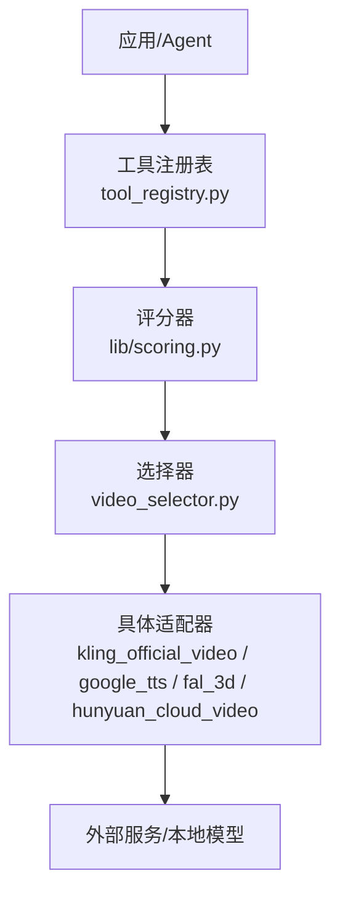
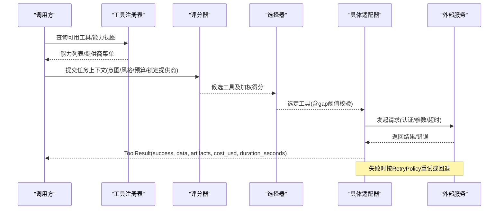
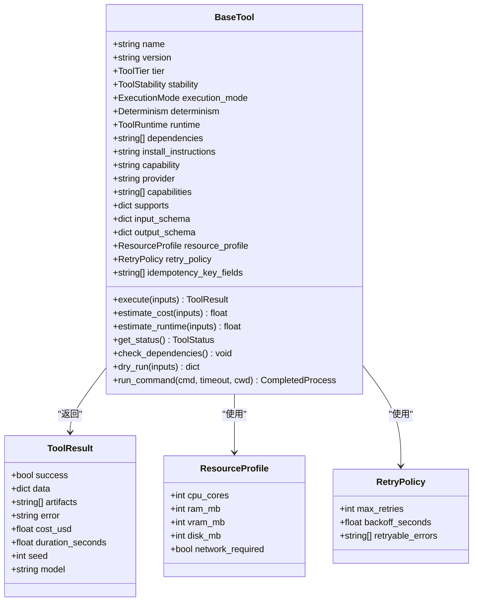
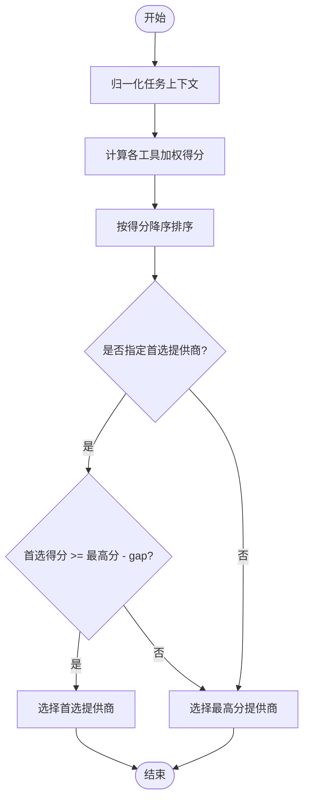
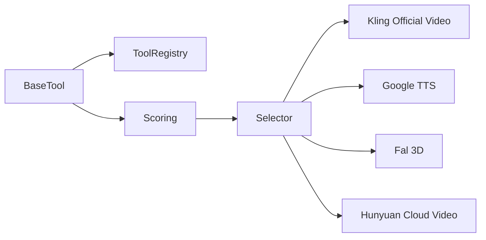

# 提供商适配器API

<cite>
**本文引用的文件**
- [base_tool.py](file://tools/base_tool.py)
- [tool_registry.py](file://tools/tool_registry.py)
- [scoring.py](file://lib/scoring.py)
- [video_selector.py](file://tools/video/video_selector.py)
- [kling_official_video.py](file://tools/video/kling_official_video.py)
- [google_tts.py](file://tools/audio/google_tts.py)
- [fal_3d.py](file://tools/graphics/fal_3d.py)
- [hunyuan_cloud_video.py](file://tools/video/hunyuan_cloud_video.py)
- [PROVIDERS.md](file://docs/PROVIDERS.md)
- [README.md](file://README.md)
</cite>

## 目录
1. [简介](#简介)
2. [项目结构](#项目结构)
3. [核心组件](#核心组件)
4. [架构总览](#架构总览)
5. [详细组件分析](#详细组件分析)
6. [依赖关系分析](#依赖关系分析)
7. [性能考虑](#性能考虑)
8. [故障排除指南](#故障排除指南)
9. [结论](#结论)
10. [附录](#附录)

## 简介
本文件为 OpenMontage 的“AI 服务提供商适配器”统一接口文档。目标是定义视频生成、图像处理、语音合成等能力的标准接入协议，覆盖认证方式、参数格式、响应结构、错误处理与重试策略；提供新提供商集成的开发指南与模板；说明提供商选择策略与质量评估机制；给出各提供商的配置示例与调用方式；并包含性能优化建议与故障排除指南，确保适配器接口的通用性与可维护性。

OpenMontage 通过统一的 BaseTool 抽象、工具注册表、评分器与选择器，将不同云厂商与本地模型以一致契约暴露给上层编排与 Agent。新增提供商只需实现 BaseTool 并声明元数据（能力、输入输出 Schema、资源需求、成本估算、回退工具等），即可被自动发现、评分与调度。

## 项目结构
- 工具基座与契约
  - tools/base_tool.py：定义 BaseTool、ToolResult、ResourceProfile、RetryPolicy、执行模式、稳定性、状态、依赖检查、成本估算、幂等键、事件埋点等统一契约。
  - tools/tool_registry.py：工具自动发现、按能力/提供商/状态查询、支持包络报告、提供商菜单汇总。
- 选择与评分
  - lib/scoring.py：七维加权评分（任务契合度、输出质量、可控性、可靠性、成本效率、延迟、连续性）与生产路径评分。
  - tools/video/video_selector.py：基于评分与偏好阈值的最终工具选择。
- 具体提供商适配器示例
  - 视频：tools/video/kling_official_video.py、tools/video/hunyuan_cloud_video.py
  - 语音：tools/audio/google_tts.py
  - 图像/3D：tools/graphics/fal_3d.py
- 配置与参考
  - docs/PROVIDERS.md：各提供商环境密钥、端点、定价、能力与注意事项。
  - README.md：总体架构、能力清单、运行流程与治理要点。

**图表来源**
- [tool_registry.py:118-134](file://tools/tool_registry.py#L118-L134)
- [scoring.py:373-542](file://lib/scoring.py#L373-L542)
- [video_selector.py:413-440](file://tools/video/video_selector.py#L413-L440)
- [kling_official_video.py:45-78](file://tools/video/kling_official_video.py#L45-L78)
- [google_tts.py:33-78](file://tools/audio/google_tts.py#L33-L78)
- [fal_3d.py:52-103](file://tools/graphics/fal_3d.py#L52-L103)
- [hunyuan_cloud_video.py:508-530](file://tools/video/hunyuan_cloud_video.py#L508-L530)

**章节来源**
- [base_tool.py:227-397](file://tools/base_tool.py#L227-L397)
- [tool_registry.py:55-134](file://tools/tool_registry.py#L55-L134)
- [scoring.py:21-70](file://lib/scoring.py#L21-L70)
- [video_selector.py:413-440](file://tools/video/video_selector.py#L413-L440)
- [README.md:450-475](file://README.md#L450-L475)

## 核心组件
- BaseTool（统一适配器契约）
  - 身份与元数据：name、version、tier、capability、provider、stability、runtime、execution_mode、determinism。
  - 能力描述：capabilities、supports、best_for、not_good_for、input_schema/output_schema/artifact_schema。
  - 资源与重试：ResourceProfile（CPU/RAM/VRAM/Disk/网络）、RetryPolicy（最大重试、退避、可重试错误）。
  - 成本与运行时估计：estimate_cost()、estimate_runtime()。
  - 幂等与恢复：idempotency_key_fields、resume_support。
  - 依赖检查：check_dependencies()（env/cmd/binary/python）。
  - 执行入口：execute(inputs) -> ToolResult（success/data/artifacts/error/cost_usd/duration_seconds/seed/model）。
  - 事件埋点：execute 自动包装 Backlot 事件（start/finish/error），便于看板追踪。
- ToolRegistry（工具注册与发现）
  - discover() 自动扫描 tools 包，注册所有 BaseTool 子类。
  - support_envelope()/capability_catalog()/provider_menu()/provider_menu_summary() 提供能力视图与就绪提示。
  - find_fallback() 根据声明的回退链选择可用替代。
- Scoring（提供商评分）
  - ProviderScore：七维度加权得分与解释。
  - normalize_task_context()：将松散意图/风格/预算/锁定提供商等归一化。
  - score_provider()/rank_providers()：计算并排序候选工具。
- Selector（选择器）
  - 在评分基础上尊重 preferred_provider 与 gap 阈值，返回最终工具与评分。

**章节来源**
- [base_tool.py:63-139](file://tools/base_tool.py#L63-L139)
- [base_tool.py:227-397](file://tools/base_tool.py#L227-L397)
- [tool_registry.py:118-196](file://tools/tool_registry.py#L118-L196)
- [scoring.py:21-70](file://lib/scoring.py#L21-L70)
- [scoring.py:297-359](file://lib/scoring.py#L297-L359)
- [scoring.py:373-542](file://lib/scoring.py#L373-L542)
- [video_selector.py:413-440](file://tools/video/video_selector.py#L413-L440)

## 架构总览
OpenMontage 的适配器架构遵循“统一契约 + 自动发现 + 评分选择 + 多回退”的设计：
- 每个提供商实现一个 BaseTool 子类，声明能力、Schema、资源与成本。
- 注册表自动发现并聚合能力视图。
- 评分器依据任务上下文对候选工具打分。
- 选择器结合用户偏好与阈值确定最终工具。
- 执行时通过 ToolResult 统一返回结果、成本、时长与产物。
- 失败时按 RetryPolicy 重试或走 fallback_tools 回退。

**图表来源**
- [tool_registry.py:198-230](file://tools/tool_registry.py#L198-L230)
- [scoring.py:373-542](file://lib/scoring.py#L373-L542)
- [video_selector.py:413-440](file://tools/video/video_selector.py#L413-L440)
- [base_tool.py:148-224](file://tools/base_tool.py#L148-L224)

## 详细组件分析

### 统一适配器契约（BaseTool）
- 关键职责
  - 声明能力与约束：capabilities、supports、input_schema/output_schema。
  - 资源与重试：ResourceProfile、RetryPolicy。
  - 成本与运行时估计：estimate_cost()、estimate_runtime()。
  - 执行与结果：execute(inputs) -> ToolResult。
  - 依赖检查：check_dependencies() 支持 env:/cmd:/binary:/python: 前缀。
  - 幂等键：idempotency_key_fields 用于缓存/去重。
  - 事件埋点：execute 自动注入 start/finish/error 事件。
- 扩展点
  - get_status()：动态可用性（如 API Key 是否存在）。
  - dry_run()：预检不产生副作用。
  - run_command()：跨平台子进程封装。

**图表来源**
- [base_tool.py:110-139](file://tools/base_tool.py#L110-L139)
- [base_tool.py:227-397](file://tools/base_tool.py#L227-L397)

**章节来源**
- [base_tool.py:63-139](file://tools/base_tool.py#L63-L139)
- [base_tool.py:227-397](file://tools/base_tool.py#L227-L397)

### 工具注册与发现（ToolRegistry）
- 自动发现：discover(package_name="tools") 遍历子模块，注册所有 BaseTool 子类。
- 能力视图：support_envelope()/capability_catalog()/provider_menu()/provider_menu_summary()。
- 回退查找：find_fallback(tool_name) 按 fallback/fallback_tools 顺序寻找可用替代。
- 环境加载：内部 _load_dotenv() 读取 .env 注入环境变量，供工具检测依赖。

**章节来源**
- [tool_registry.py:86-134](file://tools/tool_registry.py#L86-L134)
- [tool_registry.py:198-230](file://tools/tool_registry.py#L198-L230)
- [tool_registry.py:249-314](file://tools/tool_registry.py#L249-L314)
- [tool_registry.py:316-471](file://tools/tool_registry.py#L316-L471)

### 提供商评分与选择（Scoring + Selector）
- 评分维度
  - 任务契合度（30%）、输出质量（20%）、可控性（15%）、可靠性（15%）、成本效率（10%）、延迟（5%）、连续性（5%）。
- 上下文归一化：normalize_task_context() 将 intent/style/budget/locked_providers/motion_required/asset_type 等标准化。
- 选择策略：video_selector 在首选提供商与最高分之间按 gap 阈值决策，否则取最高分。

**图表来源**
- [scoring.py:297-359](file://lib/scoring.py#L297-L359)
- [scoring.py:373-542](file://lib/scoring.py#L373-L542)
- [video_selector.py:413-440](file://tools/video/video_selector.py#L413-L440)

**章节来源**
- [scoring.py:21-70](file://lib/scoring.py#L21-L70)
- [scoring.py:373-542](file://lib/scoring.py#L373-L542)
- [video_selector.py:413-440](file://tools/video/video_selector.py#L413-L440)

### 视频生成适配器示例：Kling Official
- 能力与约束
  - 能力：text_to_video、image_to_video、reference_to_video。
  - 支持：reference_image、negative_prompt、aspect_ratio 等。
  - 最佳用途：官方直连 Kling 视频生成，区分于 fal.ai 路由。
  - 回退：kling_video、seedance_video、veo_video、minimax_video。
- 输入 Schema
  - 必填：prompt。
  - 可选：operation、api_family、model_name、duration、aspect_ratio、resolution、mode、sound、negative_prompt、reference_*、multi_shot、camera_control、callback_url、timeout_seconds、poll_interval、output_path 等。
- 成本估算
  - 基于 api_family、mode、duration、sound、Omni 引用数量与 multi_prompt 数量进行估算。
- 重试策略
  - 可重试错误码：1302、1303、5000、5001、5002。
- 资源需求
  - 需要网络访问，磁盘预留约 500MB。

**章节来源**
- [kling_official_video.py:45-177](file://tools/video/kling_official_video.py#L45-L177)
- [kling_official_video.py:179-200](file://tools/video/kling_official_video.py#L179-L200)

### 语音合成适配器示例：Google TTS
- 能力与约束
  - 能力：text_to_speech、voice_selection、ssml_support、multilingual。
  - 支持：native_audio、ssml、multilingual。
  - 最佳用途：多语言本地化、高质量语音（Chirp/Neural2/WaveNet/Studio）。
  - 回退：openai_tts、elevenlabs_tts、piper_tts。
- 输入 Schema
  - 必填：text。
  - 可选：input_type、voice、language_code、speaking_rate、pitch、audio_encoding、output_path。
- 成本估算
  - 按字符数与语音类型计费（Chirp3-HD、Studio、Neural2/Journey、WaveNet、Standard）。
- 认证
  - 支持 GOOGLE_TTS_API_KEY / GOOGLE_API_KEY / GEMINI_API_KEY，或 GOOGLE_APPLICATION_CREDENTIALS 服务账号。

**章节来源**
- [google_tts.py:33-140](file://tools/audio/google_tts.py#L33-L140)
- [google_tts.py:172-187](file://tools/audio/google_tts.py#L172-L187)

### 图像/3D 适配器示例：fal_3D
- 能力与约束
  - 能力：text_to_3d、image_to_3d、multi_object_reconstruction、textured_glb、pbr_mesh。
  - 支持：pbr、glb、seed。
  - 最佳用途：从文本/图像快速生成带纹理的 3D 资产。
- 输入 Schema
  - 必填：operation、output_path。
  - 可选：prompt、image_url/image_path、enable_pbr、seed、export_textured_glb、detection_threshold、poll_timeout_seconds。
- 执行流程
  - 异步队列提交 -> 轮询状态 -> 下载产出 GLB/OBJ/PBR 模型 -> 写入 provenance.json。
- 成本估算
  - text_to_3d/image_to_3d 固定基础费用 + PBR 附加；reconstruct_objects 固定费用。

**章节来源**
- [fal_3d.py:52-103](file://tools/graphics/fal_3d.py#L52-L103)
- [fal_3d.py:108-111](file://tools/graphics/fal_3d.py#L108-L111)
- [fal_3d.py:113-200](file://tools/graphics/fal_3d.py#L113-L200)

### 云端视频适配器示例：腾讯混元 TokenHub
- 认证与端点
  - 使用 Bearer 令牌认证，端点由 TokenHub 提供。
- 错误处理
  - 解析 JSON 响应体，若存在 error 字段则抛出异常，携带 code/message。
- 典型流程
  - 提交任务 -> 轮询查询 -> 下载结果。

**章节来源**
- [hunyuan_cloud_video.py:508-530](file://tools/video/hunyuan_cloud_video.py#L508-L530)

## 依赖关系分析
- 耦合与内聚
  - BaseTool 高内聚：每个适配器仅关注自身协议与业务逻辑。
  - ToolRegistry 低耦合：通过反射与约定发现工具，避免硬编码。
  - Scoring/Selector 解耦：评分与选择逻辑独立于具体适配器。
- 直接/间接依赖
  - 适配器依赖 base_tool 契约。
  - 选择器依赖 scoring 与 registry。
  - 注册表依赖 base_tool 与 Python 标准库。
- 外部集成点
  - 各适配器对接外部 API（Kling、Google TTS、fal.ai、TokenHub 等）。
- 循环依赖
  - 未发现循环依赖；分层清晰。

**图表来源**
- [base_tool.py:227-397](file://tools/base_tool.py#L227-L397)
- [tool_registry.py:118-196](file://tools/tool_registry.py#L118-L196)
- [scoring.py:373-542](file://lib/scoring.py#L373-L542)
- [video_selector.py:413-440](file://tools/video/video_selector.py#L413-L440)
- [kling_official_video.py:45-78](file://tools/video/kling_official_video.py#L45-L78)
- [google_tts.py:33-78](file://tools/audio/google_tts.py#L33-L78)
- [fal_3d.py:52-103](file://tools/graphics/fal_3d.py#L52-L103)
- [hunyuan_cloud_video.py:508-530](file://tools/video/hunyuan_cloud_video.py#L508-L530)

**章节来源**
- [tool_registry.py:118-196](file://tools/tool_registry.py#L118-L196)
- [scoring.py:373-542](file://lib/scoring.py#L373-L542)
- [video_selector.py:413-440](file://tools/video/video_selector.py#L413-L440)

## 性能考虑
- 并发与超时
  - 合理设置 poll_timeout_seconds、timeout_seconds，避免长轮询阻塞。
  - 对长耗时任务采用异步+轮询模式（如 fal_3D、Kling Omni）。
- 重试与退避
  - 利用 RetryPolicy 的 max_retries、backoff_seconds、retryable_errors，减少瞬时失败影响。
- 成本与预算
  - 通过 estimate_cost() 与 budget_remaining_usd 控制成本效率评分，避免超支。
- 资源占用
  - 根据 ResourceProfile 预估 CPU/RAM/VRAM/磁盘，避免资源争用。
- 缓存与幂等
  - 使用 idempotency_key_fields 生成幂等键，减少重复计算与网络开销。

[本节为通用指导，无需特定文件来源]

## 故障排除指南
- 认证问题
  - 检查 .env 中对应 API Key 是否已正确设置（如 KLING_API_KEY、GOOGLE_API_KEY、FAL_KEY、TENCENT_TOKENHUB_API_KEY）。
  - 使用 ToolRegistry 的 provider_menu_summary() 查看未配置项与安装提示。
- 依赖缺失
  - check_dependencies() 会检测 env:/cmd:/binary:/python: 依赖，缺失时会抛出 DependencyError。
- 网络与超时
  - 调整 poll_timeout_seconds、timeout_seconds；对远端服务增加重试次数与退避时间。
- 错误分类与重试
  - 针对 429/5xx 等可重试错误启用指数退避；对 400/401/402 等不可重试错误直接上报。
- 提供商特定错误
  - Kling：账户余额/资源包不足时返回特定错误码，需检查控制台。
  - Hunyuan TokenHub：error.code 与 error.message 需记录以便定位。
- 回退策略
  - 当主提供商不可用时，按 fallback_tools 顺序尝试替代方案。

**章节来源**
- [base_tool.py:304-328](file://tools/base_tool.py#L304-L328)
- [tool_registry.py:184-196](file://tools/tool_registry.py#L184-L196)
- [kling_official_video.py:138-142](file://tools/video/kling_official_video.py#L138-L142)
- [hunyuan_cloud_video.py:508-530](file://tools/video/hunyuan_cloud_video.py#L508-L530)
- [PROVIDERS.md:29-81](file://docs/PROVIDERS.md#L29-L81)

## 结论
OpenMontage 通过 BaseTool 统一契约、工具注册表、评分器与选择器，构建了可扩展、可观测、可治理的 AI 提供商适配器体系。新增提供商只需实现 BaseTool 并声明能力与约束，即可无缝融入现有编排与治理流程。该设计确保了跨视频、图像、语音等多模态能力的通用性与可维护性，同时提供了清晰的配置、调用、错误处理与性能优化路径。

[本节为总结性内容，无需特定文件来源]

## 附录

### 统一接口规范摘要
- 认证方式
  - 环境变量注入（.env），由 base_tool 与 tool_registry 自动加载。
  - 各适配器按需读取特定变量（如 KLING_API_KEY、GOOGLE_API_KEY、FAL_KEY、TENCENT_TOKENHUB_API_KEY）。
- 参数格式
  - 每个适配器通过 input_schema 声明必填/可选字段、枚举值、默认值与约束。
- 响应结构
  - 统一返回 ToolResult：success、data、artifacts、error、cost_usd、duration_seconds、seed、model。
- 错误处理
  - 依赖 check_dependencies() 与 RetryPolicy；适配器内部对 HTTP/JSON 响应进行校验与异常转换。
- 提供商选择策略
  - 基于评分器的七维加权得分与选择器的 gap 阈值；支持 preferred_provider 与 locked_providers 保持连续性。
- 质量评估机制
  - 评分器综合任务契合度、输出质量、可控性、可靠性、成本效率、延迟、连续性；支持 quality_score/historical_success_rate/latency_p50_seconds 等度量。

**章节来源**
- [base_tool.py:110-139](file://tools/base_tool.py#L110-L139)
- [base_tool.py:227-397](file://tools/base_tool.py#L227-L397)
- [scoring.py:21-70](file://lib/scoring.py#L21-L70)
- [scoring.py:373-542](file://lib/scoring.py#L373-L542)
- [video_selector.py:413-440](file://tools/video/video_selector.py#L413-L440)

### 新提供商集成指南（模板步骤）
- 创建适配器类
  - 继承 BaseTool，填写 name/version/tier/capability/provider/stability/runtime/dependencies/install_instructions。
  - 声明 capabilities/supports/best_for/not_good_for/input_schema/output_schema/artifact_schema。
  - 配置 ResourceProfile、RetryPolicy、idempotency_key_fields、fallback/fallback_tools。
- 实现核心方法
  - execute(inputs) -> ToolResult：完成认证、参数校验、请求发送、结果解析、产物落盘、成本与时长统计。
  - estimate_cost(inputs) -> float：按用量/时长/分辨率/功能开关估算成本。
  - get_status() -> ToolStatus：检测依赖（如 API Key）并返回可用性。
- 注册与发现
  - 将文件放入 tools/<capability>/ 目录，无需手动注册；ToolRegistry.discover() 会自动发现。
- 测试与验证
  - 使用 ToolRegistry.provider_menu_summary() 检查能力视图与安装提示。
  - 编写单元测试覆盖 execute/estimate_cost/get_status 与错误分支。

**章节来源**
- [tool_registry.py:118-134](file://tools/tool_registry.py#L118-L134)
- [base_tool.py:227-397](file://tools/base_tool.py#L227-L397)

### 各提供商配置示例与调用方式
- 视频生成
  - Kling Official：设置 KLING_API_KEY（可选 KLING_API_BASE_URL）；调用 kling_official_video，传入 prompt、operation、model_name、duration、aspect_ratio、output_path 等。
  - 腾讯混元 TokenHub：设置 TENCENT_TOKENHUB_API_KEY；调用 hunyuan_cloud_video，提交任务后轮询查询并下载结果。
- 语音合成
  - Google TTS：设置 GOOGLE_API_KEY/GEMINI_API_KEY 或 GOOGLE_TTS_API_KEY；调用 google_tts，传入 text、voice、language_code、output_path。
- 图像/3D
  - fal_3D：设置 FAL_KEY；调用 fal_3d，传入 operation、output_path、prompt/image_url 等。

**章节来源**
- [kling_official_video.py:45-177](file://tools/video/kling_official_video.py#L45-L177)
- [google_tts.py:33-140](file://tools/audio/google_tts.py#L33-L140)
- [fal_3d.py:52-103](file://tools/graphics/fal_3d.py#L52-L103)
- [hunyuan_cloud_video.py:508-530](file://tools/video/hunyuan_cloud_video.py#L508-L530)
- [PROVIDERS.md:29-81](file://docs/PROVIDERS.md#L29-L81)

### 性能优化建议
- 合理设置超时与轮询间隔，避免长时间阻塞。
- 利用幂等键减少重复请求与成本。
- 根据 ResourceProfile 规划并发与资源配额。
- 使用评分器的 cost_efficiency 与 latency 维度优化选择。
- 对高频调用开启缓存与批量处理。

[本节为通用指导，无需特定文件来源]