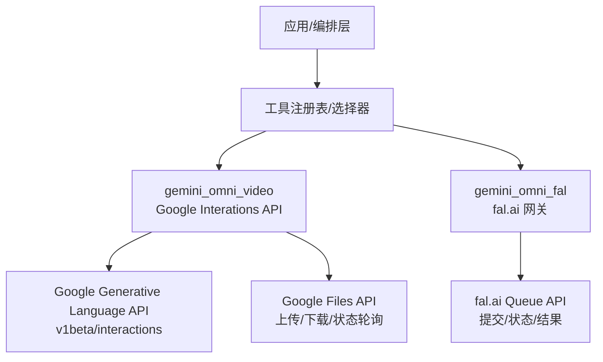
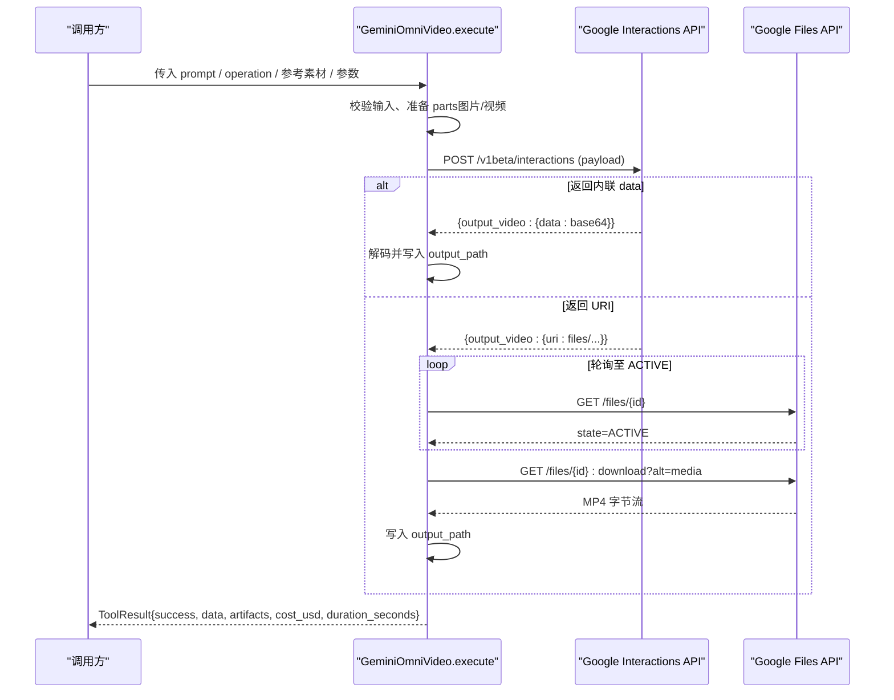
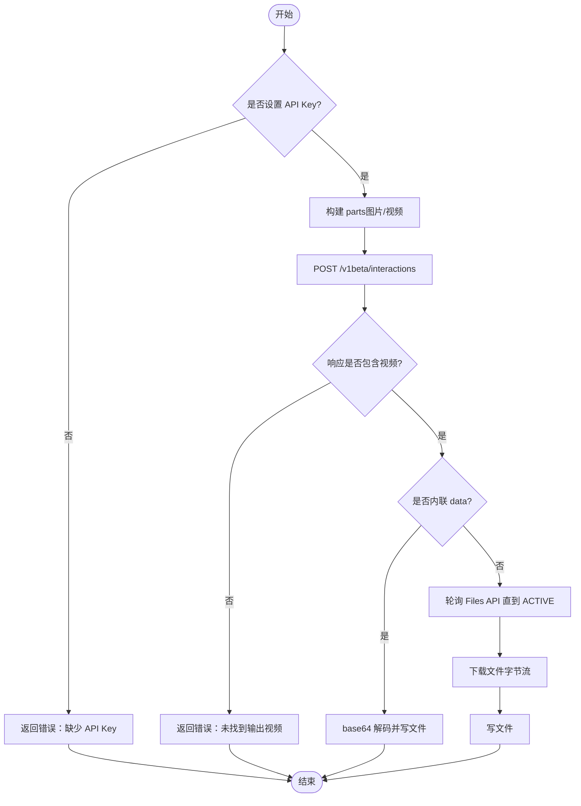
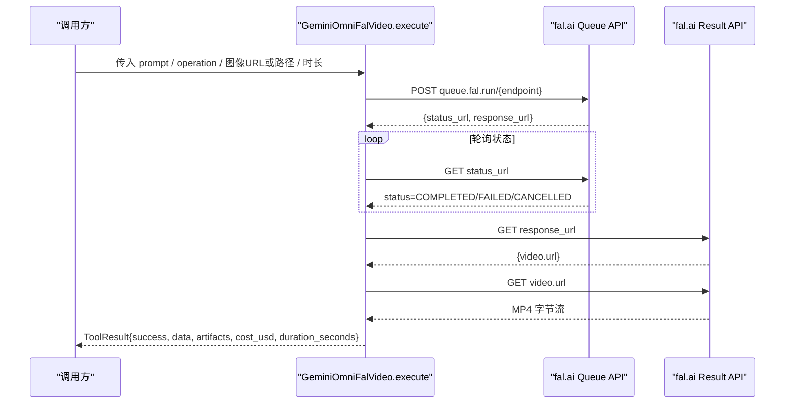
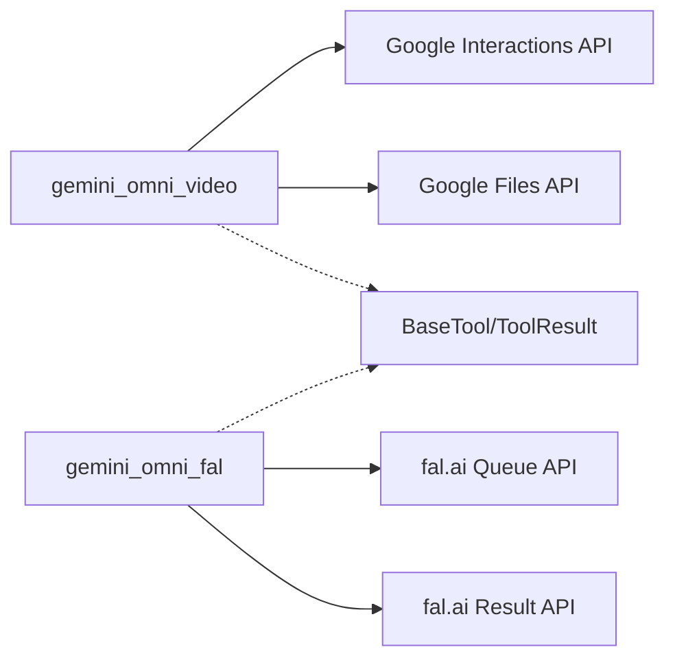

# Gemini Omni视频适配器

<cite>
**本文引用的文件**
- [tools/video/gemini_omni_video.py](file://tools/video/gemini_omni_video.py)
- [tools/video/gemini_omni_fal.py](file://tools/video/gemini_omni_fal.py)
- [.agents/skills/gemini-omni/SKILL.md](file://.agents/skills/gemini-omni/SKILL.md)
- [tools/google_credentials.py](file://tools/google_credentials.py)
- [tests/tools/test_gemini_omni_video.py](file://tests/tools/test_gemini_omni_video.py)
</cite>

## 目录
1. [简介](#简介)
2. [项目结构](#项目结构)
3. [核心组件](#核心组件)
4. [架构总览](#架构总览)
5. [详细组件分析](#详细组件分析)
6. [依赖关系分析](#依赖关系分析)
7. [性能与成本](#性能与成本)
8. [故障排查指南](#故障排查指南)
9. [结论](#结论)
10. [附录：配置与示例](#附录配置与示例)

## 简介
本文件为 OpenMontage 中“Gemini Omni 视频生成适配器”的技术文档，聚焦 Google Gemini 多模态模型在视频生成与对话式编辑中的集成实现。内容涵盖：
- API 密钥与服务账户认证、权限设置
- 支持的输入类型（文本、图像、视频参考）与输出格式
- 多模态视频生成的完整示例（复杂提示词、参考素材管理、质量参数调优）
- 异步处理模式、任务状态监控与结果获取流程
- 错误重试机制、速率限制处理与成本优化策略
- 与其他提供商的性能对比与选择建议

## 项目结构
OpenMontage 将 Gemini Omni 的视频能力以“工具”形式提供，包含两条主要路径：
- 直接调用 Google Interactions API（原生路径）：tools/video/gemini_omni_video.py
- 通过 fal.ai 网关调用：tools/video/gemini_omni_fal.py

此外，技能说明位于 .agents/skills/gemini-omni/SKILL.md，用于指导提示词构建与编辑工作流；Google 认证通用逻辑集中在 tools/google_credentials.py；测试用例覆盖关键行为，见 tests/tools/test_gemini_omni_video.py。

图表来源
- [tools/video/gemini_omni_video.py:38-46](file://tools/video/gemini_omni_video.py#L38-L46)
- [tools/video/gemini_omni_fal.py:144-183](file://tools/video/gemini_omni_fal.py#L144-L183)

章节来源
- [tools/video/gemini_omni_video.py:1-100](file://tools/video/gemini_omni_video.py#L1-L100)
- [tools/video/gemini_omni_fal.py:1-60](file://tools/video/gemini_omni_fal.py#L1-L60)
- [.agents/skills/gemini-omni/SKILL.md:1-45](file://.agents/skills/gemini-omni/SKILL.md#L1-L45)

## 核心组件
- GeminiOmniVideo（原生 Google 路径）
  - 名称：gemini_omni_video
  - 能力：text_to_video、image_to_video、reference_to_video、edit_video、conversational_editing、native_audio、text_rendering、timecode_control
  - 运行模式：同步执行（内部通过轮询等待结果）
  - 稳定性：实验性
  - 默认模型：gemini-omni-flash-preview
  - 输出：MP4（带合成音频），分辨率 720p/24fps，时长 3-10s，宽高比 16:9 或 9:16
  - 成本估算：约 $0.10/秒（按 5,792 输出 token/秒计费）
  - 重试策略：最多 1 次，可重试错误包括 rate_limit、timeout
  - 幂等键字段：prompt、operation、aspect_ratio、previous_interaction_id

- GeminiOmniFalVideo（fal.ai 网关）
  - 名称：gemini_omni_fal
  - 能力：text_to_video、image_to_video、reference_to_video、video_to_video、multiple_reference_images、native_audio
  - 运行模式：同步执行（内部轮询队列状态）
  - 稳定性：Beta
  - 费用估算：约 $0.13 × 时长（秒）
  - 重试策略：最多 2 次，可重试错误包括 rate_limit、timeout

章节来源
- [tools/video/gemini_omni_video.py:49-100](file://tools/video/gemini_omni_video.py#L49-L100)
- [tools/video/gemini_omni_fal.py:24-60](file://tools/video/gemini_omni_fal.py#L24-L60)

## 架构总览
Gemini Omni 适配器采用“工具化”封装，统一对外暴露 execute(inputs) 接口，内部根据 operation 分支到不同端点，并处理输入校验、参考素材准备、API 调用、结果下载与落盘。

图表来源
- [tools/video/gemini_omni_video.py:342-453](file://tools/video/gemini_omni_video.py#L342-L453)
- [tools/video/gemini_omni_video.py:220-340](file://tools/video/gemini_omni_video.py#L220-L340)

章节来源
- [tools/video/gemini_omni_video.py:342-453](file://tools/video/gemini_omni_video.py#L342-L453)

## 详细组件分析

### 组件A：GeminiOmniVideo（原生 Google 路径）
- 认证方式
  - 环境变量优先级：GEMINI_API_KEY 或 GOOGLE_API_KEY
  - 通过请求头 x-goog-api-key 传递
- 输入类型
  - 文本：prompt（支持时间码语法与角色标签）
  - 图像：reference_image_path 或 reference_image_paths（自动编码为 base64 的 image part）
  - 视频参考：input_video_path（通过 Files API 上传，返回 uri 后作为 document part）
- 输出格式
  - 优先使用 response_format.delivery=uri 获取文件 URI；若返回内联 data，则直接解码
  - 本地保存为 MP4 文件（output_path）
- 对话式编辑
  - 首次生成返回 interaction_id；后续 edit_video 时传入 previous_interaction_id 进行增量修改
  - store=false 仅用于一次性生成，不保留服务端交互状态
- 错误与重试
  - 可重试错误：rate_limit、timeout；最大重试次数 1
  - 上传/下载失败、处理超时等异常会包装为 ToolResult.error
- 成本与耗时估算
  - 成本：$0.10/秒（基于时长提示）
  - 预估运行时：180 秒

图表来源
- [tools/video/gemini_omni_video.py:181-188](file://tools/video/gemini_omni_video.py#L181-L188)
- [tools/video/gemini_omni_video.py:207-280](file://tools/video/gemini_omni_video.py#L207-L280)
- [tools/video/gemini_omni_video.py:314-340](file://tools/video/gemini_omni_video.py#L314-L340)
- [tools/video/gemini_omni_video.py:342-453](file://tools/video/gemini_omni_video.py#L342-L453)

章节来源
- [tools/video/gemini_omni_video.py:101-174](file://tools/video/gemini_omni_video.py#L101-L174)
- [tools/video/gemini_omni_video.py:220-340](file://tools/video/gemini_omni_video.py#L220-L340)
- [tools/video/gemini_omni_video.py:342-453](file://tools/video/gemini_omni_video.py#L342-L453)

### 组件B：GeminiOmniFalVideo（fal.ai 网关）
- 认证方式
  - 环境变量：FAL_KEY 或 FAL_AI_API_KEY
  - 请求头 Authorization: Key <key>
- 输入类型
  - 文本：prompt
  - 图像：image_url 或 image_path（上传后转为 URL），reference_image_urls/reference_image_paths
  - 视频参考：edit_video 需要 video_url
- 输出格式
  - 通过 fal.ai 队列提交，轮询 status_url 直至 COMPLETED，再拉取 response_url 得到视频 URL，最后下载到本地
- 错误与重试
  - 可重试错误：rate_limit、timeout；最大重试次数 2
- 成本与耗时估算
  - 成本：$0.13 × 时长（秒）
  - 预估运行时：90 秒

图表来源
- [tools/video/gemini_omni_fal.py:121-230](file://tools/video/gemini_omni_fal.py#L121-L230)

章节来源
- [tools/video/gemini_omni_fal.py:55-119](file://tools/video/gemini_omni_fal.py#L55-L119)
- [tools/video/gemini_omni_fal.py:121-230](file://tools/video/gemini_omni_fal.py#L121-L230)

### 组件C：Google 认证与权限
- API Key 模式
  - 环境变量：GOOGLE_API_KEY 或 GEMINI_API_KEY
  - 适用于直接调用 Google Interactions API 的场景
- 服务账户模式（Vertex AI / 企业环境）
  - 环境变量：GOOGLE_APPLICATION_CREDENTIALS 指向服务账户 JSON
  - 通过 google-auth 获取 OAuth Bearer Token
  - 可通过 GOOGLE_GENAI_USE_VERTEXAI / GOOGLE_GENAI_USE_ENTERPRISE 切换 Vertex 模式
  - 项目 ID 解析：GOOGLE_CLOUD_PROJECT / GOOGLE_CLOUD_PROJECT_ID / GCLOUD_PROJECT
- 适用场景
  - Gemini Omni 原生路径使用 API Key
  - 其他 Google 工具（如 TTS、Imagen）可同时支持 API Key 或服务账户

章节来源
- [tools/google_credentials.py:1-141](file://tools/google_credentials.py#L1-L141)
- [tools/audio/google_tts.py:189-219](file://tools/audio/google_tts.py#L189-L219)

## 依赖关系分析
- 模块耦合
  - gemini_omni_video 依赖 requests 进行 HTTP 调用，依赖 Google Interactions API 与 Files API
  - gemini_omni_fal 依赖 fal.ai 队列与结果 API
  - 两者均继承 BaseTool，遵循统一的 ToolResult 协议
- 外部依赖
  - Google API Key 或服务账户凭据
  - fal.ai API Key（仅 fal 路径）
- 潜在循环依赖
  - 无直接循环依赖；工具之间通过注册表/选择器解耦

图表来源
- [tools/video/gemini_omni_video.py:38-46](file://tools/video/gemini_omni_video.py#L38-L46)
- [tools/video/gemini_omni_fal.py:144-183](file://tools/video/gemini_omni_fal.py#L144-L183)

章节来源
- [tools/video/gemini_omni_video.py:25-36](file://tools/video/gemini_omni_video.py#L25-L36)
- [tools/video/gemini_omni_fal.py:10-21](file://tools/video/gemini_omni_fal.py#L10-L21)

## 性能与成本
- 原生路径（gemini_omni_video）
  - 预估运行时：180 秒
  - 成本估算：$0.10/秒（受时长提示影响）
  - 并发与限流：内置重试 1 次，针对 rate_limit、timeout
- 网关路径（gemini_omni_fal）
  - 预估运行时：90 秒
  - 成本估算：$0.13/秒
  - 并发与限流：内置重试 2 次，针对 rate_limit、timeout
- 选择建议
  - 需要对话式编辑（同一 clip 多次增量修改）：优先原生路径
  - 追求更快端到端延迟且无需 interaction_id：考虑 fal.ai 网关
  - 对成本敏感：评估原生路径的 $0.10/秒 vs 网关 $0.13/秒

章节来源
- [tools/video/gemini_omni_video.py:165-174](file://tools/video/gemini_omni_video.py#L165-L174)
- [tools/video/gemini_omni_fal.py:92-106](file://tools/video/gemini_omni_fal.py#L92-L106)

## 故障排查指南
- 常见错误
  - 缺少 API Key：检查 GEMINI_API_KEY 或 GOOGLE_API_KEY
  - 编辑操作缺少源：edit_video 必须提供 previous_interaction_id 或 input_video_path
  - 图像/视频路径不存在：确保本地文件存在且类型正确
  - Files API 处理失败：轮询状态为 FAILED 或超时
  - fal.ai 队列失败：status 为 FAILED 或 CANCELLED
- 定位方法
  - 查看 ToolResult.error 信息（已对敏感信息进行脱敏）
  - 检查网络请求日志（requests 调用记录）
  - 确认环境变量与权限（API Key 或服务账户）
- 重试与恢复
  - 利用内置重试策略应对临时限流/超时
  - 对于长时间任务，合理设置超时与轮询间隔

章节来源
- [tools/video/gemini_omni_video.py:342-453](file://tools/video/gemini_omni_video.py#L342-L453)
- [tools/video/gemini_omni_fal.py:177-214](file://tools/video/gemini_omni_fal.py#L177-L214)
- [tests/tools/test_gemini_omni_video.py:85-94](file://tests/tools/test_gemini_omni_video.py#L85-L94)

## 结论
Gemini Omni 视频适配器在 OpenMontage 中以“工具”形态提供，兼顾了高质量的多模态视频生成与独特的对话式编辑能力。原生路径适合需要迭代编辑的工作流，fal.ai 网关路径适合快速生成与批量处理。通过统一的认证与错误处理机制，开发者可以便捷地集成到更高层的编排系统中。

## 附录：配置与示例

### 认证与环境变量
- 原生路径
  - 设置 GEMINI_API_KEY 或 GOOGLE_API_KEY
- 服务账户（Vertex AI/企业）
  - 设置 GOOGLE_APPLICATION_CREDENTIALS 指向服务账户 JSON
  - 可选：GOOGLE_GENAI_USE_VERTEXAI / GOOGLE_GENAI_USE_ENTERPRISE
  - 可选：GOOGLE_CLOUD_PROJECT / GOOGLE_CLOUD_PROJECT_ID / GCLOUD_PROJECT
- fal.ai 网关
  - 设置 FAL_KEY 或 FAL_AI_API_KEY

章节来源
- [tools/google_credentials.py:32-77](file://tools/google_credentials.py#L32-L77)
- [tools/video/gemini_omni_video.py:181-188](file://tools/video/gemini_omni_video.py#L181-L188)
- [tools/video/gemini_omni_fal.py:108-113](file://tools/video/gemini_omni_fal.py#L108-L113)

### 输入类型与输出格式
- 输入
  - 文本：prompt（支持时间码与角色标签）
  - 图像：reference_image_path 或 reference_image_paths
  - 视频参考：input_video_path（原生路径上传）或 video_url（fal 路径）
- 输出
  - MP4 文件（带合成音频），720p/24fps，时长 3-10s，宽高比 16:9 或 9:16
  - 原生路径返回 interaction_id，可用于后续编辑

章节来源
- [tools/video/gemini_omni_video.py:101-163](file://tools/video/gemini_omni_video.py#L101-L163)
- [tools/video/gemini_omni_fal.py:60-91](file://tools/video/gemini_omni_fal.py#L60-L91)
- [.agents/skills/gemini-omni/SKILL.md:46-120](file://.agents/skills/gemini-omni/SKILL.md#L46-L120)

### 完整示例（文本/图像/视频参考 + 复杂提示词 + 质量参数）
- 文本转视频
  - 构造描述性 prompt，指定单镜头、运动、光照、声音
  - 使用 timecode 语法安排节拍
- 图像转视频
  - 提供 reference_image_path(s)，在 prompt 中使用 <FIRST_FRAME>/<IMAGE_REF_N> 绑定角色
- 视频参考编辑
  - 原生路径：上传 input_video_path，随后用 edit_video 与 previous_interaction_id 进行增量修改
  - fal 路径：提供 video_url 进行编辑
- 质量与成本调优
  - 控制时长（duration）以影响成本估算
  - 选择合适的宽高比（16:9 或 9:16）
  - 避免过长片段（>10s）或不支持的分辨率

章节来源
- [.agents/skills/gemini-omni/SKILL.md:46-120](file://.agents/skills/gemini-omni/SKILL.md#L46-L120)
- [tests/tools/test_gemini_omni_video.py:105-165](file://tests/tools/test_gemini_omni_video.py#L105-L165)
- [tests/tools/test_gemini_omni_video.py:201-286](file://tests/tools/test_gemini_omni_video.py#L201-L286)

### 异步处理、状态监控与结果获取
- 原生路径
  - 提交后可能返回 URI；轮询 Files API 直到 ACTIVE，然后下载
- fal 路径
  - 提交后轮询 status_url，完成后从 response_url 获取视频 URL 并下载
- 结果获取
  - 本地写入 output_path，返回 ToolResult 包含 success、data、artifacts、cost_usd、duration_seconds

章节来源
- [tools/video/gemini_omni_video.py:220-340](file://tools/video/gemini_omni_video.py#L220-L340)
- [tools/video/gemini_omni_fal.py:177-230](file://tools/video/gemini_omni_fal.py#L177-L230)

### 错误重试、速率限制与成本优化
- 重试策略
  - 原生路径：max_retries=1，针对 rate_limit、timeout
  - fal 路径：max_retries=2，针对 rate_limit、timeout
- 速率限制
  - 遇到 429 或超时，利用重试与退避（由框架/库处理）
- 成本优化
  - 缩短时长（duration）以降低费用
  - 合理使用参考图减少不必要的重生成
  - 对话式编辑避免整段重生成，仅描述差异

章节来源
- [tools/video/gemini_omni_video.py:165-174](file://tools/video/gemini_omni_video.py#L165-L174)
- [tools/video/gemini_omni_fal.py:92-106](file://tools/video/gemini_omni_fal.py#L92-L106)
- [.agents/skills/gemini-omni/SKILL.md:90-110](file://.agents/skills/gemini-omni/SKILL.md#L90-L110)

### 与其他提供商的对比与选择建议
- 原生路径优势
  - 唯一支持 stateful conversational editing（interaction_id）
  - 统一 Google 密钥，共享 Imagen/TTS 能力
- 网关路径优势
  - 更快的端到端延迟（预估 90 秒 vs 180 秒）
  - 支持更多参考图与视频编辑端点
- 选择建议
  - 需要迭代编辑：原生路径
  - 追求速度/批处理：fal.ai 网关
  - 成本敏感：比较 $0.10/秒 vs $0.13/秒，结合时长与并发策略

章节来源
- [.agents/skills/gemini-omni/SKILL.md:14-45](file://.agents/skills/gemini-omni/SKILL.md#L14-L45)
- [tools/video/gemini_omni_video.py:83-99](file://tools/video/gemini_omni_video.py#L83-L99)
- [tools/video/gemini_omni_fal.py:49-59](file://tools/video/gemini_omni_fal.py#L49-L59)