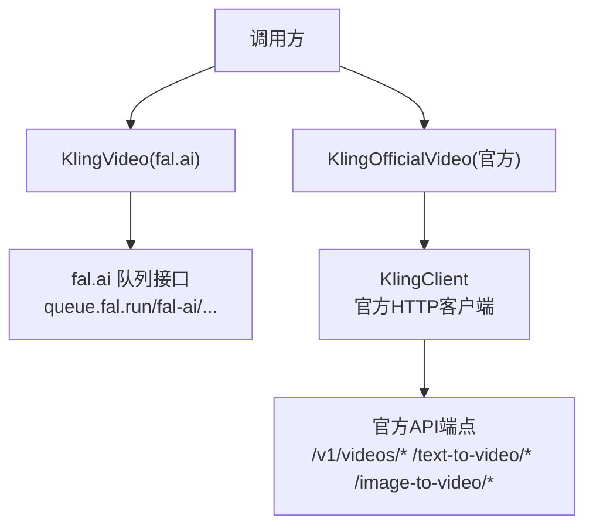
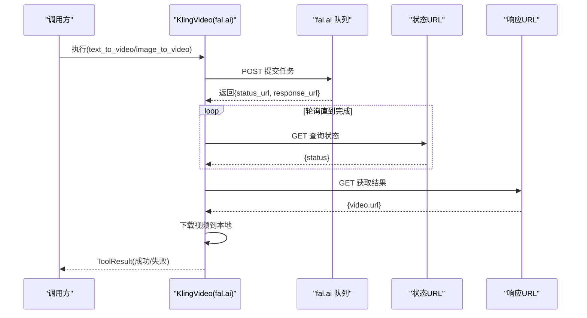
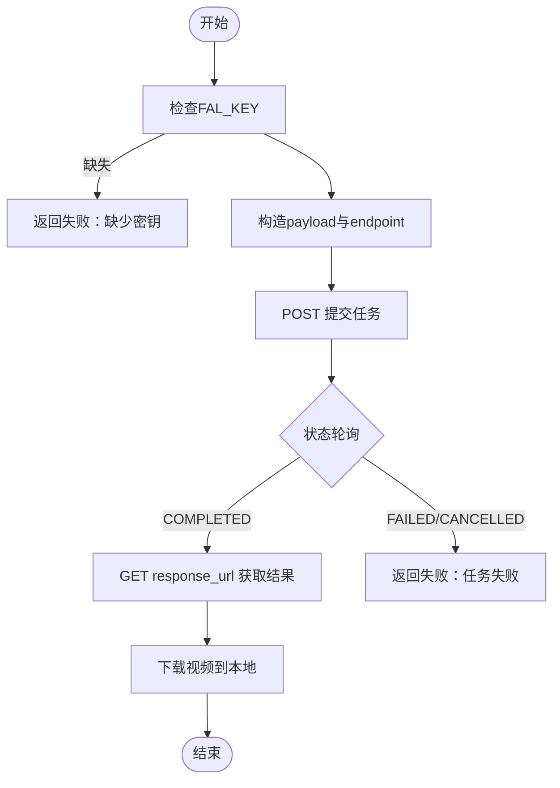
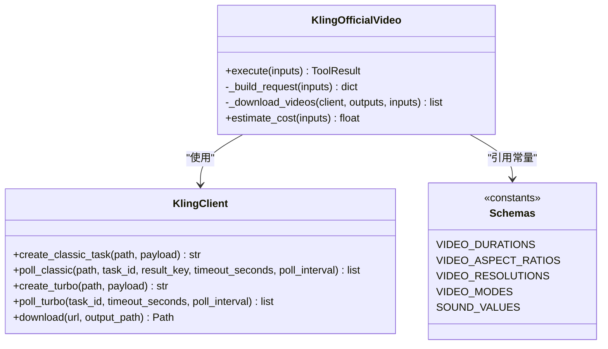
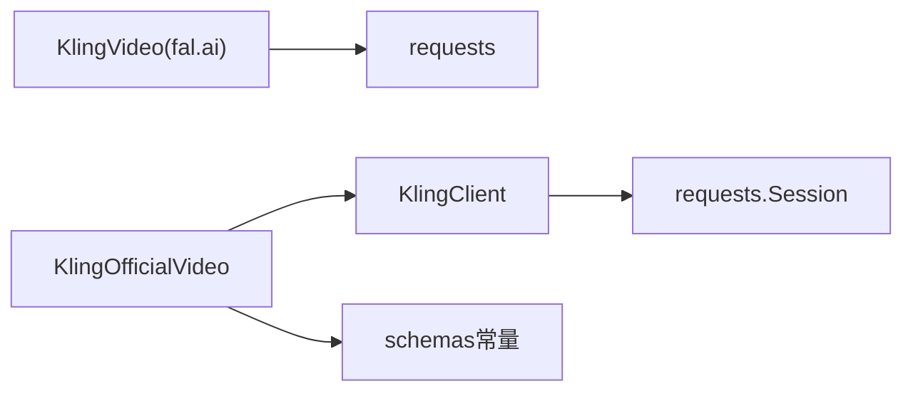

# Kling视频适配器

<cite>
**本文引用的文件**
- [tools/video/kling_video.py](file://tools/video/kling_video.py)
- [tools/video/kling_official_video.py](file://tools/video/kling_official_video.py)
- [tools/_kling/client.py](file://tools/_kling/client.py)
- [tools/_kling/schemas.py](file://tools/_kling/schemas.py)
- [tools/_kling/errors.py](file://tools/_kling/errors.py)
- [tests/contracts/test_kling_official_video.py](file://tests/contracts/test_kling_official_video.py)
</cite>

## 目录
1. [简介](#简介)
2. [项目结构](#项目结构)
3. [核心组件](#核心组件)
4. [架构总览](#架构总览)
5. [详细组件分析](#详细组件分析)
6. [依赖关系分析](#依赖关系分析)
7. [性能与成本](#性能与成本)
8. [故障排除指南](#故障排除指南)
9. [结论](#结论)
10. [附录：API调用示例](#附录api调用示例)

## 简介
本文件为基于 fal.ai API 的 Kling 视频生成适配器的完整技术文档。内容覆盖认证配置、支持的模型变体与参数格式、文本转视频与图像转视频两种模式、时长与分辨率比例、输出格式，以及完整的异步任务提交、状态轮询与结果获取流程。同时提供错误处理策略、重试机制、成本估算方法、最佳实践与故障排除建议。

## 项目结构
围绕Kling视频生成，仓库提供了两套实现：
- fal.ai 适配器：通过 fal.ai 队列接口提交异步任务并轮询结果，封装了模型变体、时长、分辨率等参数。
- 官方 Kling 适配器：直接对接官方 API（支持 classic/turbo/omni），具备更丰富的参数与能力。

图表来源
- [tools/video/kling_video.py:127-187](file://tools/video/kling_video.py#L127-L187)
- [tools/video/kling_official_video.py:216-287](file://tools/video/kling_official_video.py#L216-L287)
- [tools/_kling/client.py:25-157](file://tools/_kling/client.py#L25-L157)

章节来源
- [tools/video/kling_video.py:1-213](file://tools/video/kling_video.py#L1-L213)
- [tools/video/kling_official_video.py:1-705](file://tools/video/kling_official_video.py#L1-L705)
- [tools/_kling/client.py:1-217](file://tools/_kling/client.py#L1-L217)
- [tools/_kling/schemas.py:1-122](file://tools/_kling/schemas.py#L1-L122)

## 核心组件
- fal.ai 适配器（KlingVideo）
  - 能力：文本转视频、图像转视频
  - 认证：环境变量 FAL_KEY 或 FAL_AI_API_KEY
  - 模型变体：v3/standard、v2.1/master、v2.1/pro、v2.1/standard
  - 时长：5秒、10秒
  - 分辨率比例：16:9、9:16、1:1
  - 输出格式：mp4
  - 工作流：POST 到 queue.fal.run 提交任务 -> 轮询 status_url -> 完成后从 response_url 拉取数据 -> 下载视频到本地
- 官方适配器（KlingOfficialVideo）
  - 能力：文本转视频、图像转视频、参考视频转视频（Omni）
  - 认证：KLING_API_KEY（可选 KLING_API_BASE_URL）
  - 协议族：classic、turbo、omni
  - 时长：3~15秒（官方定义）
  - 分辨率比例：16:9、9:16、1:1
  - 分辨率：720p、1080p
  - 输出格式：mp4
  - 工作流：构建请求 -> 创建任务（classic/turbo）-> 轮询任务状态 -> 下载视频 -> 探测元信息

章节来源
- [tools/video/kling_video.py:27-97](file://tools/video/kling_video.py#L27-L97)
- [tools/video/kling_official_video.py:45-177](file://tools/video/kling_official_video.py#L45-L177)
- [tools/_kling/schemas.py:84-88](file://tools/_kling/schemas.py#L84-L88)

## 架构总览
fal.ai 适配器使用 HTTP 直接调用 fal.ai 队列接口；官方适配器通过统一的 KlingClient 管理会话、鉴权、重试、错误转换与下载。

图表来源
- [tools/video/kling_video.py:127-187](file://tools/video/kling_video.py#L127-L187)

章节来源
- [tools/video/kling_video.py:127-213](file://tools/video/kling_video.py#L127-L213)

## 详细组件分析

### fal.ai 适配器（KlingVideo）
- 认证与环境
  - 读取 FAL_KEY 或 FAL_AI_API_KEY 作为鉴权头 Key {key}
- 模型与参数
  - model_variant：v3/standard、v2.1/master、v2.1/pro、v2.1/standard
  - duration：5、10
  - aspect_ratio：16:9、9:16、1:1
  - image_url：图像转视频时必填
- 工作流
  - 构造 endpoint：kling-video/{variant}/{operation_path}
  - 提交到 https://queue.fal.run/fal-ai/{model_path}
  - 轮询 status_url 直至 COMPLETED
  - 从 response_url 获取 video.url 并下载 mp4
- 错误与重试
  - 捕获异常并返回 ToolResult 失败
  - 重试策略由工具框架层 RetryPolicy 控制（rate_limit、timeout）
- 成本估算
  - master：约 0.30 * (duration/5)
  - pro：约 0.20 * (duration/5)
  - standard：约 0.10 * (duration/5)

图表来源
- [tools/video/kling_video.py:127-187](file://tools/video/kling_video.py#L127-L187)

章节来源
- [tools/video/kling_video.py:27-213](file://tools/video/kling_video.py#L27-L213)

### 官方适配器（KlingOfficialVideo）
- 认证与环境
  - 读取 KLING_API_KEY；可选 KLING_API_BASE_URL
- 协议族与模型
  - classic：/v1/videos/text2video、/v1/videos/image2video
  - turbo：/text-to-video/kling-3.0-turbo、/image-to-video/kling-3.0-turbo
  - omni：/v1/videos/omni-video（需要 image_list/video_list/element_list 等引用）
- 参数与约束
  - duration：3~15秒（官方枚举）
  - aspect_ratio：16:9、9:16、1:1
  - resolution：720p、1080p
  - mode：std、pro、4k
  - sound：on/off
  - watermark：布尔开关
  - callback_url：回调地址（需校验）
  - external_task_id：外部任务ID
- 工作流
  - 构建请求（根据 api_family 选择路径与 payload）
  - 创建任务（classic/turbo）
  - 轮询任务状态（经典或Turbo不同路径）
  - 下载所有输出视频并写入本地
  - 探测输出元信息并返回 ToolResult
- 错误与重试
  - 统一转换为 KlingAPIError（包含 code、request_id、http_status）
  - 可重试错误码：1302、1303、5000、5001、5002；HTTP 500/503/504
  - 指数退避重试（最多2次）
- 成本估算
  - 基础价按 api_family 与 mode 调整，sound=on 加价，Omni 按引用数量与 multi_prompt 数量加权

图表来源
- [tools/video/kling_official_video.py:216-287](file://tools/video/kling_official_video.py#L216-L287)
- [tools/_kling/client.py:25-157](file://tools/_kling/client.py#L25-L157)
- [tools/_kling/schemas.py:84-88](file://tools/_kling/schemas.py#L84-L88)

章节来源
- [tools/video/kling_official_video.py:45-705](file://tools/video/kling_official_video.py#L45-L705)
- [tools/_kling/client.py:1-217](file://tools/_kling/client.py#L1-L217)
- [tools/_kling/schemas.py:1-122](file://tools/_kling/schemas.py#L1-L122)

## 依赖关系分析
- fal.ai 适配器依赖 requests 直接与 fal.ai 队列交互，无额外客户端封装。
- 官方适配器依赖 tools._kling.client.KlingClient，集中处理鉴权、重试、错误转换与下载。
- 两者均依赖工具基类 BaseTool 提供的重试策略、资源画像、幂等键与结果封装。

图表来源
- [tools/video/kling_video.py:127-187](file://tools/video/kling_video.py#L127-L187)
- [tools/_kling/client.py:137-157](file://tools/_kling/client.py#L137-L157)
- [tools/_kling/schemas.py:84-88](file://tools/_kling/schemas.py#L84-L88)

章节来源
- [tools/video/kling_video.py:127-213](file://tools/video/kling_video.py#L127-L213)
- [tools/_kling/client.py:137-157](file://tools/_kling/client.py#L137-L157)

## 性能与成本
- 预估运行时间
  - fal.ai：约60秒（典型）
  - 官方：约180秒（保守估计）
- 成本估算
  - fal.ai：按模型变体与时长线性估算（master > pro > standard）
  - 官方：按 api_family、mode、sound、Omni 引用数量与 multi_prompt 数量综合估算
- 并发与限流
  - 官方错误码 1303 表示并发/资源包限制，属于可重试范围
  - fal.ai 适配器在框架层对 rate_limit、timeout 进行重试

章节来源
- [tools/video/kling_video.py:107-117](file://tools/video/kling_video.py#L107-L117)
- [tools/video/kling_official_video.py:179-203](file://tools/video/kling_official_video.py#L179-L203)
- [tools/_kling/errors.py:30-47](file://tools/_kling/errors.py#L30-L47)

## 故障排除指南
- 认证问题
  - fal.ai：确保设置 FAL_KEY 或 FAL_AI_API_KEY
  - 官方：确保设置 KLING_API_KEY；如需自定义端点，设置 KLING_API_BASE_URL
- 参数校验
  - 官方 Omni 模式必须提供 image_list、video_list、element_list 或对应引用字段；不支持本地视频路径上传
  - callback_url 必须为合法 URL，否则构建请求阶段会抛出异常
- 任务失败
  - fal.ai：轮询到 FAILED/CANCELLED 直接返回失败
  - 官方：根据任务状态与错误码判断，部分错误可重试
- 网络与超时
  - 官方客户端内置重试与指数退避；若仍失败，检查网络与配额
- 账号与配额
  - 官方错误诊断包含账户余额或资源包耗尽提示；可通过 include_account_usage 获取上下文

章节来源
- [tools/video/kling_video.py:99-105](file://tools/video/kling_video.py#L99-L105)
- [tools/video/kling_official_video.py:216-258](file://tools/video/kling_official_video.py#L216-L258)
- [tools/_kling/errors.py:30-47](file://tools/_kling/errors.py#L30-L47)
- [tests/contracts/test_kling_official_video.py:230-242](file://tests/contracts/test_kling_official_video.py#L230-L242)
- [tests/contracts/test_kling_official_video.py:167-194](file://tests/contracts/test_kling_official_video.py#L167-L194)

## 结论
本项目提供了两套Kling视频生成适配器：fal.ai 适配器适合快速集成与标准场景；官方适配器提供更丰富参数与多协议族支持，适合复杂需求与精细化控制。两者均实现了异步任务提交、状态轮询与结果下载的完整流程，并提供错误处理、重试与成本估算能力。推荐在生产环境中结合监控与重试策略，并根据业务需求选择合适的适配器与模型变体。

## 附录：API调用示例
以下为两类适配器的端到端调用流程说明（不展示具体代码内容，仅描述步骤与关键参数）。

- fal.ai 适配器（KlingVideo）
  - 环境准备：设置 FAL_KEY 或 FAL_AI_API_KEY
  - 文本转视频
    - operation=text_to_video
    - model_variant=v3/standard（或 v2.1/master、v2.1/pro、v2.1/standard）
    - duration=5 或 10
    - aspect_ratio=16:9、9:16、1:1
    - prompt=描述性文本
  - 图像转视频
    - operation=image_to_video
    - image_url=远程图片地址
    - 其他参数同上
  - 流程
    - POST 到 queue.fal.run/fal-ai/kling-video/{variant}/text-to-video 或 image-to-video
    - 轮询 status_url 直到 COMPLETED
    - 从 response_url 获取 video.url 并下载 mp4
  - 成本估算
    - master：约 0.30*(duration/5)
    - pro：约 0.20*(duration/5)
    - standard：约 0.10*(duration/5)

- 官方适配器（KlingOfficialVideo）
  - 环境准备：设置 KLING_API_KEY（可选 KLING_API_BASE_URL）
  - 文本转视频（classic）
    - api_family=classic
    - operation=text_to_video
    - model_name=kling-v3（或其他经典模型）
    - duration=5（或3~15）
    - aspect_ratio=16:9、9:16、1:1
    - mode=std/pro/4k
    - sound=on/off
  - 图像转视频（classic/turbo）
    - classic：reference_image_path 或 reference_image_url
    - turbo：必须使用 reference_image_url
  - Omni 参考转视频
    - api_family=omni
    - operation=reference_to_video
    - 提供 image_list/video_list/element_list 或对应引用字段
    - 支持 multi_shot、multi_prompt、camera_control 等高级参数
  - 流程
    - 构建请求（根据 api_family 选择路径与 payload）
    - 创建任务（classic/turbo）
    - 轮询任务状态（经典或Turbo不同路径）
    - 下载所有输出视频并写入本地
    - 探测输出元信息并返回结果
  - 成本估算
    - 基础价按 api_family 与 mode 调整，sound=on 加价，Omni 按引用数量与 multi_prompt 数量加权

章节来源
- [tools/video/kling_video.py:60-89](file://tools/video/kling_video.py#L60-L89)
- [tools/video/kling_video.py:127-187](file://tools/video/kling_video.py#L127-L187)
- [tools/video/kling_official_video.py:80-133](file://tools/video/kling_official_video.py#L80-L133)
- [tools/video/kling_official_video.py:216-287](file://tools/video/kling_official_video.py#L216-L287)
- [tests/contracts/test_kling_official_video.py:35-118](file://tests/contracts/test_kling_official_video.py#L35-L118)