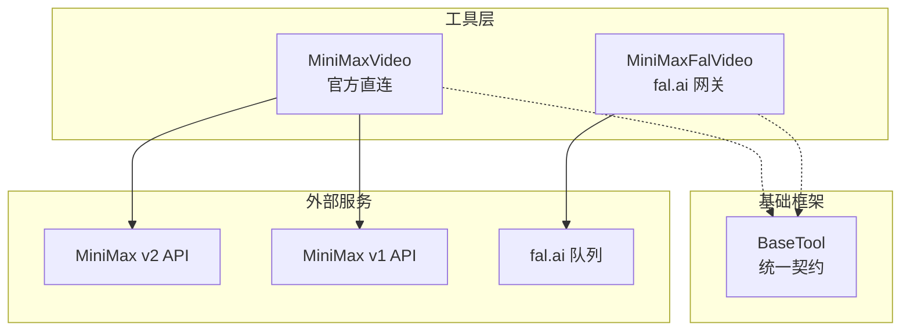
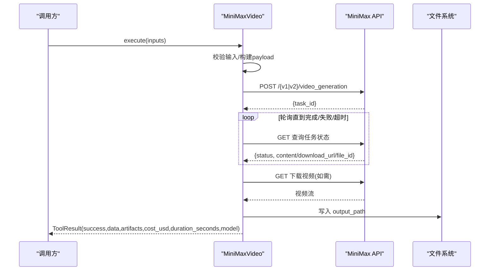
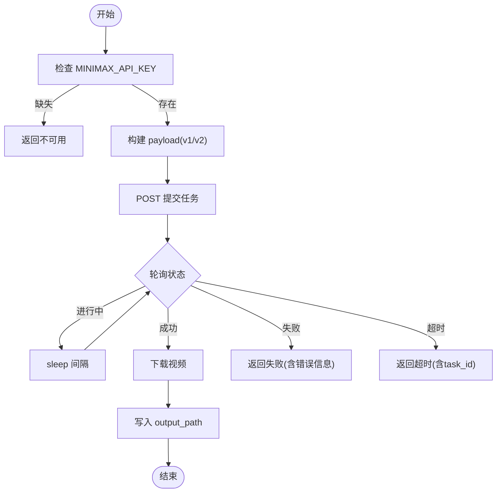
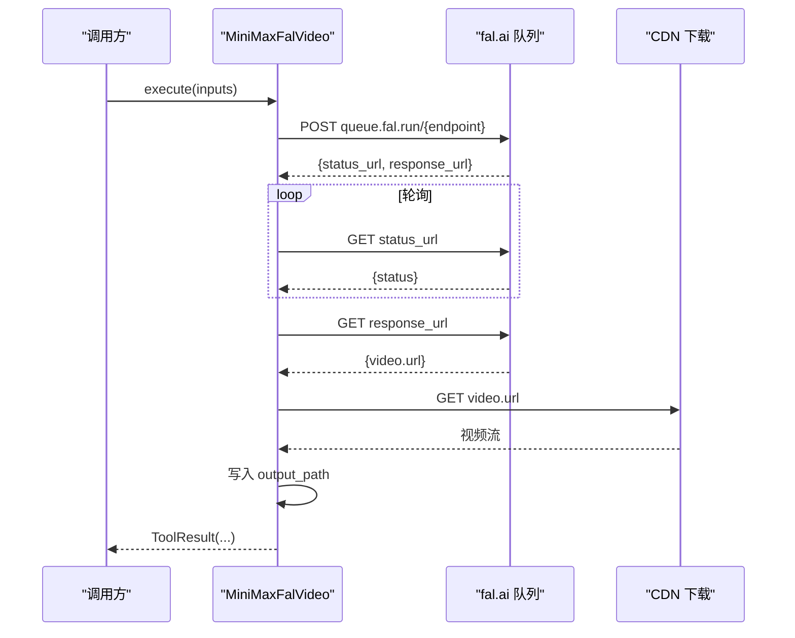

# MiniMax视频适配器

<cite>
**本文引用的文件**
- [tools/video/minimax_video.py](file://tools/video/minimax_video.py)
- [tools/video/minimax_fal_video.py](file://tools/video/minimax_fal_video.py)
- [tests/tools/test_minimax_video.py](file://tests/tools/test_minimax_video.py)
- [tools/base_tool.py](file://tools/base_tool.py)
- [config.yaml](file://config.yaml)
</cite>

## 目录
1. [简介](#简介)
2. [项目结构](#项目结构)
3. [核心组件](#核心组件)
4. [架构总览](#架构总览)
5. [详细组件分析](#详细组件分析)
6. [依赖关系分析](#依赖关系分析)
7. [性能与成本](#性能与成本)
8. [故障排除指南](#故障排除指南)
9. [结论](#结论)
10. [附录：调用示例与迁移建议](#附录调用示例与迁移建议)

## 简介
本文件为 OpenMontage 中 MiniMax 视频生成适配器的完整技术文档，覆盖以下要点：
- 服务集成方式：官方直连 API（v1/v2）与通过 fal.ai 网关的替代路径
- 认证与访问控制：API Key、区域路由、自定义端点
- 支持的模型版本与参数：文本到视频、图像到视频、首尾帧、参考内容等
- 异步任务管理：轮询策略、超时控制、结果下载
- 成本估算与性能优化建议
- 与 Fal.ai 集成的替代方案及迁移建议
- 统一工具接口规范遵循情况

## 项目结构
MiniMax 视频能力由两个实现组成：
- 官方直连适配器：tools/video/minimax_video.py
- Fal.ai 网关适配器：tools/video/minimax_fal_video.py

两者均继承自 BaseTool，遵循统一的工具契约（输入/输出、状态、重试、资源画像等），并通过测试用例验证行为。

图表来源
- [tools/video/minimax_video.py:58-105](file://tools/video/minimax_video.py#L58-L105)
- [tools/video/minimax_fal_video.py:24-55](file://tools/video/minimax_fal_video.py#L24-L55)
- [tools/base_tool.py:110-139](file://tools/base_tool.py#L110-L139)

章节来源
- [tools/video/minimax_video.py:1-105](file://tools/video/minimax_video.py#L1-L105)
- [tools/video/minimax_fal_video.py:1-55](file://tools/video/minimax_fal_video.py#L1-L55)
- [tools/base_tool.py:1-139](file://tools/base_tool.py#L1-L139)

## 核心组件
- MiniMaxVideo：官方直连适配器，支持 v1 与 v2 两套 API 流程，提供文本到视频、图像到视频、首尾帧、参考内容等多种操作模式；内置区域路由、水印开关、回调 URL、轮询与超时控制。
- MiniMaxFalVideo：通过 fal.ai 网关调用 MiniMax H3（Hailuo 03），封装了队列提交、状态轮询、结果获取与本地落盘。

关键特性
- 统一工具契约：继承 BaseTool，暴露 name/version/tier/capability/provider/stability/execution_mode/determinism/runtime 等元信息
- 输入校验：严格的 schema 定义与业务规则校验（如 duration/ratio/prompt 长度）
- 错误处理：结构化 ToolResult，包含 provider/model/api_version/task_id 等上下文
- 成本与耗时估算：estimate_cost/estimate_runtime 用于预算与调度
- 幂等键：idempotency_key_fields 避免重复计费或重复生成

章节来源
- [tools/video/minimax_video.py:58-244](file://tools/video/minimax_video.py#L58-L244)
- [tools/video/minimax_fal_video.py:24-88](file://tools/video/minimax_fal_video.py#L24-L88)
- [tools/base_tool.py:110-139](file://tools/base_tool.py#L110-L139)

## 架构总览
MiniMax 适配器在 OpenMontage 中的执行流程如下：
- 入口：Selector 或上层管线调用 execute(inputs)
- 认证：读取环境变量 MINIMAX_API_KEY（或 FAL_KEY/FAL_AI_API_KEY）
- 路由：根据 MINIMAX_REGION/MINIMAX_BASE_URL 选择全球或中国大陆端点
- 构建请求：按模型版本组装 v1 或 v2 payload
- 提交任务：POST 创建任务并获取 task_id
- 轮询进度：按 poll_interval_seconds 循环查询任务状态，直至成功/失败或超时
- 下载结果：从返回的 download_url 拉取视频并写入 output_path
- 返回结果：ToolResult 携带 data/artifacts/cost_usd/duration_seconds/model

图表来源
- [tools/video/minimax_video.py:456-664](file://tools/video/minimax_video.py#L456-L664)
- [tests/tools/test_minimax_video.py:111-160](file://tests/tools/test_minimax_video.py#L111-L160)

章节来源
- [tools/video/minimax_video.py:456-664](file://tools/video/minimax_video.py#L456-L664)
- [tests/tools/test_minimax_video.py:111-160](file://tests/tools/test_minimax_video.py#L111-L160)

## 详细组件分析

### MiniMaxVideo（官方直连）
- 模型与版本
  - v2 模型：MiniMax-H3
  - v1 模型：MiniMax-Hailuo-2.3、MiniMax-Hailuo-2.3-Fast、MiniMax-Hailuo-02、T2V-01-Director、T2V-01、I2V-01-Director、I2V-01-live、I2V-01
- 支持能力
  - text_to_video、image_to_video、first_last_frame_to_video、reference_to_video
  - 支持 reference_image/reference_video/reference_audio/native_audio/camera_direction
- 输入参数要点
  - prompt：v2 必须提供且不超过 7000 字符
  - operation：text_to_video/image_to_video/first_last_frame_to_video/reference_to_video
  - model：默认 MiniMax-H3；v2 仅支持 MiniMax-H3
  - first_frame_image/end_image_url/reference_image_url(s)/reference_video_url(s)/reference_audio_urls
  - duration：v2 要求整数 4-15 秒；v1 依模型文档
  - resolution：v2 固定 2K；v1 使用模型指定分辨率
  - ratio/aspect_ratio：v2 支持 adaptive/21:9/16:9/4:3/1:1/3:4/9:16；text_to_video 不支持 adaptive
  - callback_url：可选回调地址
  - aigc_watermark：中国大陆地区 v2 可配置
  - poll_interval_seconds/timeout_seconds：轮询间隔与最大等待时间
  - output_path：输出视频路径
- 认证与区域
  - 环境变量：MINIMAX_API_KEY（必需）、MINIMAX_REGION（global/global_en/cn/cn_zh）、MINIMAX_BASE_URL（覆盖）
  - 中国大陆域名：api.minimaxi.com；全球域名：api.minimax.io
- 任务与下载
  - v2：POST /v2/video_generation -> 轮询 /v2/query/video_generation/{task_id} -> 成功后从 content.url 下载
  - v1：POST /v1/video_generation -> 轮询 /v1/query/video_generation?task_id -> 成功后 /v1/files/retrieve?file_id -> 下载
- 错误处理
  - v1 base_resp 错误码与消息透传
  - 未知状态/缺少 task_id/file_id/download_url 时返回失败
  - 异常捕获并脱敏 API Key
- 成本与耗时估算
  - v2(H3)：按秒计费 + 额外参考图费用；Fast 模型固定低价；其他 v1 固定价格
  - 预估运行时长：H3 ~90s，Fast ~30s，其他 ~60s

图表来源
- [tools/video/minimax_video.py:456-664](file://tools/video/minimax_video.py#L456-L664)

章节来源
- [tools/video/minimax_video.py:28-48](file://tools/video/minimax_video.py#L28-L48)
- [tools/video/minimax_video.py:107-214](file://tools/video/minimax_video.py#L107-L214)
- [tools/video/minimax_video.py:249-265](file://tools/video/minimax_video.py#L249-L265)
- [tools/video/minimax_video.py:271-295](file://tools/video/minimax_video.py#L271-L295)
- [tools/video/minimax_video.py:323-422](file://tools/video/minimax_video.py#L323-L422)
- [tools/video/minimax_video.py:424-454](file://tools/video/minimax_video.py#L424-L454)
- [tools/video/minimax_video.py:456-664](file://tools/video/minimax_video.py#L456-L664)

### MiniMaxFalVideo（fal.ai 网关）
- 认证：FAL_KEY 或 FAL_AI_API_KEY
- 模型：fal-ai/minimax/hailuo-03/{operation}
- 支持能力：text_to_video、image_to_video、reference_to_video；支持多参考图、参考视频/音频、原生音频
- 参数：prompt（必填）、duration（5-15）、aspect_ratio（adaptive/21:9/16:9/4:3/1:1/3:4/9:16）、image_url/end_image_url/reference_image_urls/reference_video_urls/reference_audio_urls
- 流程：POST 到 fal.ai 队列 -> 轮询 status_url -> 完成后从 response_url 获取 video.url -> 下载到 output_path
- 成本与耗时：按秒计费（约 0.19*duration），预估 120s

图表来源
- [tools/video/minimax_fal_video.py:103-202](file://tools/video/minimax_fal_video.py#L103-L202)

章节来源
- [tools/video/minimax_fal_video.py:24-88](file://tools/video/minimax_fal_video.py#L24-L88)
- [tools/video/minimax_fal_video.py:90-101](file://tools/video/minimax_fal_video.py#L90-L101)
- [tools/video/minimax_fal_video.py:103-202](file://tools/video/minimax_fal_video.py#L103-L202)

## 依赖关系分析
- 运行时依赖
  - requests：HTTP 客户端
  - os/time/pathlib：环境、计时、路径
- 工具契约依赖
  - BaseTool：统一接口、重试策略、资源画像、结果对象
- 外部依赖
  - MiniMax 官方 API（v1/v2）
  - fal.ai 队列服务（替代路径）

耦合与内聚
- MiniMaxVideo 内部对 v1/v2 差异进行封装，对外暴露统一 execute
- MiniMaxFalVideo 独立于官方 API，复用相同工具契约
- 两者均通过 ToolResult 传递上下文，便于上层追踪与审计

潜在循环依赖
- 无直接循环依赖；requests 为第三方库，BaseTool 被两者共同引用

章节来源
- [tools/video/minimax_video.py:10-26](file://tools/video/minimax_video.py#L10-L26)
- [tools/video/minimax_fal_video.py:10-21](file://tools/video/minimax_fal_video.py#L10-L21)
- [tools/base_tool.py:110-139](file://tools/base_tool.py#L110-L139)

## 性能与成本
- 性能特征
  - v2(H3)：默认约 90s；Fast 模型约 30s；其他 v1 约 60s
  - 轮询间隔可调（poll_interval_seconds），默认 5s，最小 0.1s
  - 超时保护（timeout_seconds），默认 900s，最小 1s
- 成本估算
  - v2(H3)：按秒计费（约 0.13/秒）+ 超出 5 张的每张额外费用（约 0.03/张）
  - Fast 模型：固定低价（约 0.08）
  - 其他 v1：固定价格（约 0.15）
  - fal.ai 路径：约 0.19*duration
- 优化建议
  - 合理设置 duration 与 aspect_ratio，避免不必要的长时渲染
  - 使用 Fast 模型提升吞吐
  - 调整 poll_interval_seconds 平衡延迟与请求频率
  - 利用 callback_url（v2）减少轮询开销（若服务端支持）
  - 批量任务时结合重试策略与幂等键避免重复计费

章节来源
- [tools/video/minimax_video.py:271-295](file://tools/video/minimax_video.py#L271-L295)
- [tools/video/minimax_video.py:195-211](file://tools/video/minimax_video.py#L195-L211)
- [tools/video/minimax_fal_video.py:97-101](file://tools/video/minimax_fal_video.py#L97-L101)

## 故障排除指南
常见问题与定位
- 未设置 API Key
  - 现象：get_status 返回 UNAVAILABLE；execute 返回错误提示
  - 解决：设置 MINIMAX_API_KEY（或 FAL_KEY/FAL_AI_API_KEY）
- 区域路由错误
  - 现象：请求到错误的域名
  - 解决：设置 MINIMAX_REGION=cn 或 global；或通过 MINIMAX_BASE_URL 覆盖
- 参数校验失败
  - 现象：prompt 过长、duration 不在范围、ratio 不支持、缺少必要字段
  - 解决：依据 input_schema 与业务规则修正
- 任务失败或超时
  - 现象：轮询返回失败或达到 timeout_seconds
  - 解决：查看返回 error 与 task_id；必要时手动恢复或重试
- v1 base_resp 错误
  - 现象：base_resp.status_code 非 0
  - 解决：根据 status_msg 排查（如鉴权失败、余额不足）

调试技巧
- 启用日志记录请求 URL/Payload（注意脱敏）
- 降低 poll_interval_seconds 提高响应速度
- 使用 test_minimax_video.py 中的断言作为期望行为参考

章节来源
- [tools/video/minimax_video.py:249-265](file://tools/video/minimax_video.py#L249-L265)
- [tools/video/minimax_video.py:298-305](file://tools/video/minimax_video.py#L298-L305)
- [tools/video/minimax_video.py:456-664](file://tools/video/minimax_video.py#L456-L664)
- [tests/tools/test_minimax_video.py:83-109](file://tests/tools/test_minimax_video.py#L83-L109)
- [tests/tools/test_minimax_video.py:446-461](file://tests/tools/test_minimax_video.py#L446-L461)

## 结论
MiniMax 视频适配器在 OpenMontage 中提供了稳定、可扩展的视频生成能力，涵盖官方直连与 fal.ai 网关两种路径。其严格输入校验、完善的错误处理、可配置的轮询与超时机制，以及与统一工具契约的契合，使其易于集成与维护。通过合理的参数调优与成本估算，可在保证质量的同时提升效率。

## 附录：调用示例与迁移建议

### 环境配置
- 官方直连
  - 设置 MINIMAX_API_KEY
  - 可选：MINIMAX_REGION=cn/global/global_en/cn_zh；或 MINIMAX_BASE_URL 覆盖
- fal.ai 网关
  - 设置 FAL_KEY 或 FAL_AI_API_KEY

章节来源
- [tools/video/minimax_video.py:69-76](file://tools/video/minimax_video.py#L69-L76)
- [tools/video/minimax_fal_video.py:34-37](file://tools/video/minimax_fal_video.py#L34-L37)

### 文本到视频（v2/H3）
- 请求参数
  - prompt：必填，≤7000 字符
  - model：默认 MiniMax-H3
  - duration：4-15 秒
  - resolution：2K
  - ratio：16:9（text_to_video 不支持 adaptive）
  - output_path：输出路径
- 响应格式
  - success：布尔
  - data：provider/model/api_version/region/task_id/prompt/output
  - artifacts：[output_path]
  - cost_usd：估算费用
  - duration_seconds：实际耗时
  - model：模型名

章节来源
- [tools/video/minimax_video.py:107-214](file://tools/video/minimax_video.py#L107-L214)
- [tests/tools/test_minimax_video.py:111-160](file://tests/tools/test_minimax_video.py#L111-L160)

### 图像到视频（v1/I2V 系列）
- 请求参数
  - operation：image_to_video
  - model：I2V-01 等
  - first_frame_image：必填
  - prompt：可选
  - duration/resolution：依模型
  - output_path：输出路径
- 响应格式
  - 同文本到视频，data 中包含 file_id（v1）

章节来源
- [tools/video/minimax_video.py:424-454](file://tools/video/minimax_video.py#L424-L454)
- [tests/tools/test_minimax_video.py:342-390](file://tests/tools/test_minimax_video.py#L342-L390)

### 首尾帧到视频（v2/H3）
- 请求参数
  - operation：first_last_frame_to_video
  - first_frame_image：必填
  - last_frame_image：必填
  - duration/ratio：符合 v2 约束
- 响应格式
  - 同文本到视频

章节来源
- [tools/video/minimax_video.py:323-422](file://tools/video/minimax_video.py#L323-L422)
- [tests/tools/test_minimax_video.py:240-275](file://tests/tools/test_minimax_video.py#L240-L275)

### 参考内容到视频（v2/H3）
- 请求参数
  - operation：reference_to_video
  - reference_image_urls/reference_video_url(s)/reference_audio_urls：至少一项（音频需配合图像或视频）
  - prompt：描述性文本
  - aigc_watermark：中国大陆地区可配置
- 响应格式
  - 同文本到视频

章节来源
- [tools/video/minimax_video.py:323-422](file://tools/video/minimax_video.py#L323-L422)
- [tests/tools/test_minimax_video.py:163-210](file://tests/tools/test_minimax_video.py#L163-L210)

### 异步任务管理与结果下载
- 轮询策略
  - poll_interval_seconds：默认 5s，最小 0.1s
  - timeout_seconds：默认 900s，最小 1s
- 结果下载
  - v2：从 content.url 下载
  - v1：先获取 file_id，再调用 files/retrieve 得到 download_url
- 超时恢复
  - 超时返回包含 task_id，可用于后续手动查询或恢复

章节来源
- [tools/video/minimax_video.py:492-616](file://tools/video/minimax_video.py#L492-L616)
- [tests/tools/test_minimax_video.py:463-507](file://tests/tools/test_minimax_video.py#L463-L507)

### 与 Fal.ai 集成的替代方案与迁移
- 何时选择 fal.ai
  - 已有 fal.ai 账户，希望简化部署与鉴权
  - 需要 2K 多模态参考视频生成
- 迁移步骤
  - 将 provider 切换为 minimax_fal_video
  - 设置 FAL_KEY/FAL_AI_API_KEY
  - 调整参数映射（aspect_ratio、duration、reference_*_urls）
  - 验证输出与成本估算
- 回退策略
  - 当 fal.ai 不可用时，回退到 minimax_video（官方直连）

章节来源
- [tools/video/minimax_fal_video.py:24-55](file://tools/video/minimax_fal_video.py#L24-L55)
- [tools/video/minimax_fal_video.py:90-101](file://tools/video/minimax_fal_video.py#L90-L101)
- [tools/video/minimax_fal_video.py:103-202](file://tools/video/minimax_fal_video.py#L103-L202)

### 统一工具接口规范遵循
- 继承 BaseTool，实现 name/version/tier/capability/provider/stability/execution_mode/determinism/runtime
- 提供 input_schema、resource_profile、retry_policy、idempotency_key_fields、side_effects、user_visible_verification
- 返回 ToolResult 包含 success/data/artifacts/error/cost_usd/duration_seconds/model

章节来源
- [tools/base_tool.py:110-139](file://tools/base_tool.py#L110-L139)
- [tools/video/minimax_video.py:58-105](file://tools/video/minimax_video.py#L58-L105)
- [tools/video/minimax_fal_video.py:24-55](file://tools/video/minimax_fal_video.py#L24-L55)