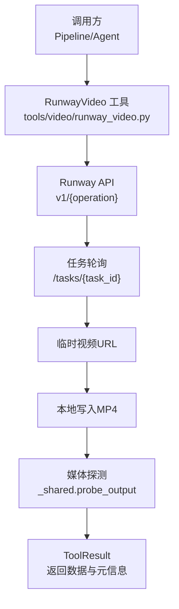
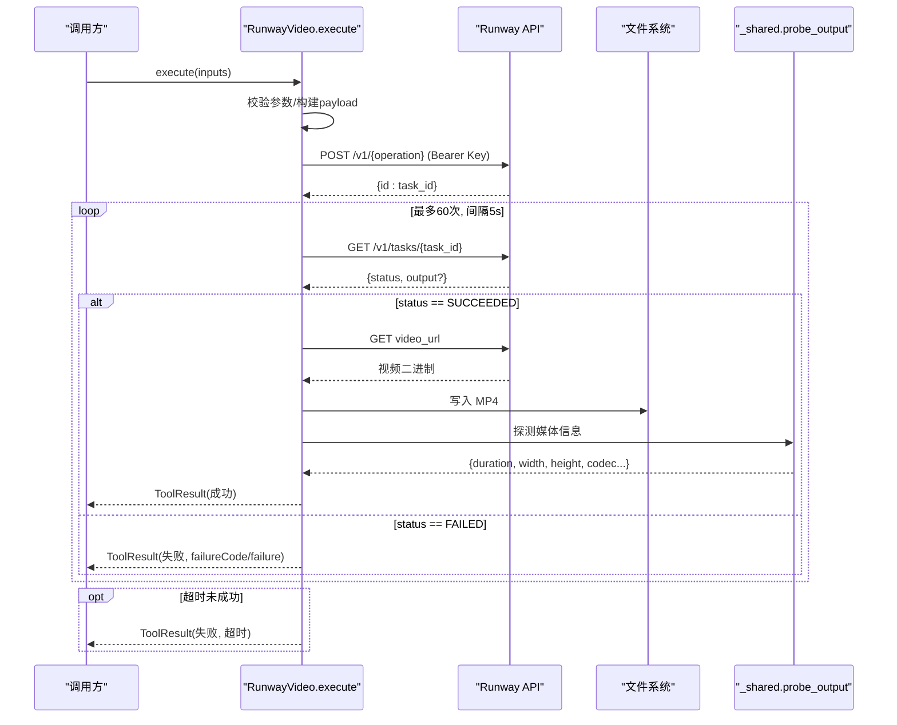
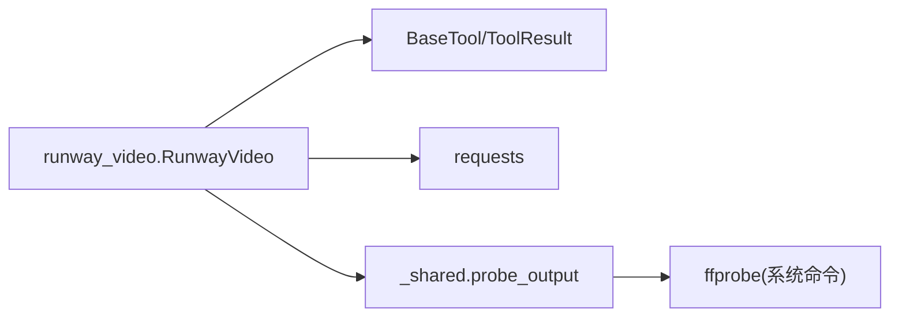

# Runway视频适配器

<cite>
**本文引用的文件**
- [runway_video.py](file://tools/video/runway_video.py)
- [_shared.py](file://tools/video/_shared.py)
- [test_new_video_model_support.py](file://tests/tools/test_new_video_model_support.py)
- [PROVIDERS.md](file://docs/PROVIDERS.md)
</cite>

## 目录
1. [简介](#简介)
2. [项目结构](#项目结构)
3. [核心组件](#核心组件)
4. [架构总览](#架构总览)
5. [详细组件分析](#详细组件分析)
6. [依赖关系分析](#依赖关系分析)
7. [性能与成本优化](#性能与成本优化)
8. [故障排查指南](#故障排查指南)
9. [结论](#结论)
10. [附录：调用示例与参数说明](#附录调用示例与参数说明)

## 简介
本文件为OpenMontage项目中Runway视频生成适配器的完整技术文档。该适配器通过Runway API统一接入Runway原生模型以及第三方模型（Seedance 2.5、Gemini Omni Flash、MiniMax Hailuo 3），提供文本到视频、图像到视频、视频到视频的生成能力，并封装了认证、任务提交、轮询进度、结果下载、错误处理与成本估算等流程，确保与项目统一的工具接口兼容。

## 项目结构
- 适配器实现位于 tools/video/runway_video.py，继承项目基础工具基类，暴露标准输入输出契约。
- 通用辅助函数（如媒体探测）位于 tools/video/_shared.py。
- 行为验证与请求形状断言位于 tests/tools/test_new_video_model_support.py。
- 配置与定价参考位于 docs/PROVIDERS.md。

图表来源
- [runway_video.py:239-477](file://tools/video/runway_video.py#L239-L477)
- [_shared.py:758-795](file://tools/video/_shared.py#L758-L795)

章节来源
- [runway_video.py:1-210](file://tools/video/runway_video.py#L1-L210)
- [_shared.py:758-795](file://tools/video/_shared.py#L758-L795)

## 核心组件
- RunwayVideo 工具类
  - 名称与版本：runway_video v0.3.0
  - 能力：text_to_video、image_to_video、video_to_video；支持参考图/视频/音频、专业控制、电影级质量、镜头运动、口型同步、多镜头等
  - 执行模式：同步执行（内部异步轮询任务）
  - 稳定性：Beta
  - 资源需求：CPU 1核、内存512MB、显存0、磁盘约500MB、需要网络
  - 重试策略：最多2次，可重试错误包含速率限制、超时、THROTTLED
  - 幂等键字段：prompt、model、operation、duration

- 支持的模型与默认值
  - 当前支持的模型标识：seedance2_5、gemini_omni_flash、hailuo3、seedance2、seedance2_fast、seedance2_mini、gen4.5、gen4_turbo
  - 默认模型：seedance2

- 输入参数（节选）
  - prompt（必填）、operation（默认 text_to_video）、model（默认 seedance2）、duration（2-30秒）、ratio（比例）、reference_image_urls、reference_video_urls、reference_audio_urls、resolution（按模型限定）、generate_audio（布尔）、mode（reference/extend）、output_path

- 输出结果
  - ToolResult.data 包含 provider、model、prompt、operation、ratio、output/output_path、task_id、format、以及由 probe_output 探测到的时长、分辨率、编码等信息
  - artifacts 包含生成的视频路径
  - cost_usd 与 duration_seconds 用于成本与耗时统计

章节来源
- [runway_video.py:80-210](file://tools/video/runway_video.py#L80-L210)
- [runway_video.py:239-477](file://tools/video/runway_video.py#L239-L477)

## 架构总览
适配器采用“同步调用 + 内部轮询”的异步任务管理模式：
- 认证：从环境变量读取API密钥
- 构建请求体：根据模型与操作映射不同字段（如 promptText、promptImage、promptVideo/videoUri、references/referenceVideos/referenceAudio、ratio/resolution/audio/mode）
- 提交任务：POST /v1/{operation}
- 轮询状态：GET /v1/tasks/{task_id}，直至 SUCCEEDED/FAILED 或超时
- 下载结果：获取临时URL并保存为MP4
- 探测元信息：使用 ffprobe 探测视频属性
- 返回统一结果：ToolResult

图表来源
- [runway_video.py:239-477](file://tools/video/runway_video.py#L239-L477)
- [_shared.py:758-795](file://tools/video/_shared.py#L758-L795)

## 详细组件分析

### 认证与环境变量
- 环境变量优先级：RUNWAY_API_KEY 优先，其次 RUNWAYML_API_SECRET
- 可用性检测：若任一存在则标记为可用，否则不可用
- 安装提示：引导用户前往 dev.runwayml.com 获取密钥

章节来源
- [runway_video.py:91-95](file://tools/video/runway_video.py#L91-L95)
- [runway_video.py:215-221](file://tools/video/runway_video.py#L215-L221)

### 参数校验与模型差异处理
- 比例映射：
  - Seedance 2.5：需同时指定 resolution（480p/720p）与 ratio，内部映射为具体像素比
  - Hailuo 3：ratio 直接传入，resolution 可选（768P/2K）
  - Gemini Omni Flash：仅支持 16:9/9:16，使用旧版比例映射
  - 其他模型：使用旧版比例映射
- 时长限制：
  - gemini_omni_flash：3-10秒
  - seedance2_5：4-30秒
  - hailuo3：5-15秒
- 参考输入：
  - Seedance/Hailuo：支持 references、referenceVideos、referenceAudio
  - Gemini Omni Flash（非视频编辑）：不接受额外参考
- 操作约束：
  - image_to_video：需提供 image_url
  - video_to_video：需提供 video_url；gemini_omni_flash 使用 videoUri，且不支持 duration/ratio
  - gen4_turbo：仅支持 image_to_video
  - gen4.5/gen4_turbo：不支持 video_to_video

章节来源
- [runway_video.py:263-392](file://tools/video/runway_video.py#L263-L392)

### 任务提交与轮询
- 端点：https://api.dev.runwayml.com/v1/{operation}
- 请求头：Authorization: Bearer <key>，Content-Type: application/json，X-Runway-Version: 2024-11-06
- 轮询：每5秒查询一次任务状态，最长约5分钟
- 成功：从 output[0] 获取临时视频URL并下载
- 失败：提取 failureCode 与 failure 信息返回
- 异常：捕获并返回失败结果

章节来源
- [runway_video.py:394-454](file://tools/video/runway_video.py#L394-L454)

### 结果下载与元信息探测
- 下载：将临时URL内容写入 output_path（默认 runway_output.mp4）
- 探测：调用 _shared.probe_output 使用 ffprobe 获取时长、分辨率、编码等元信息
- 返回：ToolResult.data 包含 provider、model、prompt、operation、ratio、output/output_path、task_id、format 及探测结果

章节来源
- [runway_video.py:443-477](file://tools/video/runway_video.py#L443-L477)
- [_shared.py:758-795](file://tools/video/_shared.py#L758-L795)

### 成本估算与运行时间估计
- 成本：基于模型与分辨率/操作的单价乘以时长
  - 例如：seedance2_5 在 480p 时单价较低；gemini_omni_flash 视频编辑略高
- 运行时间：按模型预设估计（如 seedance2_5 较长）

章节来源
- [runway_video.py:52-72](file://tools/video/runway_video.py#L52-L72)
- [runway_video.py:223-237](file://tools/video/runway_video.py#L223-L237)

## 依赖关系分析
- 外部依赖：requests（HTTP客户端）
- 系统依赖：ffprobe（用于媒体探测）
- 内部依赖：
  - BaseTool、ToolResult、ResourceProfile、RetryPolicy 等基础类型
  - _shared.probe_output 用于探测输出媒体

图表来源
- [runway_video.py:14-25](file://tools/video/runway_video.py#L14-L25)
- [runway_video.py:247-454](file://tools/video/runway_video.py#L247-L454)
- [_shared.py:758-795](file://tools/video/_shared.py#L758-L795)

章节来源
- [runway_video.py:14-25](file://tools/video/runway_video.py#L14-L25)
- [_shared.py:758-795](file://tools/video/_shared.py#L758-L795)

## 性能与成本优化
- 模型选择
  - 快速/低成本：gen4_turbo（仅限图像转视频）、gemini_omni_flash（短时长）
  - 高质量/长片段：seedance2_5（支持多参考输入）
- 分辨率与比例
  - Seedance 2.5：480p 更经济，720p 画质更高；合理选择比例避免无效渲染
  - Hailuo 3：768P 更经济，2K 画质更高
- 时长控制
  - 尽量使用满足需求的最低时长，减少成本与等待时间
- 参考输入
  - 合理使用 reference_image_urls/reference_video_urls/reference_audio_urls 提升一致性，但注意各模型上限
- 重试与幂等
  - 利用内置重试策略应对速率限制与瞬时失败；幂等键避免重复计费
- 缓存与复用
  - 对相同 prompt/model/operation/duration 的请求天然具备幂等性，可在上层做缓存

[本节为通用建议，不直接分析具体文件]

## 故障排查指南
- 认证失败
  - 检查环境变量 RUNWAY_API_KEY 或 RUNWAYML_API_SECRET 是否设置
  - 确认密钥有效且账户订阅满足API访问要求
- 参数错误
  - 比例与分辨率组合是否符合模型限制
  - 时长是否在模型允许范围内
  - 操作与模型是否匹配（如 gen4_turbo 仅支持 image_to_video）
- 任务失败
  - 查看返回的 failureCode 与 failure 信息
  - 常见原因：内容策略违规、输入格式错误、配额不足
- 超时
  - 轮询最长约5分钟，若仍未成功，检查网络与服务端状态
- 下载失败
  - 临时URL有效期有限（24-48小时），尽快下载并保存
- 媒体探测失败
  - 确保系统安装了 ffprobe；若无，仍会返回文件大小等基础信息

章节来源
- [runway_video.py:215-221](file://tools/video/runway_video.py#L215-L221)
- [runway_video.py:263-392](file://tools/video/runway_video.py#L263-L392)
- [runway_video.py:414-454](file://tools/video/runway_video.py#L414-L454)
- [_shared.py:758-795](file://tools/video/_shared.py#L758-L795)

## 结论
Runway视频适配器以统一工具接口封装了Runway及其合作模型的复杂工作流，涵盖认证、参数校验、任务提交、轮询、下载与元信息探测，并提供成本与运行时间估算。通过合理的模型选择、分辨率与时长控制、参考输入与重试策略，可以在保证质量的同时优化成本与性能。

[本节为总结，不直接分析具体文件]

## 附录：调用示例与参数说明

### 环境配置
- 设置环境变量：RUNWAY_API_KEY（或 RUNWAYML_API_SECRET）
- 订阅计划与API访问权限请参考提供商文档

章节来源
- [PROVIDERS.md:890-937](file://docs/PROVIDERS.md#L890-L937)

### 文本到视频（T2V）
- 必要参数：prompt、model、duration、ratio
- 可选参数：reference_image_urls、reference_video_urls、reference_audio_urls、resolution、generate_audio、output_path
- 模型差异：
  - seedance2_5：支持多参考输入，时长4-30秒
  - gemini_omni_flash：时长3-10秒，仅特定比例
  - hailuo3：时长5-15秒，支持768P/2K

章节来源
- [runway_video.py:136-201](file://tools/video/runway_video.py#L136-L201)
- [runway_video.py:263-392](file://tools/video/runway_video.py#L263-L392)

### 图像到视频（I2V）
- 必要参数：image_url、model、duration、ratio
- 可选参数：reference_audio_urls、resolution、generate_audio、output_path
- 模型差异：
  - gen4_turbo：仅支持 I2V
  - seedance2_5/hailuo3：支持参考音频

章节来源
- [runway_video.py:348-360](file://tools/video/runway_video.py#L348-L360)
- [runway_video.py:263-392](file://tools/video/runway_video.py#L263-L392)

### 视频到视频（V2V）
- 必要参数：video_url、model
- 可选参数：reference_image_urls、resolution、mode（reference/extend）、output_path
- 模型差异：
  - gemini_omni_flash：使用 videoUri，不支持 duration/ratio，仅接受图像参考
  - seedance2_5：支持 mode=extend 时移除 ratio

章节来源
- [runway_video.py:354-375](file://tools/video/runway_video.py#L354-L375)

### 请求与响应处理
- 请求：POST /v1/{operation}，携带 model、duration、promptText/promptImage/promptVideo/videoUri、references/referenceVideos/referenceAudio、ratio/resolution/audio/mode 等
- 响应：返回 task_id，随后轮询 /v1/tasks/{task_id} 直到 SUCCEEDED/FAILED
- 结果：SUCCEEDED 时从 output[0] 获取临时URL并下载；失败时返回 failureCode 与 failure

章节来源
- [runway_video.py:394-454](file://tools/video/runway_video.py#L394-L454)

### 错误处理
- 认证缺失：返回明确错误与安装提示
- 参数非法：返回具体错误（如比例不支持、时长越界、操作不匹配）
- 任务失败：返回 failureCode 与 failure 详情
- 超时：返回超时错误
- 网络异常：捕获并返回失败结果

章节来源
- [runway_video.py:239-245](file://tools/video/runway_video.py#L239-L245)
- [runway_video.py:263-392](file://tools/video/runway_video.py#L263-L392)
- [runway_video.py:414-454](file://tools/video/runway_video.py#L414-L454)

### 测试与验证
- 单元测试验证了三个当前模型标识的支持与官方请求形状
- 断言包括比例映射、音频开关、参考输入结构与字段名

章节来源
- [test_new_video_model_support.py:127-240](file://tests/tools/test_new_video_model_support.py#L127-L240)