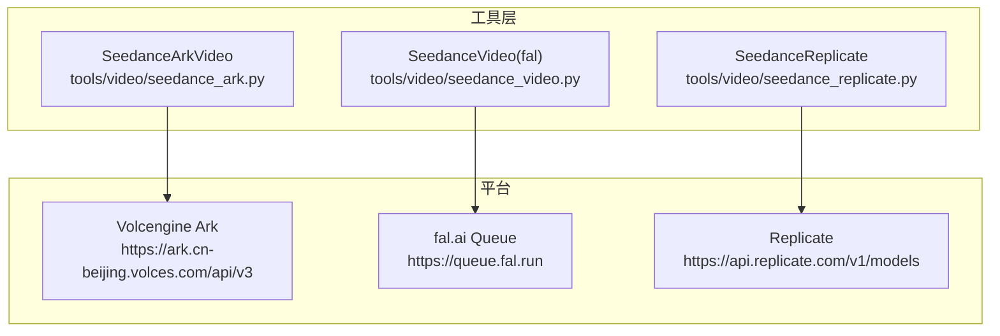
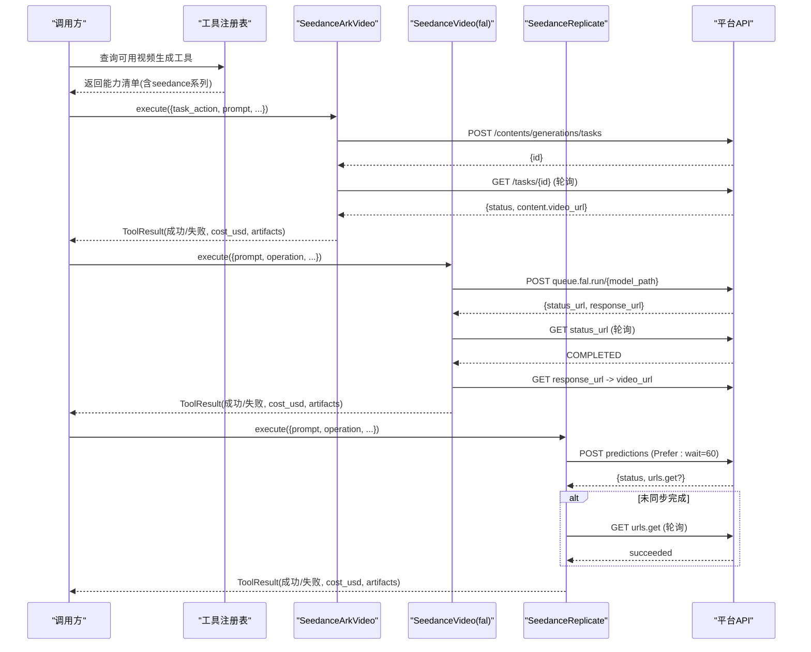
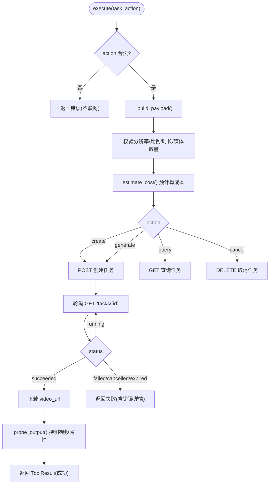
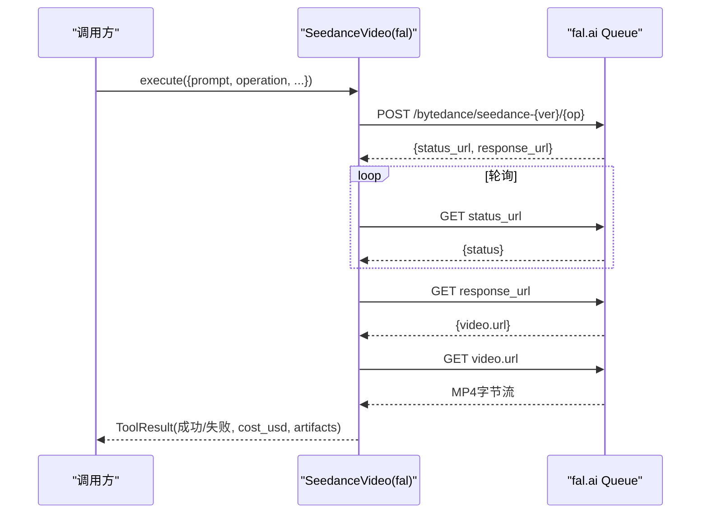
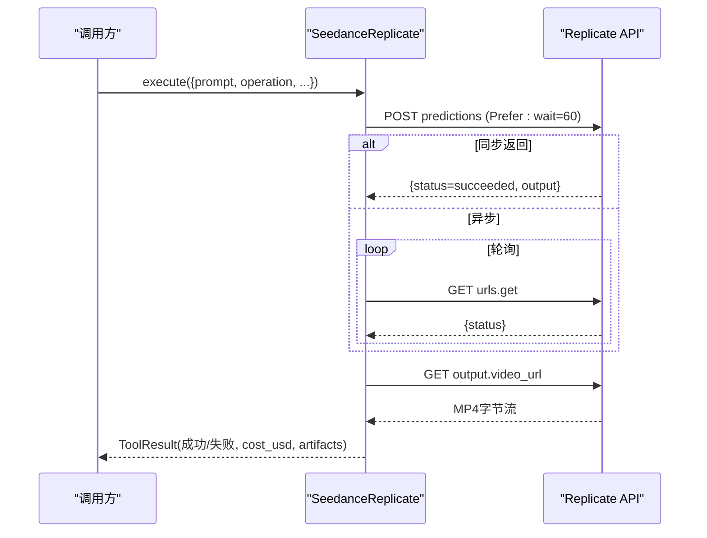
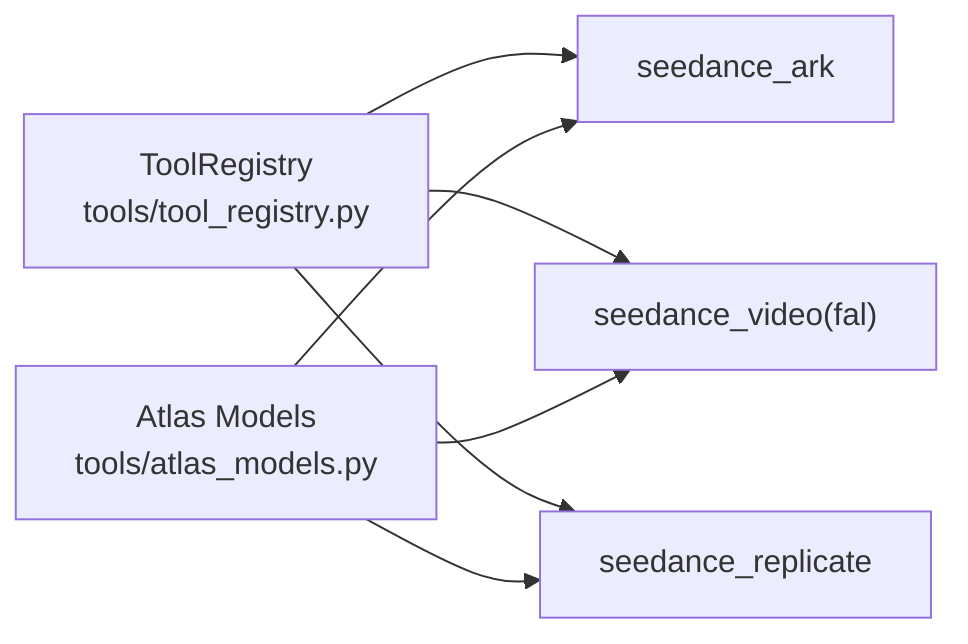

# Seedance视频适配器

<cite>
**本文引用的文件**
- [tools/video/seedance_video.py](file://tools/video/seedance_video.py)
- [tools/video/seedance_ark.py](file://tools/video/seedance_ark.py)
- [tools/video/seedance_replicate.py](file://tools/video/seedance_replicate.py)
- [tests/contracts/test_seedance_ark_video.py](file://tests/contracts/test_seedance_ark_video.py)
- [tools/tool_registry.py](file://tools/tool_registry.py)
- [tools/atlas_models.py](file://tools/atlas_models.py)
</cite>

## 目录
1. [简介](#简介)
2. [项目结构](#项目结构)
3. [核心组件](#核心组件)
4. [架构总览](#架构总览)
5. [详细组件分析](#详细组件分析)
6. [依赖关系分析](#依赖关系分析)
7. [性能与成本](#性能与成本)
8. [故障排除指南](#故障排除指南)
9. [结论](#结论)
10. [附录：平台选择与最佳实践](#附录：平台选择与最佳实践)

## 简介
本文件为 OpenMontage 项目中 Seedance 视频生成适配器的完整技术文档，覆盖三种接入方式：
- Ark（火山引擎）原生 REST API 异步任务模式
- fal.ai 同步队列模式
- Replicate 托管模型同步/轮询模式

文档说明各平台的认证配置、API端点、参数差异、文本转视频、图像转视频、多帧参考（含多帧动画）的调用流程；并提供异步任务处理、状态轮询、错误恢复机制、平台选择建议、性能与价格模型、以及与工具注册表的集成方式。

## 项目结构
Seedance 相关代码位于 tools/video 目录下，包含三个独立适配器实现，以及测试与工具注册表支撑：
- seedance_video.py：fal.ai 通道，支持 text_to_video、image_to_video、reference_to_video
- seedance_ark.py：Ark 官方 REST API，异步任务 create/query/cancel/generate
- seedance_replicate.py：Replicate 通道，支持 text_to_video、image_to_video
- tests/contracts/test_seedance_ark_video.py：Ark 适配器的契约测试，验证端点、鉴权、参数校验、错误脱敏等
- tools/tool_registry.py：工具自动发现与能力报告，统一对外暴露 provider/menu/catalog
- tools/atlas_models.py：Atlas 侧对 Seedance 模型族的能力规格汇总（用于上层编排）

图表来源
- [tools/video/seedance_ark.py:52-58](file://tools/video/seedance_ark.py#L52-L58)
- [tools/video/seedance_video.py:245-339](file://tools/video/seedance_video.py#L245-L339)
- [tools/video/seedance_replicate.py:154-188](file://tools/video/seedance_replicate.py#L154-L188)

章节来源
- [tools/video/seedance_video.py:1-403](file://tools/video/seedance_video.py#L1-L403)
- [tools/video/seedance_ark.py:1-800](file://tools/video/seedance_ark.py#L1-L800)
- [tools/video/seedance_replicate.py:1-254](file://tools/video/seedance_replicate.py#L1-L254)
- [tools/tool_registry.py:55-170](file://tools/tool_registry.py#L55-L170)

## 核心组件
- SeedanceArkVideo：面向火山引擎 Ark 的官方 REST 适配器，异步任务生命周期管理完善，支持 create/query/cancel/generate，内置 token 用量估算、CNY 计价、汇率换算、输入安全校验与敏感信息脱敏。
- SeedanceVideo（fal.ai）：通过 fal.ai 队列提交任务，轮询 status_url 直至完成，下载结果并落盘，支持 text/image/reference 三类操作。
- SeedanceReplicate：通过 Replicate 托管模型进行预测，优先使用 wait 头同步返回，否则轮询 get URL，下载结果并落盘。

关键元数据对比（名称/版本/提供者/稳定性/执行模式/能力）：
- ark：name=seedance_ark，provider=ark，execution_mode=ASYNC，支持 text/image/reference
- fal：name=seedance_video，provider=seedance，execution_mode=SYNC，支持 text/image/reference
- replicate：name=seedance_replicate，provider=seedance，execution_mode=SYNC，支持 text/image

章节来源
- [tools/video/seedance_ark.py:39-169](file://tools/video/seedance_ark.py#L39-L169)
- [tools/video/seedance_video.py:28-73](file://tools/video/seedance_video.py#L28-L73)
- [tools/video/seedance_replicate.py:33-73](file://tools/video/seedance_replicate.py#L33-L73)

## 架构总览
三个适配器均继承 BaseTool，遵循统一的 ToolResult 返回约定，并通过工具注册表自动发现与能力上报。Ark 适配器提供完整的异步任务控制面；fal/replicate 适配器封装了各自平台的队列/预测语义，向上暴露一致的 execute(inputs) 接口。

图表来源
- [tools/video/seedance_ark.py:530-685](file://tools/video/seedance_ark.py#L530-L685)
- [tools/video/seedance_video.py:237-403](file://tools/video/seedance_video.py#L237-L403)
- [tools/video/seedance_replicate.py:146-254](file://tools/video/seedance_replicate.py#L146-L254)

## 详细组件分析

### Ark 适配器（火山引擎）
- 认证与环境变量
  - ARK_API_KEY：仅携带 Key 本体，禁止带“Bearer ”前缀
  - ARK_BASE_URL：可选，默认 https://ark.cn-beijing.volces.com/api/v3
  - ARK_CNY_PER_USD：可选，默认 7.2
- 端点
  - 创建任务：POST {base}/contents/generations/tasks
  - 查询任务：GET {base}/contents/generations/tasks/{task_id}
  - 取消任务：DELETE {base}/contents/generations/tasks/{task_id}
- 模型与分辨率
  - MODEL_IDS：standard/fast/mini/2.5 对应不同 Model ID
  - OUTPUT_DIMENSIONS：480p/720p/1080p/4k × 多种比例
- 输入约束
  - duration：整数秒或 -1/auto，2.5 最大 30s，其他最大 15s
  - aspect_ratio：adaptive/21:9/16:9/4:3/1:1/3:4/9:16
  - resolution：fast/mini 仅支持 480p/720p
  - reference_to_video：图片最多 9/30（2.0/2.5），视频最多 3/10，音频最多 3/10
  - 不支持本地视频上传，需公网/签名 HTTPS URL
- 费用估算
  - estimate_token_usage：基于输入视频时长 + 输出时长 × 分辨率 × 24 / 1024
  - estimate_cost_cny：按官方定价表 with/without_video × 分辨率
  - estimate_cost：CNY → USD 换算
- 异步任务
  - task_action：generate/create/query/cancel
  - generate 会先 create，再轮询直到 succeeded，然后下载视频到 output_path
  - 支持 poll_interval_seconds、timeout_seconds
- 安全与健壮性
  - 输入预检在发请求前完成，避免无效请求造成付费
  - 错误消息中脱敏 API Key、签名 URL
  - 重试策略：rate_limit/timeout/server_error 可重试

图表来源
- [tools/video/seedance_ark.py:530-685](file://tools/video/seedance_ark.py#L530-L685)
- [tools/video/seedance_ark.py:687-800](file://tools/video/seedance_ark.py#L687-L800)

章节来源
- [tools/video/seedance_ark.py:52-169](file://tools/video/seedance_ark.py#L52-L169)
- [tools/video/seedance_ark.py:369-461](file://tools/video/seedance_ark.py#L369-L461)
- [tools/video/seedance_ark.py:530-685](file://tools/video/seedance_ark.py#L530-L685)
- [tests/contracts/test_seedance_ark_video.py:83-228](file://tests/contracts/test_seedance_ark_video.py#L83-L228)

### fal.ai 适配器
- 认证与环境变量
  - FAL_KEY 或 FAL_AI_API_KEY
- 端点
  - 提交队列：POST https://queue.fal.run/bytedance/seedance-{version}/{operation-path}
  - 轮询：GET status_url
  - 获取结果：GET response_url → video_url
- 模型与变体
  - model_version：2.0/2.5
  - model_variant：standard/fast（2.5 无 fast）
- 输入
  - operation：text_to_video/image_to_video/reference_to_video
  - duration：auto 或 4-30（2.5）/ 4-15（2.0）
  - aspect_ratio/resolution/generate_audio/seed
  - image_to_video：image_url 或 image_path（自动上传至 fal.ai）
  - reference_to_video：图片/视频/音频引用，数量限制随版本变化
- 费用与耗时
  - estimate_cost：按秒计费，2.5 固定单价，2.0 分 fast/standard
  - estimate_runtime：fast 更快更便宜，standard 更高质量

图表来源
- [tools/video/seedance_video.py:237-403](file://tools/video/seedance_video.py#L237-L403)

章节来源
- [tools/video/seedance_video.py:28-73](file://tools/video/seedance_video.py#L28-L73)
- [tools/video/seedance_video.py:206-235](file://tools/video/seedance_video.py#L206-L235)
- [tools/video/seedance_video.py:237-403](file://tools/video/seedance_video.py#L237-L403)

### Replicate 适配器
- 认证与环境变量
  - REPLICATE_API_TOKEN
- 端点
  - 预测：POST https://api.replicate.com/v1/models/{slug}/predictions
  - 轮询：GET prediction.urls.get（若 Prefer: wait=60 未直接返回结果）
- 模型与变体
  - bytedance/seedance-2.0（standard）
  - bytedance/seedance-2.0-fast（fast）
- 输入
  - operation：text_to_video/image_to_video
  - duration/aspect_ratio/resolution/generate_audio/seed
  - image_to_video：image_url
- 费用与耗时
  - estimate_cost：按秒计费，fast 略低
  - estimate_runtime：fast 更快

图表来源
- [tools/video/seedance_replicate.py:146-254](file://tools/video/seedance_replicate.py#L146-L254)

章节来源
- [tools/video/seedance_replicate.py:33-73](file://tools/video/seedance_replicate.py#L33-L73)
- [tools/video/seedance_replicate.py:129-144](file://tools/video/seedance_replicate.py#L129-L144)
- [tools/video/seedance_replicate.py:146-254](file://tools/video/seedance_replicate.py#L146-L254)

## 依赖关系分析
- 工具注册表
  - 通过 ToolRegistry.discover("tools") 自动扫描并注册所有 BaseTool 子类
  - 提供 capability/provider/tier/status 等多维查询，便于编排器选择合适适配器
  - 对于同 provider（如 seedance）的多实现，菜单聚合时会去重显示
- Atlas 模型规格
  - atlas_models.py 汇总了 Seedance 2.0/2.5 的模型族、操作类型、分辨率、比例、媒体限制等，供上层编排使用

图表来源
- [tools/tool_registry.py:118-170](file://tools/tool_registry.py#L118-L170)
- [tools/atlas_models.py:57-88](file://tools/atlas_models.py#L57-L88)

章节来源
- [tools/tool_registry.py:55-170](file://tools/tool_registry.py#L55-L170)
- [tools/atlas_models.py:57-88](file://tools/atlas_models.py#L57-L88)

## 性能与成本
- fal.ai
  - 2.5：固定单价，按秒计费；2.0：fast 更便宜更快，standard 质量更高
  - 典型耗时：fast ~60s，standard ~120s；2.5 约 150s
- Replicate
  - 与 fal.ai 同模型家族，计费近似；fast 更快
  - 典型耗时：fast ~60s，standard ~120s
- Ark（火山引擎）
  - 官方按 token 计费，支持 with/without_video 不同档位
  - 预估 token = (input_video_seconds + output_seconds) × width × height × 24 / 1024
  - 标准版支持 1080p/4k，Fast/Mini 仅 480p/720p
  - 典型耗时：fast/mini ~90s，standard ~180s

章节来源
- [tools/video/seedance_video.py:214-235](file://tools/video/seedance_video.py#L214-L235)
- [tools/video/seedance_replicate.py:135-144](file://tools/video/seedance_replicate.py#L135-L144)
- [tools/video/seedance_ark.py:369-461](file://tools/video/seedance_ark.py#L369-L461)

## 故障排除指南
- 认证问题
  - Ark：ARK_API_KEY 不能带“Bearer ”前缀；错误消息会提示移除前缀
  - fal：未设置 FAL_KEY/FAL_AI_API_KEY 将直接返回不可用
  - Replicate：未设置 REPLICATE_API_TOKEN 将直接返回不可用
- 输入校验失败（不会联网）
  - Ark：duration 越界、resolution 不支持、reference_to_video 媒体数量超限、本地视频路径不被接受、自定义 Endpoint 未提供 custom_price_cny_per_million_tokens
  - fal：2.5 使用 fast 变体会被拒绝
- 网络与轮询
  - fal：status_url 轮询直到 COMPLETED/FAILED/CANCELLED
  - Replicate：优先 Prefer: wait=60，否则轮询 urls.get
  - Ark：create 后轮询任务状态，成功后下载 video_url（24小时有效）
- 错误脱敏
  - Ark：错误消息中会脱敏 API Key 和签名 URL，保留 task_id 以便恢复
- 恢复策略
  - Ark：失败时 data 中包含 task_id 与 recovery_action=query，可通过 query 继续获取最终状态
  - fal/Replicate：根据错误信息重试或调整参数

章节来源
- [tools/video/seedance_ark.py:552-685](file://tools/video/seedance_ark.py#L552-L685)
- [tests/contracts/test_seedance_ark_video.py:345-417](file://tests/contracts/test_seedance_ark_video.py#L345-L417)
- [tools/video/seedance_video.py:334-375](file://tools/video/seedance_video.py#L334-L375)
- [tools/video/seedance_replicate.py:182-227](file://tools/video/seedance_replicate.py#L182-L227)

## 结论
本项目为 Seedance 提供了三套稳定且互补的接入方式：Ark 适合企业级异步任务管理与精细成本控制；fal.ai 与 Replicate 适合快速迭代与高画质生成。三者统一通过 BaseTool 与工具注册表集成，便于编排器按能力、可用性、成本与延迟自动选择最优后端。

## 附录：平台选择与最佳实践

### 平台选择指南
- 需要异步任务、精确成本估算与企业级控制面：选 Ark
- 已有 fal.ai 密钥且追求高质量与多模态参考：选 fal.ai
- 已有 Replicate 密钥且希望简化部署：选 Replicate

### 认证配置
- Ark：设置 ARK_API_KEY（不含 Bearer）、可选 ARK_BASE_URL、ARK_CNY_PER_USD
- fal.ai：设置 FAL_KEY 或 FAL_AI_API_KEY
- Replicate：设置 REPLICATE_API_TOKEN

### API 端点与参数差异
- Ark：POST/GET/DELETE /contents/generations/tasks；支持 create/query/cancel/generate；支持 adaptive 比例与 4k
- fal.ai：POST queue.fal.run/{model_path}；轮询 status_url/response_url；2.5 无 fast
- Replicate：POST predictions；Prefer: wait=60；fallback 轮询 urls.get

### 示例场景
- 文本转视频
  - Ark：task_action=generate，operation=text_to_video，设置 prompt/duration/ratio/resolution
  - fal：operation=text_to_video，设置 prompt/duration/aspect_ratio/resolution
  - Replicate：operation=text_to_video，设置 prompt/duration/aspect_ratio/resolution
- 图像转视频
  - Ark：operation=image_to_video，reference_image_path/url 或 end_image_path/url
  - fal：operation=image_to_video，image_url 或 image_path（自动上传）
  - Replicate：operation=image_to_video，image_url
- 多帧参考（多帧动画）
  - Ark：operation=reference_to_video，reference_image_urls/paths、reference_video_urls、reference_audio_urls，注意数量上限与时长范围
  - fal：operation=reference_to_video，reference_image_urls/paths、reference_video_urls、reference_audio_urls，注意数量上限
  - Replicate：当前不支持 reference_to_video

### 异步任务处理、状态轮询与错误恢复
- Ark：create 后通过 query 轮询，succeeded 则下载；失败可继续 query 获取最终状态
- fal：提交后轮询 status_url，完成后从 response_url 取 video_url
- Replicate：优先等待，否则轮询 get URL

### 与工具注册表的无缝集成
- 通过 ToolRegistry.discover("tools") 自动发现并注册三个适配器
- 可使用 get_by_capability("video_generation")、get_by_provider("seedance"/"ark") 筛选
- 使用 provider_menu_summary 生成能力菜单，辅助编排器决策

章节来源
- [tools/tool_registry.py:118-170](file://tools/tool_registry.py#L118-L170)
- [tools/tool_registry.py:249-314](file://tools/tool_registry.py#L249-L314)
- [tools/tool_registry.py:316-471](file://tools/tool_registry.py#L316-L471)