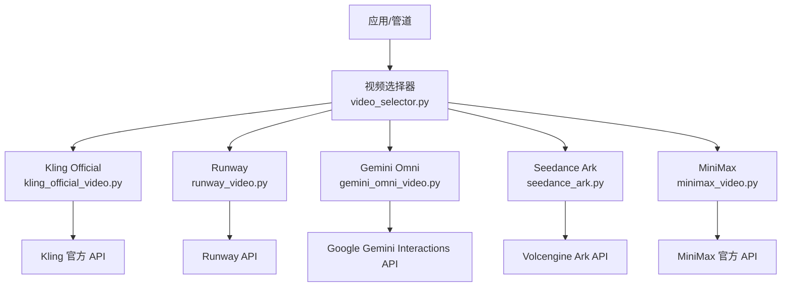
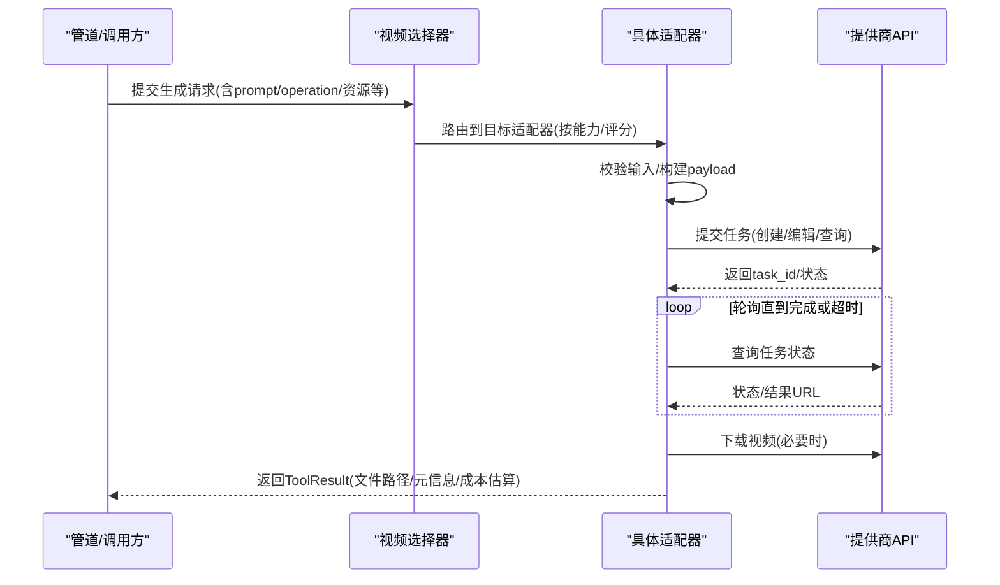
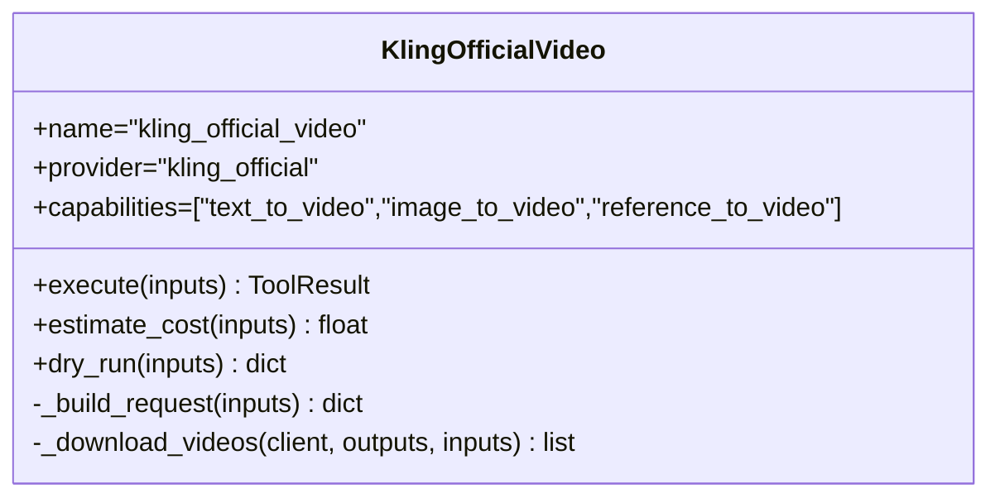
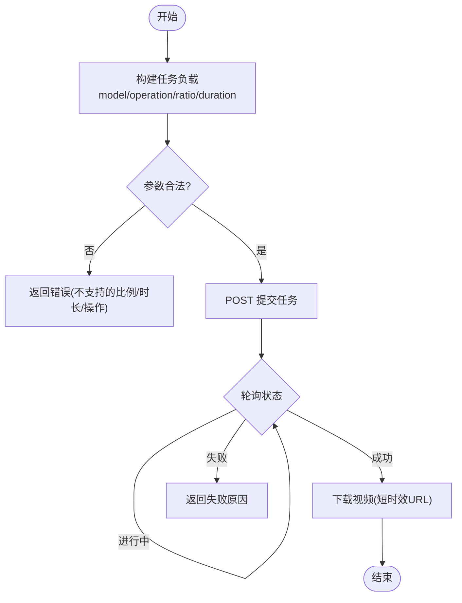
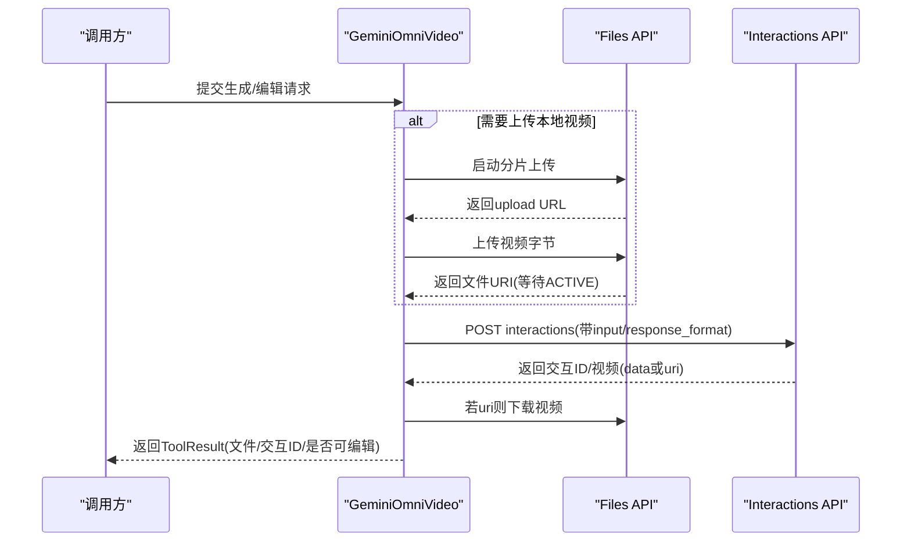
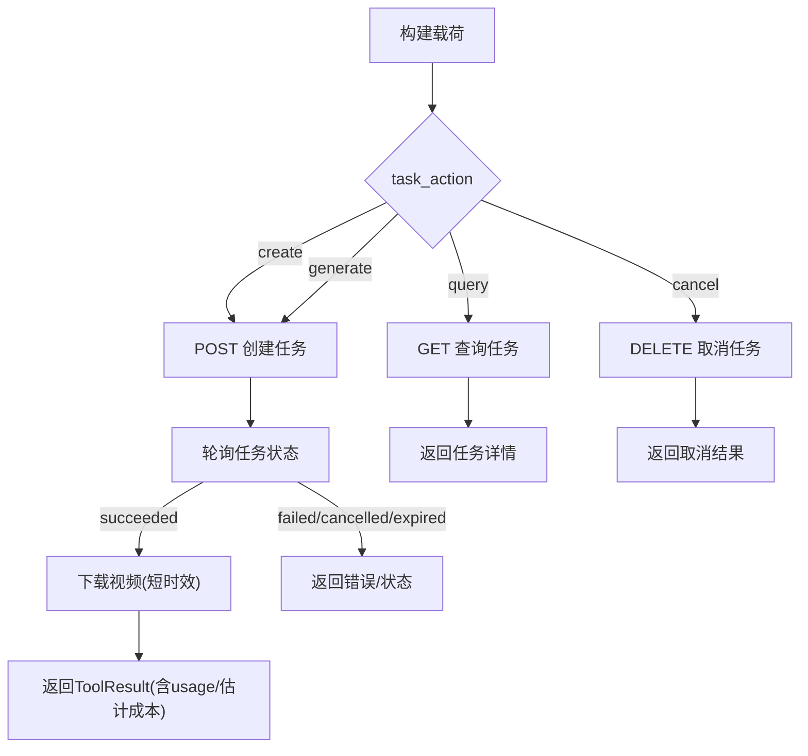
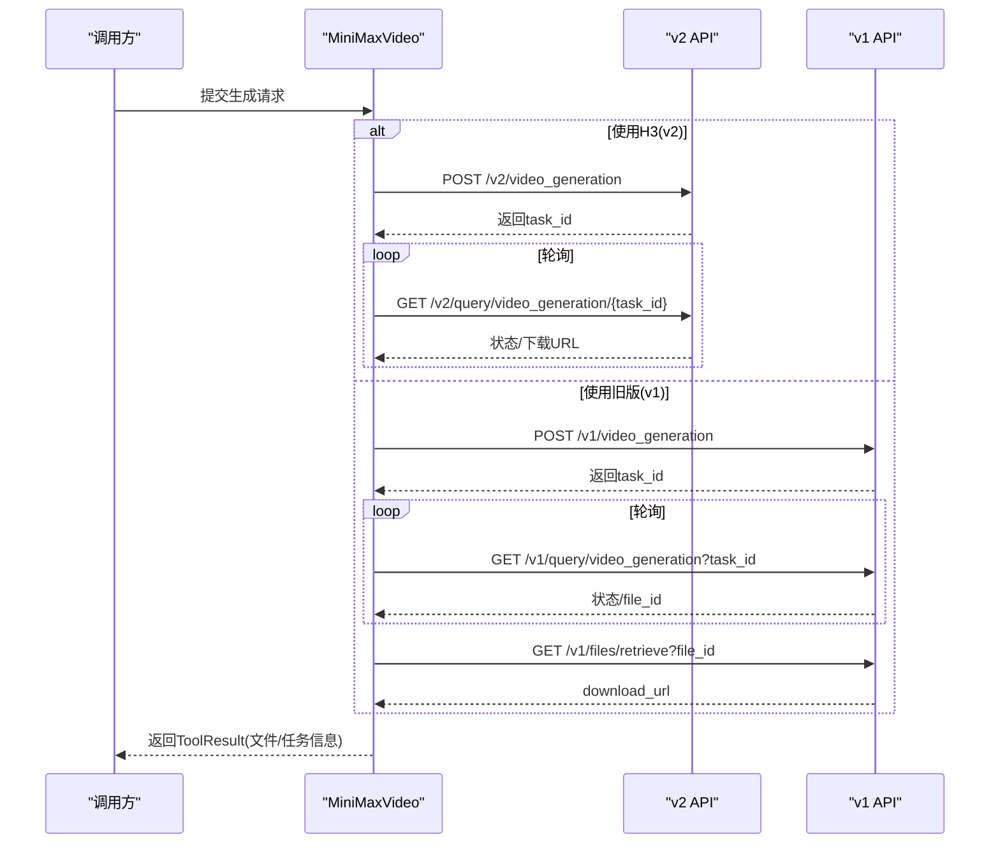
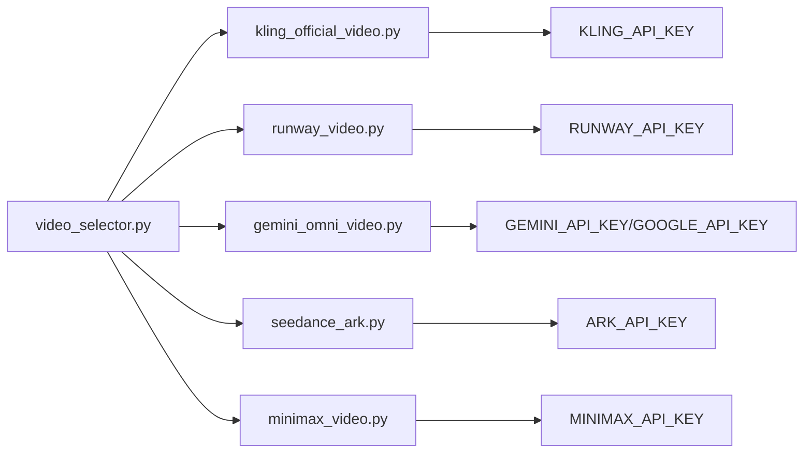

# 视频生成适配器

<cite>
**本文引用的文件**
- [README.md](file://README.md)
- [PROVIDERS.md](file://docs/PROVIDERS.md)
- [kling_official_video.py](file://tools/video/kling_official_video.py)
- [runway_video.py](file://tools/video/runway_video.py)
- [gemini_omni_video.py](file://tools/video/gemini_omni_video.py)
- [seedance_ark.py](file://tools/video/seedance_ark.py)
- [minimax_video.py](file://tools/video/minimax_video.py)
- [video_selector.py](file://tools/video/video_selector.py)
</cite>

## 目录
1. [简介](#简介)
2. [项目结构](#项目结构)
3. [核心组件](#核心组件)
4. [架构总览](#架构总览)
5. [详细组件分析](#详细组件分析)
6. [依赖关系分析](#依赖关系分析)
7. [性能与成本优化](#性能与成本优化)
8. [故障排除指南](#故障排除指南)
9. [结论](#结论)
10. [附录：API调用示例与最佳实践](#附录api调用示例与最佳实践)

## 简介
本文件面向“视频生成适配器”的统一接入与使用，覆盖 Kling、Runway、Gemini Omni、Seedance（火山引擎 Ark）、MiniMax 等主流视频生成提供商的接入方式、认证配置、参数格式、响应结构、能力边界、分辨率与时长按限、价格模型与异步任务处理模式。文档同时提供统一接口设计、轮询机制、错误重试策略、最佳实践与排障建议，确保在 OpenMontage 中新增或替换提供商时具备一致性与可扩展性。

## 项目结构
OpenMontage 将各视频生成提供商封装为独立的工具类，遵循统一的 BaseTool 契约，并通过 video_selector 进行能力匹配与选择。关键路径如下：
- tools/video：各提供商适配器实现
- docs/PROVIDERS.md：提供商设置、环境变量、定价与能力说明
- README.md：总体能力概览与快速开始

图表来源
- [video_selector.py:311-339](file://tools/video/video_selector.py#L311-L339)
- [kling_official_video.py:45-78](file://tools/video/kling_official_video.py#L45-L78)
- [runway_video.py:80-134](file://tools/video/runway_video.py#L80-L134)
- [gemini_omni_video.py:49-99](file://tools/video/gemini_omni_video.py#L49-L99)
- [seedance_ark.py:39-180](file://tools/video/seedance_ark.py#L39-L180)
- [minimax_video.py:58-105](file://tools/video/minimax_video.py#L58-L105)

章节来源
- [README.md:489-518](file://README.md#L489-L518)
- [PROVIDERS.md:29-81](file://docs/PROVIDERS.md#L29-L81)

## 核心组件
- 统一工具基座：所有适配器继承 BaseTool，声明 name/version/tier/capability/provider/stability/execution_mode/determinism/runtime、dependencies/install_instructions/agent_skills、capabilities/supports/best_for/not_good_for/fallback_tools、input_schema、resource_profile、retry_policy、idempotency_key_fields、side_effects、user_visible_verification 等元数据。
- 执行模式：多数适配器以同步包装异步任务（对外表现为同步），内部采用提交任务 + 轮询完成 + 下载结果的模式；Ark 明确标记 ASYNC 但对外仍可通过 execute 阻塞等待。
- 输入适配：video_selector 会将通用字段（如 prompt/query）按目标工具的 input_schema 进行键名适配，屏蔽下游差异。
- 输出规范：统一返回 ToolResult，包含 success/data/artifacts/cost_usd/duration_seconds/model 等，并附带 probe_output 的视频元信息。

章节来源
- [video_selector.py:311-339](file://tools/video/video_selector.py#L311-L339)
- [kling_official_video.py:45-78](file://tools/video/kling_official_video.py#L45-L78)
- [runway_video.py:80-134](file://tools/video/runway_video.py#L80-L134)
- [gemini_omni_video.py:49-99](file://tools/video/gemini_omni_video.py#L49-L99)
- [seedance_ark.py:39-180](file://tools/video/seedance_ark.py#L39-L180)
- [minimax_video.py:58-105](file://tools/video/minimax_video.py#L58-L105)

## 架构总览
下图展示从上层管道到具体提供商的调用流程，包括参数校验、任务提交、轮询、下载与结果封装。

图表来源
- [video_selector.py:311-339](file://tools/video/video_selector.py#L311-L339)
- [runway_video.py:394-454](file://tools/video/runway_video.py#L394-L454)
- [gemini_omni_video.py:342-453](file://tools/video/gemini_omni_video.py#L342-L453)
- [seedance_ark.py:530-685](file://tools/video/seedance_ark.py#L530-L685)
- [minimax_video.py:456-664](file://tools/video/minimax_video.py#L456-L664)

## 详细组件分析

### Kling Official（官方直连）
- 能力
  - 文本转视频、图像转视频、多模态参考视频生成（Video Omni）
  - 支持经典/Turbo/Omni 三类协议与多种模型变体
- 认证与环境变量
  - KLING_API_KEY（必填）
  - KLING_API_BASE_URL（可选，默认新加坡）
- 参数要点
  - operation: text_to_video / image_to_video / reference_to_video / omni_video
  - api_family: classic / turbo / omni
  - model_name/model_variant: 受限于 CLASSIC_VIDEO_MODELS/OMNI_VIDEO_MODELS
  - duration/aspect_ratio/resolution/mode/sound/negative_prompt/cfg_scale/camera_control
  - 参考输入: reference_image_url/path, reference_tail_image_url/path, reference_image_urls/paths, reference_video_url/path, video_urls/paths, image_list/video_list/element_list
  - 回调与外部任务ID: callback_url, external_task_id
  - 超时与轮询: timeout_seconds, poll_interval
- 分辨率与时长按限
  - 通过 schema 枚举约束 aspect_ratio/resolution/duration；Omni 对参考媒体有额外限制（例如不接受本地视频路径）
- 价格模型
  - 基于时长与 mode/api_family/omni 参考数量等乘数估算；Omni 会按参考数量与 multi_prompt 放大成本
- 异步与轮询
  - Turbo 走独立创建/轮询路径；Classic 走 Classic 任务创建与轮询
- 错误与重试
  - 定义可重试错误码集合；异常捕获后返回 ToolResult，携带 provider、error_code/request_id/http_status 等诊断信息
- 输出结构
  - 包含 provider/model/task_id/operation/api_family/prompt/remote_url/output_path/video_paths/format/references_used/element_ids/probe 信息等

图表来源
- [kling_official_video.py:45-78](file://tools/video/kling_official_video.py#L45-L78)
- [kling_official_video.py:80-178](file://tools/video/kling_official_video.py#L80-L178)
- [kling_official_video.py:216-287](file://tools/video/kling_official_video.py#L216-L287)
- [kling_official_video.py:289-493](file://tools/video/kling_official_video.py#L289-L493)
- [kling_official_video.py:595-705](file://tools/video/kling_official_video.py#L595-L705)

章节来源
- [kling_official_video.py:45-78](file://tools/video/kling_official_video.py#L45-L78)
- [kling_official_video.py:80-178](file://tools/video/kling_official_video.py#L80-L178)
- [kling_official_video.py:216-287](file://tools/video/kling_official_video.py#L216-L287)
- [kling_official_video.py:289-493](file://tools/video/kling_official_video.py#L289-L493)
- [kling_official_video.py:595-705](file://tools/video/kling_official_video.py#L595-L705)

### Runway（原生与第三方聚合）
- 能力
  - 文本/图像/视频转视频；支持 Seedance 2.5、Gemini Omni Flash、MiniMax Hailuo 3 等模型
- 认证与环境变量
  - RUNWAY_API_KEY 或 RUNWAYML_API_SECRET
- 参数要点
  - model: seedance2_5 / gemini_omni_flash / hailuo3 / gen4.5 / gen4_turbo 等
  - operation: text_to_video / image_to_video / video_to_video
  - duration/ratio/image_url/video_url/reference_*_urls/resolution/generate_audio/mode
- 分辨率与时长按限
  - 不同模型有不同 ratio 映射与时长限制（如 gemini_omni_flash 仅 16:9/9:16，seedance2_5 需 480p/720p 特定比例）
- 价格模型
  - 按模型与分辨率/操作类型设定每秒单价估算
- 异步与轮询
  - 提交任务后循环轮询任务状态，直至成功/失败/超时
- 错误与重试
  - 针对 rate_limit/timeout/THROTTLED 等错误进行重试
- 输出结构
  - 包含 provider/model/operation/ratio/output_path/task_id/format 及 probe 信息

图表来源
- [runway_video.py:136-201](file://tools/video/runway_video.py#L136-L201)
- [runway_video.py:239-393](file://tools/video/runway_video.py#L239-L393)
- [runway_video.py:394-454](file://tools/video/runway_video.py#L394-L454)

章节来源
- [runway_video.py:80-134](file://tools/video/runway_video.py#L80-L134)
- [runway_video.py:136-201](file://tools/video/runway_video.py#L136-L201)
- [runway_video.py:239-393](file://tools/video/runway_video.py#L239-L393)
- [runway_video.py:394-454](file://tools/video/runway_video.py#L394-L454)

### Gemini Omni（Google）
- 能力
  - 文本/图像/参考转视频；支持对话式编辑（edit_video）
- 认证与环境变量
  - GEMINI_API_KEY 或 GOOGLE_API_KEY
- 参数要点
  - operation: text_to_video / image_to_video / reference_to_video / edit_video
  - aspect_ratio: 16:9/9:16
  - duration: 3-10秒提示值
  - reference_image_path(s)/input_video_path/store/previous_interaction_id
- 分辨率与时长按限
  - 预览版输出上限 720p/10s；不支持种子/负向提示/首尾帧控制
- 价格模型
  - 按秒计费估算（约 $0.10/秒）
- 异步与轮询
  - 上传视频通过 Files API（可恢复上传），完成后通过 URI 下载；交互存储支持后续编辑
- 错误与重试
  - 针对 rate_limit/timeout 重试；上传/处理失败时给出明确错误
- 输出结构
  - 包含 provider/model/operation/output/aspect_ratio/has_audio/interaction_id/editable 等

图表来源
- [gemini_omni_video.py:49-99](file://tools/video/gemini_omni_video.py#L49-L99)
- [gemini_omni_video.py:220-280](file://tools/video/gemini_omni_video.py#L220-L280)
- [gemini_omni_video.py:342-453](file://tools/video/gemini_omni_video.py#L342-L453)

章节来源
- [gemini_omni_video.py:49-99](file://tools/video/gemini_omni_video.py#L49-L99)
- [gemini_omni_video.py:220-280](file://tools/video/gemini_omni_video.py#L220-L280)
- [gemini_omni_video.py:342-453](file://tools/video/gemini_omni_video.py#L342-L453)

### Seedance（火山引擎 Ark）
- 能力
  - 文本/图像/参考转视频；支持 Standard/Fast/Mini/2.5 等多变体
  - 支持任务创建、查询、取消；支持本地图片/音频 Data URI；不支持本地视频直接上传
- 认证与环境变量
  - ARK_API_KEY（不含 Bearer 前缀）
  - ARK_BASE_URL（可选）
  - ARK_CNY_PER_USD（汇率，默认 7.2）
- 参数要点
  - task_action: generate/create/query/cancel
  - operation: text_to_video / image_to_video / reference_to_video
  - model_variant/model/custom_price_cny_per_million_tokens
  - duration/aspect_ratio/resolution/generate_audio/watermark/return_last_frame/callback_url/web_search
  - 参考媒体: reference_image_url(s)/path(s), end_image_url/path, reference_video_url(s), reference_audio_url(s)/path(s)
- 分辨率与时长按限
  - 2.5: 480p/720p；Standard/Fast/Mini: 480p/720p（部分支持 1080p/4k）
  - 时长：2.5 最长 30s，其他 15s；adaptive 视为 16:9
- 价格模型
  - 按完成 token 计费；2.5 需自定义价格；Standard/Fast/Mini 按官方表价换算美元
- 异步与轮询
  - 创建任务后轮询至 succeeded/failed/cancelled/expired；成功后立即下载结果（短时效）
- 错误与重试
  - 针对 rate_limit/timeout/server_error 重试；任务失败返回详细错误
- 输出结构
  - 包含 provider/task_id/status/model/prompt/operation/video_url/last_frame_url/output_path/format/resolution/aspect_ratio/duration/generate_audio/usage/probe 等

图表来源
- [seedance_ark.py:182-314](file://tools/video/seedance_ark.py#L182-L314)
- [seedance_ark.py:369-461](file://tools/video/seedance_ark.py#L369-L461)
- [seedance_ark.py:530-685](file://tools/video/seedance_ark.py#L530-L685)
- [seedance_ark.py:687-800](file://tools/video/seedance_ark.py#L687-L800)

章节来源
- [seedance_ark.py:39-180](file://tools/video/seedance_ark.py#L39-L180)
- [seedance_ark.py:182-314](file://tools/video/seedance_ark.py#L182-L314)
- [seedance_ark.py:369-461](file://tools/video/seedance_ark.py#L369-L461)
- [seedance_ark.py:530-685](file://tools/video/seedance_ark.py#L530-L685)
- [seedance_ark.py:687-800](file://tools/video/seedance_ark.py#L687-L800)

### MiniMax（官方直连）
- 能力
  - 文本/图像/首尾帧/参考转视频；支持 v1/v2 两套 API；支持全球与中国大陆路由
- 认证与环境变量
  - MINIMAX_API_KEY（必填）
  - MINIMAX_REGION=global|cn（可选）
  - MINIMAX_BASE_URL（可选）
- 参数要点
  - operation: text_to_video / image_to_video / first_last_frame_to_video / reference_to_video
  - model: MiniMax-H3 或旧版 Hailuo 系列
  - first_frame_image/end_image_url(image_url)/reference_*_urls
  - duration(4-15s)/resolution(ratio)/ratio(aspect_ratio)/callback_url/aigc_watermark
- 分辨率与时长按限
  - H3: 2K；旧版按各自文档；H3 不支持 adaptive 用于纯文本
- 价格模型
  - H3: 按秒+额外参考图费用估算；Fast 固定低价；其他默认单价
- 异步与轮询
  - v2: 查询 /v2/query/video_generation/{task_id}
  - v1: 查询 /v1/query/video_generation 并获取 file_id 再下载
- 错误与重试
  - 针对 rate_limit/timeout 重试；base_resp 错误码解析
- 输出结构
  - 包含 provider/model/api_version/region/task_id/file_id/task/output_path 等

图表来源
- [minimax_video.py:58-105](file://tools/video/minimax_video.py#L58-L105)
- [minimax_video.py:107-214](file://tools/video/minimax_video.py#L107-L214)
- [minimax_video.py:323-423](file://tools/video/minimax_video.py#L323-L423)
- [minimax_video.py:456-664](file://tools/video/minimax_video.py#L456-L664)

章节来源
- [minimax_video.py:58-105](file://tools/video/minimax_video.py#L58-L105)
- [minimax_video.py:107-214](file://tools/video/minimax_video.py#L107-L214)
- [minimax_video.py:323-423](file://tools/video/minimax_video.py#L323-L423)
- [minimax_video.py:456-664](file://tools/video/minimax_video.py#L456-L664)

## 依赖关系分析
- 选择器依赖：video_selector 根据任务上下文与能力矩阵筛选候选工具，并对输入键名做归一化（如 query→prompt）。
- 适配器依赖：各适配器依赖各自的环境变量与网络访问；部分适配器依赖公共模块（如 _shared.probe_output）进行输出验证。
- 外部依赖：各提供商 API 的网络可达性与配额/定价变化会影响可用性。

图表来源
- [video_selector.py:311-339](file://tools/video/video_selector.py#L311-L339)
- [kling_official_video.py:56-61](file://tools/video/kling_official_video.py#L56-L61)
- [runway_video.py:91-95](file://tools/video/runway_video.py#L91-L95)
- [gemini_omni_video.py:60-66](file://tools/video/gemini_omni_video.py#L60-L66)
- [seedance_ark.py:139-144](file://tools/video/seedance_ark.py#L139-L144)
- [minimax_video.py:69-76](file://tools/video/minimax_video.py#L69-L76)

章节来源
- [video_selector.py:311-339](file://tools/video/video_selector.py#L311-L339)

## 性能与成本优化
- 模型与分辨率选择
  - 优先选择满足质量与时长需求的最低分辨率与最快模型（如 Seedance Fast/Mini、Runway Gen4 Turbo）
  - 对长视频拆分多次短片段拼接，避免单次超长导致失败或高成本
- 参考媒体复用
  - 合理复用图像/视频/音频参考，减少重复上传与计算
  - Ark 对本地视频不支持，应提前上传至可访问 HTTPS URL
- 轮询与超时
  - 根据提供商特性调整 poll_interval 与 timeout_seconds，避免频繁轮询造成限流
  - 对可能长时间的任务（如 Omni、Ark）适当放宽超时
- 成本估算与预算控制
  - 利用 estimate_cost/estimate_runtime 预估成本与耗时，结合系统预算治理进行审批与拦截
  - Ark 2.5 必须提供 custom_price_cny_per_million_tokens 以避免未知定价被当作免费
- 重试策略
  - 依据 retry_policy 中的可重试错误集进行指数退避重试，避免瞬时抖动导致失败
- 输出验证
  - 统一 probe_output 校验视频有效性，尽早发现损坏或空文件

[本节为通用指导，不直接分析具体文件]

## 故障排除指南
- 认证失败
  - 检查对应环境变量是否正确设置且无多余前缀（如 Ark 的 ARK_API_KEY 不应包含 Bearer）
  - 确认提供商控制台已开通相应服务与额度
- 参数非法
  - 关注各模型的 ratio/duration/resolution 限制（如 Gemini Omni 仅 16:9/9:16，Seedance 2.5 仅 480p/720p）
  - 注意 operation 与参数的组合合法性（如 image_to_video 必须提供首帧）
- 网络与限流
  - 遇到 rate_limit/timeout/THROTTLED 等错误，降低并发、增大轮询间隔或稍后重试
- 任务状态异常
  - 对 Ark/MiniMax 等异步任务，记录 task_id 以便后续查询与恢复
  - 对短时效结果 URL（Runway/Ark）尽快下载并落盘
- 输出无效
  - 使用 probe_output 检查视频是否存在、时长/分辨率是否合规
  - 若为空文件或损坏，重新生成或更换提供商

章节来源
- [runway_video.py:206-208](file://tools/video/runway_video.py#L206-L208)
- [gemini_omni_video.py:168-169](file://tools/video/gemini_omni_video.py#L168-L169)
- [seedance_ark.py:323-327](file://tools/video/seedance_ark.py#L323-L327)
- [minimax_video.py:219-221](file://tools/video/minimax_video.py#L219-L221)
- [kling_official_video.py:138-142](file://tools/video/kling_official_video.py#L138-L142)

## 结论
OpenMontage 的视频生成适配器通过统一契约与选择器机制，屏蔽了各提供商的差异，提供了稳定的文本/图像/多模态参考转视频能力。各适配器在认证、参数、能力边界、价格模型与异步轮询方面各有特点，但均遵循一致的输入输出与错误处理约定。借助本指南，可在保证一致性的前提下灵活扩展新的视频生成提供商。

## 附录：API调用示例与最佳实践

### 通用调用流程（适用于所有适配器）
- 准备环境：设置对应环境变量（见 PROVIDERS.md）
- 构造输入：按目标 adapter 的 input_schema 填写 prompt/operation/资源/时长/分辨率等
- 调用执行：通过 video_selector 或直接调用适配器 execute
- 轮询与下载：适配器内部处理，最终返回 ToolResult
- 验证输出：检查 output_path 与 probe 信息

章节来源
- [PROVIDERS.md:29-81](file://docs/PROVIDERS.md#L29-L81)
- [video_selector.py:311-339](file://tools/video/video_selector.py#L311-L339)

### 文本转视频（T2V）
- Kling Official
  - 设置 KLING_API_KEY，operation=text_to_video，指定 model_name/api_family/duration/aspect_ratio
  - 参考：[kling_official_video.py:80-133](file://tools/video/kling_official_video.py#L80-L133)
- Runway
  - 设置 RUNWAY_API_KEY，operation=text_to_video，选择 model（如 seedance2_5/gen4_turbo），设置 duration/ratio
  - 参考：[runway_video.py:136-201](file://tools/video/runway_video.py#L136-L201)
- Gemini Omni
  - 设置 GEMINI_API_KEY/GOOGLE_API_KEY，operation=text_to_video，duration 3-10s，aspect_ratio 16:9/9:16
  - 参考：[gemini_omni_video.py:101-163](file://tools/video/gemini_omni_video.py#L101-L163)
- Seedance Ark
  - 设置 ARK_API_KEY，operation=text_to_video，model_variant 选择 2.5/standard/fast/mini，duration/ratio/resolution
  - 参考：[seedance_ark.py:182-314](file://tools/video/seedance_ark.py#L182-L314)
- MiniMax
  - 设置 MINIMAX_API_KEY，operation=text_to_video，model=MiniMax-H3，duration 4-15s，resolution=2K，ratio
  - 参考：[minimax_video.py:107-214](file://tools/video/minimax_video.py#L107-L214)

### 图像转视频（I2V）
- Kling Official
  - operation=image_to_video，提供 reference_image_url/path，可选 tail image
  - 参考：[kling_official_video.py:301-339](file://tools/video/kling_official_video.py#L301-L339)
- Runway
  - operation=image_to_video，提供 image_url，选择 model（如 gen4_turbo/seedance2_5）
  - 参考：[runway_video.py:348-388](file://tools/video/runway_video.py#L348-L388)
- Gemini Omni
  - operation=image_to_video，提供 reference_image_path(s)，绑定 <FIRST_FRAME>/<IMAGE_REF_N>
  - 参考：[gemini_omni_video.py:130-138](file://tools/video/gemini_omni_video.py#L130-L138)
- Seedance Ark
  - operation=image_to_video，提供 single first frame 与可选 last frame
  - 参考：[seedance_ark.py:744-761](file://tools/video/seedance_ark.py#L744-L761)
- MiniMax
  - operation=image_to_video，提供 first_frame_image（或 image_url）
  - 参考：[minimax_video.py:432-447](file://tools/video/minimax_video.py#L432-L447)

### 多模态参考视频生成（Reference-to-Video）
- Kling Official（Omni）
  - operation=reference_to_video 或 omni_video，传入 image_list/video_list/element_list，支持元素引用
  - 参考：[kling_official_video.py:375-432](file://tools/video/kling_official_video.py#L375-L432)
- Runway
  - 通过 reference_image_urls/reference_video_urls/reference_audio_urls 传入多模态参考（模型相关）
  - 参考：[runway_video.py:255-328](file://tools/video/runway_video.py#L255-L328)
- Seedance Ark
  - operation=reference_to_video，支持最多 30 张图/10 个视频/10 个音频（2.5），或 9/3/3（标准）
  - 参考：[seedance_ark.py:762-800](file://tools/video/seedance_ark.py#L762-L800)
- MiniMax
  - operation=reference_to_video，支持 reference_image_urls/reference_video_urls/reference_audio_urls
  - 参考：[minimax_video.py:355-385](file://tools/video/minimax_video.py#L355-L385)

### 异步任务处理、轮询与重试
- 轮询模式
  - Runway/Gemini Omni/MiniMax/Seedance Ark/Kling 均在内部实现提交-轮询-下载流程，对外暴露同步接口
- 轮询参数
  - 各适配器支持 poll_interval_seconds/timeout_seconds（或默认值），可按场景调优
- 重试策略
  - 通过 RetryPolicy 配置最大重试次数与可重试错误集，避免瞬时失败影响整体成功率
- 恢复与追踪
  - 记录 task_id，便于失败后查询或手动恢复（MiniMax/Ark）

章节来源
- [runway_video.py:403-454](file://tools/video/runway_video.py#L403-L454)
- [gemini_omni_video.py:220-280](file://tools/video/gemini_omni_video.py#L220-L280)
- [minimax_video.py:517-627](file://tools/video/minimax_video.py#L517-L627)
- [seedance_ark.py:530-685](file://tools/video/seedance_ark.py#L530-L685)
- [kling_official_video.py:216-287](file://tools/video/kling_official_video.py#L216-L287)

### 最佳实践
- 先 dry_run：在付费调用前执行 dry_run 校验参数与估算成本（Ark 尤为推荐）
- 小步快跑：先用低分辨率/短时长的模型快速验证效果，再提升质量
- 参考素材管理：集中管理参考图/视频/音频，尽量复用并控制大小
- 成本控制：结合 estimate_cost 与系统预算治理，避免超支
- 容错设计：对关键链路增加重试与降级（fallback_tools），提高鲁棒性

[本节为通用指导，不直接分析具体文件]