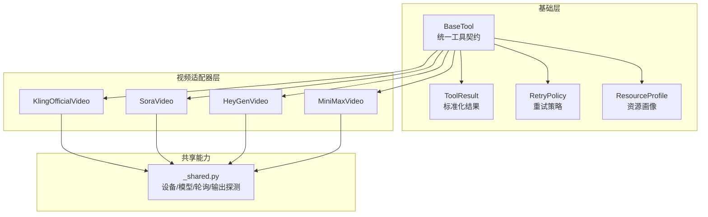
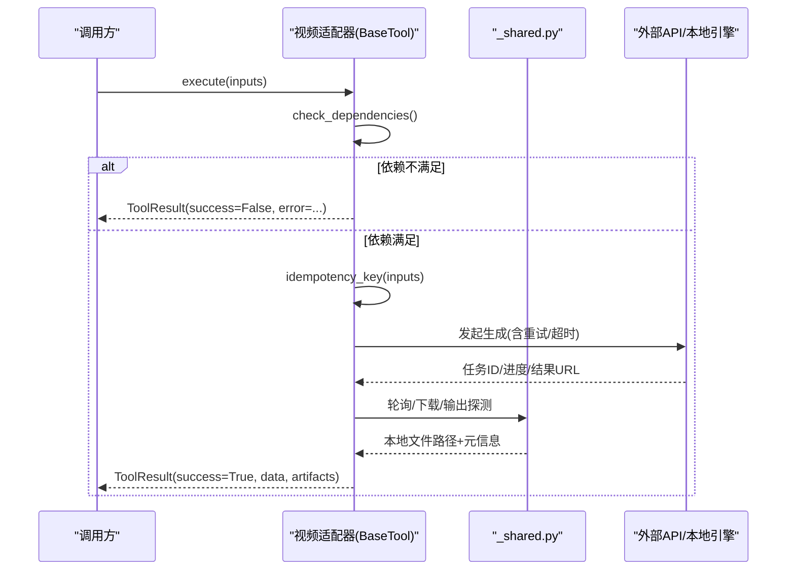
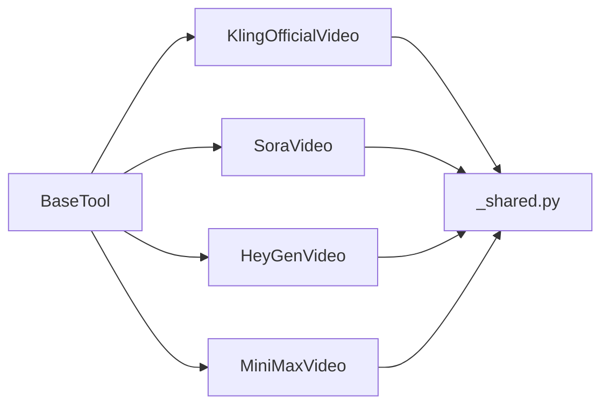

# 视频适配器基类

<cite>
**本文引用的文件**
- [tools/base_tool.py](file://tools/base_tool.py)
- [tools/video/_shared.py](file://tools/video/_shared.py)
- [tools/video/kling_official_video.py](file://tools/video/kling_official_video.py)
- [tools/video/sora_video.py](file://tools/video/sora_video.py)
- [tools/video/heygen_video.py](file://tools/video/heygen_video.py)
- [tools/video/minimax_video.py](file://tools/video/minimax_video.py)
- [tests/tools/test_base_tool_dependencies.py](file://tests/tools/test_base_tool_dependencies.py)
</cite>

## 目录
1. [简介](#简介)
2. [项目结构](#项目结构)
3. [核心组件](#核心组件)
4. [架构总览](#架构总览)
5. [详细组件分析](#详细组件分析)
6. [依赖关系分析](#依赖关系分析)
7. [性能考量](#性能考量)
8. [故障排查指南](#故障排查指南)
9. [结论](#结论)
10. [附录](#附录)

## 简介
本文件围绕 OpenMontage 的视频生成适配器基类，系统性说明 BaseTool 抽象基类的设计理念与核心能力：工具生命周期管理、状态跟踪、错误处理、重试策略、幂等性键、资源配置文件、参数验证与结果格式化。同时提供自定义视频适配器的开发指南（新提供商接入标准流程）、测试策略、调试技巧与性能监控方法，确保适配器的一致性与可维护性。

## 项目结构
OpenMontage 将“工具”抽象为统一的 BaseTool，所有视频生成适配器均继承该基类，并在 tools/video 目录下以“按提供商/功能”组织实现。共享逻辑集中在 tools/video/_shared.py，用于本地/云端视频生成的通用能力（设备选择、模型变体、轮询下载、输出探测等）。

图表来源
- [tools/base_tool.py:227-481](file://tools/base_tool.py#L227-L481)
- [tools/video/_shared.py:249-796](file://tools/video/_shared.py#L249-L796)
- [tools/video/kling_official_video.py:45-178](file://tools/video/kling_official_video.py#L45-L178)
- [tools/video/sora_video.py:35-123](file://tools/video/sora_video.py#L35-L123)
- [tools/video/heygen_video.py:24-118](file://tools/video/heygen_video.py#L24-L118)
- [tools/video/minimax_video.py:58-200](file://tools/video/minimax_video.py#L58-L200)

章节来源
- [tools/base_tool.py:227-481](file://tools/base_tool.py#L227-L481)
- [tools/video/_shared.py:249-796](file://tools/video/_shared.py#L249-L796)

## 核心组件
- BaseTool 抽象基类
  - 统一工具契约：name/version/tier/capability/provider/stability/runtime/execution_mode/determinism
  - 依赖检查：check_dependencies() 支持 env:/cmd:/binary:/python: 前缀
  - 状态报告：get_status() 基于依赖检查返回 AVAILABLE/UNAVAILABLE/DEGRADED
  - 成本/耗时估算：estimate_cost()/estimate_runtime()
  - 幂等性键：idempotency_key(inputs) 基于 idempotency_key_fields 计算哈希
  - 执行入口：execute(inputs) -> ToolResult（子类必须实现）
  - 干跑：dry_run(inputs) 预检不产生副作用
  - 子进程封装：run_command(...) 统一错误包装为 ToolCommandError
  - Backlot 事件注入：自动对 execute() 进行装饰，记录 start/finish/error，便于 UI 活动流与统计
- ToolResult
  - 标准化返回：success/data/artifacts/error/cost_usd/duration_seconds/seed/model
- ResourceProfile / RetryPolicy
  - 资源画像：CPU/RAM/VRAM/DISK/网络需求
  - 重试策略：最大重试次数、退避秒数、可重试错误码列表
- 视频共享能力 _shared.py
  - 设备选择：get_torch_device()
  - 本地生成：generate_local_video(...)
  - 云端生成：generate_heygen_video(...)
  - 轮询与下载：poll_heygen(...)
  - 输出探测：probe_output(...) 使用 ffprobe 获取时长/分辨率/编码等元信息

章节来源
- [tools/base_tool.py:110-139](file://tools/base_tool.py#L110-L139)
- [tools/base_tool.py:227-481](file://tools/base_tool.py#L227-L481)
- [tools/video/_shared.py:249-796](file://tools/video/_shared.py#L249-L796)

## 架构总览
下图展示了从调用方到具体视频适配器的执行路径，以及 BaseTool 的横切关注点（依赖检查、状态、重试、幂等、事件追踪）。

图表来源
- [tools/base_tool.py:296-397](file://tools/base_tool.py#L296-L397)
- [tools/video/_shared.py:485-796](file://tools/video/_shared.py#L485-L796)
- [tools/video/kling_official_video.py:138-178](file://tools/video/kling_official_video.py#L138-L178)
- [tools/video/sora_video.py:125-200](file://tools/video/sora_video.py#L125-L200)
- [tools/video/heygen_video.py:95-118](file://tools/video/heygen_video.py#L95-L118)
- [tools/video/minimax_video.py:125-200](file://tools/video/minimax_video.py#L125-L200)

## 详细组件分析

### BaseTool 设计与生命周期
- 生命周期
  - 初始化阶段：声明 identity、capabilities、resource_profile、retry_policy、idempotency_key_fields、side_effects、fallback/fallback_tools、agent_skills 等元数据
  - 前置校验：get_status()/check_dependencies() 在 execute 之前或 dry_run 中调用
  - 执行阶段：execute(inputs) 由子类实现；BaseTool 通过装饰器自动注入 Backlot 事件（start/finish/error），并记录深度以便聚合统计
  - 收尾阶段：返回 ToolResult，包含 cost_usd、duration_seconds、artifacts 等
- 状态跟踪
  - get_status() 默认基于 check_dependencies() 判定可用性；部分适配器会覆盖以检查 SDK/环境变量
- 错误处理
  - 依赖缺失抛出 DependencyError
  - 子进程错误包装为 ToolCommandError，保留 stderr/stdout/detail
  - 适配器内部捕获异常并返回 ToolResult(success=False, error=...)
- 幂等性
  - idempotency_key(inputs) 基于 idempotency_key_fields 计算稳定键，便于缓存/去重
- 重试策略
  - retry_policy 定义 max_retries/backoff_seconds/retryable_errors；各适配器根据供应商特性配置

章节来源
- [tools/base_tool.py:227-481](file://tools/base_tool.py#L227-L481)

### 视频适配器接口规范与实现要点
- 必需字段
  - name/version/tier/capability/provider/stability/runtime/execution_mode/determinism
  - dependencies（如 env:KLING_API_KEY）
  - input_schema（描述输入参数、枚举、默认值）
  - resource_profile（CPU/RAM/VRAM/DISK/网络）
  - retry_policy（max_retries/backoff_seconds/retryable_errors）
  - idempotency_key_fields（参与幂等键计算的字段集合）
  - side_effects（副作用说明，如“写入视频文件”、“调用付费API”）
  - fallback/fallback_tools（失败降级目标）
  - agent_skills（关联技能文档，便于编排器加载知识）
- 可选/建议
  - supports（能力矩阵，如 text_to_video/image_to_video/native_audio 等）
  - best_for/not_good_for（适用场景与不适用场景）
  - user_visible_verification（用户可见的质量验证提示）
  - estimate_cost()/estimate_runtime()（成本与耗时估算）
  - get_status()（覆盖以实现更细粒度可用性判断）
- 结果格式化
  - 成功：ToolResult(success=True, data={provider, model, output, format, ...}, artifacts=[output_path], seed, model, cost_usd, duration_seconds)
  - 失败：ToolResult(success=False, error="...")

章节来源
- [tools/video/kling_official_video.py:45-178](file://tools/video/kling_official_video.py#L45-L178)
- [tools/video/sora_video.py:35-123](file://tools/video/sora_video.py#L35-L123)
- [tools/video/heygen_video.py:24-118](file://tools/video/heygen_video.py#L24-L118)
- [tools/video/minimax_video.py:58-200](file://tools/video/minimax_video.py#L58-L200)

### 关键适配器示例分析

#### KlingOfficialVideo
- 能力：text_to_video/image_to_video/reference_to_video/omni_video
- 依赖：env:KLING_API_KEY（可选 KLING_API_BASE_URL）
- 重试：针对特定错误码（如 1302/1303/5000/5001/5002）
- 幂等键：prompt/negative_prompt/operation/api_family/model_name/model_variant/duration/aspect_ratio/resolution/mode/sound/cfg_scale/camera_control/reference_* 等
- 成本估算：依据 api_family/mode/sound/引用数量/多提示词等动态计算
- 输出：mp4，附带 probe_output 元信息

章节来源
- [tools/video/kling_official_video.py:45-200](file://tools/video/kling_official_video.py#L45-L200)

#### SoraVideo
- 能力：text_to_video/image_to_video（原生音频、相机方向、社媒广告、短视频）
- 依赖：OPENAI_API_KEY + openai SDK >= 指定版本
- 重试：rate_limit/timeout
- 幂等键：prompt/model/size/seconds
- 执行：调用 OpenAI Video API，下载并落盘 mp4
- 成本/耗时：按秒线性估算

章节来源
- [tools/video/sora_video.py:35-200](file://tools/video/sora_video.py#L35-L200)

#### HeyGenVideo
- 能力：text_to_video/image_to_video，并通过 provider_matrix 暴露多个后端（VEO/Sora/Kling/Runway/Seedance 等）
- 依赖：HEYGEN_API_KEY
- 重试：rate_limit/timeout/server_error
- 幂等键：prompt/provider_variant/aspect_ratio
- 执行：委托 _shared.generate_heygen_video，内部完成上传/创建执行/轮询/下载
- 成本/耗时：基于 quality/speed 映射估算

章节来源
- [tools/video/heygen_video.py:24-118](file://tools/video/heygen_video.py#L24-L118)
- [tools/video/_shared.py:595-666](file://tools/video/_shared.py#L595-L666)

#### MiniMaxVideo
- 能力：text_to_video/image_to_video/first_last_frame_to_video/reference_to_video
- 依赖：MINIMAX_API_KEY（支持 global/cn 区域与自定义 BASE_URL）
- 重试：按供应商错误分类
- 幂等键：依据 operation/model/ratio/duration 等
- 执行：v1/v2 双协议兼容，支持回调、轮询、下载

章节来源
- [tools/video/minimax_video.py:58-200](file://tools/video/minimax_video.py#L58-L200)

### 资源配置文件、重试策略与幂等性键设计
- 资源配置文件
  - 每个适配器声明 resource_profile，明确 CPU/RAM/VRAM/DISK/网络需求，便于调度与容量规划
  - 本地生成时，_shared.get_torch_device() 自动选择 cuda/mps/cpu；load_diffusers_pipeline 根据设备精度与 offload 策略优化显存占用
- 重试策略
  - 通过 retry_policy 集中声明可重试错误类型与退避策略；适配器可根据供应商差异定制
  - 云端异步任务（如 HeyGen）采用轮询+指数退避，直至完成或超时
- 幂等性键
  - 通过 idempotency_key_fields 精确控制哪些输入影响幂等键，避免无关字段导致缓存失效
  - 结合 estimate_cost/estimate_runtime 可在编排层做预算与排队决策

章节来源
- [tools/base_tool.py:120-139](file://tools/base_tool.py#L120-L139)
- [tools/base_tool.py:384-397](file://tools/base_tool.py#L384-L397)
- [tools/video/_shared.py:249-373](file://tools/video/_shared.py#L249-L373)
- [tools/video/_shared.py:485-796](file://tools/video/_shared.py#L485-L796)

### 自定义视频适配器开发指南（新提供商接入标准流程）
- 步骤
  1) 新建适配器类继承 BaseTool，填写 identity/capabilities/supports/best_for/not_good_for/fallback_tools/agent_skills
  2) 声明 dependencies（如 env:YOUR_API_KEY），并编写 install_instructions
  3) 定义 input_schema，严格约束必填项、枚举、默认值与范围
  4) 配置 resource_profile（尤其 VRAM 与磁盘空间）
  5) 配置 retry_policy（根据供应商错误码/限流策略）
  6) 设置 idempotency_key_fields（仅包含影响结果的字段）
  7) 实现 execute(inputs)：
     - 前置校验（依赖、参数合法性）
     - 调用供应商 API 或本地引擎
     - 处理异步任务（轮询/回调）
     - 下载并落盘视频文件
     - 使用 _shared.probe_output 补充元信息
     - 返回 ToolResult(success=True/False, ...)
  8) 可选：覆盖 get_status()/estimate_cost()/estimate_runtime()
  9) 注册到工具注册表（若需要）
  10) 编写单元测试与合同测试（见下节）
- 最佳实践
  - 保持幂等键最小化且稳定
  - 对昂贵操作提供 dry_run 估算
  - 明确 side_effects，便于审计与回滚
  - 提供 fallback/fallback_tools，增强鲁棒性
  - 使用 _shared 中的通用函数减少重复代码

章节来源
- [tools/base_tool.py:227-481](file://tools/base_tool.py#L227-L481)
- [tools/video/_shared.py:399-796](file://tools/video/_shared.py#L399-L796)

### 测试策略、调试技巧与性能监控
- 测试策略
  - 依赖检测测试：验证 binary:/cmd:/env:/python: 依赖的前缀与行为
  - 适配器合同测试：校验 input_schema/output_schema/能力矩阵/枚举值
  - 端到端测试：在沙箱环境模拟供应商响应，验证完整链路（创建任务→轮询→下载→输出探测）
  - 回归测试：冻结 schema 快照，防止破坏性变更
- 调试技巧
  - 启用 Backlot 事件日志，观察 start/finish/error 与 depth，定位嵌套调用链
  - 打印 ToolResult 的 data/artifacts/cost_usd/duration_seconds，快速核对结果
  - 使用 run_command 的 ToolCommandError 查看 stderr/stdout/detail
  - 本地生成时切换设备（cuda/mps/cpu）与 offload 开关，观察显存占用与速度变化
- 性能监控
  - 利用 estimate_runtime/实际 duration_seconds 对比，识别瓶颈
  - 通过 probe_output 获取视频时长/分辨率/编码，辅助质量评估
  - 结合 retry_policy 调整 backoff 与 max_retries，平衡成功率与时延

章节来源
- [tests/tools/test_base_tool_dependencies.py:15-53](file://tests/tools/test_base_tool_dependencies.py#L15-L53)
- [tools/base_tool.py:148-224](file://tools/base_tool.py#L148-L224)
- [tools/video/_shared.py:758-796](file://tools/video/_shared.py#L758-L796)

## 依赖关系分析
- 组件耦合
  - 适配器强依赖 BaseTool（统一契约）与 _shared（通用能力）
  - 适配器之间松耦合，通过 fallback_tools 形成弹性降级图
- 外部依赖
  - 环境变量（API Key）、第三方 SDK（openai/diffusers/torch）、系统命令（ffprobe）
- 循环依赖
  - 无直接循环；BaseTool 被所有适配器引用，_shared 被适配器复用

图表来源
- [tools/base_tool.py:227-481](file://tools/base_tool.py#L227-L481)
- [tools/video/_shared.py:249-796](file://tools/video/_shared.py#L249-L796)
- [tools/video/kling_official_video.py:45-178](file://tools/video/kling_official_video.py#L45-L178)
- [tools/video/sora_video.py:35-123](file://tools/video/sora_video.py#L35-L123)
- [tools/video/heygen_video.py:24-118](file://tools/video/heygen_video.py#L24-L118)
- [tools/video/minimax_video.py:58-200](file://tools/video/minimax_video.py#L58-L200)

## 性能考量
- 本地生成
  - 优先使用 CUDA；MPS 次之；CPU 作为兜底
  - 开启 attention_slicing 与 VAE tiling/slicing 降低显存峰值
  - 合理设置 num_frames/width/height/num_inference_steps，平衡质量与耗时
- 云端生成
  - 合理配置 retry_policy，避免风暴式重试
  - 轮询间隔与超时需匹配供应商 SLA
  - 使用 estimate_runtime/实际 duration_seconds 校准预估
- 存储与IO
  - 输出文件先写临时目录，成功后再移动，避免半产物
  - 使用 probe_output 快速获取元信息，减少二次解析

[本节为通用指导，无需列出具体文件来源]

## 故障排查指南
- 依赖缺失
  - 现象：get_status() 返回 UNAVAILABLE；check_dependencies() 抛 DependencyError
  - 处理：安装二进制/模块或设置环境变量；参考 install_instructions
- 供应商错误
  - 现象：ToolResult(success=False, error=...)
  - 处理：检查 retryable_errors 是否覆盖；必要时扩大重试范围或调整 backoff
- 子进程错误
  - 现象：ToolCommandError 包含 returncode/stderr/detail
  - 处理：检查命令是否存在、权限、编码问题（已强制 UTF-8）
- 输出异常
  - 现象：无 video_url/无 output_path/时长为 0
  - 处理：确认轮询完成、下载成功；检查 ffprobe 是否可用

章节来源
- [tools/base_tool.py:296-328](file://tools/base_tool.py#L296-L328)
- [tools/base_tool.py:456-481](file://tools/base_tool.py#L456-L481)
- [tools/video/_shared.py:485-796](file://tools/video/_shared.py#L485-L796)

## 结论
BaseTool 为 OpenMontage 的视频适配器提供了统一、可扩展、可观测的基础设施。通过标准化的生命周期、状态跟踪、错误处理、重试与幂等机制，配合 _shared 的通用能力，使得新增视频提供商能够快速接入并保持高一致性。遵循本文档的接口规范与实践建议，可以显著提升适配器的可维护性与可靠性。

[本节为总结，无需列出具体文件来源]

## 附录
- 常用字段速查
  - 幂等键字段：仅包含影响结果的关键输入（如 prompt/model/尺寸/时长/参考图等）
  - 重试错误：按供应商错误码/限流/超时分类
  - 资源画像：务必标注 VRAM 与磁盘空间，避免运行时 OOM
- 参考实现路径
  - 适配器模板：tools/video/*.py
  - 共享能力：tools/video/_shared.py
  - 基类契约：tools/base_tool.py
  - 测试用例：tests/tools/*video*.py

[本节为参考索引，无需列出具体文件来源]