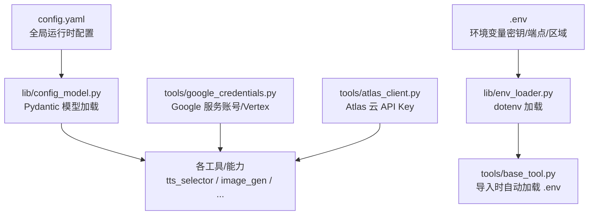
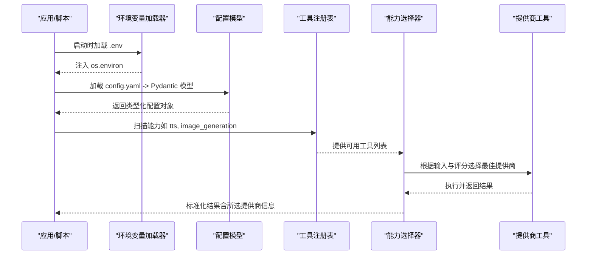
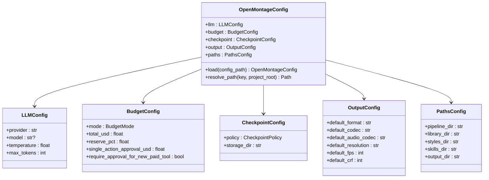
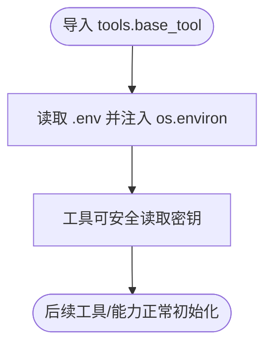
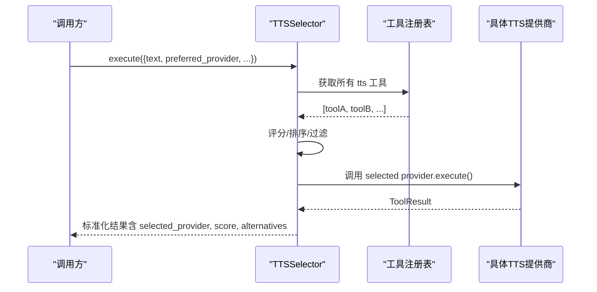
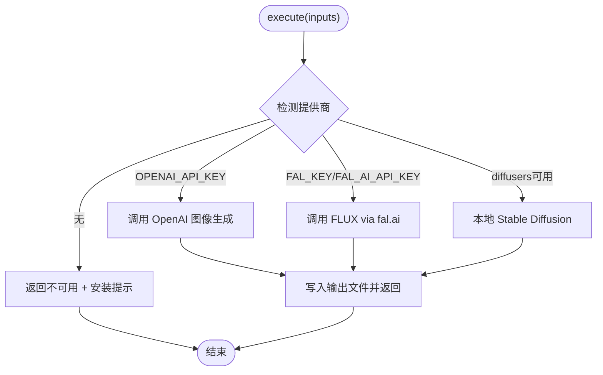
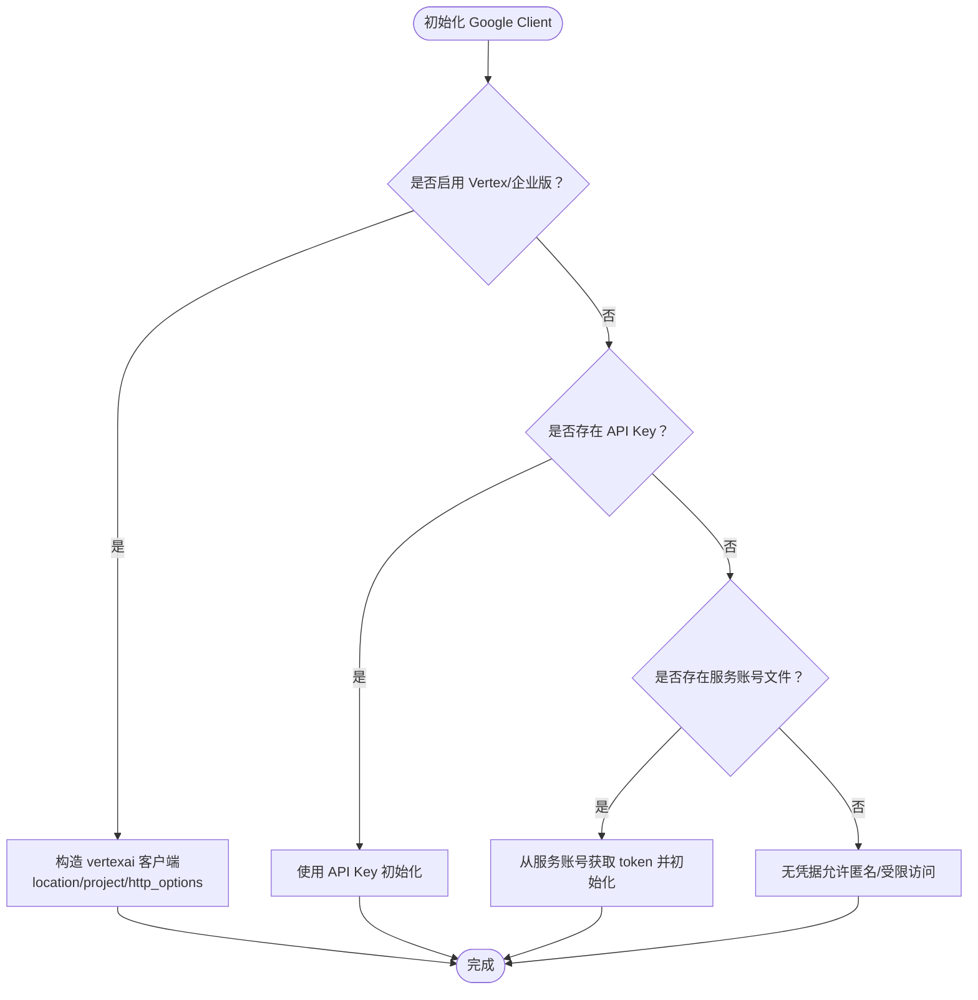
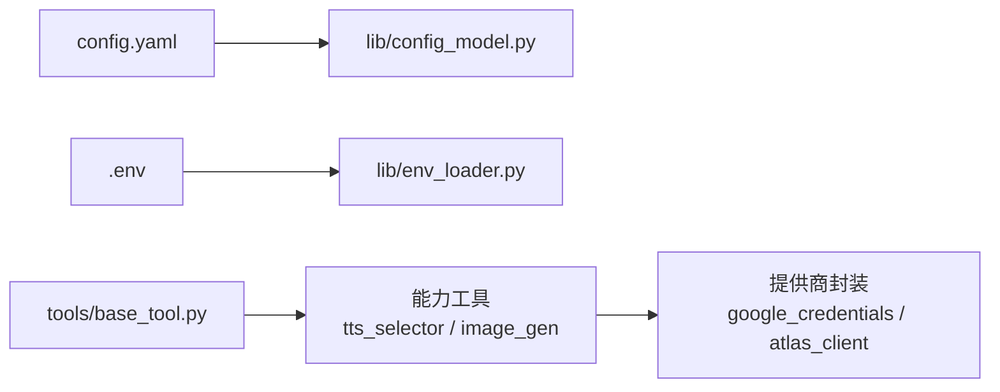

# 认证与配置管理

<cite>
**本文引用的文件**
- [config.yaml](file://config.yaml)
- [lib/env_loader.py](file://lib/env_loader.py)
- [lib/config_model.py](file://lib/config_model.py)
- [tools/base_tool.py](file://tools/base_tool.py)
- [tools/google_credentials.py](file://tools/google_credentials.py)
- [tools/atlas_client.py](file://tools/atlas_client.py)
- [tools/audio/tts_selector.py](file://tools/audio/tts_selector.py)
- [tools/graphics/image_gen.py](file://tools/graphics/image_gen.py)
- [tests/contracts/test_kling_official_core.py](file://tests/contracts/test_kling_official_core.py)
- [tests/conftest.py](file://tests/conftest.py)
</cite>

## 目录
1. [简介](#简介)
2. [项目结构](#项目结构)
3. [核心组件](#核心组件)
4. [架构总览](#架构总览)
5. [详细组件分析](#详细组件分析)
6. [依赖关系分析](#依赖关系分析)
7. [性能与安全考虑](#性能与安全考虑)
8. [故障诊断指南](#故障诊断指南)
9. [结论](#结论)
10. [附录：环境变量清单与示例](#附录环境变量清单与示例)

## 简介
本文件面向 OpenMontage 的认证与配置管理，覆盖多提供商（LLM、图像生成、TTS、视频生成等）的认证方式、API 密钥管理、环境变量配置、配置文件结构与默认值、覆盖机制、多账户支持、区域与端点选择、安全最佳实践、密钥轮换策略、访问权限控制、以及连接测试与调试方法。目标是确保在便捷性与安全性之间取得平衡，使团队和个人在不同环境（开发、测试、生产）中都能稳定、可控地使用外部服务。

## 项目结构
OpenMontage 将“运行时配置”和“凭据加载”解耦：
- 运行时配置通过 YAML 模型加载并提供类型化访问，包含 LLM、预算、检查点、输出、路径等全局设置。
- 环境变量由统一的加载器负责从 .env 注入进程环境，并在工具基类导入时自动生效。
- 各工具按能力注册到统一注册表，按能力（如 tts、image_generation）进行发现与路由。
- 第三方服务的认证细节封装在各工具或共享模块中（例如 Google 服务账号、Atlas Cloud）。

图表来源
- [config.yaml:1-34](file://config.yaml#L1-L34)
- [lib/config_model.py:65-93](file://lib/config_model.py#L65-L93)
- [lib/env_loader.py:15-34](file://lib/env_loader.py#L15-L34)
- [tools/base_tool.py:25-60](file://tools/base_tool.py#L25-L60)

章节来源
- [config.yaml:1-34](file://config.yaml#L1-L34)
- [lib/config_model.py:1-93](file://lib/config_model.py#L1-L93)
- [lib/env_loader.py:1-35](file://lib/env_loader.py#L1-L35)
- [tools/base_tool.py:25-60](file://tools/base_tool.py#L25-L60)

## 核心组件
- 运行时配置模型：提供类型化的全局配置（LLM、预算、检查点、输出、路径），并支持从 config.yaml 加载与默认值回退。
- 环境变量加载器：统一从 .env 读取键值，提供 get_env/require_env 辅助函数；工具基类在导入时自动加载 .env，保证密钥在工具实例化前可用。
- 能力选择器：以能力为中心（如 TTS、图像生成）动态发现并路由到具体提供商工具，屏蔽底层差异。
- 提供商认证封装：
  - Google：支持 API Key 与服务账号（含 Vertex AI 区域与项目解析）。
  - Atlas Cloud：支持多种别名环境变量，统一为 Bearer Token。
  - Kling：通过环境变量注入 Authorization 头。

章节来源
- [lib/config_model.py:28-93](file://lib/config_model.py#L28-L93)
- [lib/env_loader.py:15-34](file://lib/env_loader.py#L15-L34)
- [tools/base_tool.py:25-60](file://tools/base_tool.py#L25-L60)
- [tools/google_credentials.py:22-91](file://tools/google_credentials.py#L22-L91)
- [tools/atlas_client.py:37-66](file://tools/atlas_client.py#L37-L66)
- [tests/contracts/test_kling_official_core.py:318-347](file://tests/contracts/test_kling_official_core.py#L318-L347)

## 架构总览
下图展示了从配置加载到能力调用的端到端流程，包括环境变量注入、配置模型解析、能力选择与提供商调用。

图表来源
- [lib/env_loader.py:15-34](file://lib/env_loader.py#L15-L34)
- [lib/config_model.py:74-93](file://lib/config_model.py#L74-L93)
- [tools/audio/tts_selector.py:157-225](file://tools/audio/tts_selector.py#L157-L225)
- [tools/graphics/image_gen.py:103-153](file://tools/graphics/image_gen.py#L103-L153)

## 详细组件分析

### 运行时配置模型（config.yaml + Pydantic）
- 作用：集中定义 LLM、预算、检查点、输出、路径等全局参数，提供默认值与类型校验。
- 加载机制：若存在 config.yaml 则解析为 Pydantic 模型；否则使用内置默认值。
- 路径解析：支持相对路径相对于项目根目录解析，便于跨环境复用。

图表来源
- [lib/config_model.py:28-93](file://lib/config_model.py#L28-L93)

章节来源
- [lib/config_model.py:1-93](file://lib/config_model.py#L1-L93)
- [config.yaml:1-34](file://config.yaml#L1-L34)

### 环境变量加载与工具基类集成
- 环境变量加载：
  - 专用加载器提供 load_env/get_env/require_env。
  - 工具基类在导入时自动加载 .env，确保任何工具在使用前已具备所需的环境变量。
- 优势：避免显式初始化顺序问题；支持注释与引号处理；不覆盖已有环境变量。

图表来源
- [tools/base_tool.py:25-60](file://tools/base_tool.py#L25-L60)
- [lib/env_loader.py:15-34](file://lib/env_loader.py#L15-L34)

章节来源
- [tools/base_tool.py:25-60](file://tools/base_tool.py#L25-L60)
- [lib/env_loader.py:1-35](file://lib/env_loader.py#L1-L35)

### 文本转语音（TTS）能力选择与提供商路由
- 能力发现：基于注册表自动发现所有 capability="tts" 的工具。
- 选择策略：支持 preferred_provider 与 allowed_providers 过滤；内部使用评分机制选择最佳提供商。
- 输入适配：对不同提供商的参数进行归一化（如语速、音高、风格等）。
- 结果增强：返回所选工具名称、提供商、评分解释及备选方案。

图表来源
- [tools/audio/tts_selector.py:157-225](file://tools/audio/tts_selector.py#L157-L225)
- [tools/audio/tts_selector.py:227-288](file://tools/audio/tts_selector.py#L227-L288)

章节来源
- [tools/audio/tts_selector.py:1-324](file://tools/audio/tts_selector.py#L1-L324)

### 图像生成能力（多提供商）
- 提供商检测：优先 OPENAI_API_KEY，其次 FAL_KEY/FAL_AI_API_KEY，最后本地 diffusers。
- 成本估算：不同提供商有固定估算值；本地模式为 0。
- 错误处理：未检测到提供商时返回不可用并附带安装说明。

图表来源
- [tools/graphics/image_gen.py:103-153](file://tools/graphics/image_gen.py#L103-L153)
- [tools/graphics/image_gen.py:155-280](file://tools/graphics/image_gen.py#L155-L280)

章节来源
- [tools/graphics/image_gen.py:1-280](file://tools/graphics/image_gen.py#L1-L280)

### Google 认证与区域/项目解析
- 支持两种认证模式：
  - API Key：GOOGLE_API_KEY 或 GEMINI_API_KEY。
  - 服务账号：GOOGLE_APPLICATION_CREDENTIALS 指向 JSON 文件，用于 Vertex AI 与企业版。
- 区域与项目：
  - 区域默认 us-central1，可通过 GOOGLE_CLOUD_LOCATION 覆盖。
  - 项目 ID 优先级：环境变量 > 服务账号 key 中的项目 ID。
- 访问令牌：按需从服务账号刷新 OAuth token，供需要 Bearer 的场景使用。

图表来源
- [tools/google_credentials.py:22-91](file://tools/google_credentials.py#L22-L91)
- [tools/google_credentials.py:94-142](file://tools/google_credentials.py#L94-L142)

章节来源
- [tools/google_credentials.py:1-142](file://tools/google_credentials.py#L1-L142)

### Atlas Cloud 认证
- 环境变量别名：ATLASCLOUD_API_KEY、ATLAS_CLOUD_API_KEY、ATLAS_API_KEY，取第一个非空值。
- 请求头：统一为 Authorization: Bearer <api_key>。
- 错误包装：对外抛出 AtlasError，便于上层捕获与提示。

章节来源
- [tools/atlas_client.py:37-66](file://tools/atlas_client.py#L37-L66)

### Kling 官方认证（Authorization 头）
- 通过 KLING_API_KEY 注入 Authorization: Bearer 头。
- 测试用例验证了该行为与端点路径。

章节来源
- [tests/contracts/test_kling_official_core.py:318-347](file://tests/contracts/test_kling_official_core.py#L318-L347)

## 依赖关系分析
- 配置层：config.yaml → lib/config_model.py（Pydantic 模型）。
- 环境变量层：.env → lib/env_loader.py → tools/base_tool.py（导入时加载）。
- 能力层：tools/audio/tts_selector.py、tools/graphics/image_gen.py 等通过注册表发现与路由。
- 提供商层：tools/google_credentials.py、tools/atlas_client.py 等封装认证细节。

图表来源
- [lib/config_model.py:74-93](file://lib/config_model.py#L74-L93)
- [lib/env_loader.py:15-34](file://lib/env_loader.py#L15-L34)
- [tools/base_tool.py:25-60](file://tools/base_tool.py#L25-L60)
- [tools/audio/tts_selector.py:157-225](file://tools/audio/tts_selector.py#L157-L225)
- [tools/graphics/image_gen.py:103-153](file://tools/graphics/image_gen.py#L103-L153)
- [tools/google_credentials.py:22-91](file://tools/google_credentials.py#L22-L91)
- [tools/atlas_client.py:37-66](file://tools/atlas_client.py#L37-L66)

章节来源
- [lib/config_model.py:1-93](file://lib/config_model.py#L1-L93)
- [lib/env_loader.py:1-35](file://lib/env_loader.py#L1-L35)
- [tools/base_tool.py:1-200](file://tools/base_tool.py#L1-L200)
- [tools/audio/tts_selector.py:1-324](file://tools/audio/tts_selector.py#L1-L324)
- [tools/graphics/image_gen.py:1-280](file://tools/graphics/image_gen.py#L1-L280)
- [tools/google_credentials.py:1-142](file://tools/google_credentials.py#L1-L142)
- [tools/atlas_client.py:1-70](file://tools/atlas_client.py#L1-L70)

## 性能与安全考虑
- 性能
  - 能力选择器对候选提供商进行评分与排序，减少无效调用。
  - 图像生成工具对网络与本地模式分别优化，合理设置超时与重试策略。
  - Google 客户端支持 http_options，便于调整超时与重试。
- 安全
  - 密钥仅通过环境变量传递，避免硬编码；.env 在导入阶段加载且不覆盖已有环境变量。
  - 服务账号最小权限原则：仅授予必要 scope（如 cloud-platform）。
  - 测试环境禁止真实网络访问，防止误用付费接口。
  - 建议定期轮换 API Key，并为不同环境/用途创建独立密钥。
  - 对敏感操作（如付费工具）启用预算与审批策略（见配置模型中的预算字段）。

章节来源
- [tools/base_tool.py:120-139](file://tools/base_tool.py#L120-L139)
- [tools/google_credentials.py:18-20](file://tools/google_credentials.py#L18-L20)
- [tests/conftest.py:40-78](file://tests/conftest.py#L40-L78)
- [lib/config_model.py:35-45](file://lib/config_model.py#L35-L45)

## 故障诊断指南
- 常见问题定位
  - 缺少环境变量：使用 require_env 强制校验缺失项；或在工具返回的错误信息中查看安装/配置提示。
  - 提供商不可用：检查对应环境变量是否设置；查看工具状态（available/unavailable/degraded）。
  - 网络限制：测试套件默认阻止非回环网络访问；如需运行真实接口测试，需显式开启标志。
- 连接测试
  - 使用能力选择器的 rank 模式，在不实际生成的情况下评估各提供商可用性。
  - 对 Google 服务账号，尝试获取访问令牌以验证凭据有效性。
  - 对 Atlas/Kling 等，发送轻量请求并检查 Authorization 头是否正确注入。
- 调试技巧
  - 启用日志记录，记录请求与错误上下文。
  - 使用配置模型的 resolve_path 确认路径解析是否符合预期。
  - 借助工具注册表的 provider_menu_summary 快速了解哪些能力已配置、哪些缺失。

章节来源
- [lib/env_loader.py:24-34](file://lib/env_loader.py#L24-L34)
- [tools/audio/tts_selector.py:190-225](file://tools/audio/tts_selector.py#L190-L225)
- [tools/google_credentials.py:94-142](file://tools/google_credentials.py#L94-L142)
- [tests/conftest.py:40-78](file://tests/conftest.py#L40-L78)

## 结论
OpenMontage 通过“配置模型 + 环境变量 + 能力选择器 + 提供商封装”的分层设计，实现了灵活的认证与配置管理。它既保证了易用性（自动发现、默认值、路径解析），又兼顾了安全性（最小权限、密钥隔离、测试保护）。结合预算与审批策略，可在多账户、多区域、多端点的复杂环境中稳定运行。

## 附录：环境变量清单与示例
以下为常见提供商与环境变量的汇总（不含具体密钥值）：
- LLM/通用
  - OPENAI_API_KEY：OpenAI 图像/文本服务
  - FAL_KEY 或 FAL_AI_API_KEY：FLUX via fal.ai
  - ATLASCLOUD_API_KEY、ATLAS_CLOUD_API_KEY、ATLAS_API_KEY：Atlas Cloud（任选其一）
  - KLING_API_KEY、KLING_API_BASE_URL：Kling 官方
  - ELEVENLABS_API_KEY：ElevenLabs TTS
  - GOOGLE_API_KEY 或 GEMINI_API_KEY：Google GenAI（API Key 模式）
  - GOOGLE_APPLICATION_CREDENTIALS：Google 服务账号 JSON 路径
  - GOOGLE_GENAI_USE_VERTEXAI 或 GOOGLE_GENAI_USE_ENTERPRISE：启用 Vertex/企业版
  - GOOGLE_CLOUD_LOCATION：Vertex 区域（默认 us-central1）
  - GOOGLE_CLOUD_PROJECT、GOOGLE_CLOUD_PROJECT_ID、GCLOUD_PROJECT：GCP 项目 ID
- 其他
  - HEYGEN_CONFIG_DIR：HeyGen 凭据目录（可选）
  - 测试开关：TEST_NETWORK_ALLOWED（用于允许测试访问真实网络）

示例（占位符形式）：
- OPENAI_API_KEY=your_openai_key
- FAL_KEY=your_fal_key
- ATLASCLOUD_API_KEY=your_atlas_key
- KLING_API_KEY=your_kling_key
- KLING_API_BASE_URL=https://api.example.com
- ELEVENLABS_API_KEY=your_elevenlabs_key
- GOOGLE_API_KEY=your_google_key
- GOOGLE_APPLICATION_CREDENTIALS=/path/to/service-account.json
- GOOGLE_GENAI_USE_VERTEXAI=true
- GOOGLE_CLOUD_LOCATION=us-central1
- GOOGLE_CLOUD_PROJECT=my-gcp-project
- HEYGEN_CONFIG_DIR=~/.heygen

注意：
- 请勿将真实密钥提交至代码库；使用 .env 或系统环境变量管理。
- 不同环境（开发/测试/生产）应使用独立的密钥与项目配置。
- 定期轮换密钥，并为每个用途创建最小权限的凭据。

章节来源
- [tools/atlas_client.py:37-66](file://tools/atlas_client.py#L37-L66)
- [tests/contracts/test_kling_official_core.py:318-347](file://tests/contracts/test_kling_official_core.py#L318-L347)
- [tools/google_credentials.py:22-91](file://tools/google_credentials.py#L22-L91)
- [tools/base_tool.py:25-60](file://tools/base_tool.py#L25-L60)
- [tests/conftest.py:40-78](file://tests/conftest.py#L40-L78)