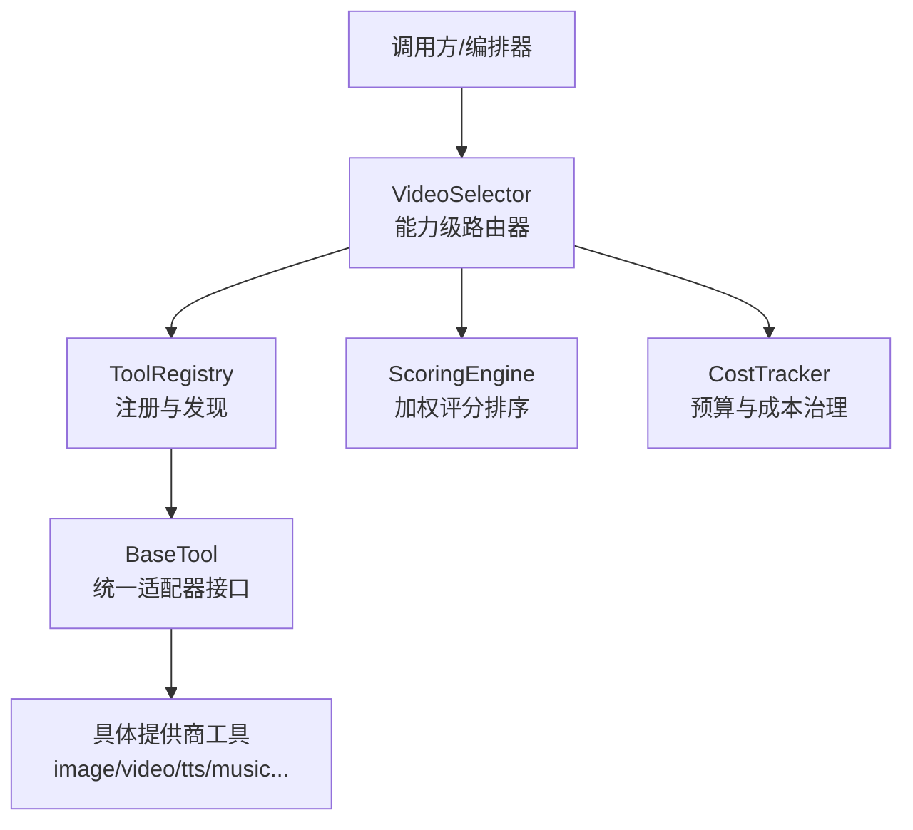
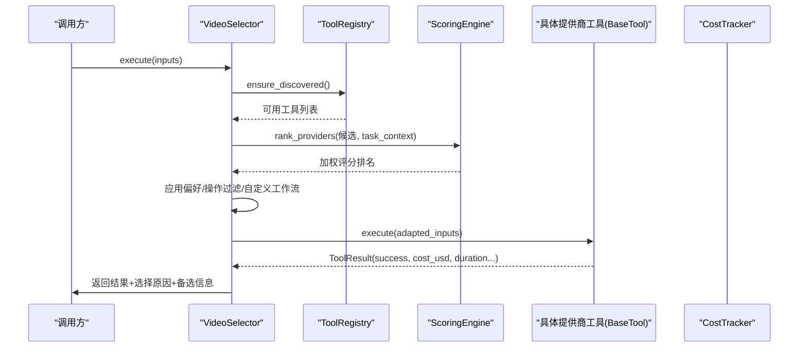
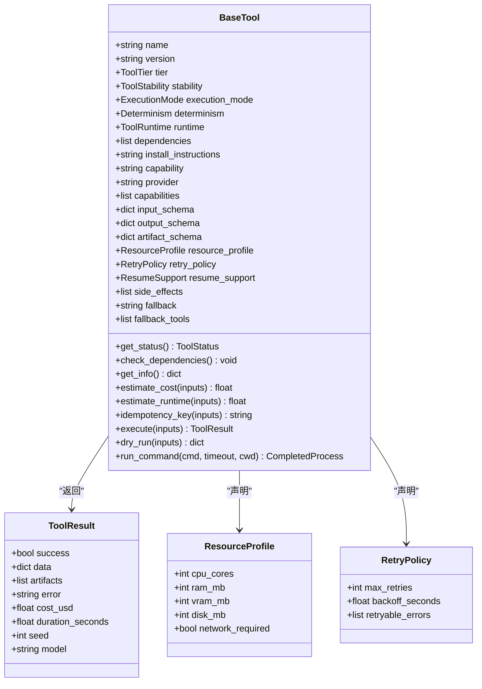
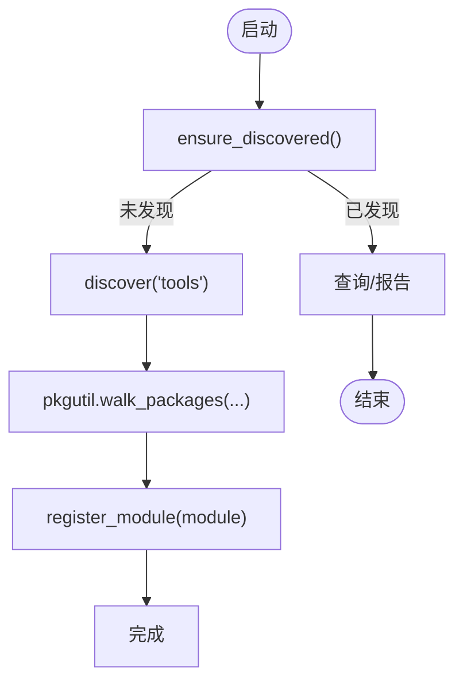
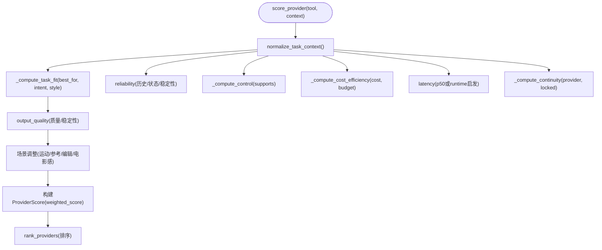
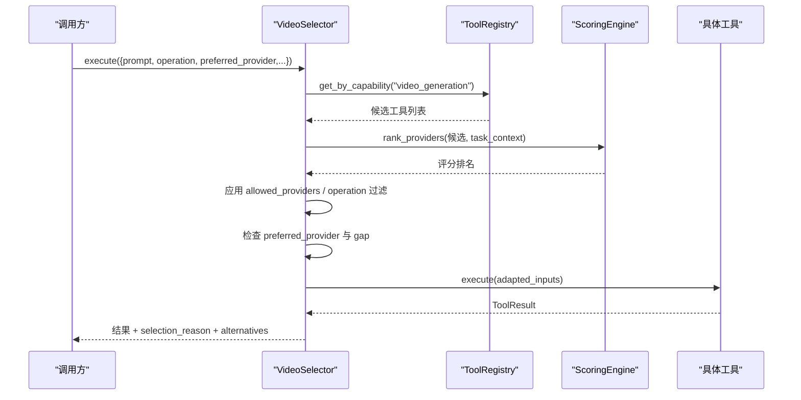
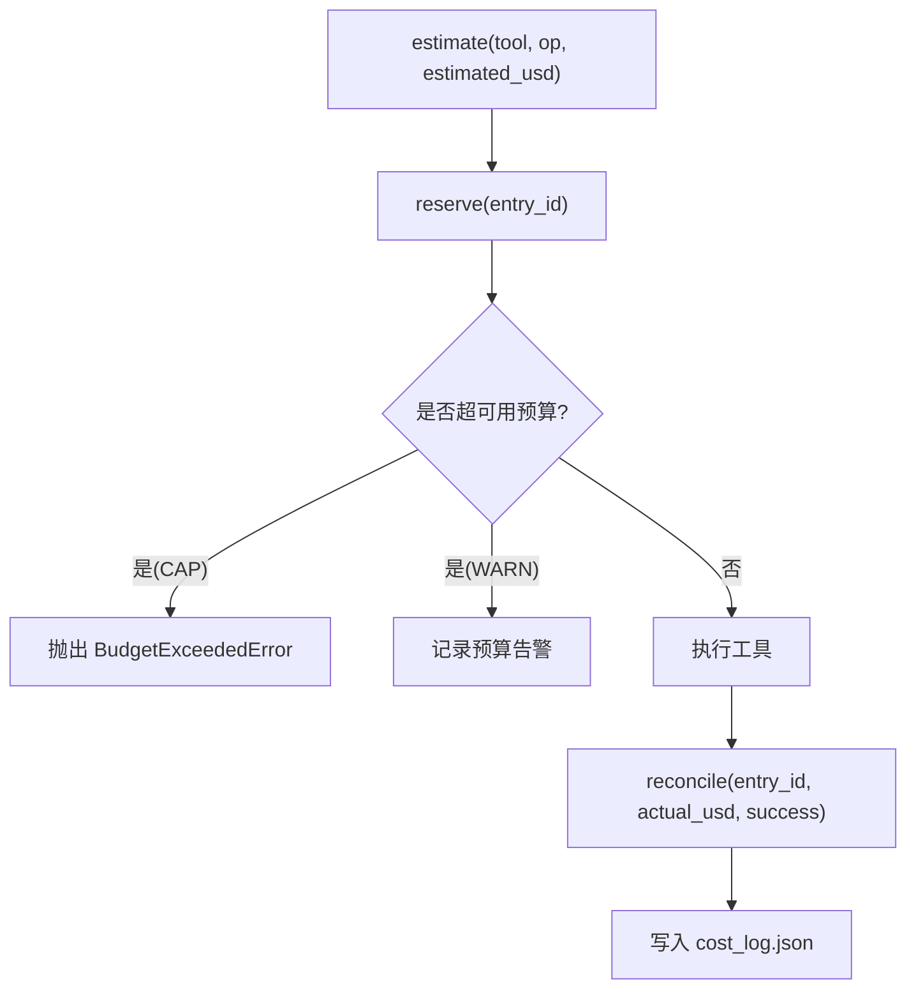
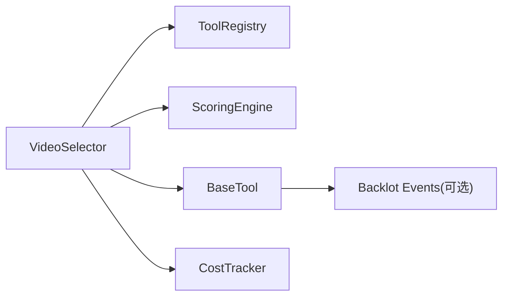

# 适配器架构设计

<cite>
**本文引用的文件**
- [tools/base_tool.py](file://tools/base_tool.py)
- [tools/tool_registry.py](file://tools/tool_registry.py)
- [lib/scoring.py](file://lib/scoring.py)
- [tools/video/video_selector.py](file://tools/video/video_selector.py)
- [tools/cost_tracker.py](file://tools/cost_tracker.py)
- [docs/PROVIDERS.md](file://docs/PROVIDERS.md)
- [.agents/skills/bfl-api/references/error-handling.md](file://.agents/skills/bfl-api/references/error-handling.md)
</cite>

## 目录
1. [简介](#简介)
2. [项目结构](#项目结构)
3. [核心组件](#核心组件)
4. [架构总览](#架构总览)
5. [详细组件分析](#详细组件分析)
6. [依赖关系分析](#依赖关系分析)
7. [性能与成本考量](#性能与成本考量)
8. [故障排查指南](#故障排查指南)
9. [结论](#结论)
10. [附录：新提供商集成指南](#附录新提供商集成指南)

## 简介
本文件系统性阐述 OpenMontage 的“适配器架构”：以统一抽象接口定义、插件化注册发现、多维权重评分选择、以及可观测的成本与资源治理为核心，实现对多种外部提供商（图像、视频、语音、音乐等）的统一接入与动态路由。文档覆盖：
- 统一适配器接口设计与抽象基类
- 工具注册表与动态发现机制
- 提供商选择算法、评分权重与质量评估标准
- 适配器模式实现、插件化架构与动态发现
- 错误处理策略、重试机制与熔断保护建议
- 性能监控、成本追踪与资源管理方案
- 新提供商集成的开发规范、测试与部署流程

## 项目结构
OpenMontage 将“适配器”能力下沉到工具层，通过统一的 BaseTool 抽象、ToolRegistry 注册中心、ScoringEngine 评分引擎、Selector 路由器和 CostTracker 成本治理共同构成可扩展的适配器体系。

图表来源
- [tools/video/video_selector.py:15-366](file://tools/video/video_selector.py#L15-L366)
- [tools/tool_registry.py:55-196](file://tools/tool_registry.py#L55-L196)
- [tools/base_tool.py:227-397](file://tools/base_tool.py#L227-L397)
- [lib/scoring.py:373-542](file://lib/scoring.py#L373-L542)
- [tools/cost_tracker.py:40-179](file://tools/cost_tracker.py#L40-L179)

章节来源
- [tools/video/video_selector.py:1-568](file://tools/video/video_selector.py#L1-L568)
- [tools/tool_registry.py:1-493](file://tools/tool_registry.py#L1-L493)
- [tools/base_tool.py:1-481](file://tools/base_tool.py#L1-L481)
- [lib/scoring.py:1-557](file://lib/scoring.py#L1-L557)
- [tools/cost_tracker.py:1-524](file://tools/cost_tracker.py#L1-L524)

## 核心组件
- 统一适配器接口（BaseTool）
  - 定义工具身份、能力声明、依赖检查、执行契约、成本估算、运行时属性、恢复与幂等、回退工具、遥测提示等。
  - 自动事件埋点：execute 包装注入 Backlot 事件，便于可视化与审计。
- 工具注册表（ToolRegistry）
  - 支持模块扫描与包内动态发现；提供按能力、提供商、状态、稳定性等多维查询；生成支持信封与能力菜单。
- 评分引擎（ScoringEngine）
  - 基于任务上下文对候选工具进行多维度加权评分（任务契合度、输出质量、可控性、可靠性、成本效率、延迟、连续性），并输出可解释排名。
- 能力级路由器（VideoSelector）
  - 自动发现 video_generation 能力工具；根据输入操作类型过滤候选；结合评分与用户偏好进行最终选择；支持自定义工作流路由与降级回退。
- 成本治理（CostTracker）
  - 预估-预留-结算闭环；支持警告/封顶/观察模式；单动作审批与新付费工具审批；持久化成本日志。

章节来源
- [tools/base_tool.py:63-140](file://tools/base_tool.py#L63-L140)
- [tools/base_tool.py:227-397](file://tools/base_tool.py#L227-L397)
- [tools/tool_registry.py:55-196](file://tools/tool_registry.py#L55-L196)
- [lib/scoring.py:21-542](file://lib/scoring.py#L21-L542)
- [tools/video/video_selector.py:15-366](file://tools/video/video_selector.py#L15-L366)
- [tools/cost_tracker.py:40-179](file://tools/cost_tracker.py#L40-L179)

## 架构总览
适配器架构采用“接口抽象 + 插件注册 + 评分路由 + 成本治理”的分层设计：
- 抽象层：BaseTool 定义统一契约，屏蔽各提供商差异。
- 注册层：ToolRegistry 负责动态发现与元数据聚合，提供能力视图。
- 路由层：VideoSelector 作为能力级入口，组合评分与业务约束做决策。
- 治理层：CostTracker 在预执行阶段预估与预留预算，执行后结算，保障成本可控。
- 可观测层：execute 自动埋点，配合 provider_menu_summary 等报告，形成运行期洞察。

图表来源
- [tools/video/video_selector.py:308-366](file://tools/video/video_selector.py#L308-L366)
- [tools/tool_registry.py:118-140](file://tools/tool_registry.py#L118-L140)
- [lib/scoring.py:533-542](file://lib/scoring.py#L533-L542)
- [tools/base_tool.py:148-224](file://tools/base_tool.py#L148-L224)

## 详细组件分析

### 统一适配器接口（BaseTool）
- 职责
  - 定义工具身份（name/version/tier/stability/runtime/determinism）、能力声明（capability/capabilities/supports/best_for/not_good_for）、输入输出与产物 Schema。
  - 依赖检查（cmd/env/python）、状态上报、成本与时长估算、幂等键计算、子进程命令执行封装。
  - 自动事件埋点：execute 被装饰器包裹，记录 start/finish/error 事件，附带 depth、cost_usd、duration_s 等。
- 关键设计点
  - 通过 __init_subclass__ 自动为每个非抽象 execute 注入事件埋点，无需侵入式修改。
  - 提供 dry_run 用于预检（估计成本/时长/状态）。
  - 提供 fallback/fallback_tools 声明，供上层路由降级使用。
  - 暴露 quality_score/historical_success_rate/latency_p50_seconds 等可选指标，供评分引擎优先使用。

图表来源
- [tools/base_tool.py:110-140](file://tools/base_tool.py#L110-L140)
- [tools/base_tool.py:227-397](file://tools/base_tool.py#L227-L397)

章节来源
- [tools/base_tool.py:148-224](file://tools/base_tool.py#L148-L224)
- [tools/base_tool.py:227-397](file://tools/base_tool.py#L227-L397)

### 工具注册表与动态发现（ToolRegistry）
- 职责
  - 维护工具实例字典；支持 register/register_module/discover；按能力/提供商/状态/稳定性查询；生成支持信封与能力菜单；提供 fallback 查找。
- 动态发现
  - discover(package_name) 遍历包下模块，跳过 base_tool/tool_registry，自动实例化所有 BaseTool 子类并注册。
  - ensure_discovered 保证仅发现一次，避免重复导入。
- 能力视图
  - support_envelope/capability_catalog/provider_catalog 提供多维视图；provider_menu/provider_menu_summary 面向用户呈现配置状态与安装提示。
- 资源与网络需求
  - gpu_required_tools/network_required_tools 快速识别需要 GPU 或网络的工具。

图表来源
- [tools/tool_registry.py:118-140](file://tools/tool_registry.py#L118-L140)
- [tools/tool_registry.py:73-84](file://tools/tool_registry.py#L73-L84)

章节来源
- [tools/tool_registry.py:55-196](file://tools/tool_registry.py#L55-L196)
- [tools/tool_registry.py:198-314](file://tools/tool_registry.py#L198-L314)
- [tools/tool_registry.py:316-492](file://tools/tool_registry.py#L316-L492)

### 提供商选择算法与评分权重（ScoringEngine）
- 评分维度与权重
  - ProviderScore.weighted_score = task_fit*0.30 + output_quality*0.20 + control*0.15 + reliability*0.15 + cost_efficiency*0.10 + latency*0.05 + continuity*0.05
- 任务契合度（task_fit）
  - 基于 best_for 与意图/风格关键词的语义重叠（含同义词簇扩展），兼顾风格匹配。
- 输出质量（output_quality）
  - 优先使用工具声明的质量分数，否则按稳定性/层级映射；生产级生成工具略有加分。
- 可控性（control）
  - 依据 supports 中控制能力（如 reference_image/controlnet/style_transfer 等）加权得分。
- 可靠性（reliability）
  - 优先历史成功率；否则按可用性状态与稳定性给出基线。
- 成本效率（cost_efficiency）
  - 结合 estimate_cost 与剩余预算；免费或低成本高奖励，超预算则惩罚。
- 延迟（latency）
  - 优先 p50 实测值分档；否则按 runtime 类别启发式打分。
- 连续性（continuity）
  - 若与已锁定提供商一致，给予更高连续性得分。
- 特殊场景调整
  - 运动需求、参考条件、图像编辑、电影感/高级特性等场景触发额外加分或惩罚。
- 排名与解释
  - rank_providers 返回按加权分数降序排列；format_ranking/explain 提供可读解释。

图表来源
- [lib/scoring.py:205-232](file://lib/scoring.py#L205-L232)
- [lib/scoring.py:234-295](file://lib/scoring.py#L234-L295)
- [lib/scoring.py:297-359](file://lib/scoring.py#L297-L359)
- [lib/scoring.py:373-530](file://lib/scoring.py#L373-L530)
- [lib/scoring.py:533-542](file://lib/scoring.py#L533-L542)

章节来源
- [lib/scoring.py:21-542](file://lib/scoring.py#L21-L542)

### 能力级路由器（VideoSelector）
- 职责
  - 自动发现 video_generation 能力工具；根据 operation 过滤候选；结合评分与用户偏好选择最佳提供商；适配输入键（prompt/query）；上传参考图；返回选择原因与备选信息。
- 偏好与阈值
  - preferred_provider 仅在评分差距小于 preferred_provider_gap 时生效，避免显著劣化体验。
- 自定义工作流
  - 当传入 workflow_json/workflow_path 且具备 custom_workflow 支持与可达后端时，直接路由至对应提供商。
- 降级策略
  - fallback_tools_for 针对 motion-required 操作排除 image_selector，避免静默降级破坏需求。

图表来源
- [tools/video/video_selector.py:248-366](file://tools/video/video_selector.py#L248-L366)
- [tools/video/video_selector.py:368-440](file://tools/video/video_selector.py#L368-L440)
- [tools/video/video_selector.py:484-568](file://tools/video/video_selector.py#L484-L568)

章节来源
- [tools/video/video_selector.py:15-568](file://tools/video/video_selector.py#L15-L568)

### 成本治理与资源管理（CostTracker）
- 职责
  - 预估（estimate）→ 预留（reserve）→ 结算（reconcile）→ 退款（refund）；支持 WARN/CAP/OBSERVE 模式；单动作审批与新付费工具审批；持久化成本日志。
- 预算计算
  - usable_budget_usd = remaining - reserve_pct * total；预留超预算在 CAP 模式下抛出异常，WARN 模式记录告警。
- 参考驱动估算
  - estimate_from_reference 基于视频分析简报与目标时长，按场景数、运动比例、TTS 字数、重试缓冲等生成明细与置信度。

图表来源
- [tools/cost_tracker.py:101-179](file://tools/cost_tracker.py#L101-L179)
- [tools/cost_tracker.py:183-398](file://tools/cost_tracker.py#L183-L398)

章节来源
- [tools/cost_tracker.py:40-179](file://tools/cost_tracker.py#L40-L179)
- [tools/cost_tracker.py:183-398](file://tools/cost_tracker.py#L183-L398)

## 依赖关系分析
- 耦合与内聚
  - VideoSelector 强依赖 ToolRegistry 与 ScoringEngine，但通过接口解耦具体提供商实现；BaseTool 提供稳定契约，增强内聚。
- 直接依赖
  - VideoSelector → ToolRegistry.get_by_capability / ensure_discovered
  - VideoSelector → ScoringEngine.rank_providers / normalize_task_context
  - BaseTool.execute 自动注入事件埋点（lib.events 可选）
- 间接依赖
  - ToolRegistry 通过 pkgutil/importlib 动态加载 tools 包下模块
  - CostTracker 依赖 lib.config_model.BudgetMode 与 JSON 持久化
- 潜在循环
  - 未发现显式循环依赖；模块间通过明确入口函数交互。

图表来源
- [tools/video/video_selector.py:248-366](file://tools/video/video_selector.py#L248-L366)
- [tools/tool_registry.py:118-140](file://tools/tool_registry.py#L118-L140)
- [lib/scoring.py:533-542](file://lib/scoring.py#L533-L542)
- [tools/base_tool.py:148-224](file://tools/base_tool.py#L148-L224)
- [tools/cost_tracker.py:101-179](file://tools/cost_tracker.py#L101-L179)

章节来源
- [tools/video/video_selector.py:248-366](file://tools/video/video_selector.py#L248-L366)
- [tools/tool_registry.py:118-140](file://tools/tool_registry.py#L118-L140)
- [lib/scoring.py:533-542](file://lib/scoring.py#L533-L542)
- [tools/base_tool.py:148-224](file://tools/base_tool.py#L148-L224)
- [tools/cost_tracker.py:101-179](file://tools/cost_tracker.py#L101-L179)

## 性能与成本考量
- 性能
  - 动态发现仅在首次 ensure_discovered 时执行，后续查询复用内存缓存。
  - 评分引擎对候选工具批量计算加权分数，时间复杂度 O(N)，N 为候选数量。
  - execute 事件埋点为非致命路径，不影响主流程性能。
- 成本
  - 预估-预留-结算闭环确保预算可控；CAP 模式阻止超支，WARN 模式记录告警。
  - 参考驱动估算提供明细与置信度，辅助规划与审批。
- 资源
  - ToolRegistry 提供 gpu_required_tools/network_required_tools 快速识别资源需求。
  - BaseTool.resource_profile 声明 CPU/RAM/VRAM/Disk/Network，支撑调度与容量规划。

[本节为通用指导，不直接分析具体文件]

## 故障排查指南
- 依赖缺失
  - check_dependencies 会检测 cmd/binary/env/python 依赖，缺失时抛出 DependencyError；可通过 provider_menu_summary 查看安装提示。
- 工具不可用
  - get_status 返回 UNAVAILABLE/DEGRADED/AVAILABLE；selector 会过滤不可用工具，必要时走 fallback。
- 成本超支
  - CAP 模式下 reserve 抛出 BudgetExceededError；WARN 模式记录预算告警；可使用 approve_tool 放行新付费工具。
- 重试与熔断（建议）
  - 可在工具层实现 RetryPolicy 与指数退避；对外部 API 调用建议引入熔断器（closed/open/half-open）防止雪崩。
  - 参考技能中的重试与熔断示例，结合 provider 的错误码分类决定重试策略。

章节来源
- [tools/base_tool.py:304-327](file://tools/base_tool.py#L304-L327)
- [tools/tool_registry.py:316-471](file://tools/tool_registry.py#L316-L471)
- [tools/cost_tracker.py:117-179](file://tools/cost_tracker.py#L117-L179)
- [.agents/skills/bfl-api/references/error-handling.md:148-335](file://.agents/skills/bfl-api/references/error-handling.md#L148-L335)

## 结论
OpenMontage 的适配器架构通过统一接口、动态注册、评分路由与成本治理，实现了多提供商能力的松耦合接入与智能选择。该设计具备良好的可维护性与扩展性：新增提供商只需实现 BaseTool 并声明能力/依赖/Schema，即可被自动发现与参与评分选择；同时借助成本治理与可观测埋点，保障生产环境的稳定性与经济性。

[本节为总结性内容，不直接分析具体文件]

## 附录：新提供商集成指南

### 接口规范
- 继承 BaseTool，设置必要元数据：
  - name/version/tier/stability/runtime/determinism
  - capability/capabilities/supports/best_for/not_good_for
  - input_schema/output_schema/artifact_schema
  - dependencies/install_instructions/resource_profile/retry_policy
  - fallback/fallback_tools（可选）
- 实现 execute(inputs) -> ToolResult，并在 estimate_cost/estimate_runtime 中提供成本与时长的合理估算。
- 如需评分优化，可声明 quality_score/historical_success_rate/latency_p50_seconds。

章节来源
- [tools/base_tool.py:227-397](file://tools/base_tool.py#L227-L397)

### 动态发现与注册
- 将工具文件放入 tools 包下任意模块（避免 base_tool/tool_registry），ToolRegistry.discover 会自动扫描并注册。
- 可通过 ToolRegistry.register_module 手动注册特定模块。

章节来源
- [tools/tool_registry.py:73-84](file://tools/tool_registry.py#L73-L84)
- [tools/tool_registry.py:118-140](file://tools/tool_registry.py#L118-L140)

### 测试用例
- 单元测试要点
  - 依赖检查：模拟缺失依赖，验证 get_status 为 UNAVAILABLE。
  - 执行契约：execute 返回 ToolResult.success=True，包含必要字段。
  - 成本治理：CostTracker.estimate/reserve/reconcile 流程正确，CAP/WARN 模式行为符合预期。
  - 评分与选择：VideoSelector 能正确过滤候选并按评分选择；preferred_provider 与 gap 逻辑有效。
- 参考现有测试结构与断言方式，覆盖边界情况（空输入、不支持的操作、网络失败等）。

章节来源
- [tests/contracts/test_phase0_contracts.py:407-475](file://tests/contracts/test_phase0_contracts.py#L407-L475)
- [tests/tools/test_cost_tracker_governance.py:1-60](file://tests/tools/test_cost_tracker_governance.py#L1-L60)

### 部署流程
- 环境准备
  - 在 .env 中配置所需 API Key（参考 PROVIDERS.md 的环境变量清单）。
  - 本地工具需满足二进制/Python 模块依赖。
- 启用与验证
  - 启动系统后，调用 ToolRegistry.provider_menu_summary 查看能力菜单与安装提示。
  - 通过 VideoSelector.execute(operation="rank") 获取评分排名与解释，验证选择合理性。
- 成本治理
  - 配置 CostTracker 的预算与模式（WARN/CAP/OBSERVE），对新付费工具进行审批。
  - 执行后核对 cost_log.json 的条目与结算金额。

章节来源
- [docs/PROVIDERS.md:29-81](file://docs/PROVIDERS.md#L29-L81)
- [tools/tool_registry.py:316-471](file://tools/tool_registry.py#L316-L471)
- [tools/cost_tracker.py:40-179](file://tools/cost_tracker.py#L40-L179)