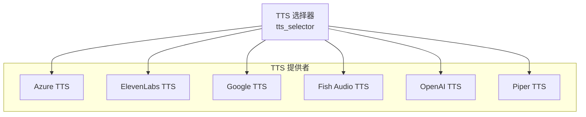
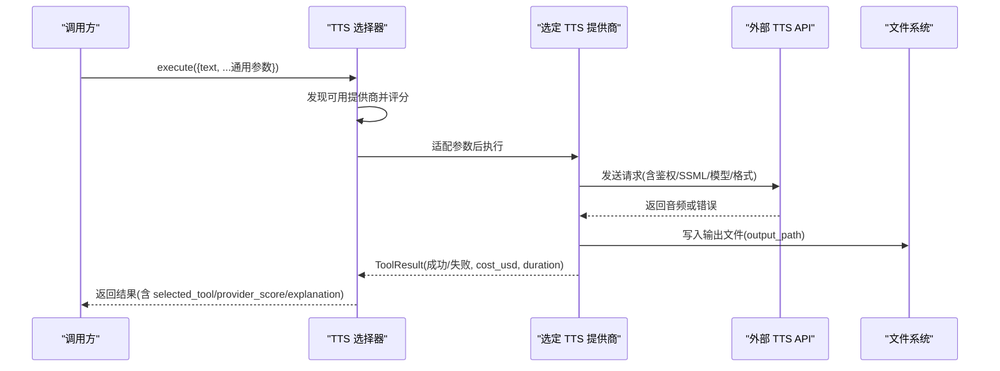
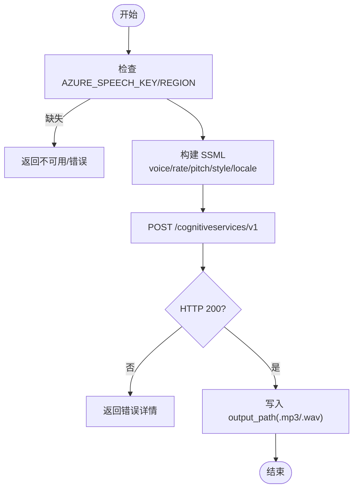
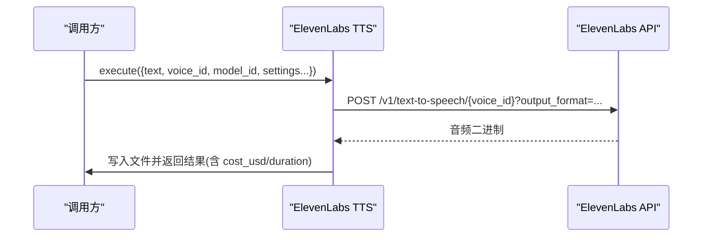
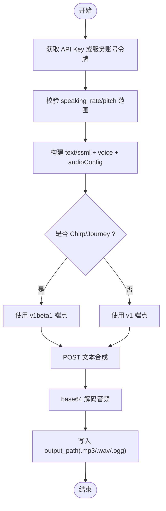
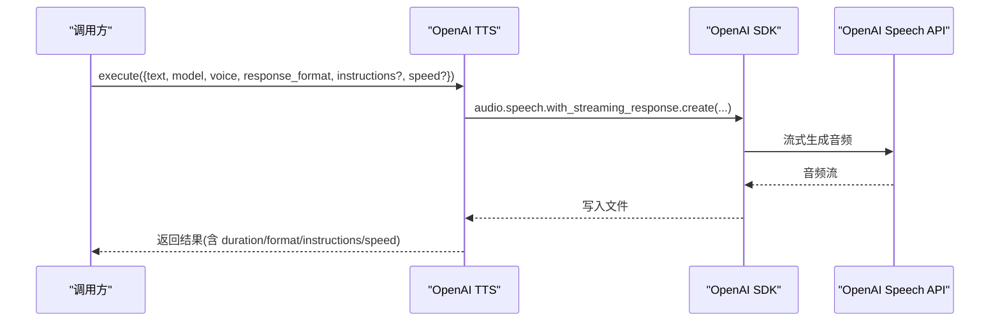
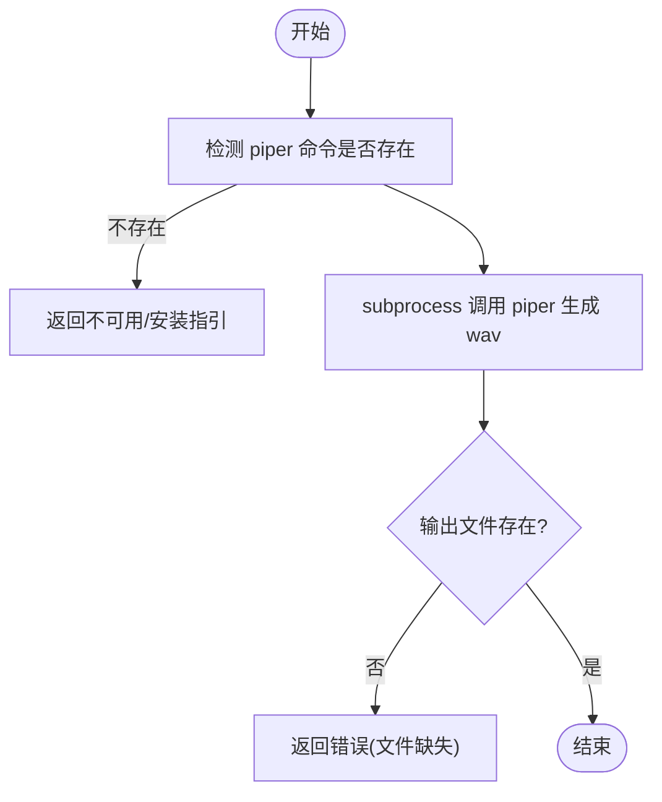
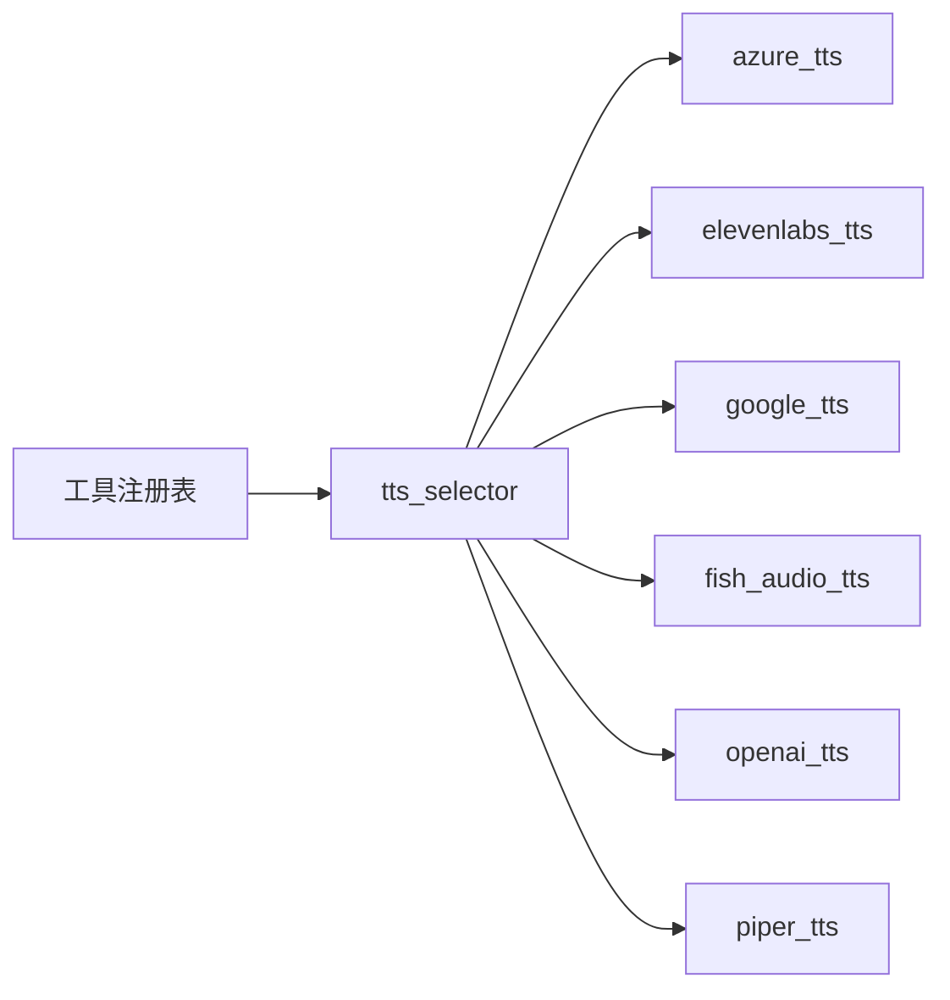

# 语音合成适配器

<cite>
**本文引用的文件**
- [tools/audio/azure_tts.py](file://tools/audio/azure_tts.py)
- [tools/audio/elevenlabs_tts.py](file://tools/audio/elevenlabs_tts.py)
- [tools/audio/google_tts.py](file://tools/audio/google_tts.py)
- [tools/audio/fish_audio_tts.py](file://tools/audio/fish_audio_tts.py)
- [tools/audio/openai_tts.py](file://tools/audio/openai_tts.py)
- [tools/audio/piper_tts.py](file://tools/audio/piper_tts.py)
- [tools/audio/tts_selector.py](file://tools/audio/tts_selector.py)
- [.agents/skills/azure-text-to-speech/SKILL.md](file://.agents/skills/azure-text-to-speech/SKILL.md)
- [.agents/skills/elevenlabs/SKILL.md](file://.agents/skills/elevenlabs/SKILL.md)
- [.agents/skills/fish-audio-tts/SKILL.md](file://.agents/skills/fish-audio-tts/SKILL.md)
- [.agents/skills/text-to-speech/SKILL.md](file://.agents/skills/text-to-speech/SKILL.md)
</cite>

## 目录
1. [简介](#简介)
2. [项目结构](#项目结构)
3. [核心组件](#核心组件)
4. [架构总览](#架构总览)
5. [详细组件分析](#详细组件分析)
6. [依赖关系分析](#依赖关系分析)
7. [性能与成本](#性能与成本)
8. [故障排除指南](#故障排除指南)
9. [结论](#结论)
10. [附录：API调用示例与最佳实践](#附录api调用示例与最佳实践)

## 简介
本文件为 OpenMontage 的“语音合成适配器”提供系统化文档，覆盖 Azure TTS、ElevenLabs、Google TTS、Fish Audio、OpenAI TTS、Piper 等提供商的技术特点、配置方法、参数调优、音频格式与采样率、多语言本地化、实时流式处理、批量处理策略、成本结构与适用场景，并给出统一接口设计与故障排除建议。目标是确保在多提供商环境下获得一致、高效且可维护的语音合成能力。

## 项目结构
- 各 TTS 提供商以独立的工具类实现，均继承统一的 BaseTool，暴露一致的输入/输出模式与元数据（如 capabilities、supports、best_for、fallback 等）。
- tts_selector 作为能力级选择器，自动发现所有 capability="tts" 的工具，按任务上下文进行评分与路由，并将通用参数适配到各提供商原生参数。
- 技能文档（SKILL.md）提供使用指南、参数说明、成本与限制、工作流建议等。



图表来源
- [tools/audio/tts_selector.py:15-33](file://tools/audio/tts_selector.py#L15-L33)
- [tools/audio/azure_tts.py:42-81](file://tools/audio/azure_tts.py#L42-L81)
- [tools/audio/elevenlabs_tts.py:24-67](file://tools/audio/elevenlabs_tts.py#L24-L67)
- [tools/audio/google_tts.py:33-78](file://tools/audio/google_tts.py#L33-L78)
- [tools/audio/fish_audio_tts.py:31-74](file://tools/audio/fish_audio_tts.py#L31-L74)
- [tools/audio/openai_tts.py:24-65](file://tools/audio/openai_tts.py#L24-L65)
- [tools/audio/piper_tts.py:25-63](file://tools/audio/piper_tts.py#L25-L63)

章节来源
- [tools/audio/tts_selector.py:15-33](file://tools/audio/tts_selector.py#L15-L33)

## 核心组件
- 统一工具基类与元数据：每个 TTS 工具声明名称、版本、能力、支持特性、回退链、资源需求、重试策略、幂等键字段、副作用与用户可见验证项，便于系统级编排与审计。
- 选择器：自动发现可用提供商，基于任务上下文评分，将通用参数（如 speed、pitch、style、input_type、language_code 等）映射到各提供商原生参数，并返回所选工具及评分解释。
- 提供商工具：各自封装认证、请求构造、错误处理、成本估算、输出路径写入与结果封装。

章节来源
- [tools/audio/tts_selector.py:157-324](file://tools/audio/tts_selector.py#L157-L324)
- [tools/audio/azure_tts.py:42-175](file://tools/audio/azure_tts.py#L42-L175)
- [tools/audio/elevenlabs_tts.py:24-135](file://tools/audio/elevenlabs_tts.py#L24-L135)
- [tools/audio/google_tts.py:33-140](file://tools/audio/google_tts.py#L33-L140)
- [tools/audio/fish_audio_tts.py:31-218](file://tools/audio/fish_audio_tts.py#L31-L218)
- [tools/audio/openai_tts.py:24-115](file://tools/audio/openai_tts.py#L24-L115)
- [tools/audio/piper_tts.py:25-96](file://tools/audio/piper_tts.py#L25-L96)

## 架构总览
下图展示了从上层调用到具体提供商的完整流程，包括选择器评分、参数适配、网络请求与结果落盘。



图表来源
- [tools/audio/tts_selector.py:190-225](file://tools/audio/tts_selector.py#L190-L225)
- [tools/audio/azure_tts.py:221-287](file://tools/audio/azure_tts.py#L221-L287)
- [tools/audio/elevenlabs_tts.py:147-212](file://tools/audio/elevenlabs_tts.py#L147-L212)
- [tools/audio/google_tts.py:189-312](file://tools/audio/google_tts.py#L189-L312)
- [tools/audio/fish_audio_tts.py:301-398](file://tools/audio/fish_audio_tts.py#L301-L398)
- [tools/audio/openai_tts.py:129-197](file://tools/audio/openai_tts.py#L129-L197)
- [tools/audio/piper_tts.py:106-155](file://tools/audio/piper_tts.py#L106-L155)

## 详细组件分析

### Azure TTS
- 技术特点
  - 通过 REST v1 端点同步生成，支持 SSML 与 express-as 风格控制；适合高质量旁白与多语言。
  - 确定性高（固定 voice + SSML 可复现），适合分段再生成。
- 配置与鉴权
  - 环境变量：AZURE_SPEECH_KEY、AZURE_SPEECH_REGION（或 AZURE_TTS_ENDPOINT）。
- 关键参数
  - voice（支持别名）、rate/pitch（SSML prosody）、style（express-as）、locale（BCP-47）、output_format（mp3/wav）。
- 音频格式与采样率
  - mp3：48kHz/192kbps；wav：48kHz/16bit PCM。
- 成本估算
  - 约 $16/百万字符（Standard 层）。
- 适用场景
  - 需要高质量、可控表达、与 STT 共用同一 Speech 资源的场景。



图表来源
- [tools/audio/azure_tts.py:176-287](file://tools/audio/azure_tts.py#L176-L287)

章节来源
- [tools/audio/azure_tts.py:42-175](file://tools/audio/azure_tts.py#L42-L175)
- [.agents/skills/azure-text-to-speech/SKILL.md:23-111](file://.agents/skills/azure-text-to-speech/SKILL.md#L23-L111)

### ElevenLabs TTS
- 技术特点
  - 支持声音克隆、多语言、发音控制；模型可选（multilingual_v2、flash/turbo、v3 等）。
  - 非确定性（随机性较高），适合创意表达。
- 配置与鉴权
  - 环境变量：ELEVENLABS_API_KEY。
- 关键参数
  - voice_id、model_id、stability/similarity_boost/style/speed、use_speaker_boost、output_format。
- 音频格式
  - mp3_44100_128/192、pcm_16000、pcm_24000。
- 成本估算
  - 按文本长度估算（工具内定义费率）。
- 适用场景
  - 高质量旁白、发言人视频、多语种播报；需声音克隆时优先。



图表来源
- [tools/audio/elevenlabs_tts.py:147-212](file://tools/audio/elevenlabs_tts.py#L147-L212)

章节来源
- [tools/audio/elevenlabs_tts.py:24-135](file://tools/audio/elevenlabs_tts.py#L24-L135)
- [.agents/skills/elevenlabs/SKILL.md:25-119](file://.agents/skills/elevenlabs/SKILL.md#L25-L119)

### Google TTS
- 技术特点
  - 700+ 声音、50+ 语言；支持 Standard/WaveNet/Neural2/Studio/Journey/Chirp3-HD 等；支持 SSML。
  - 可选择 v1 或 v1beta1 端点（Chirp/Journey 需要 beta）。
- 配置与鉴权
  - 方式A：GOOGLE_TTS_API_KEY/GOOGLE_API_KEY/GEMINI_API_KEY；方式B：服务账号 JSON（GOOGLE_APPLICATION_CREDENTIALS）。
- 关键参数
  - input_type（text/ssml）、voice、language_code、speaking_rate、pitch、audio_encoding。
- 音频格式
  - MP3、LINEAR16(wav)、OGG_OPUS、MULAW、ALAW。
- 成本估算
  - 按不同声音类型定价（Chirp3-HD/Studio/Neural2/Journey/WaveNet/Standard）。
- 适用场景
  - 大规模本地化、高性价比高质量 TTS、与 Google 生态集成。



图表来源
- [tools/audio/google_tts.py:151-312](file://tools/audio/google_tts.py#L151-L312)

章节来源
- [tools/audio/google_tts.py:33-140](file://tools/audio/google_tts.py#L33-L140)

### Fish Audio TTS
- 技术特点
  - 支持 S1/S2 系列模型；支持参考音克隆（reference_id）；S2 模型支持内联情感标签；多语言。
  - 计费按 UTF-8 字节数；免费额度有期限与限制。
- 配置与鉴权
  - 环境变量：FISH_AUDIO_API_KEY。
- 关键参数
  - model（必需）、reference_id/voice_id、format/mp3_bitrate、chunk_length、normalize、latency、temperature/top_p/repetition_penalty、sample_rate、prosody。
- 音频格式
  - mp3/wav/pcm/opus。
- 成本估算
  - 按模型与当前促销期动态估算。
- 适用场景
  - 高表现力旁白、情感标注朗读、多语言克隆。

```mermaid
sequenceDiagram
participant U as "调用方"
participant FA as "Fish Audio TTS"
participant API as "fish.audio API"
U->>FA : execute({text, model, reference_id, format, ...})
FA->>API : POST /v1/tts (Header : model; Body : text/format/...)
API-->>FA : 音频二进制
FA->>U : 写入文件并返回结果(含 cost_usd/model/reference_id)
```

图表来源
- [tools/audio/fish_audio_tts.py:301-398](file://tools/audio/fish_audio_tts.py#L301-L398)

章节来源
- [tools/audio/fish_audio_tts.py:31-218](file://tools/audio/fish_audio_tts.py#L31-L218)
- [.agents/skills/fish-audio-tts/SKILL.md:1-108](file://.agents/skills/fish-audio-tts/SKILL.md#L1-L108)

### OpenAI TTS
- 技术特点
  - 简单稳定的云端 TTS；支持 gpt-4o-mini-tts 的 instructions 指令；流式响应写入文件。
- 配置与鉴权
  - 环境变量：OPENAI_API_KEY。
- 关键参数
  - voice、model、response_format（兼容 alias format）、instructions、speed。
- 音频格式
  - mp3/opus/aac/flac/wav/pcm。
- 成本估算
  - 按文本长度估算。
- 适用场景
  - 通用旁白、当其他提供商不可用时的稳定备选。



图表来源
- [tools/audio/openai_tts.py:129-197](file://tools/audio/openai_tts.py#L129-L197)

章节来源
- [tools/audio/openai_tts.py:24-115](file://tools/audio/openai_tts.py#L24-L115)

### Piper TTS（本地离线）
- 技术特点
  - 完全离线运行；确定性高；无需网络；适合隐私敏感与无网环境。
- 配置与安装
  - 安装 piper-tts 或下载二进制；下载语音模型（如 en_US-lessac-medium）。
- 关键参数
  - model、speaker_id、length_scale、sentence_silence。
- 音频格式
  - wav。
- 成本估算
  - 0（本地推理）。
- 适用场景
  - 离线旁白、隐私优先、低成本批处理。



图表来源
- [tools/audio/piper_tts.py:98-155](file://tools/audio/piper_tts.py#L98-L155)

章节来源
- [tools/audio/piper_tts.py:25-96](file://tools/audio/piper_tts.py#L25-L96)

## 依赖关系分析
- 选择器依赖工具注册表发现所有 capability="tts" 的工具，并按任务上下文评分选择最优提供商。
- 各提供商工具之间相互独立，仅通过统一接口与选择器交互。
- 部分提供商依赖外部库（requests、openai、google-auth 等）与网络访问；Piper 依赖本地命令。



图表来源
- [tools/audio/tts_selector.py:157-176](file://tools/audio/tts_selector.py#L157-L176)

章节来源
- [tools/audio/tts_selector.py:157-176](file://tools/audio/tts_selector.py#L157-L176)

## 性能与成本
- 性能特征
  - Azure/Google/Fish/OpenAI/ElevenLabs：网络延迟为主，通常满足实时/近实时需求；OpenAI 支持流式写入，降低首包延迟。
  - Piper：本地推理，延迟取决于 CPU 与模型大小；无网络开销。
- 成本结构
  - Azure：约 $16/百万字符（Standard）。
  - Google：按声音类型定价（Chirp3-HD/Studio/Neural2/Journey/WaveNet/Standard）。
  - Fish Audio：按 UTF-8 字节计费；免费额度有时限与限制。
  - OpenAI/ElevenLabs：按文本长度估算（工具内定义费率）。
  - Piper：本地免费。
- 优化建议
  - 合理分段：每段控制在几十秒以内，便于重试与对齐场景时长。
  - 选择合适的输出格式：交付用 mp3（48kHz/192k 或 44.1kHz/128k+），混音前用 wav（48kHz PCM）。
  - 利用选择器的 preferred_provider/allowed_providers 做灰度与回退。
  - 对高价值段落先抽样试听，再批量生成。

[本节为通用指导，不直接分析具体文件]

## 故障排除指南
- 认证与环境变量
  - Azure：缺少 AZURE_SPEECH_KEY/REGION 或自定义端点。
  - ElevenLabs：缺少 ELEVENLABS_API_KEY。
  - Google：未设置 API Key 或未配置服务账号。
  - Fish Audio：缺少 FISH_AUDIO_API_KEY 或 reference_id 无效。
  - OpenAI：缺少 OPENAI_API_KEY。
  - Piper：未安装 piper 命令或模型缺失。
- 常见错误
  - HTTP 状态码非 200：检查鉴权、配额、速率限制与网络。
  - 参数越界：Google speaking_rate 需在 0.25-2.0，pitch 在 -20..20；ElevenLabs 数值范围遵循 schema。
  - 输出文件缺失：Piper 子进程返回码非 0 或输出路径权限问题。
- 调试技巧
  - 启用日志并屏蔽敏感信息（工具已对 key/token 做脱敏）。
  - 使用选择器的 operation=rank 查看候选提供商评分与原因。
  - 小样本先行：生成短片段验证音色、语速、停顿与情感。

章节来源
- [tools/audio/azure_tts.py:176-287](file://tools/audio/azure_tts.py#L176-L287)
- [tools/audio/elevenlabs_tts.py:139-212](file://tools/audio/elevenlabs_tts.py#L139-L212)
- [tools/audio/google_tts.py:151-312](file://tools/audio/google_tts.py#L151-L312)
- [tools/audio/fish_audio_tts.py:284-398](file://tools/audio/fish_audio_tts.py#L284-L398)
- [tools/audio/openai_tts.py:117-197](file://tools/audio/openai_tts.py#L117-L197)
- [tools/audio/piper_tts.py:98-155](file://tools/audio/piper_tts.py#L98-L155)

## 结论
OpenMontage 的语音合成适配器通过统一抽象与智能选择器，将多种 TTS 提供商无缝整合，既保证了质量与灵活性，又兼顾了成本与可用性。推荐在生产环境中结合业务需求选择合适提供商：追求高质量与可控表达选 Azure/Google；需要声音克隆与高表现力选 ElevenLabs/Fish Audio；需要稳定备选与流式体验选 OpenAI；离线与隐私优先选 Piper。配合合理的分段、格式与参数调优，可实现高效、稳定、可扩展的语音合成流水线。

[本节为总结性内容，不直接分析具体文件]

## 附录：API调用示例与最佳实践

- 统一入口
  - 通过 tts_selector.execute 传入通用参数（text、preferred_provider、allowed_providers、speed/pitch/input_type/language_code 等），由选择器自动适配到具体提供商。
  - 若需直连某提供商，可直接调用对应工具类 execute。

- 文本转语音（通用思路）
  - 准备文本与目标语言/音色；必要时开启 SSML 或情感标签；指定输出路径与格式；执行后检查 result.success/cost_usd/output。

- SSML 与停顿
  - Azure：通过 rate/pitch/style 与内置 express-as 控制；不要预转义文本。
  - Google：input_type=ssml，使用 <speak>/<break> 等标签；注意 Chirp/Journey 走 v1beta1。
  - ElevenLabs：flash/turbo 支持 <break>/<phoneme>；multilingual_v2/v3 不支持 SSML，可用段落换行或后期插入静音。

- 语音参数调节
  - 速度：Azure 用 rate（百分比），Google 用 speaking_rate，ElevenLabs 用 speed，OpenAI 用 speed，Fish Audio 用 prosody.speed。
  - 音调：Azure 用 pitch（st 或 %），Google 用 pitch（半音），ElevenLabs 用 stability/similarity_boost/style 组合影响听感。
  - 风格/情感：Azure 用 style（如 calm/newscast），Fish Audio 用内联情感标签（S2 模型）。

- 音频格式与采样率
  - 交付：mp3（48kHz/192k 或 44.1kHz/128k+）。
  - 混音/后期：wav（48kHz PCM）。
  - 其他：Google 支持 OGG_OPUS/MULAW/ALAW；OpenAI 支持 opus/aac/flac/wav/pcm；Fish Audio 支持 pcm/opus。

- 多语言本地化
  - 设置 language_code/locale 与对应 voice；Google/Azure/Fish Audio 对多语言支持良好；ElevenLabs multilingual_v2 适合多语种。

- 实时流式处理
  - OpenAI 使用 with_streaming_response 流式写入文件，降低首包延迟。
  - 其他提供商多为同步返回；可通过分段与并行提升吞吐。

- 批量处理最佳实践
  - 分段生成：按脚本段落切分，便于重试与对齐场景。
  - 优先级与回退：设置 preferred_provider 与 allowed_providers；失败自动回退。
  - 成本与质量权衡：先用低费模型/免费额度做样片，确认后再批量生产。

- 成本与性能调优
  - 根据文本长度预估成本（各工具 estimate_cost）；关注计费单位（字符 vs 字节）。
  - 合理选择模型与格式；避免不必要的重编码。
  - 并发与超时：根据网络与供应商限制调整并发与超时时间。

章节来源
- [tools/audio/tts_selector.py:39-155](file://tools/audio/tts_selector.py#L39-L155)
- [.agents/skills/azure-text-to-speech/SKILL.md:41-111](file://.agents/skills/azure-text-to-speech/SKILL.md#L41-L111)
- [.agents/skills/elevenlabs/SKILL.md:48-98](file://.agents/skills/elevenlabs/SKILL.md#L48-L98)
- [.agents/skills/fish-audio-tts/SKILL.md:24-96](file://.agents/skills/fish-audio-tts/SKILL.md#L24-L96)
- [.agents/skills/text-to-speech/SKILL.md:36-386](file://.agents/skills/text-to-speech/SKILL.md#L36-L386)