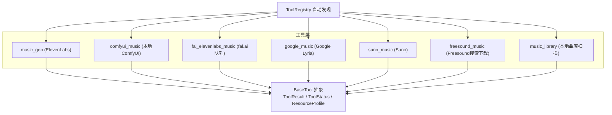
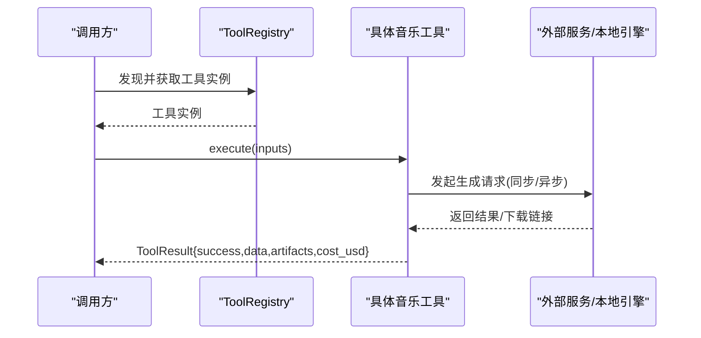
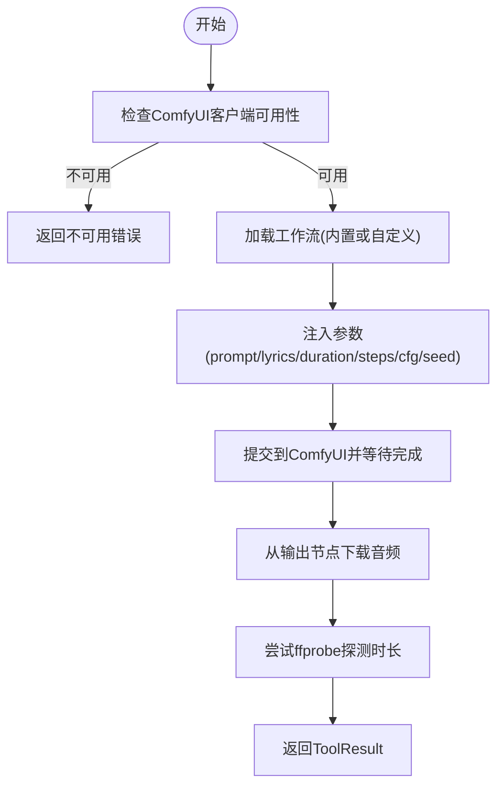
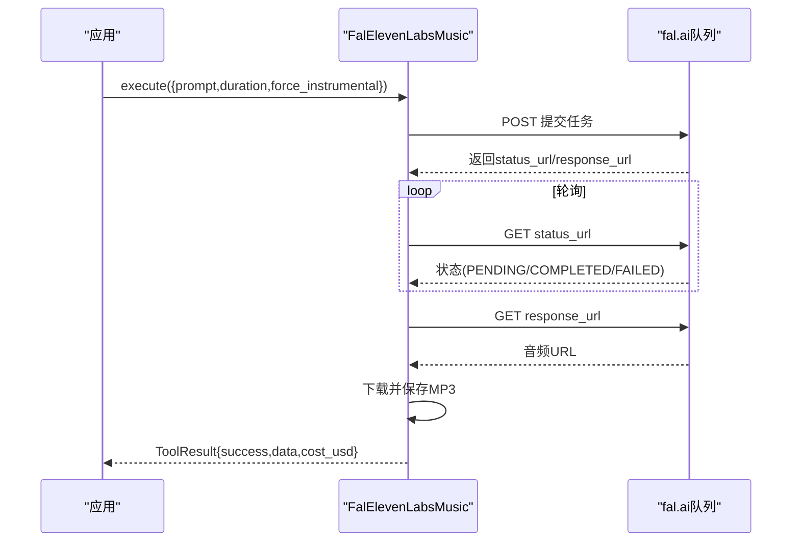
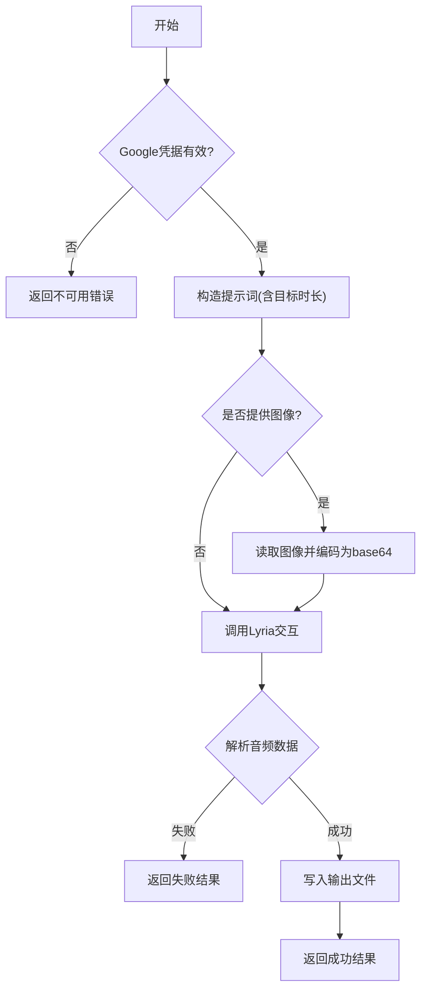
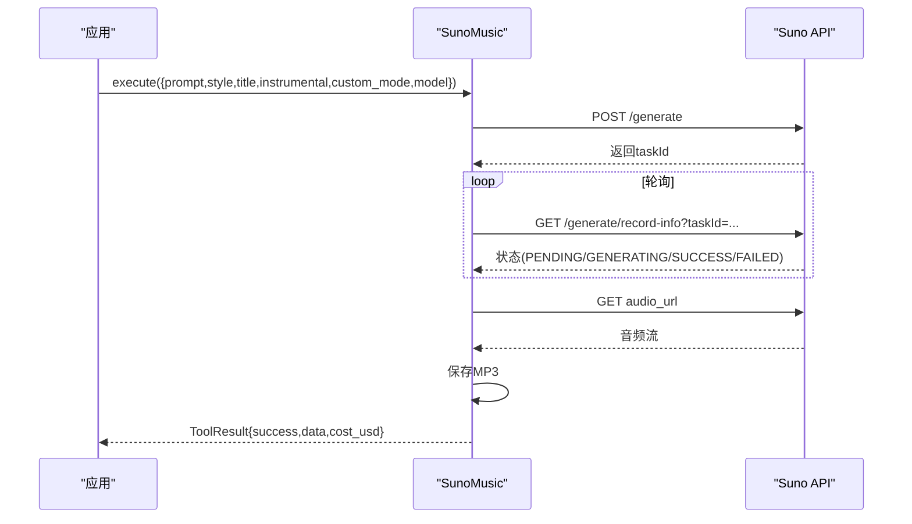
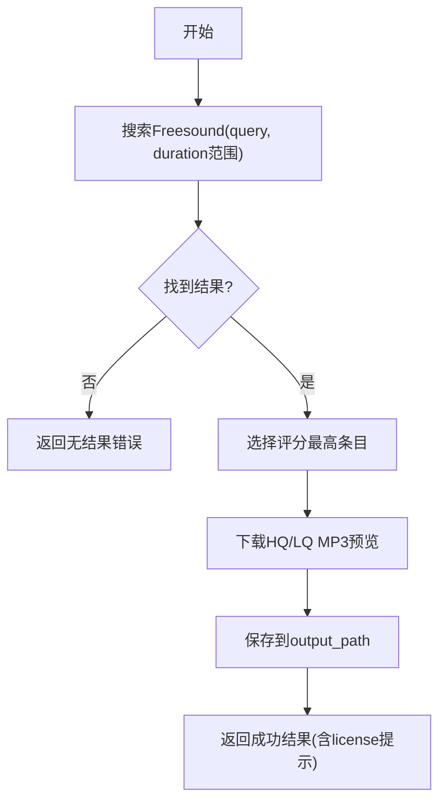
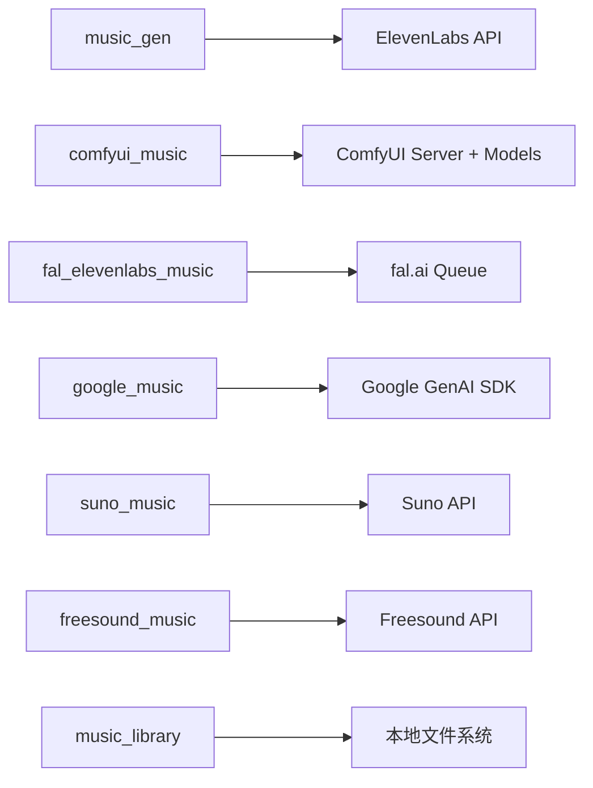

# 音乐生成适配器

<cite>
**本文引用的文件**
- [tools/audio/music_gen.py](file://tools/audio/music_gen.py)
- [tools/audio/comfyui_music.py](file://tools/audio/comfyui_music.py)
- [tools/audio/fal_elevenlabs_music.py](file://tools/audio/fal_elevenlabs_music.py)
- [tools/audio/google_music.py](file://tools/audio/google_music.py)
- [tools/audio/suno_music.py](file://tools/audio/suno_music.py)
- [tools/audio/freesound_music.py](file://tools/audio/freesound_music.py)
- [tools/audio/music_library.py](file://tools/audio/music_library.py)
- [skills/creative/music-gen-usage.md](file://skills/creative/music-gen-usage.md)
- [tests/tools/test_fal_elevenlabs_music.py](file://tests/tools/test_fal_elevenlabs_music.py)
- [tests/tools/test_music_gen_force_instrumental.py](file://tests/tools/test_music_gen_force_instrumental.py)
</cite>

## 目录
1. [简介](#简介)
2. [项目结构](#项目结构)
3. [核心组件](#核心组件)
4. [架构总览](#架构总览)
5. [详细组件分析](#详细组件分析)
6. [依赖关系分析](#依赖关系分析)
7. [性能与质量](#性能与质量)
8. [故障排查指南](#故障排查指南)
9. [结论](#结论)
10. [附录：API调用示例与最佳实践](#附录api调用示例与最佳实践)

## 简介
本文件面向“音乐生成适配器”的统一能力，覆盖 ComfyUI Music、Fal.ai ElevenLabs Music、Google Lyria、Suno Music、Freesound 等服务的功能特性、配置选项、调用流程、音频格式与音质、版权与商业注意事项，以及质量控制、时长管理与批量生成的技术方案。目标是提供统一、可扩展且可观测的音乐生成接口，使上层视频管线能够以一致的方式选择并调度不同供应商的生成能力。

## 项目结构
OpenMontage 在 tools/audio 下为每个音乐服务提供独立的工具实现，均继承统一的 BaseTool 抽象，暴露一致的输入输出契约（prompt、duration、output_path、provider、model、format 等），并通过 ToolRegistry 自动发现与注册。

图表来源
- [tools/audio/music_gen.py:28-91](file://tools/audio/music_gen.py#L28-L91)
- [tools/audio/comfyui_music.py:47-162](file://tools/audio/comfyui_music.py#L47-L162)
- [tools/audio/fal_elevenlabs_music.py:29-114](file://tools/audio/fal_elevenlabs_music.py#L29-L114)
- [tools/audio/google_music.py:29-114](file://tools/audio/google_music.py#L29-L114)
- [tools/audio/suno_music.py:29-128](file://tools/audio/suno_music.py#L29-L128)
- [tools/audio/freesound_music.py:31-108](file://tools/audio/freesound_music.py#L31-L108)
- [tools/audio/music_library.py:53-127](file://tools/audio/music_library.py#L53-L127)

章节来源
- [tools/audio/music_gen.py:28-91](file://tools/audio/music_gen.py#L28-L91)
- [tools/audio/comfyui_music.py:47-162](file://tools/audio/comfyui_music.py#L47-L162)
- [tools/audio/fal_elevenlabs_music.py:29-114](file://tools/audio/fal_elevenlabs_music.py#L29-L114)
- [tools/audio/google_music.py:29-114](file://tools/audio/google_music.py#L29-L114)
- [tools/audio/suno_music.py:29-128](file://tools/audio/suno_music.py#L29-L128)
- [tools/audio/freesound_music.py:31-108](file://tools/audio/freesound_music.py#L31-L108)
- [tools/audio/music_library.py:53-127](file://tools/audio/music_library.py#L53-L127)

## 核心组件
- music_gen（ElevenLabs）：同步调用 ElevenLabs 音乐 API，默认强制器乐（无歌词），支持精确时长控制，适合短视频背景乐。
- comfyui_music（本地ComfyUI）：通过本地或远程 ComfyUI 服务器执行 ACE-Step v1 工作流，支持歌词、风格标签、采样步数、CFG、种子、自定义工作流与输出节点，离线可用，成本为零。
- fal_elevenlabs_music（fal.ai 队列）：通过 fal.ai 队列异步提交 ElevenLabs Music 任务，轮询完成并下载 MP3，支持精确时长与器乐模式。
- google_music（Google Lyria）：使用 Google GenAI SDK 调用 lyria-3-pro-preview，支持图像条件、时长限制与自动修正，适合高质量器乐与风格化生成。
- suno_music（Suno）：支持简单模式与自定义模式（歌词/风格/标题），可生成带人声的歌曲或器乐曲目，模型版本可选，异步轮询。
- freesound_music（Freesound）：搜索并下载免费 CC 授权的高品质 MP3 预览，适合氛围/环境类背景音乐。
- music_library（本地曲库）：扫描本地 music_library 目录，列出可用曲目及元信息，作为提案阶段的免费备选。

章节来源
- [tools/audio/music_gen.py:28-91](file://tools/audio/music_gen.py#L28-L91)
- [tools/audio/comfyui_music.py:47-162](file://tools/audio/comfyui_music.py#L47-L162)
- [tools/audio/fal_elevenlabs_music.py:29-114](file://tools/audio/fal_elevenlabs_music.py#L29-L114)
- [tools/audio/google_music.py:29-114](file://tools/audio/google_music.py#L29-L114)
- [tools/audio/suno_music.py:29-128](file://tools/audio/suno_music.py#L29-L128)
- [tools/audio/freesound_music.py:31-108](file://tools/audio/freesound_music.py#L31-L108)
- [tools/audio/music_library.py:53-127](file://tools/audio/music_library.py#L53-L127)

## 架构总览
所有音乐工具遵循统一的 BaseTool 契约：
- 输入：prompt、duration_seconds、output_path、provider-specific 参数（如 lyrics、style、instrumental、image_url 等）。
- 输出：ToolResult，包含 success、data（provider、model、prompt、duration_seconds、output、format）、artifacts、cost_usd、duration_seconds、seed/model 等。
- 状态：get_status() 返回 AVAILABLE/UNAVAILABLE/DEGRADED。
- 资源：ResourceProfile 描述 CPU/RAM/VRAM/Disk/Network 需求。
- 重试：RetryPolicy 定义可重试错误类型与次数。
- 幂等：idempotency_key_fields 用于去重。

图表来源
- [tools/audio/music_gen.py:113-130](file://tools/audio/music_gen.py#L113-L130)
- [tools/audio/comfyui_music.py:198-303](file://tools/audio/comfyui_music.py#L198-L303)
- [tools/audio/fal_elevenlabs_music.py:134-231](file://tools/audio/fal_elevenlabs_music.py#L134-L231)
- [tools/audio/google_music.py:133-334](file://tools/audio/google_music.py#L133-L334)
- [tools/audio/suno_music.py:146-200](file://tools/audio/suno_music.py#L146-L200)
- [tools/audio/freesound_music.py:120-173](file://tools/audio/freesound_music.py#L120-L173)

## 详细组件分析

### ComfyUI Music（本地/远程 ComfyUI）
- 能力：生成器乐/歌曲（含歌词）、支持自定义工作流与输出节点、离线可用、零成本。
- 关键参数：prompt（风格/情绪/流派标签）、lyrics（可选）、duration_seconds、steps、cfg、lyrics_strength、seed、workflow_json/workflow_path、output_node、timeout_seconds、resume_prompt_id。
- 运行时：需要 ComfyUI 服务运行；默认使用内置 ACE-Step v1 工作流，要求 ace_step_v1_3.5b.safetensors 模型。
- 进度与恢复：支持进度日志与 resume_prompt_id 恢复超时任务。
- 输出：MP3/WAV 等由 ComfyUI 输出节点决定；工具会尝试用 ffprobe 探测时长。

图表来源
- [tools/audio/comfyui_music.py:168-175](file://tools/audio/comfyui_music.py#L168-L175)
- [tools/audio/comfyui_music.py:198-303](file://tools/audio/comfyui_music.py#L198-L303)
- [tools/audio/comfyui_music.py:349-368](file://tools/audio/comfyui_music.py#L349-L368)

章节来源
- [tools/audio/comfyui_music.py:47-162](file://tools/audio/comfyui_music.py#L47-L162)
- [tools/audio/comfyui_music.py:198-303](file://tools/audio/comfyui_music.py#L198-L303)
- [tools/audio/comfyui_music.py:349-368](file://tools/audio/comfyui_music.py#L349-L368)

### Fal.ai ElevenLabs Music（队列异步）
- 能力：精确时长、器乐模式、高质量 ElevenLabs Music 通过 fal.ai 队列。
- 关键参数：prompt、duration_seconds（3-600s）、force_instrumental（默认True）、output_path。
- 流程：提交到队列 -> 轮询状态 -> 完成后下载音频 -> 写入本地 MP3。
- 成本估算：按分钟计费，向上取整。

图表来源
- [tools/audio/fal_elevenlabs_music.py:134-231](file://tools/audio/fal_elevenlabs_music.py#L134-L231)

章节来源
- [tools/audio/fal_elevenlabs_music.py:29-114](file://tools/audio/fal_elevenlabs_music.py#L29-L114)
- [tools/audio/fal_elevenlabs_music.py:134-231](file://tools/audio/fal_elevenlabs_music.py#L134-L231)
- [tests/tools/test_fal_elevenlabs_music.py:18-104](file://tests/tools/test_fal_elevenlabs_music.py#L18-L104)

### Google Music（Lyria）
- 能力：高质量器乐/风格化音乐，支持图像条件、时长限制与自动修正。
- 关键参数：prompt、duration_seconds（5-184s，默认30）、image_url/image_path、auto_fix、output_path。
- 流程：初始化 Google GenAI 客户端 -> 构建输入列表（文本+可选图像）-> 调用交互 -> 解析音频数据 -> 写入文件。
- 成本：固定单次费用。

图表来源
- [tools/audio/google_music.py:133-334](file://tools/audio/google_music.py#L133-L334)

章节来源
- [tools/audio/google_music.py:29-114](file://tools/audio/google_music.py#L29-L114)
- [tools/audio/google_music.py:133-334](file://tools/audio/google_music.py#L133-L334)

### Suno Music
- 能力：完整歌曲生成（含人声/歌词）与器乐，支持简单模式与自定义模式，多模型版本。
- 关键参数：prompt（描述或歌词）、style/title（自定义模式）、instrumental（默认True）、custom_mode、model（V4/V4_5/V5）、track_index。
- 流程：提交生成 -> 轮询状态 -> 下载音频 -> 写入本地 MP3。
- 适用：长时曲目（最高8分钟）、风格化强、人声歌曲。

图表来源
- [tools/audio/suno_music.py:146-200](file://tools/audio/suno_music.py#L146-L200)
- [tools/audio/suno_music.py:202-289](file://tools/audio/suno_music.py#L202-L289)

章节来源
- [tools/audio/suno_music.py:29-128](file://tools/audio/suno_music.py#L29-L128)
- [tools/audio/suno_music.py:146-200](file://tools/audio/suno_music.py#L146-L200)
- [tools/audio/suno_music.py:202-289](file://tools/audio/suno_music.py#L202-L289)

### Freesound Music（搜索与下载）
- 能力：搜索并下载免费 CC 授权的 MP3 预览，适合氛围/环境背景乐。
- 关键参数：query、min_duration、max_duration、output_path。
- 流程：搜索 -> 选取评分最高结果 -> 下载 HQ/LQ MP3 预览 -> 保存。

图表来源
- [tools/audio/freesound_music.py:120-173](file://tools/audio/freesound_music.py#L120-L173)
- [tools/audio/freesound_music.py:175-230](file://tools/audio/freesound_music.py#L175-L230)

章节来源
- [tools/audio/freesound_music.py:31-108](file://tools/audio/freesound_music.py#L31-L108)
- [tools/audio/freesound_music.py:120-173](file://tools/audio/freesound_music.py#L120-L173)
- [tools/audio/freesound_music.py:175-230](file://tools/audio/freesound_music.py#L175-L230)

### 本地音乐库（music_library）
- 能力：扫描本地 music_library 目录，列出可用曲目与元信息（名称、路径、大小、时长）。
- 用途：提案阶段展示免费备选，避免后续才意识到已有可用素材。

章节来源
- [tools/audio/music_library.py:53-127](file://tools/audio/music_library.py#L53-L127)
- [tools/audio/music_library.py:189-222](file://tools/audio/music_library.py#L189-L222)

## 依赖关系分析
- 外部依赖：
  - ElevenLabs API（ELEVENLABS_API_KEY）
  - fal.ai 队列（FAL_KEY/FAL_AI_API_KEY）
  - Google GenAI SDK（GEMINI_API_KEY/GOOGLE_API_KEY/Vertex 服务账号）
  - Suno API（SUNO_API_KEY）
  - Freesound API（FREESOUND_API_KEY）
  - ComfyUI 服务（COMFYUI_SERVER_URL/COMFYUI_MUSIC_SERVER_URL）
- 内部依赖：
  - BaseTool、ToolResult、ToolStatus、ResourceProfile、RetryPolicy
  - tools._comfyui.client/metadata（仅 ComfyUI Music）
  - tools.google_credentials（仅 Google Music）

图表来源
- [tools/audio/music_gen.py:113-130](file://tools/audio/music_gen.py#L113-L130)
- [tools/audio/comfyui_music.py:198-303](file://tools/audio/comfyui_music.py#L198-L303)
- [tools/audio/fal_elevenlabs_music.py:134-231](file://tools/audio/fal_elevenlabs_music.py#L134-L231)
- [tools/audio/google_music.py:133-334](file://tools/audio/google_music.py#L133-L334)
- [tools/audio/suno_music.py:146-200](file://tools/audio/suno_music.py#L146-L200)
- [tools/audio/freesound_music.py:120-173](file://tools/audio/freesound_music.py#L120-L173)
- [tools/audio/music_library.py:189-222](file://tools/audio/music_library.py#L189-L222)

章节来源
- [tools/audio/music_gen.py:113-130](file://tools/audio/music_gen.py#L113-L130)
- [tools/audio/comfyui_music.py:198-303](file://tools/audio/comfyui_music.py#L198-L303)
- [tools/audio/fal_elevenlabs_music.py:134-231](file://tools/audio/fal_elevenlabs_music.py#L134-L231)
- [tools/audio/google_music.py:133-334](file://tools/audio/google_music.py#L133-L334)
- [tools/audio/suno_music.py:146-200](file://tools/audio/suno_music.py#L146-L200)
- [tools/audio/freesound_music.py:120-173](file://tools/audio/freesound_music.py#L120-L173)
- [tools/audio/music_library.py:189-222](file://tools/audio/music_library.py#L189-L222)

## 性能与质量
- 时长管理：
  - ElevenLabs：3-600秒；建议与视频时长严格匹配，避免循环拼接。
  - Google Lyria：5-184秒；超出或低于限制时可开启 auto_fix 自动修正。
  - Suno：最长可达8分钟（取决于模型版本）。
  - ComfyUI：由工作流与模型决定，通常较长时可通过 steps/cfg 控制质量与耗时。
- 音频格式与采样率：
  - 各工具默认输出 MP3；ComfyUI 输出由节点决定；可使用 ffprobe 探测采样率、声道、比特率等信息。
  - 若需更高保真，可在后期混音阶段转换为 WAV/FLAC。
- 音质优化：
  - 避免高频繁忙元素（如明亮踩镲）与人声竞争频段；必要时在混音中做 EQ 衰减。
  - 背景音乐音量应低于旁白约 18-20 dB；使用 AudioMixer 进行 ducking。
- 批量生成：
  - 利用 idempotency_key_fields 去重；结合重试策略处理限流/超时。
  - 对长视频可采用分段生成（Intro/Main/Reveal/Outro）并在混音中交叉淡入淡出。

章节来源
- [skills/creative/music-gen-usage.md:41-136](file://skills/creative/music-gen-usage.md#L41-L136)
- [tools/audio/google_music.py:167-195](file://tools/audio/google_music.py#L167-L195)
- [tools/audio/music_library.py:152-177](file://tools/audio/music_library.py#L152-L177)

## 故障排查指南
- 缺少凭据：
  - ElevenLabs：设置 ELEVENLABS_API_KEY。
  - fal.ai：设置 FAL_KEY/FAL_AI_API_KEY。
  - Google：设置 GEMINI_API_KEY/GOOGLE_API_KEY 或 Vertex 服务账号。
  - Suno：设置 SUNO_API_KEY。
  - Freesound：设置 FREESOUND_API_KEY。
- 时长限制：
  - Google Lyria 最小 5 秒、最大 184 秒；可启用 auto_fix 自动修正或拒绝非法输入。
  - ElevenLabs 必须显式传入 duration_seconds，禁止静默默认。
- 网络与超时：
  - fal.ai 队列轮询有最大等待时间；Suno 轮询有最大等待时间；ComfyUI 支持 resume_prompt_id 恢复。
- 错误信息脱敏：
  - fal.ai 错误消息中会隐藏密钥片段，避免泄露敏感信息。

章节来源
- [tests/tools/test_music_gen_force_instrumental.py:46-89](file://tests/tools/test_music_gen_force_instrumental.py#L46-L89)
- [tests/tools/test_fal_elevenlabs_music.py:83-104](file://tests/tools/test_fal_elevenlabs_music.py#L83-L104)
- [tools/audio/google_music.py:167-195](file://tools/audio/google_music.py#L167-L195)
- [tools/audio/fal_elevenlabs_music.py:177-214](file://tools/audio/fal_elevenlabs_music.py#L177-L214)
- [tools/audio/suno_music.py:242-275](file://tools/audio/suno_music.py#L242-L275)
- [tools/audio/comfyui_music.py:268-283](file://tools/audio/comfyui_music.py#L268-L283)

## 结论
OpenMontage 的音乐生成适配器通过统一抽象将多种音乐服务整合为一套一致的接口，支持文本描述生成、风格迁移、音乐编辑（混音/ducking）、时长管理、批量生成与质量控制。各服务各有优势：ComfyUI 本地离线可控、fal.ai/ElevenLabs 高质量且精确时长、Google Lyria 生态集成与图像条件、Suno 长时与强风格化、Freesound 免费素材。建议在提案阶段优先评估本地曲库与免费来源，再按需选择生成服务，并结合混音与后期优化确保最终音质与版权合规。

## 附录：API调用示例与最佳实践

- 文本描述生成音乐（ElevenLabs）
  - 输入：prompt（风格/情绪/乐器/BPM/能量方向/用途）、duration_seconds（匹配视频时长）、force_instrumental（默认True）、output_path。
  - 输出：ToolResult 包含 provider、model、prompt、duration_seconds、output、format、cost_usd。
  - 参考：[tools/audio/music_gen.py:53-91](file://tools/audio/music_gen.py#L53-L91)、[tools/audio/music_gen.py:113-130](file://tools/audio/music_gen.py#L113-L130)

- 风格迁移与歌词生成（ComfyUI）
  - 输入：prompt（ACE-Step tags）、lyrics（可选）、duration_seconds、steps、cfg、lyrics_strength、seed、workflow_json/workflow_path、output_node。
  - 输出：ToolResult 包含 workflow_provenance、model、format、seed 等。
  - 参考：[tools/audio/comfyui_music.py:90-154](file://tools/audio/comfyui_music.py#L90-L154)、[tools/audio/comfyui_music.py:198-303](file://tools/audio/comfyui_music.py#L198-L303)

- 精确时长与器乐模式（fal.ai ElevenLabs）
  - 输入：prompt、duration_seconds（3-600s）、force_instrumental（默认True）、output_path。
  - 输出：ToolResult 包含 model、format、cost_usd。
  - 参考：[tools/audio/fal_elevenlabs_music.py:70-114](file://tools/audio/fal_elevenlabs_music.py#L70-L114)、[tools/audio/fal_elevenlabs_music.py:134-231](file://tools/audio/fal_elevenlabs_music.py#L134-L231)

- 图像条件与时长修正（Google Lyria）
  - 输入：prompt、duration_seconds（5-184s）、image_url/image_path、auto_fix（默认True）、output_path。
  - 输出：ToolResult 包含 model、format、cost_usd。
  - 参考：[tools/audio/google_music.py:69-114](file://tools/audio/google_music.py#L69-L114)、[tools/audio/google_music.py:133-334](file://tools/audio/google_music.py#L133-L334)

- 歌曲生成与风格控制（Suno）
  - 输入：prompt（描述或歌词）、style/title（自定义模式）、instrumental（默认True）、custom_mode、model（V4/V4_5/V5）、track_index。
  - 输出：ToolResult 包含 model、format、cost_usd、tracks_generated。
  - 参考：[tools/audio/suno_music.py:75-128](file://tools/audio/suno_music.py#L75-L128)、[tools/audio/suno_music.py:146-200](file://tools/audio/suno_music.py#L146-L200)

- 免费素材搜索与下载（Freesound）
  - 输入：query、min_duration、max_duration、output_path。
  - 输出：ToolResult 包含 license 提示、results_found。
  - 参考：[tools/audio/freesound_music.py:72-108](file://tools/audio/freesound_music.py#L72-L108)、[tools/audio/freesound_music.py:120-173](file://tools/audio/freesound_music.py#L120-L173)

- 本地曲库浏览（music_library）
  - 输入：library_dir（可选）。
  - 输出：ToolResult 包含 tracks（name/path/size_bytes/duration_seconds）。
  - 参考：[tools/audio/music_library.py:90-127](file://tools/audio/music_library.py#L90-L127)、[tools/audio/music_library.py:189-222](file://tools/audio/music_library.py#L189-L222)

- 最佳实践（来自创作技能文档）
  - 始终包含“background/underscore”与 force_instrumental=true（旁白场景）。
  - 明确 BPM、能量方向与用途；避免与语音竞争频段。
  - 时长匹配优先于循环；分段生成并在混音中交叉淡入淡出。
  - 参考：[skills/creative/music-gen-usage.md:41-136](file://skills/creative/music-gen-usage.md#L41-L136)

- 版权与商业注意事项
  - Freesound：CC 授权，需检查具体许可条款，商用需谨慎。
  - ElevenLabs/Suno/Google：遵循各自服务的使用条款与商业许可；注意生成内容的版权归属与分发限制。
  - 本地曲库：确保来源合法（YouTube Audio Library、Jamendo、Freesound 等），保留授权证明。

- 质量控制与混音
  - 背景音乐音量低于旁白 18-20 dB；必要时在混音中进行 EQ 与 ducking。
  - 使用 ffprobe 探测采样率/声道/比特率，确保一致性。
  - 参考：[skills/creative/music-gen-usage.md:102-136](file://skills/creative/music-gen-usage.md#L102-L136)