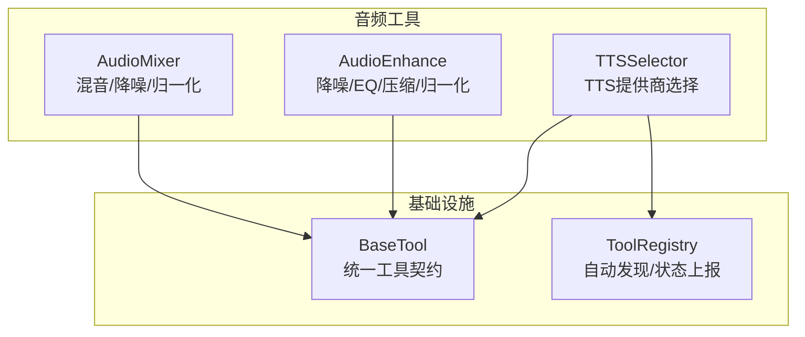
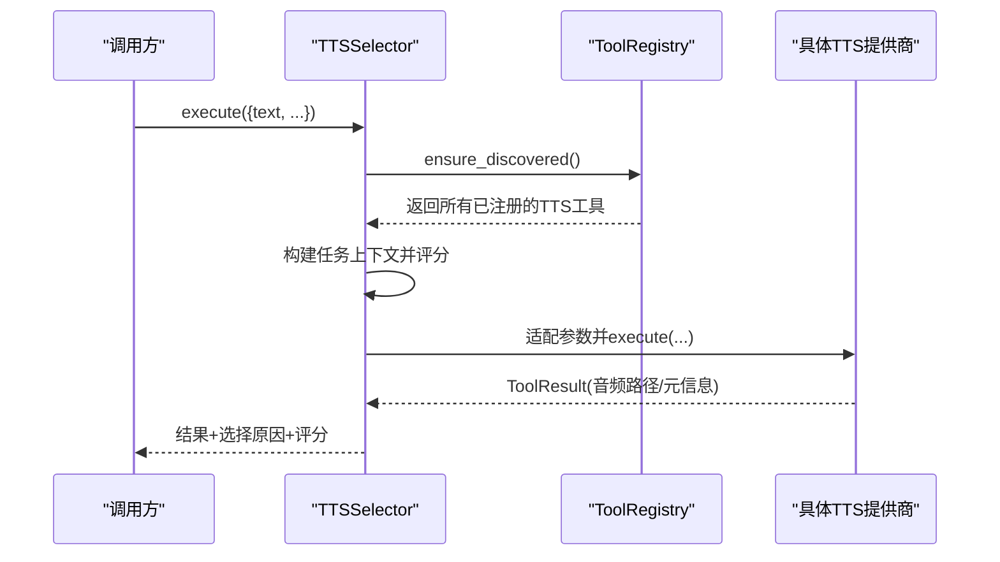
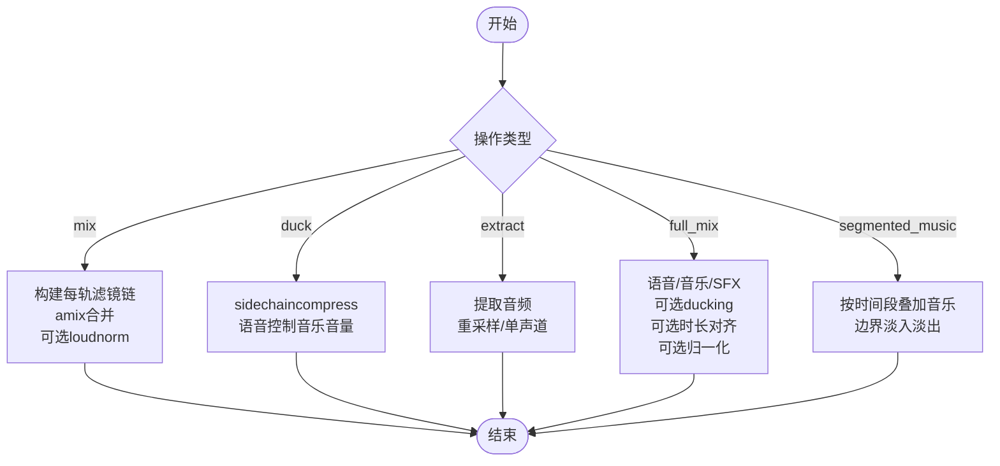
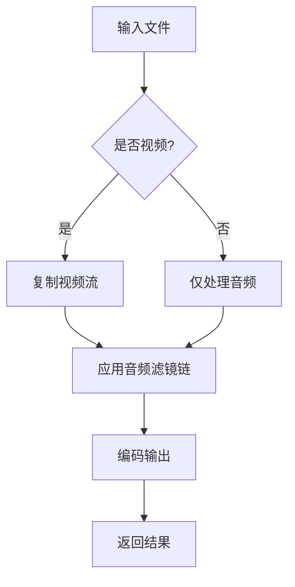
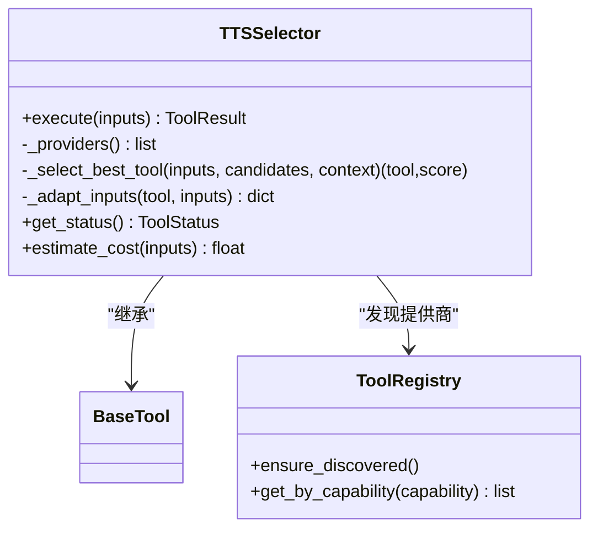
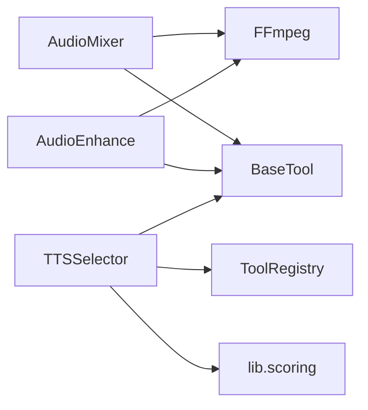

# 音频处理工具

<cite>
**本文引用的文件**
- [audio_mixer.py](file://tools/audio/audio_mixer.py)
- [audio_enhance.py](file://tools/audio/audio_enhance.py)
- [tts_selector.py](file://tools/audio/tts_selector.py)
- [base_tool.py](file://tools/base_tool.py)
- [tool_registry.py](file://tools/tool_registry.py)
- [test_audio_mixer_ducking.py](file://tests/tools/test_audio_mixer_ducking.py)
</cite>

## 目录
1. [简介](#简介)
2. [项目结构](#项目结构)
3. [核心组件](#核心组件)
4. [架构总览](#架构总览)
5. [详细组件分析](#详细组件分析)
6. [依赖关系分析](#依赖关系分析)
7. [性能与资源管理](#性能与资源管理)
8. [故障排查指南](#故障排查指南)
9. [结论](#结论)
10. [附录：使用示例与最佳实践](#附录使用示例与最佳实践)

## 简介
本仓库提供一套可组合的音频处理工具集，覆盖音频混音、音量调节、降噪与音质增强、以及多提供商的文本转语音（TTS）选择。其设计目标是：
- 以统一工具契约组织能力，便于编排与扩展
- 通过 FFmpeg 滤镜图实现高性能、可复现的音频处理
- 支持批量与实时流式场景的混合策略
- 提供质量归一化、平台响度目标适配与错误恢复机制

## 项目结构
音频相关代码集中在 tools/audio 目录下，包含混音器、增强器、TTS 选择器与各 TTS 提供商实现；基础工具契约与注册表位于 tools/base_tool.py 与 tools/tool_registry.py。测试用例位于 tests/tools 下，用于回归验证关键路径（如混音器的侧链压缩/ducking）。

图表来源
- [audio_mixer.py:26-43](file://tools/audio/audio_mixer.py#L26-L43)
- [audio_enhance.py:80-128](file://tools/audio/audio_enhance.py#L80-L128)
- [tts_selector.py:15-33](file://tools/audio/tts_selector.py#L15-L33)
- [base_tool.py:63-139](file://tools/base_tool.py#L63-L139)
- [tool_registry.py:55-155](file://tools/tool_registry.py#L55-L155)

章节来源
- [audio_mixer.py:26-43](file://tools/audio/audio_mixer.py#L26-L43)
- [audio_enhance.py:80-128](file://tools/audio/audio_enhance.py#L80-L128)
- [tts_selector.py:15-33](file://tools/audio/tts_selector.py#L15-L33)
- [base_tool.py:63-139](file://tools/base_tool.py#L63-L139)
- [tool_registry.py:55-155](file://tools/tool_registry.py#L55-L155)

## 核心组件
- 音频混音器（AudioMixer）
  - 能力：多轨混音、语音优先的侧链压缩（ducking）、淡入淡出、响度归一化、视频分段音乐叠加、从视频中提取音频
  - 输入：tracks（含角色、音量、起止时间、淡入淡出）、primary/secondary 简单格式、ducking 参数、normalize、loudnorm_target、segmented_music 配置等
  - 输出：混合后的音频文件或带背景音乐的最终视频
- 音频增强器（AudioEnhance）
  - 能力：噪声抑制、高通/低通滤波、压缩、限制器、均衡器、响度归一化
  - 预设：clean_speech、noise_reduce、normalize_only、podcast、broadcast、voice_clarity
  - 输入：input_path、preset/custom_af、编码与码率
- TTS 选择器（TTSSelector）
  - 能力：自动发现并选择 TTS 提供商、按任务上下文评分排序、将通用参数适配到各提供商原生参数
  - 输入：text、voice_id/voice、language_code、speed/speaking_rate、pitch、timestamps、preferred_provider/allowed_providers、operation=generate|rank 等
  - 输出：音频文件与选择原因、评分、备选提供商列表

章节来源
- [audio_mixer.py:45-196](file://tools/audio/audio_mixer.py#L45-L196)
- [audio_enhance.py:102-128](file://tools/audio/audio_enhance.py#L102-L128)
- [tts_selector.py:39-155](file://tools/audio/tts_selector.py#L39-L155)

## 架构总览
工具基于统一的 BaseTool 契约，具备声明式的元数据（名称、版本、能力、资源需求、稳定性等级），并通过 ToolRegistry 自动发现与状态上报。TTSSelector 作为能力级路由，根据任务上下文对可用 TTS 提供商进行评分与选择，再委派执行。

图表来源
- [tts_selector.py:157-225](file://tools/audio/tts_selector.py#L157-L225)
- [tool_registry.py:118-155](file://tools/tool_registry.py#L118-L155)

章节来源
- [tts_selector.py:157-225](file://tools/audio/tts_selector.py#L157-L225)
- [tool_registry.py:118-155](file://tools/tool_registry.py#L118-L155)

## 详细组件分析

### 音频混音器（AudioMixer）
- 关键流程
  - mix：为每条轨道生成滤镜链（音量、淡入淡出、延迟），然后 amix 合并，可选 loudnorm 归一化
  - duck：使用 sidechaincompress，以语音为控制信号压低背景音乐，支持简单与高级两种输入格式
  - extract：从视频中提取音频，固定采样率与声道数
  - full_mix：一次性完成“语音+音乐+SFX”的混音、可选 ducking、可选精确时长裁剪与归一化
  - segmented_music：在指定时间段内叠加背景音乐，边界处平滑淡入淡出，其余时段静音
- 技术要点
  - 每轨滤镜顺序：先做源上的 afade，再做 adelay，避免延迟静音被误淡出
  - 响度目标：loudnorm 的 I 值可从输入传入，默认 -16 LUFS，兼容不同平台目标
  - 侧链压缩：speech 分支经 asplit 分别用于 key 信号与输出，避免标签复用导致的不兼容
  - 时长对齐：full_mix 支持 target_duration，通过 apad/atrim 确保输出长度一致
  - 分段音乐：用 volume 表达式按时间区间计算音量曲线，amix 时关闭 normalize 避免整体衰减

图表来源
- [audio_mixer.py:257-278](file://tools/audio/audio_mixer.py#L257-L278)
- [audio_mixer.py:280-338](file://tools/audio/audio_mixer.py#L280-L338)
- [audio_mixer.py:340-445](file://tools/audio/audio_mixer.py#L340-L445)
- [audio_mixer.py:447-477](file://tools/audio/audio_mixer.py#L447-L477)
- [audio_mixer.py:479-667](file://tools/audio/audio_mixer.py#L479-L667)
- [audio_mixer.py:669-776](file://tools/audio/audio_mixer.py#L669-L776)

章节来源
- [audio_mixer.py:205-255](file://tools/audio/audio_mixer.py#L205-L255)
- [audio_mixer.py:257-776](file://tools/audio/audio_mixer.py#L257-L776)

### 音频增强器（AudioEnhance）
- 能力与预设
  - clean_speech：高通/低通、噪声门、压缩、限制器、响度归一化
  - noise_reduce：强降噪、高通、归一化
  - podcast/broadcast：针对播客/广播的动态范围控制与响度目标
  - voice_clarity：人声频段提升与轻压缩
- 处理流程
  - 读取输入（音频或视频），若为视频则保留视频流
  - 应用预设或自定义音频滤镜字符串
  - 编码输出（可配置编码器与码率）

图表来源
- [audio_enhance.py:130-181](file://tools/audio/audio_enhance.py#L130-L181)

章节来源
- [audio_enhance.py:25-77](file://tools/audio/audio_enhance.py#L25-L77)
- [audio_enhance.py:130-181](file://tools/audio/audio_enhance.py#L130-L181)

### TTS 选择器（TTSSelector）
- 自动发现与评分
  - 通过 ToolRegistry 获取所有 capability="tts" 的工具
  - 构建任务上下文，调用评分模块对候选提供商排序
  - 支持 preferred_provider 与 allowed_providers 过滤
- 参数适配
  - 将通用字段（如 speaking_rate/speed/pitch/style）映射到各提供商原生字段
  - 支持 SSML、时间戳、语言代码、输出格式等
- 模式
  - generate：直接生成音频
  - rank：仅返回评分与解释，不生成音频

图表来源
- [tts_selector.py:15-33](file://tools/audio/tts_selector.py#L15-L33)
- [tts_selector.py:157-225](file://tools/audio/tts_selector.py#L157-L225)
- [tts_selector.py:227-324](file://tools/audio/tts_selector.py#L227-L324)
- [tool_registry.py:118-155](file://tools/tool_registry.py#L118-L155)

章节来源
- [tts_selector.py:157-324](file://tools/audio/tts_selector.py#L157-L324)
- [tool_registry.py:118-155](file://tools/tool_registry.py#L118-L155)

## 依赖关系分析
- AudioMixer/AudioEnhance 依赖 FFmpeg 命令行工具，通过子进程执行滤镜图
- TTSSelector 依赖 ToolRegistry 动态发现 TTS 提供商，并借助 lib.scoring 进行评分
- 所有工具均继承 BaseTool，获得统一的元数据、执行包装、事件埋点与结果封装

图表来源
- [audio_mixer.py:26-43](file://tools/audio/audio_mixer.py#L26-L43)
- [audio_enhance.py:80-128](file://tools/audio/audio_enhance.py#L80-L128)
- [tts_selector.py:157-225](file://tools/audio/tts_selector.py#L157-L225)
- [base_tool.py:63-139](file://tools/base_tool.py#L63-L139)

章节来源
- [audio_mixer.py:26-43](file://tools/audio/audio_mixer.py#L26-L43)
- [audio_enhance.py:80-128](file://tools/audio/audio_enhance.py#L80-L128)
- [tts_selector.py:157-225](file://tools/audio/tts_selector.py#L157-L225)
- [base_tool.py:63-139](file://tools/base_tool.py#L63-L139)

## 性能与资源管理
- 资源声明
  - AudioMixer：CPU 2核、内存 1024MB、无显存、磁盘 500MB
  - AudioEnhance：CPU 1核、内存 512MB、无显存、磁盘 500MB
- 处理优化建议
  - 尽量使用单条复杂滤镜图（full_mix）减少多次编解码
  - 合理设置 target_duration，避免不必要的长尾静音或截断
  - 使用合适的 loudnorm 目标匹配发布平台，减少后处理
  - 分段音乐模式下关闭 amix 的 normalize，避免整体衰减
- 批处理与并发
  - 每个工具独立运行 FFmpeg 进程，适合并行处理多个文件
  - 注意系统 IO 与 CPU 峰值，合理控制并发度

章节来源
- [audio_mixer.py:198-203](file://tools/audio/audio_mixer.py#L198-L203)
- [audio_enhance.py:122-128](file://tools/audio/audio_enhance.py#L122-L128)
- [audio_mixer.py:623-650](file://tools/audio/audio_mixer.py#L623-L650)
- [audio_mixer.py:731-758](file://tools/audio/audio_mixer.py#L731-L758)

## 故障排查指南
- 常见错误
  - 未找到输入文件：mix/extract/full_mix/segmented_music 会校验路径存在性
  - 未知操作或预设：execute 中会返回明确错误信息
  - FFmpeg 不可用：需安装 ffmpeg 并在 PATH 中可用
  - 过滤器图无效：如标签重复消费、参数非法（例如 loudnorm_target 越界会被钳制）
- 回归测试参考
  - 混音器 full_mix 的侧链压缩分支曾出现未消费输出导致失败，测试用例覆盖了该场景
- 调试建议
  - 打印生成的 filter_complex 与命令参数，定位 FFmpeg 报错
  - 逐步启用/禁用 normalize、ducking、target_duration，缩小问题范围
  - 使用 ffprobe 检查中间产物与输出流的采样率、声道布局

章节来源
- [audio_mixer.py:257-278](file://tools/audio/audio_mixer.py#L257-L278)
- [audio_mixer.py:280-338](file://tools/audio/audio_mixer.py#L280-L338)
- [audio_mixer.py:340-445](file://tools/audio/audio_mixer.py#L340-L445)
- [audio_mixer.py:447-477](file://tools/audio/audio_mixer.py#L447-L477)
- [audio_mixer.py:479-667](file://tools/audio/audio_mixer.py#L479-L667)
- [audio_mixer.py:669-776](file://tools/audio/audio_mixer.py#L669-L776)
- [audio_enhance.py:130-181](file://tools/audio/audio_enhance.py#L130-L181)
- [test_audio_mixer_ducking.py:1-41](file://tests/tools/test_audio_mixer_ducking.py#L1-L41)

## 结论
本音频处理工具集以统一契约组织能力，通过 FFmpeg 滤镜图实现高效、可控的音频处理流程。AudioMixer 提供强大的混音与响度控制能力，AudioEnhance 提供丰富的降噪与音质增强预设，TTSSelector 则屏蔽了多提供商差异，简化上层调用。结合明确的资源声明与错误处理，可在批量与实时场景中稳定工作。

## 附录：使用示例与最佳实践

- 音频文件处理（混音与增强）
  - 多轨混音：准备 tracks（含 path、role、volume、start_seconds、fade_in/out），调用 operation=mix，设置 output_path 与 normalize
  - 语音优先混音：operation=full_mix，传入 speech/music/sfx 轨道，开启 ducking，按需设置 target_duration 与 loudnorm_target
  - 增强处理：operation=audio_enhance，选择 preset 或自定义 custom_af，指定编码与码率
- 实时音频流处理
  - 使用 segmented_music 将背景乐按时间段叠加至视频，边界处淡入淡出，避免打断旁白
  - 对于直播/实时场景，建议缩短滤镜链、降低复杂度，并使用硬件加速（若可用）
- 批量音频转换
  - 遍历输入文件，依次调用 AudioEnhance 与 AudioMixer，记录 ToolResult.duration_seconds 与 artifacts
  - 控制并发度，避免 IO 瓶颈
- 格式转换、采样率、声道与特效
  - 通过 extract 统一采样率与声道，后续再按需转码
  - 使用 AudioEnhance 的 EQ、压缩、限制器等滤镜塑造音色
- 质量控制与性能优化
  - 使用 loudnorm 将响度目标与发布平台对齐
  - 合理使用 target_duration 对齐视频时长，避免多余静音
  - 监控 CPU/内存占用，调整并发与滤镜复杂度
- 管道构建、错误处理与异常恢复
  - 以 BaseTool 的统一接口串联步骤，捕获 ToolResult.success/error
  - 遇到临时错误（如 FFmpeg 失败）可重试或降级（如关闭 ducking/normalize）
- 调试、监控与质量评估
  - 打印 filter_complex 与命令，结合 ffprobe 检查流属性
  - 利用 ToolResult.duration_seconds 与日志统计耗时
  - 主观听感评估：对比原声与处理后效果，关注清晰度、噪声、动态范围

章节来源
- [audio_mixer.py:45-196](file://tools/audio/audio_mixer.py#L45-L196)
- [audio_mixer.py:257-776](file://tools/audio/audio_mixer.py#L257-L776)
- [audio_enhance.py:102-181](file://tools/audio/audio_enhance.py#L102-L181)
- [base_tool.py:128-139](file://tools/base_tool.py#L128-L139)