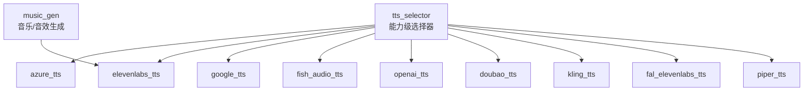
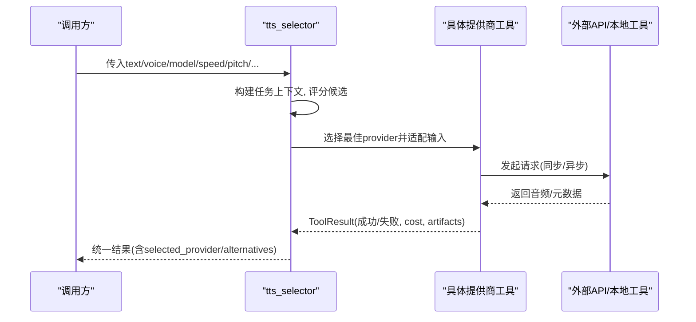
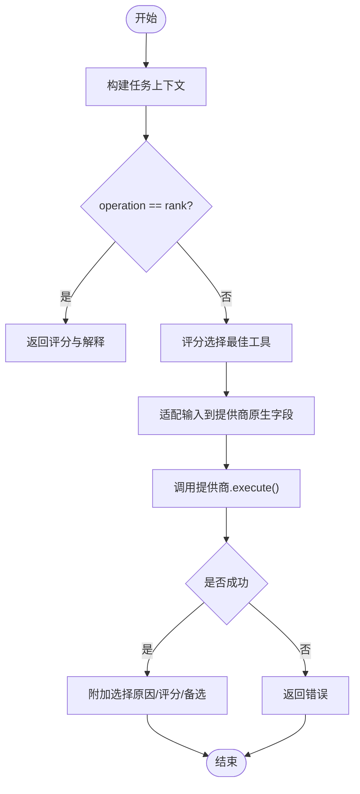
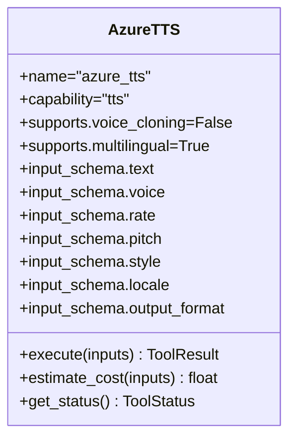
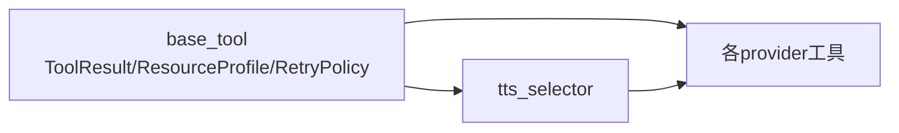

# 音频处理适配器

<cite>
**本文引用的文件**
- [tools/audio/tts_selector.py](file://tools/audio/tts_selector.py)
- [tools/audio/azure_tts.py](file://tools/audio/azure_tts.py)
- [tools/audio/elevenlabs_tts.py](file://tools/audio/elevenlabs_tts.py)
- [tools/audio/google_tts.py](file://tools/audio/google_tts.py)
- [tools/audio/fish_audio_tts.py](file://tools/audio/fish_audio_tts.py)
- [tools/audio/openai_tts.py](file://tools/audio/openai_tts.py)
- [tools/audio/piper_tts.py](file://tools/audio/piper_tts.py)
- [tools/audio/doubao_tts.py](file://tools/audio/doubao_tts.py)
- [tools/audio/kling_tts.py](file://tools/audio/kling_tts.py)
- [tools/audio/fal_elevenlabs_tts.py](file://tools/audio/fal_elevenlabs_tts.py)
- [tools/audio/music_gen.py](file://tools/audio/music_gen.py)
- [tools/base_tool.py](file://tools/base_tool.py)
- [docs/PROVIDERS.md](file://docs/PROVIDERS.md)
</cite>

## 目录
1. [简介](#简介)
2. [项目结构](#项目结构)
3. [核心组件](#核心组件)
4. [架构总览](#架构总览)
5. [详细组件分析](#详细组件分析)
6. [依赖关系分析](#依赖关系分析)
7. [性能与质量特性](#性能与质量特性)
8. [故障排查指南](#故障排查指南)
9. [结论](#结论)
10. [附录：API调用示例与最佳实践](#附录api调用示例与最佳实践)

## 简介
本文件面向“音频处理适配器”的接入、配置与使用，覆盖文本转语音（TTS）、音乐生成与音效制作。系统通过统一的工具契约与选择器，自动发现并路由到合适的提供商（Azure TTS、ElevenLabs、Google TTS、Fish Audio、OpenAI、Doubao、Kling、fal.ai ElevenLabs、本地 Piper），并提供一致的输入输出、成本估算、重试策略与错误处理。文档同时给出各提供商的语言支持、声音克隆、情感表达能力说明，以及音频格式、采样率与音质优化建议，帮助在多语言、实时流式与批量场景下实现统一且高效的音频处理能力。

## 项目结构
- 能力层选择器：tts_selector 负责按任务上下文与用户偏好自动选择具体 TTS 提供商，屏蔽底层差异。
- 提供商适配层：每个 provider 以 BaseTool 子类实现，统一暴露 execute、estimate_cost、get_status 等接口。
- 基础契约：base_tool 提供 ToolResult、ResourceProfile、RetryPolicy、执行模式、确定性、状态枚举等通用能力。
- 文档与配置：PROVIDERS.md 汇总环境密钥、定价与快速上手；各 provider 自带 install_instructions 提示。

图表来源
- [tools/audio/tts_selector.py:15-225](file://tools/audio/tts_selector.py#L15-L225)
- [tools/audio/azure_tts.py:42-86](file://tools/audio/azure_tts.py#L42-L86)
- [tools/audio/elevenlabs_tts.py:24-67](file://tools/audio/elevenlabs_tts.py#L24-L67)
- [tools/audio/google_tts.py:33-78](file://tools/audio/google_tts.py#L33-L78)
- [tools/audio/fish_audio_tts.py:31-74](file://tools/audio/fish_audio_tts.py#L31-L74)
- [tools/audio/openai_tts.py:24-65](file://tools/audio/openai_tts.py#L24-L65)
- [tools/audio/doubao_tts.py:26-70](file://tools/audio/doubao_tts.py#L26-L70)
- [tools/audio/kling_tts.py:30-65](file://tools/audio/kling_tts.py#L30-L65)
- [tools/audio/fal_elevenlabs_tts.py:24-68](file://tools/audio/fal_elevenlabs_tts.py#L24-L68)
- [tools/audio/music_gen.py:28-94](file://tools/audio/music_gen.py#L28-L94)

章节来源
- [tools/base_tool.py:63-139](file://tools/base_tool.py#L63-L139)
- [tools/audio/tts_selector.py:15-225](file://tools/audio/tts_selector.py#L15-L225)

## 核心组件
- tts_selector：自动发现所有 capability="tts" 的工具，基于任务上下文评分选择最优提供商；支持“rank”模式返回候选排序而不实际生成；可透传 voice_id、model_id、speed、pitch、timestamps、output_format 等跨提供商参数。
- 各 provider 工具：遵循 BaseTool 契约，提供 get_status、execute、estimate_cost、idempotency_key_fields、retry_policy、resource_profile 等元数据与行为。
- music_gen：通过 ElevenLabs Music API 生成背景音乐与音效，强制默认无歌词（适合视频背景音）。

章节来源
- [tools/audio/tts_selector.py:15-225](file://tools/audio/tts_selector.py#L15-L225)
- [tools/base_tool.py:110-139](file://tools/base_tool.py#L110-L139)
- [tools/audio/music_gen.py:28-94](file://tools/audio/music_gen.py#L28-L94)

## 架构总览
下图展示从能力层选择器到具体提供商的执行流程，包括输入适配、评分选择、执行与结果封装。

图表来源
- [tools/audio/tts_selector.py:190-225](file://tools/audio/tts_selector.py#L190-L225)
- [tools/base_tool.py:128-139](file://tools/base_tool.py#L128-L139)

## 详细组件分析

### 选择器：tts_selector
- 自动发现：扫描 registry 中 capability="tts" 的工具。
- 评分与选择：根据任务上下文与用户偏好（preferred_provider、allowed_providers）进行评分，返回最佳工具或仅排名（operation=rank）。
- 输入适配：将通用控制（如 speaking_rate/speed、pitch、input_type、timestamps、output_format）映射到各提供商原生字段（例如对 Azure 的 rate/pitch/style 转换）。
- 结果增强：在成功时附加 selected_tool、selected_provider、selection_reason、provider_score、alternatives_considered 等元信息。

图表来源
- [tools/audio/tts_selector.py:190-225](file://tools/audio/tts_selector.py#L190-L225)
- [tools/audio/tts_selector.py:227-256](file://tools/audio/tts_selector.py#L227-L256)

章节来源
- [tools/audio/tts_selector.py:15-324](file://tools/audio/tts_selector.py#L15-L324)

### Azure TTS
- 能力与定位：高质量神经语音、SSML 韵律控制、多语言；适合已有 Azure Speech 资源的云端旁白。
- 配置：设置 AZURE_SPEECH_KEY 与 AZURE_SPEECH_REGION（或 AZURE_TTS_ENDPOINT）。
- 输入要点：voice（支持别名 with 推荐声线）、rate/pitch/style、locale、output_format（mp3/wav）。
- 输出与格式：48kHz 192kbps MP3 或 48kHz 16-bit PCM WAV；确定性高（固定 voice+SSML 可复现）。
- 成本估算：按字符计费（约 $16/百万字符）。

图表来源
- [tools/audio/azure_tts.py:42-171](file://tools/audio/azure_tts.py#L42-L171)
- [tools/audio/azure_tts.py:221-288](file://tools/audio/azure_tts.py#L221-L288)

章节来源
- [tools/audio/azure_tts.py:1-288](file://tools/audio/azure_tts.py#L1-L288)

### ElevenLabs TTS
- 能力与定位：高质量旁白、多语言、支持声音克隆；适合注重表现力的口播与配音。
- 配置：设置 ELEVENLABS_API_KEY。
- 输入要点：voice_id、model_id（如 eleven_multilingual_v2）、stability/similarity_boost/style/speed、output_format（mp3_44100_128 等）。
- 输出与格式：MP3/WAV 取决于 output_format；随机性较高（STOCHASTIC）。
- 成本估算：按字符计费（约 $0.0003/字符）。

章节来源
- [tools/audio/elevenlabs_tts.py:24-213](file://tools/audio/elevenlabs_tts.py#L24-L213)

### Google TTS
- 能力与定位：700+ 声音、50+ 语言，强本地化；支持 SSML、Neural2/Studio/Journey/Chirp 等。
- 配置：GOOGLE_TTS_API_KEY 或 GOOGLE_APPLICATION_CREDENTIALS（服务账号）。
- 输入要点：voice、language_code、speaking_rate、pitch、audio_encoding（MP3/LINEAR16/OGG_OPUS/MULAW/ALAW）。
- 输出与格式：按编码决定扩展名；Chirp/Journey 走 v1beta1 端点。
- 成本估算：不同声音类型单价不同（Standard/WaveNet/Neural2/Studio/Chirp）。

章节来源
- [tools/audio/google_tts.py:33-313](file://tools/audio/google_tts.py#L33-L313)

### Fish Audio TTS
- 能力与定位：高表现力 S1/S2 模型、参考 ID 声音克隆、内联情感标签（S2 模型）、多语言。
- 配置：设置 FISH_AUDIO_API_KEY；可选 reference_id 复用已克隆声音。
- 输入要点：model（s1/s2-pro/s2.1-pro/s2.1-pro-free）、format/mp3_bitrate、normalize、latency、temperature/top_p/repetition_penalty、sample_rate、prosody。
- 输出与格式：mp3/wav/pcm/opus；按 UTF-8 字节计费（促销期 s2.1-pro-free 免费至 2026-08-31）。
- 注意：不支持 SSML；非确定性（STOCHASTIC）。

章节来源
- [tools/audio/fish_audio_tts.py:31-406](file://tools/audio/fish_audio_tts.py#L31-L406)

### OpenAI TTS
- 能力与定位：通用旁白回退路径；支持 gpt-4o-mini-tts 的 instructions 指令。
- 配置：设置 OPENAI_API_KEY。
- 输入要点：model、voice、response_format（mp3/opus/aac/flac/wav/pcm）、instructions、speed。
- 输出与格式：流式写入文件；可探测音频时长。

章节来源
- [tools/audio/openai_tts.py:24-198](file://tools/audio/openai_tts.py#L24-L198)

### Piper TTS（本地离线）
- 能力与定位：完全离线、零网络、隐私敏感场景；确定性高。
- 配置：安装 piper-tts 并下载语音模型。
- 输入要点：model、speaker_id、length_scale、sentence_silence。
- 输出与格式：WAV；成本为 0。

章节来源
- [tools/audio/piper_tts.py:25-156](file://tools/audio/piper_tts.py#L25-L156)

### Doubao TTS（火山引擎）
- 能力与定位：中文旁白自然度高；长文本异步提交-轮询；支持词级时间戳对齐字幕。
- 配置：设置 DOUBAO_SPEECH_API_KEY；可选 DOUBAO_SPEECH_VOICE_TYPE。
- 输入要点：voice_id、resource_id（seed-tts-2.0）、format/sample_rate、speech_rate、enable_timestamp、return_usage、poll_interval_seconds、timeout_seconds。
- 输出与格式：mp3/ogg_opus/pcm；异步任务完成后下载音频并保存查询元数据 JSON。
- 成本估算：按字符计费（优先使用 provider 返回 usage）。

章节来源
- [tools/audio/doubao_tts.py:26-421](file://tools/audio/doubao_tts.py#L26-L421)

### Kling TTS（官方直连）
- 能力与定位：官方 Kling TTS；需显式 voice_id；支持多语言与语速控制。
- 配置：设置 KLING_API_KEY；可选 KLING_API_BASE_URL。
- 输入要点：text、voice_id、voice_language、voice_speed、callback_url、external_task_id、timeout_seconds、poll_interval。
- 输出与格式：根据远程资源 URL 后缀确定；支持回调与账户用量诊断。

章节来源
- [tools/audio/kling_tts.py:30-341](file://tools/audio/kling_tts.py#L30-L341)

### fal.ai ElevenLabs TTS
- 能力与定位：通过 fal.ai 访问 ElevenLabs 语音，无需单独 ElevenLabs 密钥；支持 Eleven v3 内联情感标签与词级时间戳。
- 配置：设置 FAL_KEY（或 FAL_AI_API_KEY）。
- 输入要点：voice/voice_id、model_id（eleven-v3/multilingual-v2/turbo-v2.5）、stability/similarity_boost/style/speed、language_code、timestamps、apply_text_normalization、output_format（多种 mp3/pcm/opus 组合）。
- 输出与格式：队列提交-轮询-下载；按字符计费（不同模型单价不同）。

章节来源
- [tools/audio/fal_elevenlabs_tts.py:24-360](file://tools/audio/fal_elevenlabs_tts.py#L24-L360)

### 音乐生成：music_gen（ElevenLabs Music）
- 能力与定位：生成背景音乐与音效；默认 force_instrumental=true（避免与人声冲突）。
- 配置：设置 ELEVENLABS_API_KEY。
- 输入要点：prompt、duration_seconds（必填，用于匹配视频时长）、output_path。
- 输出与格式：MP3；成本按时长估算（约每30秒 $0.05）。

章节来源
- [tools/audio/music_gen.py:28-188](file://tools/audio/music_gen.py#L28-L188)

## 依赖关系分析
- 选择器依赖：BaseTool、registry（动态发现）、lib.scoring（评分）。
- 提供商依赖：各自的外部 API 或本地命令（如 piper）。
- 共享契约：ToolResult、ResourceProfile、RetryPolicy、ExecutionMode、Determinism、ToolStatus 等。

图表来源
- [tools/base_tool.py:63-139](file://tools/base_tool.py#L63-L139)
- [tools/audio/tts_selector.py:15-225](file://tools/audio/tts_selector.py#L15-L225)

章节来源
- [tools/base_tool.py:63-139](file://tools/base_tool.py#L63-L139)
- [tools/audio/tts_selector.py:15-225](file://tools/audio/tts_selector.py#L15-L225)

## 性能与质量特性
- 质量与风格
  - ElevenLabs：高表现力、多语言、支持声音克隆；随机性较高。
  - Azure：高质量神经语音、SSML 韵律控制、多语言；确定性高。
  - Google：700+ 声音、50+ 语言，强本地化；不同声音类型质量/价格差异明显。
  - Fish Audio：S2 模型支持内联情感标签、声音克隆；随机性较高。
  - OpenAI：通用旁白回退；gpt-4o-mini-tts 支持指令。
  - Doubao：中文自然度高，支持词级时间戳对齐。
  - Kling：官方直连，需显式 voice_id。
  - fal.ai ElevenLabs：通过 fal.ai 访问 ElevenLabs，支持内联情感标签与时间戳。
  - Piper：离线、零成本、确定性高。
- 音频格式与采样率
  - Azure：MP3 48kHz 192kbps 或 WAV 48kHz 16bit。
  - Google：MP3/LINEAR16/OGG_OPUS/MULAW/ALAW。
  - Fish：MP3/WAV/PCM/OPUS，可指定采样率与比特率。
  - OpenAI：MP3/OPUS/AAC/FLAC/WAV/PCM。
  - Doubao：MP3/OGG_OPUS/PCM，采样率可选（8k-48k）。
  - fal.ai ElevenLabs：多种 MP3/PCM/OPUS 组合。
  - Piper：WAV。
  - 音乐：MP3。
- 实时与批量
  - 实时：OpenAI 流式写入；fal.ai ElevenLabs 支持队列与轮询；Doubao/Kling 异步提交-轮询。
  - 批量：tts_selector 支持 operation=rank 预评估；各 provider 均支持幂等键与重试策略。
- 成本与稳定性
  - 各 provider 提供 estimate_cost；部分 provider 支持 provider 返回 usage（如 Doubao）。
  - 重试策略：多数 provider 定义 retry_policy（超时、限流等）。

[本节为通用指导，不直接分析具体文件]

## 故障排查指南
- 认证与环境
  - Azure：检查 AZURE_SPEECH_KEY 与 AZURE_SPEECH_REGION（或 AZURE_TTS_ENDPOINT）。
  - ElevenLabs：检查 ELEVENLABS_API_KEY。
  - Google：检查 GOOGLE_TTS_API_KEY 或服务账号路径。
  - Fish：检查 FISH_AUDIO_API_KEY 与 model 参数。
  - OpenAI：检查 OPENAI_API_KEY。
  - Doubao：检查 DOUBAO_SPEECH_API_KEY 与 voice_id。
  - Kling：检查 KLING_API_KEY 与 voice_id。
  - fal.ai：检查 FAL_KEY。
- 常见错误
  - 缺少 API Key：各 provider 会返回明确错误与安装指引。
  - 参数越界：如 Google speaking_rate/pitch 范围校验、fal.ai speed/stability 范围校验。
  - 异步任务超时：Doubao/Kling 需关注 poll_interval_seconds 与 timeout_seconds。
  - 费用与配额：Doubao/Fish/ElevenLabs 可能受配额限制，需检查控制台。
- 调试建议
  - 使用 tts_selector 的 operation=rank 查看候选评分与解释。
  - 开启 metadata_path（Doubao）或 timestamps（ElevenLabs/Google/Fish）辅助对齐与排错。
  - 使用 provider 的 user_visible_verification 项进行人工听感验证。

章节来源
- [tools/audio/azure_tts.py:176-181](file://tools/audio/azure_tts.py#L176-L181)
- [tools/audio/elevenlabs_tts.py:139-142](file://tools/audio/elevenlabs_tts.py#L139-L142)
- [tools/audio/google_tts.py:158-163](file://tools/audio/google_tts.py#L158-L163)
- [tools/audio/fish_audio_tts.py:287-290](file://tools/audio/fish_audio_tts.py#L287-L290)
- [tools/audio/openai_tts.py:117-120](file://tools/audio/openai_tts.py#L117-L120)
- [tools/audio/doubao_tts.py:178-181](file://tools/audio/doubao_tts.py#L178-L181)
- [tools/audio/kling_tts.py:138-165](file://tools/audio/kling_tts.py#L138-L165)
- [tools/audio/fal_elevenlabs_tts.py:207-209](file://tools/audio/fal_elevenlabs_tts.py#L207-L209)

## 结论
本适配器通过统一的能力层选择器与标准化的工具契约，将多家 TTS 与音乐生成提供商无缝集成，提供一致的输入输出、成本估算、重试与错误处理。针对不同场景（多语言本地化、实时流式、批量生产、离线隐私），可选择最合适的提供商与参数组合，确保音频处理的统一性与高效性。

[本节为总结，不直接分析具体文件]

## 附录：API调用示例与最佳实践
以下示例以“调用方式与关键参数”为主，不包含代码片段。请结合各 provider 的 input_schema 与 PROVIDERS.md 的环境变量配置使用。

- 文本转语音（TTS）
  - Azure TTS
    - 必需：text
    - 可选：voice（支持别名）、rate、pitch、style、locale、output_format（mp3/wav）
    - 建议：使用推荐声线（andrew/brandon/ava/guy/jenny）；需要韵律控制时使用 SSML 风格的 rate/pitch/style
    - 参考：[tools/audio/azure_tts.py:103-149](file://tools/audio/azure_tts.py#L103-L149)
  - ElevenLabs TTS
    - 必需：text
    - 可选：voice_id、model_id、stability、similarity_boost、style、speed、output_format
    - 建议：多语言用 multilingual 模型；需要表现力可调 style/speed
    - 参考：[tools/audio/elevenlabs_tts.py:69-118](file://tools/audio/elevenlabs_tts.py#L69-L118)
  - Google TTS
    - 必需：text
    - 可选：input_type（text/ssml）、voice、language_code、speaking_rate、pitch、audio_encoding
    - 建议：本地化首选 Chirp/Neural2/Studio；SSML 控制停顿与强调
    - 参考：[tools/audio/google_tts.py:80-123](file://tools/audio/google_tts.py#L80-L123)
  - Fish Audio TTS
    - 必需：text、model（s1/s2-pro/s2.1-pro/s2.1-pro-free）
    - 可选：reference_id（声音克隆）、format/mp3_bitrate、normalize、latency、temperature/top_p/repetition_penalty、sample_rate、prosody
    - 建议：S2 模型使用内联情感标签；批量前先用 sample_mode 生成样音
    - 参考：[tools/audio/fish_audio_tts.py:78-172](file://tools/audio/fish_audio_tts.py#L78-L172)
  - OpenAI TTS
    - 必需：text
    - 可选：model（gpt-4o-mini-tts）、voice、response_format、instructions、speed
    - 建议：instructions 仅 gpt-4o-mini-tts 支持；流式写入提升吞吐
    - 参考：[tools/audio/openai_tts.py:67-107](file://tools/audio/openai_tts.py#L67-L107)
  - Doubao TTS
    - 必需：text、voice_id（或环境变量默认）
    - 可选：resource_id、format/sample_rate、speech_rate、enable_timestamp、return_usage、poll_interval_seconds、timeout_seconds
    - 建议：中文旁白优先；长文本异步提交-轮询；开启 enable_timestamp 做字幕对齐
    - 参考：[tools/audio/doubao_tts.py:72-134](file://tools/audio/doubao_tts.py#L72-L134)
  - Kling TTS
    - 必需：text、voice_id
    - 可选：voice_language、voice_speed、callback_url、external_task_id、timeout_seconds、poll_interval
    - 建议：显式 voice_id；如需回调可设置 callback_url
    - 参考：[tools/audio/kling_tts.py:67-94](file://tools/audio/kling_tts.py#L67-L94)
  - fal.ai ElevenLabs TTS
    - 必需：text
    - 可选：voice/voice_id、model_id、stability/similarity_boost/style/speed、language_code、timestamps、apply_text_normalization、output_format
    - 建议：eleven-v3 支持内联情感标签；timestamps 便于对齐
    - 参考：[tools/audio/fal_elevenlabs_tts.py:91-171](file://tools/audio/fal_elevenlabs_tts.py#L91-L171)
  - Piper TTS（离线）
    - 必需：text
    - 可选：model、speaker_id、length_scale、sentence_silence
    - 建议：隐私敏感/离线场景；成本为零
    - 参考：[tools/audio/piper_tts.py:65-88](file://tools/audio/piper_tts.py#L65-L88)

- 音乐生成与音效
  - ElevenLabs Music
    - 必需：prompt、duration_seconds
    - 可选：force_instrumental（默认 true）、output_path
    - 建议：视频背景音务必保持 instrumental；duration 与视频时长一致
    - 参考：[tools/audio/music_gen.py:53-84](file://tools/audio/music_gen.py#L53-L84)

- 多语言本地化
  - Google：language_code 与丰富 voice 库；SSML 控制细节。
  - Fish：S2 模型支持 80+ 语言与内联情感标签。
  - Azure：多语言 Neural 声音族；SSML 韵律控制。
  - ElevenLabs：multilingual 模型；声音克隆跨语言一致性。
  - Doubao：中文自然度高，适合中文内容。

- 实时流式处理
  - OpenAI：流式写入文件，降低内存占用。
  - fal.ai ElevenLabs：队列提交-轮询-下载，适合高并发。
  - Doubao/Kling：异步提交-轮询，适合长文本。

- 批量处理最佳实践
  - 使用 tts_selector 的 operation=rank 预评估候选提供商。
  - 设置合理的 retry_policy 与 idempotency_key_fields 保证幂等。
  - 先小批量样音（sample_mode）确认质量后再全量生成。
  - 利用 timestamps/metadata_path 进行字幕对齐与质检。

- 音频格式、采样率与音质优化
  - 选择合适编码：MP3 兼顾体积与质量；WAV/PCM 用于后期处理；OPUS 适合低延迟传输。
  - 采样率：48kHz（Azure）、24k/44.1k/48k（Doubao/Fish/OpenAI）；根据下游需求选择。
  - 比特率：MP3 128-192kbps 平衡体积与音质；必要时提高至 192kbps。
  - 韵律与情感：Azure SSML、ElevenLabs style/speed、Fish 内联情感标签、Google pitch/rate。

- 统一性与高效性
  - 通过 tts_selector 统一入口，屏蔽提供商差异。
  - 使用 ToolResult 统一返回结构（success/data/artifacts/cost_usd/duration_seconds）。
  - 借助 resource_profile 与 retry_policy 进行资源规划与容错。

章节来源
- [tools/audio/tts_selector.py:39-154](file://tools/audio/tts_selector.py#L39-L154)
- [docs/PROVIDERS.md:29-81](file://docs/PROVIDERS.md#L29-L81)
- [tools/audio/azure_tts.py:103-149](file://tools/audio/azure_tts.py#L103-L149)
- [tools/audio/elevenlabs_tts.py:69-118](file://tools/audio/elevenlabs_tts.py#L69-L118)
- [tools/audio/google_tts.py:80-123](file://tools/audio/google_tts.py#L80-L123)
- [tools/audio/fish_audio_tts.py:78-172](file://tools/audio/fish_audio_tts.py#L78-L172)
- [tools/audio/openai_tts.py:67-107](file://tools/audio/openai_tts.py#L67-L107)
- [tools/audio/doubao_tts.py:72-134](file://tools/audio/doubao_tts.py#L72-L134)
- [tools/audio/kling_tts.py:67-94](file://tools/audio/kling_tts.py#L67-L94)
- [tools/audio/fal_elevenlabs_tts.py:91-171](file://tools/audio/fal_elevenlabs_tts.py#L91-L171)
- [tools/audio/piper_tts.py:65-88](file://tools/audio/piper_tts.py#L65-L88)
- [tools/audio/music_gen.py:53-84](file://tools/audio/music_gen.py#L53-L84)