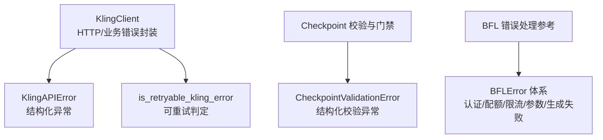
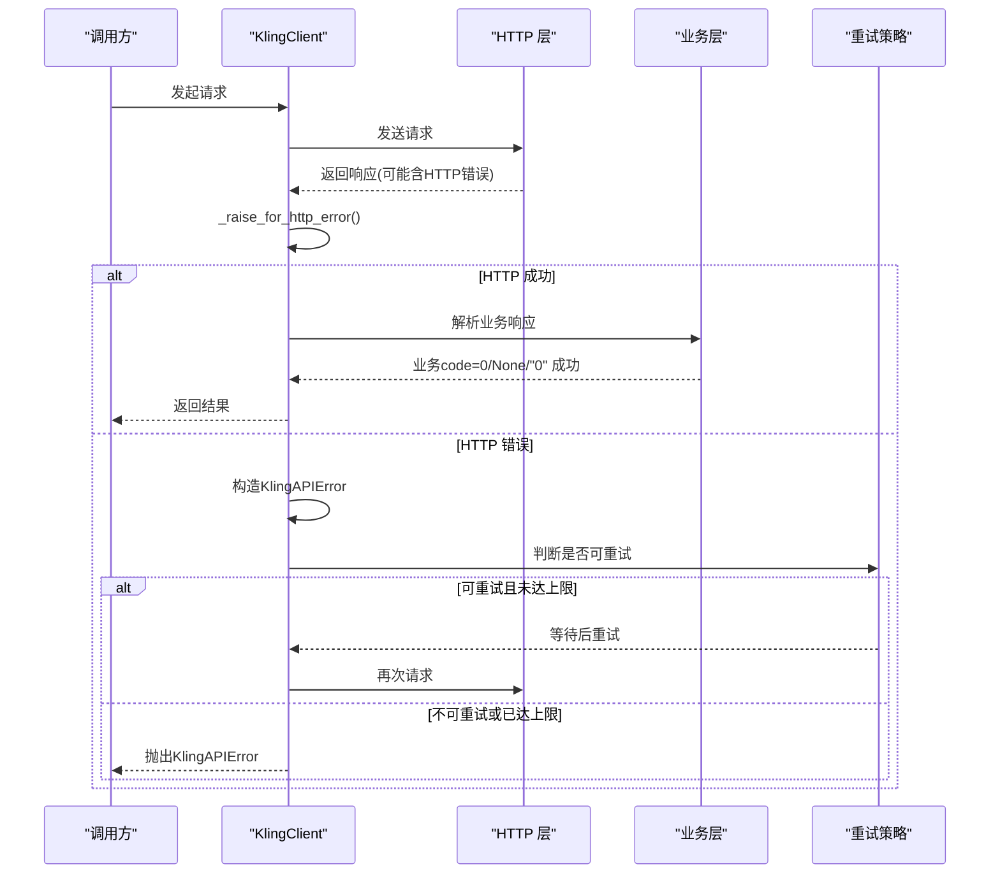
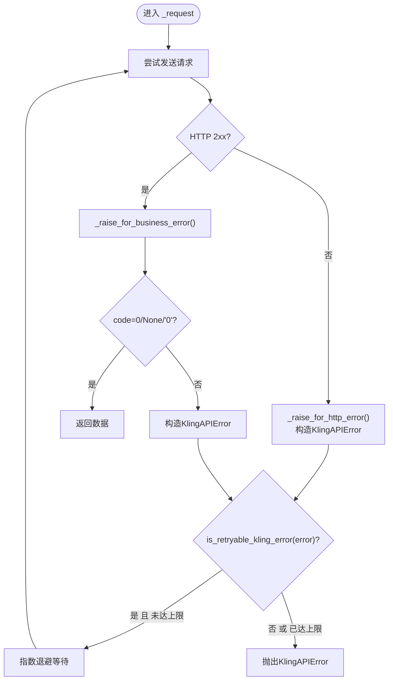
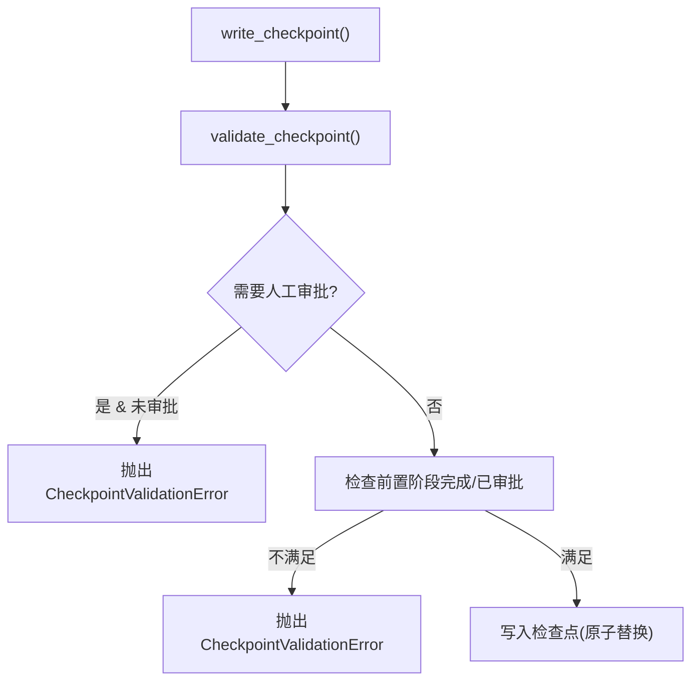
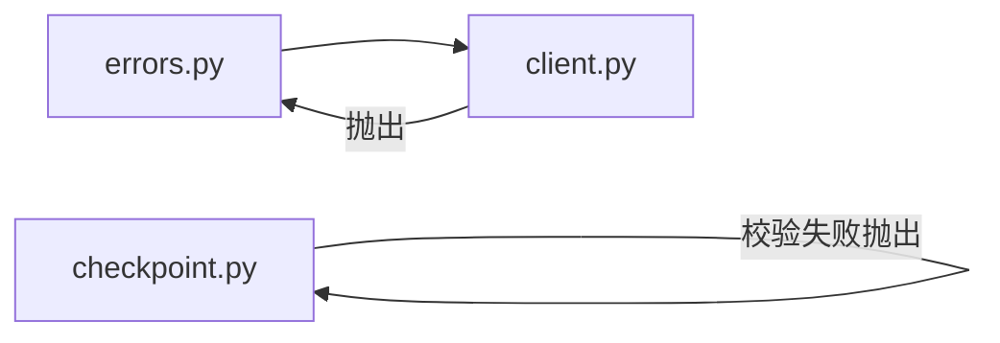

# 错误码参考

<cite>
**本文引用的文件**   
- [tools/_kling/errors.py](file://tools/_kling/errors.py)
- [tools/_kling/client.py](file://tools/_kling/client.py)
- [lib/checkpoint.py](file://lib/checkpoint.py)
- [.agents/skills/bfl-api/references/error-handling.md](file://.agents/skills/bfl-api/references/error-handling.md)
</cite>

## 目录
1. [简介](#简介)
2. [项目结构](#项目结构)
3. [核心组件](#核心组件)
4. [架构总览](#架构总览)
5. [详细组件分析](#详细组件分析)
6. [依赖关系分析](#依赖关系分析)
7. [性能与可靠性考虑](#性能与可靠性考虑)
8. [故障排查指南](#故障排查指南)
9. [结论](#结论)
10. [附录：监控与告警配置建议](#附录监控与告警配置建议)

## 简介
本文件为 OpenMontage 系统的“错误码参考”，聚焦于 HTTP 状态码、业务错误码与异常类型的统一说明，覆盖分类、优先级、重试策略、日志格式、诊断方法与恢复策略。文档基于仓库中实际实现进行梳理，确保可追溯与可操作。

## 项目结构
围绕错误处理的关键代码主要分布在以下位置：
- Kling 官方 API 客户端与错误定义：tools/_kling/*
- 流水线检查点校验与阶段门禁：lib/checkpoint.py
- BFL API 错误处理参考（示例与最佳实践）：.agents/skills/bfl-api/references/error-handling.md

图表来源
- [tools/_kling/client.py:25-157](file://tools/_kling/client.py#L25-L157)
- [tools/_kling/errors.py:9-46](file://tools/_kling/errors.py#L9-L46)
- [lib/checkpoint.py:94-191](file://lib/checkpoint.py#L94-L191)
- [.agents/skills/bfl-api/references/error-handling.md:204-264](file://.agents/skills/bfl-api/references/error-handling.md#L204-L264)

章节来源
- [tools/_kling/client.py:25-157](file://tools/_kling/client.py#L25-L157)
- [tools/_kling/errors.py:9-46](file://tools/_kling/errors.py#L9-L46)
- [lib/checkpoint.py:94-191](file://lib/checkpoint.py#L94-L191)
- [.agents/skills/bfl-api/references/error-handling.md:204-264](file://.agents/skills/bfl-api/references/error-handling.md#L204-L264)

## 核心组件
- KlingAPIError：统一的 API 异常类型，携带 message、code、request_id、http_status、response 等字段，便于定位与上报。
- is_retryable_kling_error：根据业务 code 与 HTTP 状态码判断是否可重试。
- KlingClient._raise_for_http_error / _raise_for_business_error：将 HTTP 层与业务层错误统一转换为 KlingAPIError。
- CheckpointValidationError：用于检查点与阶段门禁的校验失败异常，包含上下文信息。
- BFL 错误处理参考：提供认证、配额、限流、参数校验、生成失败的分类与处理范式。

章节来源
- [tools/_kling/errors.py:9-46](file://tools/_kling/errors.py#L9-L46)
- [tools/_kling/client.py:137-216](file://tools/_kling/client.py#L137-L216)
- [lib/checkpoint.py:94-191](file://lib/checkpoint.py#L94-L191)
- [.agents/skills/bfl-api/references/error-handling.md:204-264](file://.agents/skills/bfl-api/references/error-handling.md#L204-L264)

## 架构总览
OpenMontage 的错误处理遵循“统一异常 + 可重试判定 + 分层校验”的模式：
- 网络层：HTTP 非 2xx 响应被捕获并转为结构化异常。
- 业务层：返回体中的业务 code 非 0/None/"0" 时抛出异常。
- 流程层：检查点写入前进行阶段门禁与数据校验，失败抛出校验异常。
- 重试层：对可重试错误采用指数退避+抖动策略，限制最大重试次数。

图表来源
- [tools/_kling/client.py:137-157](file://tools/_kling/client.py#L137-L157)
- [tools/_kling/client.py:164-216](file://tools/_kling/client.py#L164-L216)
- [tools/_kling/errors.py:30-46](file://tools/_kling/errors.py#L30-L46)

## 详细组件分析

### Kling 官方 API 错误模型与重试
- 异常类型：KlingAPIError，包含 message、code、request_id、http_status、response。
- 可重试判定：
  - 业务 code：1302、1303、5000、5001、5002
  - HTTP 状态码：500、503、504
- 重试策略：
  - 在 _request 中对可重试错误执行指数退避（2*(attempt+1)，上限8秒），最多 max_retries 次。
  - 网络异常（requests.RequestException）也按相同策略重试。
- 错误格式化：
  - 当 code=1303 且消息不含“并发/资源包限制”时，自动追加提示，便于快速识别并发或资源包限制问题。

图表来源
- [tools/_kling/client.py:137-157](file://tools/_kling/client.py#L137-L157)
- [tools/_kling/client.py:164-216](file://tools/_kling/client.py#L164-L216)
- [tools/_kling/errors.py:30-46](file://tools/_kling/errors.py#L30-L46)

章节来源
- [tools/_kling/client.py:137-216](file://tools/_kling/client.py#L137-L216)
- [tools/_kling/errors.py:9-46](file://tools/_kling/errors.py#L9-L46)

### 检查点校验与阶段门禁错误
- 校验异常：CheckpointValidationError，用于检查点结构与阶段门禁违规。
- 常见触发场景：
  - 无效 stage/pipeline_type
  - 缺少必需工件或工件 schema 不通过
  - 前置阶段未完成或未审批
  - 阶段门禁要求人工审批但未满足
- 影响范围：阻止流水线推进，保障一致性；同时保留 in_progress 心跳以便运维介入。

图表来源
- [lib/checkpoint.py:422-564](file://lib/checkpoint.py#L422-L564)
- [lib/checkpoint.py:160-191](file://lib/checkpoint.py#L160-L191)
- [lib/checkpoint.py:284-346](file://lib/checkpoint.py#L284-L346)

章节来源
- [lib/checkpoint.py:94-191](file://lib/checkpoint.py#L94-L191)
- [lib/checkpoint.py:284-346](file://lib/checkpoint.py#L284-L346)
- [lib/checkpoint.py:422-564](file://lib/checkpoint.py#L422-L564)

### BFL API 错误处理参考（分类与重试范式）
- 错误分类：
  - 认证错误（401）
  - 配额不足（402）
  - 速率限制（429，含 Retry-After）
  - 参数校验（400）
  - 服务端错误（>=500）
  - 生成失败（业务错误码）
- 重试策略：
  - 对 429、500、502、503 及特定业务错误码采用指数退避重试。
  - 对 400、401、402、403 等用户侧错误不重试。
- 日志建议：
  - 记录请求、错误与上下文，便于定位。

章节来源
- [.agents/skills/bfl-api/references/error-handling.md:148-264](file://.agents/skills/bfl-api/references/error-handling.md#L148-L264)

## 依赖关系分析
- 耦合关系：
  - client.py 依赖 errors.py 的异常与重试判定。
  - checkpoint.py 独立于外部 API，负责内部流程一致性。
  - BFL 参考文档提供通用模式，供其他模块借鉴。
- 潜在循环依赖：无直接循环依赖。
- 外部依赖：
  - requests（HTTP 客户端）
  - jsonschema（检查点 schema 校验）

图表来源
- [tools/_kling/client.py:137-157](file://tools/_kling/client.py#L137-L157)
- [tools/_kling/errors.py:9-46](file://tools/_kling/errors.py#L9-L46)
- [lib/checkpoint.py:94-191](file://lib/checkpoint.py#L94-L191)

章节来源
- [tools/_kling/client.py:137-157](file://tools/_kling/client.py#L137-L157)
- [tools/_kling/errors.py:9-46](file://tools/_kling/errors.py#L9-L46)
- [lib/checkpoint.py:94-191](file://lib/checkpoint.py#L94-L191)

## 性能与可靠性考虑
- 重试与退避：
  - 指数退避 + 随机抖动，避免雪崩。
  - 限制最大重试次数，防止无限重试。
- 超时控制：
  - 任务轮询设置超时时间，避免长时间阻塞。
- 幂等性：
  - 检查点写入使用临时文件 + 原子替换，保证一致性。
- 降级与容错：
  - 归档历史检查点，支持回溯与审计。
  - 网关/策略不可用时记录警告并回退到安全默认值。

[本节为通用指导，无需具体文件引用]

## 故障排查指南
- 快速定位：
  - 查看异常 message、code、request_id、http_status。
  - 对于 1303 并发/资源包限制，关注并行任务数与资源包配额。
- 常见问题与解决：
  - 认证失败（401）：检查 API Key 配置与权限。
  - 配额不足（402）：充值或调整任务规模。
  - 速率限制（429）：读取 Retry-After 并延迟重试。
  - 参数错误（400）：修正请求参数，遵循约束。
  - 服务端错误（>=500）：稍后重试或联系服务提供方。
  - 检查点校验失败：核对 stage、pipeline_type、工件 schema 与前置阶段状态。
- 日志与调试：
  - 记录请求端点、负载与错误上下文。
  - 对生成失败记录 prompt 摘要与关键参数。

章节来源
- [tools/_kling/client.py:164-216](file://tools/_kling/client.py#L164-L216)
- [tools/_kling/errors.py:9-46](file://tools/_kling/errors.py#L9-L46)
- [lib/checkpoint.py:94-191](file://lib/checkpoint.py#L94-L191)
- [.agents/skills/bfl-api/references/error-handling.md:266-290](file://.agents/skills/bfl-api/references/error-handling.md#L266-L290)

## 结论
OpenMontage 通过统一的异常模型、明确的重试策略与严格的检查点门禁，实现了跨模块一致的错误处理。结合 BFL 参考的最佳实践，可在认证、配额、限流、参数校验与服务端错误等场景中快速定位与恢复。建议在集成新模块时沿用该模式，确保可观测性与可维护性。

[本节为总结，无需具体文件引用]

## 附录：监控与告警配置建议
- 指标采集：
  - 统计各错误类别的频次与占比（认证、配额、限流、参数、服务端）。
  - 记录重试次数与最终成功率。
- 告警规则：
  - 高 429/500/503 比例触发告警。
  - 1303 并发/资源包限制频繁出现时扩容或限流。
  - 检查点校验失败率突增时通知流水线负责人。
- 日志规范：
  - 统一包含时间戳、级别、模块、错误码、请求ID、关键上下文。
  - 对敏感信息脱敏后再输出。

[本节为通用建议，无需具体文件引用]