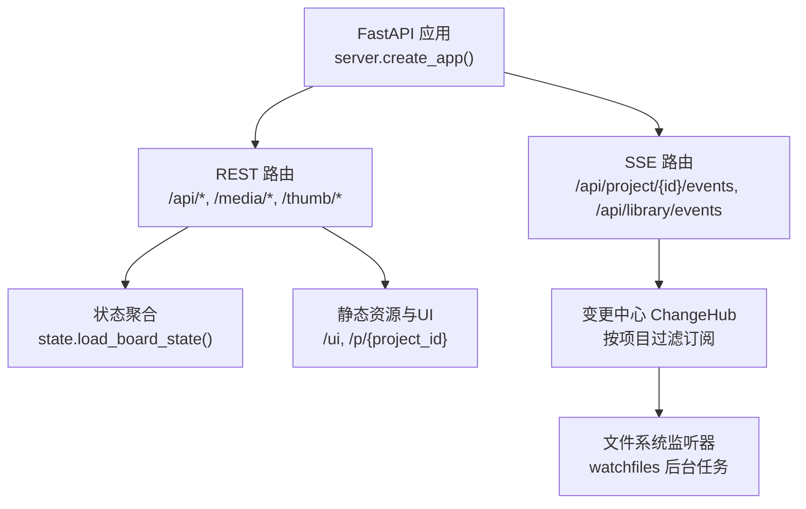
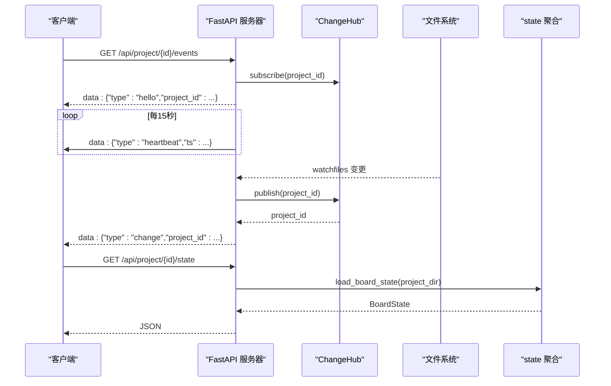
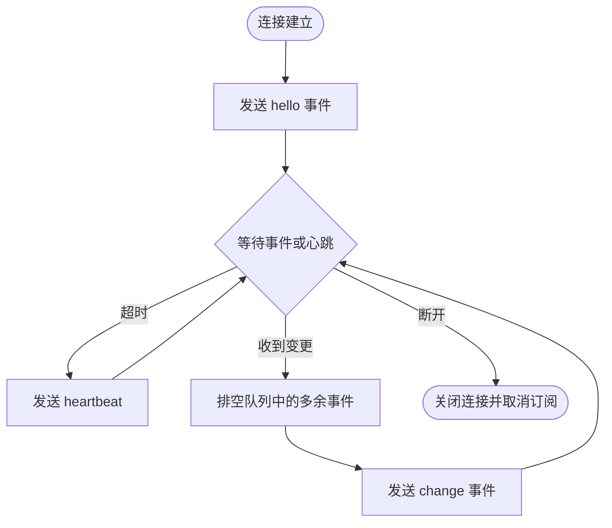
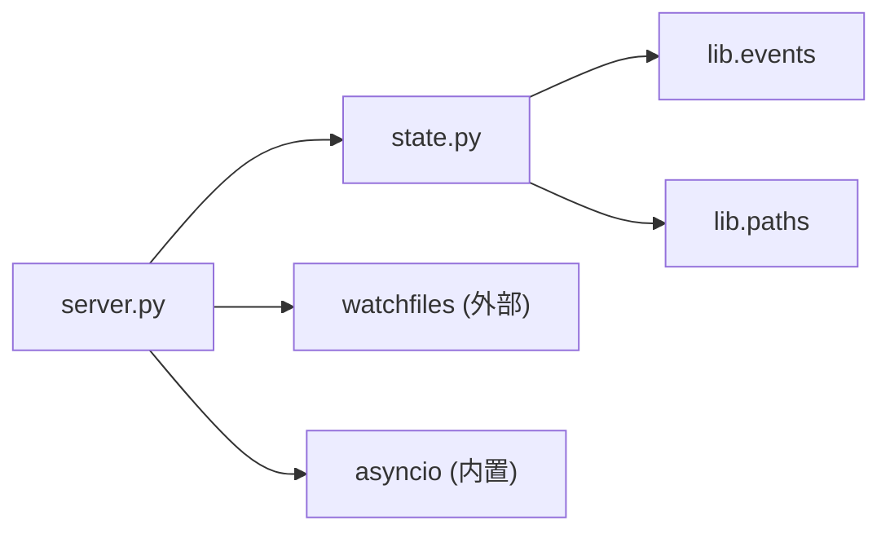

# API参考文档

<cite>
**本文档引用的文件**
- [server.py](file://backlot/server.py)
- [state.py](file://backlot/state.py)
- [__main__.py](file://backlot/__main__.py)
- [README.md](file://backlot/README.md)
- [__init__.py](file://backlot/__init__.py)
- [test_server.py](file://tests/backlot/test_server.py)
</cite>

## 目录
1. [简介](#简介)
2. [项目结构](#项目结构)
3. [核心组件](#核心组件)
4. [架构总览](#架构总览)
5. [详细组件分析](#详细组件分析)
6. [依赖关系分析](#依赖关系分析)
7. [性能考虑](#性能考虑)
8. [故障排查指南](#故障排查指南)
9. [结论](#结论)
10. [附录](#附录)

## 简介
Backlot 是一个本地只读的生产看板服务，基于 FastAPI 提供 REST API 与 SSE（Server-Sent Events）事件流。它通过监听 projects 目录的变更，实时向浏览器推送项目状态变化；同时提供健康检查、项目列表、项目状态查询、媒体与缩略图访问等接口。SSE 用于“活”的状态更新：连接建立后，服务端周期性发送心跳，并在检测到项目变更时推送 change 事件，客户端据此刷新看板数据。

本参考文档聚焦 Backlot 的 REST API 与 SSE 事件流，覆盖端点、参数、响应、错误码、处理逻辑、安全限制、性能特征、常见问题与调试技巧，并提供实际调用示例路径与说明。

## 项目结构
Backlot 的核心由以下模块组成：
- server.py：FastAPI 应用定义、路由、SSE 事件流、静态资源挂载、中间件、缩略图与媒体服务。
- state.py：从磁盘读取并聚合项目状态（阶段、制品、故事板、媒体、成本、活动窗口等），供 /api/project/{id}/state 使用。
- __main__.py：命令行入口，支持 serve（前台运行）和 open（自动启动服务并打开浏览器）。
- README.md：Backlot 使用说明与工作原理概述。
- __init__.py：默认端口等常量。

图表来源
- [server.py:165-307](file://backlot/server.py#L165-L307)
- [server.py:132-163](file://backlot/server.py#L132-L163)
- [state.py:588-658](file://backlot/state.py#L588-L658)

章节来源
- [server.py:1-369](file://backlot/server.py#L1-L369)
- [state.py:1-716](file://backlot/state.py#L1-L716)
- [__main__.py:1-110](file://backlot/__main__.py#L1-L110)
- [README.md:1-43](file://backlot/README.md#L1-L43)
- [__init__.py:1-17](file://backlot/__init__.py#L1-L17)

## 核心组件
- 健康检查：GET /api/health
- 项目列表：GET /api/projects
- 项目状态：GET /api/project/{project_id}/state
- SSE 事件流（项目级）：GET /api/project/{project_id}/events
- SSE 事件流（库级）：GET /api/library/events
- 缩略图：GET /thumb/{project_id}/{file_path}?w=...
- 媒体：GET /media/{project_id}/{file_path}
- UI 页面：GET /p/{project_id}，GET /

这些端点共同构成 Backlot 的对外能力：健康探测、元数据浏览、细粒度状态获取、实时事件订阅、媒体与缩略图访问、以及前端界面。

章节来源
- [server.py:170-290](file://backlot/server.py#L170-L290)
- [state.py:588-716](file://backlot/state.py#L588-L716)

## 架构总览
Backlot 采用“文件系统即状态源 + 后台监听 + SSE 推送”的架构：
- 所有状态来自 projects/<id>/ 下的文件（checkpoint_*.json、artifacts/*.json、events.jsonl、renders/*、snapshots/* 等）。
- 后台 watchfiles 监听 projects 目录变更，去重后按项目发布到 ChangeHub。
- SSE 订阅者根据项目 ID 过滤，避免无关项目的通知风暴。
- 请求侧通过 REST 拉取完整状态或列表；SSE 仅推送轻量事件（hello、heartbeat、change）。

图表来源
- [server.py:183-240](file://backlot/server.py#L183-L240)
- [server.py:132-163](file://backlot/server.py#L132-L163)
- [state.py:588-658](file://backlot/state.py#L588-L658)

## 详细组件分析

### 健康检查
- 方法：GET
- 路径：/api/health
- 请求参数：无
- 响应体：包含 ok 与 app 字段的健康对象
- 用途：服务存活探测、负载均衡健康检查
- 错误码：正常返回 200；异常情况下由框架返回标准错误

章节来源
- [server.py:170-173](file://backlot/server.py#L170-L173)

### 项目列表
- 方法：GET
- 路径：/api/projects
- 请求参数：无
- 响应体：项目摘要数组，每个元素包含 project_id、title、pipeline_type、has_pipeline_state、poster、live、last_activity、active_stage、awaiting_human、stage_states、completed_count、render_count、scene_count 等
- 缓存策略：对 summarize_project 的结果进行内存缓存，变更时失效
- 排序规则：优先 live 项目，其次按 last_activity 倒序
- 错误码：正常返回 200；若 projects 目录不存在则返回空数组

章节来源
- [server.py:174-177](file://backlot/server.py#L174-L177)
- [server.py:85-108](file://backlot/server.py#L85-L108)
- [state.py:661-716](file://backlot/state.py#L661-L716)

### 项目状态
- 方法：GET
- 路径：/api/project/{project_id}/state
- 路径参数：project_id（必须为合法的项目目录名，禁止路径穿越）
- 响应体：BoardState，包含 project_id、title、pipeline、style_playbook、created_at、has_marker、stages、artifacts、storyboard、media、events、cost、last_activity、live、poster 等
- 内部逻辑：
  - 校验 project_id 安全性（拒绝包含 / \ : 及 . ..）
  - 加载 pipeline 元信息（manifest 或回退阶段）
  - 收集 checkpoint/history/artifacts/events
  - 构建 stage rail、storyboard、media 扫描、成本快照、活动窗口与停滞检测
- 错误码：
  - 400：非法 project_id
  - 404：未知项目

章节来源
- [server.py:178-182](file://backlot/server.py#L178-L182)
- [server.py:310-318](file://backlot/server.py#L310-L318)
- [state.py:588-658](file://backlot/state.py#L588-L658)

### SSE 事件流（项目级）
- 方法：GET
- 路径：/api/project/{project_id}/events
- 查询参数：无
- 内容类型：text/event-stream
- 头部：Cache-Control: no-cache；X-Accel-Buffering: no
- 事件序列：
  - hello：首次连接确认，携带 project_id
  - heartbeat：每 15 秒发送一次，携带时间戳
  - change：当该项目的文件发生变更时触发，携带 project_id
- 连接管理：
  - 使用 ChangeHub.subscribe(project_id) 创建队列
  - 断开连接时自动取消订阅
  - 批量合并 burst：消费完队列中剩余项后再发一个 change
- 错误码：
  - 404：未知项目（提前校验）

图表来源
- [server.py:183-212](file://backlot/server.py#L183-L212)
- [server.py:43-74](file://backlot/server.py#L43-L74)

章节来源
- [server.py:183-212](file://backlot/server.py#L183-L212)

### SSE 事件流（库级）
- 方法：GET
- 路径：/api/library/events
- 内容类型：text/event-stream
- 头部：Cache-Control: no-cache；X-Accel-Buffering: no
- 事件序列：
  - hello：首次连接确认
  - heartbeat：每 15 秒发送一次
  - change：任意项目变更时触发，携带 project_id
- 适用场景：库视图需要感知任何项目变更以刷新列表

章节来源
- [server.py:214-240](file://backlot/server.py#L214-L240)

### 缩略图
- 方法：GET
- 路径：/thumb/{project_id}/{file_path}
- 查询参数：w（目标宽度，默认 640；会映射到预定义宽度集合）
- 行为：
  - 校验路径安全（防止路径穿越）
  - 若文件不存在返回 404
  - 图片：缩放并缓存 JPEG；非图像文件直接透传
  - 视频：尝试提取海报帧（ffmpeg），失败则返回 404（不直接返回原始视频字节）
- 错误码：
  - 403：路径逃逸
  - 404：媒体不存在或无法生成海报帧

章节来源
- [server.py:244-262](file://backlot/server.py#L244-L262)
- [server.py:325-365](file://backlot/server.py#L325-L365)

### 媒体
- 方法：GET
- 路径：/media/{project_id}/{file_path}
- 行为：
  - 校验路径安全（防止路径穿越）
  - 若文件不存在返回 404
  - 使用 FileResponse，原生支持 Range 请求（分片下载）
- 错误码：
  - 403：路径逃逸
  - 404：媒体不存在

章节来源
- [server.py:266-276](file://backlot/server.py#L266-L276)

### UI 页面
- 方法：GET
- 路径：
  - /p/{project_id}：项目看板页
  - /p/{project_path:path}：兼容路径形式
  - /：库视图首页
- 行为：
  - 动态注入 UI 资源版本（基于 mtime）
  - 对 / 与 /ui、/p 路径设置 no-cache 头，确保前端资源可被条件缓存（ETag）
- 错误码：正常返回 200 HTML

章节来源
- [server.py:280-305](file://backlot/server.py#L280-L305)

## 依赖关系分析
- FastAPI：路由、请求/响应模型、StreamingResponse、StaticFiles
- watchfiles：后台监听 projects 目录变更
- asyncio：并发队列与超时控制
- state.py：读取与聚合项目状态（checkpoint、history、artifacts、events、media）
- lib.events：读取 events.jsonl 事件流
- lib.paths：PROJECTS_DIR、REPO_ROOT 等路径常量

图表来源
- [server.py:10-22](file://backlot/server.py#L10-L22)
- [state.py:10-18](file://backlot/state.py#L10-L18)

章节来源
- [server.py:1-369](file://backlot/server.py#L1-L369)
- [state.py:1-716](file://backlot/state.py#L1-L716)

## 性能考虑
- 项目列表缓存：_cached_summaries 对 summarize_project 结果进行缓存，变更时失效，减少重复解析开销
- 变更去重：watchfiles 批量变更去重后按项目发布，避免频繁通知
- SSE 心跳：15 秒间隔，保持连接活跃并检测断线
- 缩略图缓存：按源文件、mtime、size、目标宽度计算哈希，落盘缓存 JPEG
- 媒体 Range 请求：利用 FileResponse 原生支持分片，降低带宽与内存占用
- 性能预算测试：测试用例验证冷/热路径下 /api/projects 与 /api/project/{id}/state 的响应时间

章节来源
- [server.py:76-108](file://backlot/server.py#L76-L108)
- [server.py:132-149](file://backlot/server.py#L132-L149)
- [server.py:244-262](file://backlot/server.py#L244-L262)
- [server.py:325-365](file://backlot/server.py#L325-L365)
- [test_server.py:156-193](file://tests/backlot/test_server.py#L156-L193)

## 故障排查指南
- 常见错误码与原因：
  - 400：非法 project_id（包含 / \ : 或 . ..）
  - 403：路径逃逸（媒体/缩略图访问越界）
  - 404：未知项目、媒体不存在、视频无法提取海报帧
- 诊断步骤：
  - 健康检查：GET /api/health 确认服务可用
  - 项目存在性：GET /api/project/{id}/state 验证项目是否存在且可读
  - 媒体可用性：GET /media/{id}/{path} 验证文件是否可达
  - 缩略图可用性：GET /thumb/{id}/{path}?w=640 验证是否能生成或透传
  - SSE 连接：GET /api/project/{id}/events 观察 hello/heartbeat/change 是否正常
- 日志与调试：
  - 使用 TestClient 进行单元测试（见 tests/backlot/test_server.py）
  - 在开发环境可通过 --port 指定端口并查看 uvicorn 输出
  - watchfiles 不可用时不影响基本功能（降级为手动刷新）

章节来源
- [server.py:170-182](file://backlot/server.py#L170-L182)
- [server.py:244-276](file://backlot/server.py#L244-L276)
- [server.py:310-318](file://backlot/server.py#L310-L318)
- [test_server.py:88-154](file://tests/backlot/test_server.py#L88-L154)

## 结论
Backlot 提供了简洁而健壮的本地生产看板 API：REST 用于状态与媒体访问，SSE 用于实时事件推送。其设计强调“只读、不阻塞、优雅降级”，并通过缓存、Range 请求、路径安全校验等手段保障性能与安全。对于集成方而言，建议：
- 使用 /api/health 做健康探测
- 使用 /api/projects 与 /api/project/{id}/state 获取元数据与详情
- 使用 SSE 实现实时更新，注意心跳与断线重连
- 使用 /media 与 /thumb 访问媒体与缩略图，遵循路径安全约束

## 附录

### API 端点速查表
- 健康检查
  - GET /api/health
  - 响应：{ok: true, app: "backlot"}
- 项目列表
  - GET /api/projects
  - 响应：项目摘要数组
- 项目状态
  - GET /api/project/{project_id}/state
  - 响应：BoardState
- SSE 事件流（项目级）
  - GET /api/project/{project_id}/events
  - 事件：hello、heartbeat、change
- SSE 事件流（库级）
  - GET /api/library/events
  - 事件：hello、heartbeat、change
- 缩略图
  - GET /thumb/{project_id}/{file_path}?w=...
  - 响应：JPEG 或透传非媒体文件
- 媒体
  - GET /media/{project_id}/{file_path}
  - 响应：文件流（支持 Range）
- UI 页面
  - GET /p/{project_id}
  - GET /

章节来源
- [server.py:170-290](file://backlot/server.py#L170-L290)

### SSE 技术细节
- 连接建立：首次发送 hello 事件，携带 project_id（项目级）或空（库级）
- 心跳机制：每 15 秒发送 heartbeat，携带 ts
- 断线重连：客户端应监听连接断开并重试，建议指数退避
- 事件合并：服务端在发送 change 前会排空队列，避免重复通知
- 过滤器：项目级 SSE 仅推送指定 project_id 的变更

章节来源
- [server.py:183-240](file://backlot/server.py#L183-L240)
- [server.py:43-74](file://backlot/server.py#L43-L74)

### 认证与授权
- 当前实现未包含显式认证与授权机制
- 安全边界：
  - 路径安全校验：拒绝路径穿越与非法 project_id
  - 媒体访问限制：仅允许访问项目目录内的文件
- 建议：
  - 在生产环境中将 Backlot 置于反向代理之后，启用 IP 白名单或基础认证
  - 如需多租户隔离，可在代理层按路径或子域进行鉴权

章节来源
- [server.py:310-318](file://backlot/server.py#L310-L318)
- [server.py:244-276](file://backlot/server.py#L244-L276)

### 版本管理与兼容性
- 版本号：__version__ = "0.1.0"
- 默认端口：4750
- 兼容性：
  - 若 watchfiles 不可用，SSE 仍可用但需手动刷新
  - 未知 pipeline 类型回退到默认阶段顺序
  - 缺失文件或损坏 JSON 会降级处理，不会崩溃

章节来源
- [__init__.py:14-17](file://backlot/__init__.py#L14-L17)
- [server.py:132-138](file://backlot/server.py#L132-L138)
- [state.py:63-94](file://backlot/state.py#L63-L94)

### 实际调用示例（路径与说明）
- curl 命令（健康检查）
  - 示例路径：curl http://127.0.0.1:4750/api/health
  - 说明：确认服务是否存活
  - 参考：[server.py:170-173](file://backlot/server.py#L170-L173)
- curl 命令（项目列表）
  - 示例路径：curl http://127.0.0.1:4750/api/projects
  - 说明：获取所有项目摘要
  - 参考：[server.py:174-177](file://backlot/server.py#L174-L177)
- curl 命令（项目状态）
  - 示例路径：curl http://127.0.0.1:4750/api/project/film/state
  - 说明：获取指定项目的完整状态
  - 参考：[server.py:178-182](file://backlot/server.py#L178-L182)
- curl 命令（SSE 事件流）
  - 示例路径：curl -N http://127.0.0.1:4750/api/project/film/events
  - 说明：接收 hello、heartbeat、change 事件
  - 参考：[server.py:183-212](file://backlot/server.py#L183-L212)
- curl 命令（媒体 Range 请求）
  - 示例路径：curl -H "Range: bytes=2-5" http://127.0.0.1:4750/media/film/renders/final.mp4
  - 说明：验证分片下载与 content-range 头
  - 参考：[test_server.py:129-139](file://tests/backlot/test_server.py#L129-L139)
- JavaScript 客户端（SSE 订阅）
  - 示例路径：参考 backlot/ui/lib.js 中的 getJSON 与 fetch 用法
  - 说明：可使用 EventSource 或 fetch 流式读取 text/event-stream
  - 参考：[server.py:183-240](file://backlot/server.py#L183-L240)
- Python SDK（TestClient 示例）
  - 示例路径：tests/backlot/test_server.py
  - 说明：使用 fastapi.testclient.TestClient 进行端到端测试
  - 参考：[test_server.py:15-43](file://tests/backlot/test_server.py#L15-L43)

章节来源
- [server.py:170-240](file://backlot/server.py#L170-L240)
- [test_server.py:88-154](file://tests/backlot/test_server.py#L88-L154)