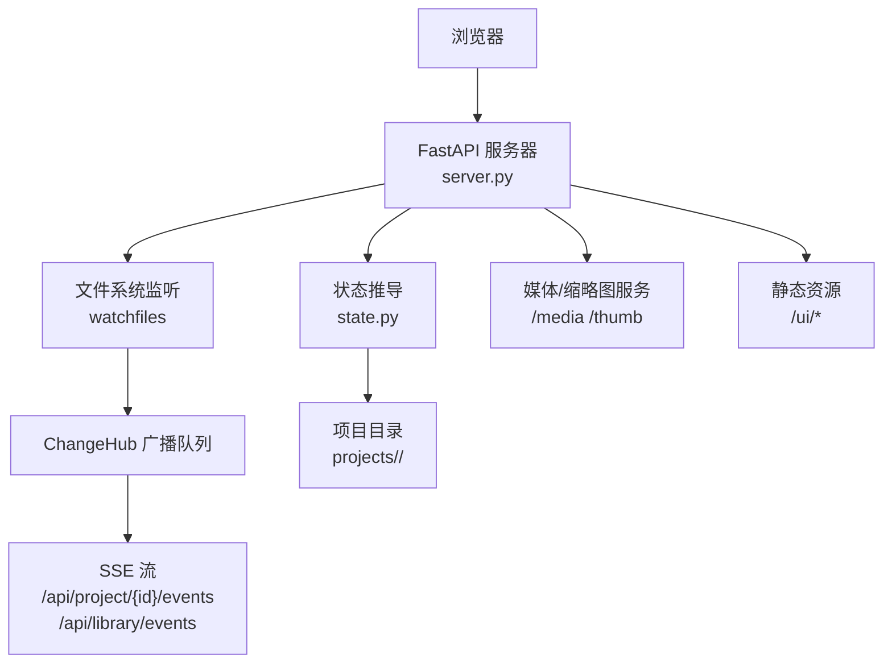
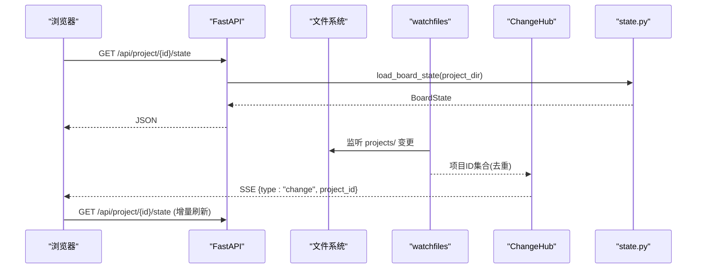
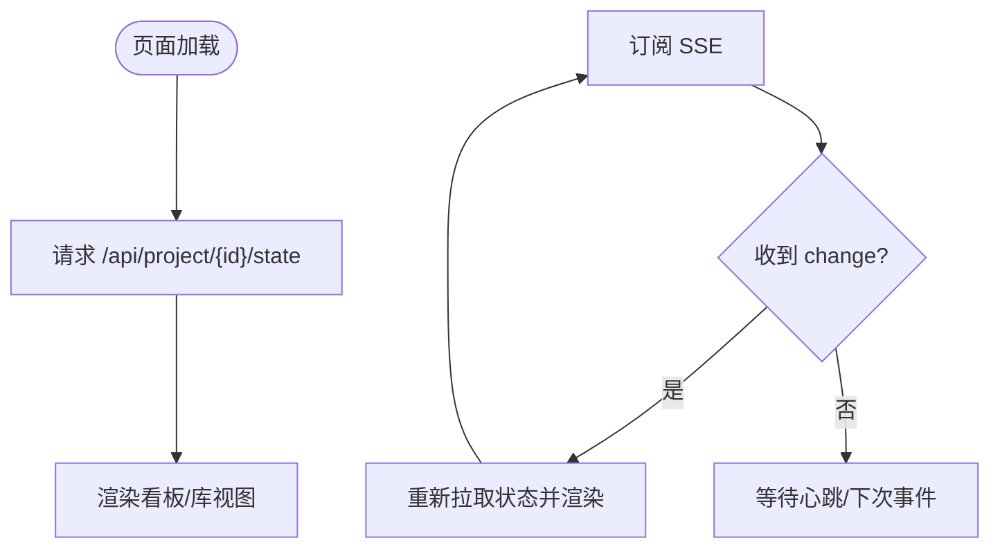
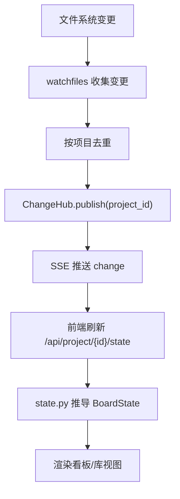
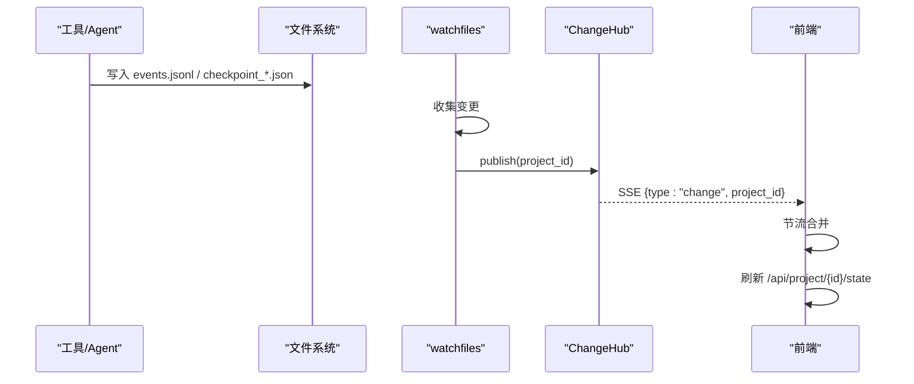
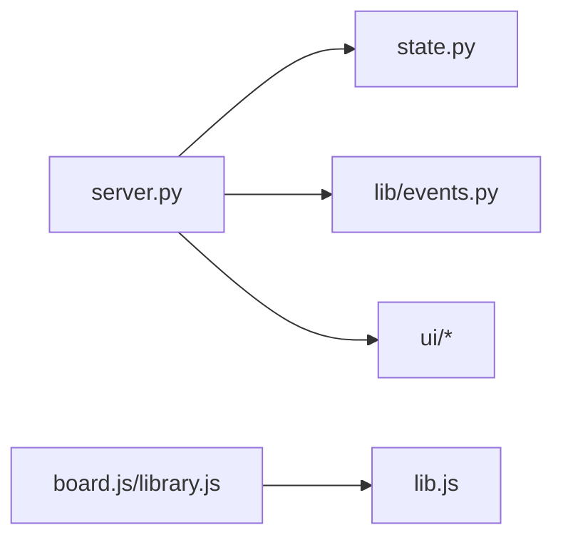

# Backlot监控系统

<cite>
**本文引用的文件**
- [backlot/README.md](file://backlot/README.md)
- [backlot/__main__.py](file://backlot/__main__.py)
- [backlot/server.py](file://backlot/server.py)
- [backlot/state.py](file://backlot/state.py)
- [backlot/ui/board.html](file://backlot/ui/board.html)
- [backlot/ui/board.js](file://backlot/ui/board.js)
- [backlot/ui/index.html](file://backlot/ui/index.html)
- [backlot/ui/library.js](file://backlot/ui/library.js)
- [backlot/ui/lib.js](file://backlot/ui/lib.js)
- [lib/events.py](file://lib/events.py)
</cite>

## 目录
1. [简介](#简介)
2. [项目结构](#项目结构)
3. [核心组件](#核心组件)
4. [架构总览](#架构总览)
5. [详细组件分析](#详细组件分析)
6. [依赖关系分析](#依赖关系分析)
7. [性能考量](#性能考量)
8. [故障排查指南](#故障排查指南)
9. [结论](#结论)
10. [附录：Web API 接口文档](#附录web-api-接口文档)

## 简介
Backlot 是 OpenMontage 的“活体分镜”看板系统，提供只读、实时的可视化界面，用于观察生产管线运行状态。它通过文件系统监听与 SSE（Server-Sent Events）推送变更，将管线阶段、脚本、场景计划、资产清单、成本、活动日志等聚合为可交互的看板与库视图。其设计原则是“永不阻塞、永不崩溃”，对缺失或损坏的数据进行优雅降级。

## 项目结构
- backlot：服务端与前端资源
  - server.py：FastAPI 应用、SSE 事件分发、媒体与缩略图服务、UI 路由
  - state.py：从项目目录推导 BoardState（阶段轨、故事板、媒体、事件、成本等）
  - __main__.py：CLI（open/serve），后台启动服务器并打开浏览器
  - ui：纯前端 HTML/JS/CSS（board.html、library.html、board.js、library.js、lib.js）
- lib/events.py：事件写入与读取（events.jsonl），供工具层记录活动
- 其他：测试、脚本、配置等



图表来源
- [backlot/server.py:165-307](file://backlot/server.py#L165-L307)
- [backlot/state.py:588-658](file://backlot/state.py#L588-L658)
- [backlot/ui/board.js:1128-1131](file://backlot/ui/board.js#L1128-L1131)

章节来源
- [backlot/README.md:1-43](file://backlot/README.md#L1-L43)
- [backlot/__main__.py:1-110](file://backlot/__main__.py#L1-L110)

## 核心组件
- 实时看板（Project Board）：展示项目概览、阶段轨、脚本预览、故事板胶片条、决策与活动面板、审批门等
- 库视图（Library）：列出所有项目卡片，显示活跃状态、最近活动时间、阶段进度摘要
- 事件系统：基于 events.jsonl 的活动日志，支持 start/finish/error 等事件类型，驱动“生成中”状态与活动面板
- 状态管理：以只读方式从磁盘推导 BoardState，包含 pipeline/stages/artifacts/storyboard/media/events/cost 等
- Web API：RESTful 端点 + SSE 事件流，提供健康检查、项目列表、项目状态、媒体与缩略图访问

章节来源
- [backlot/server.py:165-307](file://backlot/server.py#L165-L307)
- [backlot/state.py:588-658](file://backlot/state.py#L588-L658)
- [lib/events.py:77-119](file://lib/events.py#L77-L119)
- [backlot/ui/board.js:1-1143](file://backlot/ui/board.js#L1-L1143)
- [backlot/ui/library.js:1-92](file://backlot/ui/library.js#L1-L92)

## 架构总览
Backlot 采用“文件系统即数据源 + 后端只读推导 + 前端订阅更新”的架构：
- 管线工具在运行过程中产出 checkpoint_*.json、artifacts/*.json、events.jsonl、renders/* 等文件
- 后端使用 watchfiles 监听 projects/ 变化，按项目维度去重后广播到 ChangeHub
- 前端通过 SSE 订阅变更，收到 change 后拉取最新状态并渲染
- 媒体与缩略图通过 REST 端点按需获取，缩略图缓存至 .backlot/thumbs



图表来源
- [backlot/server.py:132-149](file://backlot/server.py#L132-L149)
- [backlot/server.py:178-212](file://backlot/server.py#L178-L212)
- [backlot/state.py:588-658](file://backlot/state.py#L588-L658)

## 详细组件分析

### 实时可视化界面（项目看板与库视图）
- 项目看板
  - 顶部信息栏：管线类型、场景数与时长、风格剧本、成本消耗、Live/Idle/Awaiting/Stalled 状态
  - 阶段轨：展示各阶段状态、人工审批门、版本数、未声明阶段提示、悬停提示
  - 脚本卡片：分段展示标题、时长、段落、增强提示；点击展开完整脚本弹窗
  - 故事板胶片条：按场景组织，显示视觉素材（图片/视频）、音频、生成中 shimmer、拍摄意图标签、多 take 切换
  - 右侧面板：决策日志（合并重复项，标记修订）、活动日志（start/finish/error 时间线）
  - 审批门：当阶段处于 awaiting_human，展示待审工件摘要与下一步提示
- 库视图
  - 项目卡片：海报（优先图像，否则视频帧）、管线类型、场景/渲染计数、最近活动时间、迷你阶段轨
  - 实时更新：通过 SSE 订阅库级事件，自动刷新卡片



图表来源
- [backlot/ui/board.js:1-1143](file://backlot/ui/board.js#L1-L1143)
- [backlot/ui/library.js:1-92](file://backlot/ui/library.js#L1-L92)
- [backlot/ui/lib.js:65-81](file://backlot/ui/lib.js#L65-L81)

章节来源
- [backlot/ui/board.html:1-16](file://backlot/ui/board.html#L1-L16)
- [backlot/ui/index.html:1-27](file://backlot/ui/index.html#L1-L27)
- [backlot/ui/board.js:1-1143](file://backlot/ui/board.js#L1-L1143)
- [backlot/ui/library.js:1-92](file://backlot/ui/library.js#L1-L92)
- [backlot/ui/lib.js:1-104](file://backlot/ui/lib.js#L1-L104)

### 事件系统设计与实现
- 事件写入
  - BaseTool 调用 emit_event 向 projects/<id>/events.jsonl 追加一行 JSON
  - 写入线程锁保证单进程并发安全；跨进程无锁，但读取会跳过损坏行
  - 自动推断项目归属：优先 project_dir/project_path，其次输出/输入路径提示键
- 事件读取
  - read_events 按顺序读取 events.jsonl，限制最大条数，忽略空行与解析错误
- 事件类型与消息格式
  - 典型字段：ts（UTC ISO 时间）、event（start/finish/error）、tool、scene_id、duration_s、cost_usd、success 等
  - 看板根据 start/finish/error 计算“生成中”状态，并在活动面板中呈现
- SSE 推送
  - 后端维护 per-project 与全局两个订阅队列，收到文件系统变更后广播 project_id
  - 客户端收到 change 后节流合并，避免频繁刷新

```mermaid
classDiagram
class EventsModule {
+emit_event(project_dir, payload) void
+read_events(project_dir, limit) list
+infer_project_dir(inputs) Path?
}
class Server {
+/api/project/{id}/events StreamingResponse
+/api/library/events StreamingResponse
}
class Frontend {
+subscribe(url, onChange) EventSource
+refresh() void
}
EventsModule <.. Server : "被状态推导使用"
Server --> Frontend : "SSE 推送"
```

图表来源
- [lib/events.py:46-119](file://lib/events.py#L46-L119)
- [backlot/server.py:183-240](file://backlot/server.py#L183-L240)
- [backlot/ui/lib.js:65-81](file://backlot/ui/lib.js#L65-L81)

章节来源
- [lib/events.py:1-119](file://lib/events.py#L1-L119)
- [backlot/server.py:183-240](file://backlot/server.py#L183-L240)
- [backlot/ui/board.js:610-658](file://backlot/ui/board.js#L610-L658)

### 状态管理机制
- 数据来源
  - 项目元数据：project.json、meta.json
  - 阶段状态：checkpoint_*.json 与 history/checkpoint_*_N.json
  - 工件：artifacts/*.json（如 script.json、scene_plan.json、asset_manifest.json 等）
  - 媒体：renders/*、snapshots/*、verify/*、根目录 *.mp4/*.mp3
  - 事件：events.jsonl
- 状态推导
  - load_board_state 组合上述数据，构建 stages、storyboard、media、events、cost、live 等
  - 失败降级：任何 JSON 解析或 IO 异常均返回空/默认值，不抛错
  - 停滞检测：in_progress 阶段超过阈值无活动则标记 stalled
- 持久化与同步
  - 数据持久化于文件系统；后端只读，不修改项目目录
  - 同步机制：watchfiles 监听 + ChangeHub 广播 + SSE 推送 + 前端增量刷新
- 并发访问控制
  - 事件写入使用线程锁；跨进程无锁，读取容忍损坏行
  - 缩略图生成使用临时文件原子替换，避免并发覆盖



图表来源
- [backlot/server.py:132-149](file://backlot/server.py#L132-L149)
- [backlot/server.py:178-212](file://backlot/server.py#L178-L212)
- [backlot/state.py:588-658](file://backlot/state.py#L588-L658)

章节来源
- [backlot/state.py:41-127](file://backlot/state.py#L41-L127)
- [backlot/state.py:246-349](file://backlot/state.py#L246-L349)
- [backlot/state.py:502-582](file://backlot/state.py#L502-L582)
- [backlot/state.py:588-658](file://backlot/state.py#L588-L658)
- [lib/events.py:77-119](file://lib/events.py#L77-L119)

### Web API 接口文档
- 健康检查
  - GET /api/health → {"ok": true, "app": "backlot"}
- 项目列表
  - GET /api/projects → 项目摘要数组（含 live、last_activity、stage_states 等）
- 项目状态
  - GET /api/project/{project_id}/state → BoardState（stages、storyboard、media、events、cost 等）
- 事件流（SSE）
  - GET /api/project/{project_id}/events → text/event-stream，推送 {type:"hello"/"heartbeat"/"change", project_id}
  - GET /api/library/events → 全局变更流，推送 {type:"change", project_id}
- 媒体与缩略图
  - GET /media/{project_id}/{file_path} → 原始媒体（支持 Range）
  - GET /thumb/{project_id}/{file_path}?w=... → 缩略图 JPEG（缓存至 .backlot/thumbs）
- 页面路由
  - GET /p/{project_id} → 项目看板 HTML
  - GET / → 库视图 HTML

调用示例
- 获取项目状态：curl http://127.0.0.1:4750/api/project/demo-project/state
- 订阅项目事件：EventSource("http://127.0.0.1:4750/api/project/demo-project/events")
- 获取缩略图：

章节来源
- [backlot/server.py:170-276](file://backlot/server.py#L170-L276)
- [backlot/server.py:280-307](file://backlot/server.py#L280-L307)
- [backlot/server.py:325-365](file://backlot/server.py#L325-L365)

### 实时监控数据采集与处理流程
- 采集
  - 工具层通过 emit_event 写入 events.jsonl；管线产物写入 checkpoints、artifacts、renders 等
- 监听
  - watchfiles 递归监听 projects/，过滤无关路径（node_modules/.git/__pycache__/.cache）
- 广播
  - 变更按项目去重后，ChangeHub 向对应订阅者推送 project_id
- 消费
  - 前端通过 SSE 接收 change，节流合并后拉取最新状态并渲染
- 降级
  - 若缺少 checkpoint/history/artifacts，看板仍显示媒体与快照；未知阶段回退到通用阶段轨



图表来源
- [lib/events.py:77-119](file://lib/events.py#L77-L119)
- [backlot/server.py:132-149](file://backlot/server.py#L132-L149)
- [backlot/server.py:183-240](file://backlot/server.py#L183-L240)
- [backlot/ui/lib.js:65-81](file://backlot/ui/lib.js#L65-L81)

章节来源
- [backlot/server.py:132-149](file://backlot/server.py#L132-L149)
- [lib/events.py:77-119](file://lib/events.py#L77-L119)
- [backlot/ui/board.js:610-658](file://backlot/ui/board.js#L610-L658)

### 界面定制与扩展指南
- 主题切换
  - 通过 localStorage 保存主题偏好，动态设置 data-theme 属性
- 自定义阶段图标与文案
  - 可在 board.js 中扩展 STAGE_ICONS 映射与 stageSub 逻辑
- 新增工件展示
  - 在 artifactReviewContent 中添加新工件类型的渲染分支
- 扩展媒体类型
  - 在 state.py 的 MEDIA_* 集合中增加后缀，并在 _scan_media/_thumbnail_for 中适配
- 自定义缩略图策略
  - 调整 THUMB_WIDTHS 与 _thumbnail_for 中的缩放/提取逻辑

章节来源
- [backlot/ui/board.js:23-44](file://backlot/ui/board.js#L23-L44)
- [backlot/ui/board.js:160-176](file://backlot/ui/board.js#L160-L176)
- [backlot/ui/board.js:354-459](file://backlot/ui/board.js#L354-L459)
- [backlot/state.py:19-24](file://backlot/state.py#L19-L24)
- [backlot/server.py:24-25](file://backlot/server.py#L24-L25)
- [backlot/server.py:325-365](file://backlot/server.py#L325-L365)

## 依赖关系分析
- 模块耦合
  - server.py 依赖 state.py 进行状态推导，依赖 lib.events.py 读取事件
  - 前端 board.js/library.js 依赖 lib.js 提供的工具函数与 SSE 订阅
- 外部依赖
  - FastAPI、uvicorn：HTTP 服务与 ASGI 运行
  - watchfiles：文件系统监听
  - ffmpeg/PIL：缩略图生成与图片处理
- 潜在循环依赖
  - 当前为单向依赖：server→state→lib.events；前端与服务端通过 HTTP/SSE 解耦



图表来源
- [backlot/server.py:165-307](file://backlot/server.py#L165-L307)
- [backlot/state.py:588-658](file://backlot/state.py#L588-L658)
- [lib/events.py:77-119](file://lib/events.py#L77-L119)
- [backlot/ui/board.js:1-1143](file://backlot/ui/board.js#L1-L1143)
- [backlot/ui/library.js:1-92](file://backlot/ui/library.js#L1-L92)
- [backlot/ui/lib.js:1-104](file://backlot/ui/lib.js#L1-L104)

章节来源
- [backlot/server.py:165-307](file://backlot/server.py#L165-L307)
- [backlot/state.py:588-658](file://backlot/state.py#L588-L658)
- [lib/events.py:77-119](file://lib/events.py#L77-L119)
- [backlot/ui/board.js:1-1143](file://backlot/ui/board.js#L1-L1143)
- [backlot/ui/library.js:1-92](file://backlot/ui/library.js#L1-L92)
- [backlot/ui/lib.js:1-104](file://backlot/ui/lib.js#L1-L104)

## 性能考量
- 文件系统监听
  - 批量收集变更并按项目去重，避免对每个文件单独触发
  - 忽略 node_modules/.git/__pycache__/.cache 等噪声目录
- 状态推导优化
  - 库视图使用 summarize_project 轻量摘要，减少大文件解析
  - 阶段轨与历史合并时仅保留必要字段
- 缩略图缓存
  - 基于内容哈希与尺寸缓存 JPEG，避免重复生成
  - 并发写时使用临时文件原子替换，防止竞争条件
- SSE 心跳与节流
  - 每 15 秒发送心跳，保持连接活跃
  - 前端对 change 事件进行 250ms 节流合并，降低刷新频率

[本节为通用性能建议，无需特定文件引用]

## 故障排查指南
- 无法打开看板
  - 确认端口可用且服务已启动；可通过 CLI 的 open 命令自动拉起服务
- 看板无更新
  - 检查 events.jsonl 是否有写入；确认 watchfiles 是否安装；查看 SSE 是否收到 change
- 缩略图不显示
  - 确认目标文件为图片或被 ffmpeg 支持的媒体；检查 .backlot/thumbs 权限
- 阶段停滞
  - 若 in_progress 长时间无活动，看板会标记 stalled；检查 agent 是否卡住或事件未写入
- 审批门未出现
  - 确认 checkpoint 中 human_approval_default 与 status=awaiting_human；检查 artifacts 是否存在

章节来源
- [backlot/__main__.py:55-86](file://backlot/__main__.py#L55-L86)
- [backlot/server.py:132-149](file://backlot/server.py#L132-L149)
- [backlot/server.py:325-365](file://backlot/server.py#L325-L365)
- [backlot/state.py:630-638](file://backlot/state.py#L630-L638)
- [lib/events.py:77-119](file://lib/events.py#L77-L119)

## 结论
Backlot 以文件系统为中心，结合后端只读推导与前端 SSE 订阅，提供了稳定、低耦合、可扩展的生产看板。其设计强调健壮性与可观测性，能够在数据不完整或异常时优雅降级，同时通过事件系统与实时推送确保用户始终看到最新进展。配合完善的 API 与前端能力，Backlot 成为监控与管理 OpenMontage 生产管线的理想界面。

[本节为总结性内容，无需特定文件引用]

## 附录：Web API 接口文档
- 健康检查
  - GET /api/health
  - 响应：{"ok": true, "app": "backlot"}
- 项目列表
  - GET /api/projects
  - 响应：项目摘要数组（project_id、title、pipeline_type、has_pipeline_state、poster、live、last_activity、active_stage、awaiting_human、stage_states、completed_count、render_count、scene_count）
- 项目状态
  - GET /api/project/{project_id}/state
  - 响应：BoardState（project_id、title、pipeline、style_playbook、created_at、has_marker、has_pipeline_state、stages、artifacts、storyboard、media、events、cost、last_activity、live、poster）
- 事件流（SSE）
  - GET /api/project/{project_id}/events
  - 事件：{type:"hello", project_id} → {type:"heartbeat", ts} → {type:"change", project_id}
  - GET /api/library/events
  - 事件：{type:"hello"} → {type:"heartbeat", ts} → {type:"change", project_id}
- 媒体与缩略图
  - GET /media/{project_id}/{file_path}
  - GET /thumb/{project_id}/{file_path}?w={width}
- 页面路由
  - GET /p/{project_id}
  - GET /

章节来源
- [backlot/server.py:170-276](file://backlot/server.py#L170-L276)
- [backlot/server.py:280-307](file://backlot/server.py#L280-L307)
- [backlot/server.py:325-365](file://backlot/server.py#L325-L365)