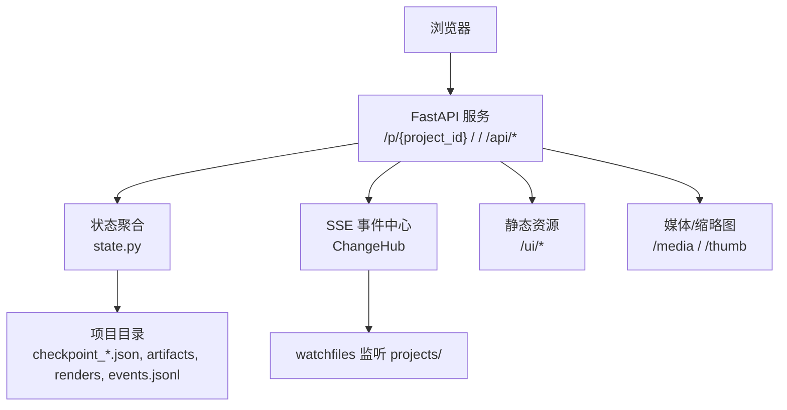
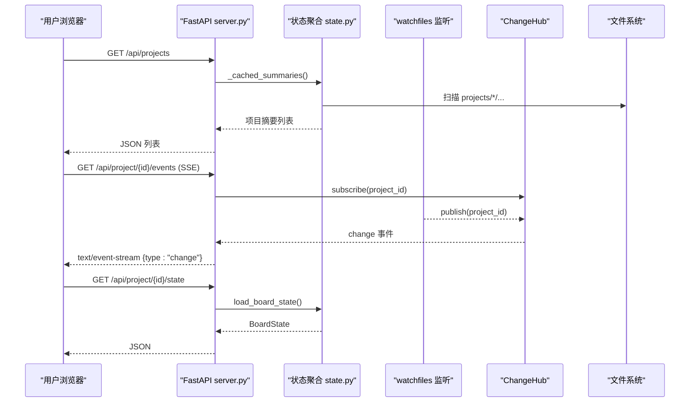
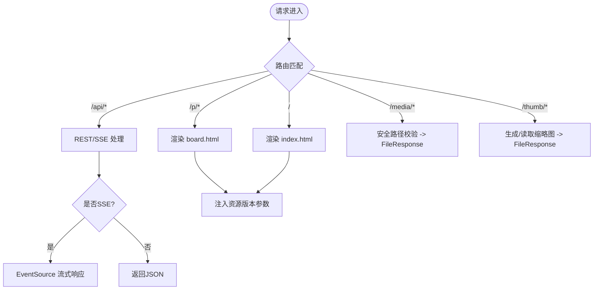
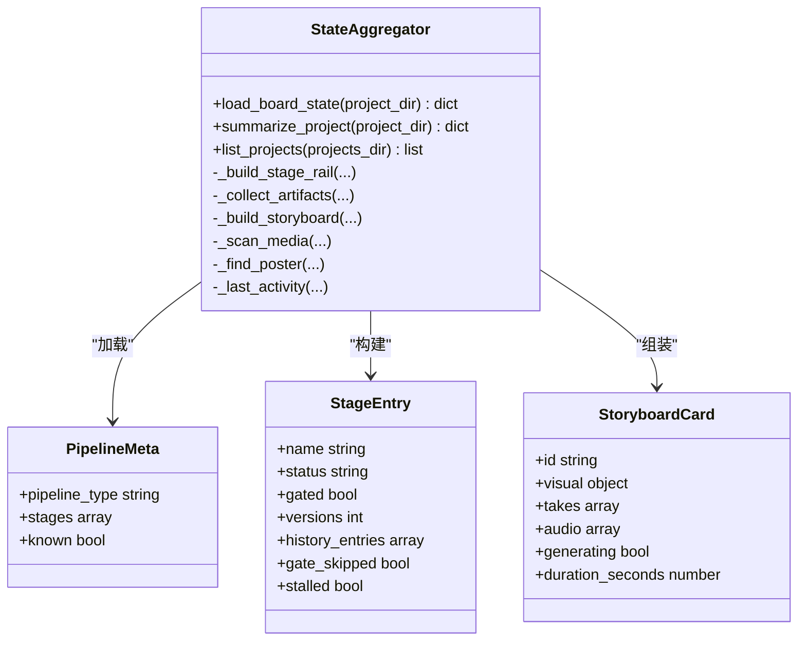
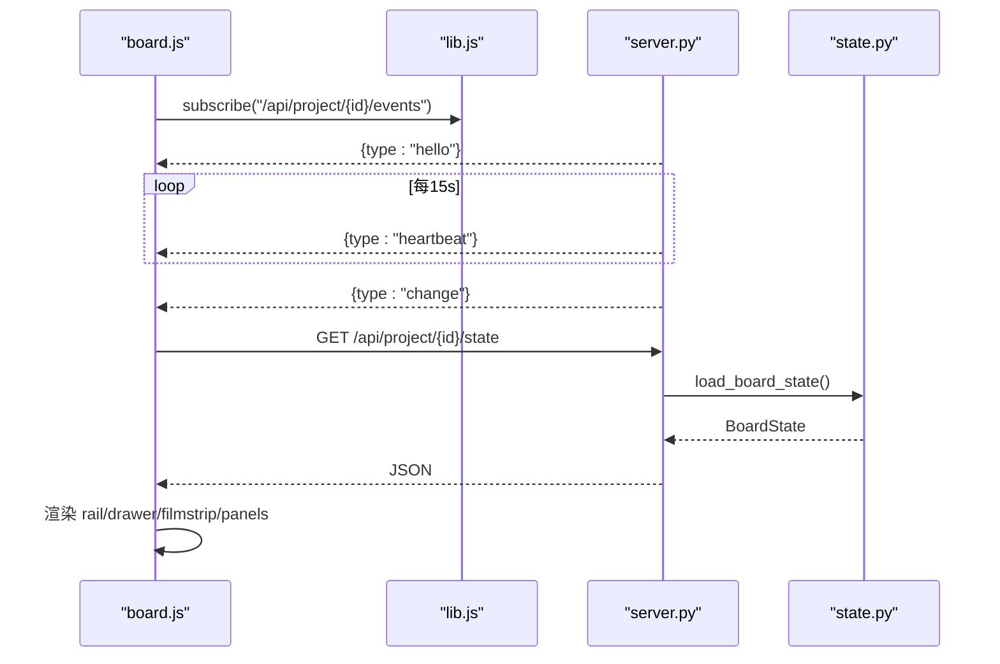
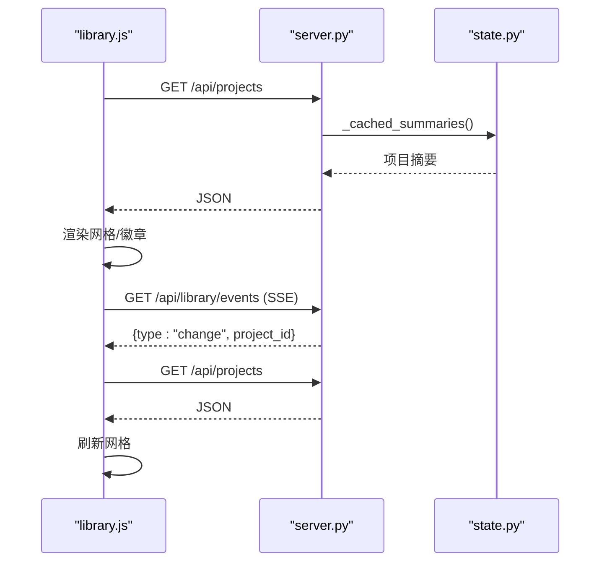
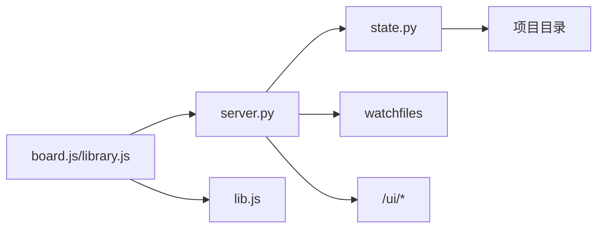

# Web界面系统

<cite>
**本文引用的文件**
- [server.py](file://backlot/server.py)
- [state.py](file://backlot/state.py)
- [index.html](file://backlot/ui/index.html)
- [board.html](file://backlot/ui/board.html)
- [lib.js](file://backlot/ui/lib.js)
- [board.js](file://backlot/ui/board.js)
- [library.js](file://backlot/ui/library.js)
- [board.css](file://backlot/ui/board.css)
- [README.md](file://backlot/README.md)
</cite>

## 目录
1. [简介](#简介)
2. [项目结构](#项目结构)
3. [核心组件](#核心组件)
4. [架构总览](#架构总览)
5. [详细组件分析](#详细组件分析)
6. [依赖关系分析](#依赖关系分析)
7. [性能考虑](#性能考虑)
8. [故障排查指南](#故障排查指南)
9. [结论](#结论)
10. [附录](#附录)

## 简介
Backlot 是一个基于 FastAPI 的本地 Web 看板系统，用于“活体分镜”与项目库视图。它通过读取项目磁盘产物（检查点、事件、制品、媒体等）生成可渲染状态，并以 HTML 模板 + 前端 JS 的方式呈现；同时提供 SSE 实时推送，使浏览器在后台进程变化时自动刷新。核心能力包括：
- 项目库视图：展示所有项目的摘要卡片、实时状态、最近活动
- 项目看板视图：阶段轨道、剧本预览、故事板胶片条、质量指标、成本进度、活动流
- 实时数据更新：SSE 心跳与变更合并，避免频繁重拉
- 静态资源管理：UI 模板与 CSS/JS 版本化缓存控制
- 媒体服务：缩略图缓存、范围请求播放、安全路径校验

## 项目结构
- 后端服务：FastAPI 应用、路由、SSE 事件中心、文件系统监听、缩略图生成
- 状态层：从项目目录聚合 stage、artifacts、storyboard、media、events、cost 等
- 前端页面：
  - 库视图 index.html + library.js
  - 看板视图 board.html + board.js
  - 共享工具 lib.js
  - 样式 board.css
- 资源：HTML 模板由服务端注入带时间戳的静态资源 URL，确保开发期即时生效

图表来源
- [server.py:165-307](file://backlot/server.py#L165-L307)
- [state.py:588-683](file://backlot/state.py#L588-L683)
- [README.md:14-33](file://backlot/README.md#L14-L33)

章节来源
- [server.py:165-307](file://backlot/server.py#L165-L307)
- [state.py:588-683](file://backlot/state.py#L588-L683)
- [README.md:14-33](file://backlot/README.md#L14-L33)

## 核心组件
- FastAPI 应用与路由
  - 健康检查、项目列表、项目状态、SSE 事件流、媒体与缩略图、UI 页面
- 变更中心 ChangeHub
  - 订阅/发布模型，按项目过滤，队列限流与去抖
- 状态聚合器 state.py
  - 管线元信息、阶段轨道、制品、故事板、媒体扫描、成本与活跃度、海报选择
- 前端库 lib.js
  - JSON 获取、DOM 构建、格式化、SSE 订阅封装、媒体/缩略图 URL 构造
- 看板 board.js
  - 头部信息、阶段轨道、审批门、剧本预览、故事板胶片条、决策与活动面板
- 库视图 library.js
  - 项目卡片网格、实时计数与状态徽章、SSE 驱动刷新

章节来源
- [server.py:165-307](file://backlot/server.py#L165-L307)
- [state.py:588-683](file://backlot/state.py#L588-L683)
- [lib.js:1-104](file://backlot/ui/lib.js#L1-L104)
- [board.js:1-800](file://backlot/ui/board.js#L1-L800)
- [library.js:1-92](file://backlot/ui/library.js#L1-L92)

## 架构总览
后端以 FastAPI 为中心，暴露 REST API 与 SSE 事件流；状态层只读解析项目目录产物；前端通过 EventSource 订阅变更并增量刷新 UI。媒体访问通过安全路径校验与缩略图缓存提升体验。

图表来源
- [server.py:174-240](file://backlot/server.py#L174-L240)
- [server.py:132-149](file://backlot/server.py#L132-L149)
- [state.py:588-683](file://backlot/state.py#L588-L683)

## 详细组件分析

### 后端服务与路由（FastAPI）
- 生命周期与监听
  - 启动时创建 watchfiles 任务，关闭时取消；忽略 node_modules/.git/__pycache__ 等噪声路径
- API
  - /api/health：健康检查
  - /api/projects：返回项目摘要（含 live、last_activity、stage_states 等）
  - /api/project/{id}/state：返回完整 BoardState
  - /api/project/{id}/events：SSE 事件流（hello/heartbeat/change），按项目过滤
  - /api/library/events：全局 SSE 事件流（库视图用）
- 媒体与缩略图
  - /media/{project_id}/{path}：范围请求直出，路径安全校验
  - /thumb/{project_id}/{path}?w=...：图片缩放或视频首帧提取，JPEG 缓存到 .backlot/thumbs
- UI 模板与缓存
  - /p/{project_id}：渲染 board.html，注入带 mtime 的版本参数
  - /：渲染 index.html，注入 board.css 与 library.js
  - 中间件对 / 与 /ui、/p 强制 no-cache，便于开发期热更新

图表来源
- [server.py:165-307](file://backlot/server.py#L165-L307)
- [server.py:242-276](file://backlot/server.py#L242-L276)
- [server.py:325-365](file://backlot/server.py#L325-L365)

章节来源
- [server.py:165-307](file://backlot/server.py#L165-L307)
- [server.py:242-276](file://backlot/server.py#L242-L276)
- [server.py:325-365](file://backlot/server.py#L325-L365)

### 状态聚合（BoardState）
- 管线与阶段
  - 从 manifest 或回退阶段定义构建阶段轨道；支持 gated 人工审批门
  - 历史版本与当前 checkpoint 合并为 history_entries，支持回放
- 制品与故事板
  - 从 artifacts/*.json 与 checkpoint 内嵌 artifacts 组装
  - 故事板卡片 = scene_plan × script × asset_manifest，结合 events 判断生成中
- 媒体扫描
  - renders、snapshots、music 等目录扫描，按扩展名分类
- 成本与活跃度
  - cost_snapshot 优先，否则回退到 manifest 总计
  - last_activity 基于 checkpoint/events/artifacts 的 mtime
  - live 窗口与 stalled 检测（长时间无活动标记）
- 海报选择
  - 优先场景图像，其次快照，再常见目录图片，最后取最新渲染首帧

图表来源
- [state.py:63-94](file://backlot/state.py#L63-L94)
- [state.py:145-224](file://backlot/state.py#L145-L224)
- [state.py:246-266](file://backlot/state.py#L246-L266)
- [state.py:403-495](file://backlot/state.py#L403-L495)
- [state.py:502-562](file://backlot/state.py#L502-L562)
- [state.py:588-683](file://backlot/state.py#L588-L683)

章节来源
- [state.py:63-94](file://backlot/state.py#L63-L94)
- [state.py:145-224](file://backlot/state.py#L145-L224)
- [state.py:246-266](file://backlot/state.py#L246-L266)
- [state.py:403-495](file://backlot/state.py#L403-L495)
- [state.py:502-562](file://backlot/state.py#L502-L562)
- [state.py:588-683](file://backlot/state.py#L588-L683)

### 前端库与通用工具（lib.js）
- getJSON：统一 fetch 与错误抛出
- el：轻量 DOM 节点工厂，支持属性与事件绑定
- 格式化工具：时长、金额、相对时间、ISO 时间
- 媒体 URL：mediaURL、thumbURL（带 w 参数）
- SSE 订阅：subscribe(url, onChange)，内部节流合并 burst
- 波形可视化：waveBars（伪随机条形）
- 阶段图标映射：STAGE_ICONS

章节来源
- [lib.js:1-104](file://backlot/ui/lib.js#L1-L104)

### 看板视图（board.html + board.js）
- 主题切换：dark/light 模式，持久化至 localStorage
- 头部信息：管线类型、场景数与总时长、风格策略、等待人工审批、停滞警告、成本进度条
- 阶段轨道：点击展开抽屉查看制品详情、评审指标、版本数、时间戳
- 审批门：当某阶段 awaiting_human 时，渲染审批区域，汇总各制品关键信息与提示
- 剧本预览：脚本卡片，支持展开全屏阅读
- 故事板胶片条：
  - 生成中：闪烁占位与工具标注
  - 已批准：图片/视频缩略图，失败回退到 shot spec
  - 多 take：缩略图导航
  - 旁白音频：波形条与播放
- 右侧面板：决策日志（归类、修订标记）、活动流（start/finish/error 配对显示）
- 模态框：剧本与旁白全文展示

图表来源
- [board.js:1-800](file://backlot/ui/board.js#L1-L800)
- [lib.js:65-81](file://backlot/ui/lib.js#L65-L81)
- [server.py:178-212](file://backlot/server.py#L178-L212)
- [state.py:588-683](file://backlot/state.py#L588-L683)

章节来源
- [board.html:1-16](file://backlot/ui/board.html#L1-L16)
- [board.js:1-800](file://backlot/ui/board.js#L1-L800)

### 库视图（index.html + library.js）
- 项目卡片网格：海报缩略图、管线类型、场景/渲染数量、最近活动时间
- 实时徽章：LIVE/IDLE，等待人工审批高亮
- SSE 驱动刷新：订阅 /api/library/events，收到 change 后重新拉取 /api/projects
- 静态模式：URL 参数 ?static=1 禁用 SSE

图表来源
- [library.js:1-92](file://backlot/ui/library.js#L1-L92)
- [server.py:174-176](file://backlot/server.py#L174-L176)
- [server.py:214-240](file://backlot/server.py#L214-L240)
- [state.py:85-108](file://backlot/state.py#L85-L108)

章节来源
- [index.html:1-27](file://backlot/ui/index.html#L1-L27)
- [library.js:1-92](file://backlot/ui/library.js#L1-L92)

### 样式与主题（board.css）
- 深色/浅色主题变量体系，通过 data-theme 切换
- 胶片条、阶段轨道、审批区、剧本卡片、活动流的视觉规范
- 动画：入场上升、脉冲、闪烁、能量流动效果
- 滚动条、噪点背景、渐变与阴影增强质感

章节来源
- [board.css:1-800](file://backlot/ui/board.css#L1-L800)

## 依赖关系分析
- 模块耦合
  - server.py 依赖 state.py 进行状态聚合，依赖 watchfiles 进行变更监听
  - 前端 board.js/library.js 依赖 lib.js 的工具函数
  - 前端通过 REST/SSE 与后端交互，不直接访问文件系统
- 外部依赖
  - FastAPI、asyncio、watchfiles、PIL、ffmpeg（缩略图）
- 潜在循环依赖
  - 无直接循环；状态层仅读，服务层负责调度
- 集成点
  - 文件系统路径安全校验（防止越权访问）
  - SSE 心跳与队列合并，避免风暴
  - 缩略图缓存目录权限与并发写入保护

图表来源
- [server.py:165-307](file://backlot/server.py#L165-L307)
- [state.py:588-683](file://backlot/state.py#L588-L683)
- [lib.js:1-104](file://backlot/ui/lib.js#L1-L104)

章节来源
- [server.py:165-307](file://backlot/server.py#L165-L307)
- [state.py:588-683](file://backlot/state.py#L588-L683)
- [lib.js:1-104](file://backlot/ui/lib.js#L1-L104)

## 性能考虑
- 懒加载与缓存
  - 图片使用 loading="lazy"，缩略图按需生成并缓存 JPEG
  - 媒体播放使用原生 range 请求，减少带宽
- 事件合并与节流
  - SSE 队列最大容量限制，burst 合并，心跳保活
  - 前端 subscribe 内置 250ms 节流，降低重绘频率
- 计算优化
  - 项目摘要缓存（_summary_cache），变更时失效
  - 管线元信息 lru_cache，避免重复解析
- 内存与 I/O
  - 事件读取限制行数（limit=250），避免大文件拖慢
  - 文件系统扫描排除噪声目录，减少 IO
- 建议
  - 在大项目下可考虑分页或虚拟滚动（若场景增多）
  - 缩略图尺寸可按视口自适应，减少过大图片传输
  - 对 SSE 连接数做上限与超时清理（当前已具备断开检测）

[本节为通用指导，无需特定文件引用]

## 故障排查指南
- 常见问题
  - 项目不存在或路径非法：/safe_project_dir 校验会返回 400/404
  - 媒体缺失：缩略图不可用时回退到 spec 占位；视频无首帧则 404
  - SSE 断连：EventSource 自动重连；检查心跳与队列是否满
  - 卡顿或无刷新：确认 watchfiles 可用；必要时手动刷新
- 定位步骤
  - 检查 /api/health 是否可达
  - 打开浏览器网络面板，观察 /api/project/{id}/events 是否持续收到 heartbeat/change
  - 查看项目目录下 checkpoint_*.json、events.jsonl、artifacts 是否存在且可读
  - 验证缩略图缓存目录权限与 ffmpeg/PIL 可用性
- 相关实现参考
  - 路径安全校验与错误码
  - SSE 心跳与去抖逻辑
  - 缩略图生成与回退策略

章节来源
- [server.py:310-318](file://backlot/server.py#L310-L318)
- [server.py:183-240](file://backlot/server.py#L183-L240)
- [server.py:242-276](file://backlot/server.py#L242-L276)
- [server.py:325-365](file://backlot/server.py#L325-L365)

## 结论
Backlot 将“只读状态聚合 + 实时事件推送 + 富交互前端”有机结合，提供了面向制作流程的可视化看板。其设计强调健壮性（降级与容错）、实时性（SSE 心跳与合并）与性能（缓存与懒加载）。通过清晰的模块划分与安全的资源访问控制，既适合本地快速迭代，也便于在生产环境中稳定运行。

[本节为总结，无需特定文件引用]

## 附录

### 界面定制与扩展指南
- CSS 样式修改
  - 通过 board.css 的 CSS 变量调整主题色、字体、间距与阴影
  - 使用 data-theme="light" 切换浅色模式
- JavaScript 功能扩展
  - 在 lib.js 中添加通用工具函数，供 board.js/library.js 复用
  - 在 board.js 中新增组件或交互逻辑，遵循 el 工厂与事件绑定模式
  - 在 library.js 中扩展项目卡片内容或筛选逻辑
- 新组件开发
  - 新增 HTML 片段与对应 JS 渲染函数
  - 如需 SSE 数据，使用 subscribe 订阅相应事件端点
  - 注意性能：避免在高频回调中进行昂贵计算，必要时加入节流/防抖

[本节为通用指导，无需特定文件引用]

### 前后端通信协议
- REST API
  - /api/health、/api/projects、/api/project/{id}/state
- SSE 事件
  - /api/project/{id}/events：{type:"hello"/"heartbeat"/"change"}
  - /api/library/events：全局变更通知
- 文件上传下载
  - 当前实现为只读媒体访问（/media、/thumb），未提供上传接口
  - 如需上传，可在 server.py 新增 POST 路由与存储逻辑，并触发 hub.publish 以刷新前端

章节来源
- [server.py:170-240](file://backlot/server.py#L170-L240)
- [lib.js:65-81](file://backlot/ui/lib.js#L65-L81)